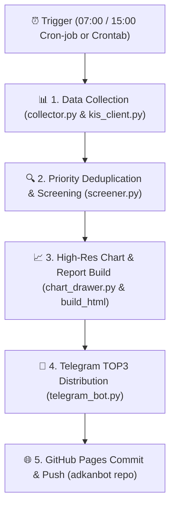

# 🏗️ 연구3 시스템 아키텍처 (ARCHITECTURE_연구3.md)

본 문서는 `adkan연구3` 프로젝트의 전체 기술 스택, 폴더 구조, 3대 핵심 매매 전략의 메커니즘, 5단계 파이프라인 데이터 흐름 및 리스크 관리 수칙을 정의합니다.

---

## 1. 기술 스택 (Tech Stack)

- **언어 및 프레임워크**: Python 3.9+
- **증권 OpenAPI 연동**: 한국투자증권(KIS Developers) OpenAPI (OAuth2 Access Token 발급 및 모의투자/실전 API 통신)
- **주식 시세 & 수급 데이터**: `FinanceDataReader` (FDR), `pykrx` (KRX 거래대금 상위 500개 종목 & 320일 OHLCV, 투자자별 순매수)
- **차트 시각화 엔솔로지**: `mplfinance`, `matplotlib` (한국 주식 전용 양봉/음봉 색상, 이평선 레이어링, 폰트 가독성 보정)
- **알림 & 배포 서비스**: Telegram Bot API (HTML 메시지 + 차트 PNG 전송), GitHub Pages / Git Remote (자동 sync & push)
- **자동화 인프라**: macOS `crontab` (07:00 장전 / 15:00 장중), `cron-job.org`, GitHub Repository Dispatch Trigger

---

## 2. 폴더 구조 (Directory Structure)

```
adkan연구3/
├── .env                         # 🔒 KIS API Key & Telegram Token (보안 자격증명)
├── .token_cache.json            # 🔑 KIS OAuth2 Access Token 캐시
├── AGENTS_연구3.md               # 🤖 에이전트 모듈 역할 및 가이드 (AGENTS.md)
├── ARCHITECTURE_연구3.md         # 🏗️ 시스템 아키텍처 및 전략 명세 (현재 문서)
│
├── run_screening_pipeline.py    # ★ [마스터 파이프라인] 수집 ➔ 차트 ➔ 보고서 ➔ 텔레그램 ➔ Git Push
├── main.py                      # CLI 통합 실행기
├── collector.py                 # 데이터 수집 모듈 (FDR, pykrx)
├── screener.py                  # 3대 전략 조건검색 엔진
├── chart_drawer.py              # mplfinance 이평선 시각화 모듈
├── kis_client.py                # 한국투자증권 API 통신 클라이언트
├── telegram_bot.py              # 텔레그램 알림 배포 봇
├── config.py                    # 전략 파라미터 및 상수 설정
│
├── 2026-08-01_스크리닝.md        # 📄 마크다운 종합 배포 보고서
├── 2026-08-01_스크리닝_종합보고서.html # 🌐 인터랙티브 HTML 다크모드 웹 보고서
├── 실전플랜1.md                 # 📖 실전플랜1 전략 수칙 및 매매 가이드
├── live_trading_simulation_report.md # 📊 20거래일 시뮬레이션 성과 보고서
│
├── charts/                      # 📈 포착 종목 고해상도 맞춤 이평선 차트 PNG 디렉토리
├── tests/                       # 🧪 유닛/통합 테스트 모듈 (test_*.py)
├── backtests/                   # 📊 시뮬레이션 & 백테스트 분석 엔진
└── archive/                     # 📦 과거 일회성 검증 스크립트 이력 아카이브
    └── scratch_history/         # 단발성 test_*, check_*, print_* 30여 개 보존
```

---

## 3. 3대 핵심 매매 전략 명세 (Trading Strategy Specifications)

### 🔵 전략 1 — 양-음-양 눌림목 & 사윗감 매매
- **포착 자금 비중**: 슬롯당 **3%** (최대 3종목 = 총 9%)
- **핵심 조건**:
  1. 거래대금 상위 종목 중 최근 20일 이내 상한가 또는 +15% 이상 장대양봉 기준봉 발생
  2. 기준봉 이후 거래량이 급감하며 3일, 5일, 8일, 13일, 20일 이동평균선에 정밀 눌림목 형성 (이격도 지지)
  3. **사윗감 패턴**: 상한가/장대양봉 다음 음봉에서 거래량이 급격히 소멸된 매도 세력 고갈 형태
- **가격 및 익절 전략**:
  - **진입**: 장중 지정가 저가 대기 (1차 30% / 2차 70%)
  - **목표가**: **+5.0%** 익절 예약
  - **손절가**: 지지선 하향 이탈 (-3.0% 수준)

### 🟡 전략 2 — 일일봉 매집봉 & 이일홍 기법
- **포착 자금 비중**: 슬롯당 **10%** (1종목 = 총 10%)
- **핵심 조건**:
  1. 과거(1개월 전) 200억원 이상 거래대금 터진 강력한 매집봉 형성
  2. 이후 가격 조정을 거쳐 장기 추세선인 **240일 이동평균선(-0.20%)**에 정밀 접지
  3. 20일, 120일, 240일 이동평균선 수렴 후 상방 돌파 신호
- **가격 및 익절 전략**:
  - **진입**: 240일선 가격 1차 종배 / 지정가 대기 (1차 30% / 2차 70%)
  - **목표가**: **+3.0% ~ +5.0%** 익절
  - **손절가**: 240일선 이탈 (-3.2%)

### 🟢 전략 3 — 수급 & 핥 기법 (수급 낙폭과대 바닥형)
- **포착 자금 비중**: 슬롯당 **10%** (최대 2종목 = 총 20%)
- **핵심 조건**:
  1. 52주 고점 대비 주가가 40% 이상 하락한 과도한 낙폭과대 구간 (`Close <= High_52w * 0.66`)
  2. 최근 20일간 메이저 기관/외국인 누적 순매수가 강력하게 유입되며 주가 바닥 형성
  3. 주요 이동평균선(60일, 120일, 240일선)을 핥으며 지지력 입증
- **가격 및 익절 전략**:
  - **진입**: 스크리닝 당일 종가배팅 (30%) ➔ 다음 거래일 장중 저가 대기 (70%)
  - **목표가**: **+3.0%** 즉시 예약 매도
  - **손절가**: -4.0% 하향 이탈

---

## 4. 5단계 파이프라인 데이터 흐름 (Pipeline Data Flow)



1. **[Trigger]**: macOS `crontab` (매일 07:00 / 15:00) 또는 `cron-job.org` HTTP Webhook 호출
2. **[Data Collection]**: `collector.py`가 거래대금 상위 500개 종목 320일 일봉 수집 및 `kis_client.py`가 실시간 시세/수급 데이터 로드
3. **[Deduplication & Screening]**: `seen_codes` 알고리즘을 통해 **전략 1 ➔ 전략 2 ➔ 전략 3** 순으로 종목을 스캔하고 단 하나의 우선순위 전략에만 독점 배치 (중복 완벽 방지)
4. **[Chart & Report Build]**: `chart_drawer.py`가 확대된 폰트와 맞춤 이평선이 그려진 차트 17종 PNG 생성 ➔ MD 및 HTML 종합 보고서 빌드
5. **[Distribution & Deploy]**: `telegram_bot.py`가 각 전략 TOP3 메시지 및 차트 전송 ➔ `adkanbot` 깃허브 저장소로 복사 후 `git commit & push` 실행하여 배포 완수

---

## 5. 실전 매매 운영 수칙 (Execution & Risk Rules)

- **첫 거래일 진입**: **2026년 8월 3일 (월요일)**
- **만기 자동 청산**: 손절/익절 미도달 포지션은 T+2일 (**2026년 8월 5일 수요일 15:20**) 전량 종가 강제 청산
- **지수 폭락 리스크 필터**: 8/3 장 시작 전 KOSPI/KOSDAQ 지수 선물 **-3.0% 이상 폭락 개장 시 신규 진입 즉시 중단** 및 2차 대기 주문 취소
