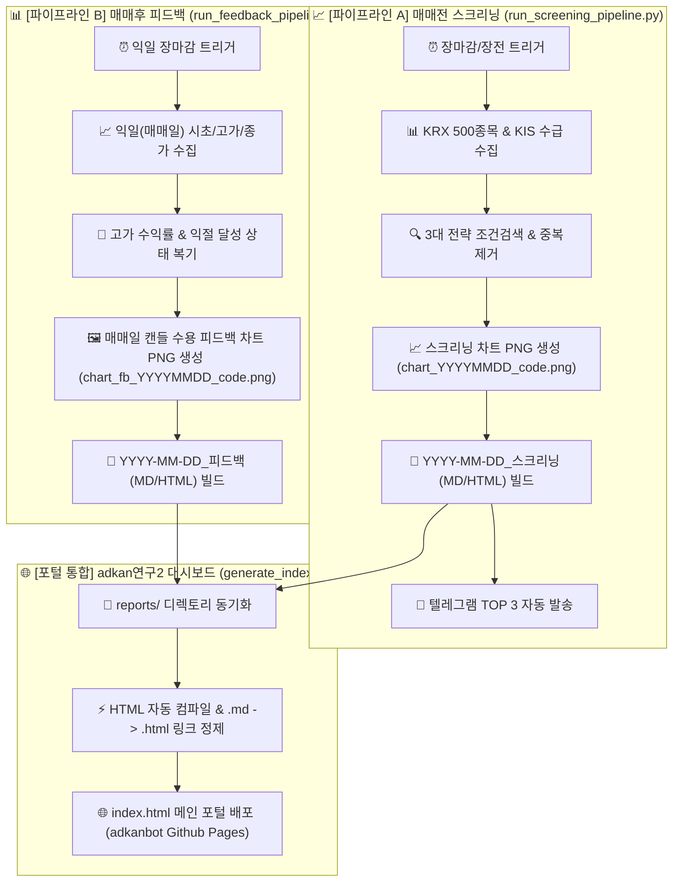

# 🏗️ 연구3 시스템 아키텍처 (ARCHITECTURE_연구3.md)

본 문서는 `adkan연구3` 프로젝트의 전체 기술 스택, 폴더 구조, 3대 핵심 매매 전략의 메커니즘, 5단계 파이프라인 데이터 흐름 및 리스크 관리 수칙을 정의합니다.

---

## 1. 기술 스택 (Tech Stack)

- **언어 및 프레임워크**: Python 3.9+
- **증권 OpenAPI 연동**: 한국투자증권(KIS Developers) OpenAPI (OAuth2 Access Token 발급 및 모의투자/실전 API 통신)
- **주식 시세 & 수급 데이터**: `FinanceDataReader` (FDR), `pykrx` (KRX 거래대금 상위 500개 종목 & 320일 OHLCV, 투자자별 순매수)
- **차트 시각화 엔솔로지**: `mplfinance`, `matplotlib` (한국 주식 전용 양봉/음봉 색상, 이평선 레이어링, 폰트 가독성 보정)
- **알림 & 배포 서비스**: Telegram Bot API (HTML 메시지 + 차트 PNG 전송), GitHub Pages / Git Remote (자동 sync & push)
- **자동화 인프라**: macOS `crontab` (07:00 장전 / 15:00 장중), `cron-job.org`, GitHub Repository Dispatch Trigger

---

## 2. 폴더 구조 (Directory Structure)

```
adkan연구3/
├── .env                         # 🔒 KIS API Key & Telegram Token (보안 자격증명)
├── .token_cache.json            # 🔑 KIS OAuth2 Access Token 캐시
├── AGENTS_연구3.md               # 🤖 에이전트 모듈 역할 및 가이드
├── ARCHITECTURE_연구3.md         # 🏗️ 시스템 아키텍처 및 전략 명세 (현재 문서)
│
├── run_screening_pipeline.py    # ★ [매매전 스크리닝 마스터] 수집 ➔ 스크리닝 ➔ 차트 ➔ 텔레그램 ➔ Git Push
├── trade_agent.py               # ★ [08:50 AM 매매 판단 에이전트] 지수선물 + 갭상승필터 + 오전뉴스 ➔ 주문제어
├── run_feedback_pipeline.py     # ★ [매매후 피드백 마스터] 익일 시세 추적 ➔ 당일 캔들 차트 ➔ 피드백 리포트 ➔ Git Push
├── news_momentum_parser.py      # ★ [뉴스 가중치 파서] 장전 리포트/섹터 모멘텀 가중치(+1.5점/+0.8점) 추출
├── main.py                      # CLI 통합 실행기
├── collector.py                 # 데이터 수집 모듈 (FDR, pykrx)
├── screener.py                  # 3대 전략 조건검색 엔진
├── chart_drawer.py              # mplfinance 이평선 시각화 모듈
├── kis_client.py                # 한국투자증권 API 통신 클라이언트
├── telegram_bot.py              # 텔레그램 알림 배포 봇
├── config.py                    # 전략 파라미터 및 상수 설정
│
├── reports/                     # 📄 전용 스크리닝 및 피드백 보고서 저장소 디렉토리 (MD & HTML)
├── charts/                      # 📈 포착 종목 및 매매일 차트 PNG 디렉토리
├── tests/                       # 🧪 유닛/통합 테스트 모듈 (test_*.py)
├── backtests/                   # 📊 시뮬레이션 & 백테스트 분석 엔진
└── archive/                     # 📦 과거 일회성 검증 스크립트 이력 아카이브
```

---

## 3. 3대 핵심 매매 전략 명세 (Trading Strategy Specifications)

### 🔵 전략 1 — 양-음-양 눌림목 & 사윗감 매매
- **포착 자금 비중**: 슬롯당 **3%** (최대 3종목 = 총 9%)
- **핵심 조건**:
  1. **★ ADK특 (핵심 반등 1순위)**: `A and B and !C and D and !E and (F or G) and !H and !I and !J and !K and !L and !M and N`  
     *(20봉내 400억+ 거래대금, Envelope(13,6) 상한 돌파 후 13~20일선 수렴 이격 지지 강한 반등)*
  2. **양음양 & 사윗감 (2순위)**: 최근 20일 이내 상한가 또는 +15% 이상 장대양봉 발생 후 3/5/8/13/20일선 거래소멸 음봉 지지
- **가격 및 익절 전략**:
  - **진입**: 장중 지정가 저가 대기 (1차 30% / 2차 70%)
  - **목표가**: **+5.0%** 익절 예약
  - **손절가**: 지지선 하향 이탈 (-3.0% 수준)

### 🟡 전략 2 — 일일봉 매집봉 & 이일홍 기법
- **포착 자금 비중**: 슬롯당 **10%** (1종목 = 총 10%)
- **핵심 절대 조건 수칙 (Kiwoom Absolute Formula)**:
  - **`A and B and C and D and E and (F or G or H or I or J) and K and N and O and P and Q and !S`**
  - **Stage 1 (키움 정석)**: 40봉내 50억 거래(A) + 40봉 최고종가 95% 근접(B) + 60일선 우상향(C) + 종가 +5%(D) + 속양봉 +5%(E) + 5일내 10일선 지지 1회 이상(F~J) + 거래대금 10억(K) + 5/20선 10% 수렴(N) + 20/60선 15% 수렴(O) + 시가 5선 105% 이하(P) + 시가 60선 105% 이하(Q) + 직전 2일 6%+ 연타 제외(!S)
  - **Stage 2 (폴백)**: 240일 이동평균선(-0.20%) 정밀 접지 및 이평선 수렴 조건
- **가격 및 익절 전략**:
  - **진입**: 240일선 가격 1차 종배 / 지정가 대기 (1차 30% / 2차 70%)
  - **목표가**: **+3.0% ~ +5.0%** 익절
  - **손절가**: 240일선 이탈 (-3.2%)

### 🟢 전략 3 — 수급 & 핥 기법 (수급 낙폭과대 바닥형)
- **포착 자금 비중**: 슬롯당 **10%** (최대 2종목 = 총 20%)
- **핵심 조건**:
  1. 52주 고점 대비 주가가 40% 이상 하락한 과도한 낙폭과대 구간 (`Close <= High_52w * 0.66`)
  2. 최근 20일간 메이저 기관/외국인 누적 순매수가 강력하게 유입되며 주가 바닥 형성
  3. 주요 이동평균선(60일, 120일, 240일선)을 핥으며 지지력 입증
- **가격 및 익절 전략**:
  - **진입**: 스크리닝 당일 종가배팅 (30%) ➔ 다음 거래일 장중 저가 대기 (70%)
  - **목표가**: **+3.0%** 즉시 예약 매도
  - **손절가**: -4.0% 하향 이탈

---

## 4. 이원화 파이프라인 아키텍처 및 포털 데이터 흐름 (Dual Pipeline Architecture)



1. **[파이프라인 A: 매매전 스크리닝]**:
   - `run_screening_pipeline.py`가 500개 종목을 스캔하고 전략 간 중복을 제거하여 `YYYY-MM-DD_스크리닝` 보고서와 차트 PNG를 생성하고 텔레그램 알림을 발송합니다.
2. **[파이프라인 B: 매매후 성과 피드백]**:
   - `run_feedback_pipeline.py`가 익일 장 마감 후 전일 포착 종목의 실제 시세(시초가, 최고가, 종가)를 추적하여 고가 수익률 및 익절 달성 여부를 판정하고, **매매 당일 일봉이 포함된 피드백 차트 PNG** 및 `YYYY-MM-DD_피드백` 보고서를 독립 작성합니다.
3. **[포털 통합 & 웹 배포]**:
   - `generate_index.py`가 `reports/` 내의 스크리닝 및 피드백 보고서를 취합하여 `.md` ➔ `.html` 링크를 연결하고 `index.html` 대시보드를 구축하여 `adkanbot` 저장소에 자동 푸시합니다.

---

## 5. 실전 매매 운영 수칙 (Execution & Risk Rules)

- **첫 거래일 진입**: **2026년 8월 3일 (월요일)**
- **🚨 1. 08:50분 장전 동시호가 & 포털 아카이브 최우선 필터 수칙**:
  - **1순위 (아카이브 일정)**: `adkan연구2` 포털 아카이브 DB 스캔 ➔ 유상증자, 권리락, 전환사채, 보호예수해제 일정 걸릴 경우 🛑 **매수 전면 최우선 즉시 취소** (`CANCEL_PRECOLLECTED_RISK_SCHEDULE`).
  - **2순위 (갭상승 필터)**: 동시호가 예상 갭상승률 `exp_gap_pct >= +3.0%` 시 🛑 **시초가 매수 취소 & 눌림목 지정가 전환**.
  - **3순위 (지수 선물)**: 지수 선물 `index_futures_pct <= -3.0%` 시 신규 매수 전면 거부.
  - **4순위 (목표가 상향 리포트 특급 가산점)**: `adkan연구2` 일정 파이프라인에서 자동 수집된 `broker_upgrades.csv`를 조회하여 목표가 상승률 20% 이상 리포트 존재 시 🚀 **특급 매수 승인** (`BUY_STRONG_APPROVED`).
- **🚨 2. 장중 30분 주기 모니터링 수칙 (09:30 ~ 14:30 매 30분)**:
  - **지수 급락 감시**: 이전 30분전 지수 대비 `-2.0%` 이상 급락 붕괴 시 미체결 매수 대기 주문 즉시 취소 (`CANCEL_INDEX_COLLAPSE_30M`).
  - **5~6개 종목 DART 공시/뉴스 스캔**: 유상증자, 횡령, 배임, 소송 등 악재 키워드 발생 시 대기 주문 취소.
  - **전략별 차등 후순위 교체 매수 (`REPLACE_BUY_CANDIDATE`)**:
    - 전략 1 (양음양): **4위 이하 종목** | 전략 2 (240일선): **2위 이하 종목** | 전략 3 (수급주): **3위 이하 종목**
    - 검증: `현재가 <= 목표지지선 * 1.005` AND `갭상승률 < +3.0%` 충족 시 후순위 종목으로 주문 교체 집행.
  - **미체결 2시간 타임아웃 (`CANCEL_TIMEOUT_2H`)**: 발주 후 `120분` 초과 미체결 시 취소 & 예수금 회수.
- **🚨 3. 장마감 매수 집행 모드 (`--mode closing`, 15:25 PM)**:
   - 15:10분 스크리너 포착 종목 중 당일 상승률 `< +20.0%` 미만 검증
   - KIS API 종가베팅(30% 비중) 매수 예약 집행 & 15:25분 텔레그램 브리핑 전송
- **만기 자동 청산**: 손절/익절 미도달 포지션은 T+2일 (**2026년 8월 5일 수요일 15:20**) 전량 종가 강제 청산.
