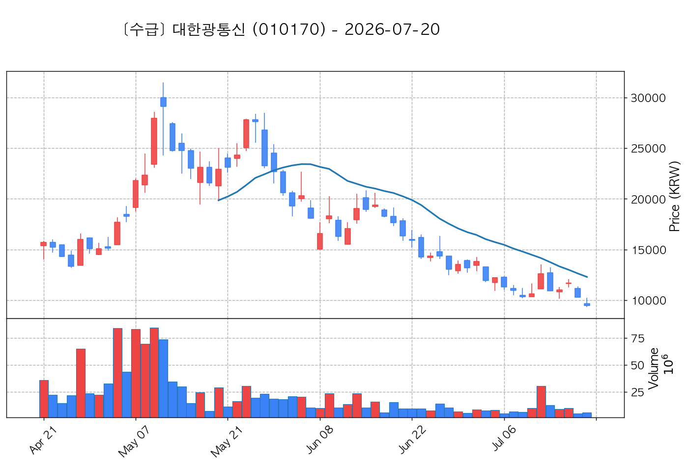

# 📈 [실전플랜 1] 2026-07-20 (월) 매매 후보 스크리닝 보고서

> 스크리닝 기준일: 2026-07-20 (월) | 진입 예정일: 2026-07-21 (화) | [📊 익일 매매 성과 피드백 보고서 보기](./2026-07-21_피드백.md)

---

## 📊 1. 스크리닝 요약
- **전략 1 (양-음-양 눌림목)**: 12개 포착
- **전략 2 (일일봉 매집봉)**: 3개 포착
- **전략 3 (수급 낙폭과대 바닥형)**: 2개 포착
- **총 포착 수**: 17개 종목 (TOP 선택 6개)

---

## 🔵 1. 전략 1 — 양-음-양 눌림목 (3% × 3슬롯)

#### 1) 한미반도체 (042700) — ★ TOP 1 선택 (사윗감)

- **기준 종가**: 222,000원 | **거래대금**: 1756억
- **분석 사유**: 과거 2026-07-15 기준봉 후 현재 8일선 지지 (사윗감형)

#### 2) 대원전선 (006340) — ★ TOP 2 선택

- **기준 종가**: 10,940원 | **거래대금**: 355억
- **분석 사유**: 과거 2026-07-10 기준봉 후 현재 20일선 지지

#### 3) 대덕전자 (353200) — ★ TOP 3 선택

- **기준 종가**: 120,700원 | **거래대금**: 1363억
- **분석 사유**: 과거 2026-07-15 기준봉 후 현재 8일선 지지

#### 4) 다스코 (058730) — 후보군

- **기준 종가**: 4,360원 | **거래대금**: 393억
- **분석 사유**: 과거 2026-07-15 기준봉 후 현재 13일선 지지

#### 5) 제주반도체 (080220) — 후보군

- **기준 종가**: 78,000원 | **거래대금**: 836억
- **분석 사유**: 과거 2026-07-15 기준봉 후 현재 5일선 지지

#### 6) 티에스이 (131290) — 후보군

- **기준 종가**: 258,500원 | **거래대금**: 365억
- **분석 사유**: 과거 2026-07-10 기준봉 후 현재 8일선 지지

#### 7) 삼성공조 (006660) — 후보군

- **기준 종가**: 12,560원 | **거래대금**: 658억
- **분석 사유**: 과거 2026-07-16 기준봉 후 현재 3일선 지지

#### 8) 금호타이어 (073240) — 후보군 (사윗감)

- **기준 종가**: 6,100원 | **거래대금**: 360억
- **분석 사유**: 과거 2026-07-10 기준봉 후 현재 3일선 지지 (사윗감형)

#### 9) HLB (028300) — 후보군

- **기준 종가**: 30,550원 | **거래대금**: 391억
- **분석 사유**: 과거 2026-07-15 기준봉 후 현재 5일선 지지

#### 10) 온코닉테라퓨틱스 (476060) — 후보군

- **기준 종가**: 13,240원 | **거래대금**: 143억
- **분석 사유**: 과거 2026-07-16 기준봉 후 현재 3일선 지지

#### 11) 현대약품 (004310) — 후보군

- **기준 종가**: 6,220원 | **거래대금**: 361억
- **분석 사유**: 과거 2026-07-14 기준봉 후 현재 5일선 지지

#### 12) 빛과전자 (069540) — 후보군

- **기준 종가**: 2,495원 | **거래대금**: 434억
- **분석 사유**: 과거 2026-07-10 기준봉 후 현재 5일선 지지

## 🟡 2. 전략 2 — 일일봉 매집봉 (10% × 1슬롯)

#### 1) HPSP (403870) — ★ TOP 1 선택

- **기준 종가**: 39,500원 | **거래대금**: 867억
- **분석 사유**: 과거 2026-06-15 매집봉 ➔ 240일선 근접 지지 (+0.62%)

#### 2) 테크윙 (089030) — 후보군

- **기준 종가**: 48,550원 | **거래대금**: 728억
- **분석 사유**: 과거 2026-06-09 매집봉 ➔ 240일선 근접 지지 (-2.17%)

#### 3) 네이처셀 (007390) — 후보군

- **기준 종가**: 22,700원 | **거래대금**: 73억
- **분석 사유**: 과거 2026-05-27 매집봉 ➔ 240일선 근접 지지 (-0.55%)

## 🟢 3. 전략 3 — 수급 낙폭과대 바닥형 (10% × 2슬롯)

#### 1) 대한광통신 (010170) — ★ TOP 1 선택

- **기준 종가**: 9,460원 | **거래대금**: 542억
- **분석 사유**: 52주 대비 바닥권(30.0%) ➔ 수급 확인 ➔ N/A일 없음 핥기 및 반등 포착

#### 2) 서진시스템 (178320) — ★ TOP 2 선택

- **기준 종가**: 36,600원 | **거래대금**: 233억
- **분석 사유**: 52주 대비 바닥권(43.9%) ➔ 수급 확인 ➔ 2026-07-14일 240일선 핥기 및 반등 포착

