# 📊 [실전플랜 1 피드백] 2026-07-21 매매 성과 추적 보고서

> 스크리닝 포착일: 2026-07-20 (월) | 실제 매매(추적일): 2026-07-21 (화)

---

## 📊 1. 당일 매매 성과 요약
- **포착 및 검증 종목 수**: 총 17개 종목

---

## 🔵 전략 1 — 양-음-양 눌림목 성과

#### 1) 한미반도체 (042700) — ★ TOP 1 선택 | ⏱️ 지지선 유지 (+3.1%)

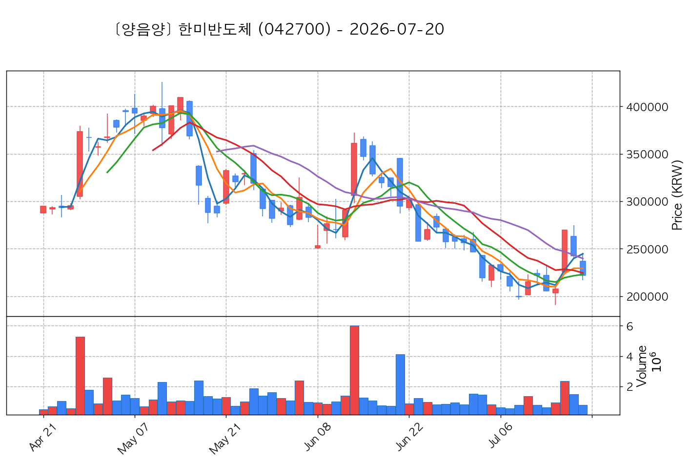

- **전일 종가(기준가)**: 222,000원 ➔ **매매일 시초가**: 223,000원 | **최고가**: 229,000원 (<b>+3.15%</b>) | **종가**: 224,000원 (+0.90%)
- **시세 움직임 복기**: 과거 2026-07-15 기준봉 후 현재 8일선 지지 (사윗감형)

#### 2) 대원전선 (006340) — ★ TOP 2 선택 | ✅ 1차 목표 달성 (+11.1%)

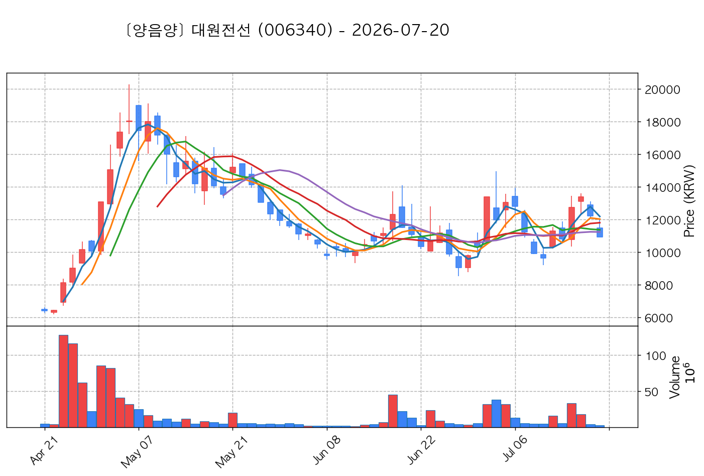

- **전일 종가(기준가)**: 10,940원 ➔ **매매일 시초가**: 10,950원 | **최고가**: 12,150원 (<b>+11.06%</b>) | **종가**: 11,840원 (+8.23%)
- **시세 움직임 복기**: 과거 2026-07-10 기준봉 후 현재 20일선 지지

#### 3) 대덕전자 (353200) — ★ TOP 3 선택 | ✅ 1차 목표 달성 (+7.0%)

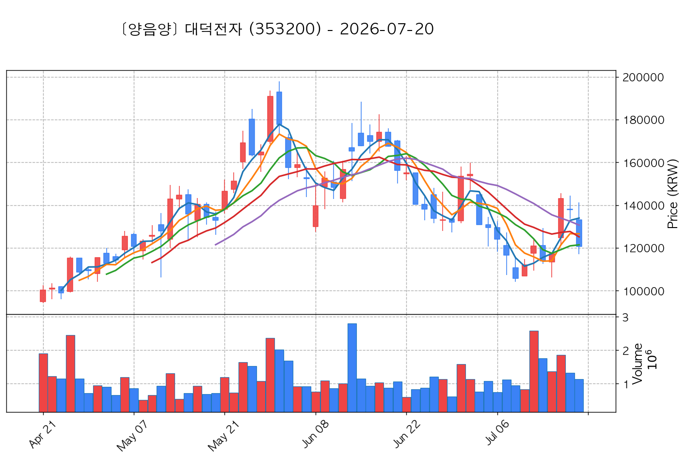

- **전일 종가(기준가)**: 120,700원 ➔ **매매일 시초가**: 126,100원 | **최고가**: 129,200원 (<b>+7.04%</b>) | **종가**: 120,500원 (-0.17%)
- **시세 움직임 복기**: 과거 2026-07-15 기준봉 후 현재 8일선 지지

#### 4) 다스코 (058730) — 후보군 | ✅ 1차 목표 달성 (+8.1%)

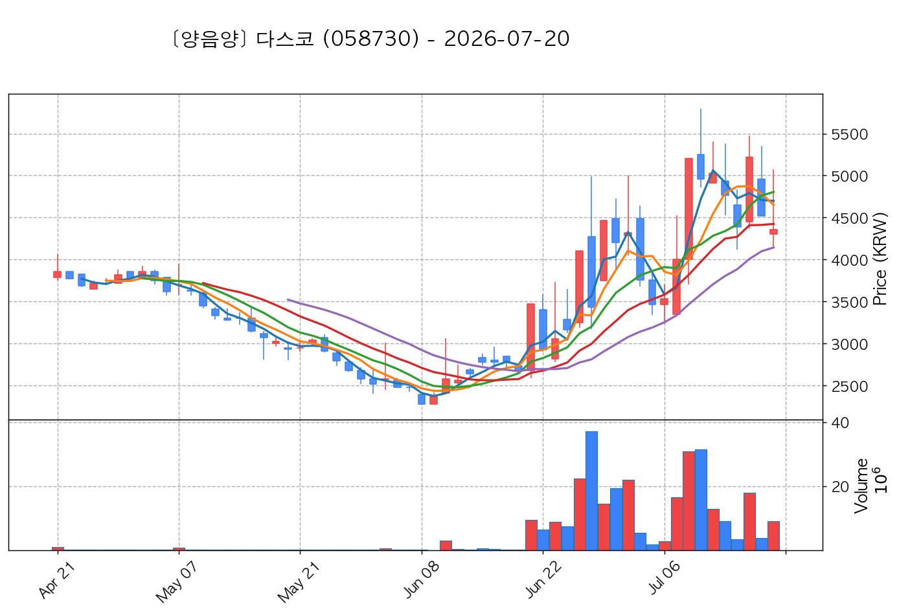

- **전일 종가(기준가)**: 4,360원 ➔ **매매일 시초가**: 4,305원 | **최고가**: 4,715원 (<b>+8.14%</b>) | **종가**: 4,350원 (-0.23%)
- **시세 움직임 복기**: 과거 2026-07-15 기준봉 후 현재 13일선 지지

#### 5) 제주반도체 (080220) — 후보군 | ⏱️ 지지선 유지 (+3.0%)

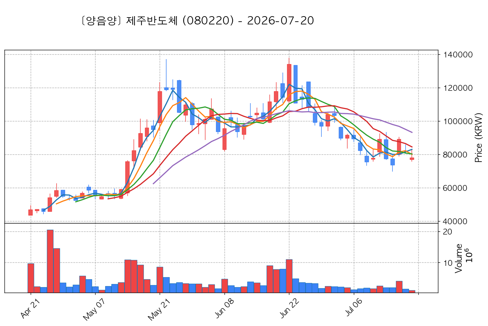

- **전일 종가(기준가)**: 78,000원 ➔ **매매일 시초가**: 77,500원 | **최고가**: 80,300원 (<b>+2.95%</b>) | **종가**: 78,300원 (+0.38%)
- **시세 움직임 복기**: 과거 2026-07-15 기준봉 후 현재 5일선 지지

#### 6) 티에스이 (131290) — 후보군 | ⏱️ 지지선 유지 (+2.5%)

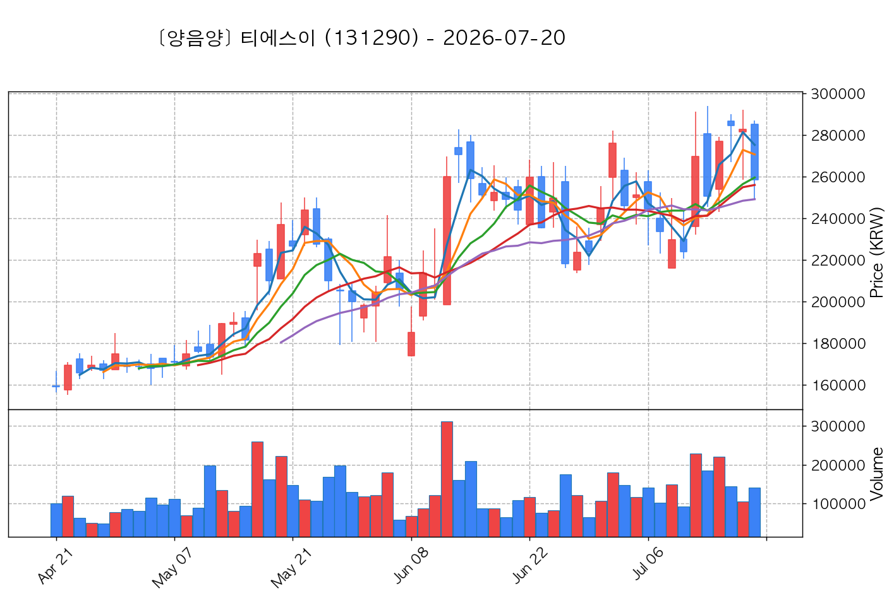

- **전일 종가(기준가)**: 258,500원 ➔ **매매일 시초가**: 255,500원 | **최고가**: 265,000원 (<b>+2.51%</b>) | **종가**: 251,000원 (-2.90%)
- **시세 움직임 복기**: 과거 2026-07-10 기준봉 후 현재 8일선 지지

#### 7) 삼성공조 (006660) — 후보군 | ✅ 1차 목표 달성 (+17.0%)

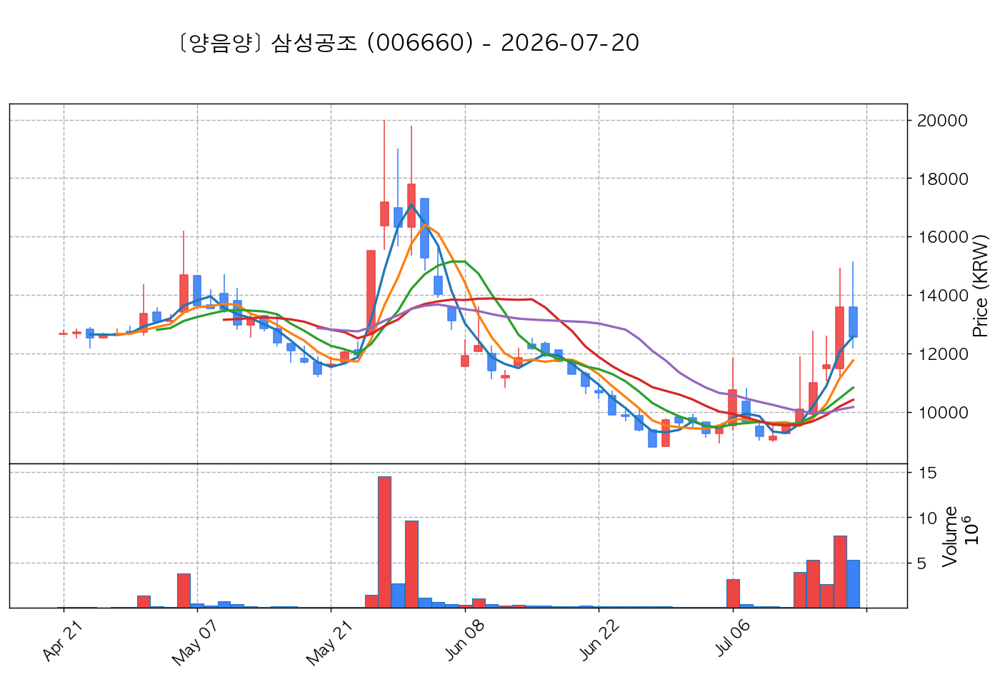

- **전일 종가(기준가)**: 12,560원 ➔ **매매일 시초가**: 12,540원 | **최고가**: 14,700원 (<b>+17.04%</b>) | **종가**: 13,100원 (+4.30%)
- **시세 움직임 복기**: 과거 2026-07-16 기준봉 후 현재 3일선 지지

#### 8) 금호타이어 (073240) — 후보군 | ✅ 1차 목표 달성 (+5.2%)

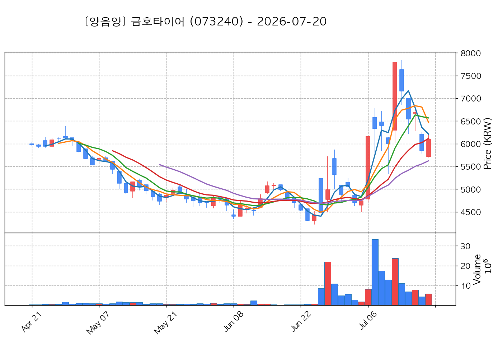

- **전일 종가(기준가)**: 6,100원 ➔ **매매일 시초가**: 6,110원 | **최고가**: 6,420원 (<b>+5.25%</b>) | **종가**: 6,100원 (+0.00%)
- **시세 움직임 복기**: 과거 2026-07-10 기준봉 후 현재 3일선 지지 (사윗감형)

#### 9) HLB (028300) — 후보군 | ✅ 1차 목표 달성 (+8.0%)

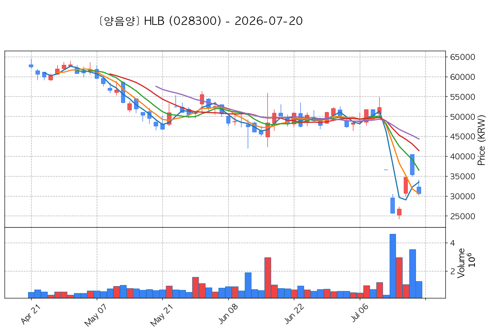

- **전일 종가(기준가)**: 30,550원 ➔ **매매일 시초가**: 31,900원 | **최고가**: 33,000원 (<b>+8.02%</b>) | **종가**: 30,400원 (-0.49%)
- **시세 움직임 복기**: 과거 2026-07-15 기준봉 후 현재 5일선 지지

#### 10) 온코닉테라퓨틱스 (476060) — 후보군 | ❌ 손절 이탈 (-4.1%)

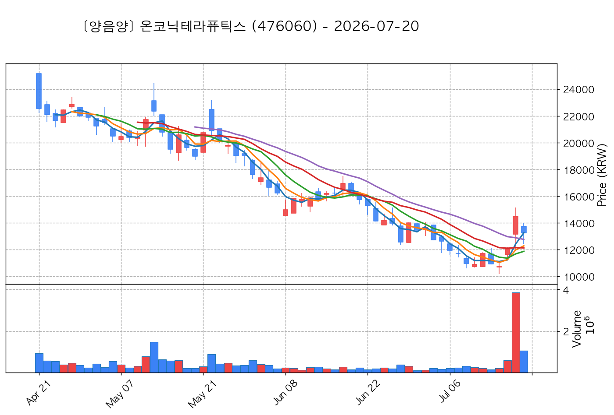

- **전일 종가(기준가)**: 13,240원 ➔ **매매일 시초가**: 12,550원 | **최고가**: 12,700원 (<b>+-4.08%</b>) | **종가**: 11,500원 (-13.14%)
- **시세 움직임 복기**: 과거 2026-07-16 기준봉 후 현재 3일선 지지

#### 11) 현대약품 (004310) — 후보군 | ✅ 1차 목표 달성 (+21.2%)

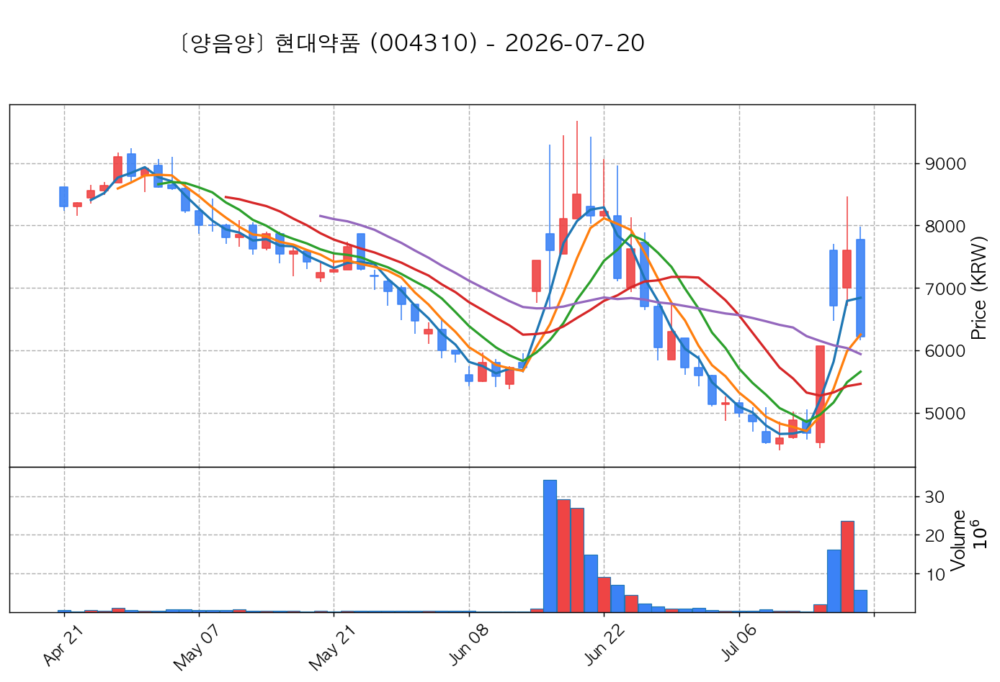

- **전일 종가(기준가)**: 6,220원 ➔ **매매일 시초가**: 6,220원 | **최고가**: 7,540원 (<b>+21.22%</b>) | **종가**: 6,830원 (+9.81%)
- **시세 움직임 복기**: 과거 2026-07-14 기준봉 후 현재 5일선 지지

#### 12) 빛과전자 (069540) — 후보군 | ✅ 1차 목표 달성 (+6.8%)

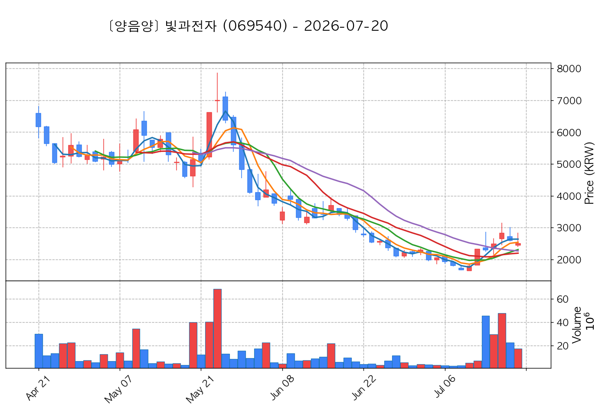

- **전일 종가(기준가)**: 2,495원 ➔ **매매일 시초가**: 2,555원 | **최고가**: 2,665원 (<b>+6.81%</b>) | **종가**: 2,400원 (-3.81%)
- **시세 움직임 복기**: 과거 2026-07-10 기준봉 후 현재 5일선 지지

## 🟡 전략 2 — 일일봉 매집봉 성과

#### 1) HPSP (403870) — ★ TOP 1 선택 | ⏱️ 지지선 유지 (+0.2%)

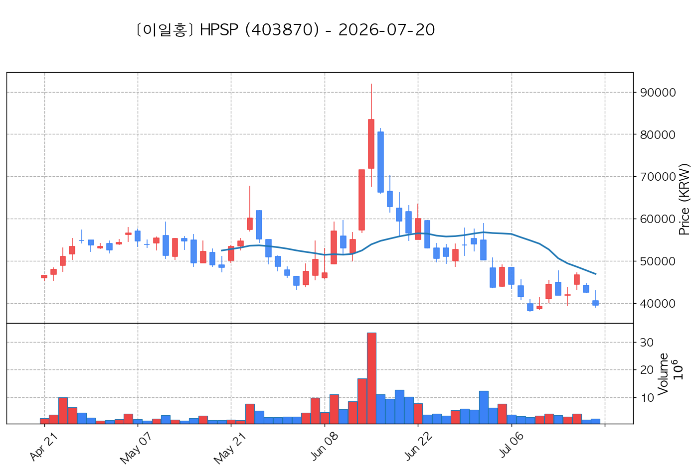

- **전일 종가(기준가)**: 39,500원 ➔ **매매일 시초가**: 39,000원 | **최고가**: 39,600원 (<b>+0.25%</b>) | **종가**: 39,100원 (-1.01%)
- **시세 움직임 복기**: 과거 2026-06-15 매집봉 ➔ 240일선 근접 지지 (+0.62%)

#### 2) 테크윙 (089030) — 후보군 | ❌ 손절 이탈 (-0.7%)

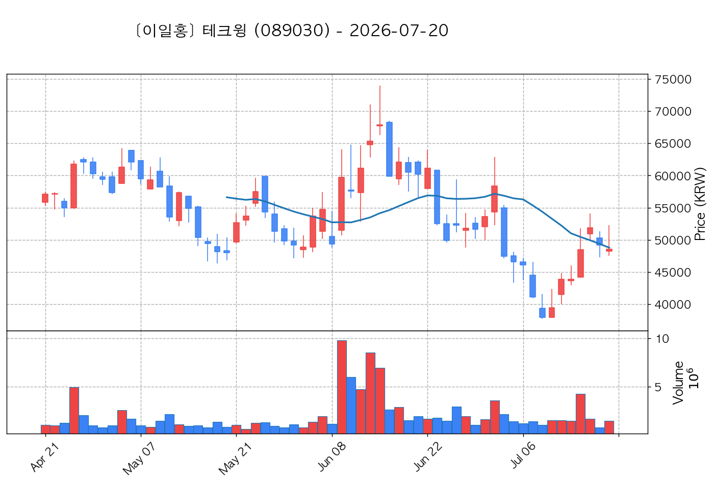

- **전일 종가(기준가)**: 48,550원 ➔ **매매일 시초가**: 47,400원 | **최고가**: 48,200원 (<b>+-0.72%</b>) | **종가**: 46,800원 (-3.60%)
- **시세 움직임 복기**: 과거 2026-06-09 매집봉 ➔ 240일선 근접 지지 (-2.17%)

#### 3) 네이처셀 (007390) — 후보군 | ✅ 1차 목표 달성 (+11.9%)

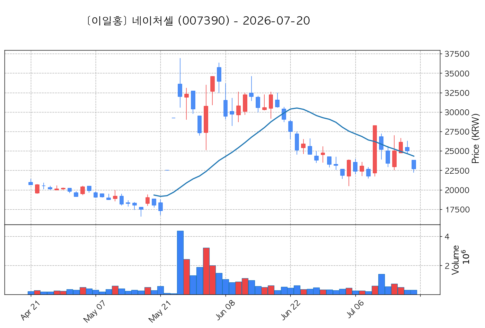

- **전일 종가(기준가)**: 22,700원 ➔ **매매일 시초가**: 22,650원 | **최고가**: 25,400원 (<b>+11.89%</b>) | **종가**: 24,750원 (+9.03%)
- **시세 움직임 복기**: 과거 2026-05-27 매집봉 ➔ 240일선 근접 지지 (-0.55%)

## 🟢 전략 3 — 수급 낙폭과대 바닥형 성과

#### 1) 서진시스템 (178320) — ★ TOP 1 선택 | ⏱️ 지지선 유지 (+0.0%)

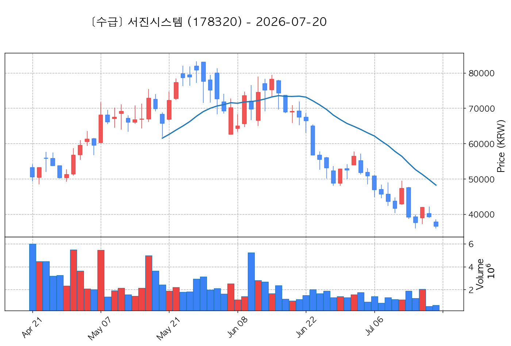

- **전일 종가(기준가)**: 36,600원 ➔ **매매일 시초가**: 35,700원 | **최고가**: 36,600원 (<b>+0.0%</b>) | **종가**: 36,200원 (-1.09%)
- **시세 움직임 복기**: 52주 대비 바닥권(43.9%) ➔ 수급 확인 ➔ 2026-07-14일 240일선 핥기 및 반등 포착

#### 2) 한진칼 (180640) — ★ TOP 2 선택 | ⏱️ 지지선 유지 (+0.8%)

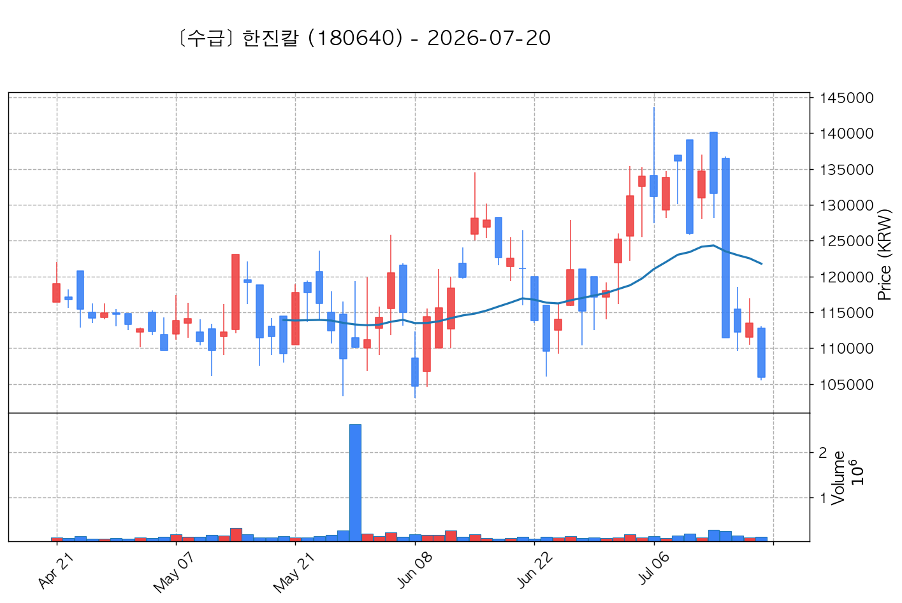

- **전일 종가(기준가)**: 105,900원 ➔ **매매일 시초가**: 106,000원 | **최고가**: 106,700원 (<b>+0.76%</b>) | **종가**: 102,800원 (-2.93%)
- **시세 움직임 복기**: 52주 대비 바닥권(60.2%) ➔ 수급 확인 ➔ 2026-07-16일 240일선 핥기 및 반등 포착

