# 📊 [실전플랜 1 피드백] 2026-07-22 매매 성과 추적 보고서

> 스크리닝 포착일: 2026-07-21 (화) | 실제 매매(추적일): 2026-07-22 (수) | [📈 매매전 스크리닝 보고서 보기](./2026-07-21_스크리닝.html)

---

## 📊 1. 당일 매매 성과 요약
- **포착 및 검증 종목 수**: 총 14개 종목

---

## 🔵 전략 1 — 양-음-양 눌림목 성과

#### 1) SK스퀘어 (402340) — ★ TOP 1 선택 | ✅ 1차 목표 달성 (+11.7%)

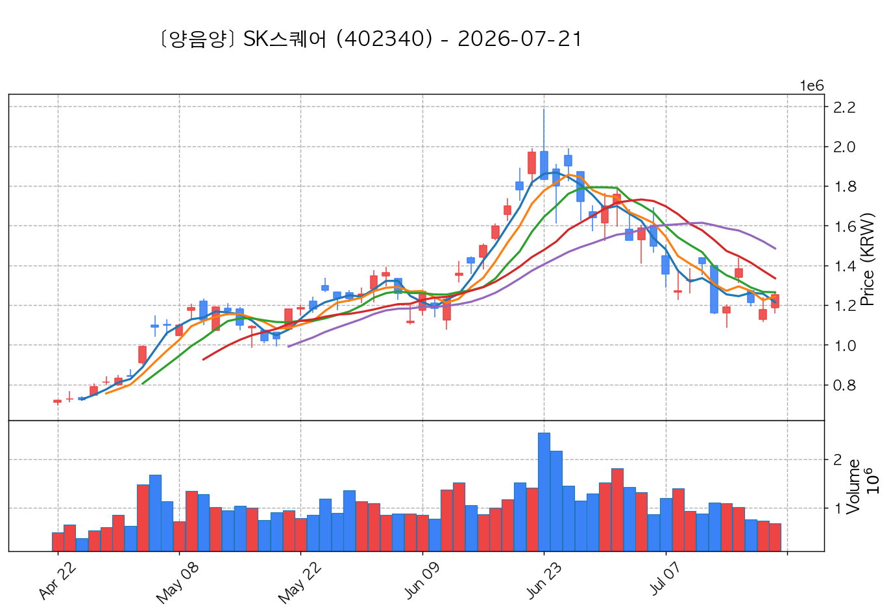

- **전일 종가(기준가)**: 1,253,000원 ➔ **매매일 시초가**: 1,396,000원 | **최고가**: 1,400,000원 (<b>+11.73%</b>) | **종가**: 1,230,000원 (-1.84%)
- **시세 움직임 복기**: 과거 2026-07-15 기준봉 후 현재 5일선 지지

#### 2) 대덕전자 (353200) — ★ TOP 2 선택 | ✅ 1차 목표 달성 (+13.9%)

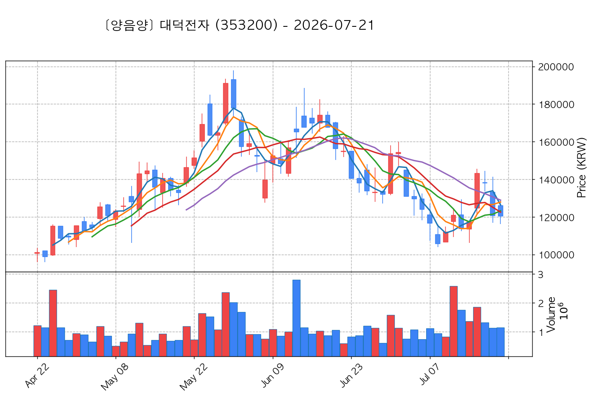

- **전일 종가(기준가)**: 120,500원 ➔ **매매일 시초가**: 126,100원 | **최고가**: 137,300원 (<b>+13.94%</b>) | **종가**: 119,000원 (-1.24%)
- **시세 움직임 복기**: 과거 2026-07-15 기준봉 후 현재 8일선 지지

#### 3) 대원전선 (006340) — ★ TOP 3 선택 | ✅ 1차 목표 달성 (+13.5%)

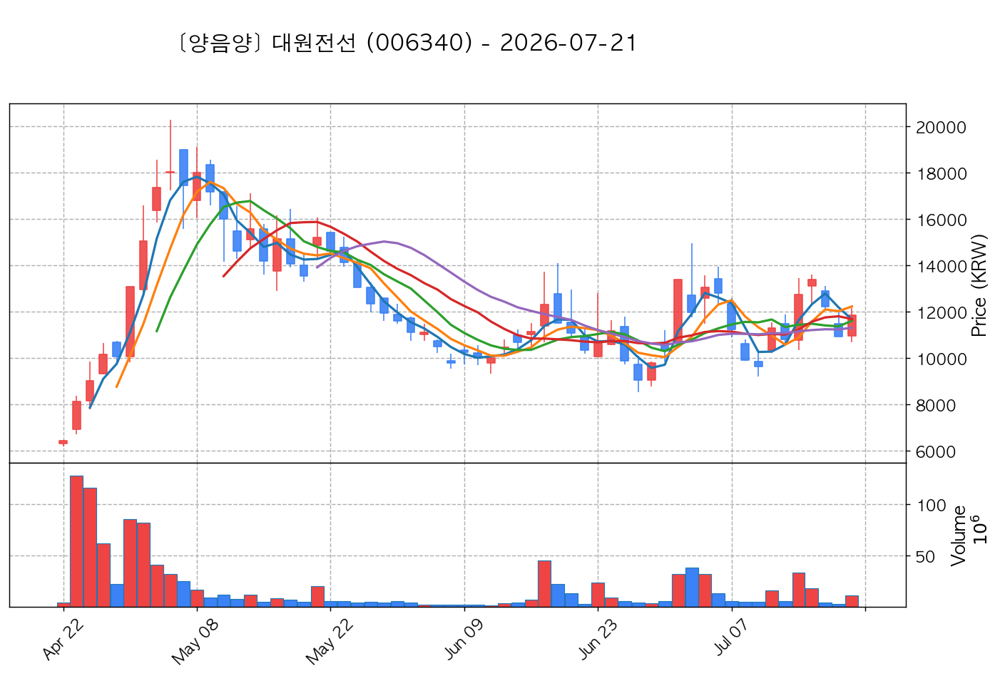

- **전일 종가(기준가)**: 11,840원 ➔ **매매일 시초가**: 12,240원 | **최고가**: 13,440원 (<b>+13.51%</b>) | **종가**: 12,160원 (+2.70%)
- **시세 움직임 복기**: 과거 2026-07-14 기준봉 후 현재 3일선 지지

#### 4) 한미반도체 (042700) — 후보군 | ✅ 1차 목표 달성 (+7.8%)

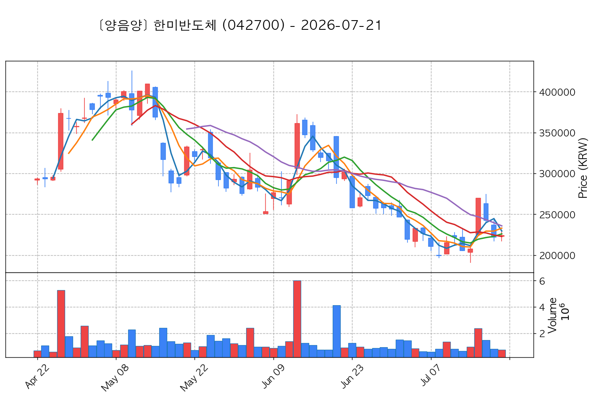

- **전일 종가(기준가)**: 224,000원 ➔ **매매일 시초가**: 237,500원 | **최고가**: 241,500원 (<b>+7.81%</b>) | **종가**: 215,000원 (-4.02%)
- **시세 움직임 복기**: 과거 2026-07-15 기준봉 후 현재 3일선 지지 (사윗감형)

#### 5) 제주반도체 (080220) — 후보군 | ✅ 1차 목표 달성 (+8.3%)

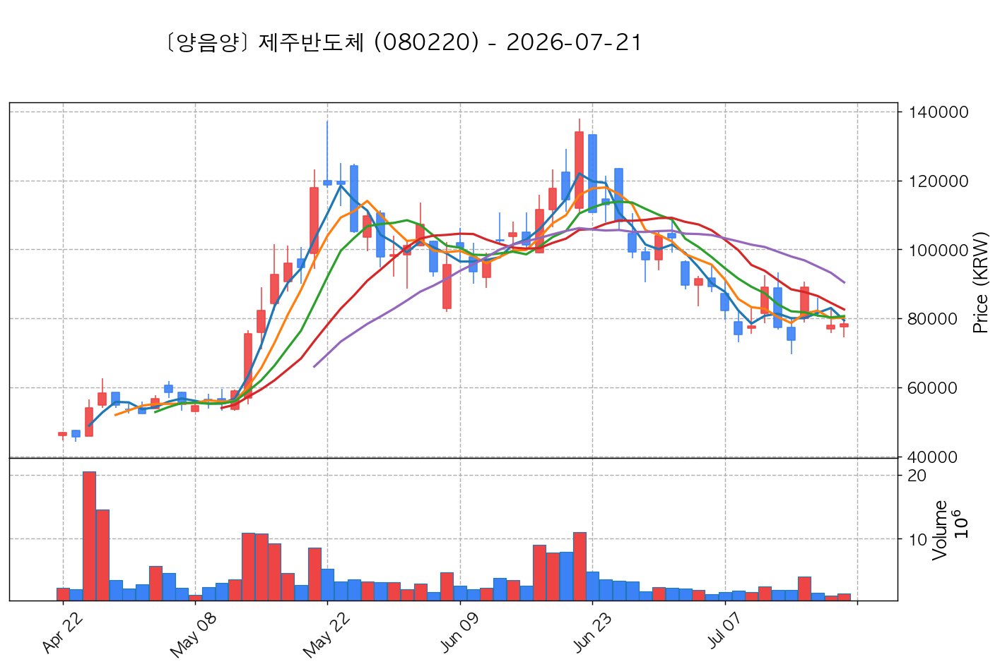

- **전일 종가(기준가)**: 78,300원 ➔ **매매일 시초가**: 83,700원 | **최고가**: 84,800원 (<b>+8.30%</b>) | **종가**: 75,000원 (-4.21%)
- **시세 움직임 복기**: 과거 2026-07-15 기준봉 후 현재 3일선 지지

#### 6) 삼성공조 (006660) — 후보군 | ✅ 1차 목표 달성 (+9.4%)

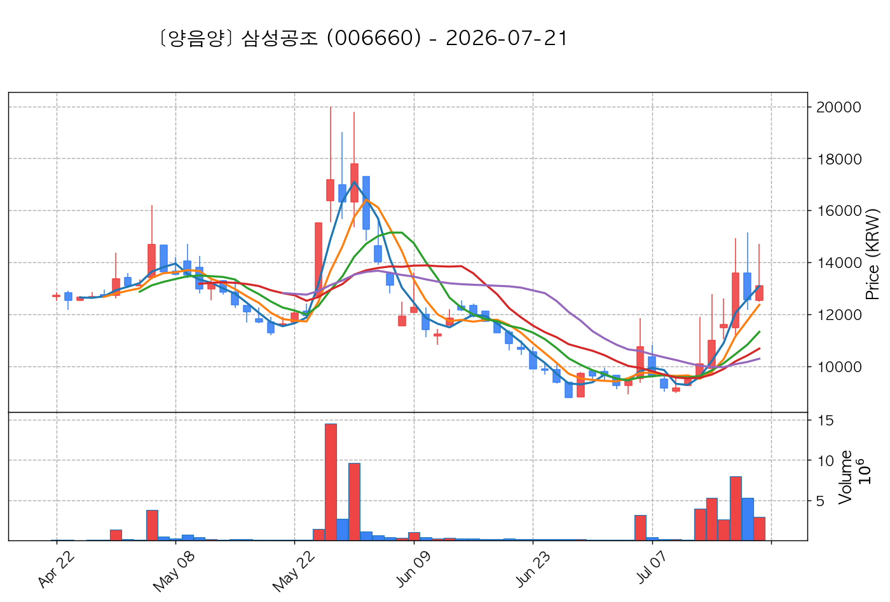

- **전일 종가(기준가)**: 13,100원 ➔ **매매일 시초가**: 13,350원 | **최고가**: 14,330원 (<b>+9.39%</b>) | **종가**: 13,000원 (-0.76%)
- **시세 움직임 복기**: 과거 2026-07-16 기준봉 후 현재 3일선 지지

#### 7) 다스코 (058730) — 후보군 | ✅ 1차 목표 달성 (+10.7%)

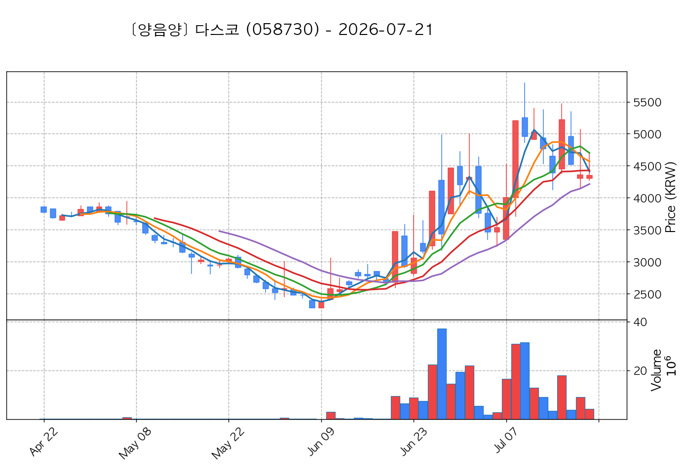

- **전일 종가(기준가)**: 4,350원 ➔ **매매일 시초가**: 4,380원 | **최고가**: 4,815원 (<b>+10.69%</b>) | **종가**: 4,010원 (-7.82%)
- **시세 움직임 복기**: 과거 2026-07-15 기준봉 후 현재 3일선 지지

#### 8) 고려산업 (002140) — 후보군 | ✅ 1차 목표 달성 (+7.8%)

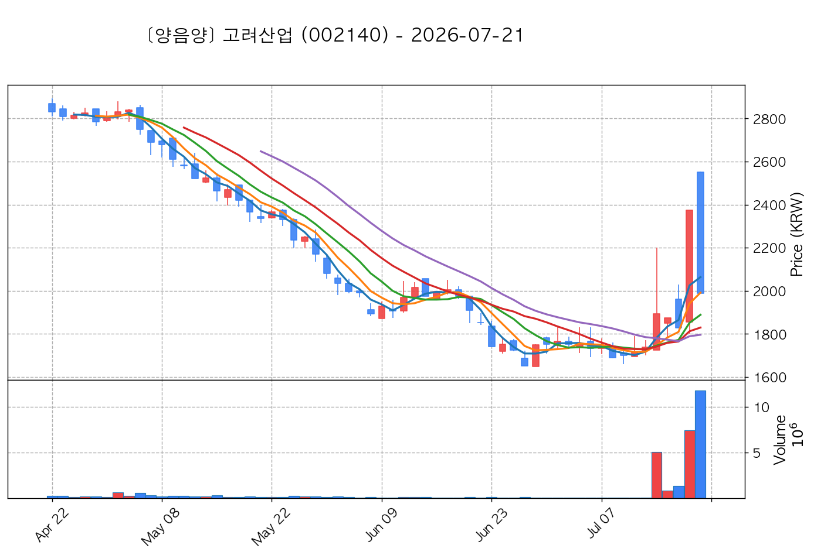

- **전일 종가(기준가)**: 1,989원 ➔ **매매일 시초가**: 1,966원 | **최고가**: 2,145원 (<b>+7.84%</b>) | **종가**: 2,025원 (+1.81%)
- **시세 움직임 복기**: 과거 2026-07-20 기준봉 후 현재 5일선 지지

#### 9) 로킷헬스케어 (376900) — 후보군 | ⏱️ 지지선 유지 (+2.8%)

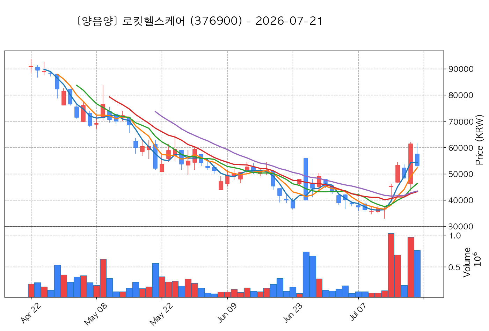

- **전일 종가(기준가)**: 53,100원 ➔ **매매일 시초가**: 52,000원 | **최고가**: 54,600원 (<b>+2.82%</b>) | **종가**: 49,050원 (-7.63%)
- **시세 움직임 복기**: 과거 2026-07-20 기준봉 후 현재 3일선 지지

#### 10) 위닉스 (044340) — 후보군 | ⏱️ 지지선 유지 (+1.0%)

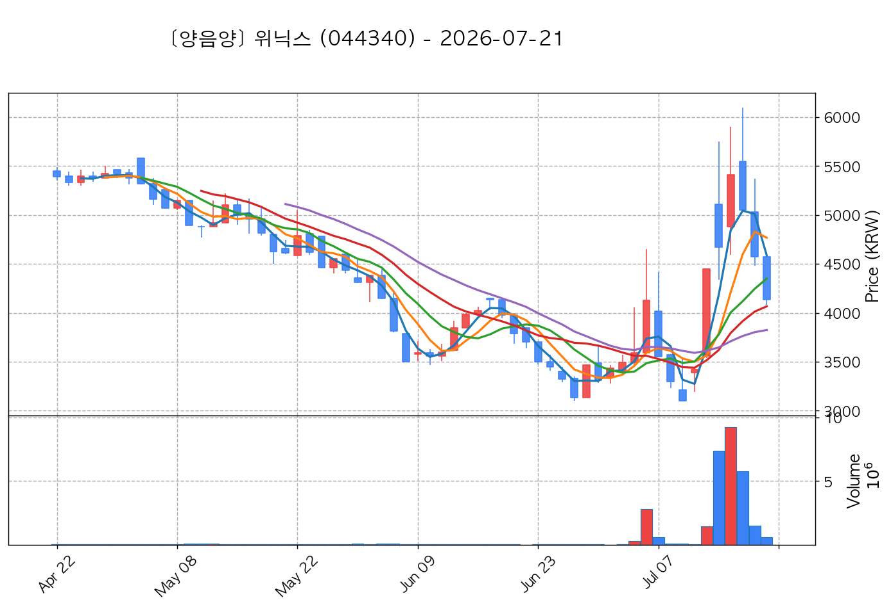

- **전일 종가(기준가)**: 4,135원 ➔ **매매일 시초가**: 4,135원 | **최고가**: 4,175원 (<b>+0.97%</b>) | **종가**: 3,850원 (-6.89%)
- **시세 움직임 복기**: 과거 2026-07-13 기준봉 후 현재 13일선 지지

#### 11) 씨피시스템 (413630) — 후보군 | ✅ 1차 목표 달성 (+21.3%)

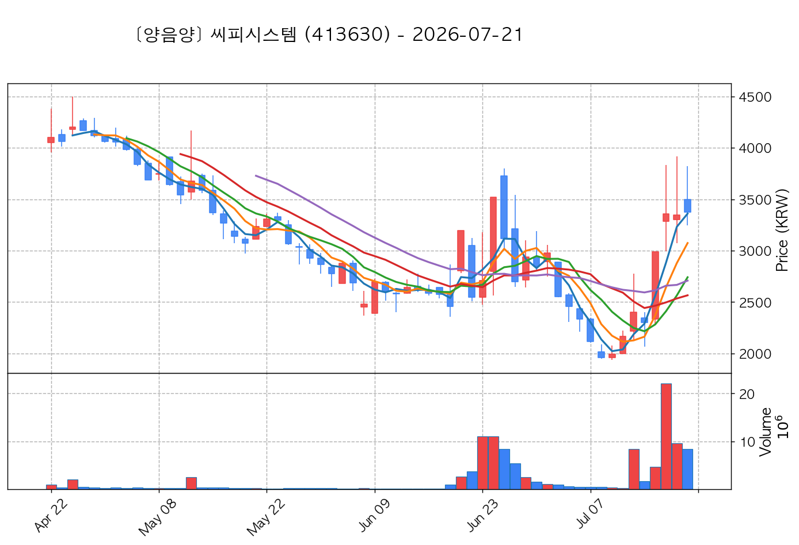

- **전일 종가(기준가)**: 3,375원 ➔ **매매일 시초가**: 3,445원 | **최고가**: 4,095원 (<b>+21.33%</b>) | **종가**: 3,570원 (+5.78%)
- **시세 움직임 복기**: 과거 2026-07-15 기준봉 후 현재 3일선 지지

#### 12) 현대약품 (004310) — 후보군 | ✅ 1차 목표 달성 (+8.6%)

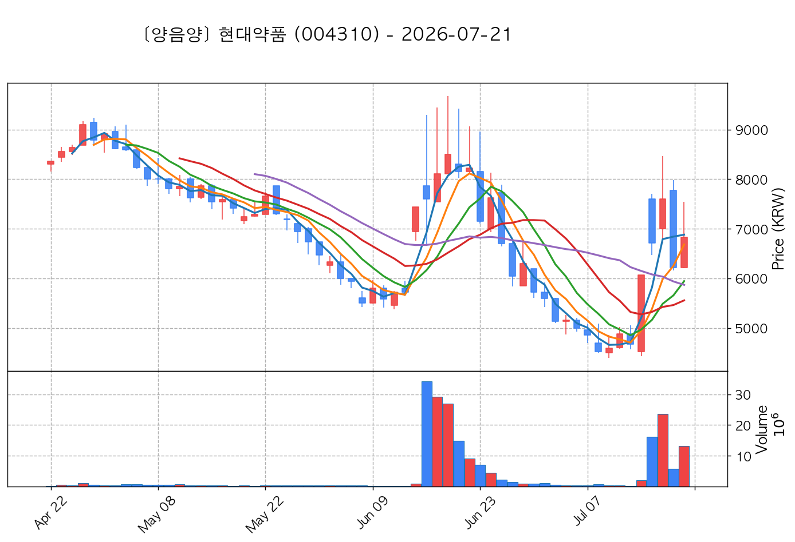

- **전일 종가(기준가)**: 6,830원 ➔ **매매일 시초가**: 6,780원 | **최고가**: 7,420원 (<b>+8.64%</b>) | **종가**: 6,510원 (-4.69%)
- **시세 움직임 복기**: 과거 2026-07-14 기준봉 후 현재 3일선 지지

## 🟡 전략 2 — 일일봉 매집봉 성과

#### 1) HPSP (403870) — ★ TOP 1 선택 | ✅ 1차 목표 달성 (+7.9%)

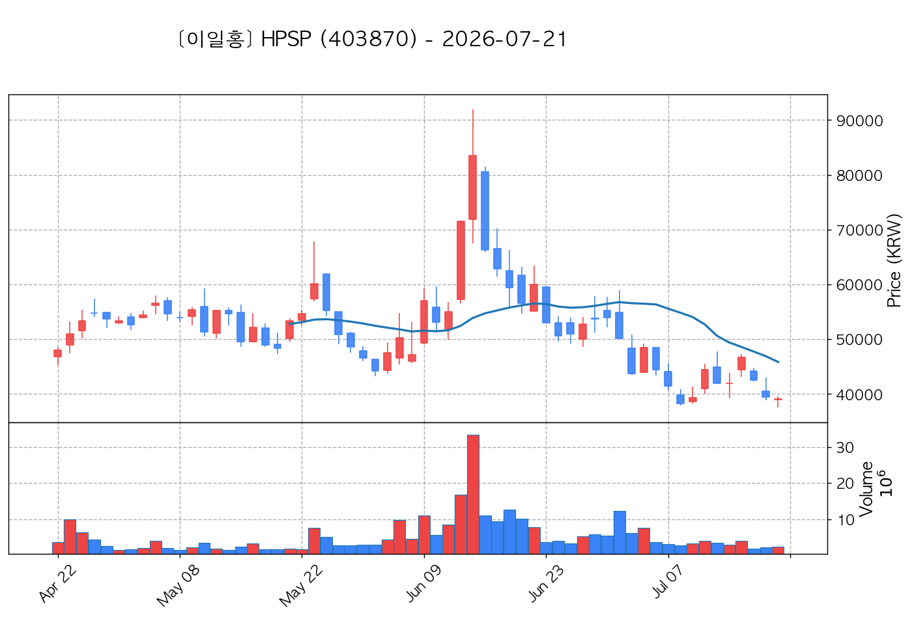

- **전일 종가(기준가)**: 39,100원 ➔ **매매일 시초가**: 40,900원 | **최고가**: 42,200원 (<b>+7.93%</b>) | **종가**: 38,800원 (-0.77%)
- **시세 움직임 복기**: 과거 2026-06-15 매집봉 ➔ 240일선 근접 지지 (-0.55%)

## 🟢 전략 3 — 수급 낙폭과대 바닥형 성과

#### 1) 한화엔진 (082740) — ★ TOP 1 선택 | ✅ 1차 목표 달성 (+12.3%)

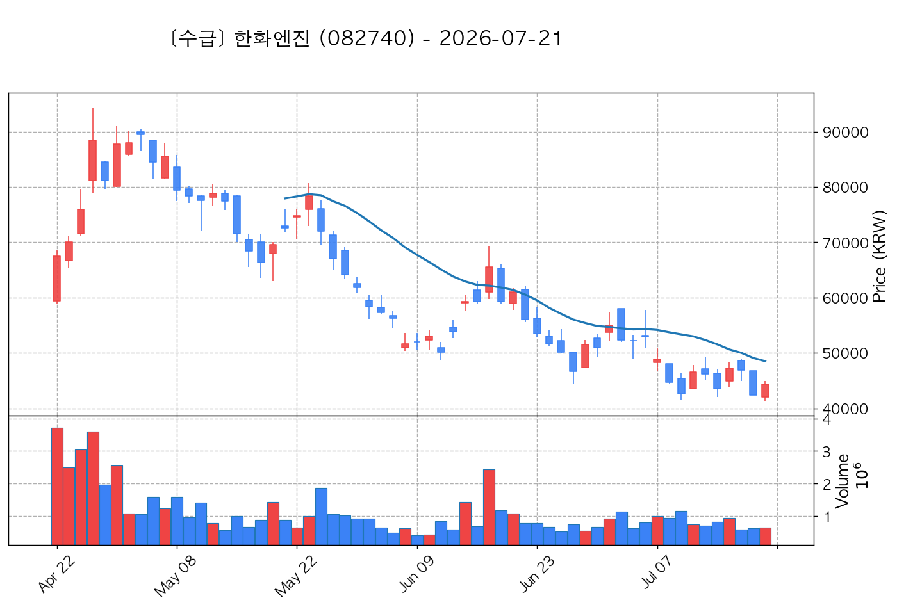

- **전일 종가(기준가)**: 44,400원 ➔ **매매일 시초가**: 45,250원 | **최고가**: 49,850원 (<b>+12.27%</b>) | **종가**: 47,050원 (+5.97%)
- **시세 움직임 복기**: 52주 대비 바닥권(47.0%) ➔ 수급 확인 ➔ N/A일 없음 핥기 및 반등 포착

