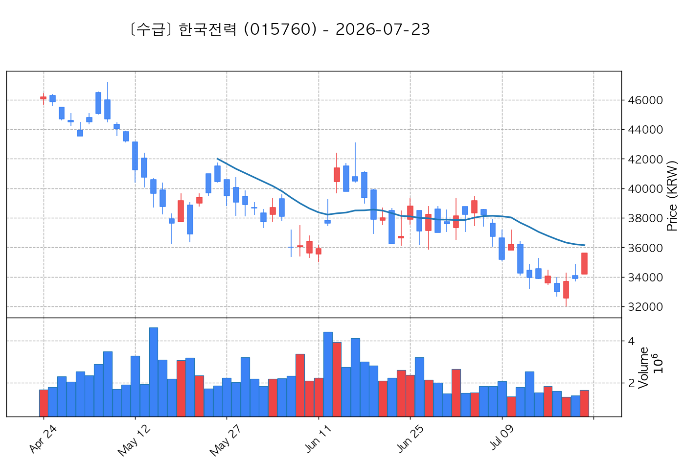

# 📈 [실전플랜 1] 2026-07-23 (목) 매매 후보 스크리닝 보고서

> 스크리닝 기준일: 2026-07-23 (목) | 진입 예정일: 2026-07-24 (금) | [📊 익일 매매 성과 피드백 보고서 보기](./2026-07-24_피드백.md)

---

## 📊 1. 스크리닝 요약
- **전략 1 (양-음-양 눌림목)**: 15개 포착
- **전략 2 (일일봉 매집봉)**: 8개 포착
- **전략 3 (수급 낙폭과대 바닥형)**: 3개 포착
- **총 포착 수**: 26개 종목 (TOP 선택 6개)

---

## 🔵 1. 전략 1 — 양-음-양 눌림목 (3% × 3슬롯)

#### 1) 제주반도체 (080220) — ★ TOP 1 선택

- **기준 종가**: 80,900원 | **거래대금**: 1247억
- **분석 사유**: 과거 2026-07-15 기준봉 후 현재 13일선 지지

#### 2) SK스퀘어 (402340) — ★ TOP 2 선택

- **기준 종가**: 1,221,000원 | **거래대금**: 8441억
- **분석 사유**: 과거 2026-07-15 기준봉 후 현재 3일선 지지

#### 3) 한미반도체 (042700) — ★ TOP 3 선택 (사윗감)

- **기준 종가**: 216,000원 | **거래대금**: 2401억
- **분석 사유**: 과거 2026-07-15 기준봉 후 현재 3일선 지지 (사윗감형)

#### 4) 펩트론 (087010) — 후보군

- **기준 종가**: 108,800원 | **거래대금**: 176억
- **분석 사유**: 과거 2026-07-15 기준봉 후 현재 5일선 지지

#### 5) 대덕전자 (353200) — 후보군

- **기준 종가**: 123,200원 | **거래대금**: 961억
- **분석 사유**: 과거 2026-07-15 기준봉 후 현재 3일선 지지

#### 6) 다스코 (058730) — 후보군

- **기준 종가**: 4,170원 | **거래대금**: 308억
- **분석 사유**: 과거 2026-07-15 기준봉 후 현재 3일선 지지

#### 7) 로킷헬스케어 (376900) — 후보군

- **기준 종가**: 48,650원 | **거래대금**: 141억
- **분석 사유**: 과거 2026-07-20 기준봉 후 현재 8일선 지지

#### 8) 한울반도체 (320000) — 후보군

- **기준 종가**: 14,420원 | **거래대금**: 368억
- **분석 사유**: 과거 2026-07-20 기준봉 후 현재 3일선 지지

#### 9) 삼성공조 (006660) — 후보군

- **기준 종가**: 12,600원 | **거래대금**: 66억
- **분석 사유**: 과거 2026-07-16 기준봉 후 현재 3일선 지지

#### 10) 한성기업 (003680) — 후보군 (사윗감)

- **기준 종가**: 8,200원 | **거래대금**: 72억
- **분석 사유**: 과거 2026-07-15 기준봉 후 현재 3일선 지지 (사윗감형)

#### 11) 온코닉테라퓨틱스 (476060) — 후보군

- **기준 종가**: 11,550원 | **거래대금**: 42억
- **분석 사유**: 과거 2026-07-16 기준봉 후 현재 3일선 지지

#### 12) 고려산업 (002140) — 후보군 (사윗감)

- **기준 종가**: 2,070원 | **거래대금**: 239억
- **분석 사유**: 과거 2026-07-20 기준봉 후 현재 5일선 지지 (사윗감형)

#### 13) HLB (028300) — 후보군

- **기준 종가**: 30,000원 | **거래대금**: 274억
- **분석 사유**: 과거 2026-07-15 기준봉 후 현재 3일선 지지

#### 14) STX그린로지스 (465770) — 후보군

- **기준 종가**: 4,550원 | **거래대금**: 427억
- **분석 사유**: 과거 2026-07-20 기준봉 후 현재 3일선 지지

#### 15) 아이로보틱스 (066430) — 후보군

- **기준 종가**: 2,195원 | **거래대금**: 195억
- **분석 사유**: 과거 2026-07-22 기준봉 후 현재 3일선 지지

## 🟡 2. 전략 2 — 일일봉 매집봉 (10% × 1슬롯)

#### 1) 흥구석유 (024060) — ★ TOP 1 선택

- **기준 종가**: 13,870원 | **거래대금**: 823억
- **분석 사유**: 과거 2026-07-08 매집봉 ➔ 240일선 근접 지지 (-2.24%)

#### 2) HPSP (403870) — 후보군

- **기준 종가**: 39,650원 | **거래대금**: 791억
- **분석 사유**: 과거 2026-06-15 매집봉 ➔ 240일선 근접 지지 (+0.54%)

#### 3) 테크윙 (089030) — 후보군

- **기준 종가**: 50,800원 | **거래대금**: 747억
- **분석 사유**: 과거 2026-06-09 매집봉 ➔ 240일선 근접 지지 (+1.83%)

#### 4) 흥아해운 (003280) — 후보군

- **기준 종가**: 2,035원 | **거래대금**: 585억
- **분석 사유**: 과거 2026-07-08 매집봉 ➔ 240일선 근접 지지 (+0.69%)

#### 5) 로보스타 (090360) — 후보군

- **기준 종가**: 67,400원 | **거래대금**: 127억
- **분석 사유**: 과거 2026-06-05 매집봉 ➔ 240일선 근접 지지 (-1.38%)

#### 6) 기가레인 (049080) — 후보군

- **기준 종가**: 8,650원 | **거래대금**: 80억
- **분석 사유**: 과거 2026-07-14 매집봉 ➔ 240일선 근접 지지 (+2.72%)

#### 7) 퍼스텍 (010820) — 후보군

- **기준 종가**: 6,130원 | **거래대금**: 33억
- **분석 사유**: 과거 2026-06-16 매집봉 ➔ 240일선 근접 지지 (-2.74%)

#### 8) 아리바이오홀딩스 (290690) — 후보군

- **기준 종가**: 4,330원 | **거래대금**: 14억
- **분석 사유**: 과거 2026-06-24 매집봉 ➔ 240일선 근접 지지 (-2.26%)

## 🟢 3. 전략 3 — 수급 낙폭과대 바닥형 (10% × 2슬롯)

#### 1) 대한전선 (001440) — ★ TOP 1 선택

- **기준 종가**: 31,000원 | **거래대금**: 842억
- **분석 사유**: 52주 대비 바닥권(40.8%) ➔ 수급 확인 ➔ N/A일 없음 핥기 및 반등 포착

#### 2) 한국전력 (015760) — ★ TOP 2 선택

- **기준 종가**: 35,600원 | **거래대금**: 585억
- **분석 사유**: 52주 대비 바닥권(51.2%) ➔ 수급 확인 ➔ N/A일 없음 핥기 및 반등 포착

#### 3) 한화엔진 (082740) — 후보군

- **기준 종가**: 50,300원 | **거래대금**: 315억
- **분석 사유**: 52주 대비 바닥권(53.3%) ➔ 수급 확인 ➔ 2026-07-23일 240일선 핥기 및 반등 포착

