# 📊 [실전플랜 1 피드백] 2026-07-24 매매 성과 추적 보고서

> 스크리닝 포착일: 2026-07-23 (목) | 실제 매매(추적일): 2026-07-24 (금) | [📈 매매전 스크리닝 보고서 보기](./2026-07-23_스크리닝.html)

---

## 📊 1. 당일 매매 성과 요약
- **포착 및 검증 종목 수**: 총 25개 종목

---

## 🔵 전략 1 — 양-음-양 눌림목 성과

#### 1) 제주반도체 (080220) — ★ TOP 1 선택 | ❌ 손절 이탈 (-1.7%)

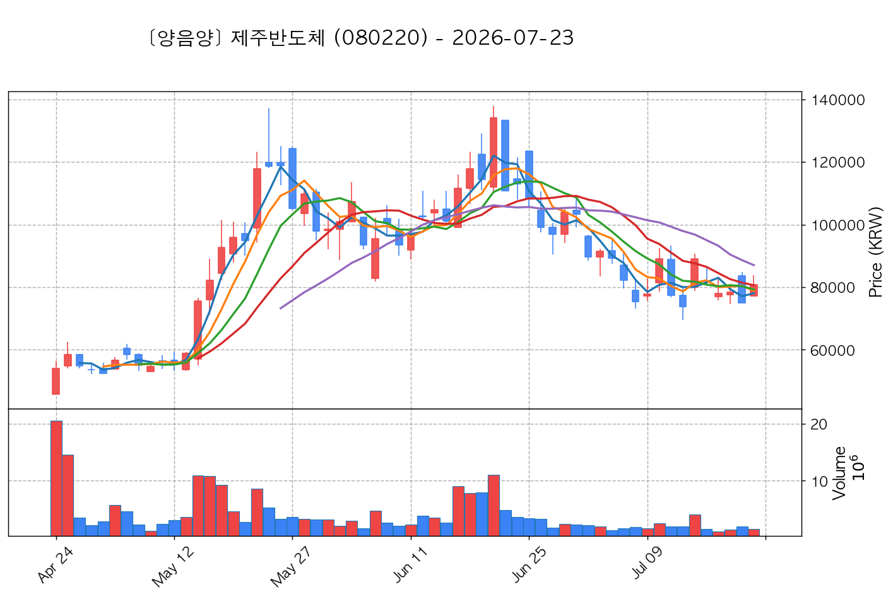

- **전일 종가(기준가)**: 80,900원 ➔ **매매일 시초가**: 79,500원 | **최고가**: 79,500원 (<b>-1.73%</b>) | **종가**: 70,300원 (-13.10%)
- **시세 움직임 복기**: 과거 2026-07-15 기준봉 후 현재 13일선 지지

#### 2) SK스퀘어 (402340) — ★ TOP 2 선택 | ❌ 손절 이탈 (-1.5%)

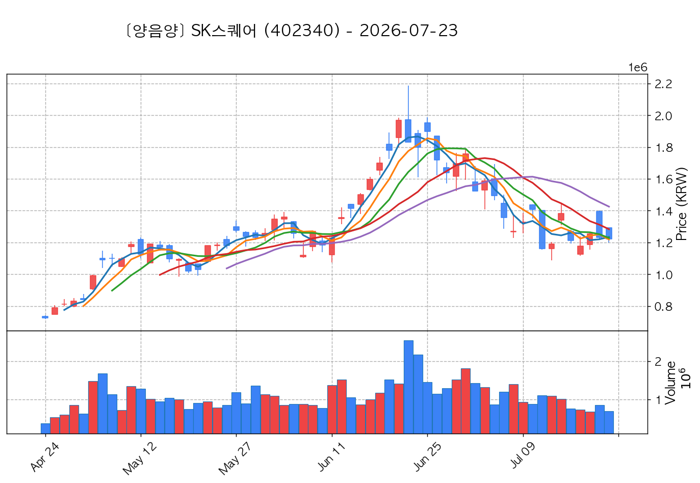

- **전일 종가(기준가)**: 1,221,000원 ➔ **매매일 시초가**: 1,202,000원 | **최고가**: 1,203,000원 (<b>-1.47%</b>) | **종가**: 1,109,000원 (-9.17%)
- **시세 움직임 복기**: 과거 2026-07-15 기준봉 후 현재 3일선 지지

#### 3) 한미반도체 (042700) — ★ TOP 3 선택 | ❌ 손절 이탈 (-1.4%)

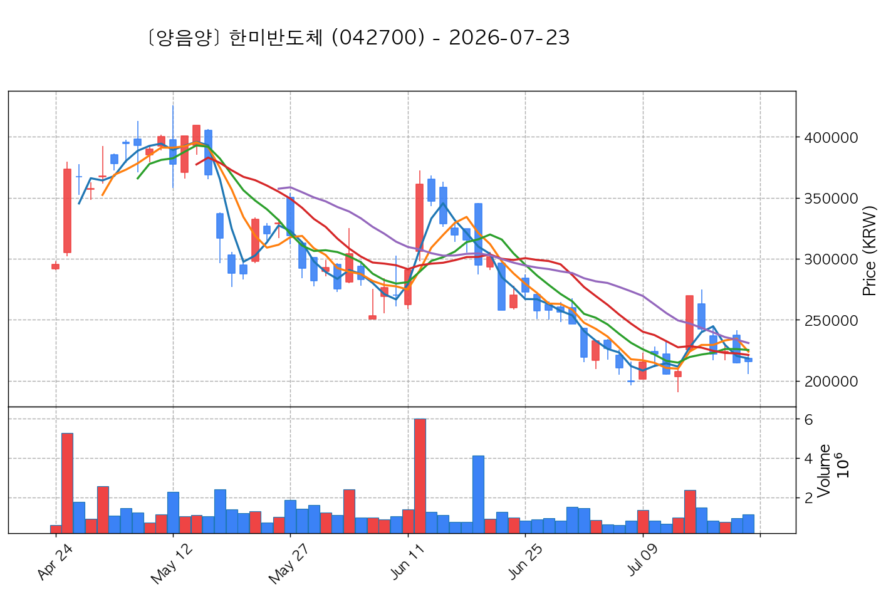

- **전일 종가(기준가)**: 216,000원 ➔ **매매일 시초가**: 212,500원 | **최고가**: 213,000원 (<b>-1.39%</b>) | **종가**: 200,000원 (-7.41%)
- **시세 움직임 복기**: 과거 2026-07-15 기준봉 후 현재 3일선 지지 (사윗감형)

#### 4) 펩트론 (087010) — 후보군 | ✅ 1차 목표 달성 (+5.7%)

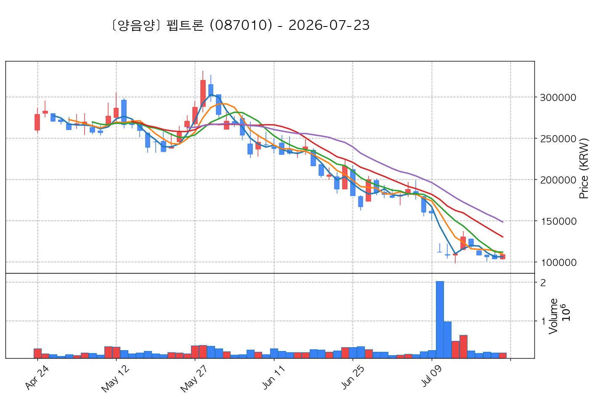

- **전일 종가(기준가)**: 108,800원 ➔ **매매일 시초가**: 106,100원 | **최고가**: 115,000원 (<b>+5.70%</b>) | **종가**: 113,300원 (+4.14%)
- **시세 움직임 복기**: 과거 2026-07-15 기준봉 후 현재 5일선 지지

#### 5) 대덕전자 (353200) — 후보군 | ❌ 손절 이탈 (-1.6%)

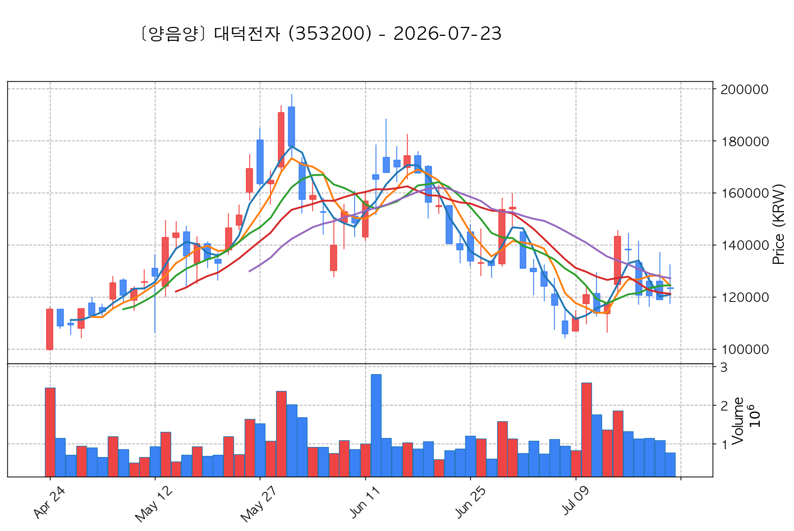

- **전일 종가(기준가)**: 123,200원 ➔ **매매일 시초가**: 121,200원 | **최고가**: 121,200원 (<b>-1.62%</b>) | **종가**: 109,500원 (-11.12%)
- **시세 움직임 복기**: 과거 2026-07-15 기준봉 후 현재 3일선 지지

#### 6) 다스코 (058730) — 후보군 | ⏱️ 지지선 유지 (+2.0%)

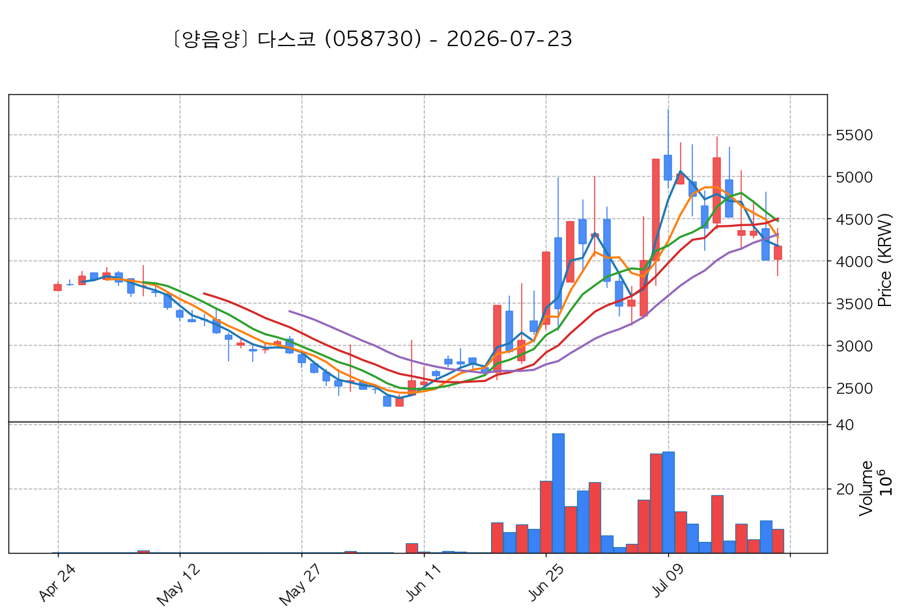

- **전일 종가(기준가)**: 4,170원 ➔ **매매일 시초가**: 4,125원 | **최고가**: 4,255원 (<b>+2.04%</b>) | **종가**: 3,675원 (-11.87%)
- **시세 움직임 복기**: 과거 2026-07-15 기준봉 후 현재 3일선 지지

#### 7) 로킷헬스케어 (376900) — 후보군 | ❌ 손절 이탈 (-2.1%)

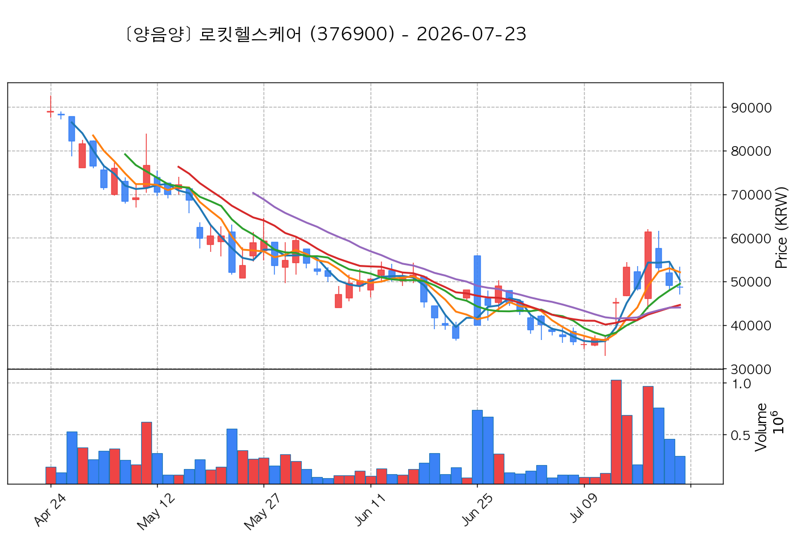

- **전일 종가(기준가)**: 48,650원 ➔ **매매일 시초가**: 47,500원 | **최고가**: 47,650원 (<b>-2.06%</b>) | **종가**: 44,100원 (-9.35%)
- **시세 움직임 복기**: 과거 2026-07-20 기준봉 후 현재 8일선 지지

#### 8) 한울반도체 (320000) — 후보군 | ❌ 손절 이탈 (-0.1%)

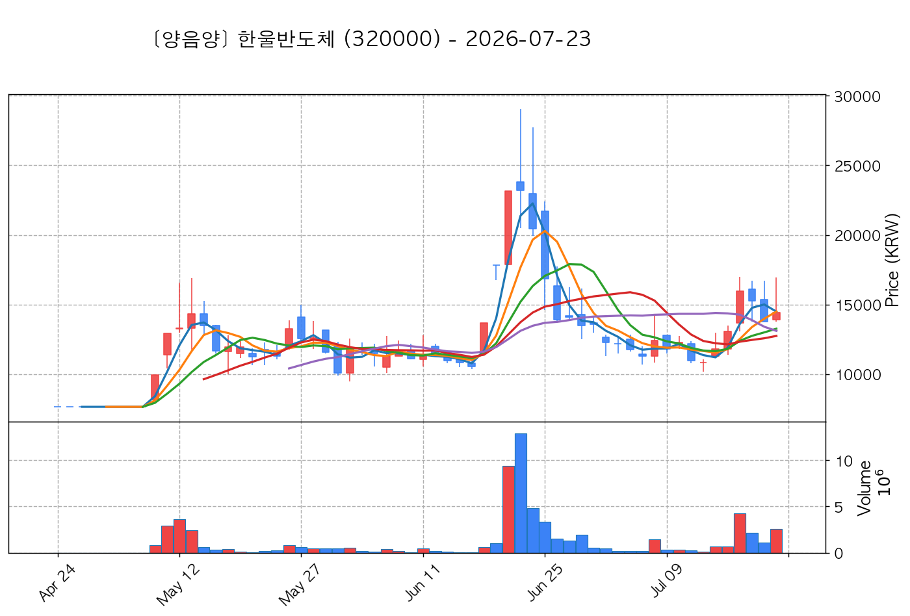

- **전일 종가(기준가)**: 14,420원 ➔ **매매일 시초가**: 14,410원 | **최고가**: 14,410원 (<b>-0.07%</b>) | **종가**: 12,700원 (-11.93%)
- **시세 움직임 복기**: 과거 2026-07-20 기준봉 후 현재 3일선 지지

#### 9) 삼성공조 (006660) — 후보군 | ✅ 1차 목표 달성 (+9.1%)

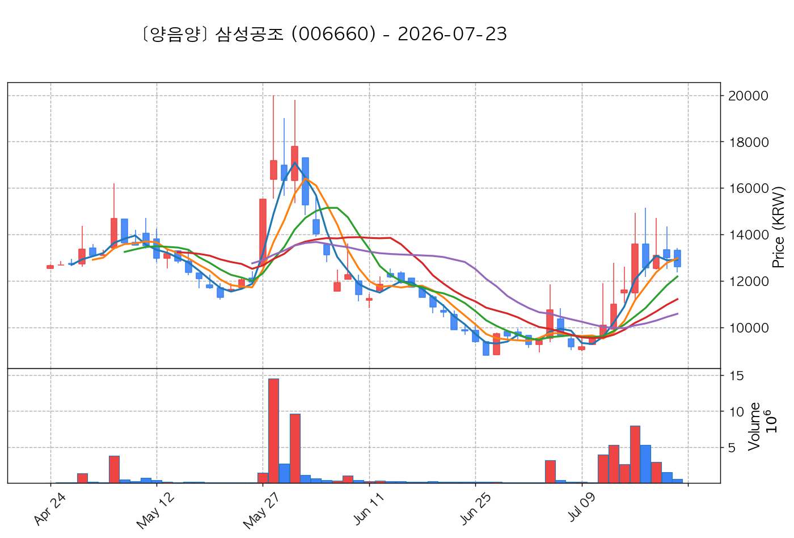

- **전일 종가(기준가)**: 12,600원 ➔ **매매일 시초가**: 12,500원 | **최고가**: 13,740원 (<b>+9.05%</b>) | **종가**: 12,450원 (-1.19%)
- **시세 움직임 복기**: 과거 2026-07-16 기준봉 후 현재 3일선 지지

#### 10) 한성기업 (003680) — 후보군 | ❌ 손절 이탈 (-0.8%)

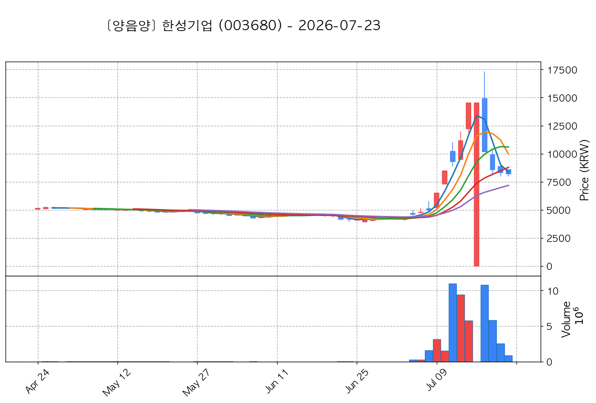

- **전일 종가(기준가)**: 8,200원 ➔ **매매일 시초가**: 8,010원 | **최고가**: 8,130원 (<b>-0.85%</b>) | **종가**: 7,570원 (-7.68%)
- **시세 움직임 복기**: 과거 2026-07-15 기준봉 후 현재 3일선 지지 (사윗감형)

#### 11) 온코닉테라퓨틱스 (476060) — 후보군 | ❌ 손절 이탈 (-1.3%)

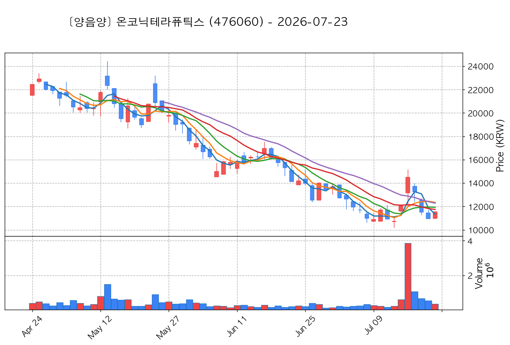

- **전일 종가(기준가)**: 11,550원 ➔ **매매일 시초가**: 11,350원 | **최고가**: 11,400원 (<b>-1.30%</b>) | **종가**: 10,940원 (-5.28%)
- **시세 움직임 복기**: 과거 2026-07-16 기준봉 후 현재 3일선 지지

#### 12) 고려산업 (002140) — 후보군 | ✅ 1차 목표 달성 (+26.3%)

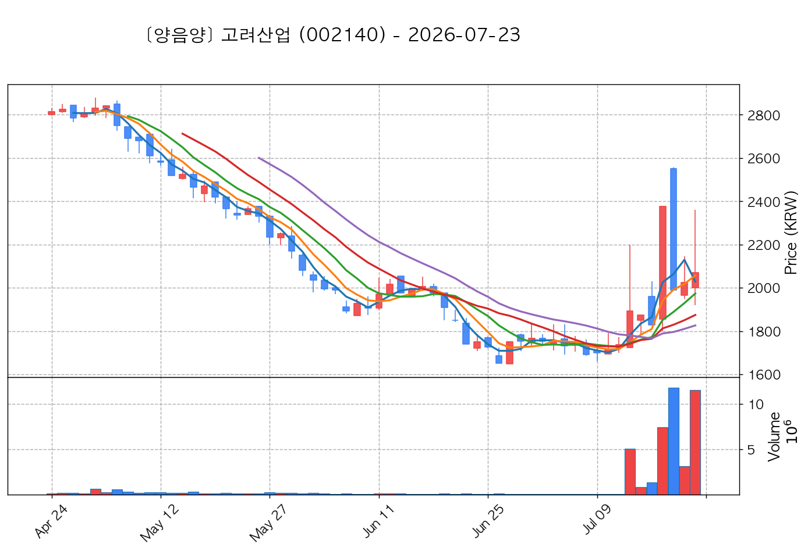

- **전일 종가(기준가)**: 2,070원 ➔ **매매일 시초가**: 2,170원 | **최고가**: 2,615원 (<b>+26.33%</b>) | **종가**: 2,340원 (+13.04%)
- **시세 움직임 복기**: 과거 2026-07-20 기준봉 후 현재 5일선 지지 (사윗감형)

#### 13) HLB (028300) — 후보군 | ✅ 1차 목표 달성 (+18.3%)

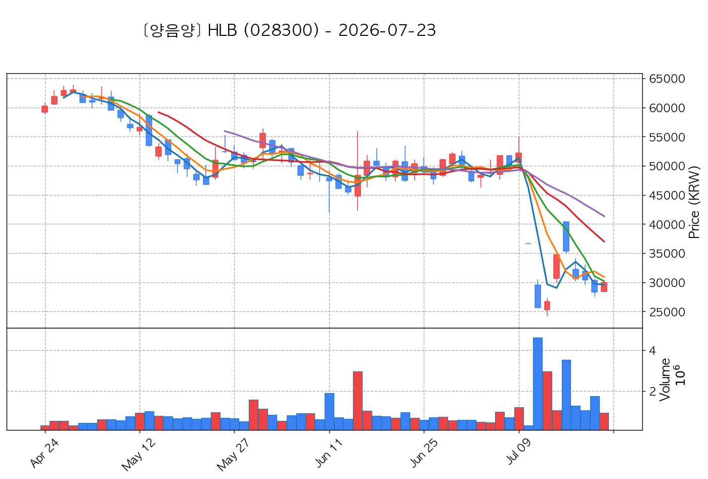

- **전일 종가(기준가)**: 30,000원 ➔ **매매일 시초가**: 33,650원 | **최고가**: 35,500원 (<b>+18.33%</b>) | **종가**: 31,300원 (+4.33%)
- **시세 움직임 복기**: 과거 2026-07-15 기준봉 후 현재 3일선 지지

#### 14) STX그린로지스 (465770) — 후보군 | ✅ 1차 목표 달성 (+14.5%)

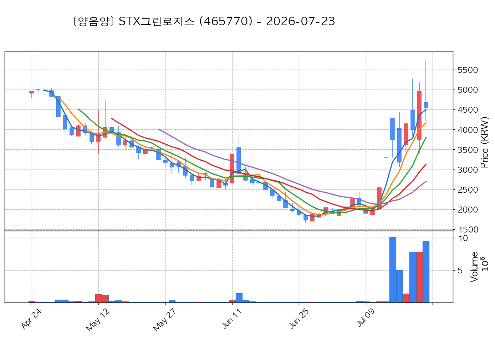

- **전일 종가(기준가)**: 4,550원 ➔ **매매일 시초가**: 4,875원 | **최고가**: 5,210원 (<b>+14.51%</b>) | **종가**: 4,360원 (-4.18%)
- **시세 움직임 복기**: 과거 2026-07-20 기준봉 후 현재 3일선 지지

#### 15) 아이로보틱스 (066430) — 후보군 | ❌ 손절 이탈 (-3.9%)

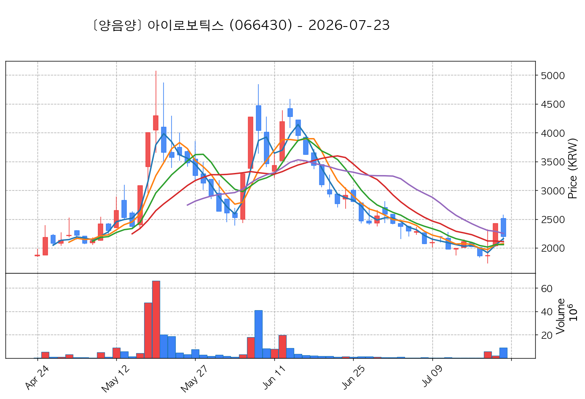

- **전일 종가(기준가)**: 2,195원 ➔ **매매일 시초가**: 2,110원 | **최고가**: 2,110원 (<b>-3.87%</b>) | **종가**: 2,000원 (-8.88%)
- **시세 움직임 복기**: 과거 2026-07-22 기준봉 후 현재 3일선 지지

## 🟡 전략 2 — 일일봉 매집봉 성과

#### 1) 흥구석유 (024060) — ★ TOP 1 선택 | ✅ 1차 목표 달성 (+9.9%)

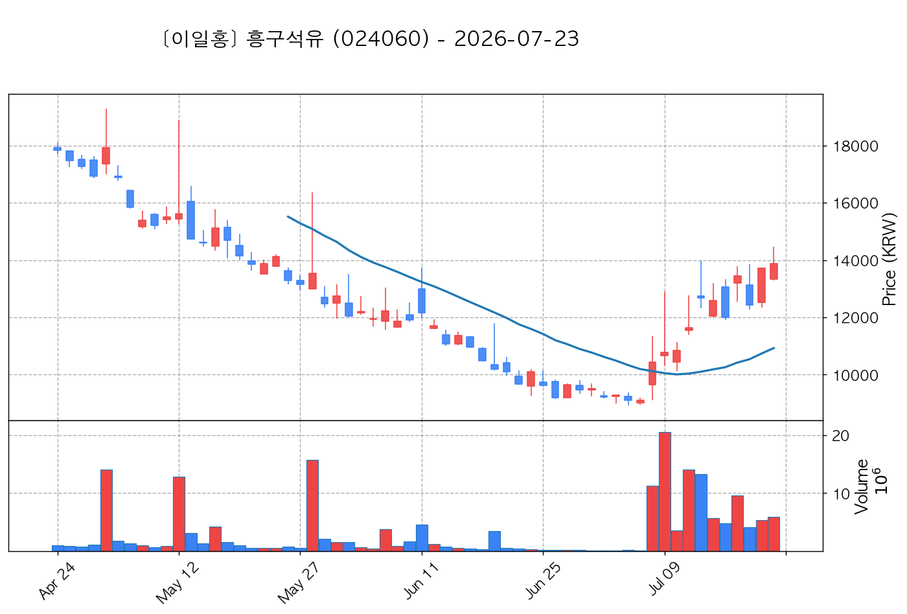

- **전일 종가(기준가)**: 13,870원 ➔ **매매일 시초가**: 15,070원 | **최고가**: 15,250원 (<b>+9.95%</b>) | **종가**: 14,120원 (+1.80%)
- **시세 움직임 복기**: 과거 2026-07-08 매집봉 ➔ 240일선 근접 지지 (-2.24%)

#### 2) HPSP (403870) — 후보군 | ❌ 손절 이탈 (-1.9%)

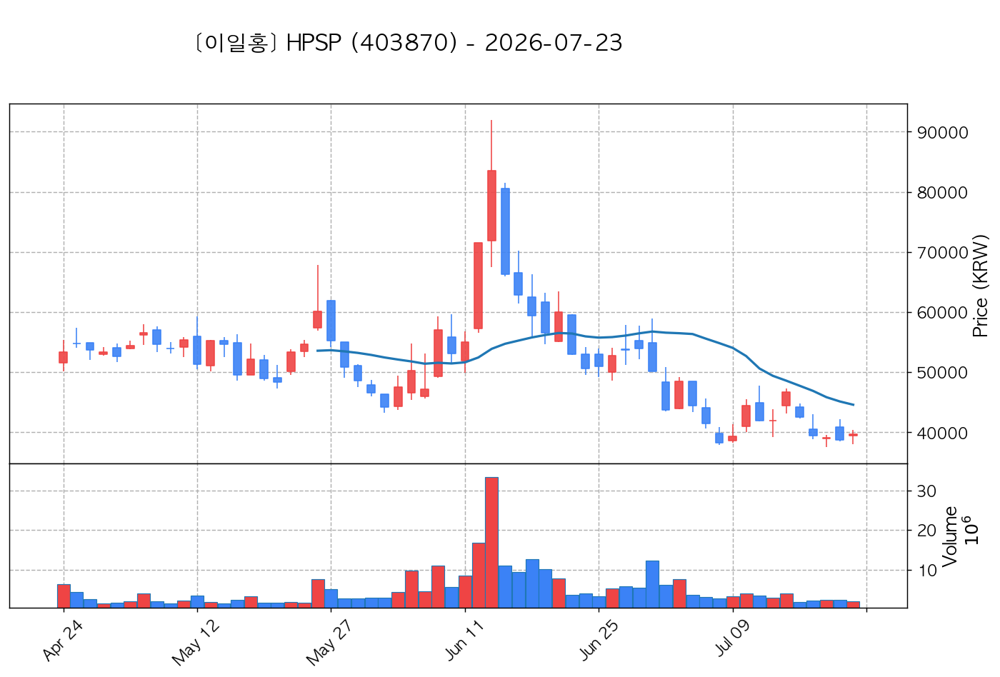

- **전일 종가(기준가)**: 39,650원 ➔ **매매일 시초가**: 38,850원 | **최고가**: 38,900원 (<b>-1.89%</b>) | **종가**: 35,650원 (-10.09%)
- **시세 움직임 복기**: 과거 2026-06-15 매집봉 ➔ 240일선 근접 지지 (+0.54%)

#### 3) 테크윙 (089030) — 후보군 | ❌ 손절 이탈 (-1.2%)

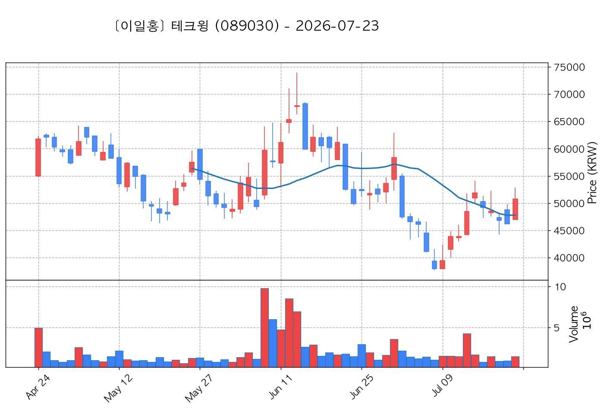

- **전일 종가(기준가)**: 50,800원 ➔ **매매일 시초가**: 49,800원 | **최고가**: 50,200원 (<b>-1.18%</b>) | **종가**: 45,050원 (-11.32%)
- **시세 움직임 복기**: 과거 2026-06-09 매집봉 ➔ 240일선 근접 지지 (+1.83%)

#### 4) 흥아해운 (003280) — 후보군 | ✅ 1차 목표 달성 (+4.7%)

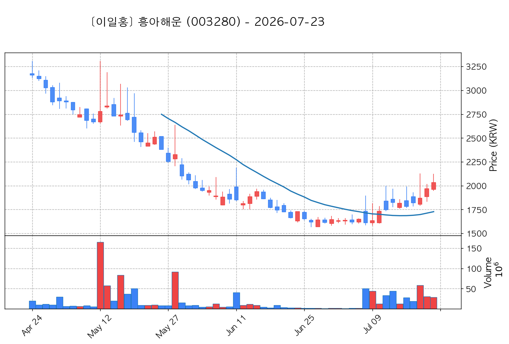

- **전일 종가(기준가)**: 2,035원 ➔ **매매일 시초가**: 2,120원 | **최고가**: 2,130원 (<b>+4.67%</b>) | **종가**: 1,900원 (-6.63%)
- **시세 움직임 복기**: 과거 2026-07-08 매집봉 ➔ 240일선 근접 지지 (+0.69%)

#### 5) 로보스타 (090360) — 후보군 | ❌ 손절 이탈 (-1.2%)

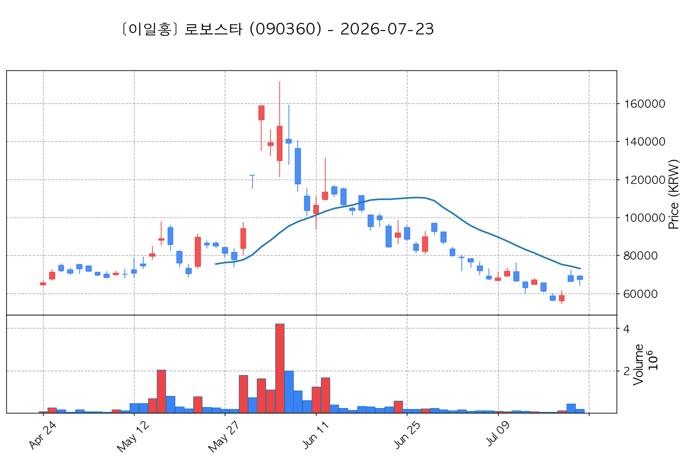

- **전일 종가(기준가)**: 67,400원 ➔ **매매일 시초가**: 65,800원 | **최고가**: 66,600원 (<b>-1.19%</b>) | **종가**: 60,600원 (-10.09%)
- **시세 움직임 복기**: 과거 2026-06-05 매집봉 ➔ 240일선 근접 지지 (-1.38%)

#### 6) 기가레인 (049080) — 후보군 | ❌ 손절 이탈 (-0.2%)

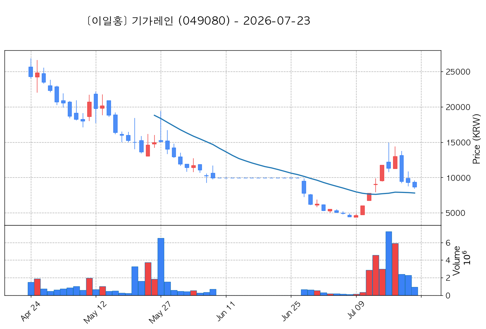

- **전일 종가(기준가)**: 8,650원 ➔ **매매일 시초가**: 8,630원 | **최고가**: 8,630원 (<b>-0.23%</b>) | **종가**: 7,810원 (-9.71%)
- **시세 움직임 복기**: 과거 2026-07-14 매집봉 ➔ 240일선 근접 지지 (+2.72%)

#### 7) 퍼스텍 (010820) — 후보군 | ✅ 1차 목표 달성 (+10.1%)

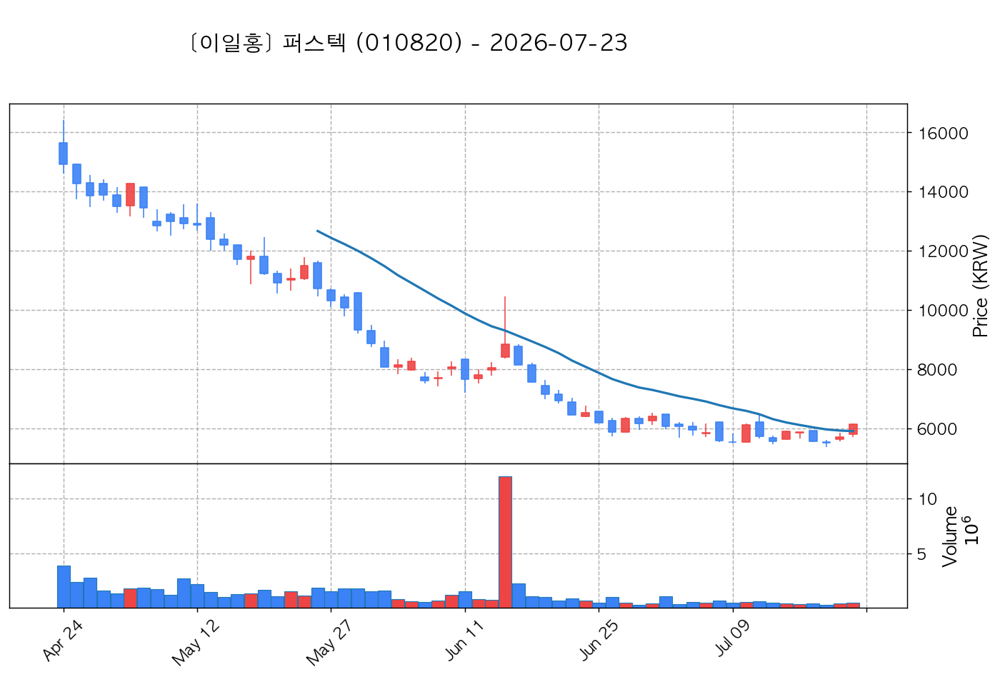

- **전일 종가(기준가)**: 6,130원 ➔ **매매일 시초가**: 6,200원 | **최고가**: 6,750원 (<b>+10.11%</b>) | **종가**: 6,180원 (+0.82%)
- **시세 움직임 복기**: 과거 2026-06-16 매집봉 ➔ 240일선 근접 지지 (-2.74%)

#### 8) 아리바이오홀딩스 (290690) — 후보군 | ⏱️ 지지선 유지 (+2.7%)

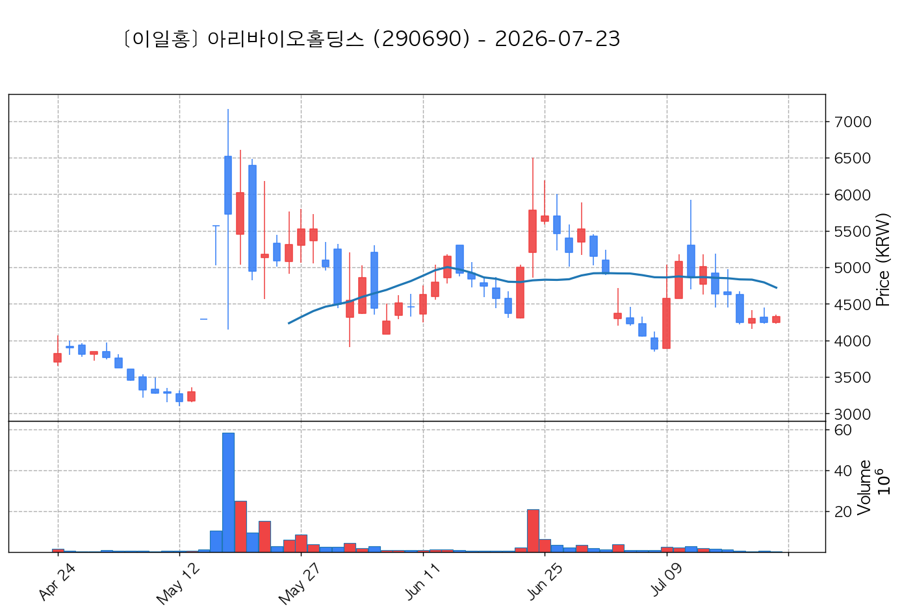

- **전일 종가(기준가)**: 4,330원 ➔ **매매일 시초가**: 4,285원 | **최고가**: 4,445원 (<b>+2.66%</b>) | **종가**: 4,165원 (-3.81%)
- **시세 움직임 복기**: 과거 2026-06-24 매집봉 ➔ 240일선 근접 지지 (-2.26%)

## 🟢 전략 3 — 수급 낙폭과대 바닥형 성과

#### 1) 대한전선 (001440) — ★ TOP 1 선택 | ❌ 손절 이탈 (-2.3%)

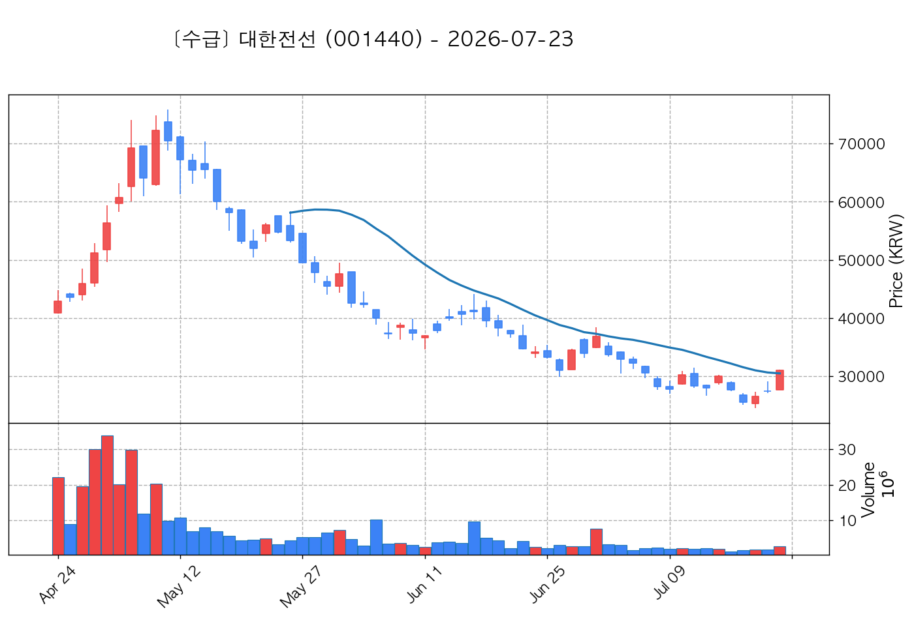

- **전일 종가(기준가)**: 31,000원 ➔ **매매일 시초가**: 30,150원 | **최고가**: 30,300원 (<b>-2.26%</b>) | **종가**: 28,100원 (-9.35%)
- **시세 움직임 복기**: 52주 대비 바닥권(40.8%) ➔ 수급 확인 ➔ N/A일 없음 핥기 및 반등 포착

#### 2) 한화엔진 (082740) — ★ TOP 2 선택 | ✅ 1차 목표 달성 (+3.4%)

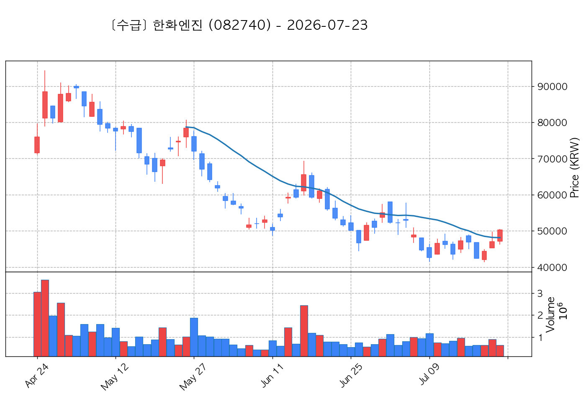

- **전일 종가(기준가)**: 50,300원 ➔ **매매일 시초가**: 50,300원 | **최고가**: 52,000원 (<b>+3.38%</b>) | **종가**: 49,050원 (-2.49%)
- **시세 움직임 복기**: 52주 대비 바닥권(53.3%) ➔ 수급 확인 ➔ 2026-07-23일 240일선 핥기 및 반등 포착

