# 📈 [실전플랜 1] 2026-07-30 (종가) 매매 후보 스크리닝 보고서

> 스크리닝 기준일: 2026-07-30 (종가) | 진입 예정일: 2026-07-31 (매매일) | [📊 익일 매매 성과 피드백 보고서 보기](./2026-07-31_피드백.html)

---

## 📊 1. 스크리닝 요약
- **전략 1 (양-음-양 눌림목)**: 14개 포착
- **전략 2 (일일봉 매집봉)**: 4개 포착
- **전략 3 (수급 낙폭과대 바닥형)**: 6개 포착
- **총 포착 수**: 24개 종목 (TOP 선택 6개)

---

## 🔵 1. 전략 1 — 양-음-양 눌림목 (3% × 3슬롯)

#### 1) OCI홀딩스 (010060) — ★ TOP 1 선택

- **기준 종가**: 175,400원 | **거래대금**: 612억
- **분석 사유**: 과거 2026-07-23 기준봉 후 현재 3일선 지지

#### 2) 씨피시스템 (413630) — ★ TOP 2 선택

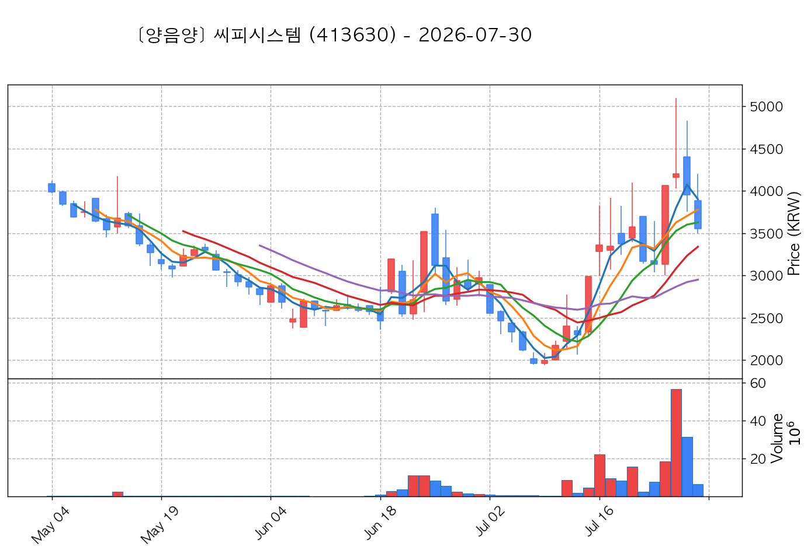

- **기준 종가**: 3,550원 | **거래대금**: 226억
- **분석 사유**: 과거 2026-07-27 기준봉 후 현재 8일선 지지

#### 3) 지엔씨에너지 (119850) — ★ TOP 3 선택 (사윗감)

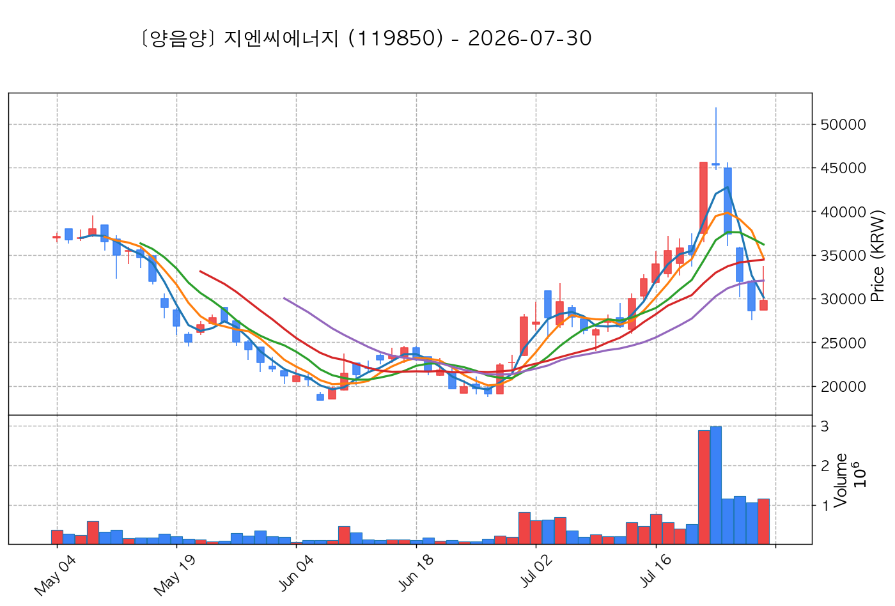

- **기준 종가**: 29,750원 | **거래대금**: 343억
- **분석 사유**: 과거 2026-07-23 기준봉 후 현재 3일선 지지 (사윗감형)

#### 4) 에스피지 (058610) — 후보군

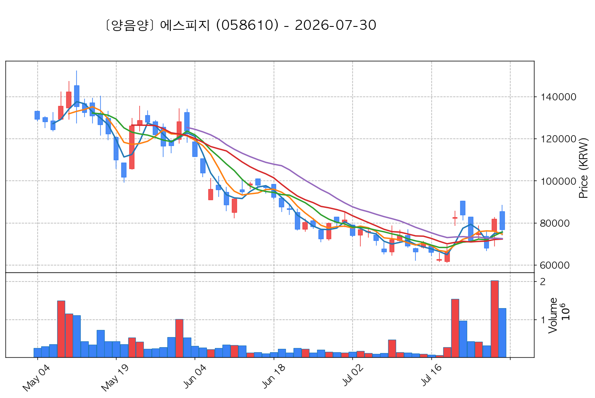

- **기준 종가**: 76,800원 | **거래대금**: 995억
- **분석 사유**: 과거 2026-07-29 기준봉 후 현재 3일선 지지

#### 5) SK오션플랜트 (100090) — 후보군

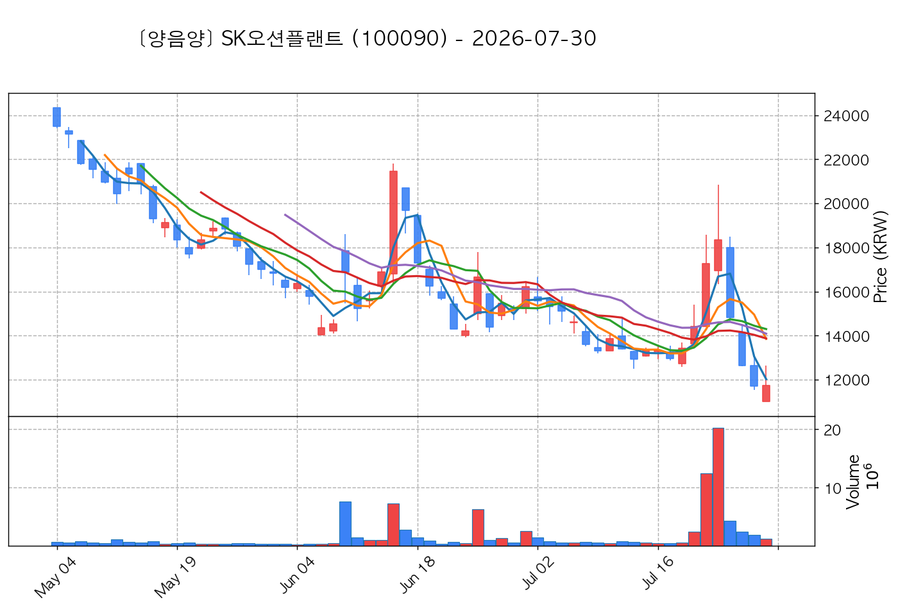

- **기준 종가**: 11,750원 | **거래대금**: 150억
- **분석 사유**: 과거 2026-07-23 기준봉 후 현재 3일선 지지

#### 6) 현대힘스 (460930) — 후보군

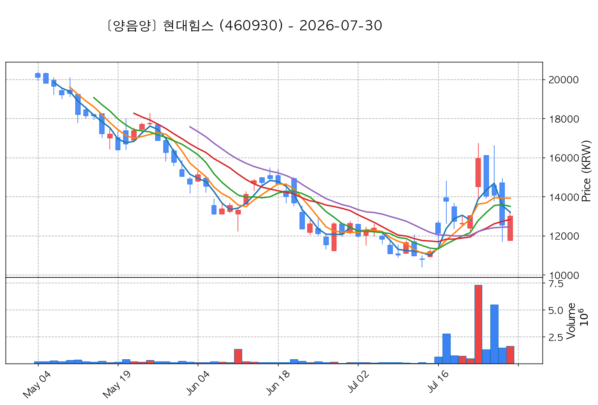

- **기준 종가**: 13,000원 | **거래대금**: 212억
- **분석 사유**: 과거 2026-07-24 기준봉 후 현재 3일선 지지

#### 7) 다날 (064260) — 후보군

- **기준 종가**: 4,225원 | **거래대금**: 159억
- **분석 사유**: 과거 2026-07-23 기준봉 후 현재 3일선 지지

#### 8) HD현대에너지솔루션 (322000) — 후보군 (사윗감)

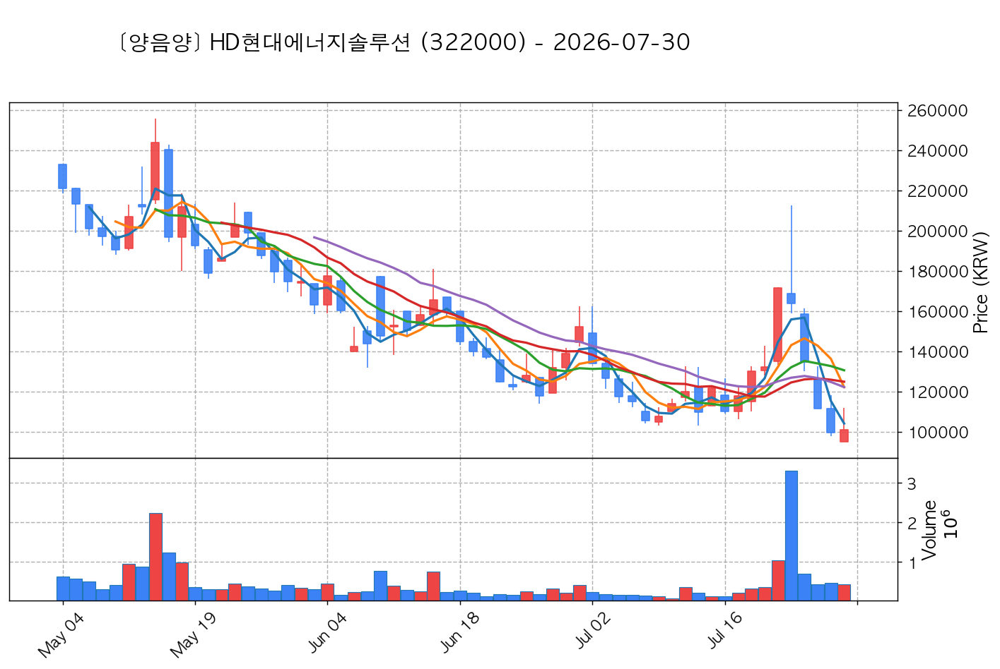

- **기준 종가**: 101,100원 | **거래대금**: 427억
- **분석 사유**: 과거 2026-07-23 기준봉 후 현재 3일선 지지 (사윗감형)

#### 9) 파세코 (037070) — 후보군

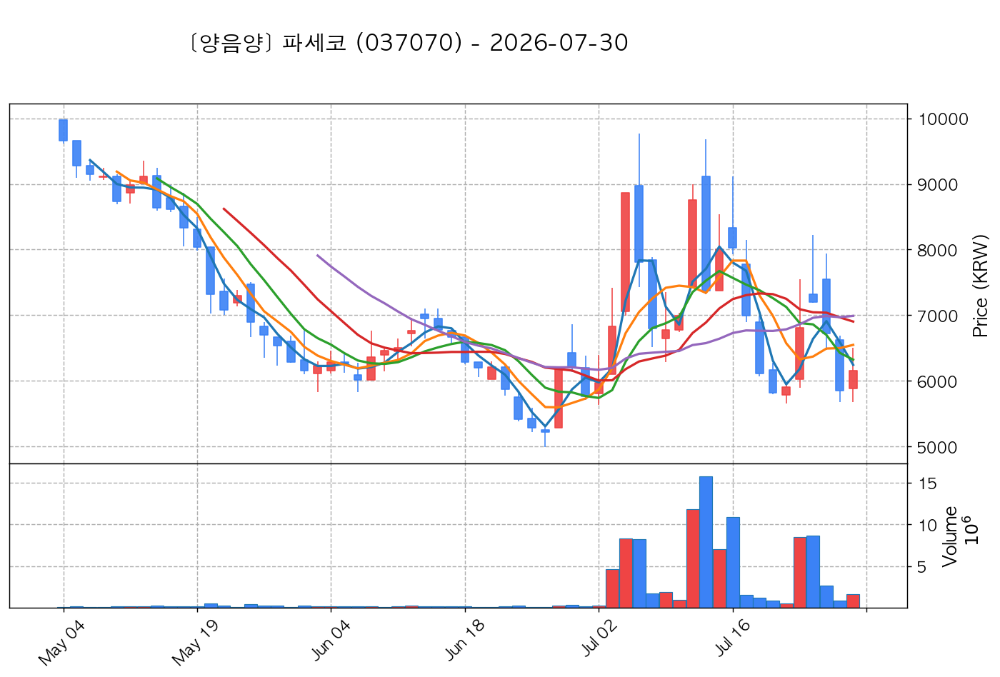

- **기준 종가**: 6,160원 | **거래대금**: 99억
- **분석 사유**: 과거 2026-07-24 기준봉 후 현재 3일선 지지

#### 10) 자이에스앤디 (317400) — 후보군

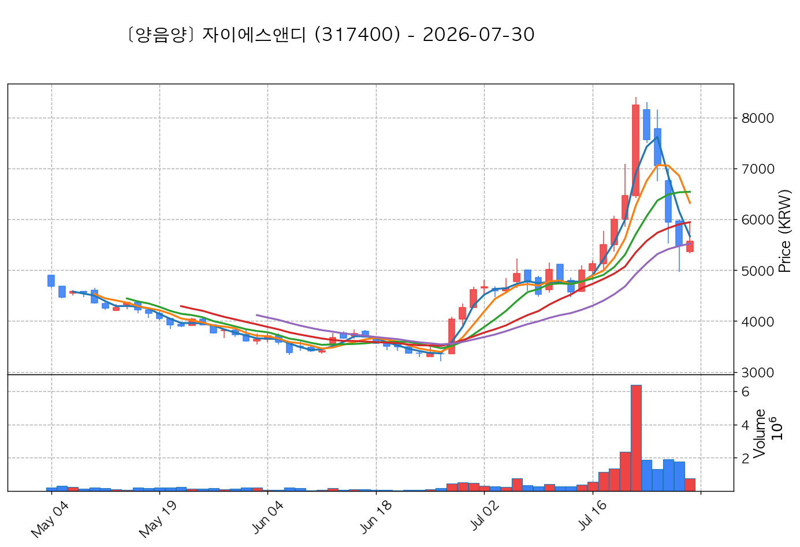

- **기준 종가**: 5,570원 | **거래대금**: 41억
- **분석 사유**: 과거 2026-07-23 기준봉 후 현재 3일선 지지

#### 11) 아이크래프트 (052460) — 후보군

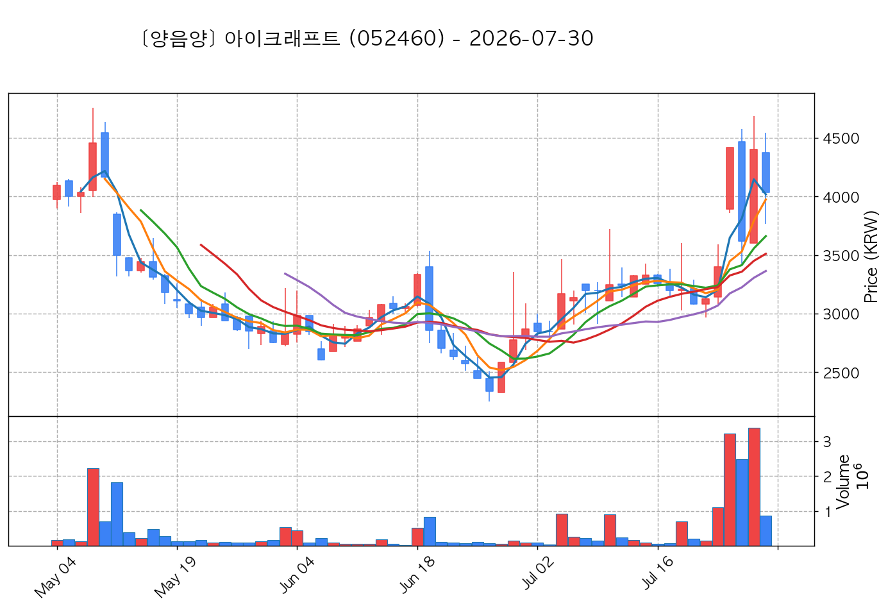

- **기준 종가**: 4,035원 | **거래대금**: 34억
- **분석 사유**: 과거 2026-07-27 기준봉 후 현재 3일선 지지

#### 12) 일승 (333430) — 후보군

- **기준 종가**: 3,680원 | **거래대금**: 344억
- **분석 사유**: 과거 2026-07-24 기준봉 후 현재 5일선 지지

#### 13) 폴라리스AI (039980) — 후보군

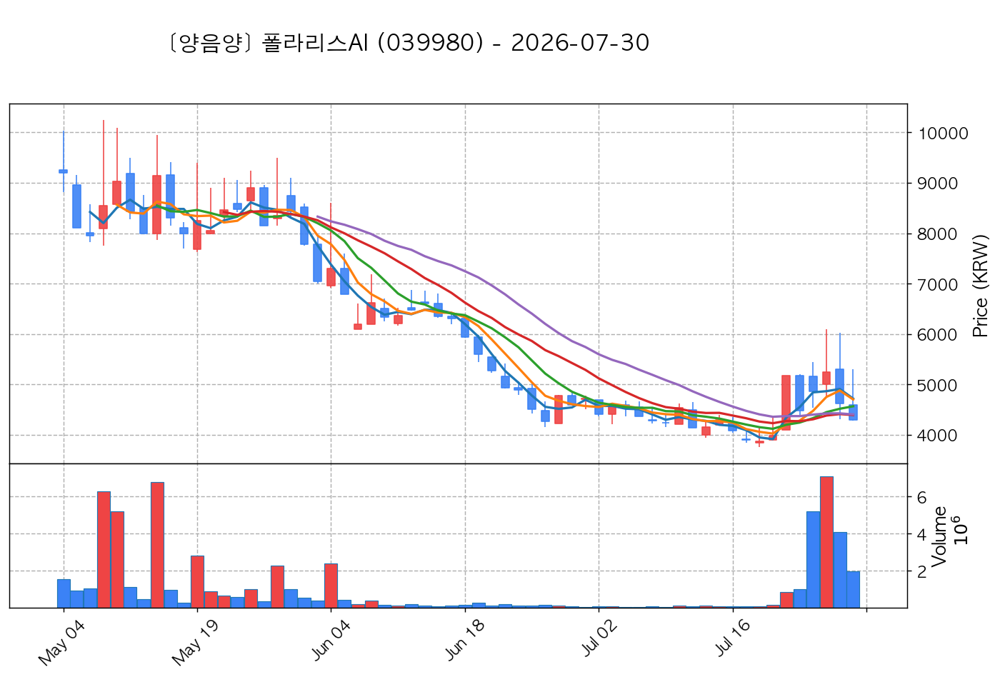

- **기준 종가**: 4,295원 | **거래대금**: 84억
- **분석 사유**: 과거 2026-07-23 기준봉 후 현재 13일선 지지

#### 14) 오브젠 (417860) — 후보군

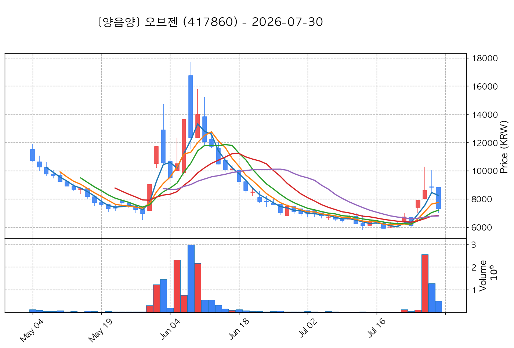

- **기준 종가**: 7,300원 | **거래대금**: 37억
- **분석 사유**: 과거 2026-07-27 기준봉 후 현재 8일선 지지

## 🟡 2. 전략 2 — 일일봉 매집봉 (10% × 1슬롯)

#### 1) 세아메카닉스 (396300) — ★ TOP 1 선택

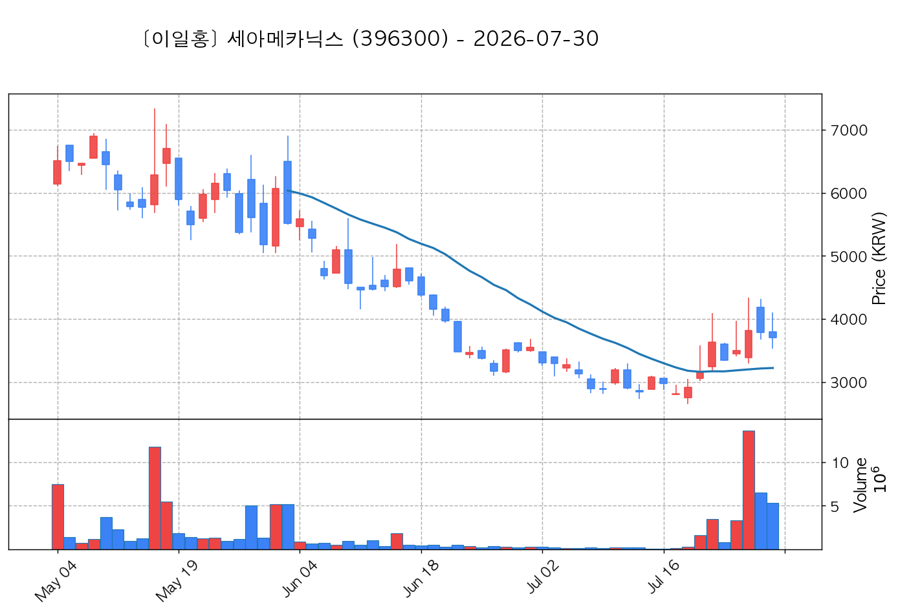

- **기준 종가**: 3,705원 | **거래대금**: 196억
- **분석 사유**: 과거 2026-07-22 매집봉 ➔ 240일선 근접 지지 (+1.01%)

#### 2) 광주신세계 (037710) — 후보군

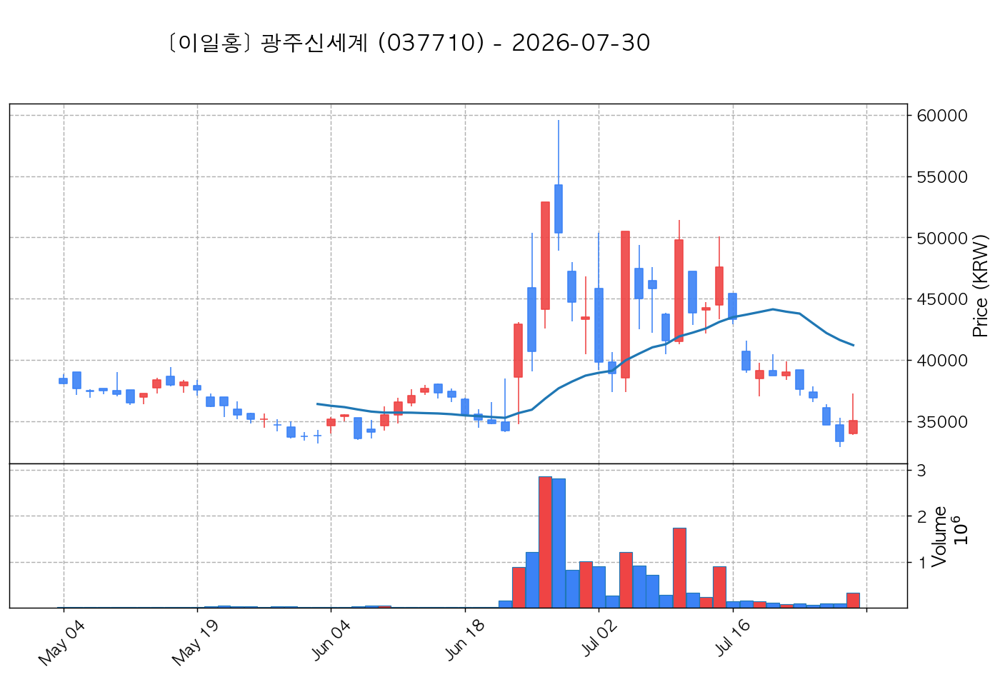

- **기준 종가**: 35,050원 | **거래대금**: 116억
- **분석 사유**: 과거 2026-06-23 매집봉 ➔ 240일선 근접 지지 (+1.89%)

#### 3) 강스템바이오텍 (217730) — 후보군

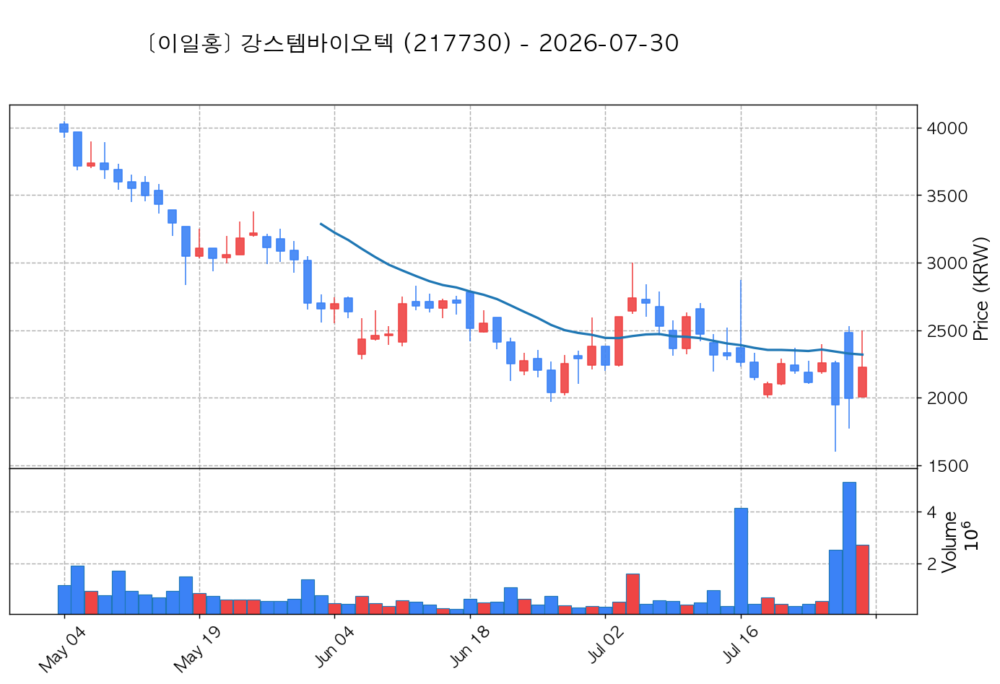

- **기준 종가**: 2,225원 | **거래대금**: 60억
- **분석 사유**: 과거 2026-07-16 매집봉 ➔ 240일선 근접 지지 (+0.75%)

#### 4) 시선AI (340810) — 후보군

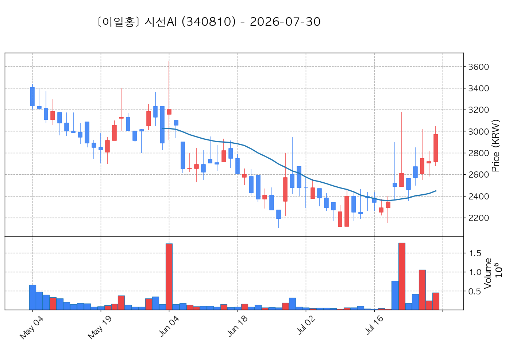

- **기준 종가**: 2,970원 | **거래대금**: 13억
- **분석 사유**: 과거 2026-06-04 매집봉 ➔ 240일선 근접 지지 (-2.08%)

## 🟢 3. 전략 3 — 수급 낙폭과대 바닥형 (10% × 2슬롯)

#### 1) 삼성전자우 (005935) — ★ TOP 1 선택

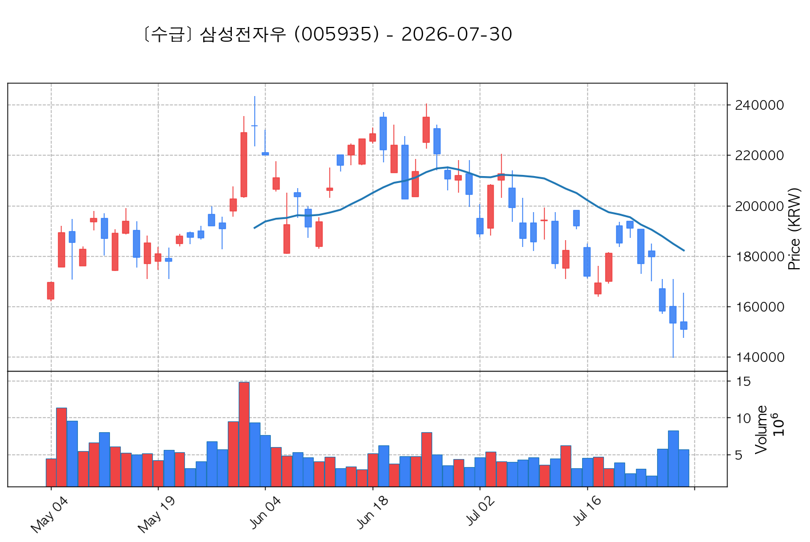

- **기준 종가**: 151,000원 | **거래대금**: 8577억
- **분석 사유**: 52주 대비 바닥권(62.0%) ➔ 수급 확인 ➔ N/A일 없음 핥기 및 반등 포착

#### 2) 한국항공우주 (047810) — ★ TOP 2 선택

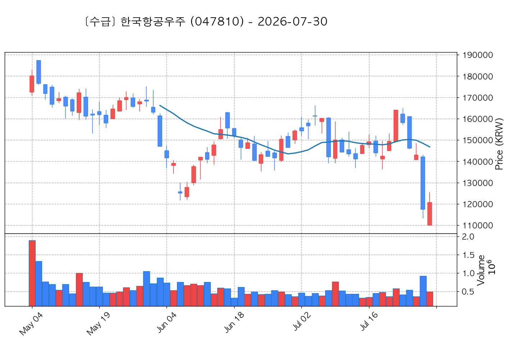

- **기준 종가**: 120,700원 | **거래대금**: 588억
- **분석 사유**: 52주 대비 바닥권(56.0%) ➔ 수급 확인 ➔ N/A일 없음 핥기 및 반등 포착

#### 3) GS건설 (006360) — 후보군

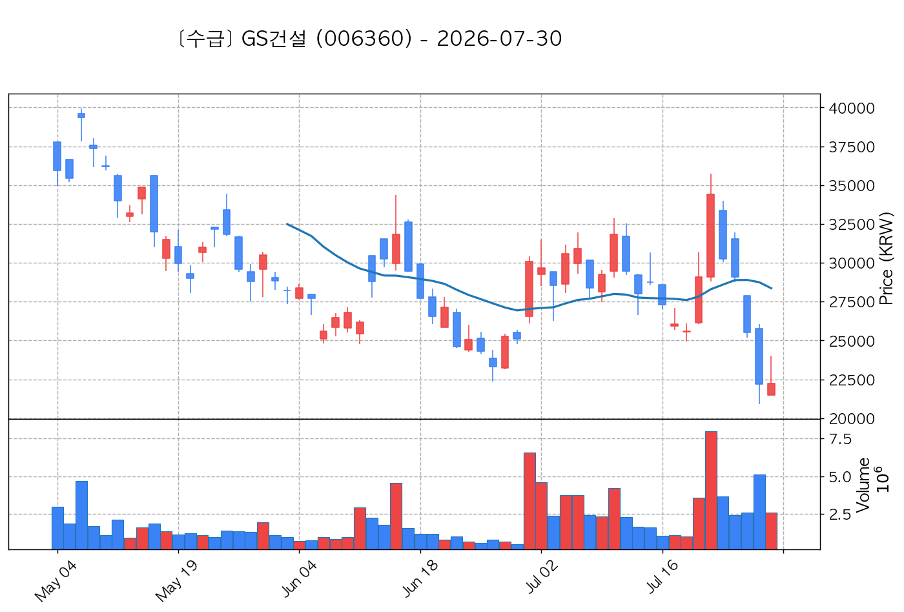

- **기준 종가**: 22,250원 | **거래대금**: 575억
- **분석 사유**: 52주 대비 바닥권(49.6%) ➔ 수급 확인 ➔ 2026-07-24일 60일선 핥기 및 반등 포착

#### 4) 한화엔진 (082740) — 후보군

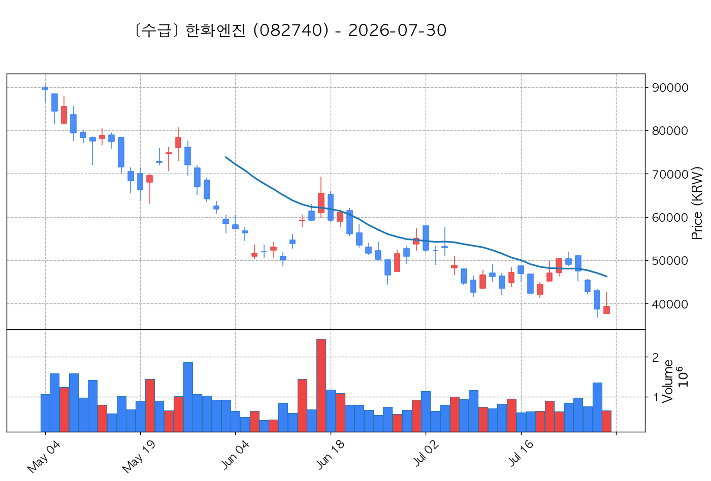

- **기준 종가**: 39,300원 | **거래대금**: 259억
- **분석 사유**: 52주 대비 바닥권(41.6%) ➔ 수급 확인 ➔ N/A일 없음 핥기 및 반등 포착

#### 5) BNK금융지주 (138930) — 후보군

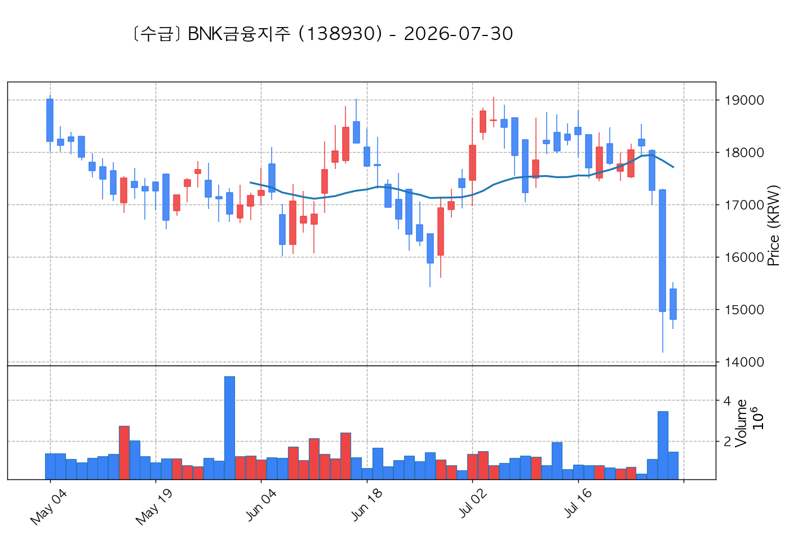

- **기준 종가**: 14,800원 | **거래대금**: 216억
- **분석 사유**: 52주 대비 바닥권(64.2%) ➔ 수급 확인 ➔ 2026-07-28일 60일선 핥기 및 반등 포착

#### 6) 한진칼 (180640) — 후보군

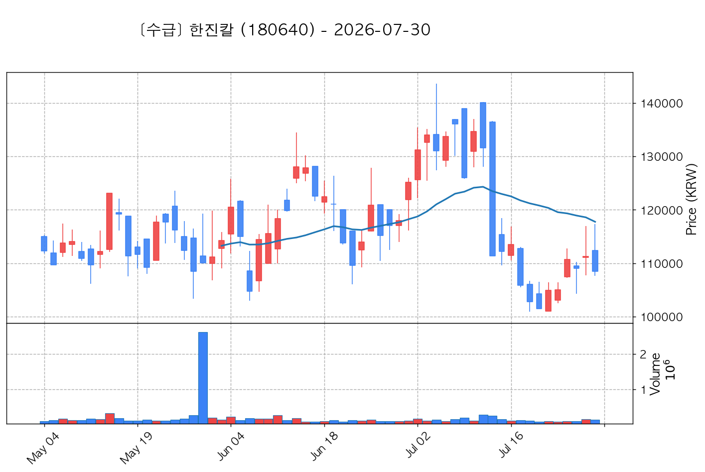

- **기준 종가**: 108,500원 | **거래대금**: 142억
- **분석 사유**: 52주 대비 바닥권(61.7%) ➔ 수급 확인 ➔ N/A일 없음 핥기 및 반등 포착

