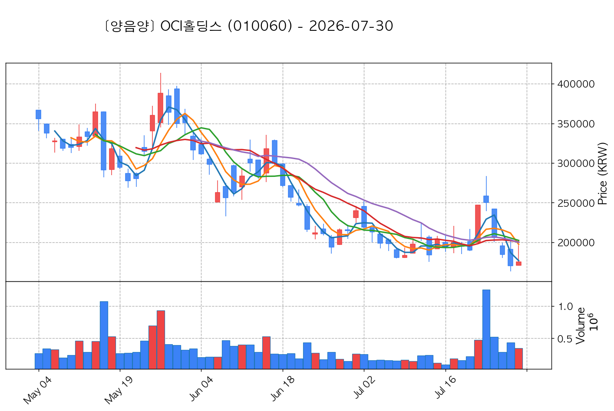
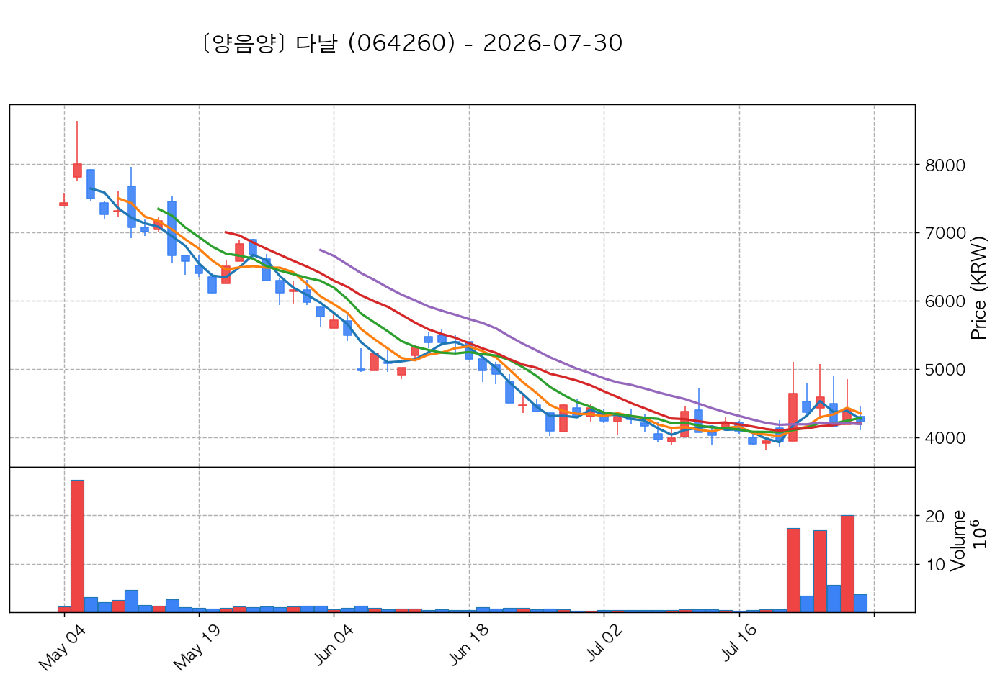
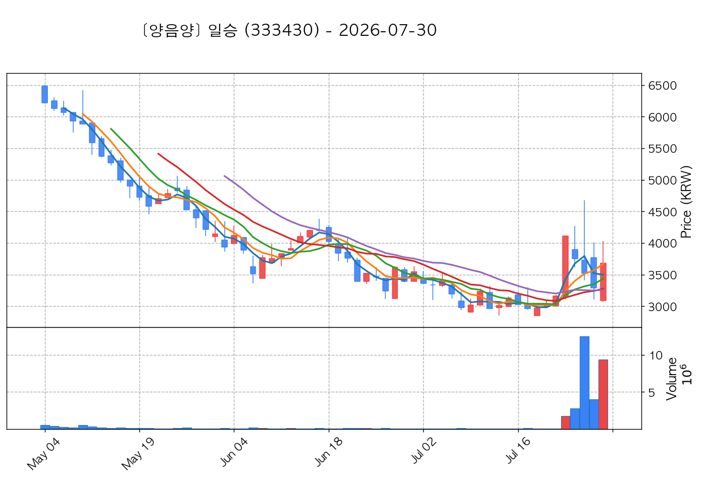

# 📈 [실전플랜 1] 2026-07-30 매매 후보 스크리닝 보고서

> 스크리닝 기준일: 2026-07-30 | [📊 익일 매매 성과 피드백 보고서 보기](./2026-07-30_피드백.html)

---

## 📊 1. 스크리닝 요약
- **전략 1 (양-음-양 눌림목)**: 8개 포착
- **전략 2 (일일봉 매집봉)**: 0개 포착
- **전략 3 (수급 낙폭과대 바닥형)**: 2개 포착
- **총 포착 수**: 10개 종목 (TOP 선택 5개)

---

## 🔵 1. 전략 1 — 양-음-양 눌림목 (3% × 3슬롯)

#### 1) OCI홀딩스 (010060) — ★ TOP 1 선택

- **기준 종가**: 175,400원 | **거래대금**: 612억
- **분석 사유**: 과거 2026-07-23 기준봉 후 현재 3일선 지지

#### 2) 지엔씨에너지 (119850) — ★ TOP 2 선택 (사윗감)

- **기준 종가**: 29,750원 | **거래대금**: 343억
- **분석 사유**: 과거 2026-07-23 기준봉 후 현재 3일선 지지 (사윗감형)

#### 3) 에스피지 (058610) — ★ TOP 3 선택

- **기준 종가**: 76,800원 | **거래대금**: 995억
- **분석 사유**: 과거 2026-07-29 기준봉 후 현재 3일선 지지

#### 4) 다날 (064260) — 후보군

- **기준 종가**: 4,225원 | **거래대금**: 159억
- **분석 사유**: 과거 2026-07-23 기준봉 후 현재 3일선 지지

#### 5) HD현대에너지솔루션 (322000) — 후보군 (사윗감)

- **기준 종가**: 101,100원 | **거래대금**: 427억
- **분석 사유**: 과거 2026-07-23 기준봉 후 현재 3일선 지지 (사윗감형)

#### 6) 아이크래프트 (052460) — 후보군

- **기준 종가**: 4,035원 | **거래대금**: 34억
- **분석 사유**: 과거 2026-07-27 기준봉 후 현재 3일선 지지

#### 7) 일승 (333430) — 후보군

- **기준 종가**: 3,680원 | **거래대금**: 344억
- **분석 사유**: 과거 2026-07-24 기준봉 후 현재 5일선 지지

#### 8) 폴라리스AI (039980) — 후보군

- **기준 종가**: 4,295원 | **거래대금**: 84억
- **분석 사유**: 과거 2026-07-23 기준봉 후 현재 13일선 지지

## 🟡 2. 전략 2 — 일일봉 매집봉 (10% × 1슬롯)

해당 전략 포착 종목 없음

## 🟢 3. 전략 3 — 수급 낙폭과대 바닥형 (10% × 2슬롯)

#### 1) GS건설 (006360) — ★ TOP 1 선택

- **기준 종가**: 22,250원 | **거래대금**: 575억
- **분석 사유**: 52주 대비 바닥권(49.6%) ➔ 수급 확인 ➔ 2026-07-24일 60일선 핥기 및 반등 포착

#### 2) 한화엔진 (082740) — ★ TOP 2 선택

- **기준 종가**: 39,300원 | **거래대금**: 259억
- **분석 사유**: 52주 대비 바닥권(41.6%) ➔ 수급 확인 ➔ N/A일 없음 핥기 및 반등 포착

