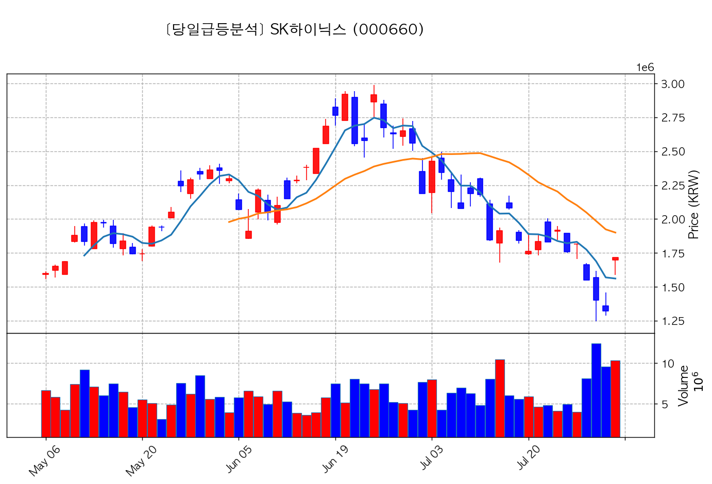
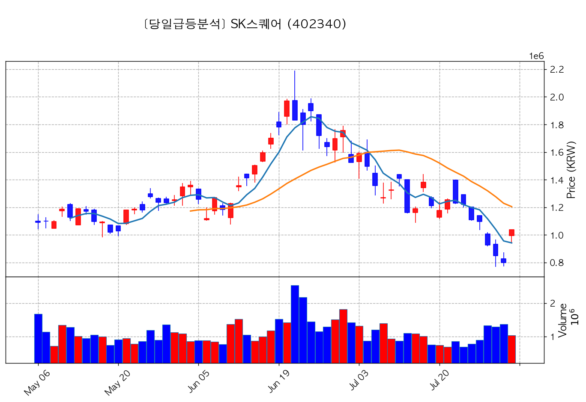
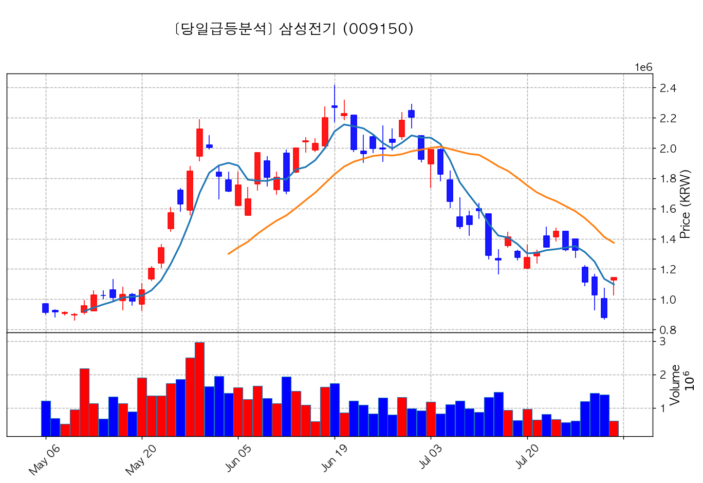
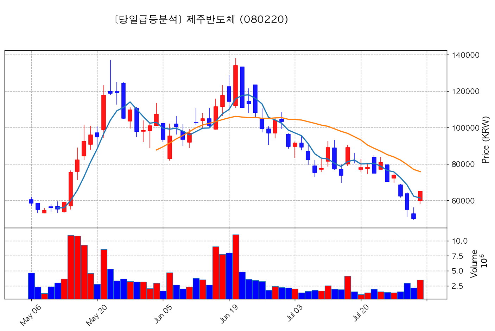
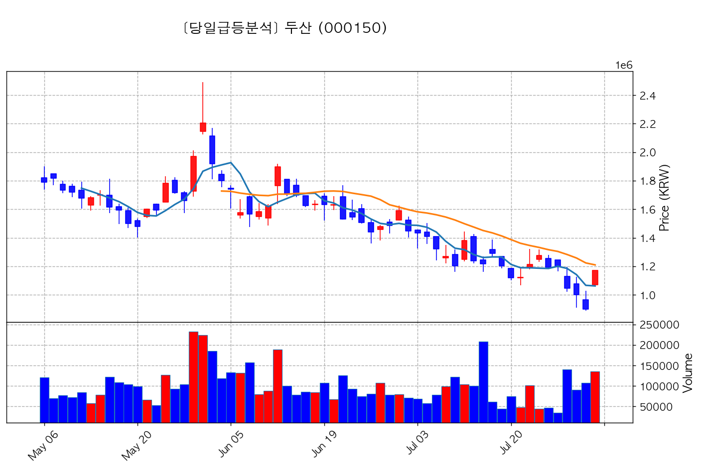
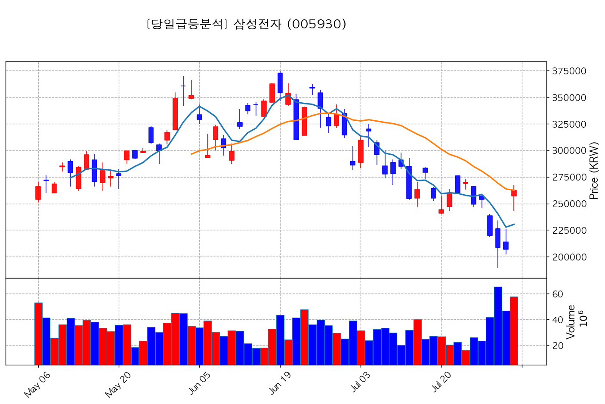
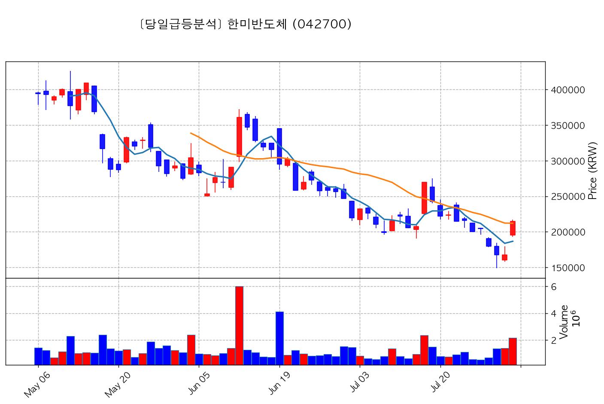
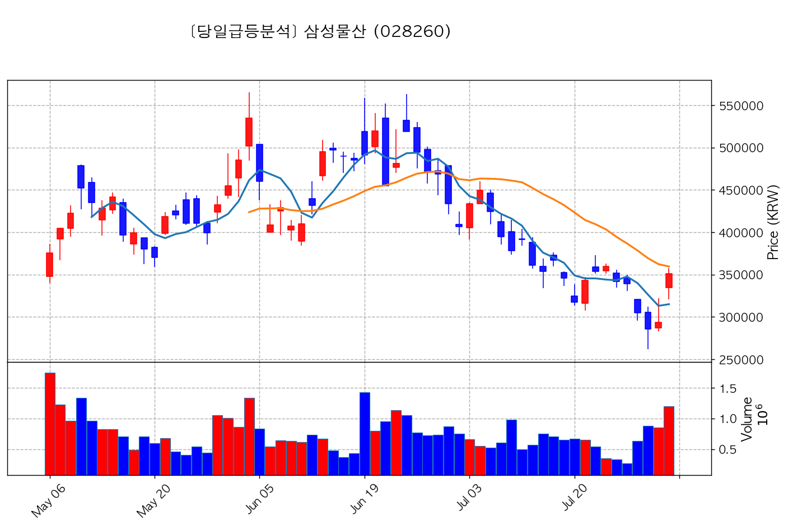
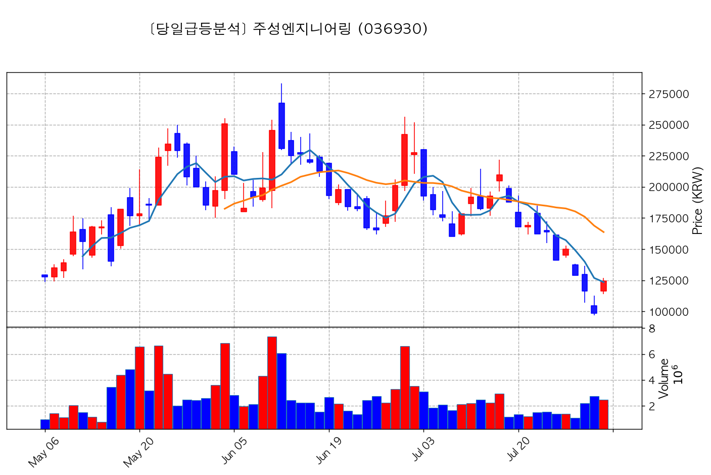

# 🔥 [당일 상한가/급등주 분석] 2026-07-31 시장 주도주 리포트

> 기준일: 2026-07-31 | [📈 매매전 스크리닝 보고서 보기](./2026-07-31_스크리닝.html)

---

## 🏆 1. 당일 상한가/하한가 달성 종목 (최대 5개)

#### 1) SK하이닉스 (000660) — <b>+29.95%</b>

- **종가**: 1,718,000원 | **거래대금**: 177767.5억
- **상승 이유 / 이슈**: 일반 시황

#### 2) SK스퀘어 (402340) — <b>+29.91%</b>

- **종가**: 1,038,000원 | **거래대금**: 10727.5억
- **상승 이유 / 이슈**: 일반 시황

#### 3) 삼성전기 (009150) — <b>+29.92%</b>

- **종가**: 1,142,000원 | **거래대금**: 6959.5억
- **상승 이유 / 이슈**: 일반 시황

#### 4) 제주반도체 (080220) — <b>+29.94%</b>

- **종가**: 65,100원 | **거래대금**: 2250.4억
- **상승 이유 / 이슈**: 📈 당일 주도 섹터[반도체] 연동 (+0.8점)

#### 5) 두산 (000150) — <b>+30.00%</b>

- **종가**: 1,170,000원 | **거래대금**: 1576.8억
- **상승 이유 / 이슈**: 일반 시황

---

## 🚀 2. 거래대금 150억+ & +15% 이상 폭등주 (최대 5개)

#### 1) 삼성전자 (005930) — <b>+26.81%</b>

- **종가**: 262,500원 | **거래대금**: 151945.1억
- **상승 이유 / 이슈**: 일반 시황

#### 2) 한미반도체 (042700) — <b>+27.98%</b>

- **종가**: 214,500원 | **거래대금**: 4664.0억
- **상승 이유 / 이슈**: 📈 당일 주도 섹터[반도체] 연동 (+0.8점)

#### 3) 삼성물산 (028260) — <b>+19.56%</b>

- **종가**: 351,500원 | **거래대금**: 4230.3억
- **상승 이유 / 이슈**: 일반 시황

#### 4) LS ELECTRIC (010120) — <b>+22.95%</b>

- **종가**: 184,800원 | **거래대금**: 3186.0억
- **상승 이유 / 이슈**: 일반 시황

#### 5) 주성엔지니어링 (036930) — <b>+26.65%</b>

- **종가**: 124,500원 | **거래대금**: 3063.9억
- **상승 이유 / 이슈**: 일반 시황

