# 📈 [실전플랜 1] 2026-07-31 (종가) 매매 후보 스크리닝 보고서

> 스크리닝 기준일: 2026-07-31 (종가) | 진입 예정일: 2026-08-03 (매매일) | [📊 익일 매매 성과 피드백 보고서 보기](./2026-08-03_피드백.html)

---

## 📊 1. 스크리닝 요약
- **전략 1 (양-음-양 눌림목)**: 10개 포착
- **전략 2 (일일봉 매집봉)**: 3개 포착
- **전략 3 (수급 낙폭과대 바닥형)**: 2개 포착
- **총 포착 수**: 15개 종목 (TOP 선택 6개)

---

## 🔵 1. 전략 1 — 양-음-양 눌림목 (3% × 3슬롯)

#### 1) 현대힘스 (460930) — ★ TOP 1 선택

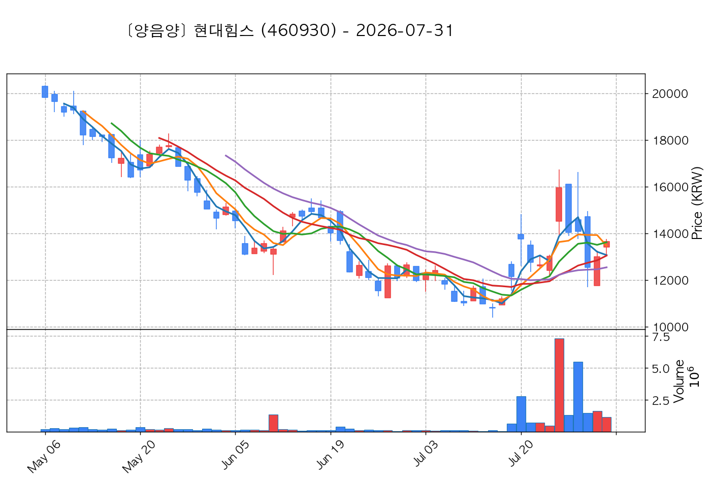

- **기준 종가**: 13,650원 | **거래대금**: 158억
- **분석 사유**: 과거 2026-07-24 기준봉 후 현재 5일선 지지

#### 2) 서산 (079650) — ★ TOP 2 선택

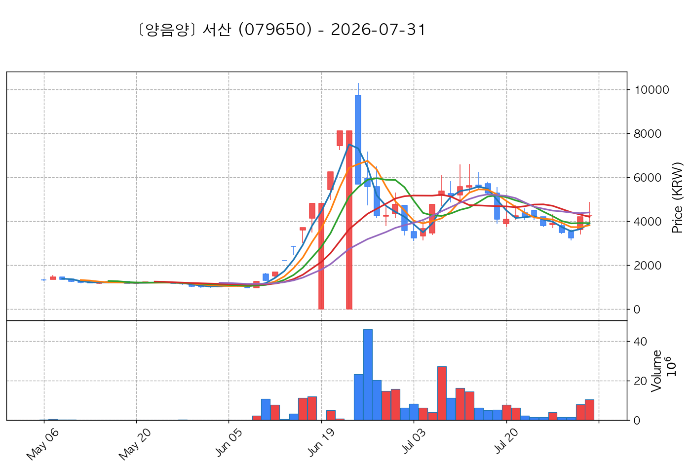

- **기준 종가**: 4,250원 | **거래대금**: 443억
- **분석 사유**: 과거 2026-07-30 기준봉 후 현재 13일선 지지

#### 3) 씨피시스템 (413630) — ★ TOP 3 선택 (사윗감)

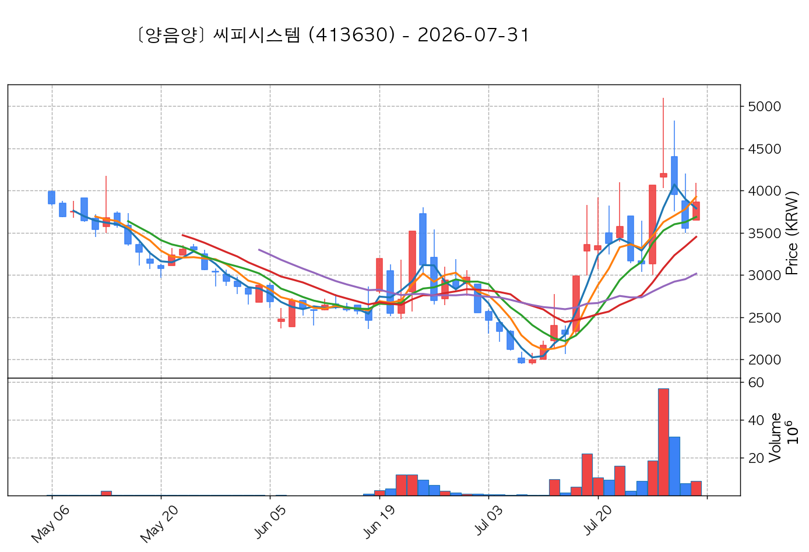

- **기준 종가**: 3,865원 | **거래대금**: 301억
- **분석 사유**: 과거 2026-07-27 기준봉 후 현재 5일선 지지

#### 4) 파세코 (037070) — 후보군 (1위)

- **기준 종가**: 6,610원 | **거래대금**: 115억
- **분석 사유**: 과거 2026-07-24 기준봉 후 현재 5일선 지지

#### 5) 위닉스 (044340) — 후보군 (2위) (사윗감)

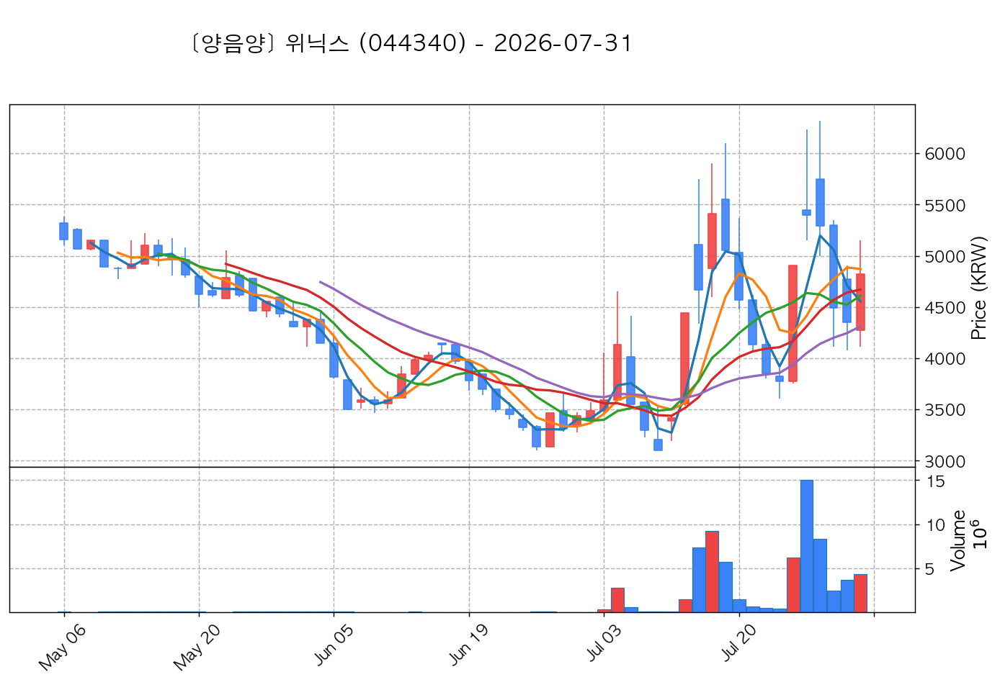

- **기준 종가**: 4,825원 | **거래대금**: 206억
- **분석 사유**: 과거 2026-07-24 기준봉 후 현재 5일선 지지

#### 6) 야스 (255440) — 후보군 (3위)

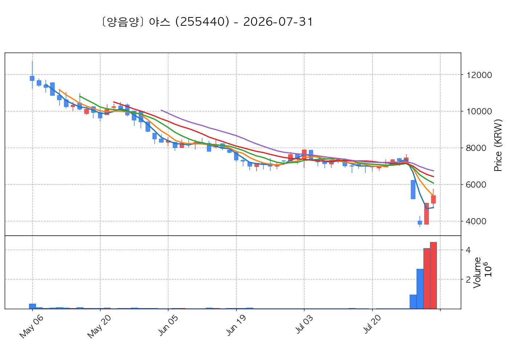

- **기준 종가**: 5,380원 | **거래대금**: 241억
- **분석 사유**: 과거 2026-07-30 기준봉 후 현재 5일선 지지

#### 7) 뉴엔AI (463020) — 후보군 (4위) (사윗감)

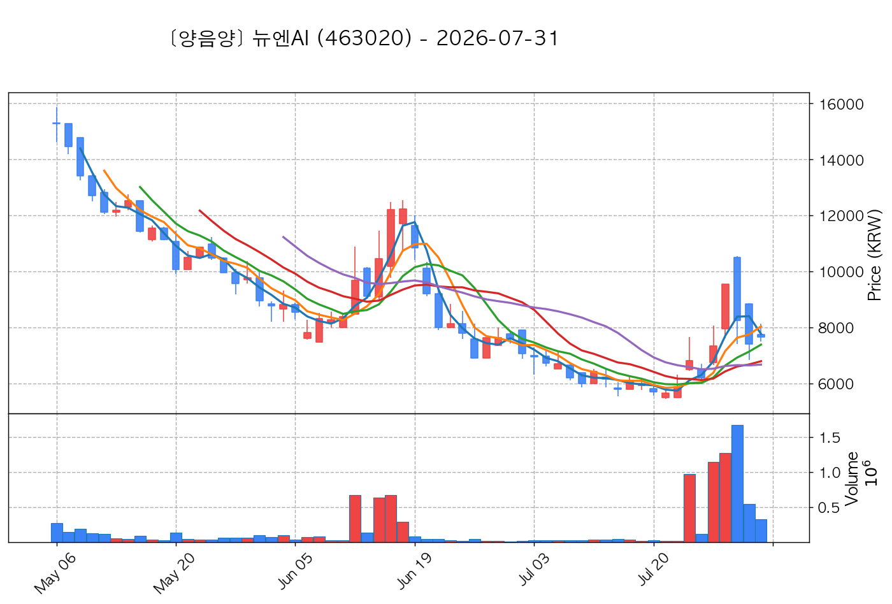

- **기준 종가**: 7,650원 | **거래대금**: 25억
- **분석 사유**: 과거 2026-07-28 기준봉 후 현재 3일선 지지

#### 8) 케이엔알시스템 (199430) — 후보군 (5위)

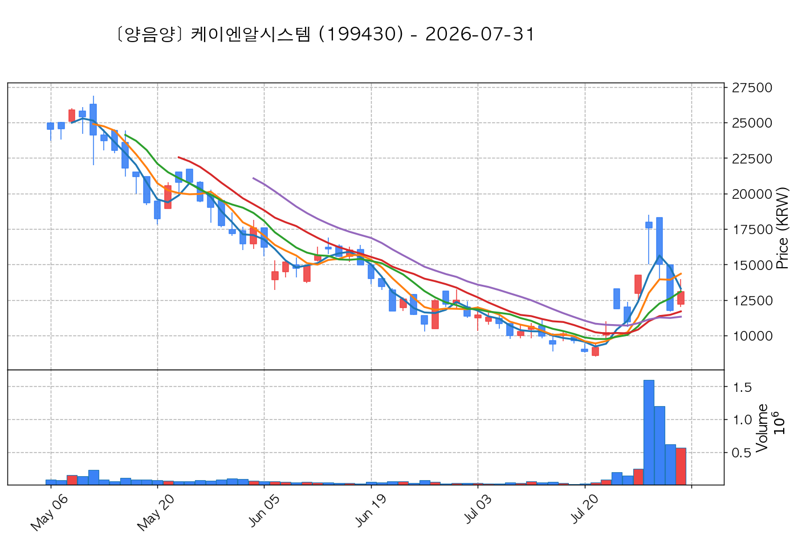

- **기준 종가**: 13,100원 | **거래대금**: 74억
- **분석 사유**: 과거 2026-07-27 기준봉 후 현재 3일선 지지

#### 9) 셀리드 (299660) — 후보군 (6위)

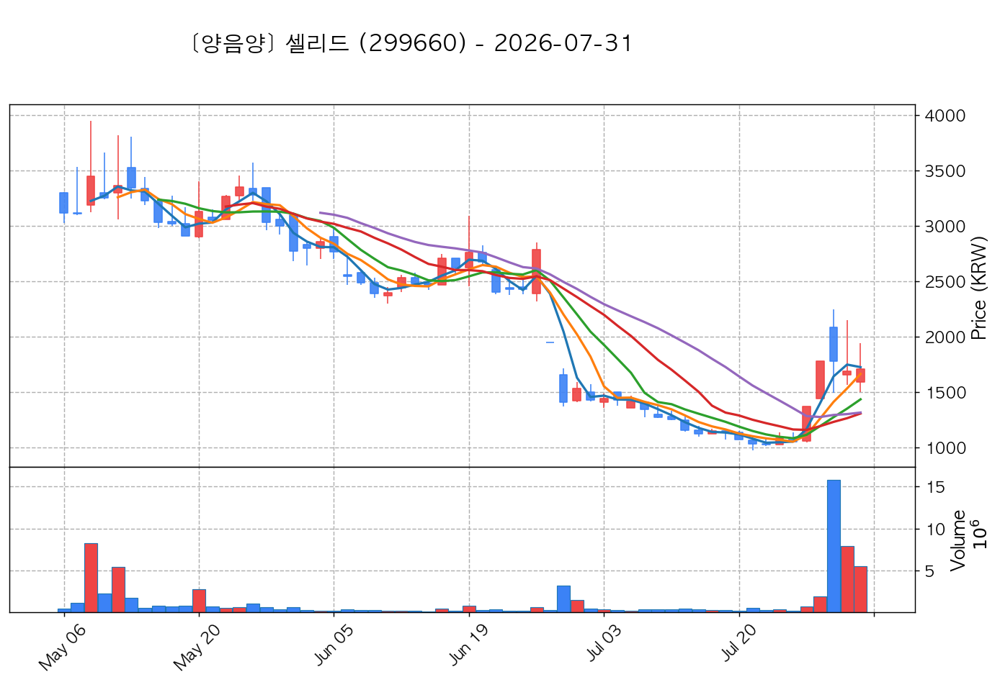

- **기준 종가**: 1,707원 | **거래대금**: 93억
- **분석 사유**: 과거 2026-07-27 기준봉 후 현재 3일선 지지

#### 10) 엔젤로보틱스 (455900) — 후보군 (7위)

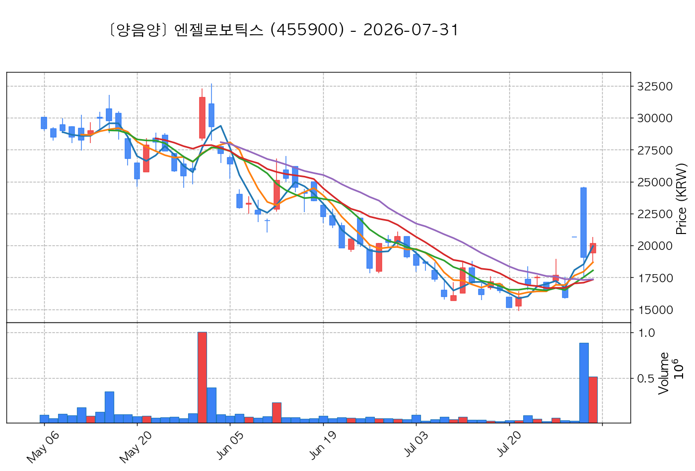

- **기준 종가**: 20,150원 | **거래대금**: 103억
- **분석 사유**: 과거 2026-07-29 기준봉 후 현재 3일선 지지

## 🟡 2. 전략 2 — 일일봉 매집봉 (10% × 1슬롯)

#### 1) 금호전기 (001210) — ★ TOP 1 선택

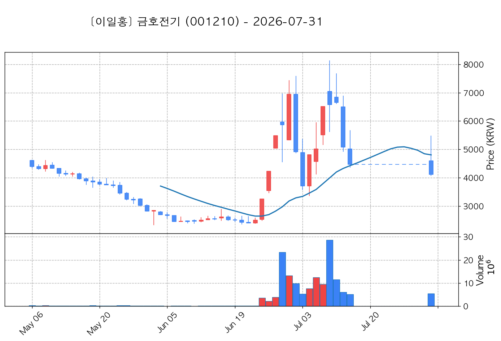

- **기준 종가**: 4,115원 | **거래대금**: 223억
- **분석 사유**: 과거 2026-06-30 매집봉 ➔ 240일선 근접 지지 (-0.20%)

#### 2) 뉴파워프라즈마 (144960) — 후보군 (1위)

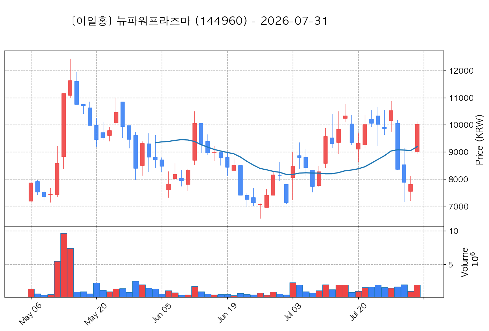

- **기준 종가**: 10,010원 | **거래대금**: 190억
- **분석 사유**: ★ [1순위 키움정석] 40일 최고가 근접 + 60일선 상승 + 시가대비 +11.1% 속양봉

#### 3) 아이로보틱스 (066430) — 후보군 (2위)

- **기준 종가**: 2,005원 | **거래대금**: 32억
- **분석 사유**: 과거 2026-07-21 매집봉 ➔ 240일선 근접 지지 (-2.19%)

## 🟢 3. 전략 3 — 수급 낙폭과대 바닥형 (10% × 2슬롯)

#### 1) 한화엔진 (082740) — ★ TOP 1 선택

- **기준 종가**: 39,050원 | **거래대금**: 895억
- **분석 사유**: 52주 고점 대비 (41.4%) ➔ 20일 메이저 수급 100억+ 유입 ➔ 없음 지지 안착

#### 2) 한진칼 (180640) — ★ TOP 2 선택

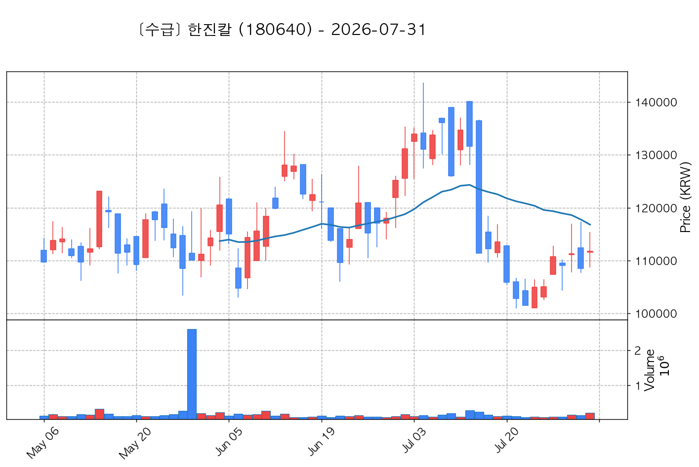

- **기준 종가**: 111,700원 | **거래대금**: 233억
- **분석 사유**: 52주 고점 대비 (63.5%) ➔ 20일 메이저 수급 100억+ 유입 ➔ 없음 지지 안착

