# 📊 [실전플랜 1 피드백] 2026-07-31 매매 성과 추적 보고서

> 스크리닝 포착일: 2026-07-30 (종가) | 실제 매매(추적일): 2026-07-31 (매매일) | [📈 매매전 스크리닝 보고서 보기](./2026-07-30_스크리닝.html)

---

## 📊 1. 당일 매매 성과 요약
- **포착 및 검증 종목 수**: 총 21개 종목

---

## 🔵 전략 1 — 양-음-양 눌림목 성과

#### 1) OCI홀딩스 (010060) — ★ TOP 1 선택 | ✅ 1차 목표 달성 (+10.7%)

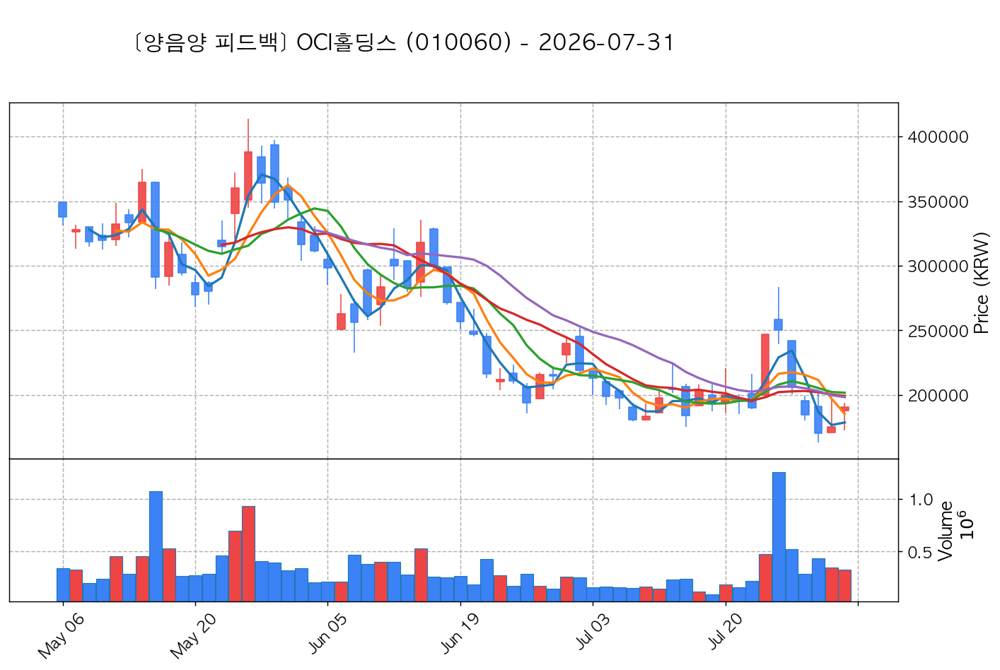

- **전일 종가(기준가)**: 175,400원 ➔ **매매일 시초가**: 188,000원 | **최고가**: 194,100원 (<b>+10.66%</b>) | **종가**: 190,300원 (+8.49%)
- **시세 움직임 복기**: 과거 2026-07-23 기준봉 후 현재 3일선 지지

#### 2) 씨피시스템 (413630) — ★ TOP 2 선택 | ✅ 1차 목표 달성 (+15.2%)

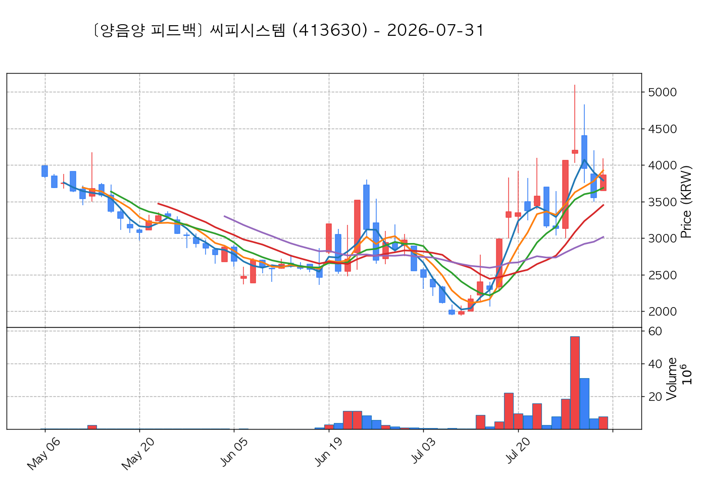

- **전일 종가(기준가)**: 3,550원 ➔ **매매일 시초가**: 3,650원 | **최고가**: 4,090원 (<b>+15.21%</b>) | **종가**: 3,865원 (+8.87%)
- **시세 움직임 복기**: 과거 2026-07-27 기준봉 후 현재 8일선 지지

#### 3) 지엔씨에너지 (119850) — ★ TOP 3 선택 | ✅ 1차 목표 달성 (+28.1%)

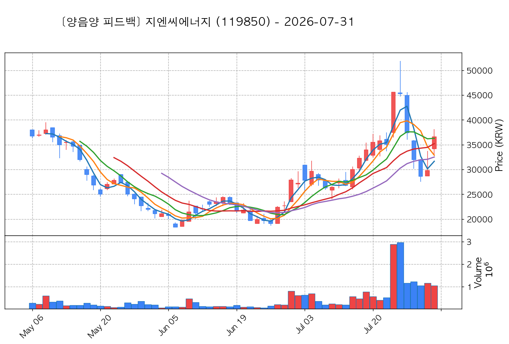

- **전일 종가(기준가)**: 29,750원 ➔ **매매일 시초가**: 34,150원 | **최고가**: 38,100원 (<b>+28.07%</b>) | **종가**: 36,600원 (+23.03%)
- **시세 움직임 복기**: 과거 2026-07-23 기준봉 후 현재 3일선 지지 (사윗감형)

#### 4) 에스피지 (058610) — 후보군 | ✅ 1차 목표 달성 (+27.5%)

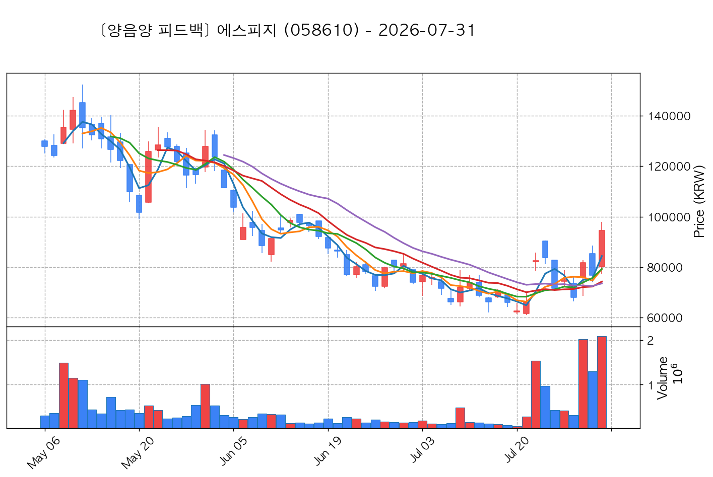

- **전일 종가(기준가)**: 76,800원 ➔ **매매일 시초가**: 80,200원 | **최고가**: 97,900원 (<b>+27.47%</b>) | **종가**: 94,600원 (+23.18%)
- **시세 움직임 복기**: 과거 2026-07-29 기준봉 후 현재 3일선 지지

#### 5) SK오션플랜트 (100090) — 후보군 | ✅ 1차 목표 달성 (+8.5%)

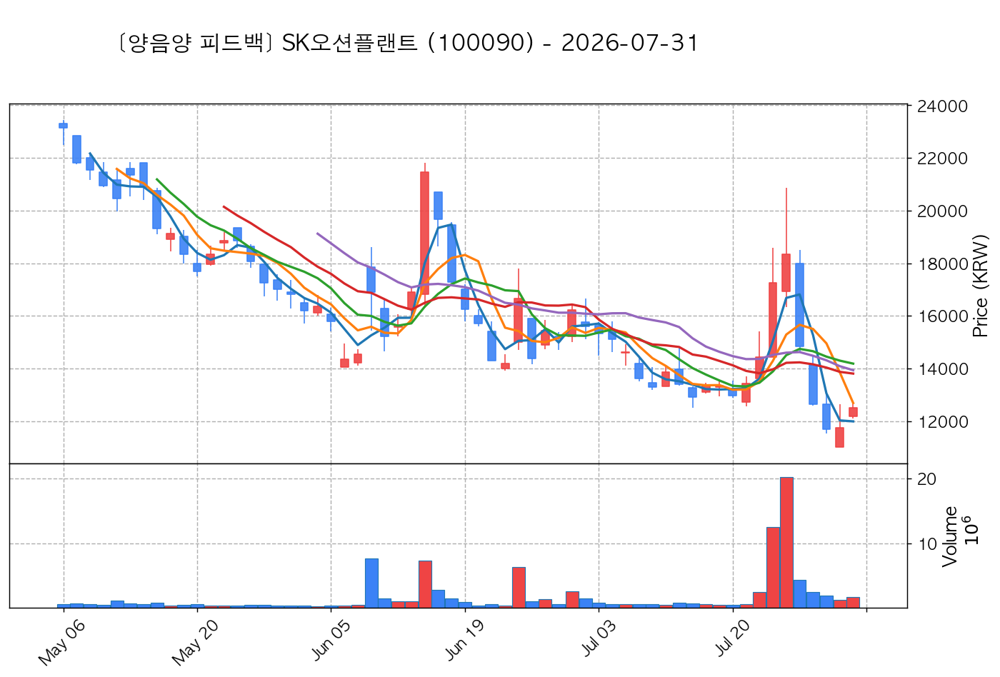

- **전일 종가(기준가)**: 11,750원 ➔ **매매일 시초가**: 12,170원 | **최고가**: 12,750원 (<b>+8.51%</b>) | **종가**: 12,520원 (+6.55%)
- **시세 움직임 복기**: 과거 2026-07-23 기준봉 후 현재 3일선 지지

#### 6) 현대힘스 (460930) — 후보군 | ✅ 1차 목표 달성 (+5.8%)

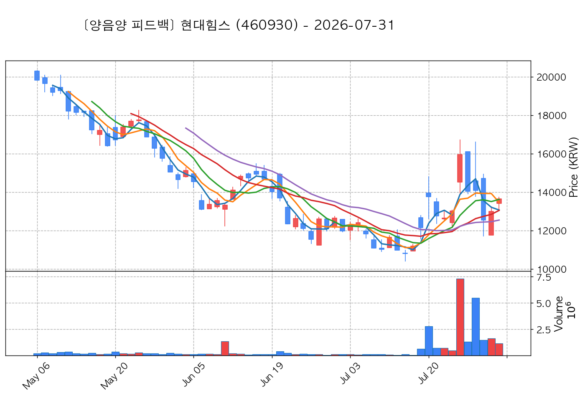

- **전일 종가(기준가)**: 13,000원 ➔ **매매일 시초가**: 13,400원 | **최고가**: 13,760원 (<b>+5.85%</b>) | **종가**: 13,650원 (+5.00%)
- **시세 움직임 복기**: 과거 2026-07-24 기준봉 후 현재 3일선 지지

#### 7) 다날 (064260) — 후보군 | ✅ 1차 목표 달성 (+9.3%)

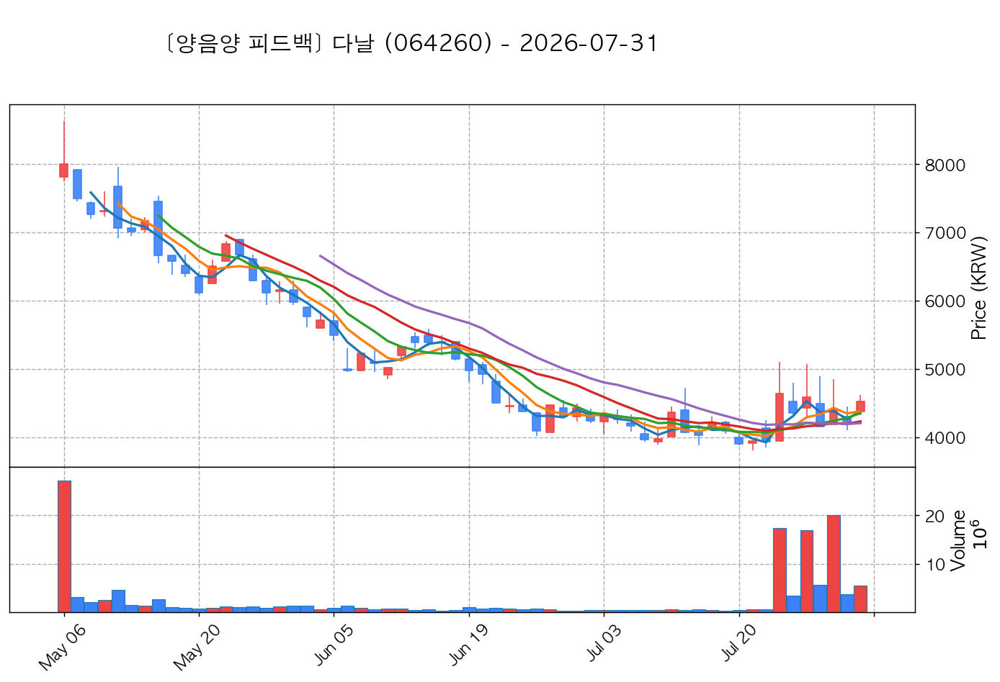

- **전일 종가(기준가)**: 4,225원 ➔ **매매일 시초가**: 4,380원 | **최고가**: 4,620원 (<b>+9.35%</b>) | **종가**: 4,520원 (+6.98%)
- **시세 움직임 복기**: 과거 2026-07-23 기준봉 후 현재 3일선 지지

#### 8) HD현대에너지솔루션 (322000) — 후보군 | ✅ 1차 목표 달성 (+11.5%)

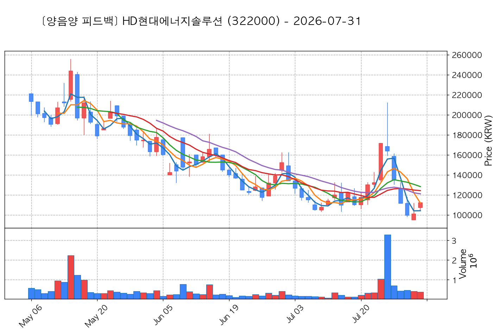

- **전일 종가(기준가)**: 101,100원 ➔ **매매일 시초가**: 107,500원 | **최고가**: 112,700원 (<b>+11.47%</b>) | **종가**: 112,100원 (+10.88%)
- **시세 움직임 복기**: 과거 2026-07-23 기준봉 후 현재 3일선 지지 (사윗감형)

#### 9) 파세코 (037070) — 후보군 | ✅ 1차 목표 달성 (+11.2%)

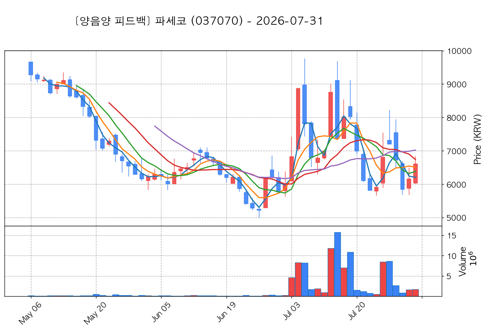

- **전일 종가(기준가)**: 6,160원 ➔ **매매일 시초가**: 6,030원 | **최고가**: 6,850원 (<b>+11.20%</b>) | **종가**: 6,610원 (+7.31%)
- **시세 움직임 복기**: 과거 2026-07-24 기준봉 후 현재 3일선 지지

#### 10) 자이에스앤디 (317400) — 후보군 | ✅ 1차 목표 달성 (+16.9%)

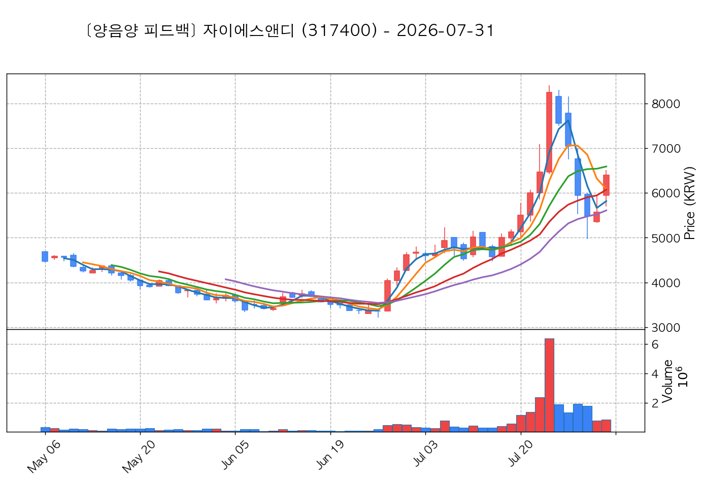

- **전일 종가(기준가)**: 5,570원 ➔ **매매일 시초가**: 5,950원 | **최고가**: 6,510원 (<b>+16.88%</b>) | **종가**: 6,400원 (+14.90%)
- **시세 움직임 복기**: 과거 2026-07-23 기준봉 후 현재 3일선 지지

#### 11) 아이크래프트 (052460) — 후보군 | ✅ 1차 목표 달성 (+15.7%)

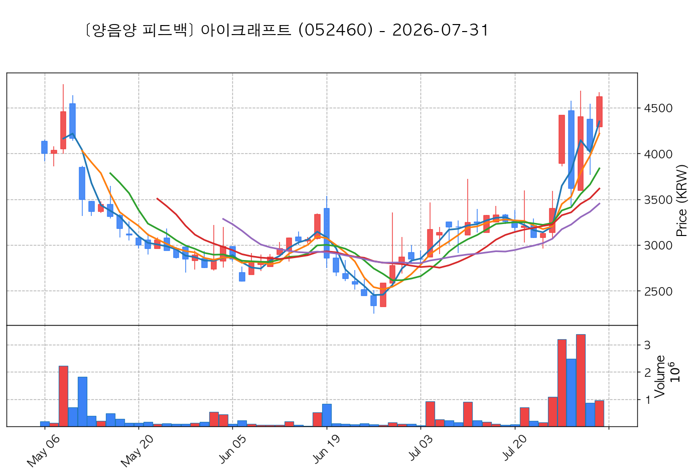

- **전일 종가(기준가)**: 4,035원 ➔ **매매일 시초가**: 4,290원 | **최고가**: 4,670원 (<b>+15.74%</b>) | **종가**: 4,620원 (+14.50%)
- **시세 움직임 복기**: 과거 2026-07-27 기준봉 후 현재 3일선 지지

#### 12) 일승 (333430) — 후보군 | ✅ 1차 목표 달성 (+15.8%)

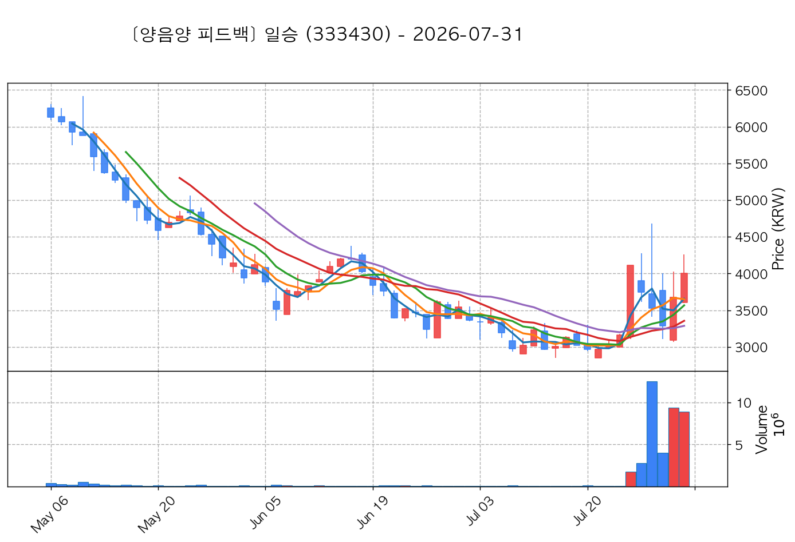

- **전일 종가(기준가)**: 3,680원 ➔ **매매일 시초가**: 3,610원 | **최고가**: 4,260원 (<b>+15.76%</b>) | **종가**: 4,005원 (+8.83%)
- **시세 움직임 복기**: 과거 2026-07-24 기준봉 후 현재 5일선 지지

#### 13) 폴라리스AI (039980) — 후보군 | ✅ 1차 목표 달성 (+14.3%)

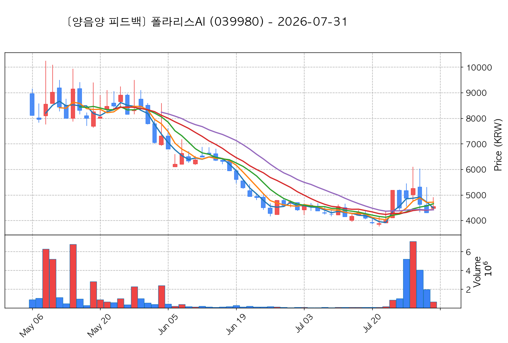

- **전일 종가(기준가)**: 4,295원 ➔ **매매일 시초가**: 4,465원 | **최고가**: 4,910원 (<b>+14.32%</b>) | **종가**: 4,540원 (+5.70%)
- **시세 움직임 복기**: 과거 2026-07-23 기준봉 후 현재 13일선 지지

#### 14) 오브젠 (417860) — 후보군 | ✅ 1차 목표 달성 (+10.7%)

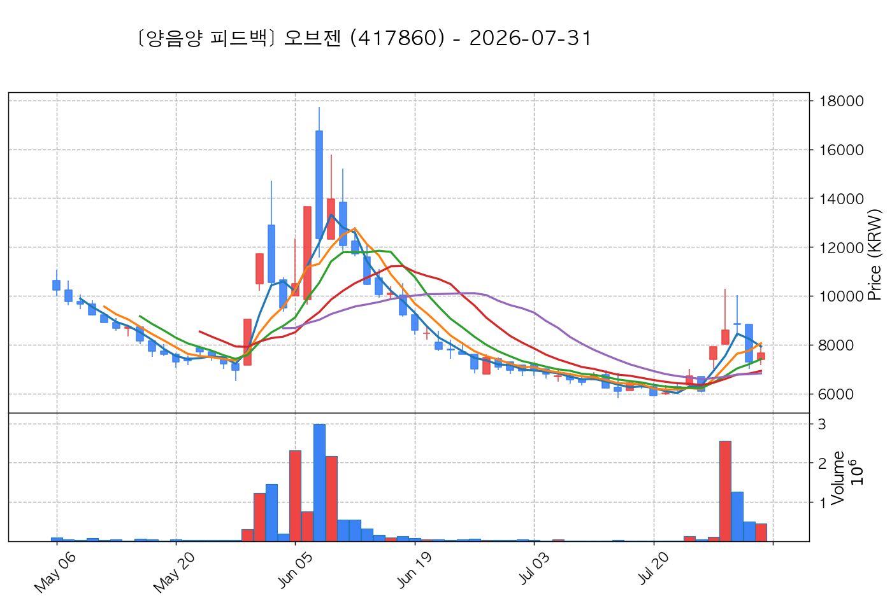

- **전일 종가(기준가)**: 7,300원 ➔ **매매일 시초가**: 7,390원 | **최고가**: 8,080원 (<b>+10.68%</b>) | **종가**: 7,660원 (+4.93%)
- **시세 움직임 복기**: 과거 2026-07-27 기준봉 후 현재 8일선 지지

## 🟡 전략 2 — 일일봉 매집봉 성과

#### 1) 세아메카닉스 (396300) — ★ TOP 1 선택 | ✅ 1차 목표 달성 (+9.3%)

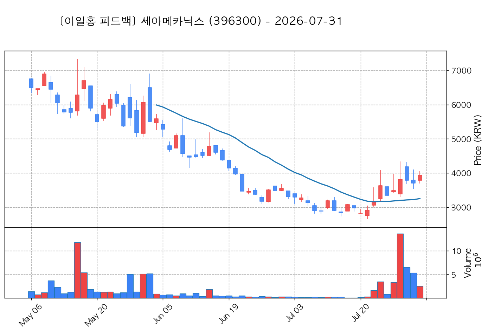

- **전일 종가(기준가)**: 3,705원 ➔ **매매일 시초가**: 3,785원 | **최고가**: 4,050원 (<b>+9.31%</b>) | **종가**: 3,945원 (+6.48%)
- **시세 움직임 복기**: 과거 2026-07-22 매집봉 ➔ 240일선 근접 지지 (+1.01%)

#### 2) 광주신세계 (037710) — 후보군 | ✅ 1차 목표 달성 (+10.7%)

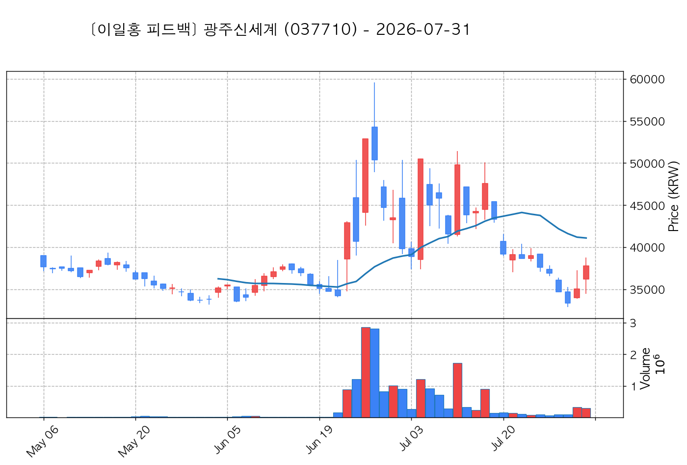

- **전일 종가(기준가)**: 35,050원 ➔ **매매일 시초가**: 36,200원 | **최고가**: 38,800원 (<b>+10.70%</b>) | **종가**: 37,800원 (+7.85%)
- **시세 움직임 복기**: 과거 2026-06-23 매집봉 ➔ 240일선 근접 지지 (+1.89%)

#### 3) 강스템바이오텍 (217730) — 후보군 | ✅ 1차 목표 달성 (+6.5%)

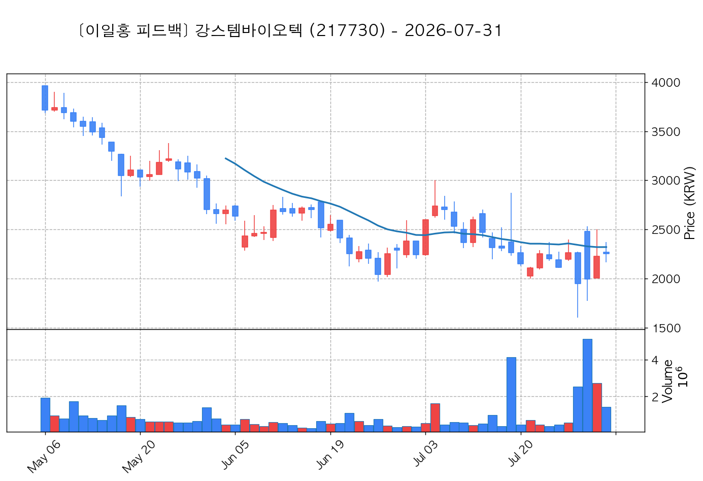

- **전일 종가(기준가)**: 2,225원 ➔ **매매일 시초가**: 2,270원 | **최고가**: 2,370원 (<b>+6.52%</b>) | **종가**: 2,250원 (+1.12%)
- **시세 움직임 복기**: 과거 2026-07-16 매집봉 ➔ 240일선 근접 지지 (+0.75%)

#### 4) 시선AI (340810) — 후보군 | ✅ 1차 목표 달성 (+22.4%)

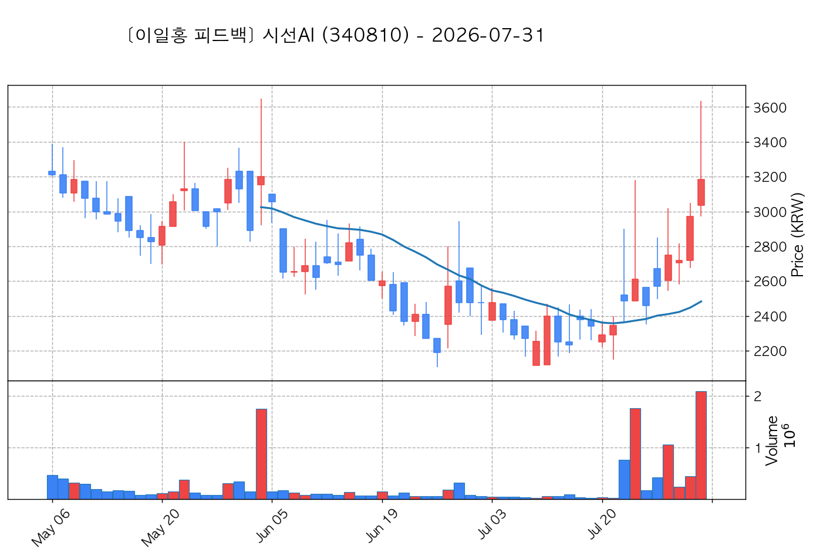

- **전일 종가(기준가)**: 2,970원 ➔ **매매일 시초가**: 3,035원 | **최고가**: 3,635원 (<b>+22.39%</b>) | **종가**: 3,185원 (+7.24%)
- **시세 움직임 복기**: 과거 2026-06-04 매집봉 ➔ 240일선 근접 지지 (-2.08%)

## 🟢 전략 3 — 수급 낙폭과대 바닥형 성과

#### 1) GS건설 (006360) — ★ TOP 1 선택 | ✅ 1차 목표 달성 (+9.0%)

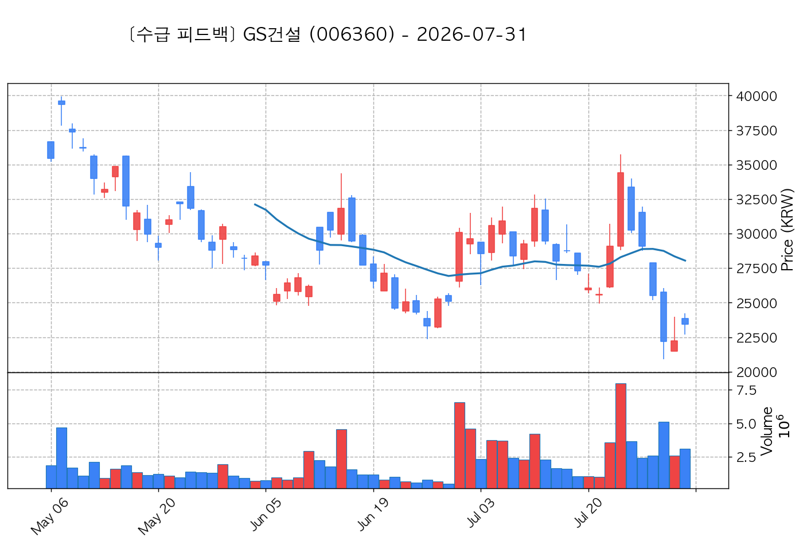

- **전일 종가(기준가)**: 22,250원 ➔ **매매일 시초가**: 23,850원 | **최고가**: 24,250원 (<b>+8.99%</b>) | **종가**: 23,450원 (+5.39%)
- **시세 움직임 복기**: 52주 대비 바닥권(49.6%) ➔ 수급 확인 ➔ 2026-07-24일 60일선 핥기 및 반등 포착

#### 2) 한화엔진 (082740) — ★ TOP 2 선택 | ✅ 1차 목표 달성 (+5.5%)

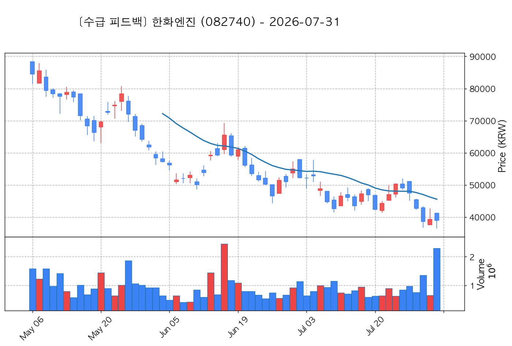

- **전일 종가(기준가)**: 39,300원 ➔ **매매일 시초가**: 41,300원 | **최고가**: 41,450원 (<b>+5.47%</b>) | **종가**: 39,050원 (-0.64%)
- **시세 움직임 복기**: 52주 대비 바닥권(41.6%) ➔ 수급 확인 ➔ N/A일 없음 핥기 및 반등 포착

#### 3) BNK금융지주 (138930) — 후보군 | ✅ 1차 목표 달성 (+4.0%)

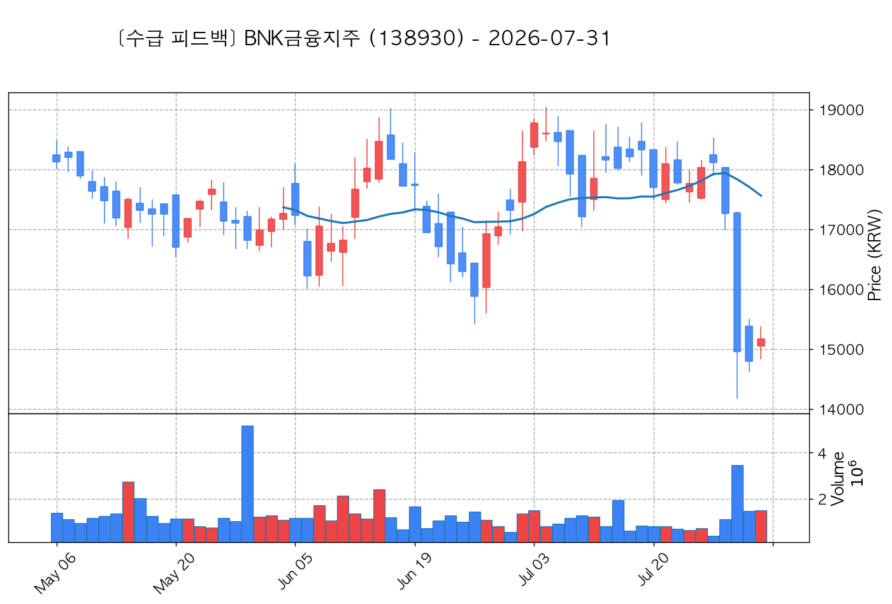

- **전일 종가(기준가)**: 14,800원 ➔ **매매일 시초가**: 15,050원 | **최고가**: 15,390원 (<b>+3.99%</b>) | **종가**: 15,170원 (+2.50%)
- **시세 움직임 복기**: 52주 대비 바닥권(64.2%) ➔ 수급 확인 ➔ 2026-07-28일 60일선 핥기 및 반등 포착

