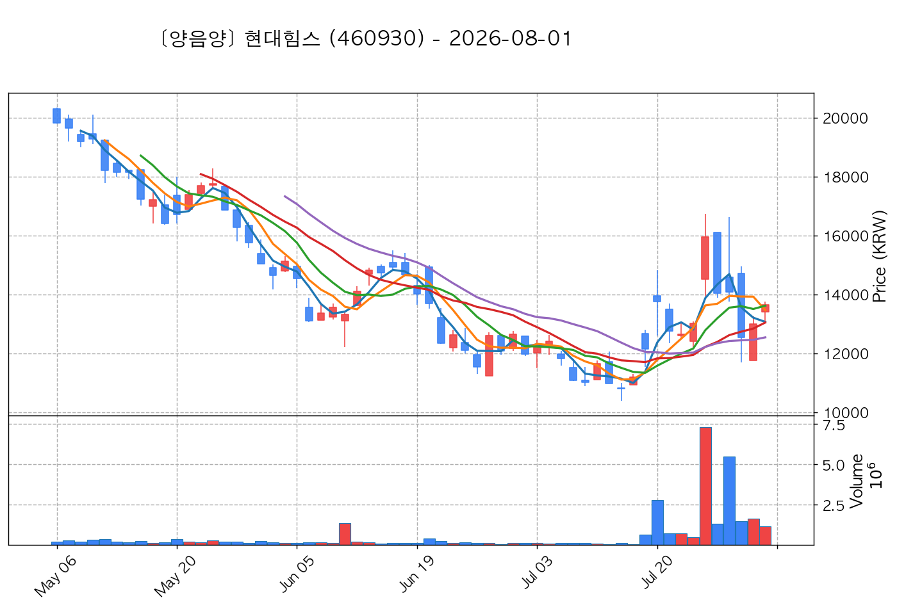
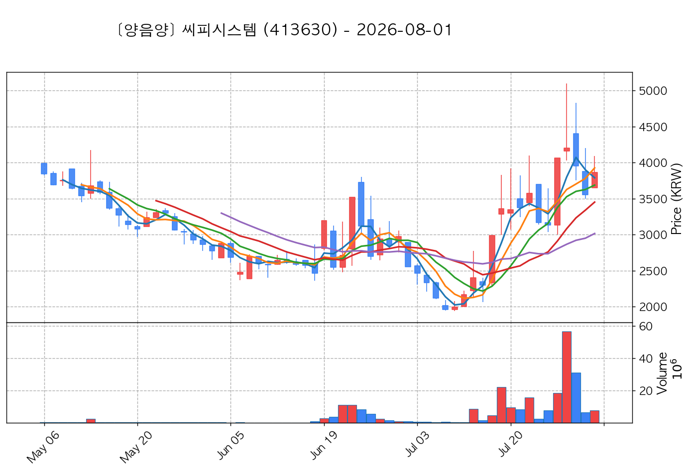
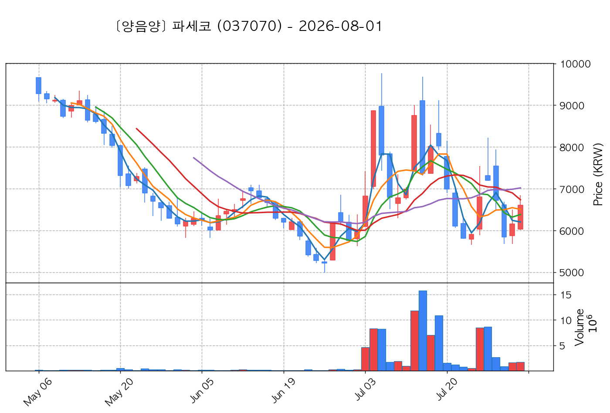
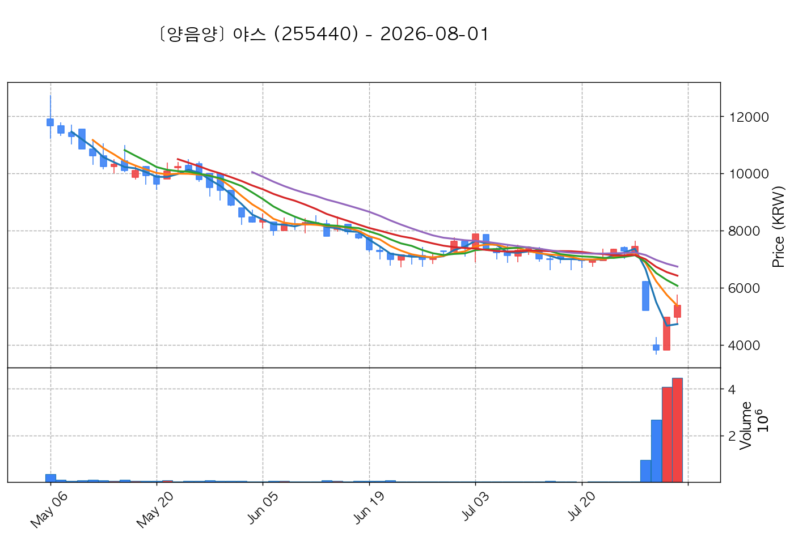
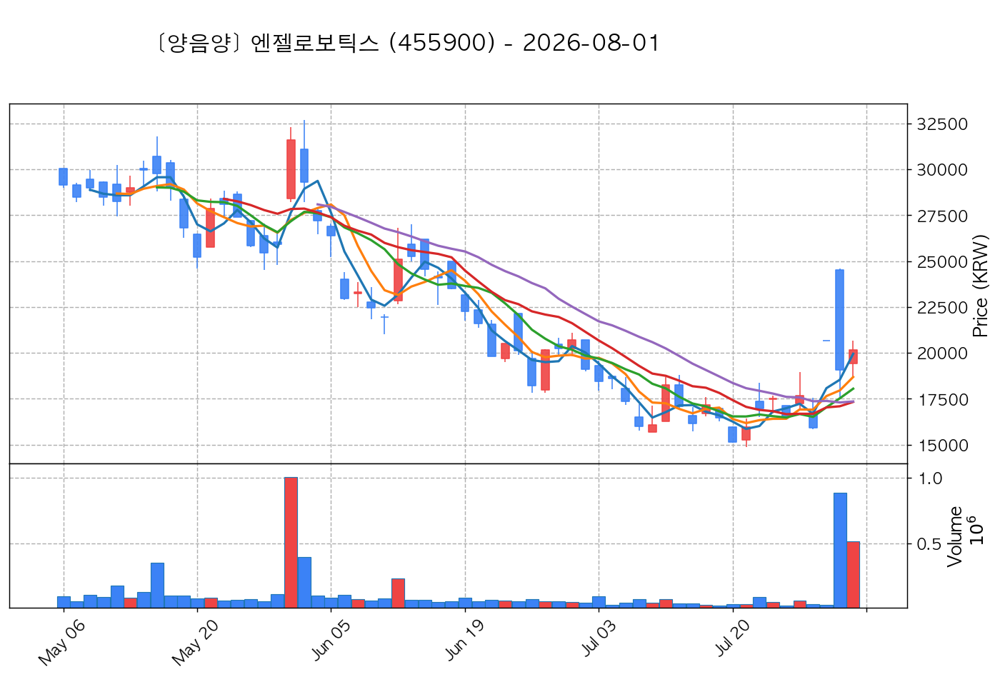
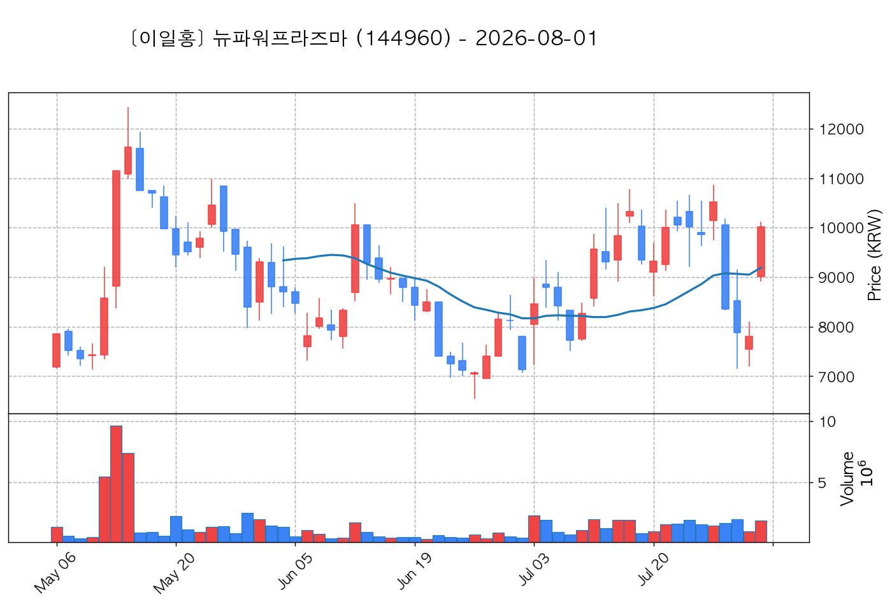
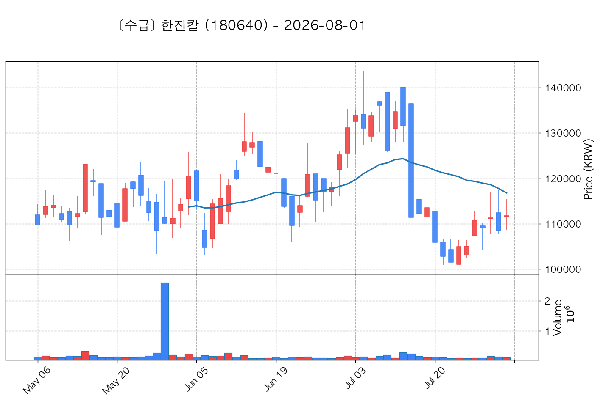

# 📈 [실전플랜 1] 2026-08-01 매매 후보 스크리닝 보고서

> 스크리닝 기준일: 2026-08-01 | [📊 익일 매매 성과 피드백 보고서 보기](./2026-08-01_피드백.html)

---

## 📊 1. 스크리닝 성과 요약

| 전략 | 주요 기법 | 종목수(TOP) |
| :--- | :--- | :---: |
| **전략 1** | 양음양 눌림목 & 사윗감 | 9개 (TOP 3개) |
| **전략 2** | 매집봉 & 이일홍 | 4개 (TOP 1개) |
| **전략 3** | 수급 & 핥 | 3개 (TOP 2개) |
| **합계** | **3대 핵심 전략 통합** | **16개 (TOP 6개)** |

---

## 🔵 3. 전략 1 — 양-음-양 눌림목 (3% × 3슬롯)

### 📋 전략 1 전체 9개 포착 종목 요약표

| 종목명 | 기준일종가 | 기준봉 | 지지선 | 비고 및 선정 상태 |
| :--- | ---: | :--- | :---: | :--- |
| **현대힘스** (460930) | 13,650원 | +22.5% 장대양봉 | 5일선 | **★ TOP 1 선택** |
| **씨피시스템** (413630) | 3,865원 | 상한가 | 5일선 | **★ TOP 2 선택** (사윗감) |
| **파세코** (037070) | 6,610원 | +15.2% 장대양봉 | 5일선 | **★ TOP 3 선택** |
| **서산** (079650) | 4,250원 | 상한가 | 13일선 | 후보군 (1위) |
| **위닉스** (044340) | 4,825원 | 상한가 | 5일선 | 후보군 (2위) (사윗감) |
| **야스** (255440) | 5,380원 | 상한가 | 5일선 | 후보군 (3위) |
| **케이엔알시스템** (199430) | 13,100원 | 상한가 | 3일선 | 후보군 (4위) |
| **셀리드** (299660) | 1,707원 | 상한가 | 3일선 | 후보군 (5위) |
| **엔젤로보틱스** (455900) | 20,150원 | 상한가 | 3일선 | 후보군 (6위) |

---

### 🔍 전략 1 상세 분석

#### 1) 현대힘스 (460930) — ★ TOP 1 선택

- **기준 종가**: 13,650원 | **거래대금**: 158억
- **분석 사유**: 과거 2026-07-24 기준봉 후 현재 5일선 지지

#### 2) 씨피시스템 (413630) — ★ TOP 2 선택 (사윗감)

- **기준 종가**: 3,865원 | **거래대금**: 298억
- **분석 사유**: 과거 2026-07-27 기준봉 후 현재 5일선 지지

#### 3) 파세코 (037070) — ★ TOP 3 선택

- **기준 종가**: 6,610원 | **거래대금**: 113억
- **분석 사유**: 과거 2026-07-24 기준봉 후 현재 5일선 지지

#### 4) 서산 (079650) — 후보군 (1위)

- **기준 종가**: 4,250원 | **거래대금**: 441억
- **분석 사유**: 과거 2026-07-30 기준봉 후 현재 13일선 지지

#### 5) 위닉스 (044340) — 후보군 (2위) (사윗감)

- **기준 종가**: 4,825원 | **거래대금**: 204억
- **분석 사유**: 과거 2026-07-24 기준봉 후 현재 5일선 지지

#### 6) 야스 (255440) — 후보군 (3위)

- **기준 종가**: 5,380원 | **거래대금**: 240억
- **분석 사유**: 과거 2026-07-30 기준봉 후 현재 5일선 지지

#### 7) 케이엔알시스템 (199430) — 후보군 (4위)

- **기준 종가**: 13,100원 | **거래대금**: 73억
- **분석 사유**: 과거 2026-07-27 기준봉 후 현재 3일선 지지

#### 8) 셀리드 (299660) — 후보군 (5위)

- **기준 종가**: 1,707원 | **거래대금**: 93억
- **분석 사유**: 과거 2026-07-27 기준봉 후 현재 3일선 지지

#### 9) 엔젤로보틱스 (455900) — 후보군 (6위)

- **기준 종가**: 20,150원 | **거래대금**: 103억
- **분석 사유**: 과거 2026-07-29 기준봉 후 현재 3일선 지지

## 🟡 4. 전략 2 — 일일봉 매집봉 (10% × 1슬롯)

### 📋 전략 2 전체 4개 포착 종목 요약표

| 종목명 | 기준일종가 | 기준봉 | 지지선 | 비고 및 선정 상태 |
| :--- | ---: | :--- | :---: | :--- |
| **뉴파워프라즈마** (144960) | 10,010원 | ★ [1순위 키움정석] 40일 최고가 근접 + 60일선 상승 + 시가대비 +11.1% 속양봉 | 240일선 | **★ TOP 1 선택** |
| **금호전기** (001210) | 4,115원 | 과거 2026-06-30 매집봉 ➔ 240일선 근접 지지 (-0.20%) | 240일선 | 후보군 (1위) |
| **아이로보틱스** (066430) | 2,005원 | 과거 2026-07-21 매집봉 ➔ 240일선 근접 지지 (-2.19%) | 240일선 | 후보군 (2위) |
| **강스템바이오텍** (217730) | 2,250원 | 과거 2026-07-16 매집봉 ➔ 240일선 근접 지지 (+1.71%) | 240일선 | 후보군 (3위) |

---

### 🔍 전략 2 상세 분석

#### 1) 뉴파워프라즈마 (144960) — ★ TOP 1 선택

- **기준 종가**: 10,010원 | **거래대금**: 190억
- **분석 사유**: ★ [1순위 키움정석] 40일 최고가 근접 + 60일선 상승 + 시가대비 +11.1% 속양봉

#### 2) 금호전기 (001210) — 후보군 (1위)

- **기준 종가**: 4,115원 | **거래대금**: 221억
- **분석 사유**: 과거 2026-06-30 매집봉 ➔ 240일선 근접 지지 (-0.20%)

#### 3) 아이로보틱스 (066430) — 후보군 (2위)

- **기준 종가**: 2,005원 | **거래대금**: 32억
- **분석 사유**: 과거 2026-07-21 매집봉 ➔ 240일선 근접 지지 (-2.19%)

#### 4) 강스템바이오텍 (217730) — 후보군 (3위)

- **기준 종가**: 2,250원 | **거래대금**: 32억
- **분석 사유**: 과거 2026-07-16 매집봉 ➔ 240일선 근접 지지 (+1.71%)

## 🟢 5. 전략 3 — 수급 낙폭과대 바닥형 (10% × 2슬롯)

### 📋 전략 3 전체 3개 포착 종목 요약표

| 종목명 | 기준일종가 | 기준봉 | 지지선 | 비고 및 선정 상태 |
| :--- | ---: | :--- | :---: | :--- |
| **한국항공우주** (047810) | 127,300원 | 52주 대비 바닥권(59.1%) ➔ 수급 확인 ➔ N/A일 없음 핥기 및 반등 포착 | 수급선 | **★ TOP 1 선택** |
| **한국전력** (015760) | 34,800원 | 52주 대비 바닥권(50.1%) ➔ 수급 확인 ➔ N/A일 없음 핥기 및 반등 포착 | 수급선 | **★ TOP 2 선택** |
| **한진칼** (180640) | 111,700원 | 52주 대비 바닥권(63.5%) ➔ 수급 확인 ➔ N/A일 없음 핥기 및 반등 포착 | 수급선 | 후보군 (1위) |

---

### 🔍 전략 3 상세 분석

#### 1) 한국항공우주 (047810) — ★ TOP 1 선택

- **기준 종가**: 127,300원 | **거래대금**: 938억
- **분석 사유**: 52주 대비 바닥권(59.1%) ➔ 수급 확인 ➔ N/A일 없음 핥기 및 반등 포착

#### 2) 한국전력 (015760) — ★ TOP 2 선택

- **기준 종가**: 34,800원 | **거래대금**: 618억
- **분석 사유**: 52주 대비 바닥권(50.1%) ➔ 수급 확인 ➔ N/A일 없음 핥기 및 반등 포착

#### 3) 한진칼 (180640) — 후보군 (1위)

- **기준 종가**: 111,700원 | **거래대금**: 120억
- **분석 사유**: 52주 대비 바닥권(63.5%) ➔ 수급 확인 ➔ N/A일 없음 핥기 및 반등 포착

