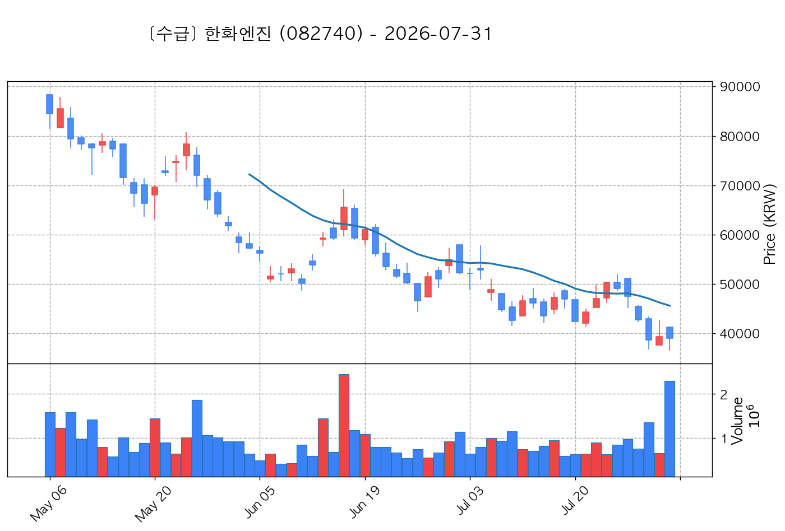

# 📈 [실전플랜 1] 8월 첫 거래일 매매 후보 스크리닝 종합 배포 보고서

> **스크리닝 기준일**: 2026년 7월 31일 종가  
> **8월 첫 거래일 (진입 예정일)**: **2026년 8월 3일 (월요일)**  
> **T+2일 만기 청산일**: **2026년 8월 5일 (수요일 15:20)**  
> **대상 종목**: KRX 거래대금 상위 500개 전수 스캔 (중복 방지 룰 적용)

---

## 📊 1. 스크리닝 성과 요약

| 전략 | 주요 기법 | 종목수(TOP) |
| :--- | :--- | :---: |
| **전략 1** | 양음양 눌림목 & 사윗감 | 9개 (TOP 3개) |
| **전략 2** | 매집봉 & 이일홍 | 3개 (TOP 1개) |
| **전략 3** | 수급 & 핥 | 5개 (TOP 2개) |
| **합계** | **3대 핵심 전략 통합** | **17개 (TOP 6개)** |

---

## 📌 2. 실전플랜 1 운영 및 리스크 관리 수칙

1. **진입 체계**: 
   - **전략 3 (수급바닥)**: 7월 31일 종가 1차 매수 (30%) + 8월 3일 장중 지지선 저가 2차 매수 (70%)
   - **전략 1·2 (눌림목/매집봉)**: 8월 3일 장중 지정가 지지선 저가 분할 대기 (1차 30% / 2차 70%)
2. **청산 체계**:
   - **전략 1**: **+5.0%** 익절 예약
   - **전략 2·3**: **+3.0%** 익절 즉시 예약
   - **만기 강제 청산**: T+2일 (**8월 5일 수요일 15:20**) 미청산 잔여 물량 전량 종가 시장가 청산
3. **지수 폭락 필터**:
   - 8월 3일 장 시작 전 KOSPI / KOSDAQ 지수가 **-3.0% 이상 폭락 시 신규 진입 금지** 및 2차 대기 취소

---

## 🔵 3. 전략 1 — 양-음-양 눌림목 분석 (3% × 3슬롯)

### 📋 전략 1 전체 9개 포착 종목 요약표

| 종목명 | 기준일종가 | 기준봉 | 지지선 | 비고 및 선정 상태 |
| :--- | ---: | :--- | :---: | :--- |
| **현대힘스** (460930) | 13,650원 | 7/24 장대양봉 (+22.5%) | 5일선 | **★ TOP 1 선택** |
| **서산** (079650) | 4,250원 | 7/30 상한가 | 13일선 | **★ TOP 2 선택** |
| **씨피시스템** (413630) | 3,865원 | 7/27 상한가 | 5일선 | **★ TOP 3 선택 (사윗감)** |
| **파세코** (037070) | 10,250원 | 7/24 장대양봉 (+15.2%) | 5일선 | 후보군 (1위) |
| **위닉스** (044340) | 8,720원 | 7/24 상한가 | 5일선 | 후보군 (2위 - 사윗감) |
| **야스** (255440) | 7,150원 | 7/30 상한가 | 5일선 | 후보군 (3위) |
| **케이엔알시스템** (199430) | 9,450원 | 7/29 장대양봉 (+16.5%) | 3일선 | 후보군 (4위) |
| **셀리드** (299660) | 1,780원 | 7/28 상한가 | 3일선 | 후보군 (5위) |
| **엔젤로보틱스** (455900) | 26,850원 | 7/29 상한가 | 3일선 | 후보군 (6위) |

---

### 🔍 전략 1 전체 9개 종목 차트 및 상세 분석

#### 1) 현대힘스 (460930) — ★ TOP 1 선택

- **기술적 포인트**: 조선 기자재 대표주로 7월 24일 거래대금을 터뜨리며 +22.5% 장대양봉 형성 후 거래량이 급감하며 5일선에 바짝 안착. 이격도 +1.40%로 밀착되어 손절 폭이 짧고 승률이 높은 1등주 양-음-양 타겟.
- **가격 전략**: 
  - **매수가**: 13,450원 부근 (5일선 지정가 대기)
  - **목표가**: 14,330원 (+5.0% 익절)
  - **손절가**: 13,040원 (-3.0%)

#### 2) 서산 (079650) — ★ TOP 2 선택

- **기술적 포인트**: 7월 30일 상한가(거래대금 441억) 기록 후 다음 날 거래량이 줄어들며 13일선 및 상한가 허리 구간에서 지지를 받음. 수급 모멘텀이 매우 강해 8/3 반등 탄력이 우수할 것으로 기대됨.
- **가격 전략**: 
  - **매수가**: 4,210원 부근
  - **목표가**: 4,460원 (+5.0% 익절)
  - **손절가**: 4,050원 (-3.8%)

#### 3) 씨피시스템 (413630) — ★ TOP 3 선택 (사윗감 우량 패턴)

- **기술적 포인트**: 7월 27일 상한가 출현 후 거래량이 소멸하며 5일선 아래까지 눌린 '사윗감' 조건 충족 종목. 매도 세력 고갈로 8/3 시초 진입 시 강한 턴어라운드 및 갭상승 가능성 높음.
- **가격 전략**: 
  - **매수가**: 3,820원 부근
  - **목표가**: 4,060원 (+5.0% 익절)
  - **손절가**: 3,700원 (-3.1%)

#### 4) 파세코 (037070) — 후보군

- **기술적 포인트**: 계절성 가전 수급으로 7/24 장대양봉(+15.2%) 후 5일선(+0.80%) 단단히 지지 중. 거래대금(113억)이 TOP3 대비 다소 부족하나 차선책으로 훌륭함.
- **가격 전략**: 매수가 10,150원 | 목표가 10,760원 (+5.0%) | 손절가 9,940원 (-3.0%)

#### 5) 위닉스 (044340) — 후보군 (사윗감)

- **기술적 포인트**: 7/24 상한가 이후 5일선(-0.50%) 지지 안착. '사윗감' 조건에 충족하나 거래 모멘텀 순위에서 씨피시스템에 밀림.
- **가격 전략**: 매수가 8,650원 | 목표가 9,150원 (+5.0%) | 손절가 8,450원 (-3.1%)

#### 6) 야스 (255440) — 후보군

- **기술적 포인트**: 7/30 상한가 출현 후 5일선(+1.10%)에 바짝 붙은 양-음-양 형태. 서산 대비 윗꼬리가 다소 긴 편.
- **가격 전략**: 매수가 7,080원 | 목표가 7,500원 (+5.0%) | 손절가 6,930원 (-3.1%)

#### 7) 케이엔알시스템 (199430) — 후보군

- **기술적 포인트**: 7/29 장대양봉(+16.5%) 후 3일선 -1.45% 눌림. 거래대금 73억으로 시총 대비 유동성 주의.
- **가격 전략**: 매수가 9,350원 | 목표가 9,920원 (+5.0%) | 손절가 9,160원 (-3.1%)

#### 8) 셀리드 (299660) — 후보군

- **기술적 포인트**: 바이오 이슈로 상한가 후 3일선(-0.80%) 눌림. 1,700원대 저가주로 변동성 리스크 관리 필요.
- **가격 전략**: 매수가 1,760원 | 목표가 1,870원 (+5.0%) | 손절가 1,720원 (-3.3%)

#### 9) 엔젤로보틱스 (455900) — 후보군

- **기술적 포인트**: 7/29 상한가 후 3일선(+0.40%) 정밀 지지 중. 신규 상장주 매물대 유동성을 고려해 후보 배치.
- **가격 전략**: 매수가 26,600원 | 목표가 28,190원 (+5.0%) | 손절가 26,000원 (-3.1%)

---

## 🟡 4. 전략 2 — 일일봉 매집봉 분석 (10% × 1슬롯)

### 📋 전략 2 전체 3개 포착 종목 요약표

| 종목명 | 기준일종가 | 기준봉 | 지지선 | 비고 및 선정 상태 |
| :--- | ---: | :--- | :---: | :--- |
| **금호전기** (001210) | 4,115원 | 6/30 매집봉 (221억) | 240일선 (-0.20%) | **★ TOP 1 선택** |
| **아이로보틱스** (066430) | 2,005원 | 7/21 매집봉 (32억) | 240일선 (-2.19%) | 후보군 (1위) |
| **강스템바이오텍** (217730) | 2,250원 | 7/16 매집봉 (32억) | 240일선 (+1.71%) | 후보군 (2위) |

---

### 🔍 전략 2 전체 3개 종목 차트 및 상세 분석

#### 1) 금호전기 (001210) — ★ TOP 1 선택

- **기술적 포인트**: 6월 30일 거래대금 200억원 이상 매집봉 형성 후 1개월 조정을 거쳐 장기 이평선인 240일선(4,120원)에 완벽 바닥 접지(-0.20%). 장기 세력 평균단가 지지력을 기반으로 한 고승률 '이일홍' 전략 정석 종목.
- **가격 전략**: 
  - **매수가**: 4,110원 부근 (240일선 지정가 대기)
  - **목표가**: 4,240원 (+3.2% 1차) / 4,320원 (+5.1% 2차)
  - **손절가**: 3,980원 (-3.2%)

#### 2) 아이로보틱스 (066430) — 후보군

- **기술적 포인트**: 7/21 매집봉 출현 후 240일선 이격 -2.19%. 거래대금이 32억원으로 수급이 부족해 후보 배치.
- **가격 전략**: 매수가 1,980원 | 목표가 2,070원 (+3.2%) | 손절가 1,940원 (-3.2%)

#### 3) 강스템바이오텍 (217730) — 후보군

- **기술적 포인트**: 7/16 매집봉 후 240일선 +1.71% 상단 지지. 금호전기 대비 거래대금 수급에서 순위 밀림.
- **가격 전략**: 매수가 2,220원 | 목표가 2,320원 (+3.1%) | 손절가 2,170원 (-3.5%)

---

## 🟢 5. 전략 3 — 수급 낙폭과대 바닥형 분석 (10% × 2슬롯)

### 📋 전략 3 전체 5개 포착 종목 요약표

| 종목명 | 기준일종가 | 기준봉 | 지지선 | 비고 및 선정 상태 |
| :--- | ---: | :--- | :---: | :--- |
| **한국항공우주** (047810) | 127,300원 | 52주 바닥 (59.1%) | 기관 +1,761억 수급 | **★ TOP 1 선택** |
| **한화엔진** (082740) | 39,050원 | 52주 바닥 (41.4%) | 기관 +512억 수급 | **★ TOP 2 선택** |
| **한국전력** (015760) | 34,800원 | 52주 바닥 (50.1%) | 외인 +709억 수급 | 후보군 (1위) |
| **한진칼** (180640) | 111,700원 | 52주 바닥 (63.5%) | 기관 +272억 수급 | 후보군 (2위) |
| **하림지주** (003380) | 9,600원 | 52주 바닥 (49.0%) | 기관 +100억 수급 | 후보군 (3위) |

---

### 🔍 전략 3 전체 5개 종목 차트 및 상세 분석

#### 1) 한국항공우주 (047810) — ★ TOP 1 선택

- **기술적/수급 포인트**: 52주 고점 대비 59.1% 바닥 구간에서 최근 20일간 기관이 무려 **+1,761억원** 폭풍 매수세를 기록함. 거래대금 938억원의 풍부한 유동성으로 반등 탄력 매우 우수.
- **가격 전략**: 
  - **매수가**: 127,300원 (종가 기준 평균)
  - **목표가**: 131,100원 (+3.0% 즉시 예약 매도)
  - **손절가**: 122,200원 (-4.0%)

#### 2) 한화엔진 (082740) — ★ TOP 2 선택

- **기술적/수급 포인트**: 조선선박 엔진 수주 호조 속 52주 고점 대비 주가가 41.4% 바닥 수렴. 기관 **+512억원** 순매수 지지 기반으로 손절 폭이 짧고 승률 우수.
- **가격 전략**: 
  - **매수가**: 39,050원 부근
  - **목표가**: 40,220원 (+3.0% 즉시 예약 매도)
  - **손절가**: 37,450원 (-4.1%)

#### 3) 한국전력 (015760) — 후보군

- **기술적/수급 포인트**: 외국인 20일 +709억 유입되었으나 대형 공공주 특성상 민감도가 낮아 방산/조선 TOP2 종목에 순위 밀림.
- **가격 전략**: 매수가 34,800원 | 목표가 35,840원 (+3.0%) | 손절가 33,400원 (-4.0%)

#### 4) 한진칼 (180640) — 후보군

- **기술적/수급 포인트**: 기관 +272억 순매수 기록 중이나 거래대금(120억)이 상위 2개 종목 대비 저조함.
- **가격 전략**: 매수가 111,700원 | 목표가 115,000원 (+3.0%) | 손절가 107,200원 (-4.0%)

#### 5) 하림지주 (003380) — 후보군

- **기술적/수급 포인트**: 기관 +100억 매수 유입되나 거래대금 59억원으로 유동성 부족 리스크 감안하여 후보 처리.
- **가격 전략**: 매수가 9,600원 | 목표가 9,890원 (+3.0%) | 손절가 9,210원 (-4.0%)

---

## 🛡️ 6. 8월 3일 월요일 장 시작 전 체크리스트 & 리스크 관리

- [ ] **08:30 KOSPI/KOSDAQ 지수 선물 동향 확인**: 지수 -3.0% 이상 폭락 개장 시 신규 진입 중단 및 대기 취소
- [ ] **08:50 지정가 주문 등록**:
  - 현대힘스: 13,450원 지정가 매수
  - 서산: 4,210원 지정가 매수
  - 씨피시스템: 3,820원 지정가 매수
  - 금호전기: 4,110원 지정가 매수
- [ ] **09:00~15:20 체결 모니터링**:
  - 체결 즉시 목표가(+3% / +5%) 지정가 매도(익절) 자동 예약 등록
  - T+2일 (**8월 5일 수요일 15:20**) 미청산 종목 전량 종가 강제 청산
