# 🔥 [당일 상한가/급등주 분석] 2026-08-03 시장 주도주 리포트

> 기준일: 2026-08-03 | [📈 매매전 스크리닝 보고서 보기](./2026-08-03_스크리닝.html)

---

## 🏆 1. 당일 상한가/하한가 달성 종목 (상위 5개)

#### 1) 원익홀딩스 (030530) — <b>+29.97%</b>

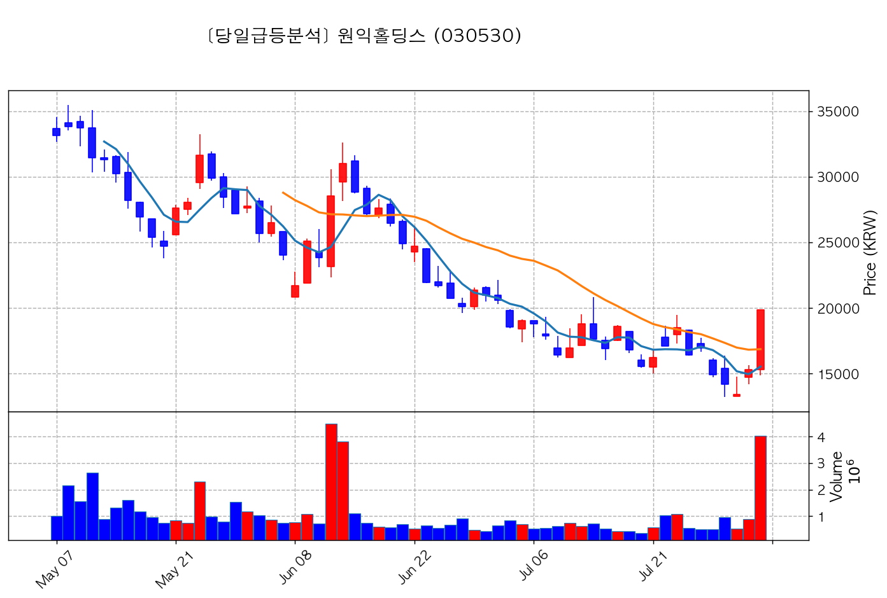

- **종가**: 19,860원 | **거래대금**: 801.3억
- **🔥 당일 핵심 뉴스**: 🔗 [[특징주] 원익홀딩스, “美 중국산 로봇 규제”에 메타와 로봇개발 부각되며 ‘상한가 직행’](https://news.google.com/rss/articles/CBMibEFVX3lxTE9SSkI5c3RLam9DbVhQSk5UQjJNTmtVd01pVDQ2Nm1wMUZMazFPdVV1M2J2b3hGN2p3dUFRTERkbVA4UEpPd3ZUSGlyWUZkQTlsaEdnaDJyS0wtYXRYVWsyazFiNmRRTWZDaVRhYw?oc=5)

#### 2) 펩트론 (087010) — <b>+29.97%</b>

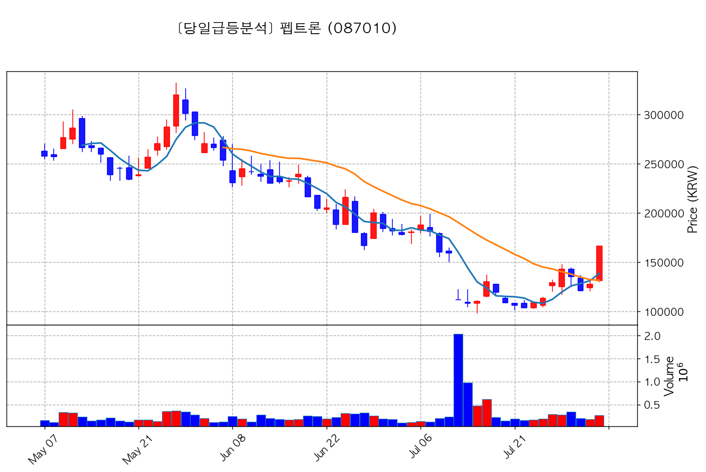

- **종가**: 166,100원 | **거래대금**: 440.9억
- **🔥 당일 핵심 뉴스**: 🔗 [[특징주] 펩트론, '월 1회 GLP-1' 공급망 기대에 상한가](https://news.google.com/rss/articles/CBMiXEFVX3lxTFBVT0xQTHJMV3lIdkpNc0RmSWxIWHdyeVdfcWVZWUxxWkk1X0RSZEliN2VRM20tS1ZBM2JmSDBobGxqZmljUngtemRSSDRrRFhhSXdxbVM2aVRKVUxN?oc=5)

#### 3) 티엑스알로보틱스 (484810) — <b>+29.93%</b>

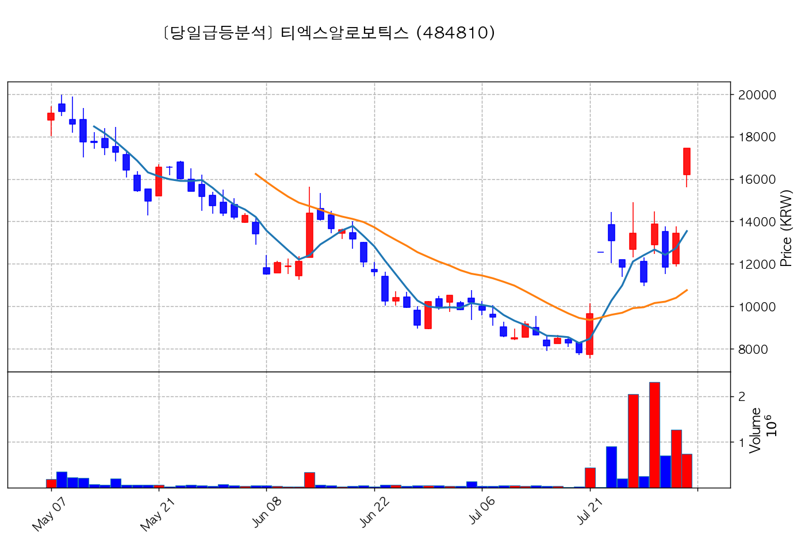

- **종가**: 17,450원 | **거래대금**: 130.1억
- **🔥 당일 핵심 뉴스**: 🔗 [[특징주] 티엑스알로보틱스, “물류 자동화 라인업 확대” 美 중국산 로봇 규제에 반사수혜 기대](https://news.google.com/rss/articles/CBMibEFVX3lxTFB6NXB0QkdCZEpfcVJXX1QxV0dMYnhpcWttNGNxUjAwdlNxZ2xjZmZ3RUtDV2NZbVh1cWt0ay1xaVV3M2JSMHhod3RGOEptTHpjVE9PcDhZcE5fcUY0LWxUWFE1TkktSXJtcDBoNg?oc=5)

#### 4) 알트 (459550) — <b>+29.97%</b>

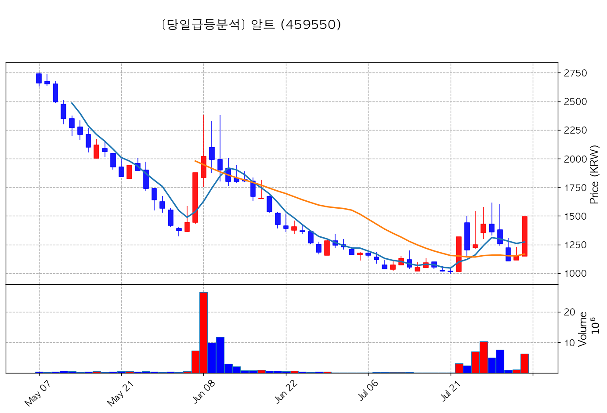

- **종가**: 1,492원 | **거래대금**: 93.5억
- **🔥 당일 핵심 뉴스**: 🔗 [[특징주] 외인·기관, 삼성전자·대우건설 매도… 알트·지엔씨에너지 ' 픽'](https://news.google.com/rss/articles/CBMiakFVX3lxTE5QaVdKMGY3aTZKMW5ieWhpbzNfcVBUZ2lPckkydFhibzc2ekhKNXBBdDVYZGo1Z2FDOERNOXdsWTI3V3I4RGtsOTE0ektVTHVUeGFkdTl0TGkwQnJ6SDY1dVByTzdCVEJCbHc?oc=5)

#### 5) 딥노이드 (315640) — <b>+30.00%</b>

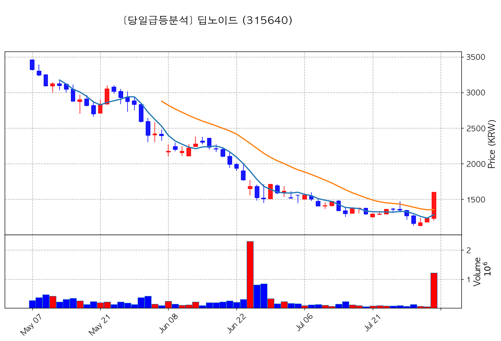

- **종가**: 1,599원 | **거래대금**: 19.4억
- **🔥 당일 핵심 뉴스**: 🔗 [[특징주] 딥노이드, 생성형 의료 AI 첫 상용화에 상한가](https://news.google.com/rss/articles/CBMibEFVX3lxTE9ieUVnaVpRYS1CczQyTHFydzNoZ1dvU0d2YWRfNmxkNGgzTUdyMFl3TVp6R0RwZFRLeU5VTklYVUhtZHJhbjBBbmlZc3o0eHFHOVFOUE1XNTkwd0tIU2lDV25YaWJTVEF3Vjk3TQ?oc=5)

---

## 🚀 2. 거래대금 150억+ & +15% 이상 폭등주 (상위 6개)

#### 1) 코스모로보틱스 (439960) — <b>+21.30%</b>

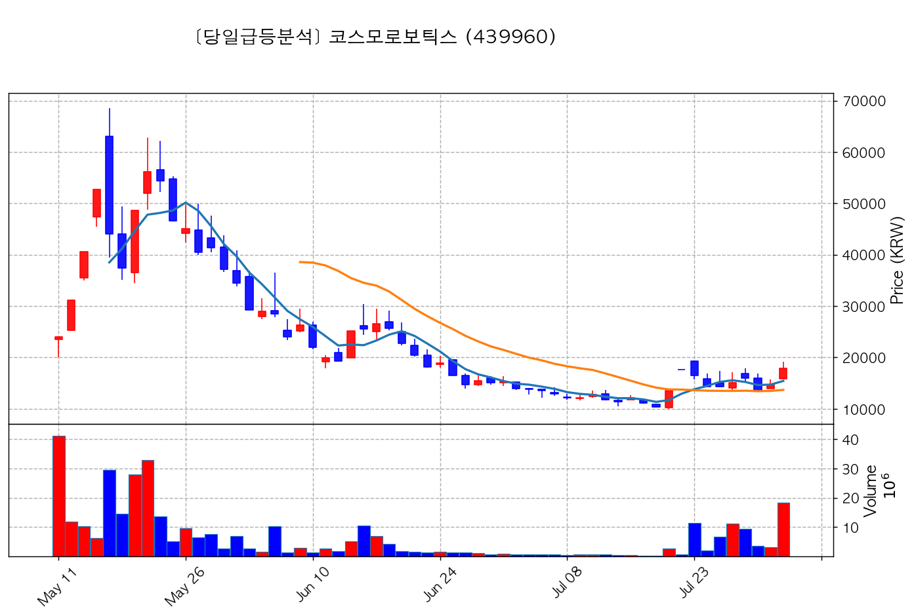

- **종가**: 17,880원 | **거래대금**: 3266.5억
- **🔥 당일 핵심 뉴스**: 🔗 [[특징주] 코스모로보틱스, 美 '중국 견제' 로봇 수입 금지…FDA 인증 획득 부각에 강세↑](https://news.google.com/rss/articles/CBMidEFVX3lxTFA4MUEybmhjNWFSNHZhclNXdmhBbGFlUkxDWWVwd2VHdnJPUi1fU3gtemMwY2RDN0xWakVQdjRJdHhIYTM2OF9sVGYteGtqaGRRQzFjN1dsb01UU2x1YmdxUXIwRG9TOTMtcU45MUwwM1A5UW11?oc=5)

#### 2) 로보티즈 (108490) — <b>+17.25%</b>

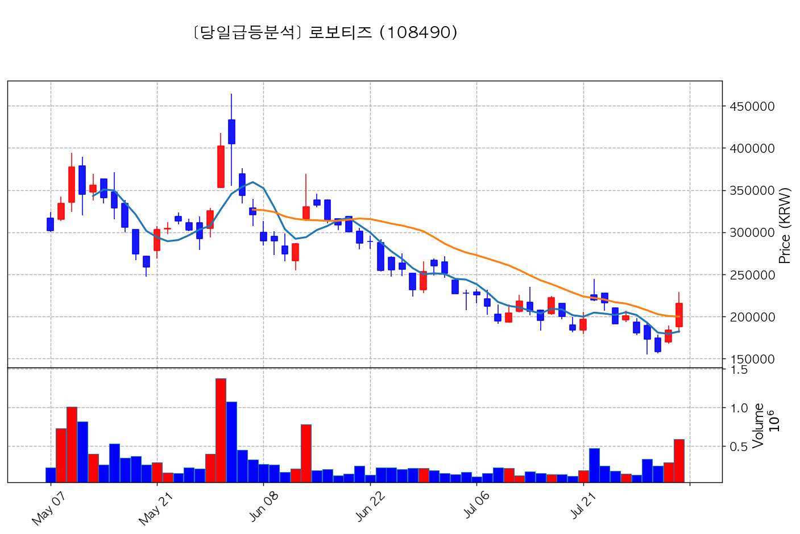

- **종가**: 215,500원 | **거래대금**: 1269.4억
- **🔥 당일 핵심 뉴스**: 🔗 [[특징주] 미 중국산 로봇 규제…국내 로봇주 7%대 급등](https://news.google.com/rss/articles/CBMiXEFVX3lxTE1VMjdMZnBpNTFxWlhtckNJaDlFWDdheGU4eGdPWmxmUVUzMzA2SDVOc2NSQXdSUkdwbU1GQWFoRXlMLVlvMHpzVHd5TDJPVkFGYnM1Yl9USHNkRTds?oc=5)

#### 3) 위닉스 (044340) — <b>+21.45%</b>

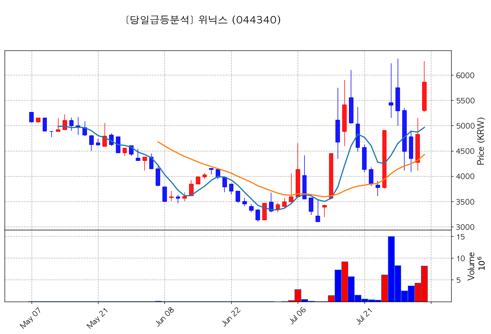

- **종가**: 5,860원 | **거래대금**: 483.2억
- **🔥 당일 핵심 뉴스**: 🔗 [[ET특징주] 태풍 '돌핀' 더위 혹은 물 폭탄 몰고 올까… 위닉스·파세코 강세](https://news.google.com/rss/articles/CBMiTkFVX3lxTE5SWkRfT290aVpkOTdmbld1Ymd1ay1QcTlCUXVYWWt1ZDd3b0lXOTBGcU9fSlpOVHlPcmt1U05vWkFaYkRoUGVQenNjRTBPZw?oc=5)
- **📜 과거 부각 이력**: `2026-08-03 피드백` 이력 있음, `2026-08-01 스크리닝` 이력 있음

#### 4) 셀바스AI (108860) — <b>+20.05%</b>

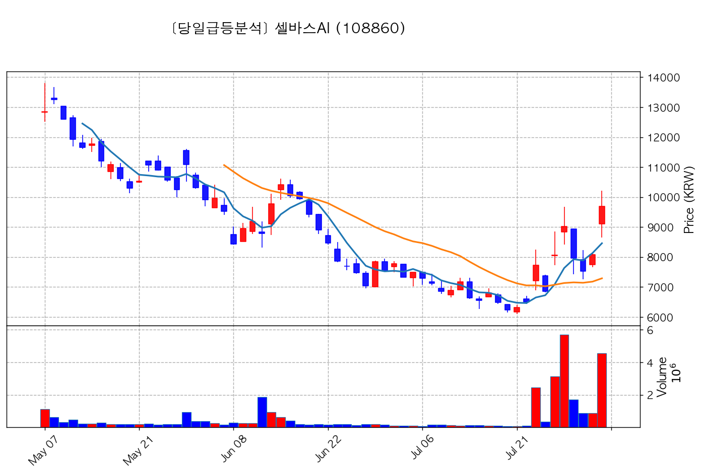

- **종가**: 9,700원 | **거래대금**: 441.1억
- **🔥 당일 핵심 뉴스**: 🔗 [특징주, 셀바스AI-AI 챗봇(챗GPT 등) 테마 상승세에 14.91% ↑](https://news.google.com/rss/articles/CBMiUkFVX3lxTFBaRHBEQkdQYmExQ0xmazFjRkQwQV9yTmVpQVRsSUlYNmc0d0lLN3NtZzVOSE8wOG1qUXhvUWNZVjZ6UTRJR1BJcDcyZmJzWTVaaEE?oc=5)

#### 5) 태성 (323280) — <b>+20.80%</b>

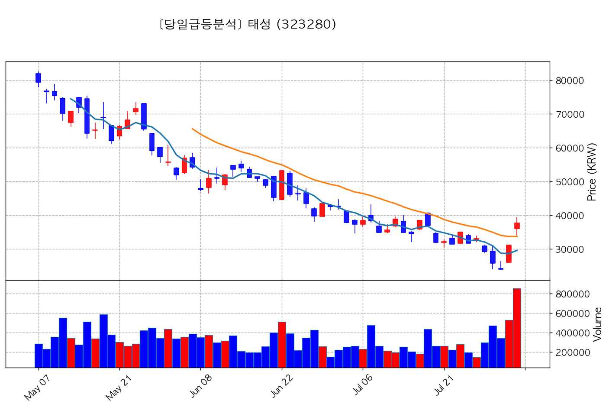

- **종가**: 37,750원 | **거래대금**: 321.8억
- **🔥 당일 핵심 뉴스**: 🔗 [특징주, 태성-반도체 기판(FC-BGA/PCB/MLB 등) 테마 상승세에 13.31% ↑](https://news.google.com/rss/articles/CBMiUkFVX3lxTFBWaVRobUJHOWxlcHE5SkRzZjNvanA0bk5UMXpHV2hGVHg2Y1hBbUMyVzdTSVhiNk5DdUZCb085X0o0MU94S1BOd0xIWHhRei0zQ3c?oc=5)

#### 6) 한국피아이엠 (448900) — <b>+17.35%</b>

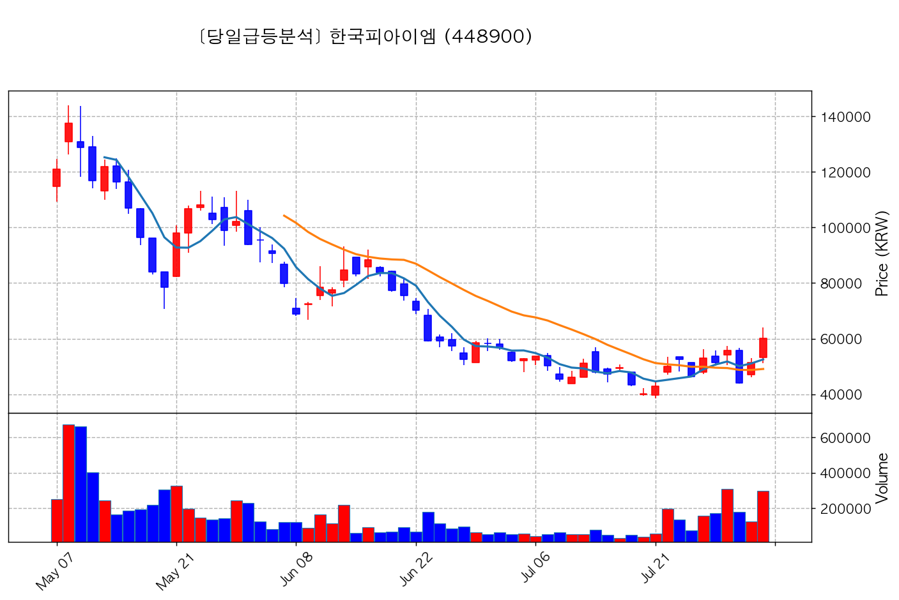

- **종가**: 60,200원 | **거래대금**: 179.6억
- **🔥 당일 핵심 뉴스**: 🔗 [[특징주] 한국피아이엠, “로봇 손 초소형 감속기 개발”에 휴머노이드 밸류체인 진입 ‘기대‘](https://news.google.com/rss/articles/CBMibEFVX3lxTE96aWljVmxoSzBhd2VZRnI4QnFDNkxRcXBiR0tkbmVPaFRyZmpfN1MzRmMwc0xsYTRHQ3lLbDU3clZ1ZlVyZWRLUFltMVhxVTRLdU9mbWN6WVExUDhFQVdHTnRTUzN1YmpKdVZIXw?oc=5)

