# 📈 [실전플랜 1] 2026-08-03 (종가) 매매 후보 스크리닝 보고서

> 스크리닝 기준일: 2026-08-03 (종가) | 진입 예정일: 2026-08-04 (매매일) | [📊 익일 매매 성과 피드백 보고서 보기](./2026-08-04_피드백.html)

---

## 📊 1. 스크리닝 요약
- **전략 1 (양-음-양 눌림목)**: 34개 포착
- **전략 2 (일일봉 매집봉)**: 5개 포착
- **전략 3 (수급 낙폭과대 바닥형)**: 6개 포착
- **총 포착 수**: 45개 종목 (TOP 선택 6개)

---

## 🔵 1. 전략 1 — 양-음-양 눌림목 (3% × 3슬롯)

#### 1) 삼성전자 (005930) — ★ TOP 1 선택

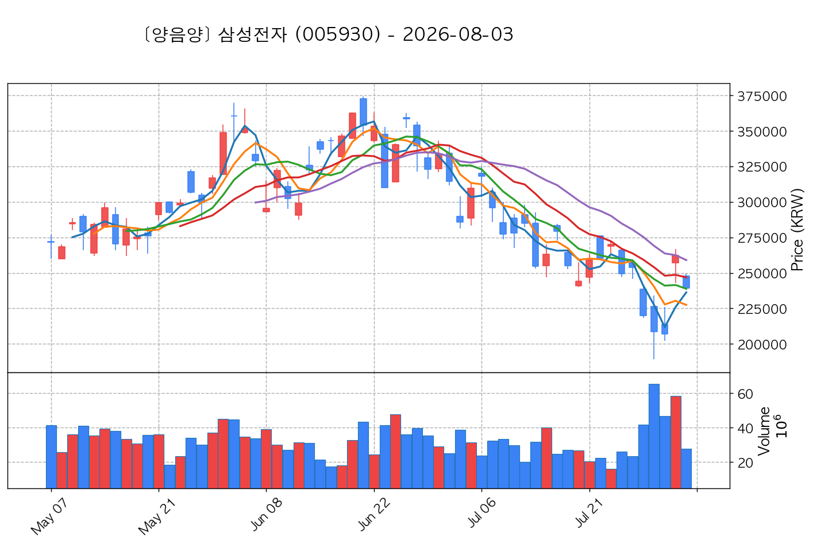

- **기준 종가**: 239,500원 | **거래대금**: 66642억
- **분석 사유**: 과거 2026-07-31 기준봉 후 현재 3일선 지지

#### 2) 삼성전기 (009150) — ★ TOP 2 선택

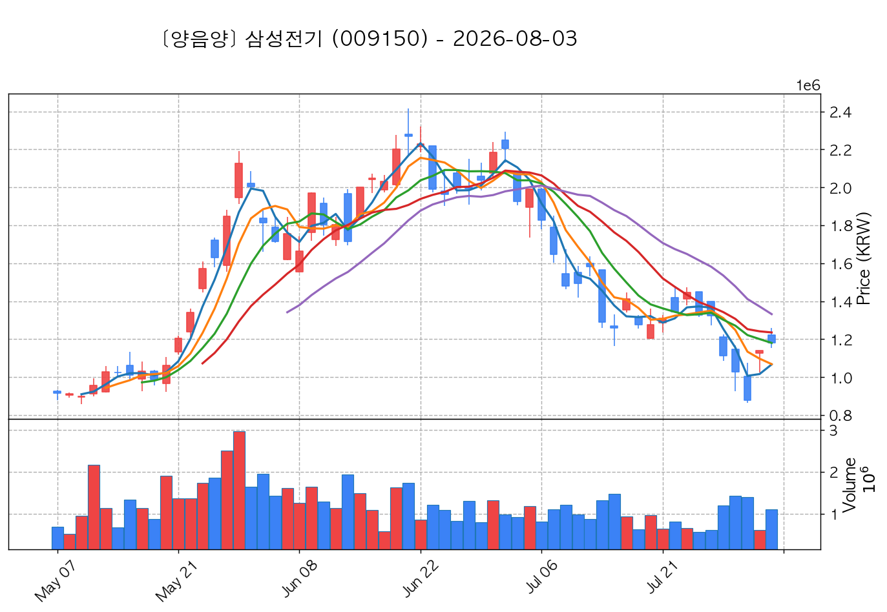

- **기준 종가**: 1,181,000원 | **거래대금**: 13075억
- **분석 사유**: 과거 2026-07-31 기준봉 후 현재 8일선 지지

#### 3) SK스퀘어 (402340) — ★ TOP 3 선택

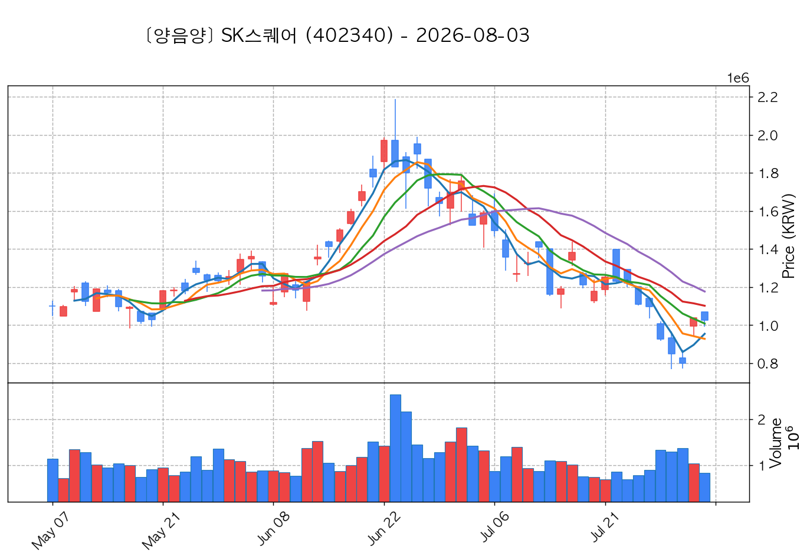

- **기준 종가**: 1,025,000원 | **거래대금**: 8526억
- **분석 사유**: 과거 2026-07-31 기준봉 후 현재 8일선 지지

#### 4) 효성중공업 (298040) — 후보군 (1위)

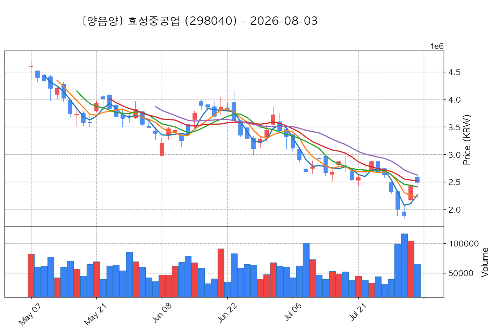

- **기준 종가**: 2,495,000원 | **거래대금**: 1629억
- **분석 사유**: 과거 2026-07-31 기준봉 후 현재 13일선 지지

#### 5) 제주반도체 (080220) — 후보군 (2위)

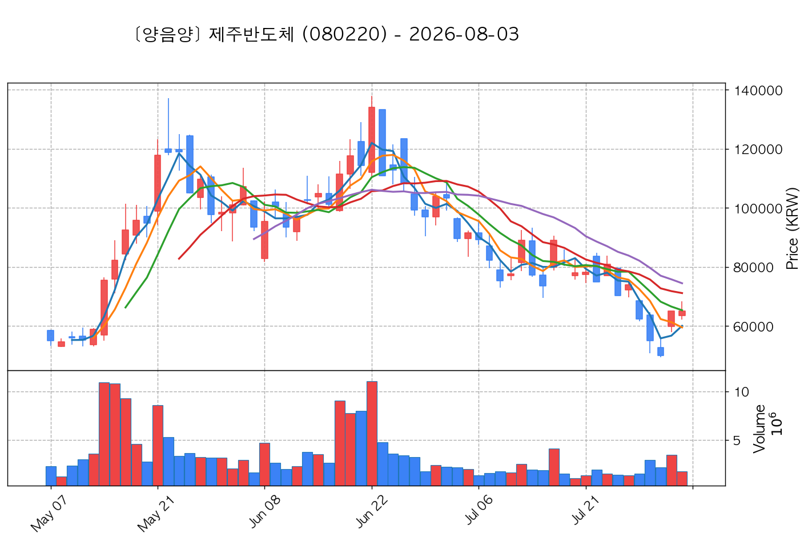

- **기준 종가**: 65,100원 | **거래대금**: 1164억
- **분석 사유**: 과거 2026-07-31 기준봉 후 현재 8일선 지지

#### 6) LS ELECTRIC (010120) — 후보군 (3위)

- **기준 종가**: 188,400원 | **거래대금**: 1677억
- **분석 사유**: 과거 2026-07-31 기준봉 후 현재 8일선 지지

#### 7) HPSP (403870) — 후보군 (4위)

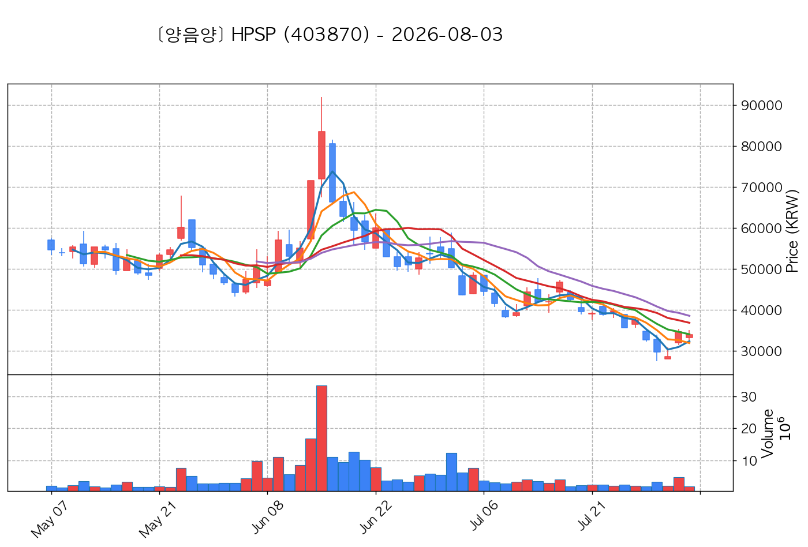

- **기준 종가**: 33,950원 | **거래대금**: 604억
- **분석 사유**: 과거 2026-07-31 기준봉 후 현재 8일선 지지

#### 8) 원익IPS (240810) — 후보군 (5위)

- **기준 종가**: 93,700원 | **거래대금**: 1269억
- **분석 사유**: 과거 2026-07-31 기준봉 후 현재 8일선 지지

#### 9) 현대건설 (000720) — 후보군 (6위)

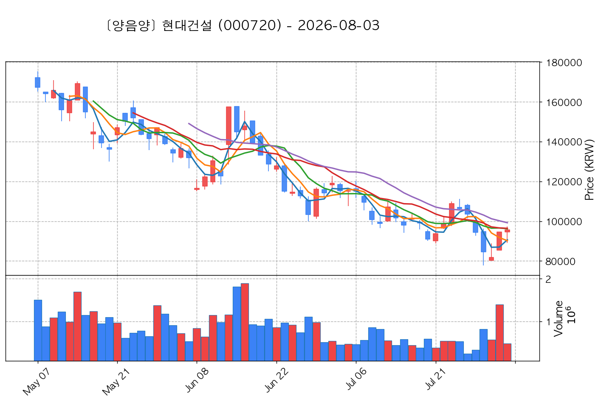

- **기준 종가**: 95,600원 | **거래대금**: 456억
- **분석 사유**: 과거 2026-07-31 기준봉 후 현재 8일선 지지

#### 10) 삼성물산 (028260) — 후보군 (7위)

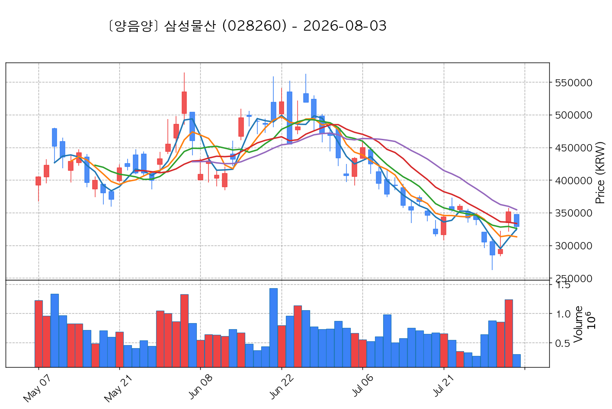

- **기준 종가**: 329,000원 | **거래대금**: 985억
- **분석 사유**: 과거 2026-07-31 기준봉 후 현재 3일선 지지

## 🟡 2. 전략 2 — 일일봉 매집봉 (10% × 1슬롯)

#### 1) 파세코 (037070) — ★ TOP 1 선택

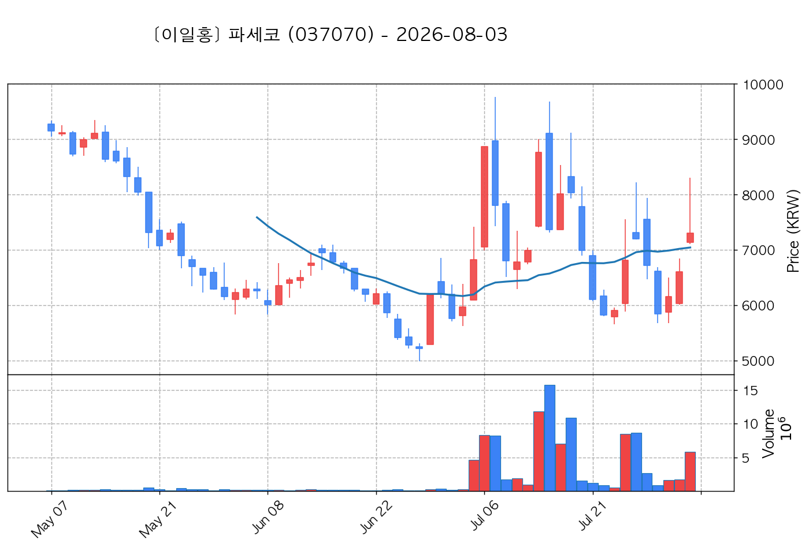

- **기준 종가**: 7,300원 | **거래대금**: 425억
- **분석 사유**: 과거 2026-07-03 매집봉 ➔ 240일선 근접 지지 (+0.51%)

#### 2) 빛과전자 (069540) — 후보군 (1위)

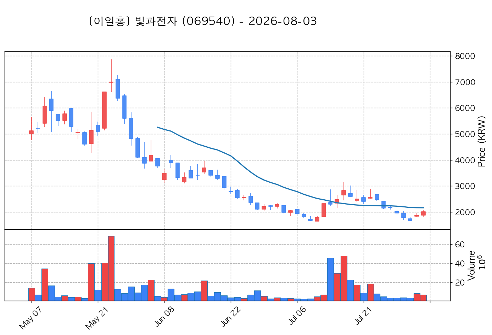

- **기준 종가**: 2,005원 | **거래대금**: 141억
- **분석 사유**: 과거 2026-07-13 매집봉 ➔ 240일선 근접 지지 (-1.68%)

#### 3) 아이로보틱스 (066430) — 후보군 (2위)

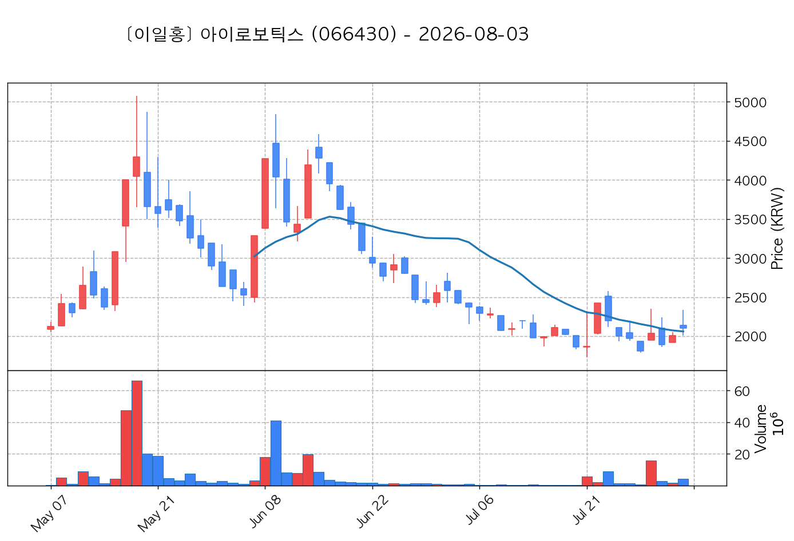

- **기준 종가**: 2,105원 | **거래대금**: 91억
- **분석 사유**: 과거 2026-07-21 매집봉 ➔ 240일선 근접 지지 (+2.57%)

#### 4) 예스티 (122640) — 후보군 (3위)

- **기준 종가**: 21,650원 | **거래대금**: 86억
- **분석 사유**: 과거 2026-06-18 매집봉 ➔ 240일선 근접 지지 (-2.82%)

#### 5) 아진엑스텍 (059120) — 후보군 (4위)

- **기준 종가**: 6,090원 | **거래대금**: 56억
- **분석 사유**: 과거 2026-07-21 매집봉 ➔ 240일선 근접 지지 (+0.61%)

## 🟢 3. 전략 3 — 수급 낙폭과대 바닥형 (10% × 2슬롯)

#### 1) 코오롱티슈진 (950160) — ★ TOP 1 선택

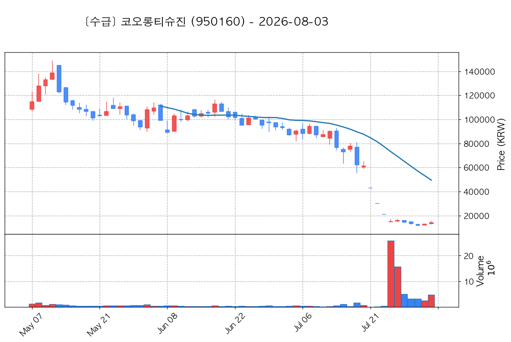

- **기준 종가**: 14,290원 | **거래대금**: 682억
- **분석 사유**: 52주 고점 대비 (9.6%) ➔ 20일 메이저 수급 100억+ 유입 ➔ 없음 지지 안착

#### 2) GS건설 (006360) — ★ TOP 2 선택

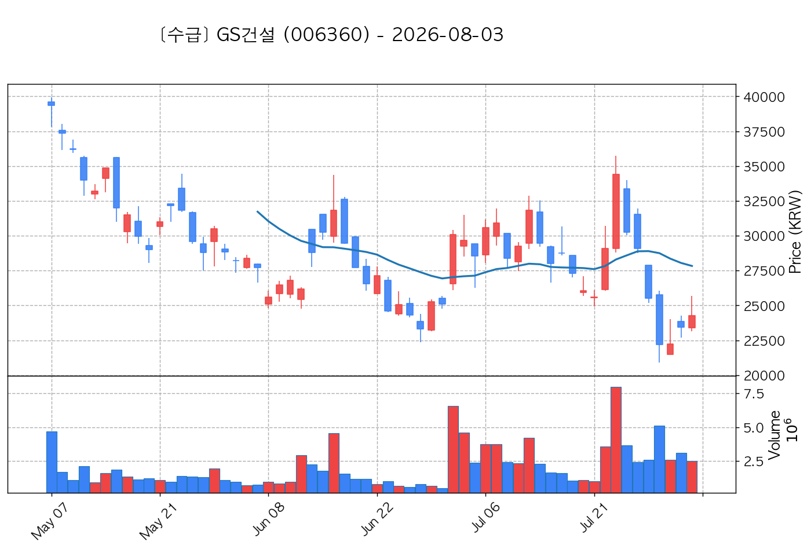

- **기준 종가**: 24,250원 | **거래대금**: 609억
- **분석 사유**: 52주 고점 대비 (54.1%) ➔ 20일 메이저 수급 100억+ 유입 ➔ 240일선 지지 안착

#### 3) 한국항공우주 (047810) — 후보군 (1위)

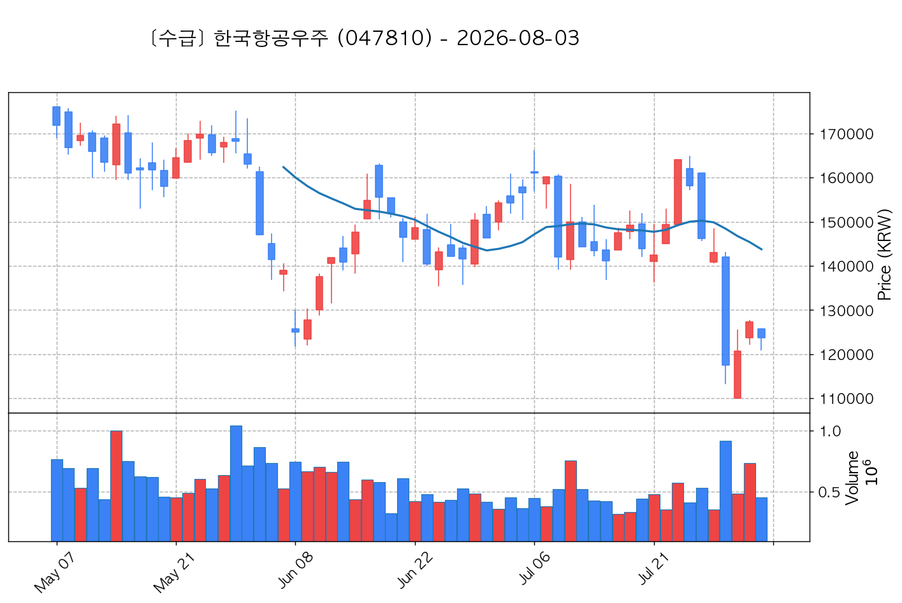

- **기준 종가**: 123,700원 | **거래대금**: 561억
- **분석 사유**: 52주 고점 대비 (57.4%) ➔ 20일 메이저 수급 100억+ 유입 ➔ 없음 지지 안착

#### 4) 한화엔진 (082740) — 후보군 (2위)

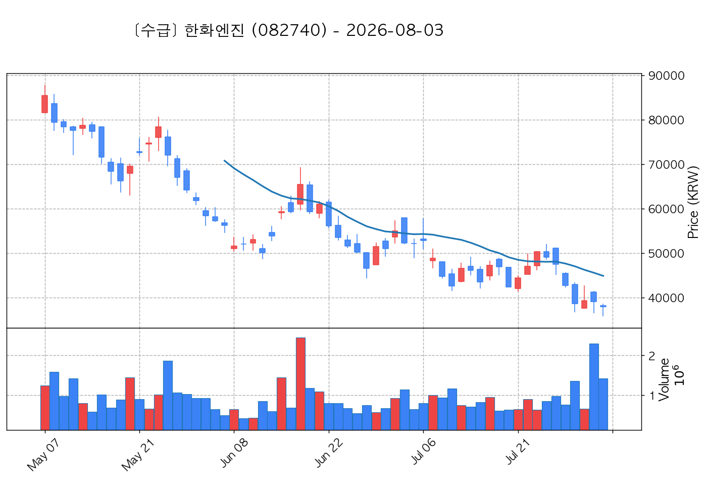

- **기준 종가**: 38,000원 | **거래대금**: 539억
- **분석 사유**: 52주 고점 대비 (40.3%) ➔ 20일 메이저 수급 100억+ 유입 ➔ 없음 지지 안착

#### 5) 삼성중공업 (010140) — 후보군 (3위)

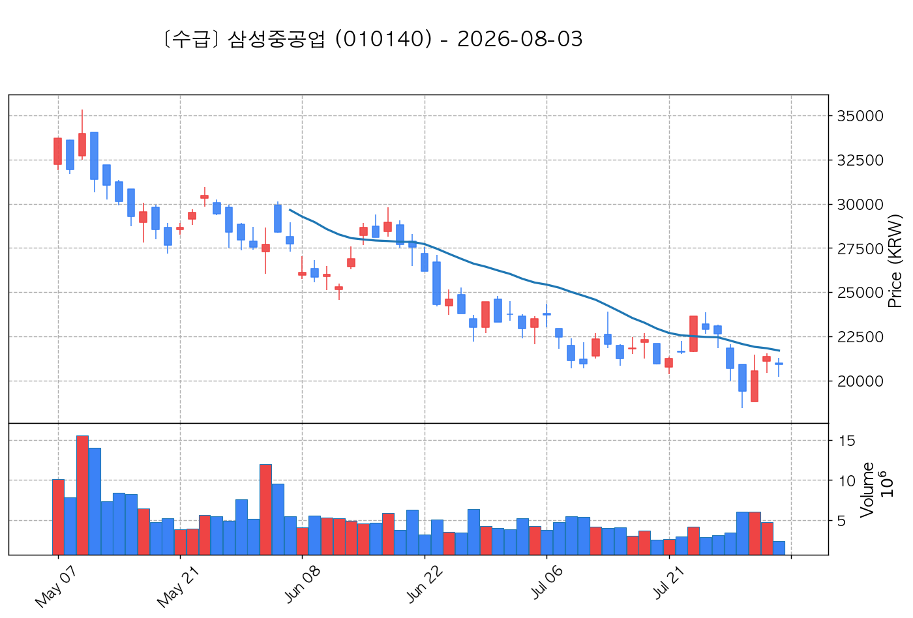

- **기준 종가**: 20,900원 | **거래대금**: 514억
- **분석 사유**: 52주 고점 대비 (59.1%) ➔ 20일 메이저 수급 100억+ 유입 ➔ 없음 지지 안착

#### 6) BNK금융지주 (138930) — 후보군 (4위)

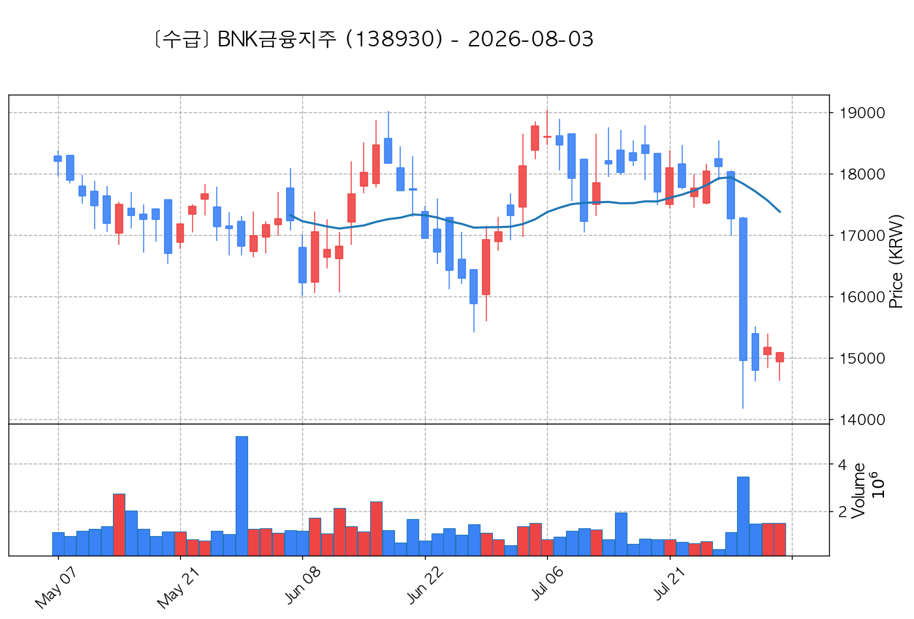

- **기준 종가**: 15,090원 | **거래대금**: 226억
- **분석 사유**: 52주 고점 대비 (65.5%) ➔ 20일 메이저 수급 100억+ 유입 ➔ 60일선 지지 안착

