# 📈 [실전플랜 1] 2026-08-03 매매 후보 스크리닝 보고서

> 스크리닝 기준일: 2026-08-03 | [📊 익일 매매 성과 피드백 보고서 보기](./2026-08-03_피드백.html)

---

## 📊 1. 스크리닝 요약
- **전략 1 (양-음-양 눌림목)**: 13개 포착
- **전략 2 (일일봉 매집봉)**: 5개 포착
- **전략 3 (수급 낙폭과대 바닥형)**: 5개 포착
- **총 포착 수**: 23개 종목 (TOP 선택 6개)

---

## 🔵 1. 전략 1 — 양-음-양 눌림목 (3% × 3슬롯)

#### 1) 서산 (079650) — ★ TOP 1 선택

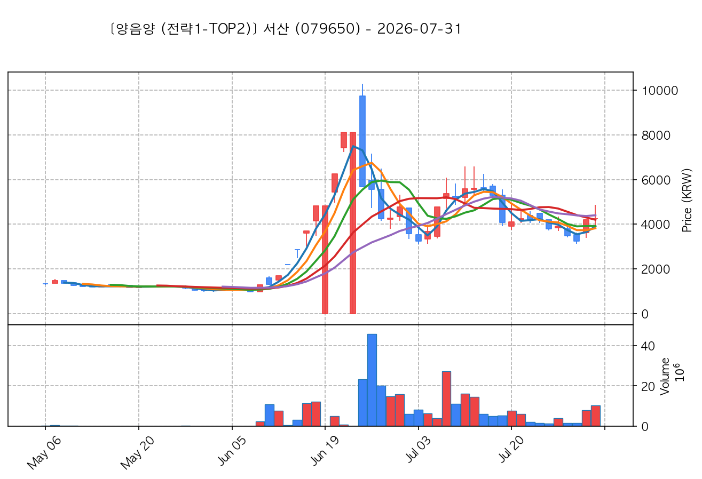

- **기준 종가**: 4,250원 | **거래대금**: 441억
- **분석 사유**: 과거 2026-07-30 기준봉 후 현재 13일선 지지

#### 2) 위닉스 (044340) — ★ TOP 2 선택 (사윗감)

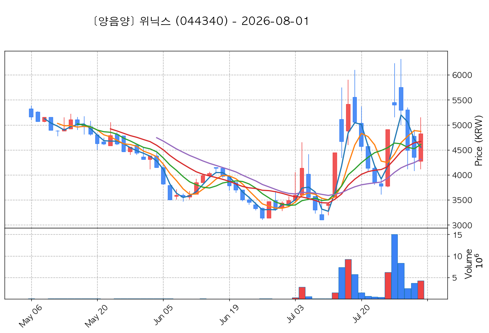

- **기준 종가**: 4,825원 | **거래대금**: 204억
- **분석 사유**: 과거 2026-07-24 기준봉 후 현재 5일선 지지

#### 3) 뉴엔AI (463020) — ★ TOP 3 선택 (사윗감)

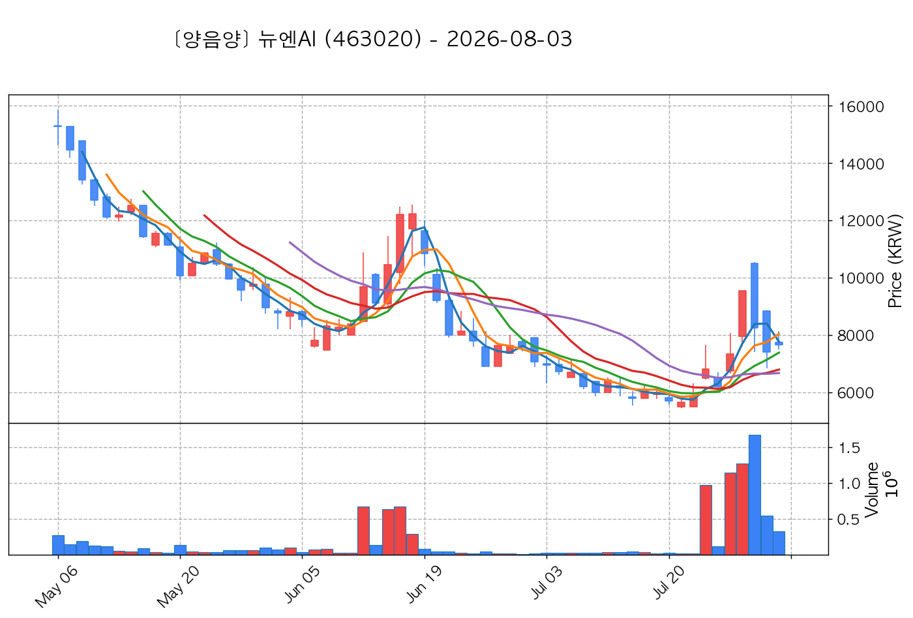

- **기준 종가**: 7,650원 | **거래대금**: 24억
- **분석 사유**: 과거 2026-07-28 기준봉 후 현재 3일선 지지

#### 4) 케이엔알시스템 (199430) — 후보군 (1위)

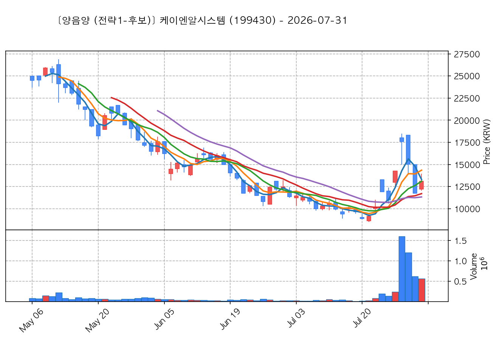

- **기준 종가**: 13,100원 | **거래대금**: 73억
- **분석 사유**: 과거 2026-07-27 기준봉 후 현재 3일선 지지

#### 5) 메드팩토 (235980) — 후보군 (2위)

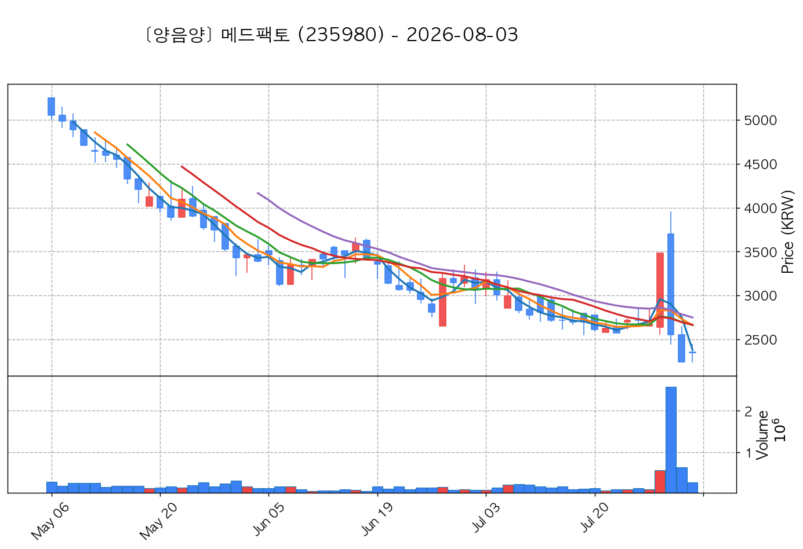

- **기준 종가**: 2,350원 | **거래대금**: 6억
- **분석 사유**: 과거 2026-07-28 기준봉 후 현재 3일선 지지

#### 6) 핀텔 (291810) — 후보군 (3위)

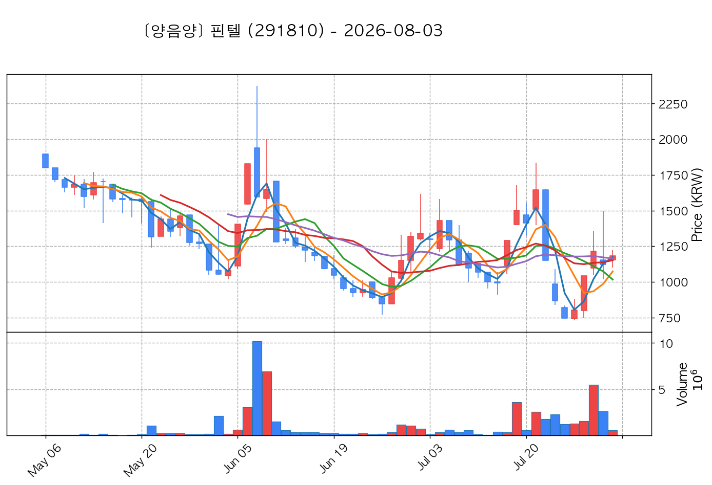

- **기준 종가**: 1,184원 | **거래대금**: 6억
- **분석 사유**: 과거 2026-07-28 기준봉 후 현재 3일선 지지

#### 7) 오가닉티코스메틱 (900300) — 후보군 (4위)

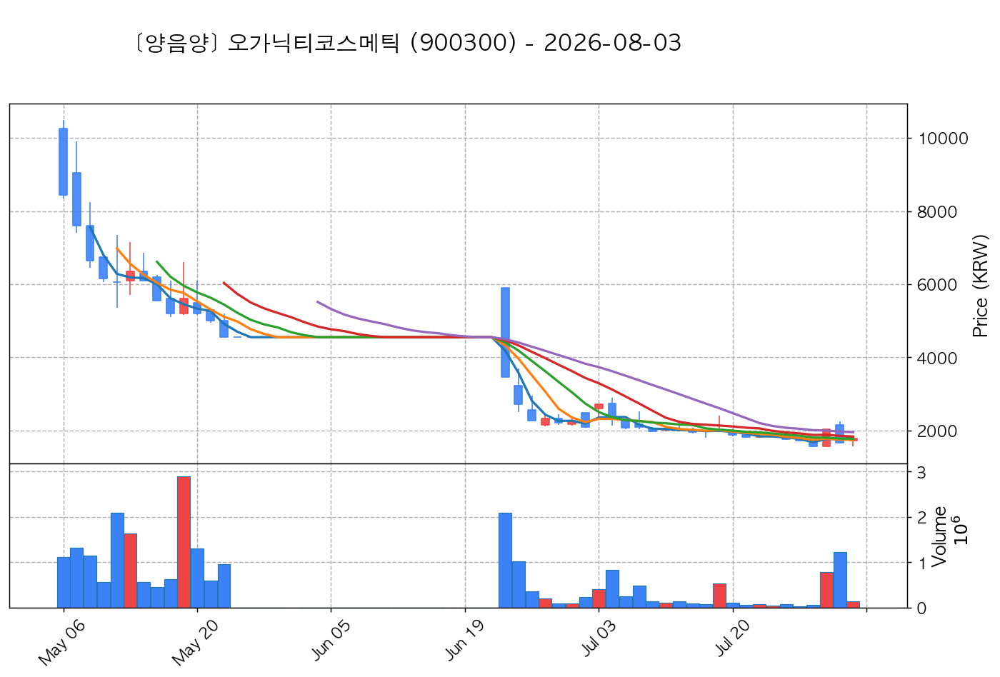

- **기준 종가**: 1,770원 | **거래대금**: 2억
- **분석 사유**: 과거 2026-07-29 기준봉 후 현재 3일선 지지

#### 8) 파이온엑스 (900100) — 후보군 (5위) (사윗감)

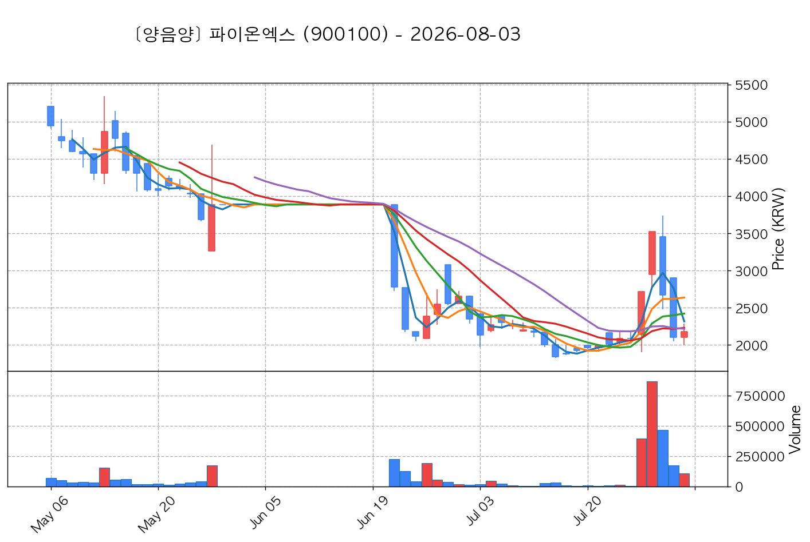

- **기준 종가**: 2,180원 | **거래대금**: 2억
- **분석 사유**: 과거 2026-07-27 기준봉 후 현재 13일선 지지

#### 9) 셀리드 (299660) — 후보군 (6위)

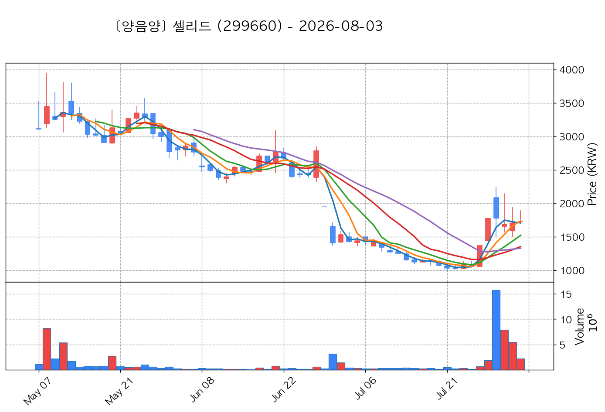

- **기준 종가**: 1,707원 | **거래대금**: 93억
- **분석 사유**: 과거 2026-07-27 기준봉 후 현재 3일선 지지

#### 10) 엑시온그룹 (069920) — 후보군 (7위)

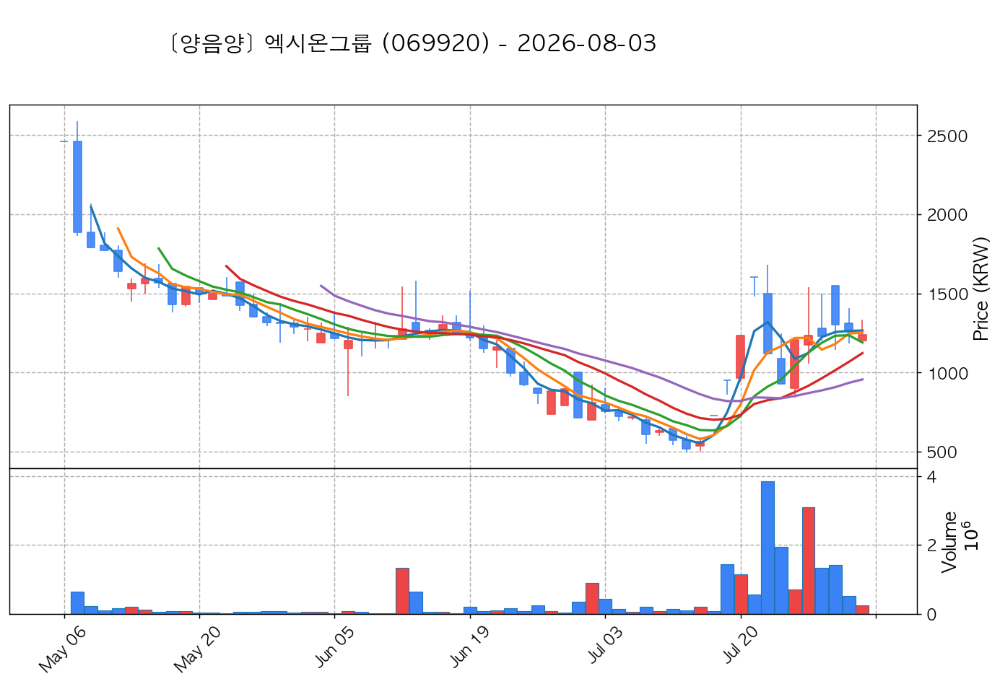

- **기준 종가**: 1,238원 | **거래대금**: 3억
- **분석 사유**: 과거 2026-07-24 기준봉 후 현재 3일선 지지

## 🟡 2. 전략 2 — 일일봉 매집봉 (10% × 1슬롯)

#### 1) 금호전기 (001210) — ★ TOP 1 선택

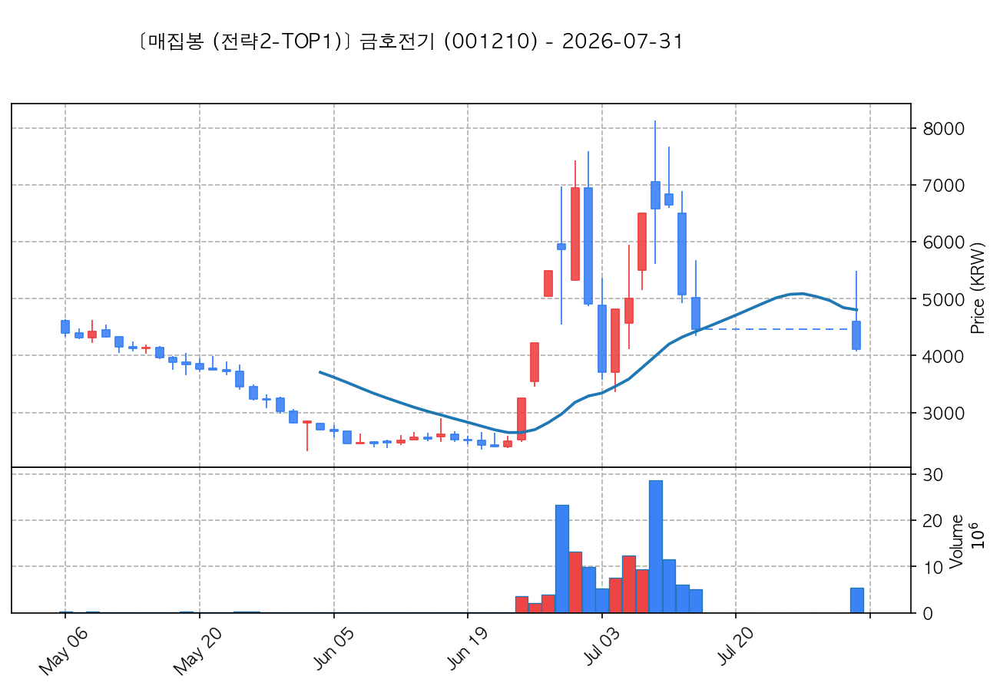

- **기준 종가**: 4,115원 | **거래대금**: 221억
- **분석 사유**: 과거 2026-06-30 매집봉 ➔ 240일선 근접 지지 (-0.20%)

#### 2) 아이로보틱스 (066430) — 후보군 (1위)

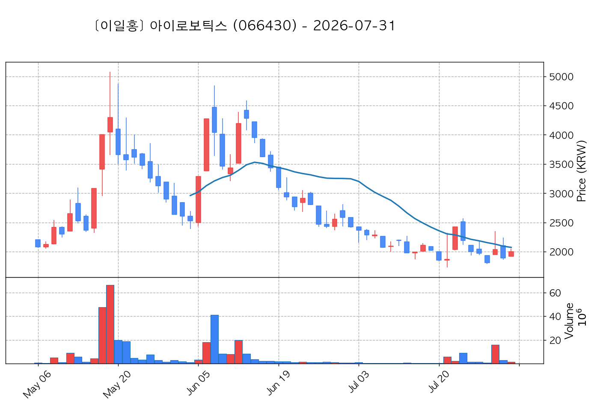

- **기준 종가**: 2,005원 | **거래대금**: 32억
- **분석 사유**: 과거 2026-07-21 매집봉 ➔ 240일선 근접 지지 (-2.19%)

#### 3) 강스템바이오텍 (217730) — 후보군 (2위)

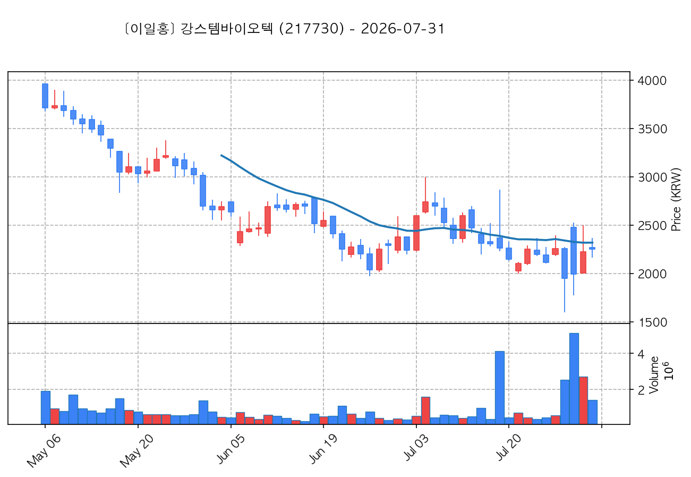

- **기준 종가**: 2,250원 | **거래대금**: 32억
- **분석 사유**: 과거 2026-07-16 매집봉 ➔ 240일선 근접 지지 (+1.71%)

#### 4) 인탑스 (049070) — 후보군 (3위)

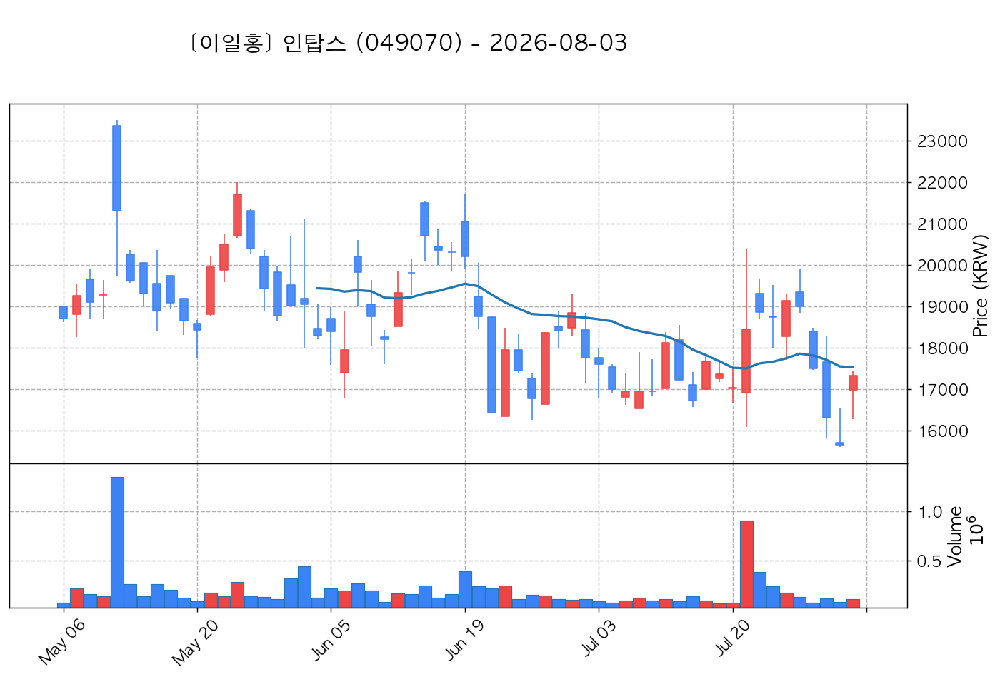

- **기준 종가**: 17,320원 | **거래대금**: 17억
- **분석 사유**: 과거 2026-07-21 매집봉 ➔ 240일선 근접 지지 (-1.04%)

#### 5) 리파인 (377450) — 후보군 (4위)

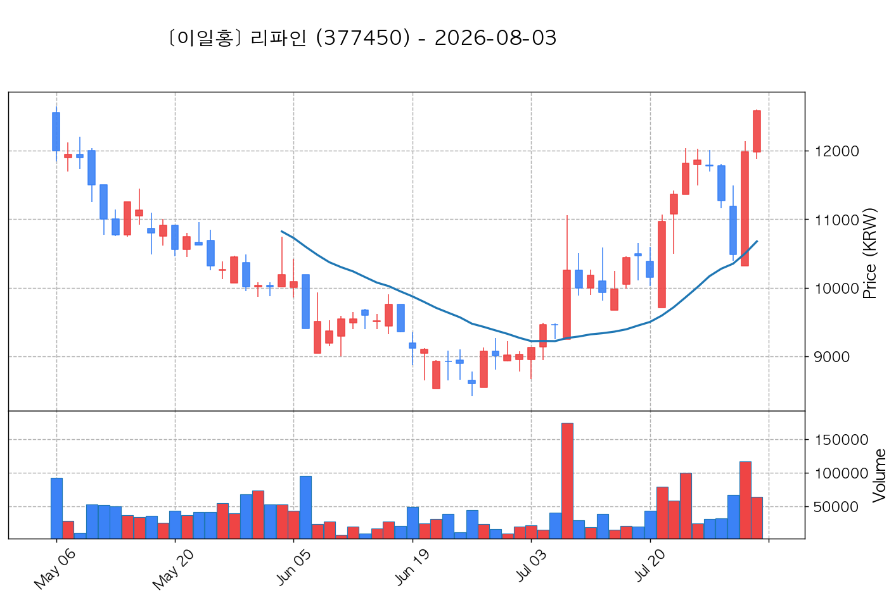

- **기준 종가**: 12,580원 | **거래대금**: 8억
- **분석 사유**: 과거 2026-07-08 매집봉 ➔ 240일선 근접 지지 (+0.83%)

## 🟢 3. 전략 3 — 수급 낙폭과대 바닥형 (10% × 2슬롯)

#### 1) 한국항공우주 (047810) — ★ TOP 1 선택

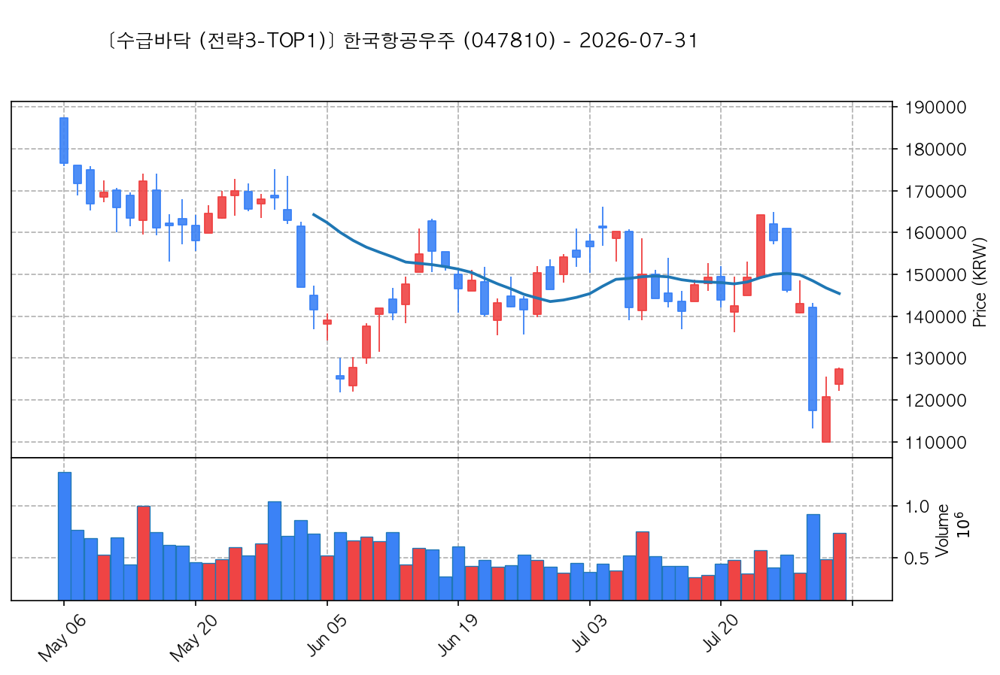

- **기준 종가**: 127,300원 | **거래대금**: 938억
- **분석 사유**: 52주 대비 바닥권(59.1%) ➔ 수급 확인 ➔ N/A일 없음 핥기 및 반등 포착

#### 2) GS건설 (006360) — ★ TOP 2 선택

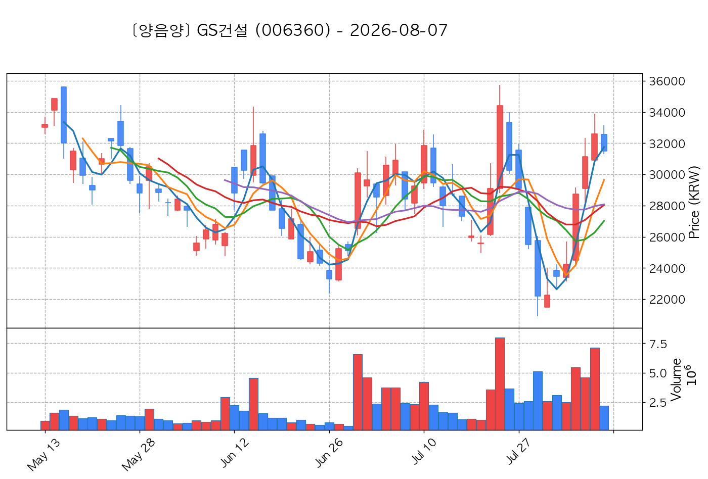

- **기준 종가**: 23,450원 | **거래대금**: 725억
- **분석 사유**: 52주 대비 바닥권(52.3%) ➔ 수급 확인 ➔ 2026-07-31일 240일선 핥기 및 반등 포착

#### 3) 한국전력 (015760) — 후보군 (1위)

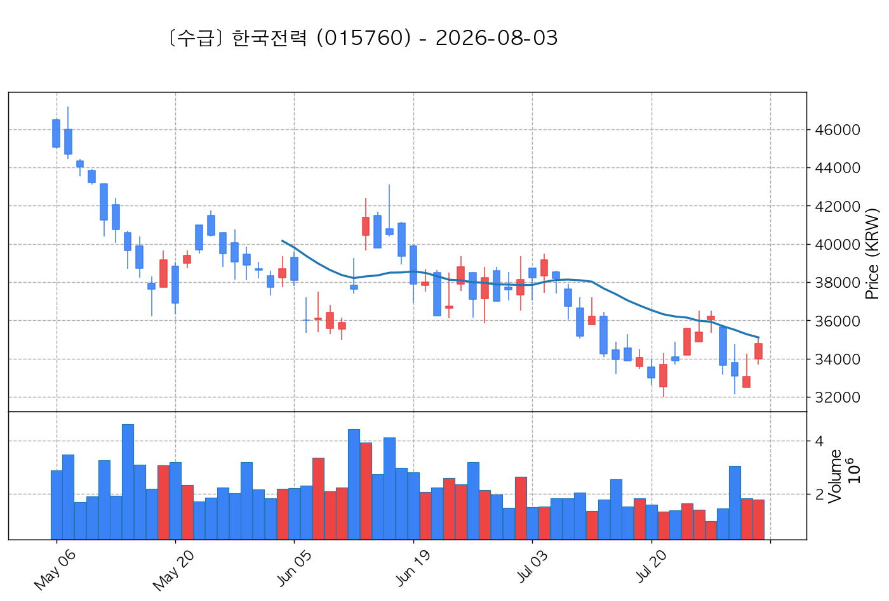

- **기준 종가**: 34,800원 | **거래대금**: 618억
- **분석 사유**: 52주 대비 바닥권(50.1%) ➔ 수급 확인 ➔ N/A일 없음 핥기 및 반등 포착

#### 4) BNK금융지주 (138930) — 후보군 (2위)

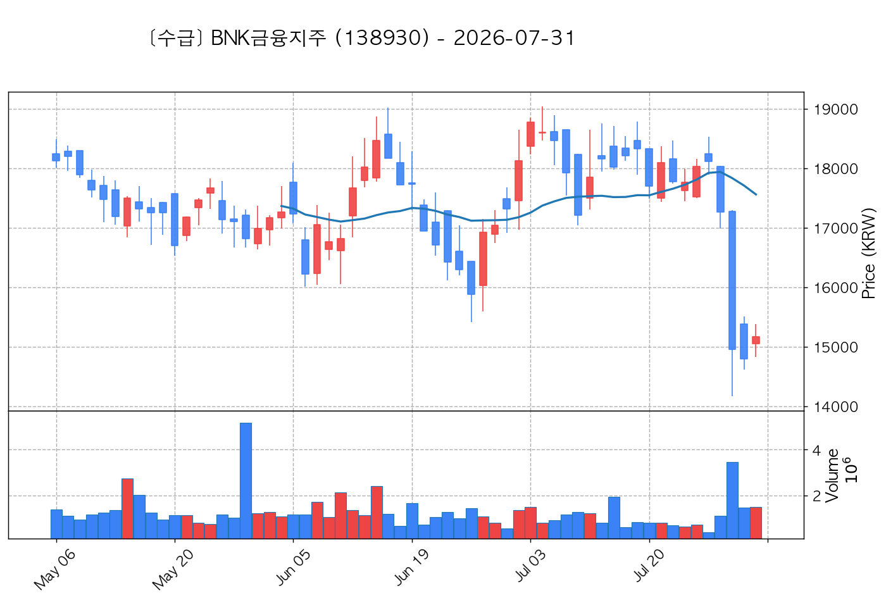

- **기준 종가**: 15,170원 | **거래대금**: 226억
- **분석 사유**: 52주 대비 바닥권(65.8%) ➔ 수급 확인 ➔ 2026-07-28일 60일선 핥기 및 반등 포착

#### 5) 하림지주 (003380) — 후보군 (3위)

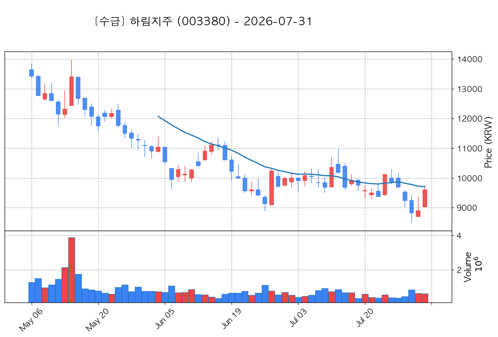

- **기준 종가**: 9,600원 | **거래대금**: 59억
- **분석 사유**: 52주 대비 바닥권(49.0%) ➔ 수급 확인 ➔ N/A일 없음 핥기 및 반등 포착

