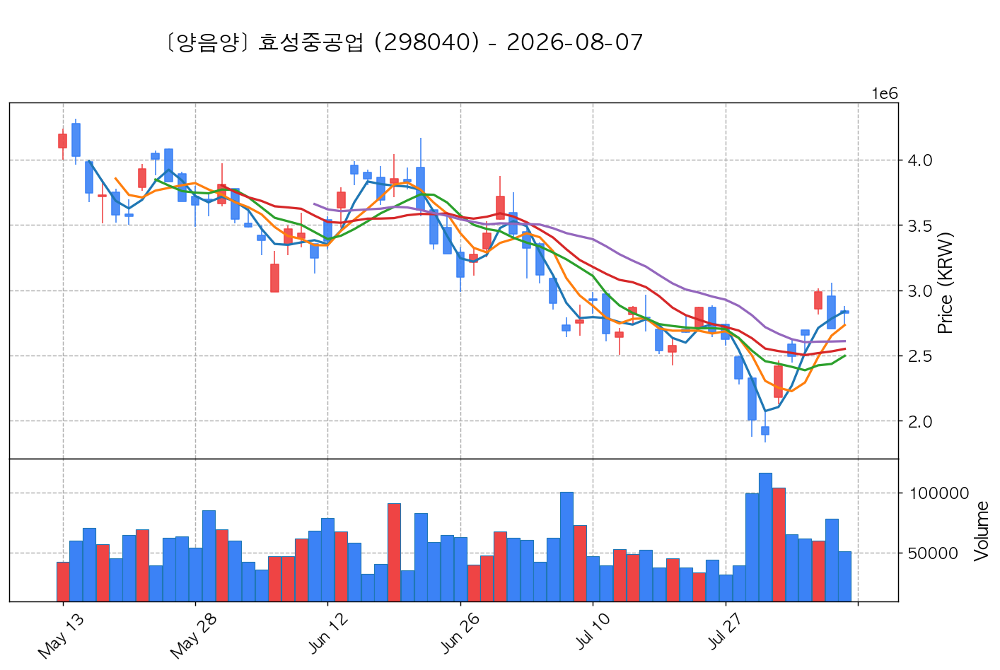
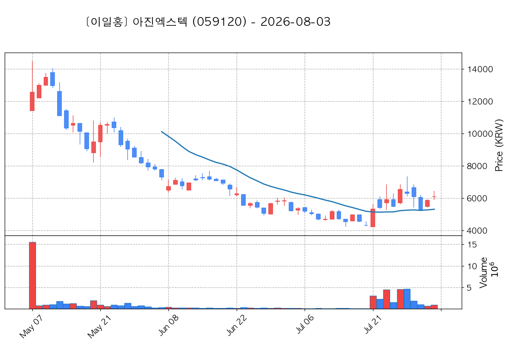
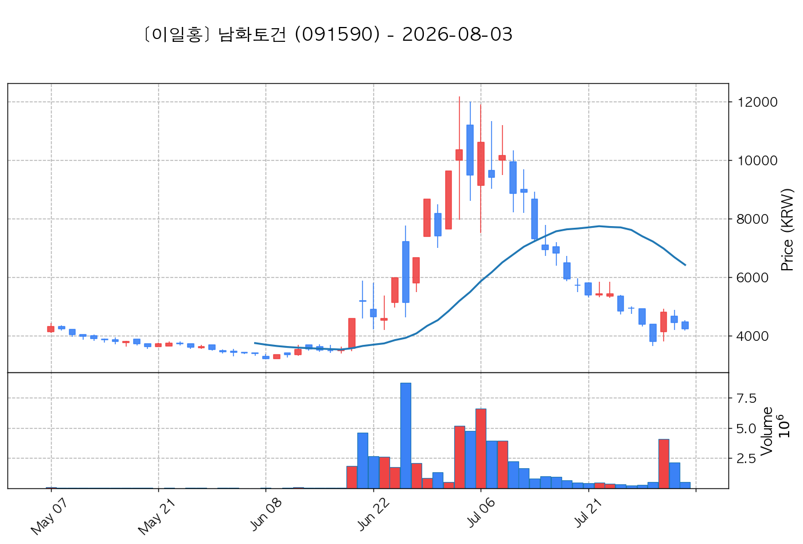

# 📈 [실전플랜 1] 2026-08-03 매매 후보 스크리닝 보고서

> 스크리닝 기준일: 2026-08-03 | [📊 익일 매매 성과 피드백 보고서 보기](./2026-08-03_피드백.html)

---

## 📊 1. 스크리닝 성과 요약

| 전략 | 주요 기법 | 종목수(TOP) |
| :--- | :--- | :---: |
| **전략 1** | 양음양 눌림목 & 사윗감 | 32개 (TOP 3개) |
| **전략 2** | 매집봉 & 이일홍 | 6개 (TOP 1개) |
| **전략 3** | 수급 & 핥 | 3개 (TOP 2개) |
| **합계** | **3대 핵심 전략 통합** | **41개 (TOP 6개)** |

---

## 🔵 3. 전략 1 — 양-음-양 눌림목 (3% × 3슬롯)

### 📋 전략 1 요약표 (상위 10개)

| 종목명 | 기준일종가 | 기준봉 | 지지선 | 비고 및 선정 상태 |
| :--- | ---: | :--- | :---: | :--- |
| **삼성전자** (005930) | 239,500원 | +26.8% 장대양봉 | 3일선 | **★ TOP 1 선택** |
| **SK스퀘어** (402340) | 1,025,000원 | 상한가 | 8일선 | **★ TOP 2 선택** |
| **삼성전기** (009150) | 1,181,000원 | 상한가 | 8일선 | **★ TOP 3 선택** |
| **삼성물산** (028260) | 329,000원 | +19.6% 장대양봉 | 3일선 | 후보군 (1위) |
| **LS ELECTRIC** (010120) | 188,400원 | +23.0% 장대양봉 | 8일선 | 후보군 (2위) |
| **주성엔지니어링** (036930) | 127,800원 | +26.7% 장대양봉 | 8일선 | 후보군 (3위) |
| **효성중공업** (298040) | 2,495,000원 | +27.6% 장대양봉 | 13일선 | 후보군 (4위) |
| **SK** (034730) | 523,000원 | +18.9% 장대양봉 | 3일선 | 후보군 (5위) |
| **제주반도체** (080220) | 65,100원 | 상한가 | 8일선 | 후보군 (6위) |
| **원익IPS** (240810) | 93,700원 | +27.9% 장대양봉 | 8일선 | 후보군 (7위) |

---

### 🔍 전략 1 상세 분석

#### 1) 삼성전자 (005930) — ★ TOP 1 선택

- **기준 종가**: 239,500원 | **거래대금**: 65607억
- **분석 사유**: 과거 2026-07-31 기준봉 후 현재 3일선 지지

#### 2) SK스퀘어 (402340) — ★ TOP 2 선택

- **기준 종가**: 1,025,000원 | **거래대금**: 8394억
- **분석 사유**: 과거 2026-07-31 기준봉 후 현재 8일선 지지

#### 3) 삼성전기 (009150) — ★ TOP 3 선택

- **기준 종가**: 1,181,000원 | **거래대금**: 13075억
- **분석 사유**: 과거 2026-07-31 기준봉 후 현재 8일선 지지

#### 4) 삼성물산 (028260) — 후보군 (1위)

- **기준 종가**: 329,000원 | **거래대금**: 984억
- **분석 사유**: 과거 2026-07-31 기준봉 후 현재 3일선 지지

#### 5) LS ELECTRIC (010120) — 후보군 (2위)

- **기준 종가**: 188,400원 | **거래대금**: 1677억
- **분석 사유**: 과거 2026-07-31 기준봉 후 현재 8일선 지지

#### 6) 주성엔지니어링 (036930) — 후보군 (3위)

- **기준 종가**: 127,800원 | **거래대금**: 2238억
- **분석 사유**: 과거 2026-07-31 기준봉 후 현재 8일선 지지

#### 7) 효성중공업 (298040) — 후보군 (4위)

- **기준 종가**: 2,495,000원 | **거래대금**: 1629억
- **분석 사유**: 과거 2026-07-31 기준봉 후 현재 13일선 지지

#### 8) SK (034730) — 후보군 (5위)

- **기준 종가**: 523,000원 | **거래대금**: 1156억
- **분석 사유**: 과거 2026-07-31 기준봉 후 현재 3일선 지지

#### 9) 제주반도체 (080220) — 후보군 (6위)

- **기준 종가**: 65,100원 | **거래대금**: 1155억
- **분석 사유**: 과거 2026-07-31 기준봉 후 현재 8일선 지지

#### 10) 원익IPS (240810) — 후보군 (7위)

- **기준 종가**: 93,700원 | **거래대금**: 1263억
- **분석 사유**: 과거 2026-07-31 기준봉 후 현재 8일선 지지

## 🟡 4. 전략 2 — 일일봉 매집봉 (10% × 1슬롯)

### 📋 전략 2 요약표 (상위 6개)

| 종목명 | 기준일종가 | 기준봉 | 지지선 | 비고 및 선정 상태 |
| :--- | ---: | :--- | :---: | :--- |
| **파세코** (037070) | 7,300원 | 과거 2026-07-03 매집봉 ➔ 240일선 근접 지지 (+0.51%) | 240일선 | **★ TOP 1 선택** |
| **빛과전자** (069540) | 2,005원 | 과거 2026-07-13 매집봉 ➔ 240일선 근접 지지 (-1.68%) | 240일선 | 후보군 (1위) |
| **아이로보틱스** (066430) | 2,105원 | 과거 2026-07-21 매집봉 ➔ 240일선 근접 지지 (+2.57%) | 240일선 | 후보군 (2위) |
| **예스티** (122640) | 21,650원 | 과거 2026-06-18 매집봉 ➔ 240일선 근접 지지 (-2.82%) | 240일선 | 후보군 (3위) |
| **아진엑스텍** (059120) | 6,090원 | 과거 2026-07-21 매집봉 ➔ 240일선 근접 지지 (+0.61%) | 240일선 | 후보군 (4위) |
| **남화토건** (091590) | 4,240원 | 과거 2026-06-19 매집봉 ➔ 240일선 근접 지지 (+0.05%) | 240일선 | 후보군 (5위) |

---

### 🔍 전략 2 상세 분석

#### 1) 파세코 (037070) — ★ TOP 1 선택

- **기준 종가**: 7,300원 | **거래대금**: 415억
- **분석 사유**: 과거 2026-07-03 매집봉 ➔ 240일선 근접 지지 (+0.51%)

#### 2) 빛과전자 (069540) — 후보군 (1위)

- **기준 종가**: 2,005원 | **거래대금**: 140억
- **분석 사유**: 과거 2026-07-13 매집봉 ➔ 240일선 근접 지지 (-1.68%)

#### 3) 아이로보틱스 (066430) — 후보군 (2위)

- **기준 종가**: 2,105원 | **거래대금**: 91억
- **분석 사유**: 과거 2026-07-21 매집봉 ➔ 240일선 근접 지지 (+2.57%)

#### 4) 예스티 (122640) — 후보군 (3위)

- **기준 종가**: 21,650원 | **거래대금**: 85억
- **분석 사유**: 과거 2026-06-18 매집봉 ➔ 240일선 근접 지지 (-2.82%)

#### 5) 아진엑스텍 (059120) — 후보군 (4위)

- **기준 종가**: 6,090원 | **거래대금**: 56억
- **분석 사유**: 과거 2026-07-21 매집봉 ➔ 240일선 근접 지지 (+0.61%)

#### 6) 남화토건 (091590) — 후보군 (5위)

- **기준 종가**: 4,240원 | **거래대금**: 21억
- **분석 사유**: 과거 2026-06-19 매집봉 ➔ 240일선 근접 지지 (+0.05%)

## 🟢 5. 전략 3 — 수급 낙폭과대 바닥형 (10% × 2슬롯)

### 📋 전략 3 요약표 (상위 3개)

| 종목명 | 기준일종가 | 기준봉 | 지지선 | 비고 및 선정 상태 |
| :--- | ---: | :--- | :---: | :--- |
| **코오롱티슈진** (950160) | 14,290원 | 52주 고점 대비 (9.6%) ➔ 20일 메이저 수급 100억+ 유입 ➔ 없음 지지 안착 | 수급선 | **★ TOP 1 선택** |
| **GS건설** (006360) | 24,250원 | 52주 고점 대비 (54.1%) ➔ 20일 메이저 수급 100억+ 유입 ➔ 240일선 지지 안착 | 수급선 | **★ TOP 2 선택** |
| **한화엔진** (082740) | 38,000원 | 52주 고점 대비 (40.3%) ➔ 20일 메이저 수급 100억+ 유입 ➔ 없음 지지 안착 | 수급선 | 후보군 (1위) |

---

### 🔍 전략 3 상세 분석

#### 1) 코오롱티슈진 (950160) — ★ TOP 1 선택

- **기준 종가**: 14,290원 | **거래대금**: 680억
- **분석 사유**: 52주 고점 대비 (9.6%) ➔ 20일 메이저 수급 100억+ 유입 ➔ 없음 지지 안착

#### 2) GS건설 (006360) — ★ TOP 2 선택

- **기준 종가**: 24,250원 | **거래대금**: 605억
- **분석 사유**: 52주 고점 대비 (54.1%) ➔ 20일 메이저 수급 100억+ 유입 ➔ 240일선 지지 안착

#### 3) 한화엔진 (082740) — 후보군 (1위)

- **기준 종가**: 38,000원 | **거래대금**: 539억
- **분석 사유**: 52주 고점 대비 (40.3%) ➔ 20일 메이저 수급 100억+ 유입 ➔ 없음 지지 안착

