# 📊 [실전플랜 1 피드백] 2026-08-03 매매 성과 추적 보고서

> 스크리닝 포착일: 2026-07-31 (종가) | 실제 매매(추적일): 2026-08-03 (매매일) | [📈 매매전 스크리닝 보고서 보기](./2026-07-31_스크리닝.html)

---

## 📊 1. 당일 매매 성과 요약
- **포착 및 검증 종목 수**: 총 15개 종목

---

## 🔵 전략 1 — 양-음-양 눌림목 성과

#### 1) 현대힘스 (460930) — ★ TOP 1 선택 | ⏱️ 지지선 유지 (+0.8%)

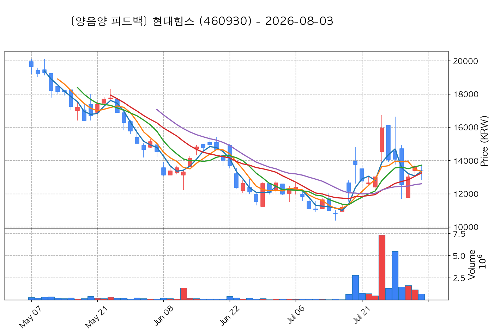

- **전일 종가(기준가)**: 13,650원 ➔ **매매일 시초가**: 13,420원 | **최고가**: 13,760원 (<b>+0.81%</b>) | **종가**: 13,410원 (-1.76%)
- **시세 움직임 복기**: 과거 2026-07-24 기준봉 후 현재 5일선 지지

#### 2) 서산 (079650) — ★ TOP 2 선택 | ✅ 1차 목표 달성 (+10.6%)

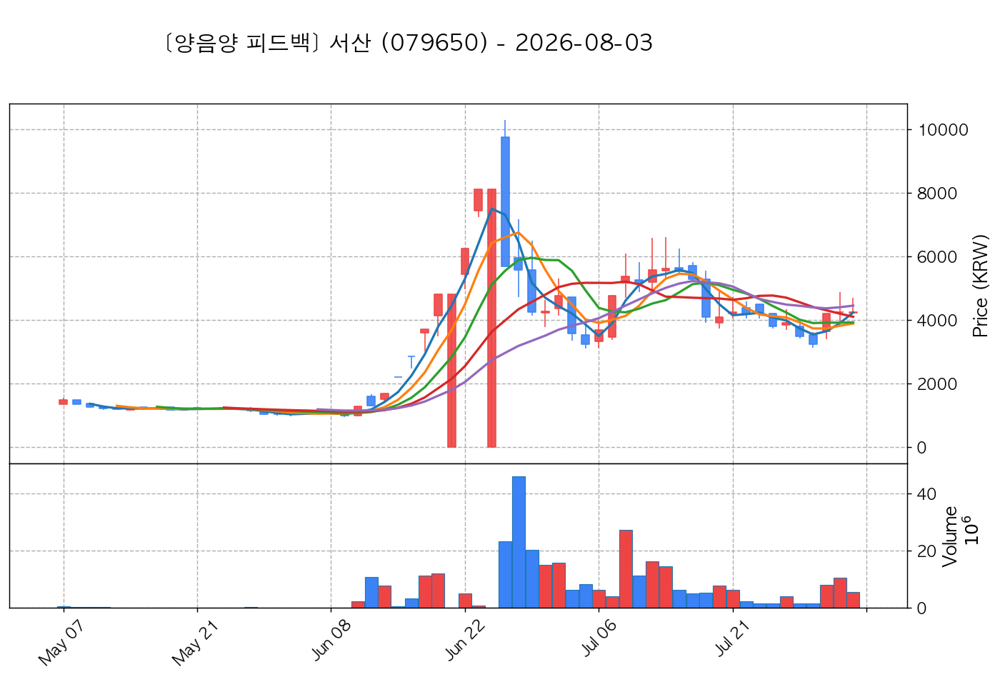

- **전일 종가(기준가)**: 4,250원 ➔ **매매일 시초가**: 4,220원 | **최고가**: 4,700원 (<b>+10.59%</b>) | **종가**: 4,250원 (+0.00%)
- **시세 움직임 복기**: 과거 2026-07-30 기준봉 후 현재 13일선 지지

#### 3) 씨피시스템 (413630) — ★ TOP 3 선택 | ✅ 1차 목표 달성 (+7.9%)

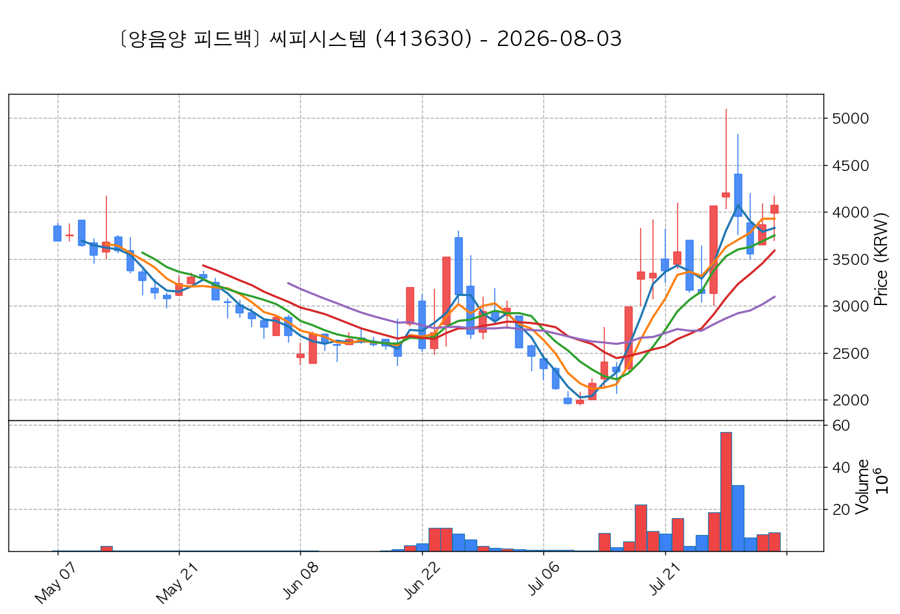

- **전일 종가(기준가)**: 3,865원 ➔ **매매일 시초가**: 3,985원 | **최고가**: 4,170원 (<b>+7.89%</b>) | **종가**: 4,070원 (+5.30%)
- **시세 움직임 복기**: 과거 2026-07-27 기준봉 후 현재 5일선 지지

#### 4) 파세코 (037070) — 후보군 (1위) | ✅ 1차 목표 달성 (+25.7%)

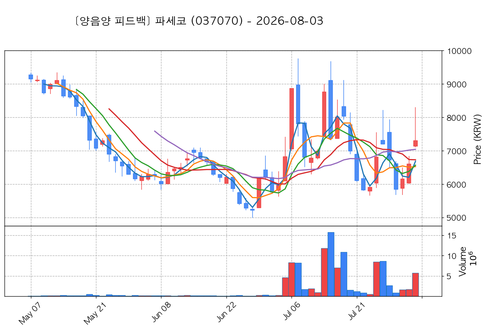

- **전일 종가(기준가)**: 6,610원 ➔ **매매일 시초가**: 7,140원 | **최고가**: 8,310원 (<b>+25.72%</b>) | **종가**: 7,300원 (+10.44%)
- **시세 움직임 복기**: 과거 2026-07-24 기준봉 후 현재 5일선 지지

#### 5) 위닉스 (044340) — 후보군 (2위) | ✅ 1차 목표 달성 (+29.9%)

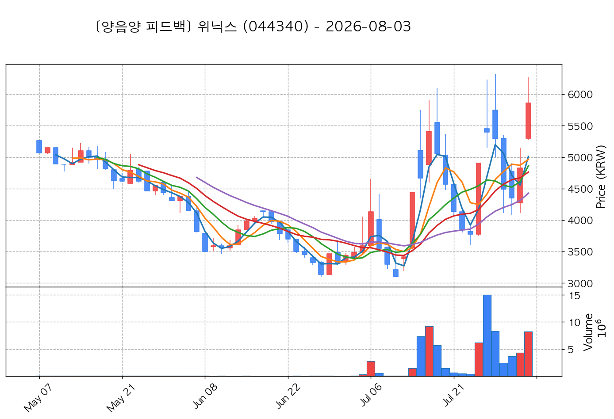

- **전일 종가(기준가)**: 4,825원 ➔ **매매일 시초가**: 5,300원 | **최고가**: 6,270원 (<b>+29.95%</b>) | **종가**: 5,860원 (+21.45%)
- **시세 움직임 복기**: 과거 2026-07-24 기준봉 후 현재 5일선 지지

#### 6) 야스 (255440) — 후보군 (3위) | ✅ 1차 목표 달성 (+24.5%)

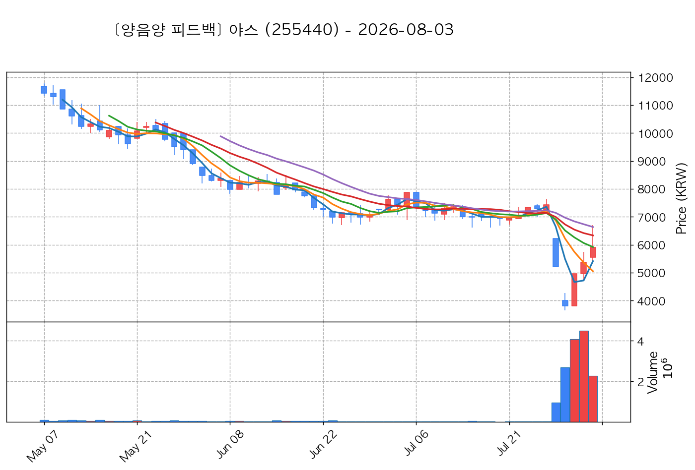

- **전일 종가(기준가)**: 5,380원 ➔ **매매일 시초가**: 5,550원 | **최고가**: 6,700원 (<b>+24.54%</b>) | **종가**: 5,900원 (+9.67%)
- **시세 움직임 복기**: 과거 2026-07-30 기준봉 후 현재 5일선 지지

#### 7) 뉴엔AI (463020) — 후보군 (4위) | ✅ 1차 목표 달성 (+26.1%)

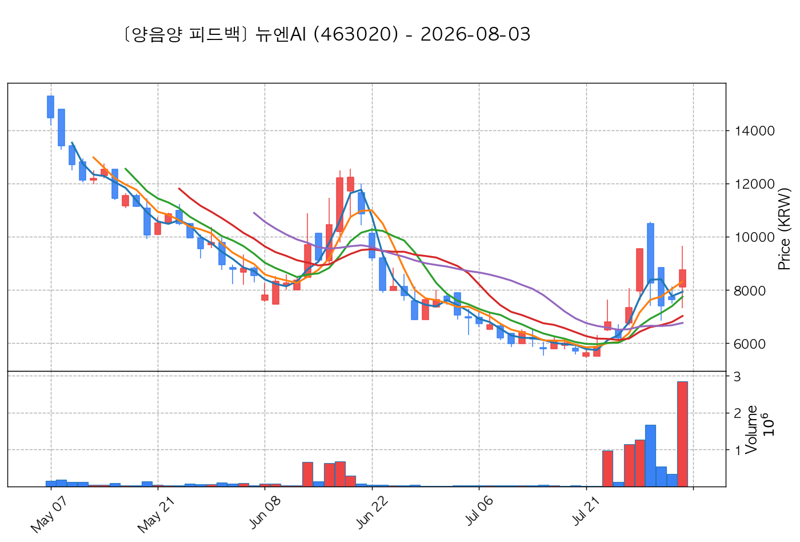

- **전일 종가(기준가)**: 7,650원 ➔ **매매일 시초가**: 8,120원 | **최고가**: 9,650원 (<b>+26.14%</b>) | **종가**: 8,750원 (+14.38%)
- **시세 움직임 복기**: 과거 2026-07-28 기준봉 후 현재 3일선 지지

#### 8) 케이엔알시스템 (199430) — 후보군 (5위) | ✅ 1차 목표 달성 (+25.9%)

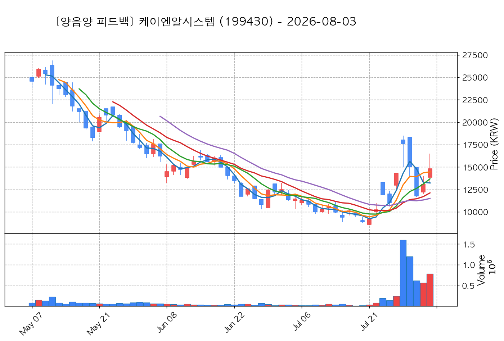

- **전일 종가(기준가)**: 13,100원 ➔ **매매일 시초가**: 13,830원 | **최고가**: 16,490원 (<b>+25.88%</b>) | **종가**: 14,810원 (+13.05%)
- **시세 움직임 복기**: 과거 2026-07-27 기준봉 후 현재 3일선 지지

#### 9) 셀리드 (299660) — 후보군 (6위) | ✅ 1차 목표 달성 (+11.0%)

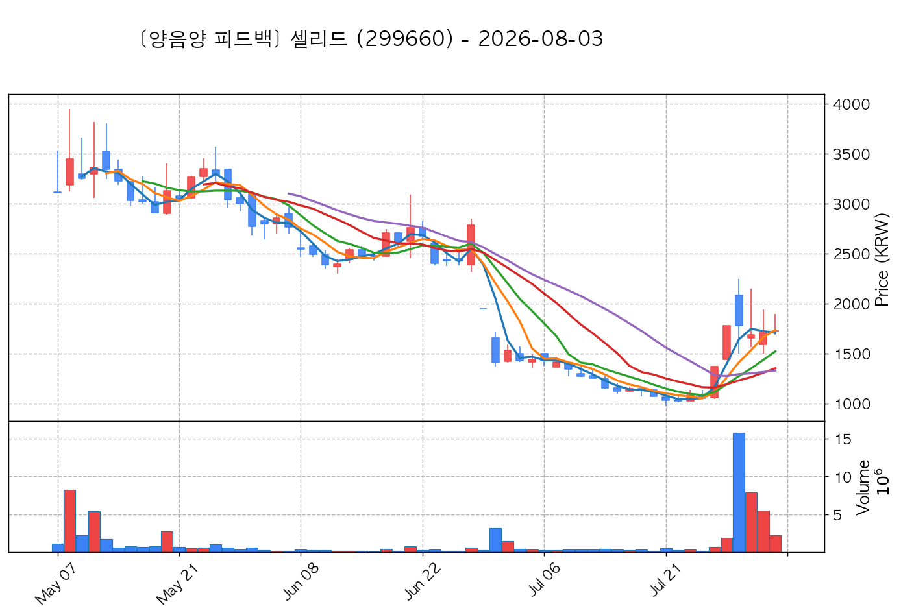

- **전일 종가(기준가)**: 1,707원 ➔ **매매일 시초가**: 1,724원 | **최고가**: 1,895원 (<b>+11.01%</b>) | **종가**: 1,727원 (+1.17%)
- **시세 움직임 복기**: 과거 2026-07-27 기준봉 후 현재 3일선 지지

#### 10) 엔젤로보틱스 (455900) — 후보군 (7위) | ✅ 1차 목표 달성 (+26.1%)

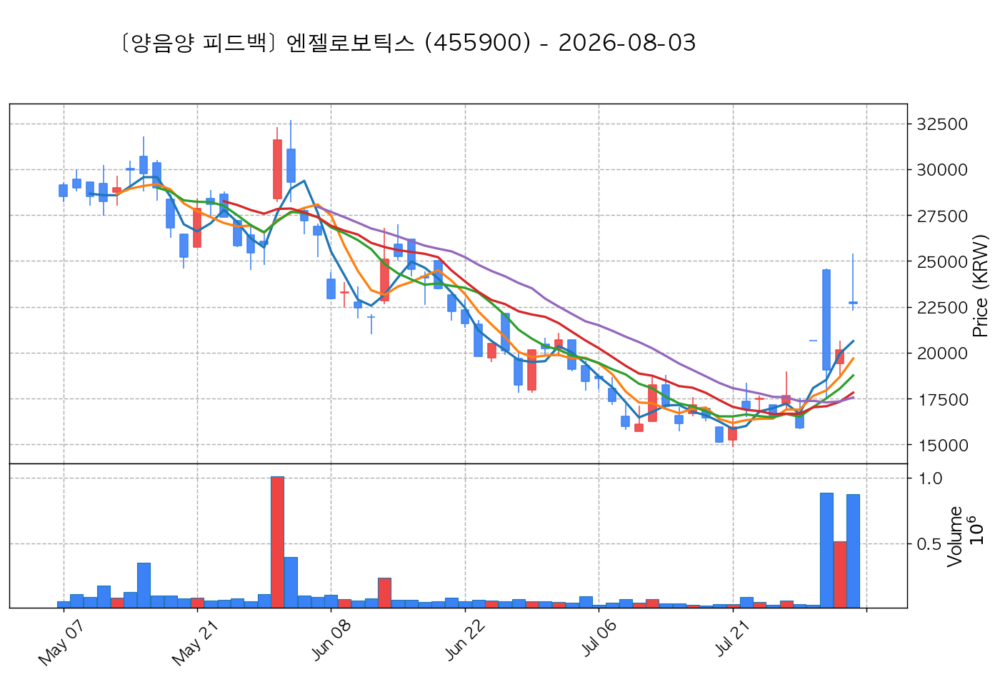

- **전일 종가(기준가)**: 20,150원 ➔ **매매일 시초가**: 22,750원 | **최고가**: 25,400원 (<b>+26.05%</b>) | **종가**: 22,700원 (+12.66%)
- **시세 움직임 복기**: 과거 2026-07-29 기준봉 후 현재 3일선 지지

## 🟡 전략 2 — 일일봉 매집봉 성과

#### 1) 금호전기 (001210) — ★ TOP 1 선택 | ✅ 1차 목표 달성 (+6.4%)

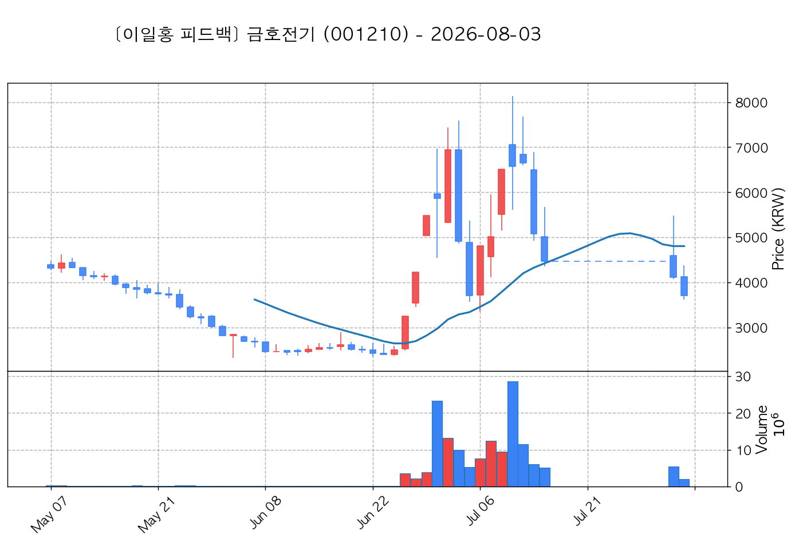

- **전일 종가(기준가)**: 4,115원 ➔ **매매일 시초가**: 4,125원 | **최고가**: 4,380원 (<b>+6.44%</b>) | **종가**: 3,710원 (-9.84%)
- **시세 움직임 복기**: 과거 2026-06-30 매집봉 ➔ 240일선 근접 지지 (-0.20%)

#### 2) 뉴파워프라즈마 (144960) — 후보군 (1위) | ⏱️ 지지선 유지 (+1.7%)

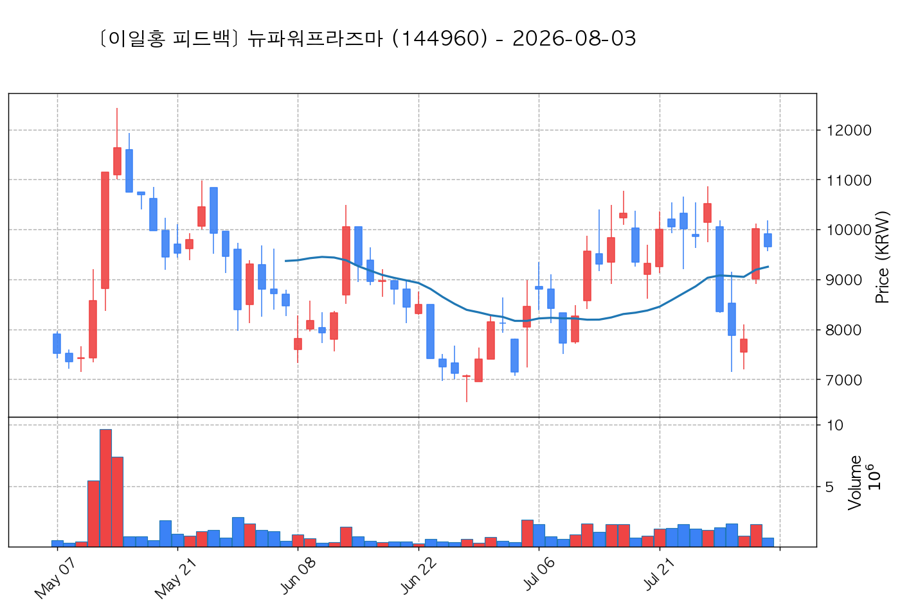

- **전일 종가(기준가)**: 10,010원 ➔ **매매일 시초가**: 9,910원 | **최고가**: 10,180원 (<b>+1.70%</b>) | **종가**: 9,650원 (-3.60%)
- **시세 움직임 복기**: ★ [1순위 키움정석] 40일 최고가 근접 + 60일선 상승 + 시가대비 +11.1% 속양봉

#### 3) 아이로보틱스 (066430) — 후보군 (2위) | ✅ 1차 목표 달성 (+16.5%)

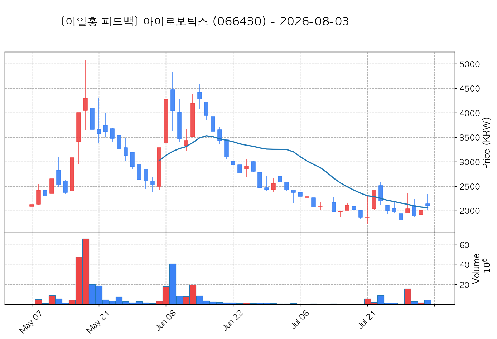

- **전일 종가(기준가)**: 2,005원 ➔ **매매일 시초가**: 2,140원 | **최고가**: 2,335원 (<b>+16.46%</b>) | **종가**: 2,105원 (+4.99%)
- **시세 움직임 복기**: 과거 2026-07-21 매집봉 ➔ 240일선 근접 지지 (-2.19%)

## 🟢 전략 3 — 수급 낙폭과대 바닥형 성과

#### 1) 한화엔진 (082740) — ★ TOP 1 선택 | ❌ 손절 이탈 (-1.0%)

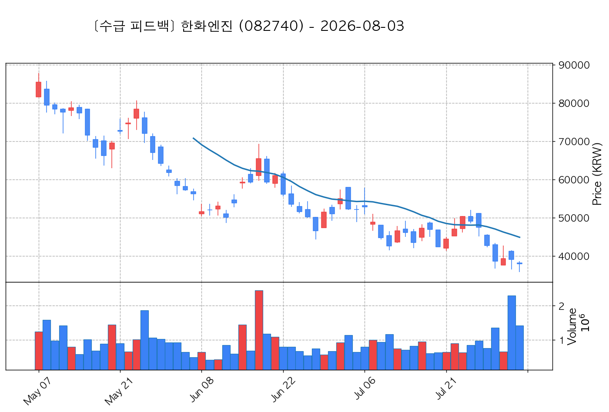

- **전일 종가(기준가)**: 39,050원 ➔ **매매일 시초가**: 38,150원 | **최고가**: 38,650원 (<b>-1.02%</b>) | **종가**: 38,000원 (-2.69%)
- **시세 움직임 복기**: 52주 고점 대비 (41.4%) ➔ 20일 메이저 수급 100억+ 유입 ➔ 없음 지지 안착

#### 2) 한진칼 (180640) — ★ TOP 2 선택 | ✅ 1차 목표 달성 (+8.2%)

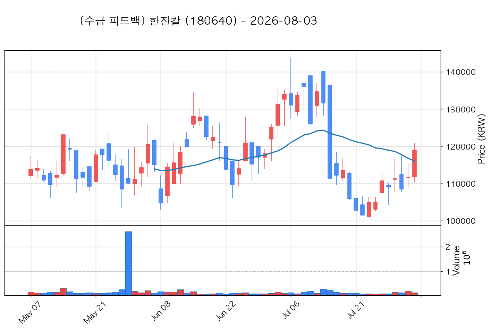

- **전일 종가(기준가)**: 111,700원 ➔ **매매일 시초가**: 111,700원 | **최고가**: 120,900원 (<b>+8.24%</b>) | **종가**: 119,000원 (+6.54%)
- **시세 움직임 복기**: 52주 고점 대비 (63.5%) ➔ 20일 메이저 수급 100억+ 유입 ➔ 없음 지지 안착

