# 🔥 [당일 상한가/급등주 분석] 2026-08-04 시장 주도주 리포트

> 기준일: 2026-08-04 | [📈 매매전 스크리닝 보고서 보기](./2026-08-04_스크리닝.html)

---

## 🏆 1. 당일 상한가/하한가 달성 종목 (상위 5개)

#### 1) RF머트리얼즈 (327260) — <b>+29.93%</b>

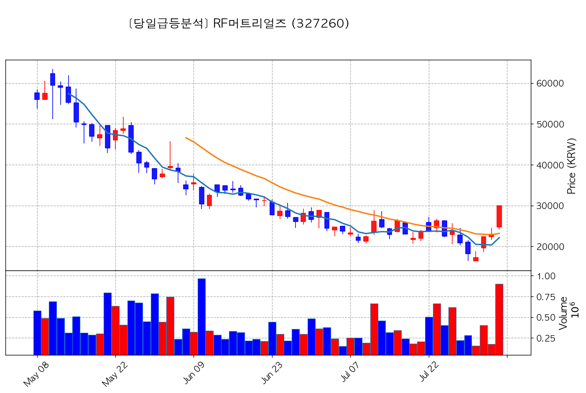

- **종가**: 29,950원 | **거래대금**: 270.2억
- **🔥 당일 핵심 뉴스**: 🔗 [[특징주] RF머트리얼즈, 유증 발표 후 성장 기대감에 10%대 강세](https://news.google.com/rss/articles/CBMiWkFVX3lxTE1QUTBMa2Vid0RvSlEyM2NhdkI2Yy1CdE5ma0JSLVFFTGZYZ1ZQNzVrb29fWjdpQWNOdGJqTHFON0F3WjRJMTItY1BUNGs3VGNoOFlkSjRaS0ZfZ9IBWEFVX3lxTE9LQnJvNnAxUjNDWmhtMHFwVmNza3ltVmRDeWZmNmxLZnVTRGI5LVJ6Ujd1cE1TUmdOTHFYdUNTNU5BSjV6anQ2dHRQR0I2M2x1dE13cjVPRHM?oc=5)

#### 2) 삼기 (122350) — <b>+30.00%</b>

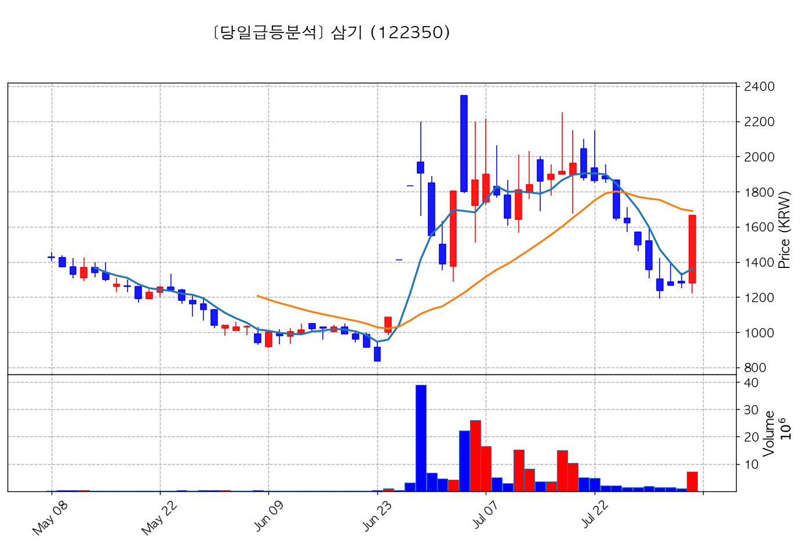

- **종가**: 1,664원 | **거래대금**: 117.6억
- **🔥 당일 핵심 뉴스**: 🔗 [[특징주] 삼기, 글로벌 휴머노이드 로봇 몸체 만든다…子 전력변환 전장부품 시너지효과에 '강세'](https://news.google.com/rss/articles/CBMic0FVX3lxTE9ocDRtZUZ1ZlVDa20xMzY3VmhKX3BrXzU2aDBSa2ZPOG14VjZ4LVZZakFRamtmMzBSazhZakNTTThULVEtMnk0VXg2NmN0UE1RajFzN0UtMmliMWhWT2h6bjdiSWVNZUhUbHZSTUVSOGdNSlE?oc=5)

#### 3) 크라우드웍스 (355390) — <b>+29.83%</b>

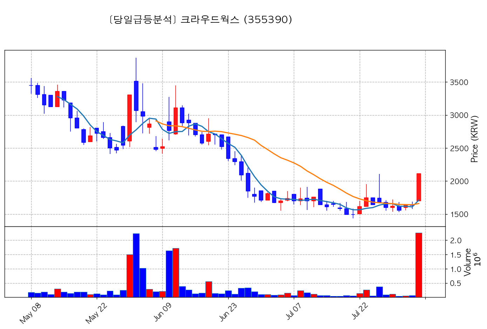

- **종가**: 2,115원 | **거래대금**: 47.8억
- **🔥 당일 핵심 뉴스**: 🔗 [특징주, 크라우드웍스-피지컬 AI/휴머노이드 로봇 테마 상승세에 6.87% ↑](https://news.google.com/rss/articles/CBMiUkFVX3lxTE5NUWY5NGY3Z3RkcGJVN092TDFOVGJsRm5nVXVBd3NFSFpGZ0RRczlJeHAxSHlUdExVQWJjNDlZdEEwODZNVnNvT2tLaWQ1RVhrZHc?oc=5)

#### 4) 삼기에너지솔루션즈 (419050) — <b>+29.96%</b>

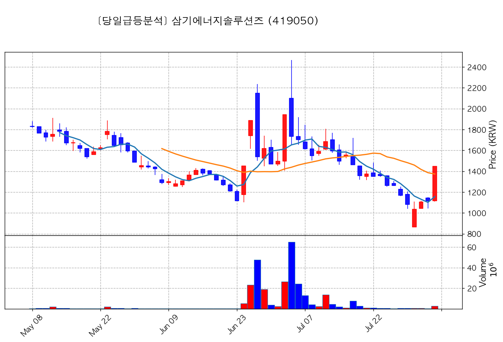

- **종가**: 1,449원 | **거래대금**: 42.2억
- **🔥 당일 핵심 뉴스**: 🔗 [[특징주] 삼기, 휴머노이드 프레임 개발 낙점에 30%↑…삼기에너지솔루션즈 동반 강세](https://news.google.com/rss/articles/CBMiXEFVX3lxTE9jUGZFSXpaeVJsazRtRVJaYXVMSElNMFdfVWZHQ2E1T2ZhVzlTT0xUS080dlByNFJodVlPNGNUNWUwVmxZb3g0cXp0dVpMS0pybFdqa1hnNm96N1df?oc=5)

#### 5) 랩지노믹스 (084650) — <b>+29.93%</b>

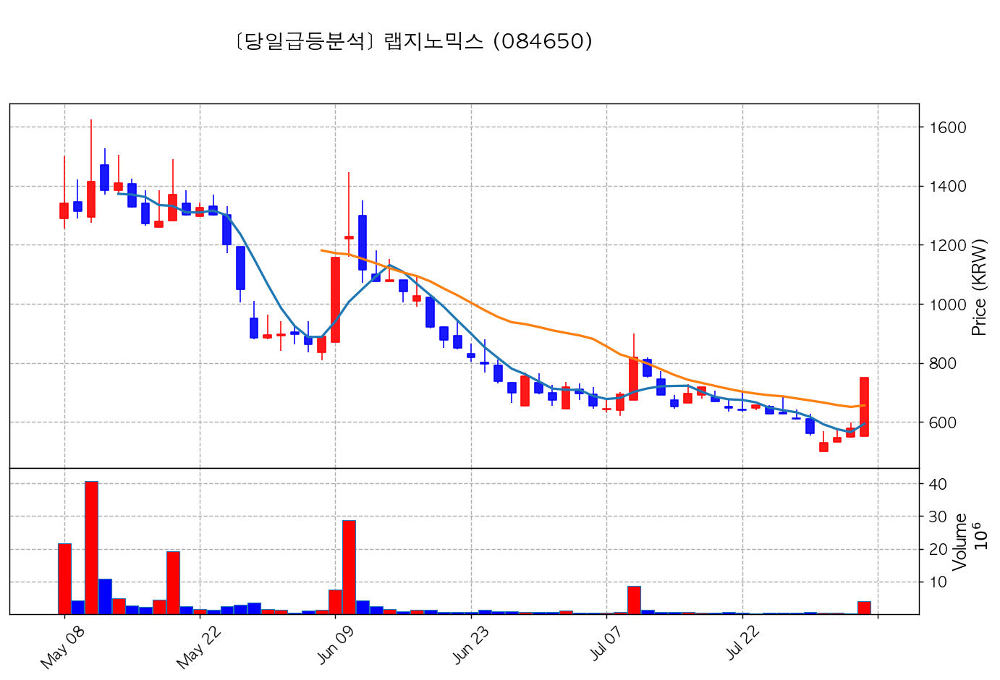

- **종가**: 751원 | **거래대금**: 30.4억
- **🔥 당일 핵심 뉴스**: 🔗 [[특징주] 랩지노믹스, 美 사업 확대 기대감에 상한가](https://news.google.com/rss/articles/CBMiT0FVX3lxTFBUakJELUhYNHpickVLekdvRUxPSUR0blBKRW5LUWJfbENvQjM1LVIweDhuOU9VbTRmaWdlbUdBQkNKLUhjZGpjLW0wQVJFR1E?oc=5)

---

## 🚀 2. 거래대금 150억+ & +15% 이상 폭등주 (상위 10개)

#### 1) SK이터닉스 (475150) — <b>+19.87%</b>

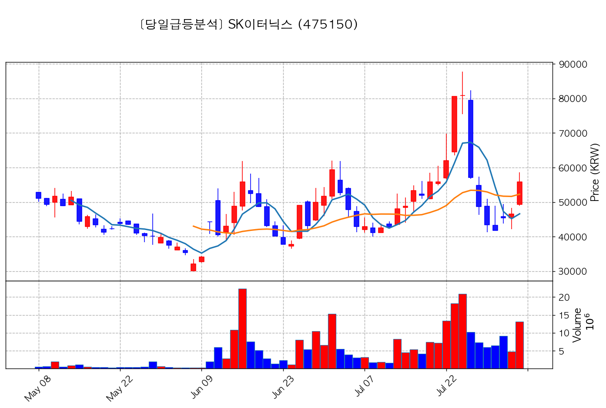

- **종가**: 55,800원 | **거래대금**: 7332.8억
- **🔥 당일 핵심 뉴스**: 🔗 [[특징주] SK이터닉스, 한국판 IRA 기대·中 태양광 가격 규제에 20%대 강세](https://news.google.com/rss/articles/CBMiT0FVX3lxTFBrUFlBZDhXa2NyZTFFX0dvZVRUSk05RzAyTjA2eVlwN1VtZFJVMWxCTnVjV1lIR0hndDd2cWktemdmX1gwd3dCX1ZLRE1ERFE?oc=5)

#### 2) 지엔씨에너지 (119850) — <b>+21.90%</b>

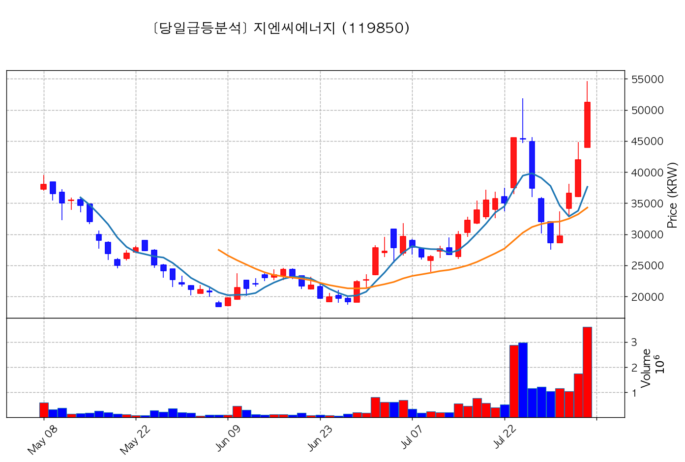

- **종가**: 51,200원 | **거래대금**: 1840.0억
- **🔥 당일 핵심 뉴스**: 🔗 [[특징주] 지엔씨에너지, “정부 AI 데이터센터 육성 본격화”에 국내 1위 비상발전기 공급사 ‘부각’](https://news.google.com/rss/articles/CBMibEFVX3lxTE5QdEtfT1ludVQtMWFHY0Y2cVF3aERzWVFoYm5ZNmZ3NkRSYmlHbkx5N2NCaUY3d3NxZnB2VWUySVh4a1J5Y290am01WEM0TjJiUDk0NEY1Zm1rSExKdEhvazBqQ2p2LUI5ZkFNdQ?oc=5)
- **📜 과거 부각 이력**: `2026-07-31 피드백` 이력 있음, `2026-07-30 스크리닝` 이력 있음

#### 3) GS건설 (006360) — <b>+18.56%</b>

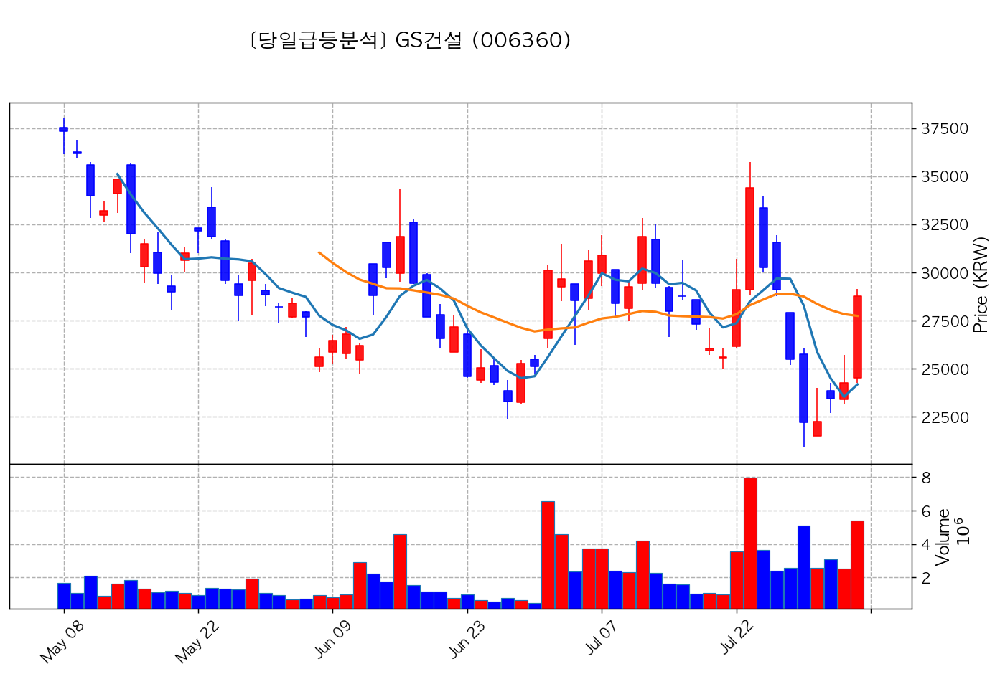

- **종가**: 28,750원 | **거래대금**: 1553.5억
- **🔥 당일 핵심 뉴스**: 🔗 [[특징주] GS건설, SMR 세제 혜택 및 빌 게이츠 방한 겹호재에 15%대 급등](https://news.google.com/rss/articles/CBMibEFVX3lxTE1uSFZYQXlDd0F0R2l3eVhnUXhiX1M3cW4xTFR4VEowd3FSTy1vRFg1bkdiTjdsUFRVUVlOU2JYVzlXS2Y5OW8wYU8zT0lDTlNoOEFxQ0FzOHZ4cUZ3Y1RmVmc1MlcyZWVQTWZLOA?oc=5)
- **📜 과거 부각 이력**: `2026-08-04 피드백` 이력 있음, `2026-08-03 스크리닝` 이력 있음

#### 4) 스피어 (347700) — <b>+23.14%</b>

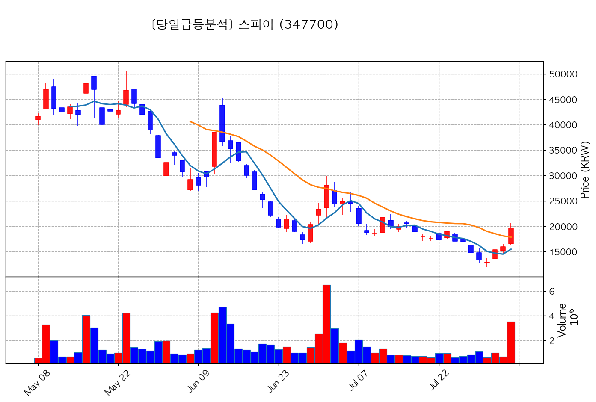

- **종가**: 19,690원 | **거래대금**: 694.0억
- **🔥 당일 핵심 뉴스**: 🔗 [[특징주] 스피어, 미국 우주발사업체향 수주 확대 '강세'](https://news.google.com/rss/articles/CBMiiAFBVV95cUxOcWVCbWprQ3V1dmtzcXN4QTlYR214XzdlS0Rma2pYUUNMV1ljNGlIOWladjVwR08yeHZ0RmUtelBtdW90Y2FlOENMTFdhYVZIaUN4LVl0NU9VVVliVFNnay1NMlltanRqdWFYc2hrTXpCUzNoRXR0UXhHM04xS2xtT2loTFcwSXJB?oc=5)

#### 5) 대주전자재료 (078600) — <b>+17.19%</b>

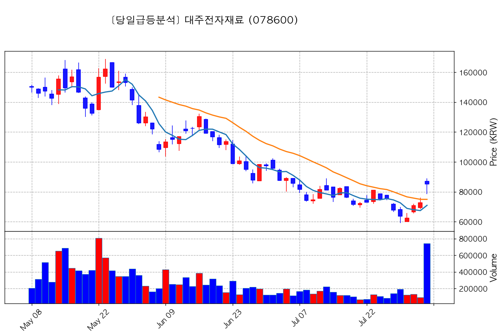

- **종가**: 85,200원 | **거래대금**: 631.3억
- **🔥 당일 핵심 뉴스**: 🔗 [[특징주]대주전자재료, 스페이스X 우주 태양전지 전극재료 양산 개시‥국내 유일 공급 레코드에 14%↑](https://news.google.com/rss/articles/CBMic0FVX3lxTE5RZ0VrNlRyMHc3UWhpWjJrSHo0RW9VYi03UDBZT1VPV1RlZHl5eEVsUFF3YThpTlQ3VVROMFBFbEJoMTRIMUFLeGhOVUNzZlU1VjExX2lBYXk4MzJvVEp6MmhOM3FBZ0V2MWlyVTI5UkQ3OFk?oc=5)

#### 6) 리가켐바이오 (141080) — <b>+15.20%</b>

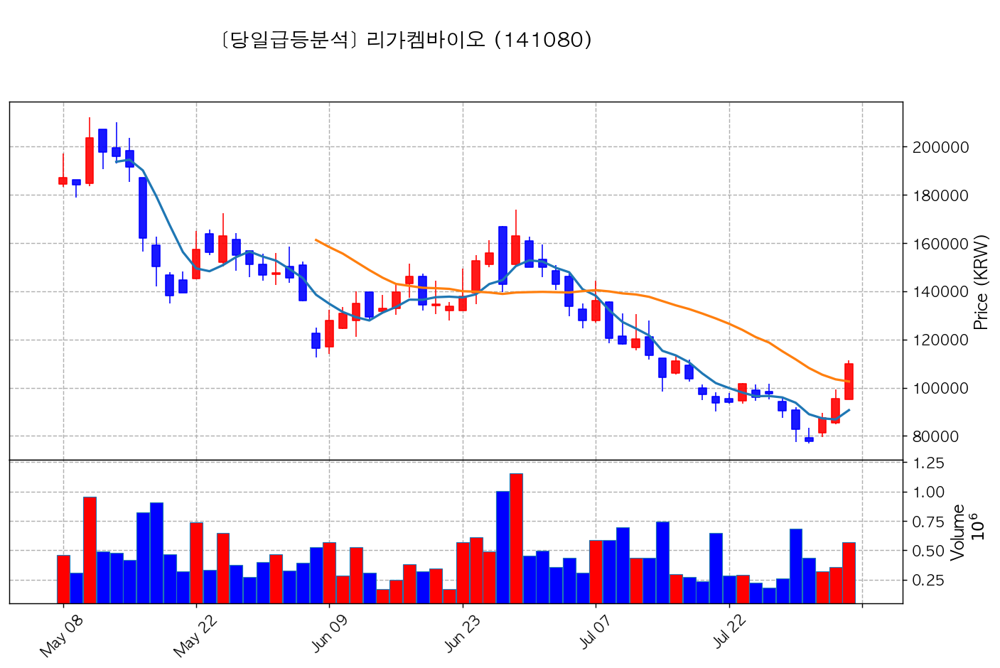

- **종가**: 109,900원 | **거래대금**: 627.0억
- **🔥 당일 핵심 뉴스**: 🔗 [특징주, 리가켐바이오-면역항암제 테마 상승세에 10.56% ↑](https://news.google.com/rss/articles/CBMiUkFVX3lxTFAtM2EzNkI5WjNxbk44QXhibE02TUlzNTdwb1JoN2ItSGkyMUtPZHBPWUdKYWZsZnJfSXdESzR4aDRET2diYnM1Y3JSTkdOUW5LeFE?oc=5)

#### 7) 알트 (459550) — <b>+19.50%</b>

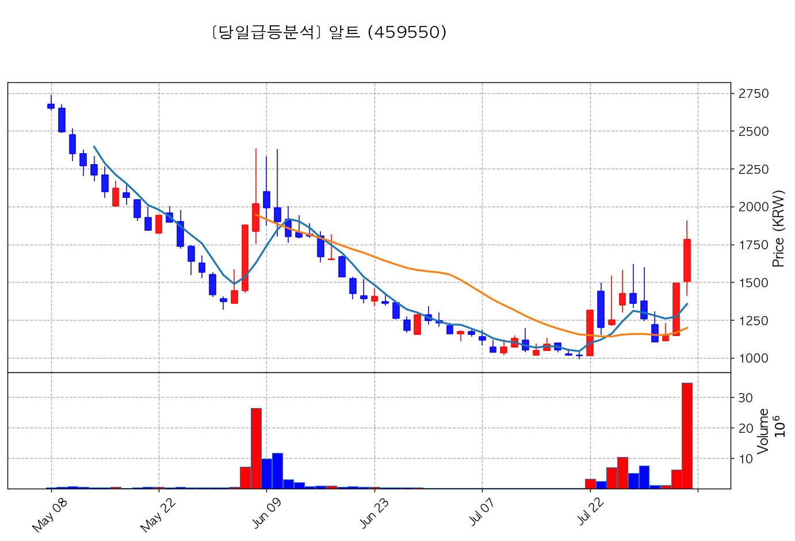

- **종가**: 1,783원 | **거래대금**: 619.0억
- **🔥 당일 핵심 뉴스**: 🔗 [[특징주] 외인·기관, 삼성전자·대우건설 매도… 알트·지엔씨에너지 ' 픽'](https://news.google.com/rss/articles/CBMiakFVX3lxTE5QaVdKMGY3aTZKMW5ieWhpbzNfcVBUZ2lPckkydFhibzc2ekhKNXBBdDVYZGo1Z2FDOERNOXdsWTI3V3I4RGtsOTE0ektVTHVUeGFkdTl0TGkwQnJ6SDY1dVByTzdCVEJCbHc?oc=5)

#### 8) 비에이치아이 (083650) — <b>+16.88%</b>

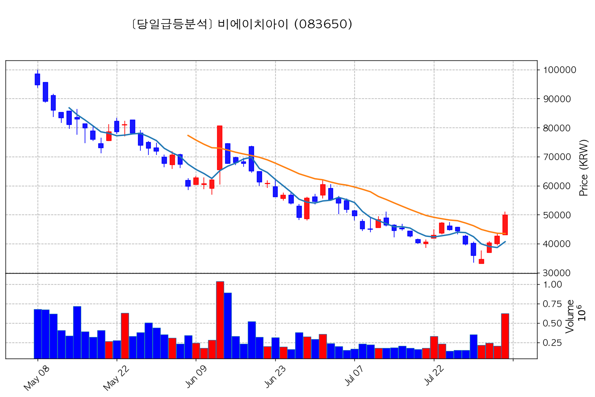

- **종가**: 49,850원 | **거래대금**: 310.6억
- **🔥 당일 핵심 뉴스**: 🔗 [[특징주] 비에이치아이(083650), 폭발적 영업이익 성장…신사업 진출 속도](https://news.google.com/rss/articles/CBMiT0FVX3lxTE1oZnVvMWVNU1pRTlpJalN4V0RYcmN0RUluSHBUbi11ZHd2ZVMwUUh6WWNFLVRXQlNRUUhRTjdzWk9NSWc2SWN1SWY5NWFzMkk?oc=5)

#### 9) 기가레인 (049080) — <b>+21.89%</b>

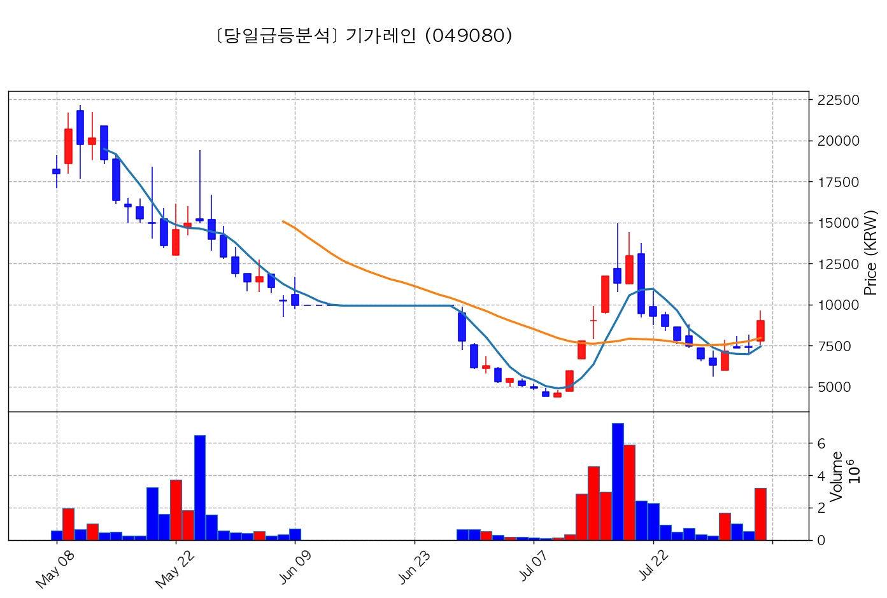

- **종가**: 9,020원 | **거래대금**: 290.7억
- **🔥 당일 핵심 뉴스**: 🔗 [[특징주] 기가레인, 우주 핵심부품 국산화 본격 착수.. '급등'](https://news.google.com/rss/articles/CBMiiAFBVV95cUxNaTFaVG1OUFNjZ1RqcU1zd2c1QjQ0U09Pc0xoYU95RENudFNGQmlHUlFtWG5hNFpBV1laZ2l5YllJaXZOSHZDSWYyRFlDS1dZN09BZDg1VDUzQ3JjQlJNNzhyYmFBMllHMUVsVzlSYjEyVkk3dnJJOU9oSVVHSHZ6Zmk0ZDBaNzNY?oc=5)

#### 10) 엘앤씨바이오 (290650) — <b>+20.91%</b>

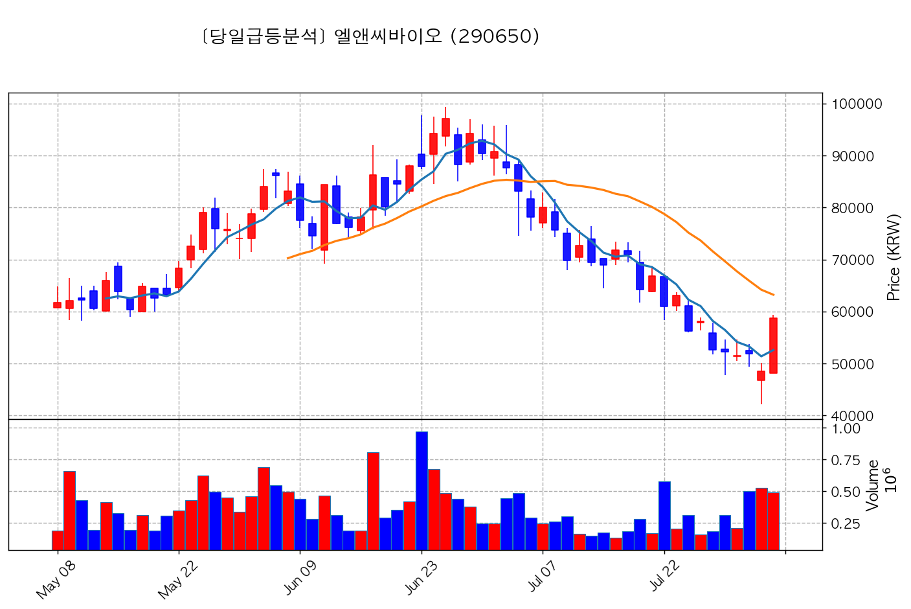

- **종가**: 58,700원 | **거래대금**: 287.6억
- **🔥 당일 핵심 뉴스**: 🔗 [[ET특징주]엘앤씨바이오, 1406억원 유상증자 결정에 하락세](https://news.google.com/rss/articles/CBMiTkFVX3lxTE5OZWVtS1FvVUJHR25sVkdMREJSODFUeW90TlUxUVV5ajduckZSZUwtZDdKSDA4X210ODUtN2VzWmJXcUtRQ1V3Tk0xY3BUZw?oc=5)

