# 📈 [실전플랜 1] 2026-08-04 (종가) 매매 후보 스크리닝 보고서

> 스크리닝 기준일: 2026-08-04 (종가) | 진입 예정일: 2026-08-05 (매매일) | [📊 익일 매매 성과 피드백 보고서 보기](./2026-08-05_피드백.html)

---

## 📊 1. 스크리닝 요약
- **전략 1 (양-음-양 눌림목)**: 29개 포착
- **전략 2 (일일봉 매집봉)**: 7개 포착
- **전략 3 (수급 낙폭과대 바닥형)**: 6개 포착
- **총 포착 수**: 42개 종목 (TOP 선택 6개)

---

## 🔵 1. 전략 1 — 양-음-양 눌림목 (3% × 3슬롯)

#### 1) SK하이닉스 (000660) — ★ TOP 1 선택 (사윗감)

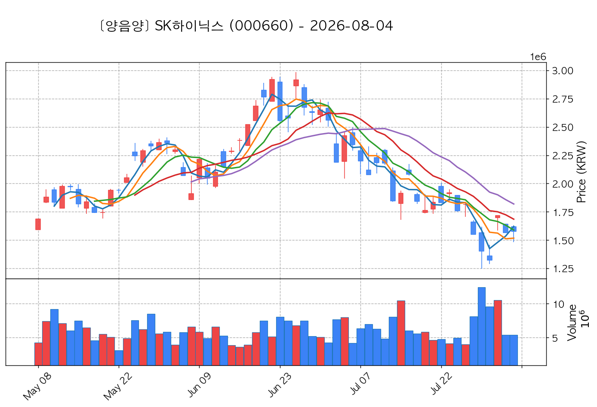

- **기준 종가**: 1,577,000원 | **거래대금**: 85019억
- **분석 사유**: 과거 2026-07-31 기준봉 후 현재 3일선 지지

#### 2) 삼성전자 (005930) — ★ TOP 2 선택

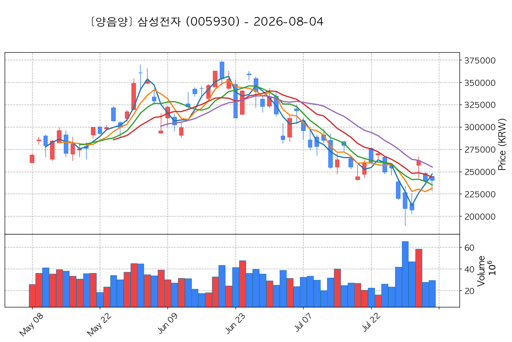

- **기준 종가**: 240,000원 | **거래대금**: 70641억
- **분석 사유**: 과거 2026-07-31 기준봉 후 현재 3일선 지지

#### 3) 제주반도체 (080220) — ★ TOP 3 선택 (사윗감)

- **기준 종가**: 70,000원 | **거래대금**: 1339억
- **분석 사유**: 과거 2026-07-31 기준봉 후 현재 13일선 지지

#### 4) 심텍 (222800) — 후보군 (1위)

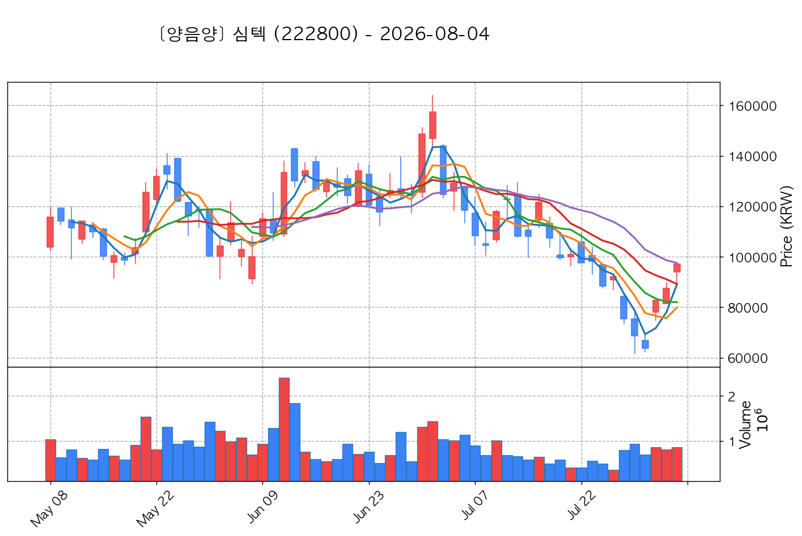

- **기준 종가**: 97,100원 | **거래대금**: 839억
- **분석 사유**: 과거 2026-07-31 기준봉 후 현재 20일선 지지

#### 5) SK스퀘어 (402340) — 후보군 (2위)

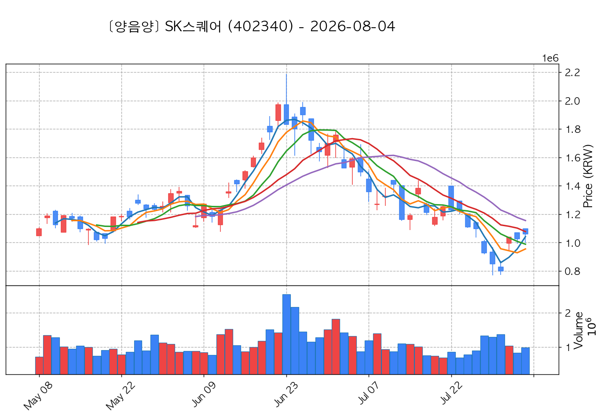

- **기준 종가**: 1,060,000원 | **거래대금**: 10434억
- **분석 사유**: 과거 2026-07-31 기준봉 후 현재 3일선 지지

#### 6) 삼성전기 (009150) — 후보군 (3위)

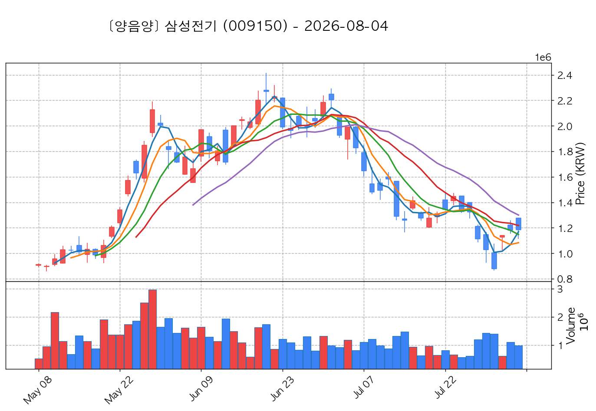

- **기준 종가**: 1,185,000원 | **거래대금**: 11640억
- **분석 사유**: 과거 2026-07-31 기준봉 후 현재 3일선 지지

#### 7) HPSP (403870) — 후보군 (4위)

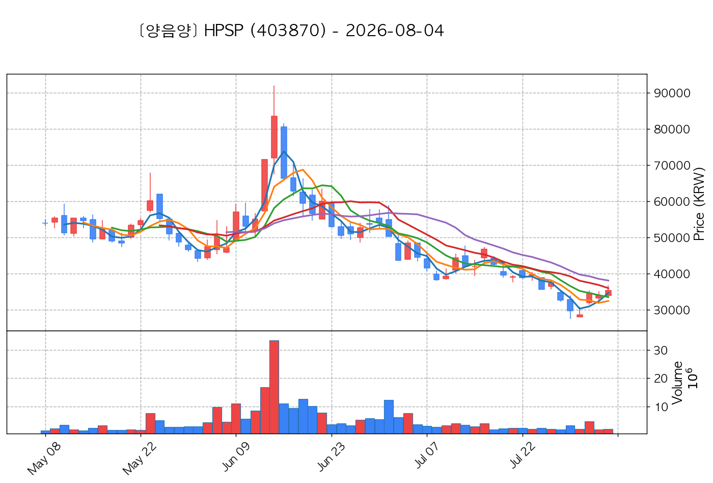

- **기준 종가**: 35,400원 | **거래대금**: 695억
- **분석 사유**: 과거 2026-07-31 기준봉 후 현재 13일선 지지

#### 8) 삼성물산 (028260) — 후보군 (5위)

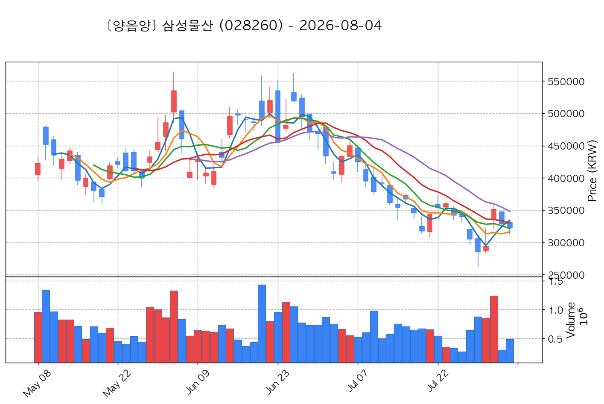

- **기준 종가**: 322,500원 | **거래대금**: 1566억
- **분석 사유**: 과거 2026-07-31 기준봉 후 현재 5일선 지지

#### 9) 이수페타시스 (007660) — 후보군 (6위)

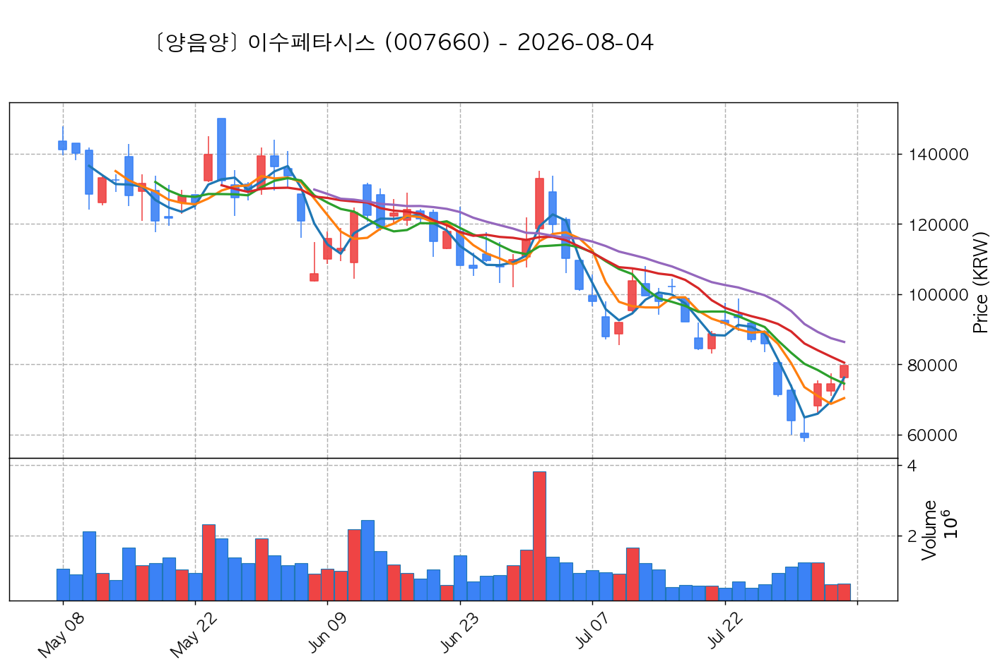

- **기준 종가**: 79,600원 | **거래대금**: 498억
- **분석 사유**: 과거 2026-07-31 기준봉 후 현재 13일선 지지

#### 10) HD현대일렉트릭 (267260) — 후보군 (7위)

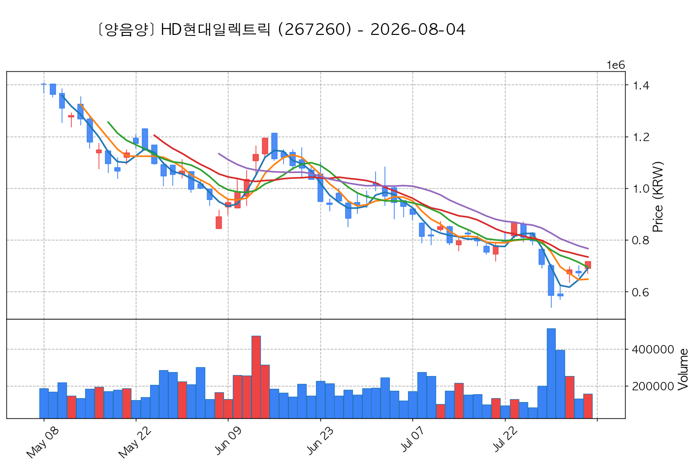

- **기준 종가**: 716,000원 | **거래대금**: 1117억
- **분석 사유**: 과거 2026-07-31 기준봉 후 현재 13일선 지지

## 🟡 2. 전략 2 — 일일봉 매집봉 (10% × 1슬롯)

#### 1) HL만도 (204320) — ★ TOP 1 선택

- **기준 종가**: 48,750원 | **거래대금**: 306억
- **분석 사유**: 과거 2026-06-15 매집봉 ➔ 240일선 근접 지지 (-1.20%)

#### 2) NHN (181710) — 후보군 (1위)

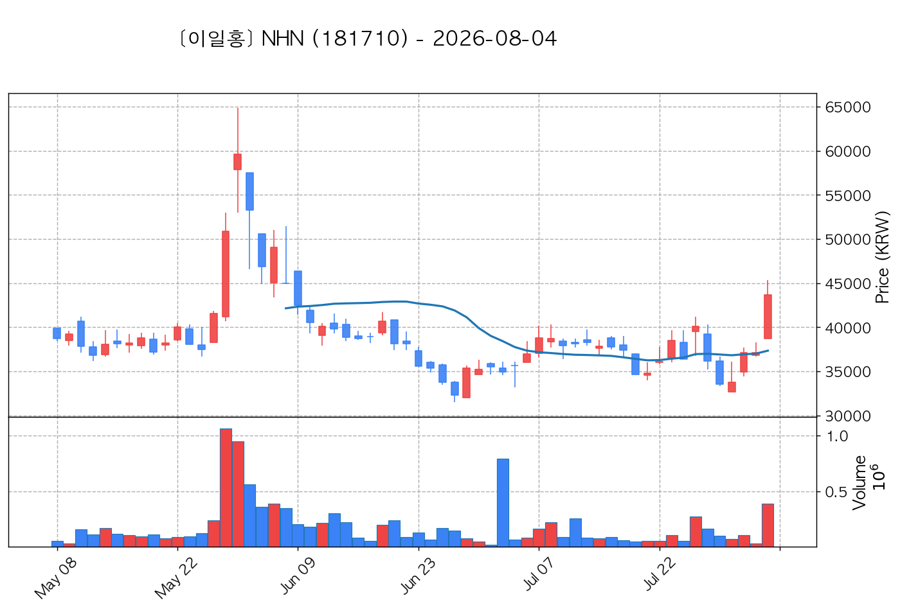

- **기준 종가**: 43,700원 | **거래대금**: 171억
- **분석 사유**: ★ [1순위 키움정석] 40일 최고가 근접 + 60일선 상승 + 시가대비 +12.9% 속양봉

#### 3) 티앤엘 (340570) — 후보군 (2위)

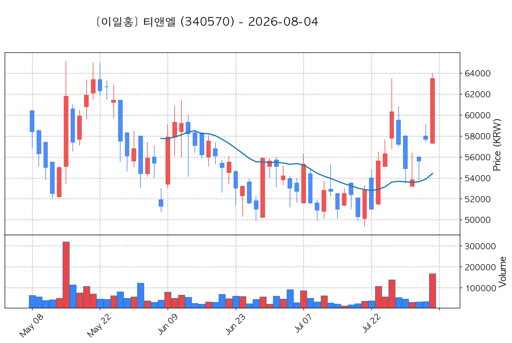

- **기준 종가**: 63,500원 | **거래대금**: 107억
- **분석 사유**: ★ [1순위 키움정석] 40일 최고가 근접 + 60일선 상승 + 시가대비 +10.8% 속양봉

#### 4) 코스메카코리아 (241710) — 후보군 (3위)

- **기준 종가**: 86,000원 | **거래대금**: 79억
- **분석 사유**: ★ [1순위 키움정석] 40일 최고가 근접 + 60일선 상승 + 시가대비 +8.2% 속양봉

#### 5) 다스코 (058730) — 후보군 (4위)

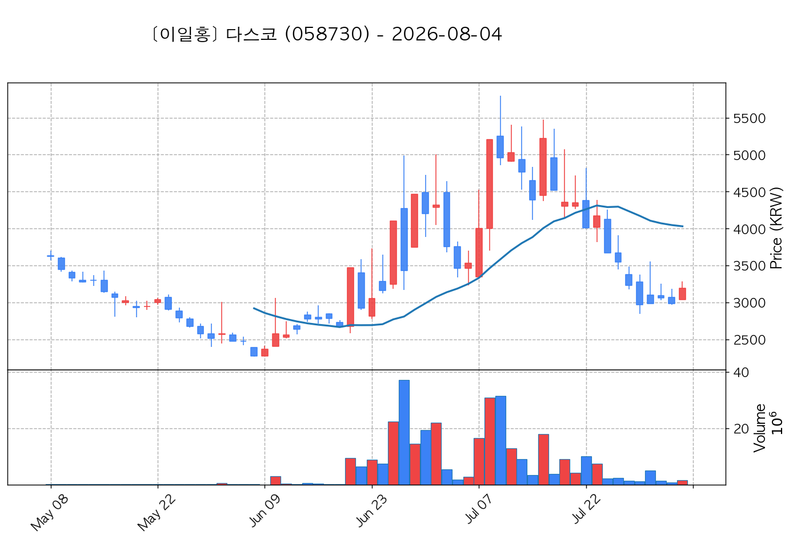

- **기준 종가**: 3,195원 | **거래대금**: 50억
- **분석 사유**: 과거 2026-06-10 매집봉 ➔ 240일선 근접 지지 (-2.94%)

#### 6) 선도전기 (007610) — 후보군 (5위)

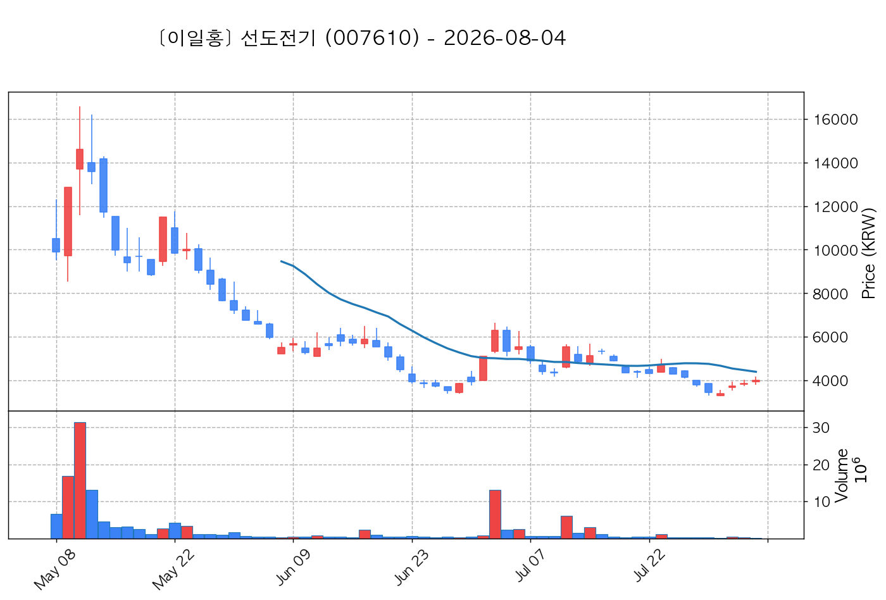

- **기준 종가**: 4,005원 | **거래대금**: 10억
- **분석 사유**: 과거 2026-07-02 매집봉 ➔ 240일선 근접 지지 (+1.06%)

#### 7) 빛샘전자 (072950) — 후보군 (6위)

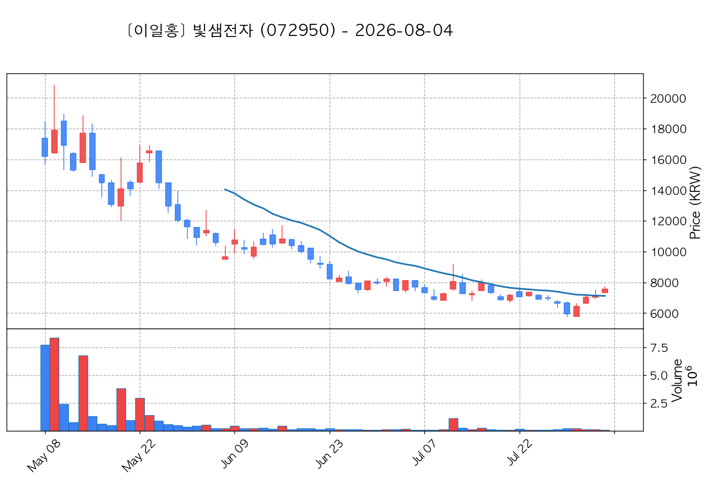

- **기준 종가**: 7,560원 | **거래대금**: 8억
- **분석 사유**: 과거 2026-07-10 매집봉 ➔ 240일선 근접 지지 (+0.45%)

## 🟢 3. 전략 3 — 수급 낙폭과대 바닥형 (10% × 2슬롯)

#### 1) 삼성중공업 (010140) — ★ TOP 1 선택

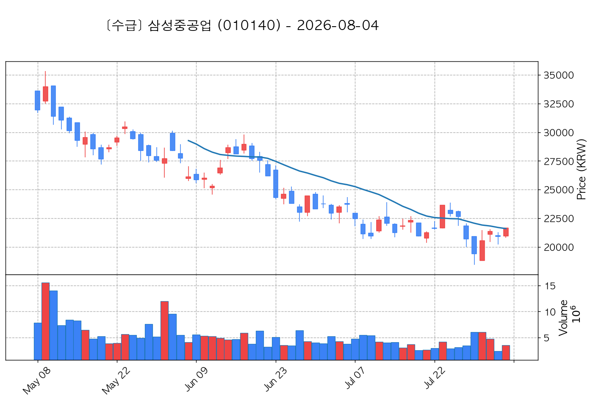

- **기준 종가**: 21,650원 | **거래대금**: 770억
- **분석 사유**: 52주 고점 대비 (61.2%) ➔ 20일 메이저 수급 100억+ 유입 ➔ 없음 지지 안착

#### 2) 한국항공우주 (047810) — ★ TOP 2 선택

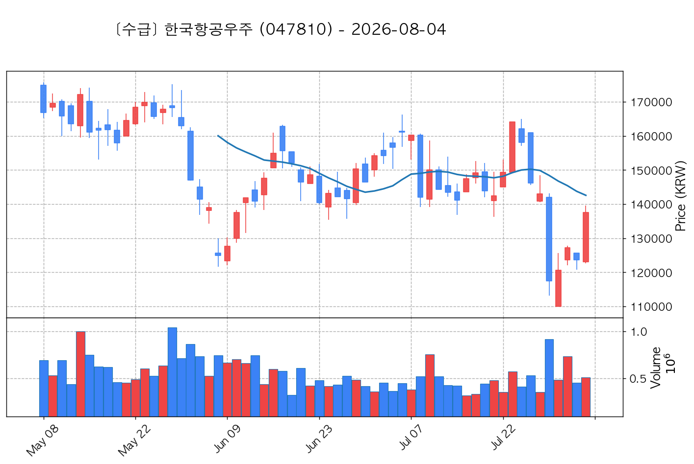

- **기준 종가**: 137,500원 | **거래대금**: 703억
- **분석 사유**: 52주 고점 대비 (63.8%) ➔ 20일 메이저 수급 100억+ 유입 ➔ 240일선 지지 안착

#### 3) 한화엔진 (082740) — 후보군 (1위)

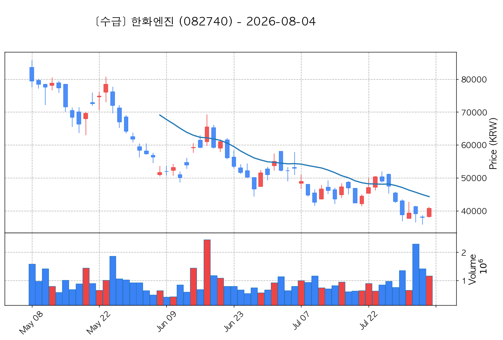

- **기준 종가**: 40,750원 | **거래대금**: 474억
- **분석 사유**: 52주 고점 대비 (43.2%) ➔ 20일 메이저 수급 100억+ 유입 ➔ 없음 지지 안착

#### 4) 한국전력 (015760) — 후보군 (2위)

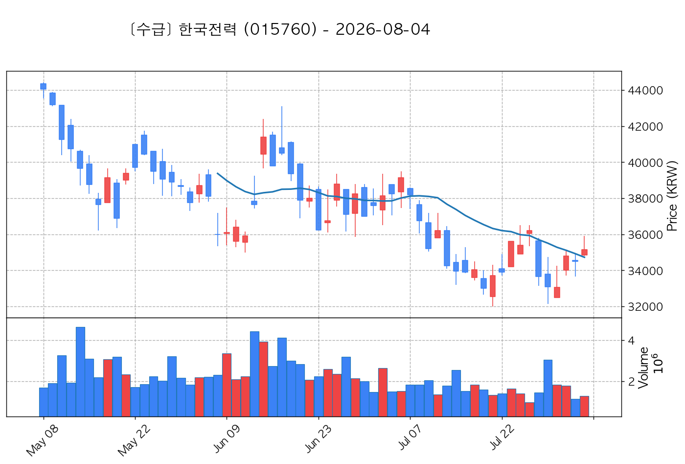

- **기준 종가**: 35,150원 | **거래대금**: 448억
- **분석 사유**: 52주 고점 대비 (50.6%) ➔ 20일 메이저 수급 100억+ 유입 ➔ 없음 지지 안착

#### 5) BNK금융지주 (138930) — 후보군 (3위)

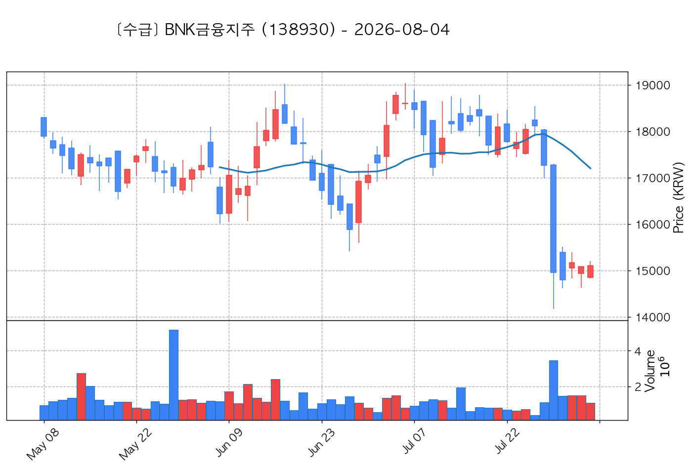

- **기준 종가**: 15,110원 | **거래대금**: 163억
- **분석 사유**: 52주 고점 대비 (65.6%) ➔ 20일 메이저 수급 100억+ 유입 ➔ 없음 지지 안착

#### 6) 코오롱 (002020) — 후보군 (4위)

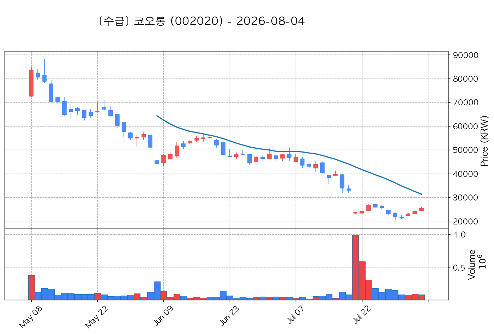

- **기준 종가**: 25,350원 | **거래대금**: 21억
- **분석 사유**: 52주 고점 대비 (28.7%) ➔ 20일 메이저 수급 100억+ 유입 ➔ 없음 지지 안착

