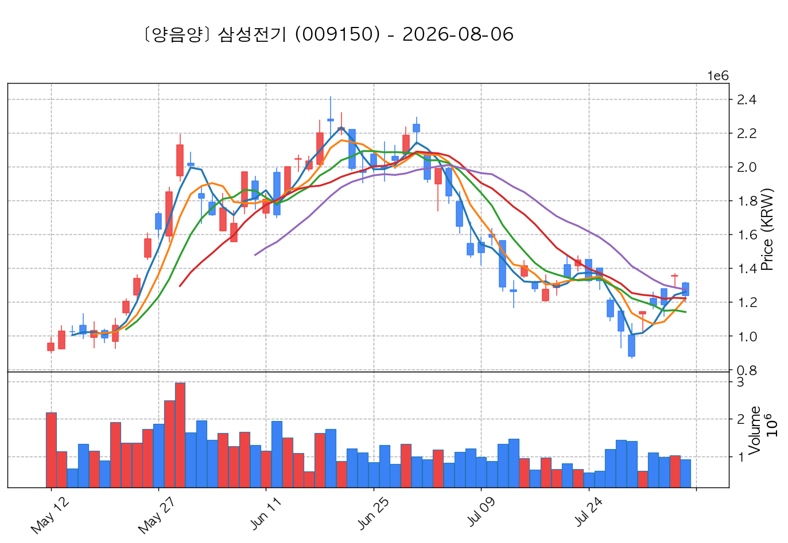
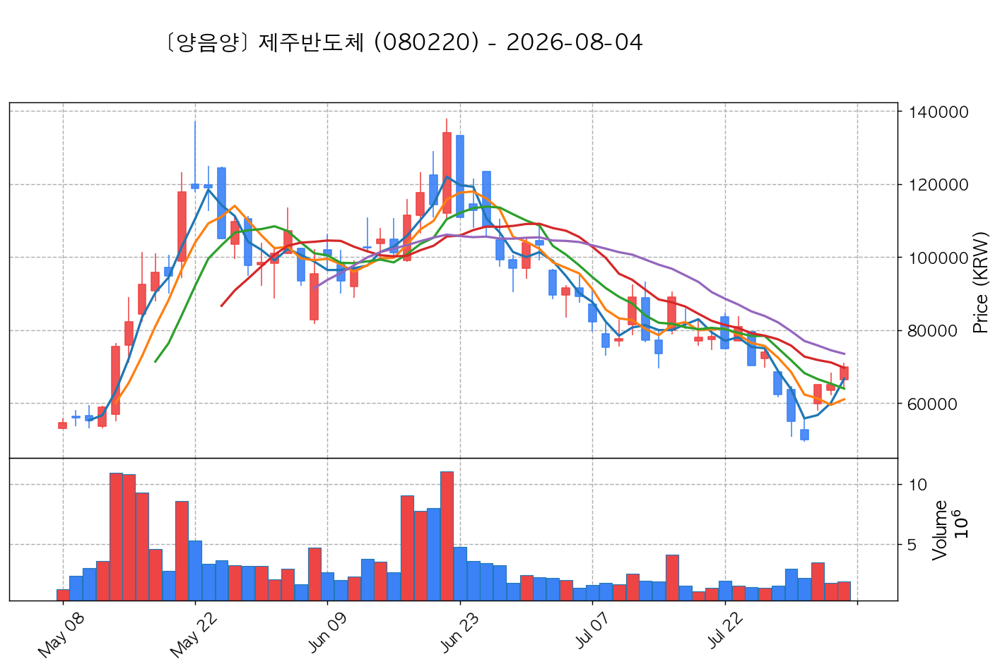
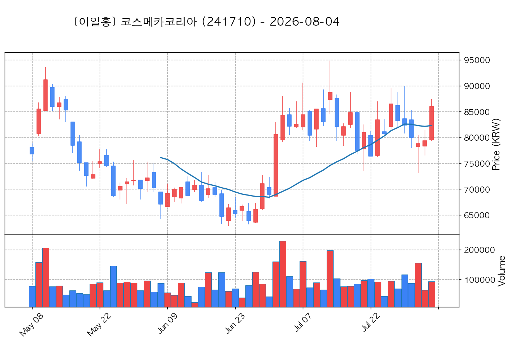

# 📈 [실전플랜 1] 2026-08-04 매매 후보 스크리닝 보고서

> 스크리닝 기준일: 2026-08-04 | [📊 익일 매매 성과 피드백 보고서 보기](./2026-08-04_피드백.html)

---

## 📊 1. 스크리닝 성과 요약

| 전략 | 주요 기법 | 종목수(TOP) |
| :--- | :--- | :---: |
| **전략 1** | 양음양 눌림목 & 사윗감 | 30개 (TOP 3개) |
| **전략 2** | 매집봉 & 이일홍 | 5개 (TOP 1개) |
| **전략 3** | 수급 & 핥 | 3개 (TOP 2개) |
| **합계** | **3대 핵심 전략 통합** | **38개 (TOP 6개)** |

---

## 🔵 3. 전략 1 — 양-음-양 눌림목 (3% × 3슬롯)

### 📋 전략 1 요약표 (상위 10개)

| 종목명 | 기준일종가 | 기준봉 | 지지선 | 비고 및 선정 상태 |
| :--- | ---: | :--- | :---: | :--- |
| **SK하이닉스** (000660) | 1,577,000원 | 상한가 | 3일선 | **★ TOP 1 선택** (사윗감) |
| **삼성전자** (005930) | 240,000원 | +26.8% 장대양봉 | 3일선 | **★ TOP 2 선택** |
| **SK스퀘어** (402340) | 1,060,000원 | 상한가 | 3일선 | **★ TOP 3 선택** |
| **삼성전기** (009150) | 1,185,000원 | 상한가 | 3일선 | 후보군 (1위) |
| **한미반도체** (042700) | 203,000원 | +28.0% 장대양봉 | 3일선 | 후보군 (2위) |
| **삼성물산** (028260) | 322,500원 | +19.6% 장대양봉 | 5일선 | 후보군 (3위) |
| **LG이노텍** (011070) | 525,000원 | +21.2% 장대양봉 | 3일선 | 후보군 (4위) |
| **SK** (034730) | 518,000원 | +18.9% 장대양봉 | 3일선 | 후보군 (5위) |
| **제주반도체** (080220) | 70,000원 | 상한가 | 13일선 | 후보군 (6위) (사윗감) |
| **원익IPS** (240810) | 96,500원 | +27.9% 장대양봉 | 3일선 | 후보군 (7위) |

---

### 🔍 전략 1 상세 분석

#### 1) SK하이닉스 (000660) — ★ TOP 1 선택 (사윗감)

- **기준 종가**: 1,577,000원 | **거래대금**: 83616억
- **분석 사유**: 과거 2026-07-31 기준봉 후 현재 3일선 지지

#### 2) 삼성전자 (005930) — ★ TOP 2 선택

- **기준 종가**: 240,000원 | **거래대금**: 70190억
- **분석 사유**: 과거 2026-07-31 기준봉 후 현재 3일선 지지

#### 3) SK스퀘어 (402340) — ★ TOP 3 선택

- **기준 종가**: 1,060,000원 | **거래대금**: 10066억
- **분석 사유**: 과거 2026-07-31 기준봉 후 현재 3일선 지지

#### 4) 삼성전기 (009150) — 후보군 (1위)

- **기준 종가**: 1,185,000원 | **거래대금**: 11626억
- **분석 사유**: 과거 2026-07-31 기준봉 후 현재 3일선 지지

#### 5) 한미반도체 (042700) — 후보군 (2위)

- **기준 종가**: 203,000원 | **거래대금**: 1756억
- **분석 사유**: 과거 2026-07-31 기준봉 후 현재 3일선 지지

#### 6) 삼성물산 (028260) — 후보군 (3위)

- **기준 종가**: 322,500원 | **거래대금**: 1562억
- **분석 사유**: 과거 2026-07-31 기준봉 후 현재 5일선 지지

#### 7) LG이노텍 (011070) — 후보군 (4위)

- **기준 종가**: 525,000원 | **거래대금**: 1344억
- **분석 사유**: 과거 2026-07-31 기준봉 후 현재 3일선 지지

#### 8) SK (034730) — 후보군 (5위)

- **기준 종가**: 518,000원 | **거래대금**: 935억
- **분석 사유**: 과거 2026-07-31 기준봉 후 현재 3일선 지지

#### 9) 제주반도체 (080220) — 후보군 (6위) (사윗감)

- **기준 종가**: 70,000원 | **거래대금**: 1323억
- **분석 사유**: 과거 2026-07-31 기준봉 후 현재 13일선 지지

#### 10) 원익IPS (240810) — 후보군 (7위)

- **기준 종가**: 96,500원 | **거래대금**: 1060억
- **분석 사유**: 과거 2026-07-31 기준봉 후 현재 3일선 지지

## 🟡 4. 전략 2 — 일일봉 매집봉 (10% × 1슬롯)

### 📋 전략 2 요약표 (상위 5개)

| 종목명 | 기준일종가 | 기준봉 | 지지선 | 비고 및 선정 상태 |
| :--- | ---: | :--- | :---: | :--- |
| **NHN** (181710) | 43,700원 | ★ [1순위 키움정석] 40일 최고가 근접 + 60일선 상승 + 시가대비 +12.9% 속양봉 | 240일선 | **★ TOP 1 선택** |
| **티앤엘** (340570) | 63,500원 | ★ [1순위 키움정석] 40일 최고가 근접 + 60일선 상승 + 시가대비 +10.8% 속양봉 | 240일선 | 후보군 (1위) |
| **코스메카코리아** (241710) | 86,000원 | ★ [1순위 키움정석] 40일 최고가 근접 + 60일선 상승 + 시가대비 +8.2% 속양봉 | 240일선 | 후보군 (2위) |
| **HL만도** (204320) | 48,750원 | 과거 2026-06-15 매집봉 ➔ 240일선 근접 지지 (-1.20%) | 240일선 | 후보군 (3위) |
| **다스코** (058730) | 3,195원 | 과거 2026-06-10 매집봉 ➔ 240일선 근접 지지 (-2.94%) | 240일선 | 후보군 (4위) |

---

### 🔍 전략 2 상세 분석

#### 1) NHN (181710) — ★ TOP 1 선택

- **기준 종가**: 43,700원 | **거래대금**: 171억
- **분석 사유**: ★ [1순위 키움정석] 40일 최고가 근접 + 60일선 상승 + 시가대비 +12.9% 속양봉

#### 2) 티앤엘 (340570) — 후보군 (1위)

- **기준 종가**: 63,500원 | **거래대금**: 107억
- **분석 사유**: ★ [1순위 키움정석] 40일 최고가 근접 + 60일선 상승 + 시가대비 +10.8% 속양봉

#### 3) 코스메카코리아 (241710) — 후보군 (2위)

- **기준 종가**: 86,000원 | **거래대금**: 79억
- **분석 사유**: ★ [1순위 키움정석] 40일 최고가 근접 + 60일선 상승 + 시가대비 +8.2% 속양봉

#### 4) HL만도 (204320) — 후보군 (3위)

- **기준 종가**: 48,750원 | **거래대금**: 304억
- **분석 사유**: 과거 2026-06-15 매집봉 ➔ 240일선 근접 지지 (-1.20%)

#### 5) 다스코 (058730) — 후보군 (4위)

- **기준 종가**: 3,195원 | **거래대금**: 49억
- **분석 사유**: 과거 2026-06-10 매집봉 ➔ 240일선 근접 지지 (-2.94%)

## 🟢 5. 전략 3 — 수급 낙폭과대 바닥형 (10% × 2슬롯)

### 📋 전략 3 요약표 (상위 3개)

| 종목명 | 기준일종가 | 기준봉 | 지지선 | 비고 및 선정 상태 |
| :--- | ---: | :--- | :---: | :--- |
| **삼성중공업** (010140) | 21,650원 | 52주 고점 대비 (61.2%) ➔ 20일 메이저 수급 100억+ 유입 ➔ 없음 지지 안착 | 수급선 | **★ TOP 1 선택** |
| **한국항공우주** (047810) | 137,500원 | 52주 고점 대비 (63.8%) ➔ 20일 메이저 수급 100억+ 유입 ➔ 240일선 지지 안착 | 수급선 | **★ TOP 2 선택** |
| **BNK금융지주** (138930) | 15,110원 | 52주 고점 대비 (65.6%) ➔ 20일 메이저 수급 100억+ 유입 ➔ 없음 지지 안착 | 수급선 | 후보군 (1위) |

---

### 🔍 전략 3 상세 분석

#### 1) 삼성중공업 (010140) — ★ TOP 1 선택

- **기준 종가**: 21,650원 | **거래대금**: 770억
- **분석 사유**: 52주 고점 대비 (61.2%) ➔ 20일 메이저 수급 100억+ 유입 ➔ 없음 지지 안착

#### 2) 한국항공우주 (047810) — ★ TOP 2 선택

- **기준 종가**: 137,500원 | **거래대금**: 703억
- **분석 사유**: 52주 고점 대비 (63.8%) ➔ 20일 메이저 수급 100억+ 유입 ➔ 240일선 지지 안착

#### 3) BNK금융지주 (138930) — 후보군 (1위)

- **기준 종가**: 15,110원 | **거래대금**: 163억
- **분석 사유**: 52주 고점 대비 (65.6%) ➔ 20일 메이저 수급 100억+ 유입 ➔ 없음 지지 안착

