# 📊 [실전플랜 1 피드백] 2026-08-04 매매 성과 추적 보고서

> 스크리닝 포착일: 2026-08-03 (종가) | 실제 매매(추적일): 2026-08-04 (매매일) | [📈 매매전 스크리닝 보고서 보기](./2026-08-03_스크리닝.html)

---

## 📊 1. 당일 매매 성과 요약
- **포착 및 검증 종목 수**: 총 45개 종목

---

## 🔵 전략 1 — 양-음-양 눌림목 성과

#### 1) 삼성전자 (005930) — ★ TOP 1 선택 | ⏱️ 지지선 유지 (+2.1%)

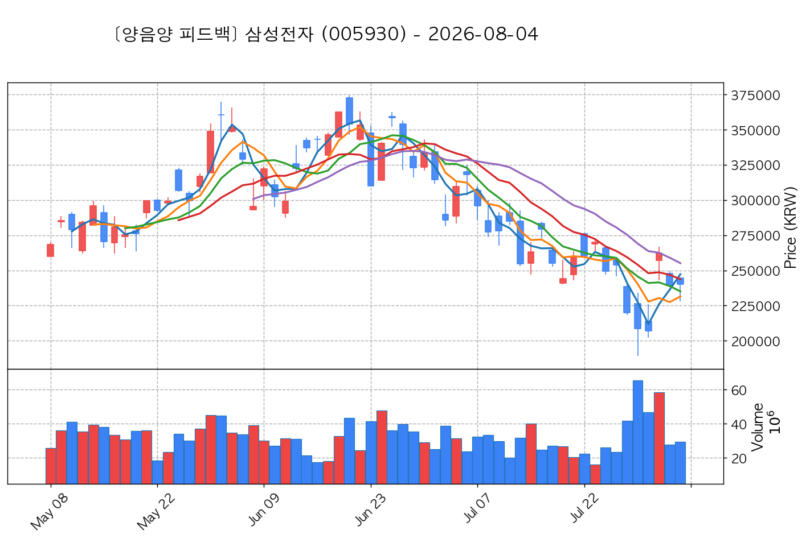

- **전일 종가(기준가)**: 239,500원 ➔ **매매일 시초가**: 244,500원 | **최고가**: 244,500원 (<b>+2.09%</b>) | **종가**: 240,000원 (+0.21%)
- **시세 움직임 복기**: 과거 2026-07-31 기준봉 후 현재 3일선 지지

#### 2) 삼성전기 (009150) — ★ TOP 2 선택 | ✅ 1차 목표 달성 (+8.3%)

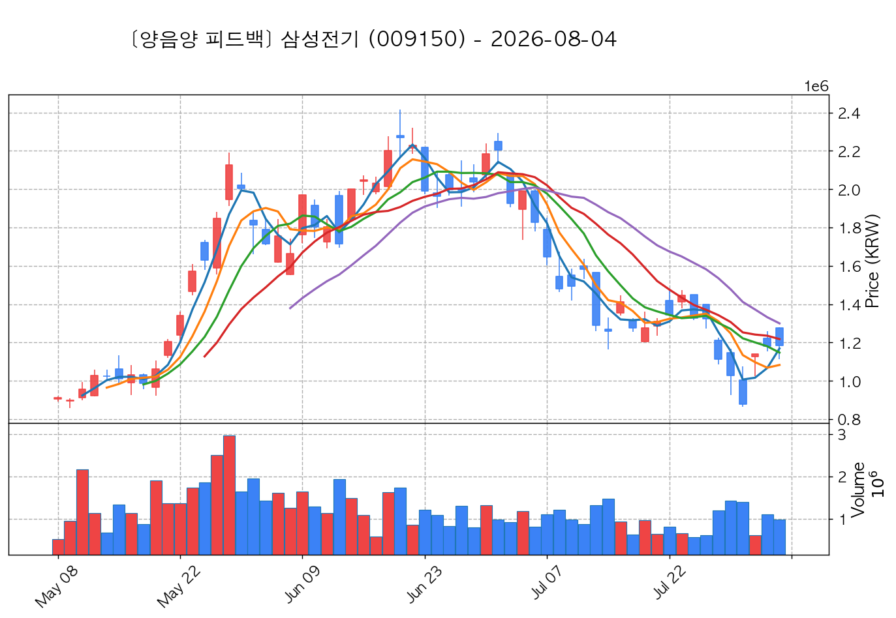

- **전일 종가(기준가)**: 1,181,000원 ➔ **매매일 시초가**: 1,278,000원 | **최고가**: 1,279,000원 (<b>+8.30%</b>) | **종가**: 1,185,000원 (+0.34%)
- **시세 움직임 복기**: 과거 2026-07-31 기준봉 후 현재 8일선 지지

#### 3) SK스퀘어 (402340) — ★ TOP 3 선택 | ✅ 1차 목표 달성 (+6.9%)

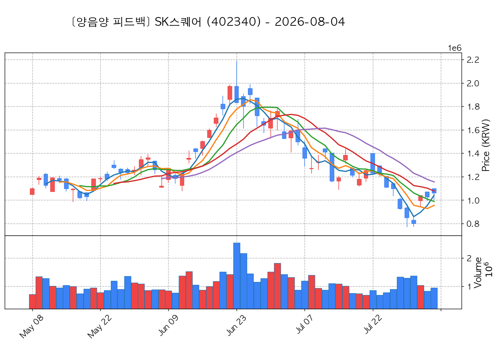

- **전일 종가(기준가)**: 1,025,000원 ➔ **매매일 시초가**: 1,096,000원 | **최고가**: 1,096,000원 (<b>+6.93%</b>) | **종가**: 1,060,000원 (+3.41%)
- **시세 움직임 복기**: 과거 2026-07-31 기준봉 후 현재 8일선 지지

#### 4) 효성중공업 (298040) — 후보군 (1위) | ✅ 1차 목표 달성 (+8.1%)

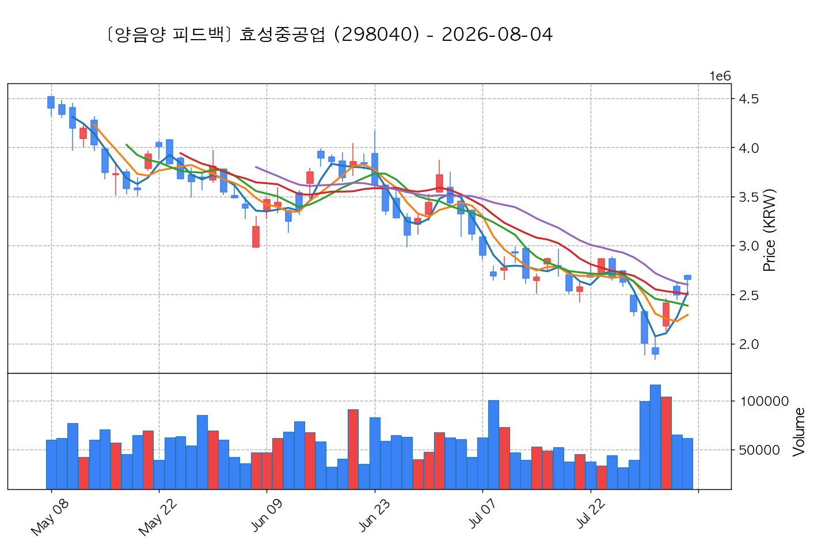

- **전일 종가(기준가)**: 2,495,000원 ➔ **매매일 시초가**: 2,697,000원 | **최고가**: 2,697,000원 (<b>+8.10%</b>) | **종가**: 2,655,000원 (+6.41%)
- **시세 움직임 복기**: 과거 2026-07-31 기준봉 후 현재 13일선 지지

#### 5) 제주반도체 (080220) — 후보군 (2위) | ✅ 1차 목표 달성 (+9.1%)

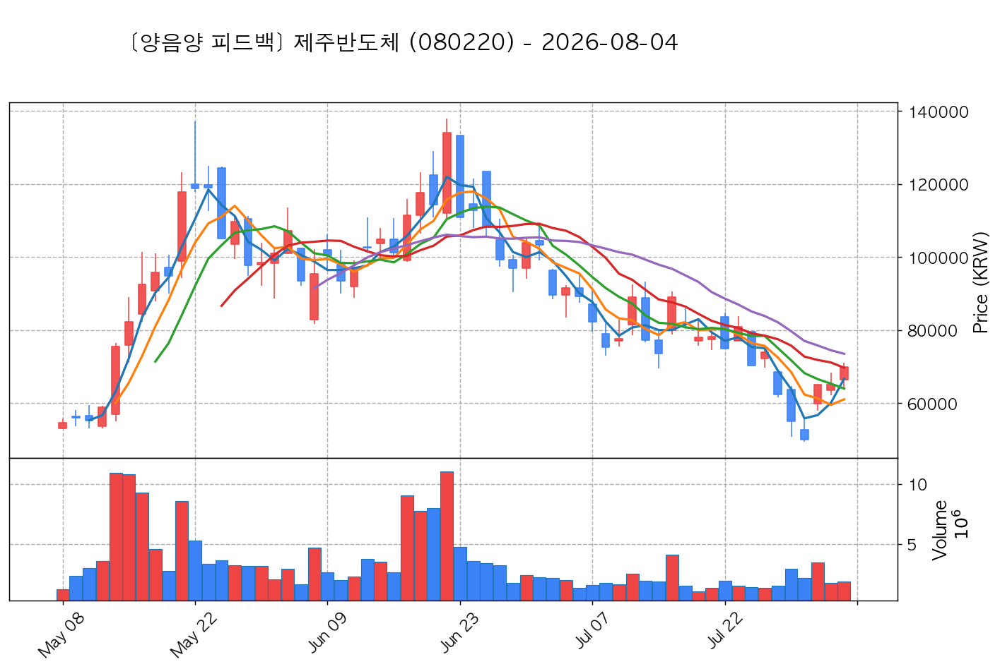

- **전일 종가(기준가)**: 65,100원 ➔ **매매일 시초가**: 66,500원 | **최고가**: 71,000원 (<b>+9.06%</b>) | **종가**: 70,000원 (+7.53%)
- **시세 움직임 복기**: 과거 2026-07-31 기준봉 후 현재 8일선 지지

#### 6) LS ELECTRIC (010120) — 후보군 (3위) | ✅ 1차 목표 달성 (+5.0%)

- **전일 종가(기준가)**: 188,400원 ➔ **매매일 시초가**: 196,200원 | **최고가**: 197,900원 (<b>+5.04%</b>) | **종가**: 197,000원 (+4.56%)
- **시세 움직임 복기**: 과거 2026-07-31 기준봉 후 현재 8일선 지지

#### 7) HPSP (403870) — 후보군 (4위) | ✅ 1차 목표 달성 (+8.1%)

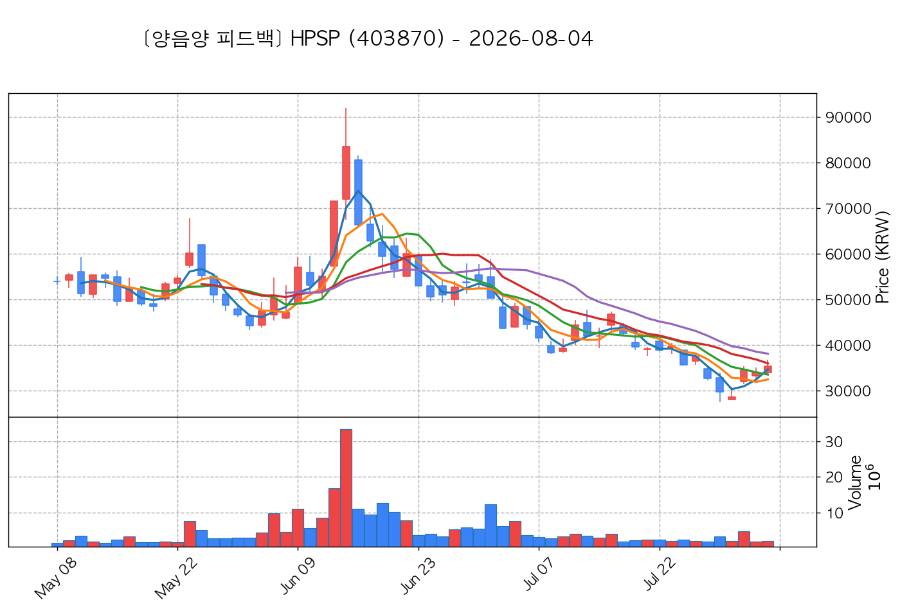

- **전일 종가(기준가)**: 33,950원 ➔ **매매일 시초가**: 34,000원 | **최고가**: 36,700원 (<b>+8.10%</b>) | **종가**: 35,400원 (+4.27%)
- **시세 움직임 복기**: 과거 2026-07-31 기준봉 후 현재 8일선 지지

#### 8) 원익IPS (240810) — 후보군 (5위) | ✅ 1차 목표 달성 (+6.9%)

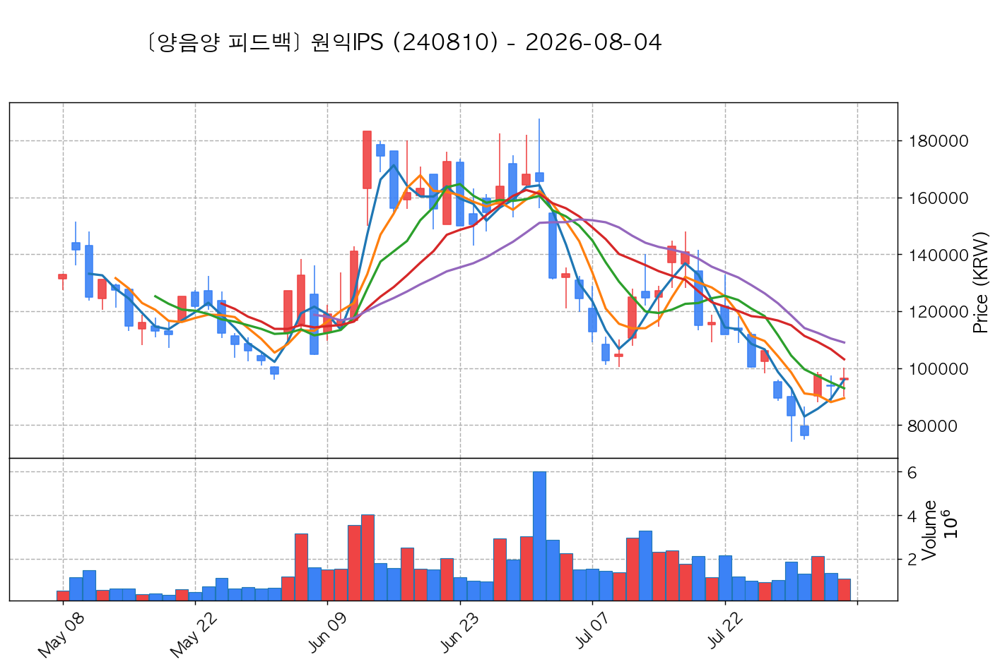

- **전일 종가(기준가)**: 93,700원 ➔ **매매일 시초가**: 95,900원 | **최고가**: 100,200원 (<b>+6.94%</b>) | **종가**: 96,500원 (+2.99%)
- **시세 움직임 복기**: 과거 2026-07-31 기준봉 후 현재 8일선 지지

#### 9) 현대건설 (000720) — 후보군 (6위) | ✅ 1차 목표 달성 (+6.6%)

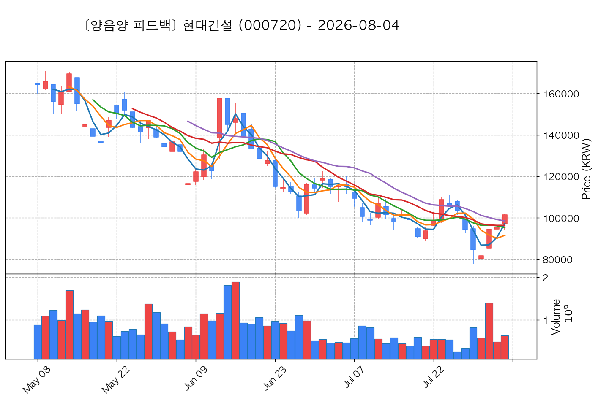

- **전일 종가(기준가)**: 95,600원 ➔ **매매일 시초가**: 97,300원 | **최고가**: 101,900원 (<b>+6.59%</b>) | **종가**: 101,500원 (+6.17%)
- **시세 움직임 복기**: 과거 2026-07-31 기준봉 후 현재 8일선 지지

#### 10) 삼성물산 (028260) — 후보군 (7위) | ⏱️ 지지선 유지 (+1.1%)

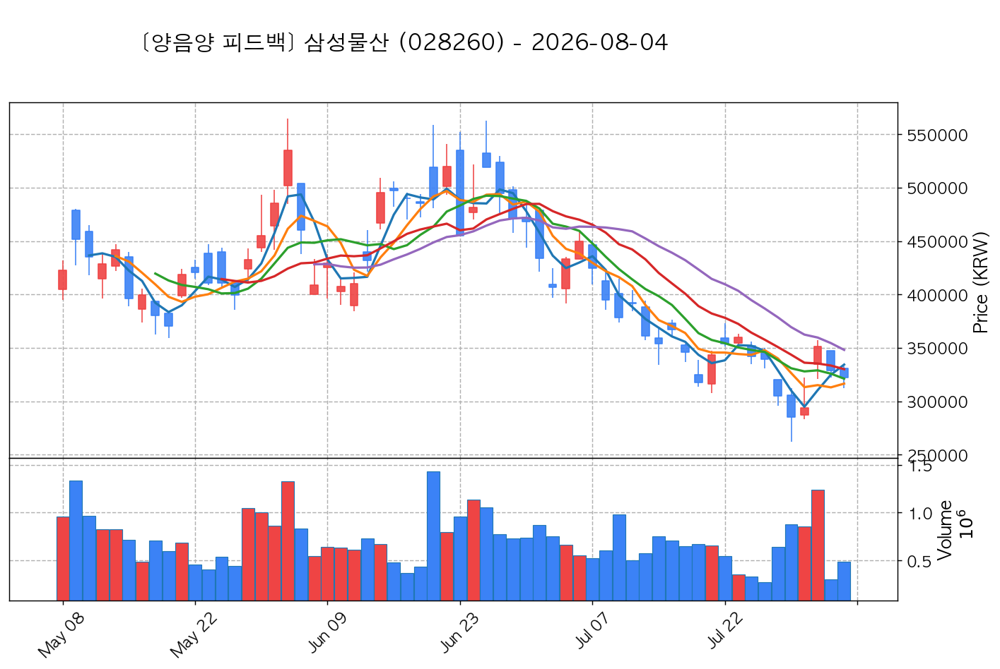

- **전일 종가(기준가)**: 329,000원 ➔ **매매일 시초가**: 331,000원 | **최고가**: 332,500원 (<b>+1.06%</b>) | **종가**: 322,500원 (-1.98%)
- **시세 움직임 복기**: 과거 2026-07-31 기준봉 후 현재 3일선 지지

## 🟡 전략 2 — 일일봉 매집봉 성과

#### 1) 파세코 (037070) — ★ TOP 1 선택 | ✅ 1차 목표 달성 (+4.4%)

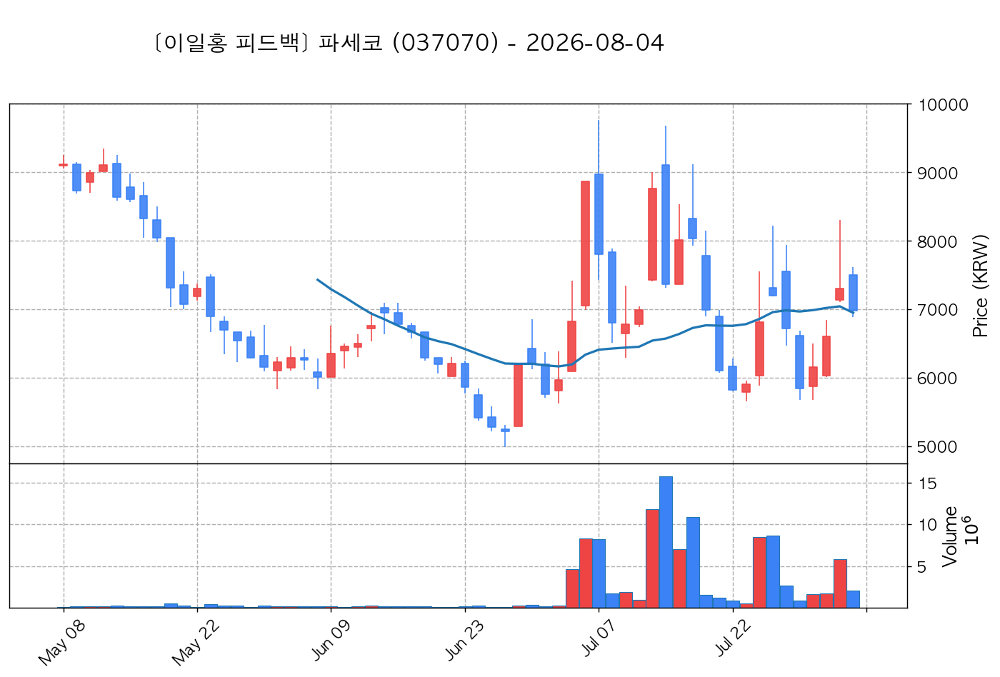

- **전일 종가(기준가)**: 7,300원 ➔ **매매일 시초가**: 7,500원 | **최고가**: 7,620원 (<b>+4.38%</b>) | **종가**: 6,980원 (-4.38%)
- **시세 움직임 복기**: 과거 2026-07-03 매집봉 ➔ 240일선 근접 지지 (+0.51%)

#### 2) 빛과전자 (069540) — 후보군 (1위) | ✅ 1차 목표 달성 (+13.2%)

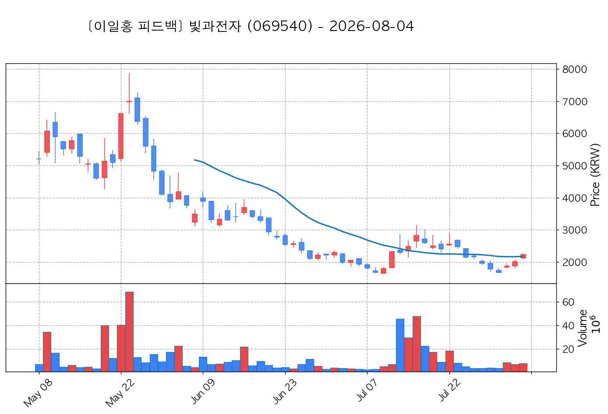

- **전일 종가(기준가)**: 2,005원 ➔ **매매일 시초가**: 2,120원 | **최고가**: 2,270원 (<b>+13.22%</b>) | **종가**: 2,225원 (+10.97%)
- **시세 움직임 복기**: 과거 2026-07-13 매집봉 ➔ 240일선 근접 지지 (-1.68%)

#### 3) 아이로보틱스 (066430) — 후보군 (2위) | ✅ 1차 목표 달성 (+5.0%)

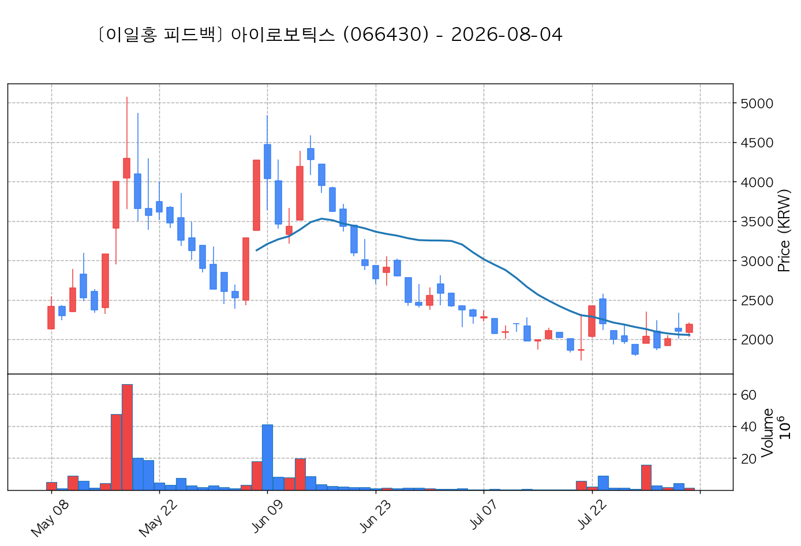

- **전일 종가(기준가)**: 2,105원 ➔ **매매일 시초가**: 2,085원 | **최고가**: 2,210원 (<b>+4.99%</b>) | **종가**: 2,190원 (+4.04%)
- **시세 움직임 복기**: 과거 2026-07-21 매집봉 ➔ 240일선 근접 지지 (+2.57%)

#### 4) 예스티 (122640) — 후보군 (3위) | ✅ 1차 목표 달성 (+3.9%)

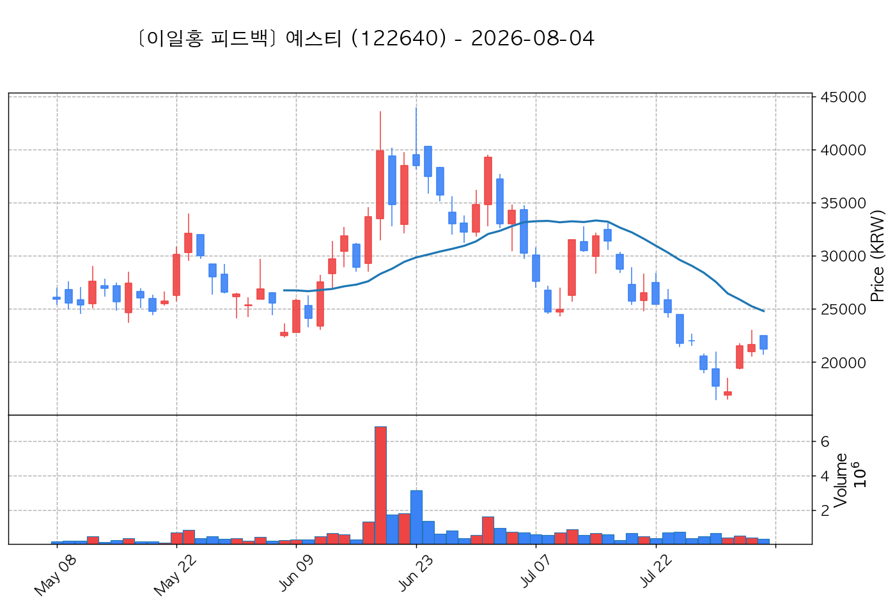

- **전일 종가(기준가)**: 21,650원 ➔ **매매일 시초가**: 22,500원 | **최고가**: 22,500원 (<b>+3.93%</b>) | **종가**: 21,200원 (-2.08%)
- **시세 움직임 복기**: 과거 2026-06-18 매집봉 ➔ 240일선 근접 지지 (-2.82%)

#### 5) 아진엑스텍 (059120) — 후보군 (4위) | ✅ 1차 목표 달성 (+3.8%)

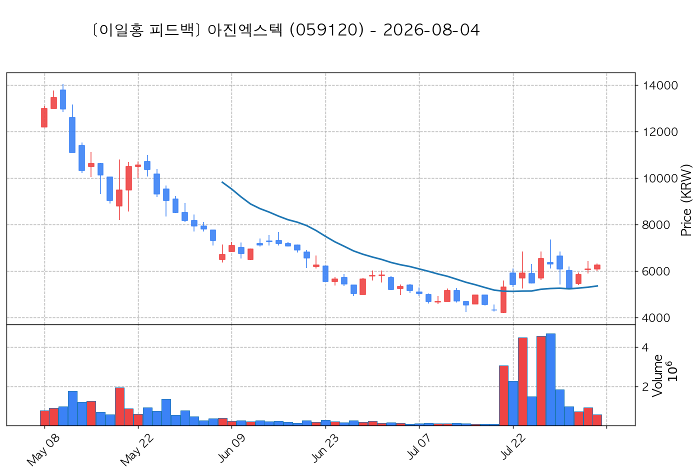

- **전일 종가(기준가)**: 6,090원 ➔ **매매일 시초가**: 6,090원 | **최고가**: 6,320원 (<b>+3.78%</b>) | **종가**: 6,250원 (+2.63%)
- **시세 움직임 복기**: 과거 2026-07-21 매집봉 ➔ 240일선 근접 지지 (+0.61%)

## 🟢 전략 3 — 수급 낙폭과대 바닥형 성과

#### 1) 코오롱티슈진 (950160) — ★ TOP 1 선택 | ✅ 1차 목표 달성 (+15.5%)

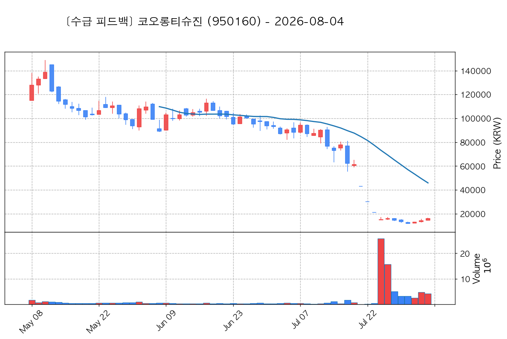

- **전일 종가(기준가)**: 14,290원 ➔ **매매일 시초가**: 14,360원 | **최고가**: 16,500원 (<b>+15.47%</b>) | **종가**: 15,920원 (+11.41%)
- **시세 움직임 복기**: 52주 고점 대비 (9.6%) ➔ 20일 메이저 수급 100억+ 유입 ➔ 없음 지지 안착

#### 2) GS건설 (006360) — ★ TOP 2 선택 | ✅ 1차 목표 달성 (+20.2%)

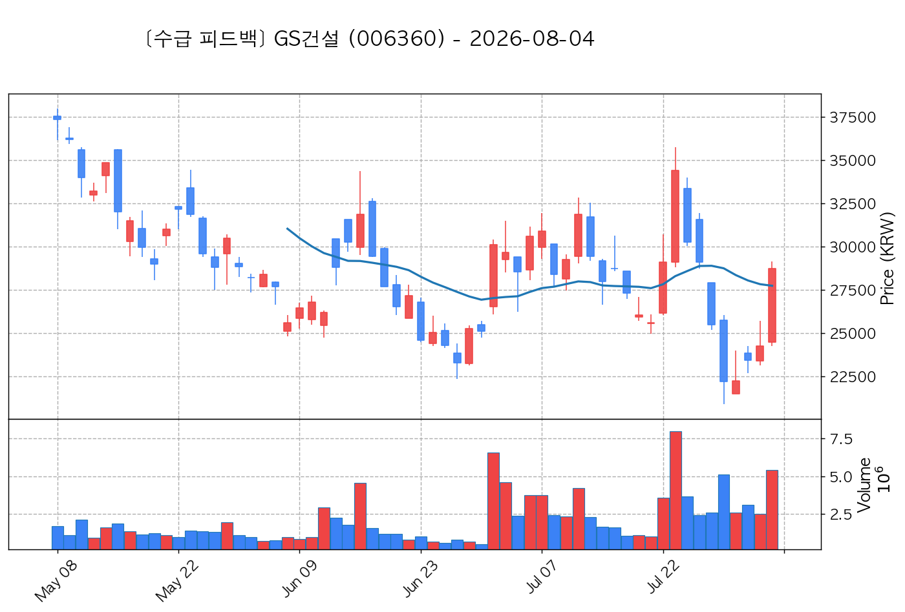

- **전일 종가(기준가)**: 24,250원 ➔ **매매일 시초가**: 24,500원 | **최고가**: 29,150원 (<b>+20.21%</b>) | **종가**: 28,750원 (+18.56%)
- **시세 움직임 복기**: 52주 고점 대비 (54.1%) ➔ 20일 메이저 수급 100억+ 유입 ➔ 240일선 지지 안착

#### 3) 한국항공우주 (047810) — 후보군 (1위) | ✅ 1차 목표 달성 (+12.8%)

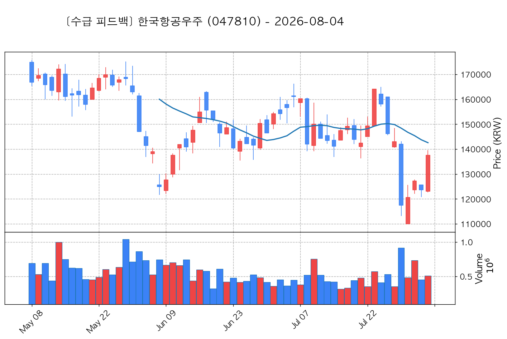

- **전일 종가(기준가)**: 123,700원 ➔ **매매일 시초가**: 123,100원 | **최고가**: 139,600원 (<b>+12.85%</b>) | **종가**: 137,500원 (+11.16%)
- **시세 움직임 복기**: 52주 고점 대비 (57.4%) ➔ 20일 메이저 수급 100억+ 유입 ➔ 없음 지지 안착

#### 4) 한화엔진 (082740) — 후보군 (2위) | ✅ 1차 목표 달성 (+8.3%)

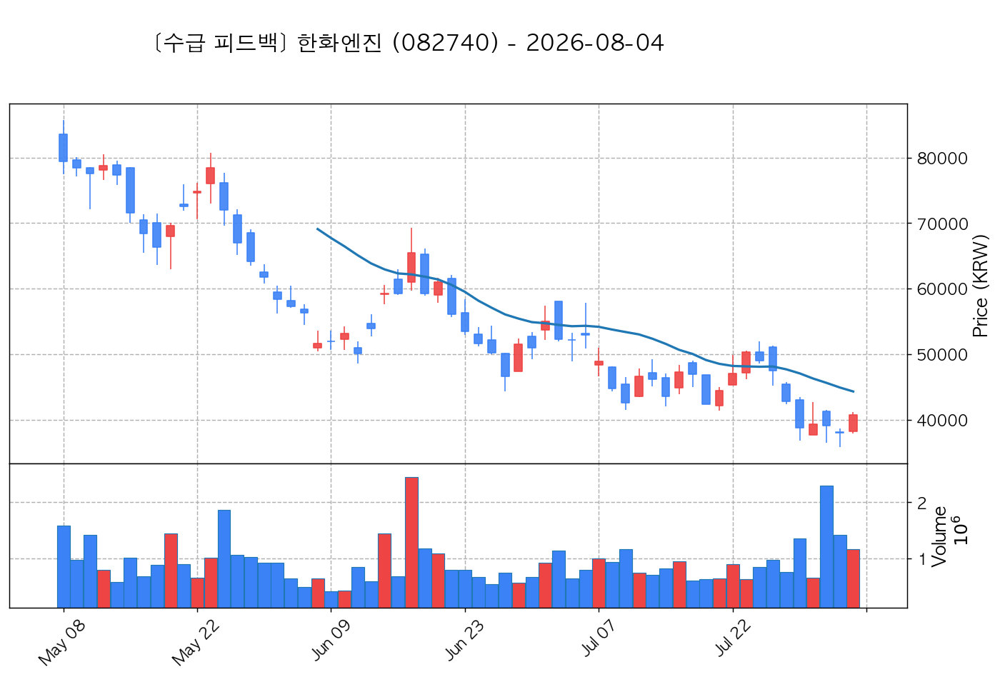

- **전일 종가(기준가)**: 38,000원 ➔ **매매일 시초가**: 38,200원 | **최고가**: 41,150원 (<b>+8.29%</b>) | **종가**: 40,750원 (+7.24%)
- **시세 움직임 복기**: 52주 고점 대비 (40.3%) ➔ 20일 메이저 수급 100억+ 유입 ➔ 없음 지지 안착

#### 5) 삼성중공업 (010140) — 후보군 (3위) | ✅ 1차 목표 달성 (+3.6%)

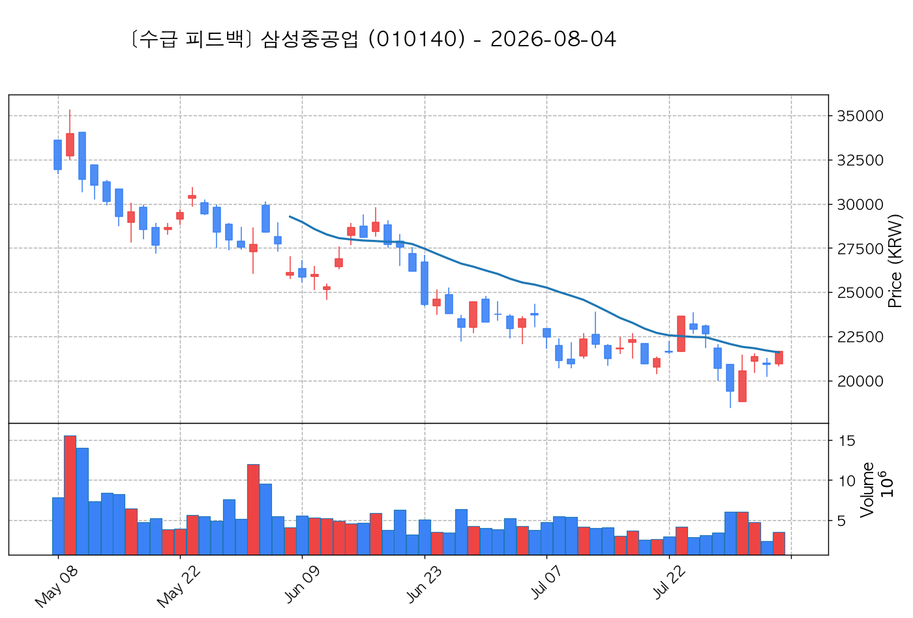

- **전일 종가(기준가)**: 20,900원 ➔ **매매일 시초가**: 20,950원 | **최고가**: 21,650원 (<b>+3.59%</b>) | **종가**: 21,650원 (+3.59%)
- **시세 움직임 복기**: 52주 고점 대비 (59.1%) ➔ 20일 메이저 수급 100억+ 유입 ➔ 없음 지지 안착

#### 6) BNK금융지주 (138930) — 후보군 (4위) | ⏱️ 지지선 유지 (+0.7%)

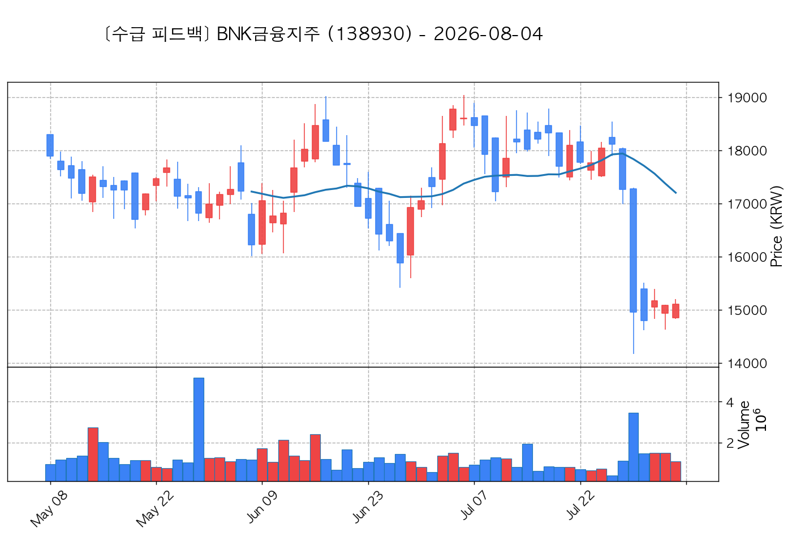

- **전일 종가(기준가)**: 15,090원 ➔ **매매일 시초가**: 14,850원 | **최고가**: 15,200원 (<b>+0.73%</b>) | **종가**: 15,110원 (+0.13%)
- **시세 움직임 복기**: 52주 고점 대비 (65.5%) ➔ 20일 메이저 수급 100억+ 유입 ➔ 60일선 지지 안착

