# 🔥 [당일 상한가/급등주 분석] 2026-08-05 시장 주도주 리포트

> 기준일: 2026-08-05 | [📈 매매전 스크리닝 보고서 보기](./2026-08-05_스크리닝.html)

---

## 🏆 1. 당일 상한가/하한가 달성 종목 (상위 5개)

#### 1) 마키나락스 (477850) — <b>+29.85%</b>

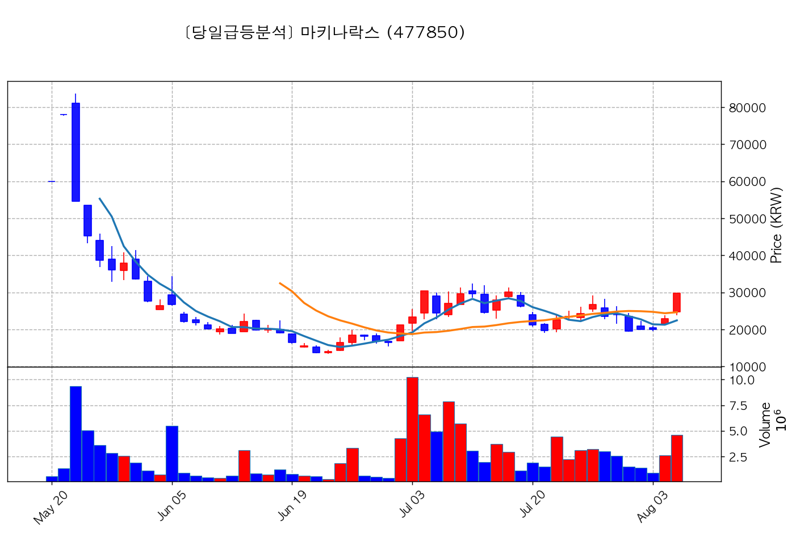

- **종가**: 29,800원 | **거래대금**: 1367.2억
- **🔥 당일 핵심 뉴스**: 🔗 [[특징주] 마키나락스, HD한국조선해양 용접 로봇 ‘피지컬AI’ 프로젝트 기대감에 상한가](https://news.google.com/rss/articles/CBMibEFVX3lxTFB3UXpkVm1XQmxfajJFU3pLbC1VR0FKc0JFN2prLTY4bTByTFVxbXVmT215YThjUlExampSOVE3cHZsUzVGRmhSNWlLNVZoMl9iZXpBTlhJZFB6WEFiR193bG1rdjUteFhvUzlYVA?oc=5)

#### 2) 빛과전자 (069540) — <b>+29.89%</b>

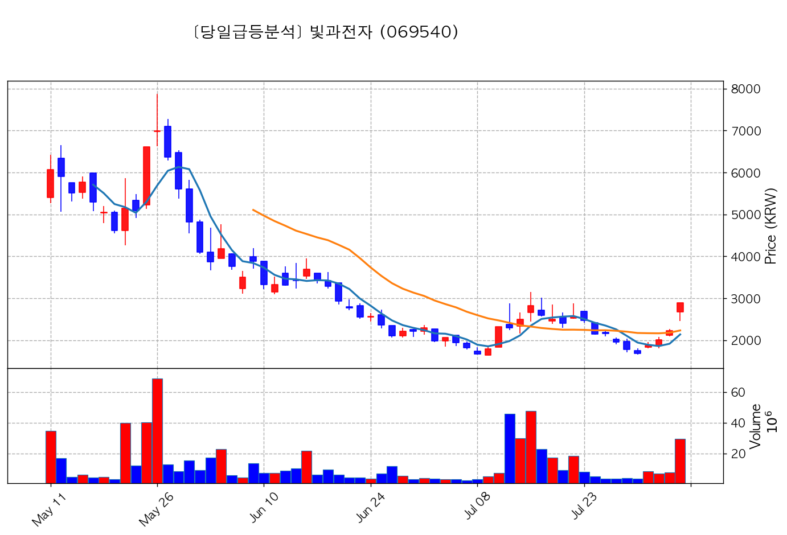

- **종가**: 2,890원 | **거래대금**: 846.4억
- **🔥 당일 핵심 뉴스**: 🔗 [특징주, 빛과전자-광통신(광케이블/광섬유 등) 테마 상승세에 6.76% ↑](https://news.google.com/rss/articles/CBMiUkFVX3lxTE8ycUdQTjFVbW9KQ0c2VzJwMFFUMHdpY2s2Um1DbEd4aHh5eXVPOWQxN1BITURsQmR2SEh3N3pvcm5BbnpXeWVGc0p5YzVaS1BoNUE?oc=5)
- **📜 과거 부각 이력**: `2026-08-04 피드백` 이력 있음, `2026-08-03 스크리닝` 이력 있음

#### 3) 이랜시스 (264850) — <b>+29.82%</b>

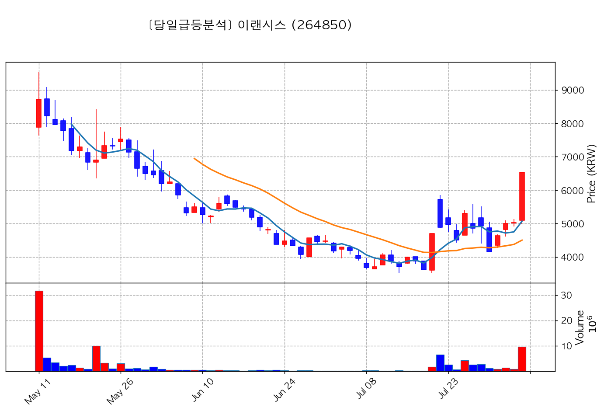

- **종가**: 6,530원 | **거래대금**: 627.7억
- **🔥 당일 핵심 뉴스**: 🔗 [특징주, 이랜시스-피지컬 AI/휴머노이드 로봇 테마 상승세에 20.17% ↑](https://news.google.com/rss/articles/CBMiUkFVX3lxTE54cFg3V3pkLUJDWUZkdWdPZGRSYmZSUTRUVWZ4bzhBRFduQXhfNlp1VDVRaDRNWnhqSUgyYVFPejMwZ0lLeDBmZFluV094aFFSNUE?oc=5)

#### 4) KBI메탈 (024840) — <b>+29.99%</b>

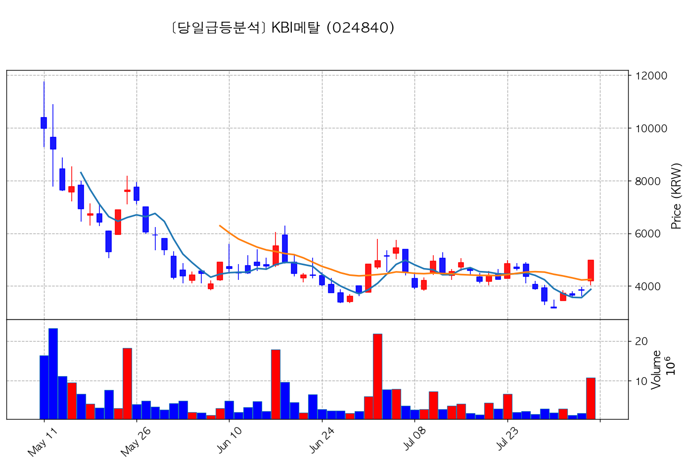

- **종가**: 4,985원 | **거래대금**: 536.8억
- **🔥 당일 핵심 뉴스**: 🔗 [특징주, KBI메탈-전선 테마 상승세에 8.9% ↑](https://news.google.com/rss/articles/CBMiUkFVX3lxTE55RTBXZWYwN0ZGSVRqS3dDblNzeWxiZk9saFI1V3BPM0NwdU81cG13YVJQSjJtQ1ZhYzZuUGFZMmJ4alA0UENZT1lVS25UdXpFY2c?oc=5)

#### 5) 져스텍 (153890) — <b>+29.62%</b>

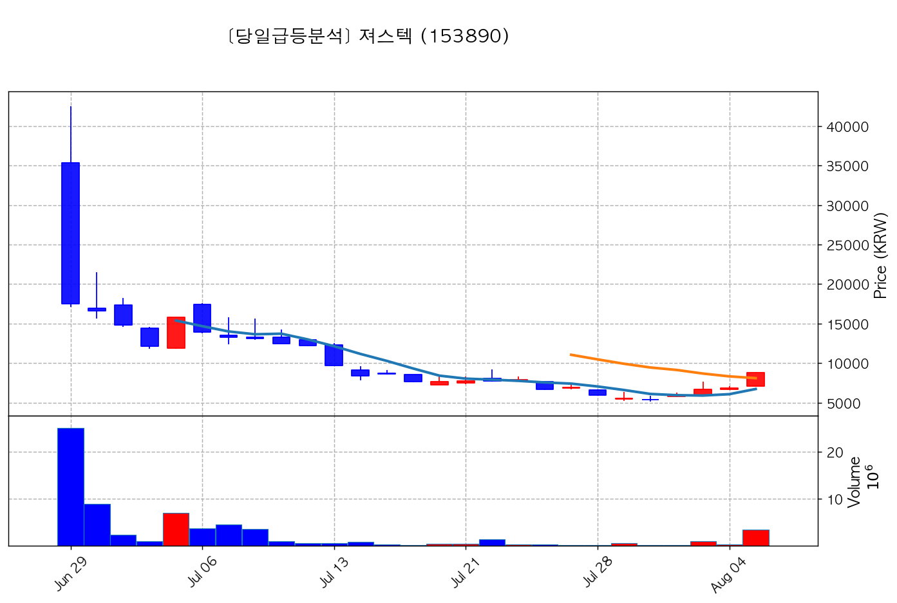

- **종가**: 8,840원 | **거래대금**: 303.8억
- **🔥 당일 핵심 뉴스**: 🔗 [최동수 대표이사, 져스텍 주식 3000주 ↑…지분율 0.81%](https://news.google.com/rss/articles/CBMic0FVX3lxTE11MnB5Z29MVzBBUzJpV3piSDFyMThFZk5ZMTNlc0liQ2JkWDEyVGJrQm9VeHM2ZmRjaGp3TmxoTU5fbFVNWFFkRHVHYlhLdEIxc2JiX1lnclUtWG5pZjNjQ0d1N0M2M0JiS2ZKV0lhMk45Y0E?oc=5)

---

## 🚀 2. 거래대금 150억+ & +15% 이상 폭등주 (상위 8개)

#### 1) 대한광통신 (010170) — <b>+18.17%</b>

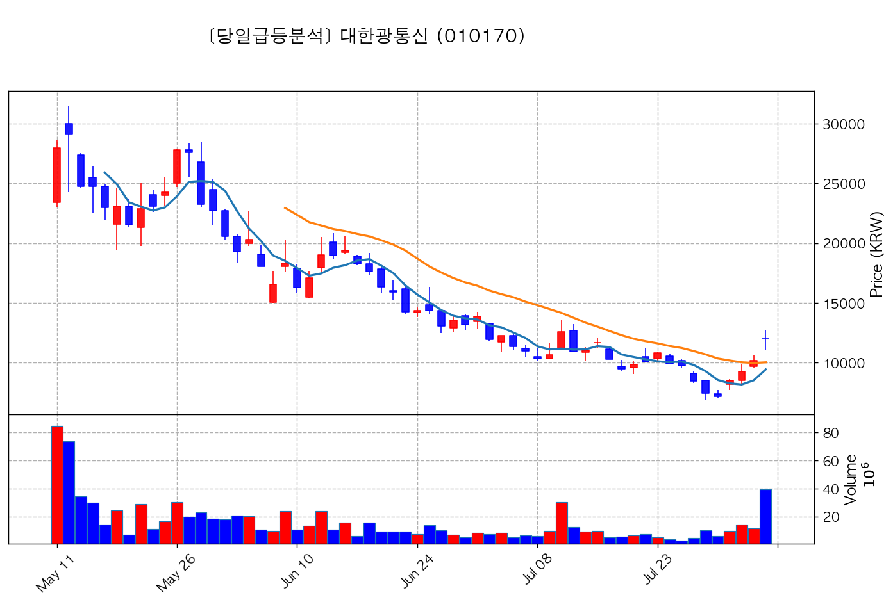

- **종가**: 12,030원 | **거래대금**: 4736.4억
- **🔥 당일 핵심 뉴스**: 🔗 [[특징주] 대한광통신, “트럼프 中 광통신부품 수입 금지”에 국내 광통신株 ‘일제히 강세’](https://news.google.com/rss/articles/CBMibEFVX3lxTE5JQzV1eDRNeXRYaldQWmJidzRVRlB4emFOZ3l5aHNBbXdJMmR4RGxqQlJFUTJiekVGUHYzcGhwalg4ZkJtenNqa3RFQ2FTWnlNM25IUUpQckE3Nmg1SVhqbkZfVUs2RUUwTUdhQQ?oc=5)

#### 2) 코오롱티슈진 (950160) — <b>+19.66%</b>

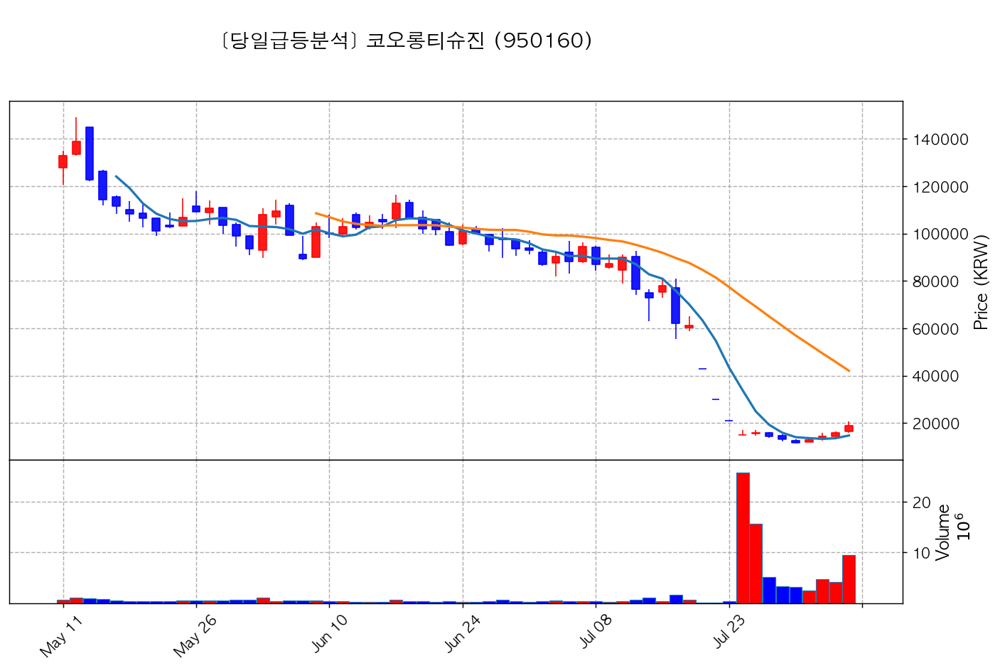

- **종가**: 19,050원 | **거래대금**: 1815.6억
- **🔥 당일 핵심 뉴스**: 🔗 [[특징주] 코오롱티슈진, 관절염 치료제 美 3상 유효성 입증 실패에 사흘 연속 ‘하한가’ - 조선비즈](https://news.google.com/rss/articles/CBMiiAFBVV95cUxQT3VWOGswc25vR284UV9MUDRkRVdRZGkwYXZVOFlpd3lOOWhvTHB5TzBrcmFoZHhfTC0zTXRJMFhHTUlRMUpqMUxSWEFlRGI5VHl0Tm1kd0tCWEYyTnhkVXlJaEdVYTdQY3Nhdkk0Wm5CSWZNWUpvdzNFa3pHeVF5TV9hbkduUWNP0gGcAUFVX3lxTE9MOS1ybmktcEFIYTlGMkdjdWFxT3czRlpVTjBuRVVQYUJfVGp5SXIzcXN5WTRHNWNWTTdSM3BkMVdZcDZMWVNXMDVhVVBpaFRZaWVZMnJSWVJxRG05Z2ZwUXNlcFJsSEdudERobWJmVDNCcVQyeW12OWtaR1dYdkthU3FQYXpaV3Raamw2VUZ3TDRhcWZqTkVfY0JFWA?oc=5)
- **📜 과거 부각 이력**: `2026-08-04 피드백` 이력 있음, `2026-08-03 스크리닝` 이력 있음

#### 3) 광전자 (017900) — <b>+21.99%</b>

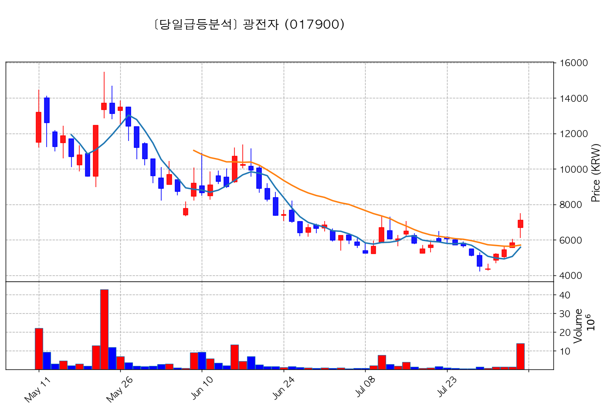

- **종가**: 7,100원 | **거래대금**: 996.4억
- **🔥 당일 핵심 뉴스**: 🔗 [특징주, 광전자-마이크로 LED 테마 상승세에 5.71% ↑](https://news.google.com/rss/articles/CBMiUkFVX3lxTE1INWpJMzdUN0lqMWhnUTNyMGN5NHdVQXhIbjA2V3dOWWtpazhiNGFzNjhqVjlmSmI2ci14bk16Uk92b1ZSTzZlV1VDRjh4RDUzcFE?oc=5)

#### 4) 두산퓨얼셀 (336260) — <b>+23.25%</b>

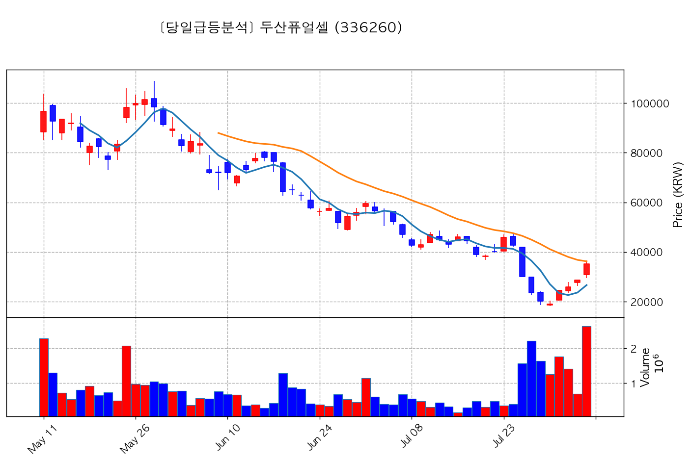

- **종가**: 35,250원 | **거래대금**: 926.3억
- **🔥 당일 핵심 뉴스**: 🔗 [[특징주] 두산퓨얼셀, 수주 지연·품질 이슈에 23%대 급락](https://news.google.com/rss/articles/CBMiakFVX3lxTE14RTFoWWpsUjhWTzExcEN5ZmZEQVltUS1yelRkQzR1Q0hIOFREb29tbmIwb1pRQWIycGdQdzFQbWVsY2V4bWg5YUtzZmJrR2REdkI1WWpWVmhDaG5XLXJaMFpFdnlZSFNscHfSAW5BVV95cUxNbU55dG9ubVdnMTJXdS1WSy1ITmE0V0owZnhhNWJhSWtUVXQ0aXdLck1taGhON2Y2OGFfSUhVMkNkUHgzYUEzNFk2S1lUb2JDRGFTM2ZGNGtUTzB3dU4tang2MmwxWHVQUWNzTFRIUQ?oc=5)

#### 5) 기가레인 (049080) — <b>+19.84%</b>

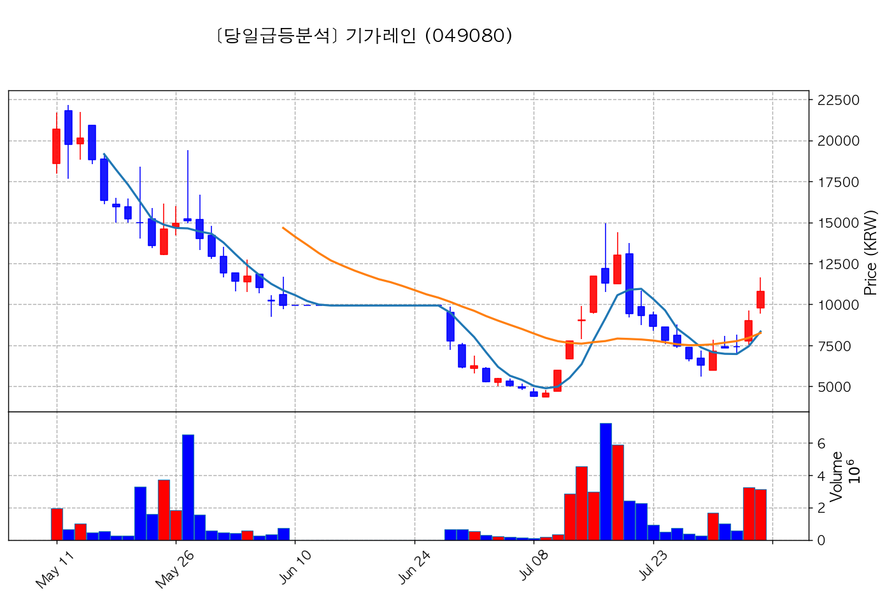

- **종가**: 10,810원 | **거래대금**: 337.6억
- **🔥 당일 핵심 뉴스**: 🔗 [[특징주] 기가레인, 우주 핵심부품 국산화 본격 착수.. '급등'](https://news.google.com/rss/articles/CBMiiAFBVV95cUxNaTFaVG1OUFNjZ1RqcU1zd2c1QjQ0U09Pc0xoYU95RENudFNGQmlHUlFtWG5hNFpBV1laZ2l5YllJaXZOSHZDSWYyRFlDS1dZN09BZDg1VDUzQ3JjQlJNNzhyYmFBMllHMUVsVzlSYjEyVkk3dnJJOU9oSVVHSHZ6Zmk0ZDBaNzNY?oc=5)

#### 6) 풍산 (103140) — <b>+15.04%</b>

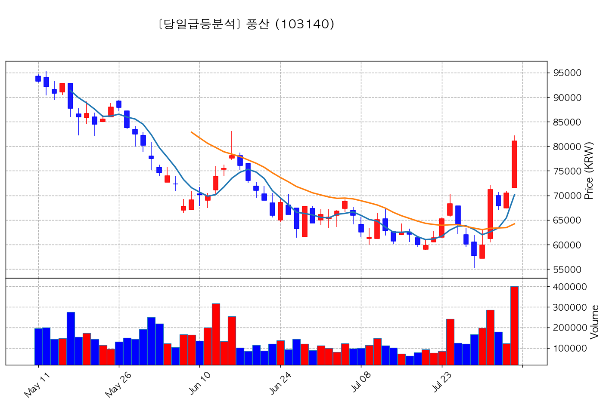

- **종가**: 81,100원 | **거래대금**: 324.7억
- **🔥 당일 핵심 뉴스**: 🔗 [특징주, 풍산홀딩스-방위산업 테마 상승세에 0.42% ↑](https://news.google.com/rss/articles/CBMiUkFVX3lxTE5ZR09BbEQ0RjF0Nlp1Z083Sm5PaHg0TUlqM2xOMlNnc0hyTDd2VU1mQW40clJfQVphX0tiaElubnd2dGJrNDBpejBPc3ZoNkhXNnc?oc=5)

#### 7) 코리아써키트 (007810) — <b>+16.18%</b>

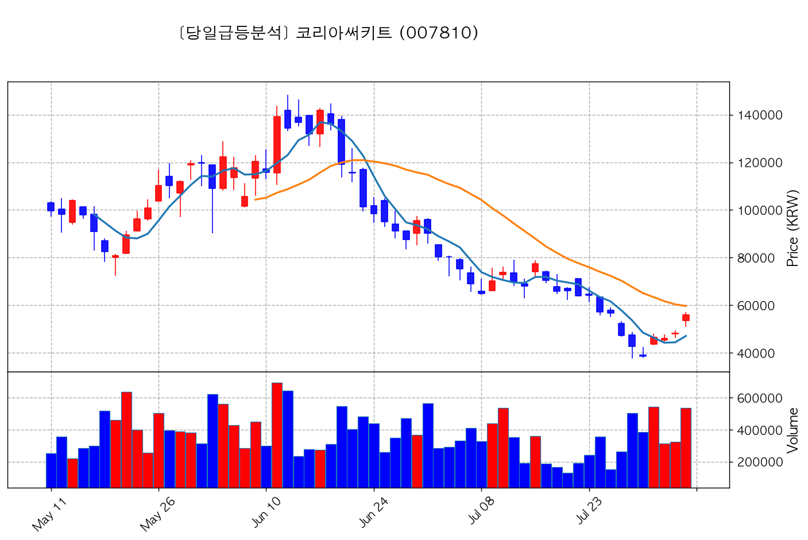

- **종가**: 56,000원 | **거래대금**: 300.7억
- **🔥 당일 핵심 뉴스**: 🔗 [특징주, 코리아써키트-소캠(SOCAMM) 테마 상승세에 3.41% ↑](https://news.google.com/rss/articles/CBMiUkFVX3lxTE5Hc2psblU0bVYyT29PSUhaMjZuRGhnUTVPb3QweDVTSWFHWXJ3cFVpY3VpeHppOEhwenp0ZHRvY1NqWk1rblVlUHhyWG5LdlNZS2c?oc=5)

#### 8) 세명전기 (017510) — <b>+15.42%</b>

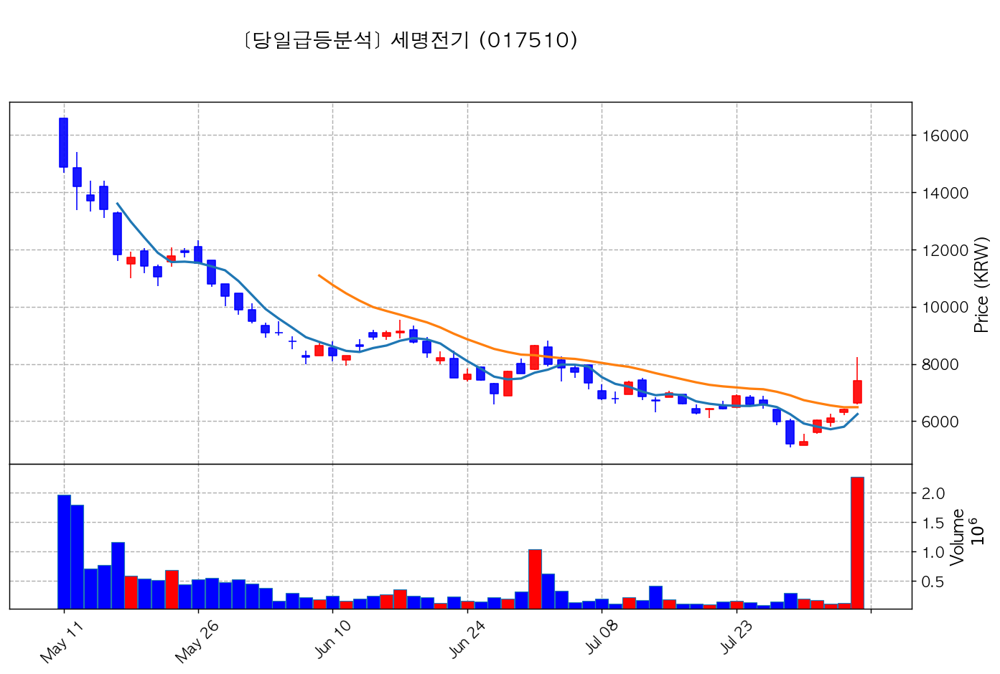

- **종가**: 7,410원 | **거래대금**: 168.4억
- **🔥 당일 핵심 뉴스**: 🔗 [특징주, 세명전기-전력설비 테마 상승세에 2.65% ↑](https://news.google.com/rss/articles/CBMiUkFVX3lxTE1HR3l2QkdVNXpFU1lpYmRnRDU1dDQ0dDAwMXVndXFJaHFpMmdCNHRqT0NKR2Z3SFA4YzFQMnptREtDYXVqcWtwdFV4UjZRTmE2Q0E?oc=5)

