# 📈 [실전플랜 1] 2026-08-05 매매 후보 스크리닝 보고서

> 스크리닝 기준일: 2026-08-05 | [📊 익일 매매 성과 피드백 보고서 보기](./2026-08-05_피드백.html)

---

## 📊 1. 스크리닝 성과 요약

| 전략 | 주요 기법 | 종목수(TOP) |
| :--- | :--- | :---: |
| **전략 1** | 양음양 눌림목 & 사윗감 | 36개 (TOP 3개) |
| **전략 2** | 매집봉 & 이일홍 | 6개 (TOP 1개) |
| **전략 3** | 수급 & 핥 | 0개 (TOP 0개) |
| **합계** | **3대 핵심 전략 통합** | **42개 (TOP 4개)** |

---

## 🔵 3. 전략 1 — 양-음-양 눌림목 (3% × 3슬롯)

### 📋 전략 1 요약표 (상위 10개)

| 종목명 | 기준일종가 | 기준봉 | 지지선 | 비고 및 선정 상태 |
| :--- | ---: | :--- | :---: | :--- |
| **SK하이닉스** (000660) | 1,693,000원 | 상한가 | 13일선 | **★ TOP 1 선택** (사윗감) |
| **삼성전자** (005930) | 248,000원 | +26.8% 장대양봉 | 13일선 | **★ TOP 2 선택** |
| **SK스퀘어** (402340) | 1,129,000원 | 상한가 | 20일선 | **★ TOP 3 선택** |
| **한미반도체** (042700) | 209,500원 | +28.0% 장대양봉 | 20일선 | 후보군 (1위) |
| **삼성물산** (028260) | 347,500원 | +19.6% 장대양봉 | 20일선 | 후보군 (2위) |
| **주성엔지니어링** (036930) | 143,400원 | +26.7% 장대양봉 | 13일선 | 후보군 (3위) |
| **LG이노텍** (011070) | 602,000원 | +21.2% 장대양봉 | 20일선 | 후보군 (4위) |
| **SK** (034730) | 564,000원 | +18.9% 장대양봉 | 13일선 | 후보군 (5위) |
| **원익IPS** (240810) | 97,800원 | +27.9% 장대양봉 | 3일선 | 후보군 (6위) |
| **삼성생명** (032830) | 293,500원 | +18.0% 장대양봉 | 13일선 | 후보군 (7위) |

---

### 🔍 전략 1 상세 분석

#### 1) SK하이닉스 (000660) — ★ TOP 1 선택 (사윗감)

- **기준 종가**: 1,693,000원 | **거래대금**: 55131억
- **분석 사유**: 과거 2026-07-31 기준봉 후 현재 13일선 지지

#### 2) 삼성전자 (005930) — ★ TOP 2 선택

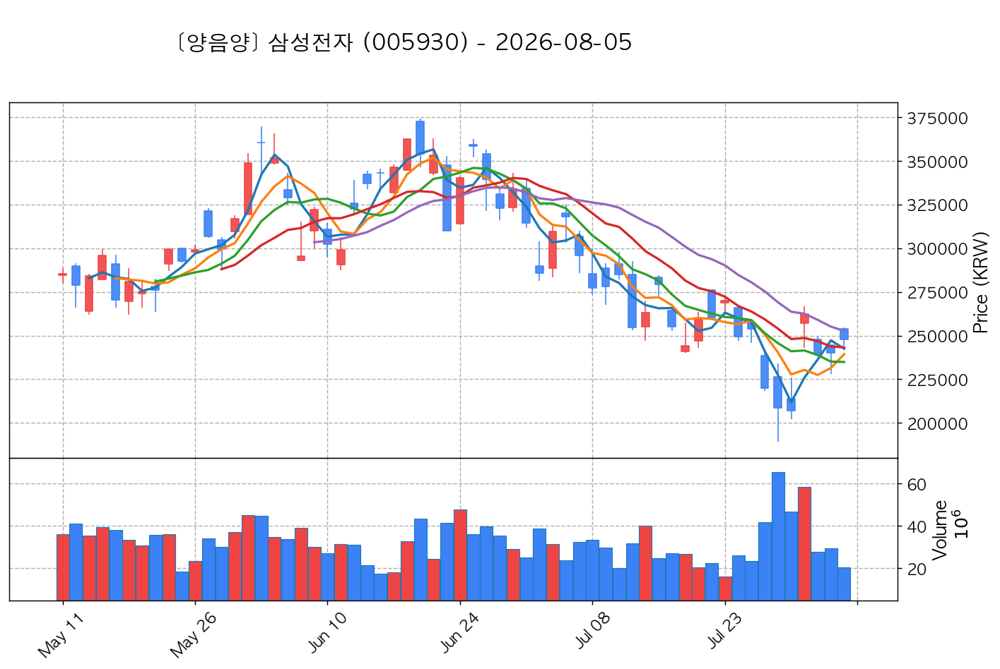

- **기준 종가**: 248,000원 | **거래대금**: 50297억
- **분석 사유**: 과거 2026-07-31 기준봉 후 현재 13일선 지지

#### 3) SK스퀘어 (402340) — ★ TOP 3 선택

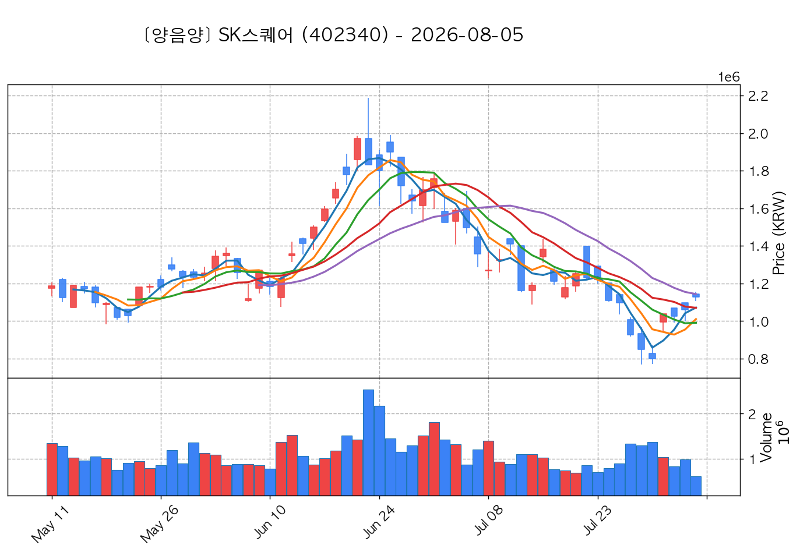

- **기준 종가**: 1,129,000원 | **거래대금**: 6896억
- **분석 사유**: 과거 2026-07-31 기준봉 후 현재 20일선 지지

#### 4) 한미반도체 (042700) — 후보군 (1위)

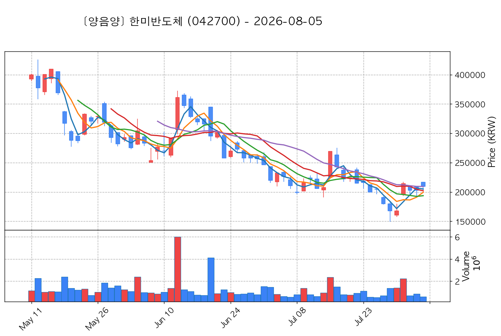

- **기준 종가**: 209,500원 | **거래대금**: 1233억
- **분석 사유**: 과거 2026-07-31 기준봉 후 현재 20일선 지지

#### 5) 삼성물산 (028260) — 후보군 (2위)

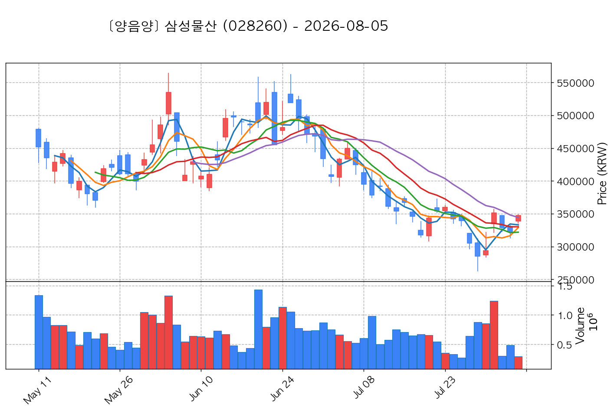

- **기준 종가**: 347,500원 | **거래대금**: 1027억
- **분석 사유**: 과거 2026-07-31 기준봉 후 현재 20일선 지지

#### 6) 주성엔지니어링 (036930) — 후보군 (3위)

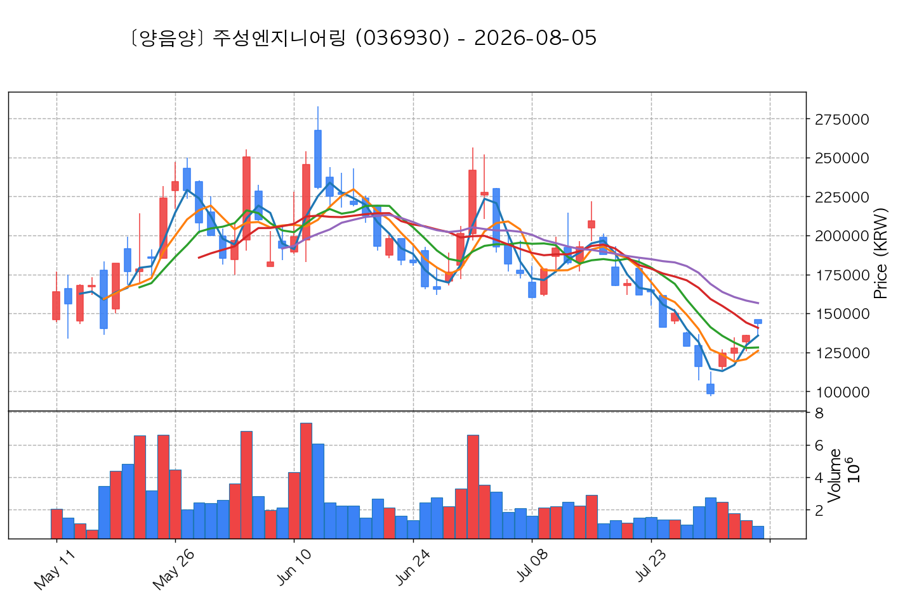

- **기준 종가**: 143,400원 | **거래대금**: 1431억
- **분석 사유**: 과거 2026-07-31 기준봉 후 현재 13일선 지지

#### 7) LG이노텍 (011070) — 후보군 (4위)

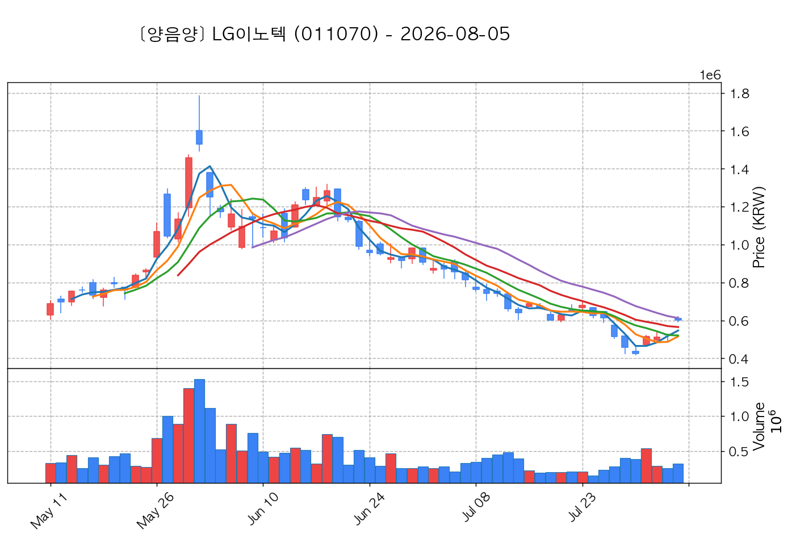

- **기준 종가**: 602,000원 | **거래대금**: 1926억
- **분석 사유**: 과거 2026-07-31 기준봉 후 현재 20일선 지지

#### 8) SK (034730) — 후보군 (5위)

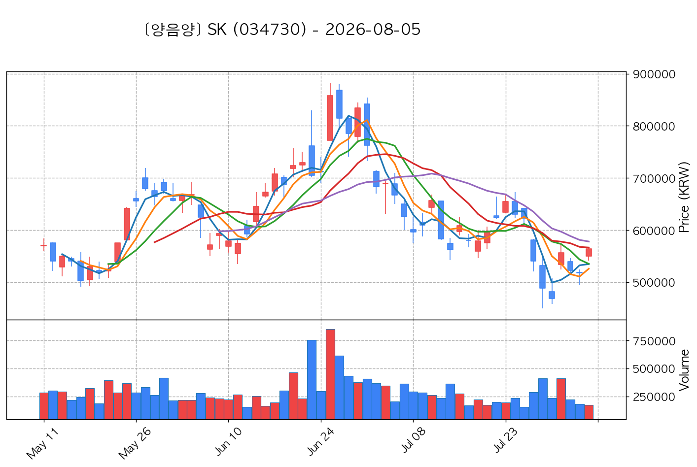

- **기준 종가**: 564,000원 | **거래대금**: 977억
- **분석 사유**: 과거 2026-07-31 기준봉 후 현재 13일선 지지

#### 9) 원익IPS (240810) — 후보군 (6위)

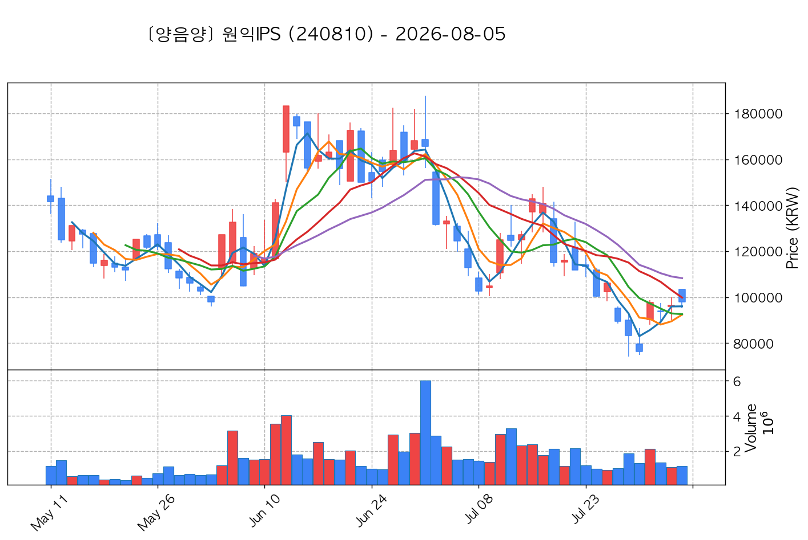

- **기준 종가**: 97,800원 | **거래대금**: 1142억
- **분석 사유**: 과거 2026-07-31 기준봉 후 현재 3일선 지지

#### 10) 삼성생명 (032830) — 후보군 (7위)

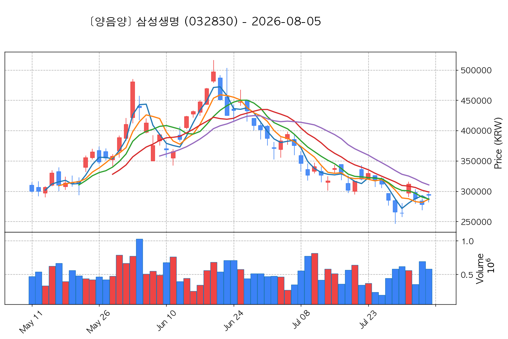

- **기준 종가**: 293,500원 | **거래대금**: 1710억
- **분석 사유**: 과거 2026-07-31 기준봉 후 현재 13일선 지지

## 🟡 4. 전략 2 — 일일봉 매집봉 (10% × 1슬롯)

### 📋 전략 2 요약표 (상위 6개)

| 종목명 | 기준일종가 | 기준봉 | 지지선 | 비고 및 선정 상태 |
| :--- | ---: | :--- | :---: | :--- |
| **HL만도** (204320) | 50,700원 | 과거 2026-06-15 매집봉 ➔ 240일선 근접 지지 (+2.61%) | 240일선 | **★ TOP 1 선택** |
| **예스티** (122640) | 22,600원 | 과거 2026-06-18 매집봉 ➔ 240일선 근접 지지 (+1.30%) | 240일선 | 후보군 (1위) |
| **파세코** (037070) | 7,130원 | 과거 2026-07-03 매집봉 ➔ 240일선 근접 지지 (-1.92%) | 240일선 | 후보군 (2위) |
| **OCI** (456040) | 77,400원 | 과거 2026-07-23 매집봉 ➔ 240일선 근접 지지 (-2.78%) | 240일선 | 후보군 (3위) |
| **다스코** (058730) | 3,220원 | 과거 2026-06-10 매집봉 ➔ 240일선 근접 지지 (-2.20%) | 240일선 | 후보군 (4위) |
| **퍼스텍** (010820) | 6,200원 | 과거 2026-06-16 매집봉 ➔ 240일선 근접 지지 (-2.20%) | 240일선 | 후보군 (5위) |

---

### 🔍 전략 2 상세 분석

#### 1) HL만도 (204320) — ★ TOP 1 선택

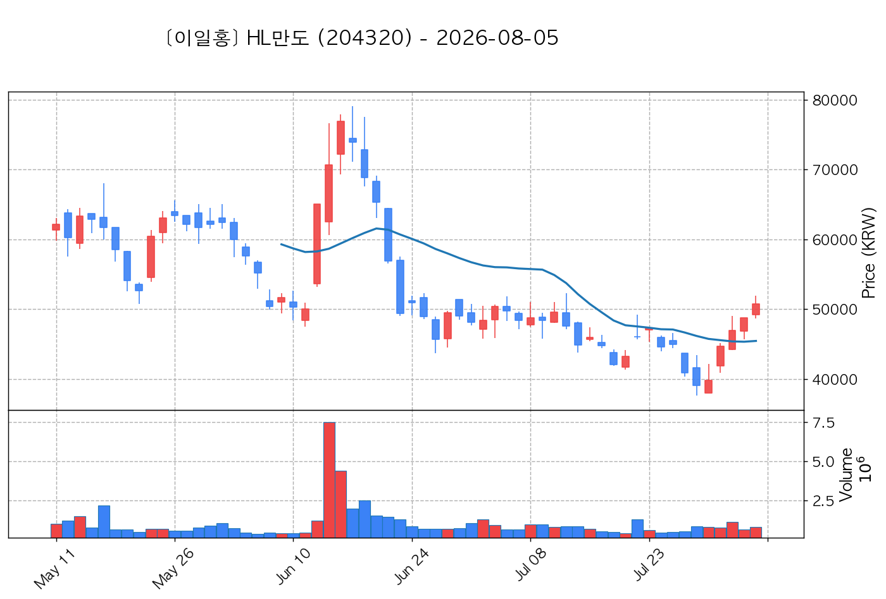

- **기준 종가**: 50,700원 | **거래대금**: 398억
- **분석 사유**: 과거 2026-06-15 매집봉 ➔ 240일선 근접 지지 (+2.61%)

#### 2) 예스티 (122640) — 후보군 (1위)

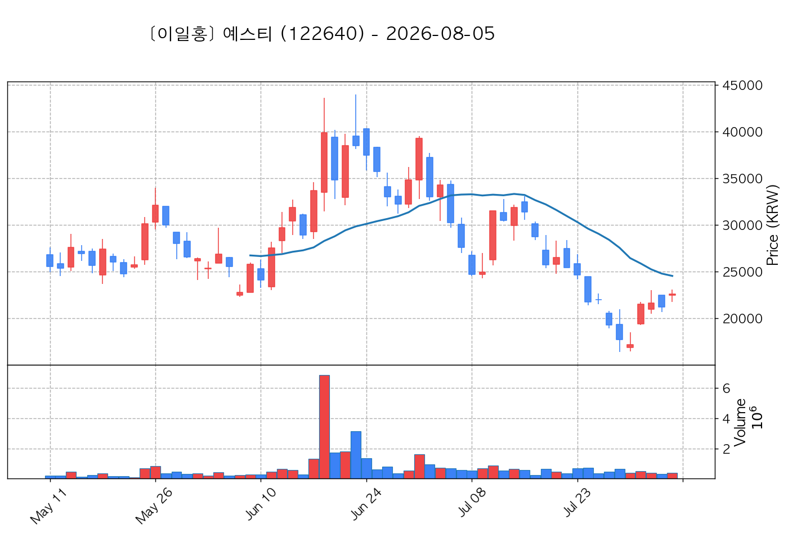

- **기준 종가**: 22,600원 | **거래대금**: 88억
- **분석 사유**: 과거 2026-06-18 매집봉 ➔ 240일선 근접 지지 (+1.30%)

#### 3) 파세코 (037070) — 후보군 (2위)

- **기준 종가**: 7,130원 | **거래대금**: 56억
- **분석 사유**: 과거 2026-07-03 매집봉 ➔ 240일선 근접 지지 (-1.92%)

#### 4) OCI (456040) — 후보군 (3위)

- **기준 종가**: 77,400원 | **거래대금**: 44억
- **분석 사유**: 과거 2026-07-23 매집봉 ➔ 240일선 근접 지지 (-2.78%)

#### 5) 다스코 (058730) — 후보군 (4위)

- **기준 종가**: 3,220원 | **거래대금**: 42억
- **분석 사유**: 과거 2026-06-10 매집봉 ➔ 240일선 근접 지지 (-2.20%)

#### 6) 퍼스텍 (010820) — 후보군 (5위)

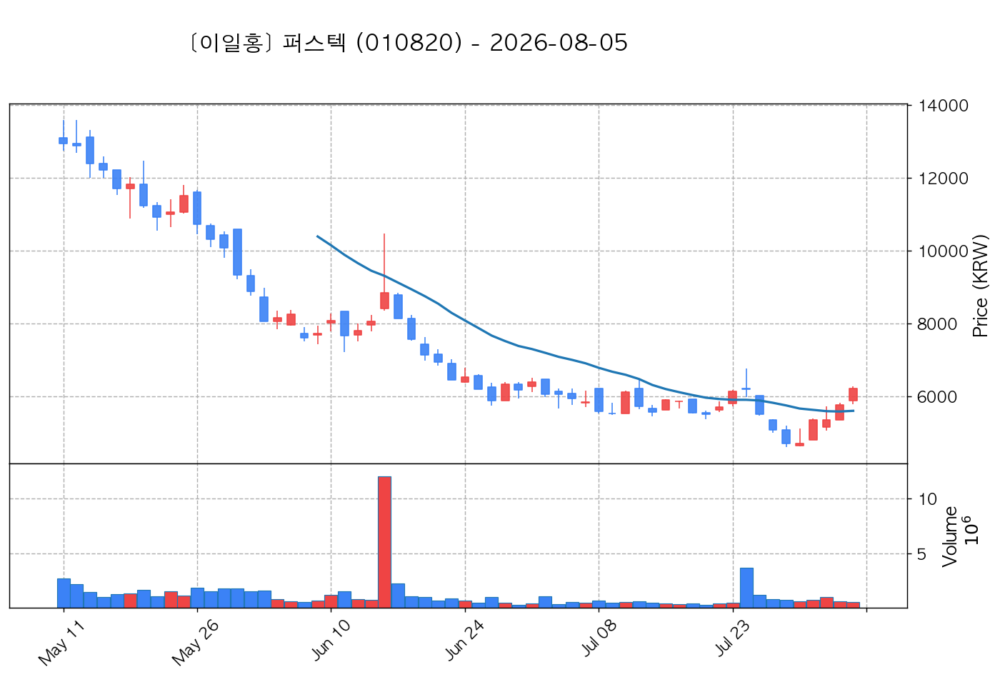

- **기준 종가**: 6,200원 | **거래대금**: 38억
- **분석 사유**: 과거 2026-06-16 매집봉 ➔ 240일선 근접 지지 (-2.20%)

## 🟢 5. 전략 3 — 수급 낙폭과대 바닥형 (10% × 2슬롯)

해당 전략 포착 종목 없음

