# 📊 [실전플랜 1 피드백] 2026-08-05 매매 성과 추적 보고서

> 스크리닝 포착일: 2026-08-04 (종가) | 실제 매매(추적일): 2026-08-05 (매매일) | [📈 매매전 스크리닝 보고서 보기](./2026-08-04_스크리닝.html)

---

## 📊 1. 당일 매매 성과 요약
- **포착 및 검증 종목 수**: 총 42개 종목

---

## 🔵 전략 1 — 양-음-양 눌림목 성과

#### 1) SK하이닉스 (000660) — ★ TOP 1 선택 | ✅ 1차 목표 달성 (+7.9%)

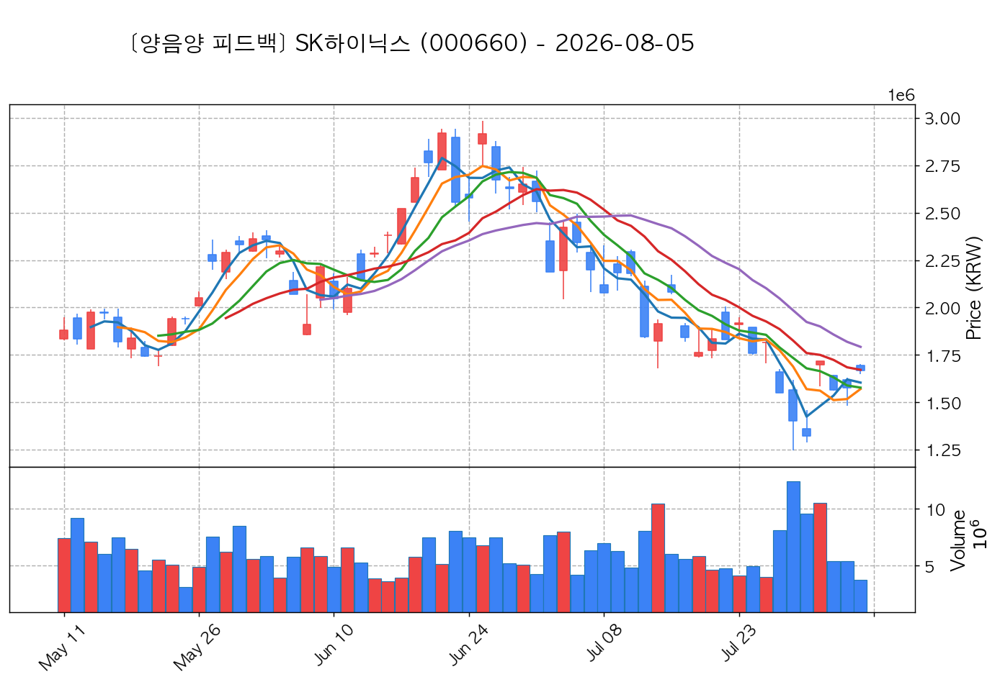

- **전일 종가(기준가)**: 1,577,000원 ➔ **매매일 시초가**: 1,693,000원 | **최고가**: 1,701,000원 (<b>+7.86%</b>) | **종가**: 1,668,000원 (+5.77%)
- **시세 움직임 복기**: 과거 2026-07-31 기준봉 후 현재 3일선 지지

#### 2) 삼성전자 (005930) — ★ TOP 2 선택 | ✅ 1차 목표 달성 (+6.0%)

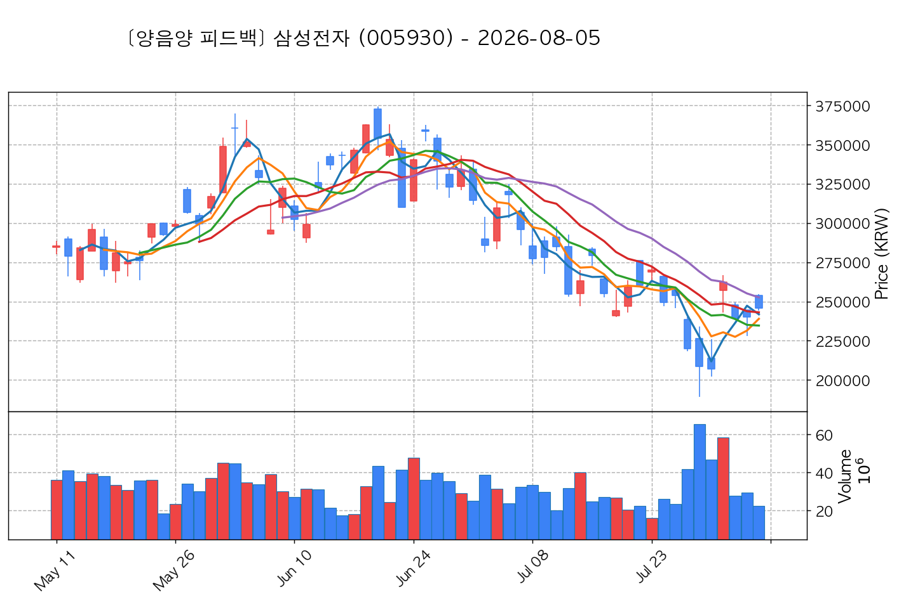

- **전일 종가(기준가)**: 240,000원 ➔ **매매일 시초가**: 254,000원 | **최고가**: 254,500원 (<b>+6.04%</b>) | **종가**: 246,000원 (+2.50%)
- **시세 움직임 복기**: 과거 2026-07-31 기준봉 후 현재 3일선 지지

#### 3) 제주반도체 (080220) — ★ TOP 3 선택 | ✅ 1차 목표 달성 (+10.0%)

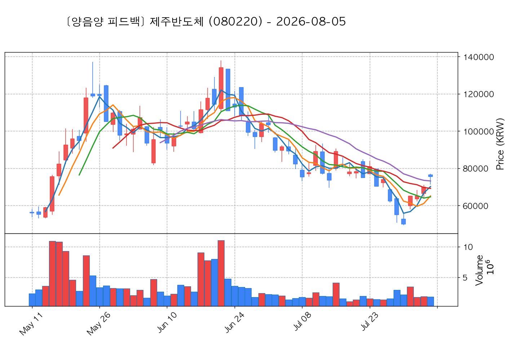

- **전일 종가(기준가)**: 70,000원 ➔ **매매일 시초가**: 76,500원 | **최고가**: 77,000원 (<b>+10.00%</b>) | **종가**: 75,500원 (+7.86%)
- **시세 움직임 복기**: 과거 2026-07-31 기준봉 후 현재 13일선 지지

#### 4) 심텍 (222800) — 후보군 (1위) | ✅ 1차 목표 달성 (+6.8%)

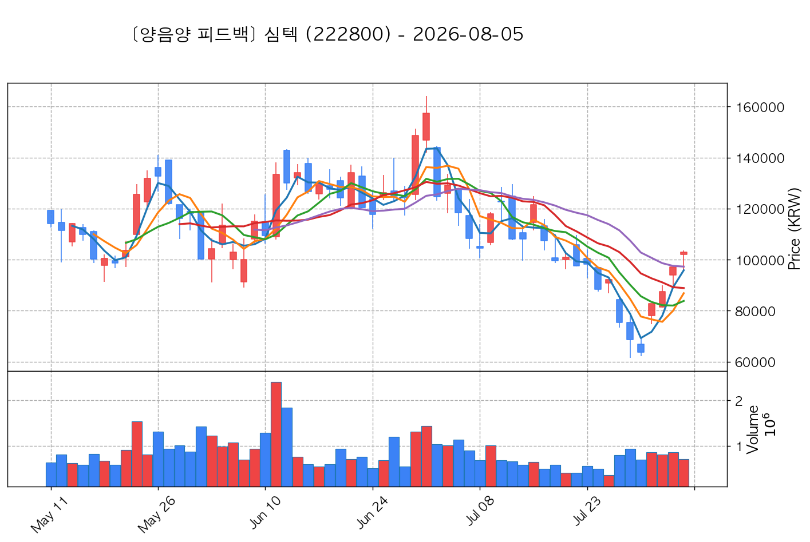

- **전일 종가(기준가)**: 97,100원 ➔ **매매일 시초가**: 102,100원 | **최고가**: 103,700원 (<b>+6.80%</b>) | **종가**: 103,000원 (+6.08%)
- **시세 움직임 복기**: 과거 2026-07-31 기준봉 후 현재 20일선 지지

#### 5) SK스퀘어 (402340) — 후보군 (2위) | ✅ 1차 목표 달성 (+9.2%)

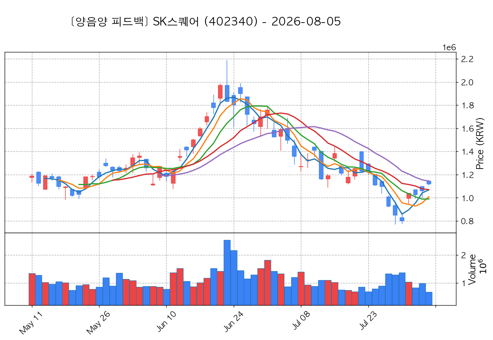

- **전일 종가(기준가)**: 1,060,000원 ➔ **매매일 시초가**: 1,143,000원 | **최고가**: 1,157,000원 (<b>+9.15%</b>) | **종가**: 1,119,000원 (+5.57%)
- **시세 움직임 복기**: 과거 2026-07-31 기준봉 후 현재 3일선 지지

#### 6) 삼성전기 (009150) — 후보군 (3위) | ✅ 1차 목표 달성 (+15.6%)

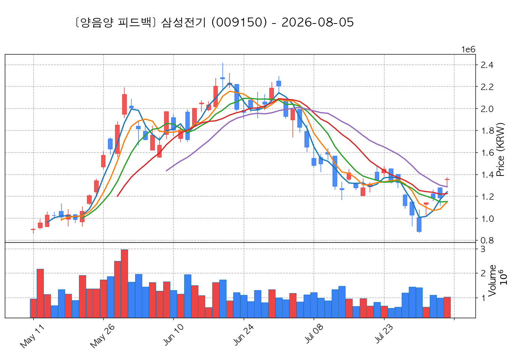

- **전일 종가(기준가)**: 1,185,000원 ➔ **매매일 시초가**: 1,351,000원 | **최고가**: 1,370,000원 (<b>+15.61%</b>) | **종가**: 1,356,000원 (+14.43%)
- **시세 움직임 복기**: 과거 2026-07-31 기준봉 후 현재 3일선 지지

#### 7) HPSP (403870) — 후보군 (4위) | ✅ 1차 목표 달성 (+5.8%)

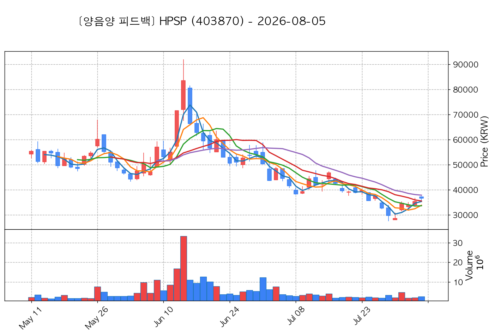

- **전일 종가(기준가)**: 35,400원 ➔ **매매일 시초가**: 37,150원 | **최고가**: 37,450원 (<b>+5.79%</b>) | **종가**: 36,600원 (+3.39%)
- **시세 움직임 복기**: 과거 2026-07-31 기준봉 후 현재 13일선 지지

#### 8) 삼성물산 (028260) — 후보군 (5위) | ✅ 1차 목표 달성 (+8.5%)

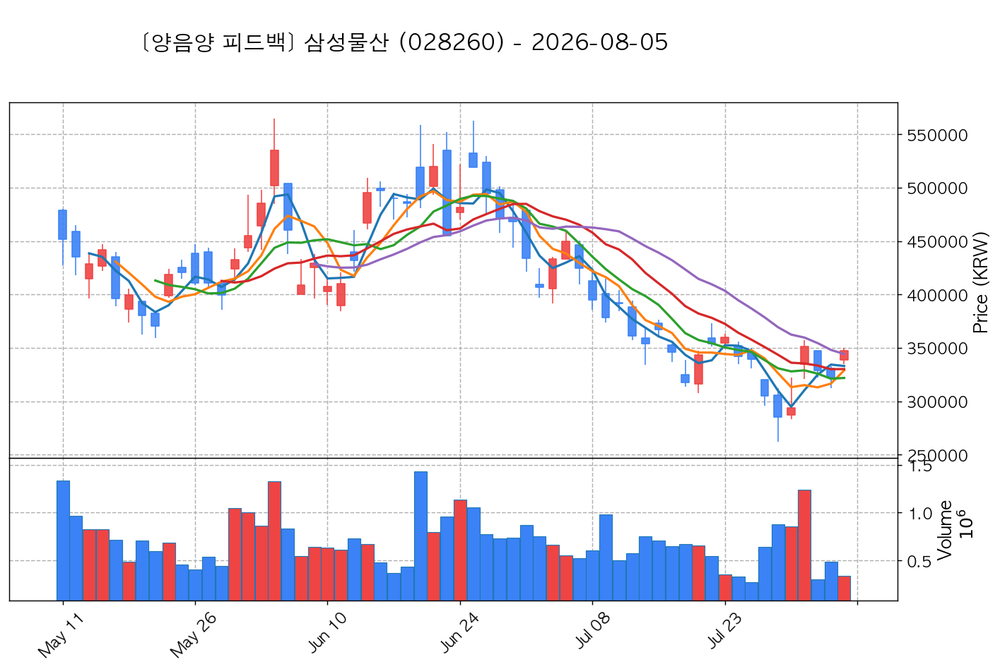

- **전일 종가(기준가)**: 322,500원 ➔ **매매일 시초가**: 338,500원 | **최고가**: 350,000원 (<b>+8.53%</b>) | **종가**: 347,500원 (+7.75%)
- **시세 움직임 복기**: 과거 2026-07-31 기준봉 후 현재 5일선 지지

#### 9) 이수페타시스 (007660) — 후보군 (6위) | ✅ 1차 목표 달성 (+8.0%)

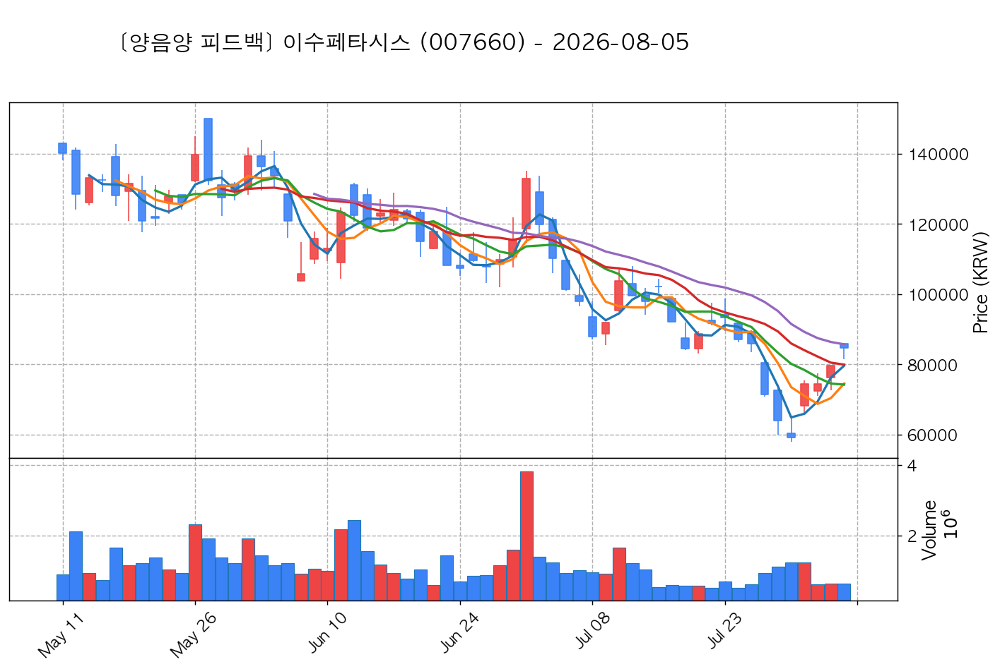

- **전일 종가(기준가)**: 79,600원 ➔ **매매일 시초가**: 85,800원 | **최고가**: 86,000원 (<b>+8.04%</b>) | **종가**: 84,700원 (+6.41%)
- **시세 움직임 복기**: 과거 2026-07-31 기준봉 후 현재 13일선 지지

#### 10) HD현대일렉트릭 (267260) — 후보군 (7위) | ✅ 1차 목표 달성 (+8.7%)

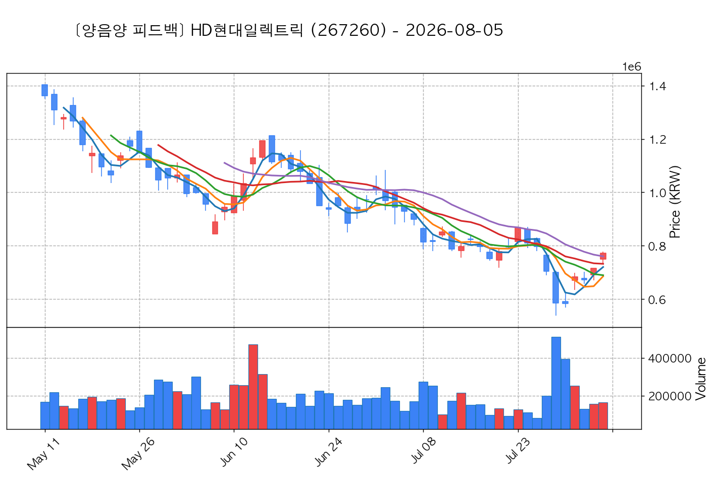

- **전일 종가(기준가)**: 716,000원 ➔ **매매일 시초가**: 750,000원 | **최고가**: 778,000원 (<b>+8.66%</b>) | **종가**: 772,000원 (+7.82%)
- **시세 움직임 복기**: 과거 2026-07-31 기준봉 후 현재 13일선 지지

## 🟡 전략 2 — 일일봉 매집봉 성과

#### 1) HL만도 (204320) — ★ TOP 1 선택 | ✅ 1차 목표 달성 (+6.5%)

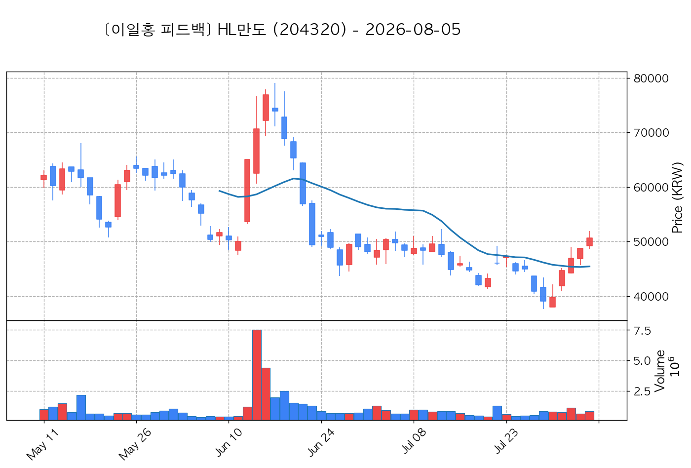

- **전일 종가(기준가)**: 48,750원 ➔ **매매일 시초가**: 49,200원 | **최고가**: 51,900원 (<b>+6.46%</b>) | **종가**: 50,600원 (+3.79%)
- **시세 움직임 복기**: 과거 2026-06-15 매집봉 ➔ 240일선 근접 지지 (-1.20%)

#### 2) NHN (181710) — 후보군 (1위) | ✅ 1차 목표 달성 (+5.4%)

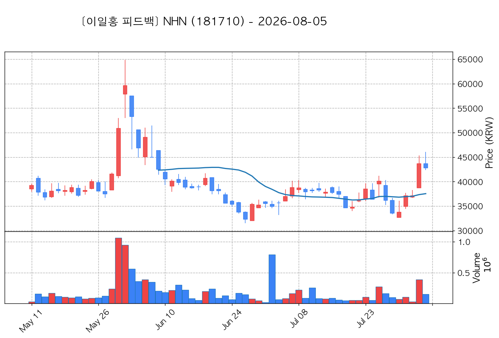

- **전일 종가(기준가)**: 43,700원 ➔ **매매일 시초가**: 43,700원 | **최고가**: 46,050원 (<b>+5.38%</b>) | **종가**: 42,800원 (-2.06%)
- **시세 움직임 복기**: ★ [1순위 키움정석] 40일 최고가 근접 + 60일선 상승 + 시가대비 +12.9% 속양봉

#### 3) 티앤엘 (340570) — 후보군 (2위) | ✅ 1차 목표 달성 (+5.3%)

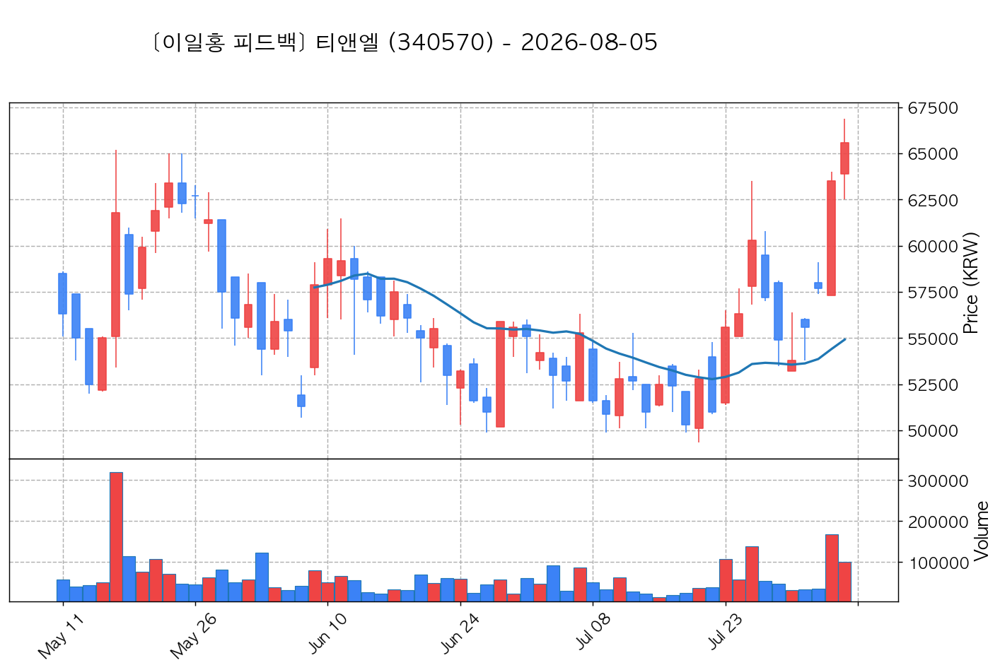

- **전일 종가(기준가)**: 63,500원 ➔ **매매일 시초가**: 63,900원 | **최고가**: 66,900원 (<b>+5.35%</b>) | **종가**: 65,600원 (+3.31%)
- **시세 움직임 복기**: ★ [1순위 키움정석] 40일 최고가 근접 + 60일선 상승 + 시가대비 +10.8% 속양봉

#### 4) 코스메카코리아 (241710) — 후보군 (3위) | ✅ 1차 목표 달성 (+3.6%)

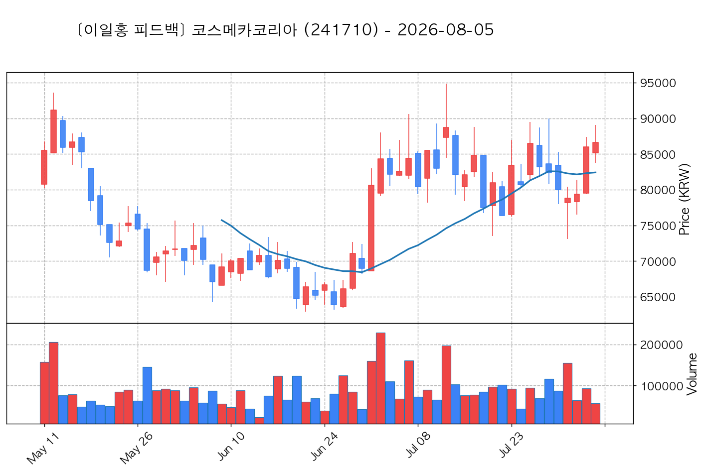

- **전일 종가(기준가)**: 86,000원 ➔ **매매일 시초가**: 85,200원 | **최고가**: 89,100원 (<b>+3.60%</b>) | **종가**: 86,600원 (+0.70%)
- **시세 움직임 복기**: ★ [1순위 키움정석] 40일 최고가 근접 + 60일선 상승 + 시가대비 +8.2% 속양봉

#### 5) 다스코 (058730) — 후보군 (4위) | ✅ 1차 목표 달성 (+5.5%)

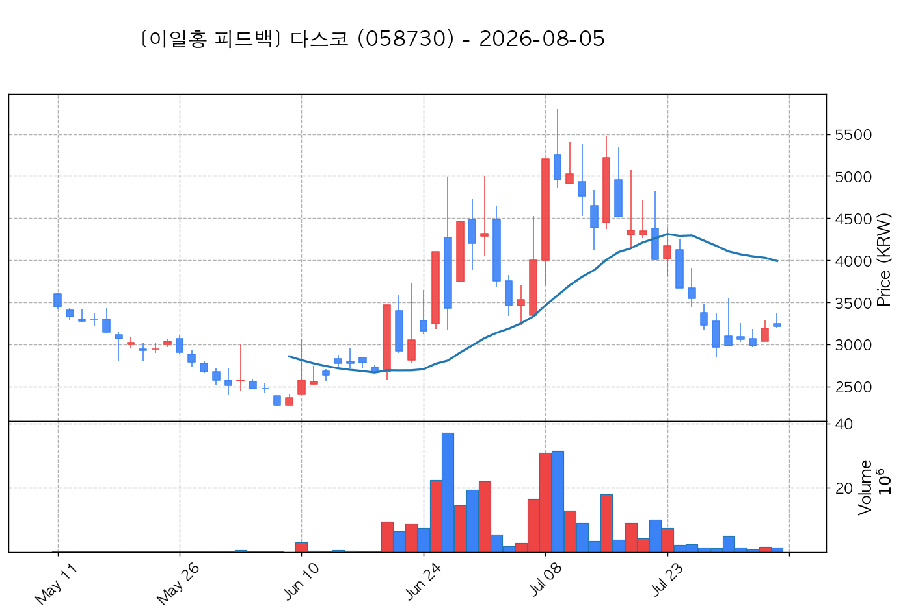

- **전일 종가(기준가)**: 3,195원 ➔ **매매일 시초가**: 3,250원 | **최고가**: 3,370원 (<b>+5.48%</b>) | **종가**: 3,220원 (+0.78%)
- **시세 움직임 복기**: 과거 2026-06-10 매집봉 ➔ 240일선 근접 지지 (-2.94%)

#### 6) 선도전기 (007610) — 후보군 (5위) | ✅ 1차 목표 달성 (+26.6%)

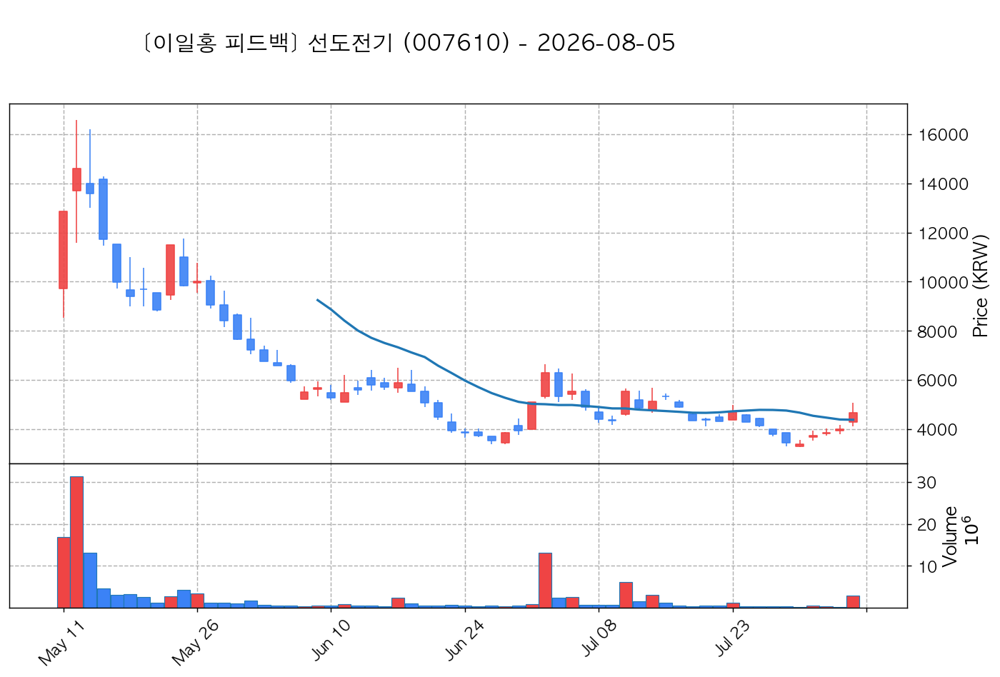

- **전일 종가(기준가)**: 4,005원 ➔ **매매일 시초가**: 4,300원 | **최고가**: 5,070원 (<b>+26.59%</b>) | **종가**: 4,670원 (+16.60%)
- **시세 움직임 복기**: 과거 2026-07-02 매집봉 ➔ 240일선 근접 지지 (+1.06%)

#### 7) 빛샘전자 (072950) — 후보군 (6위) | ✅ 1차 목표 달성 (+25.3%)

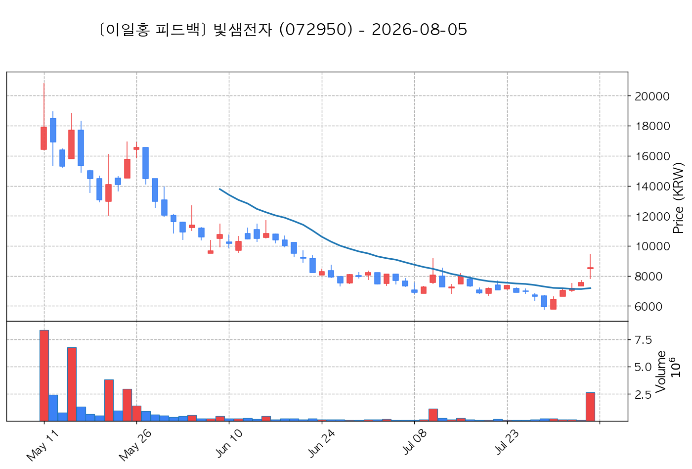

- **전일 종가(기준가)**: 7,560원 ➔ **매매일 시초가**: 8,500원 | **최고가**: 9,470원 (<b>+25.26%</b>) | **종가**: 8,550원 (+13.10%)
- **시세 움직임 복기**: 과거 2026-07-10 매집봉 ➔ 240일선 근접 지지 (+0.45%)

## 🟢 전략 3 — 수급 낙폭과대 바닥형 성과

#### 1) 삼성중공업 (010140) — ★ TOP 1 선택 | ✅ 1차 목표 달성 (+3.0%)

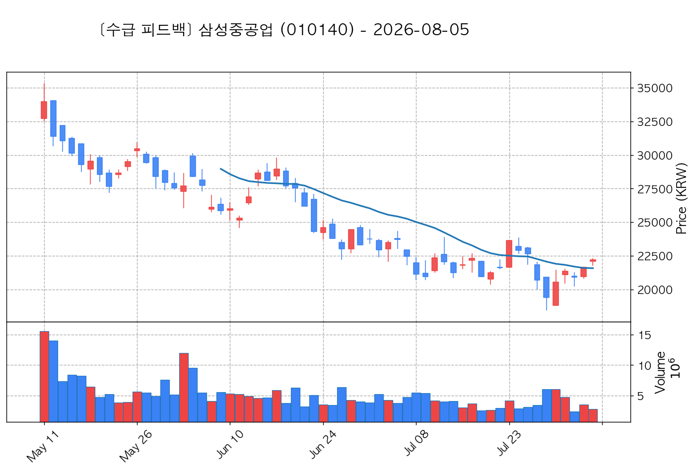

- **전일 종가(기준가)**: 21,650원 ➔ **매매일 시초가**: 22,100원 | **최고가**: 22,300원 (<b>+3.00%</b>) | **종가**: 22,200원 (+2.54%)
- **시세 움직임 복기**: 52주 고점 대비 (61.2%) ➔ 20일 메이저 수급 100억+ 유입 ➔ 없음 지지 안착

#### 2) 한국항공우주 (047810) — ★ TOP 2 선택 | ✅ 1차 목표 달성 (+6.5%)

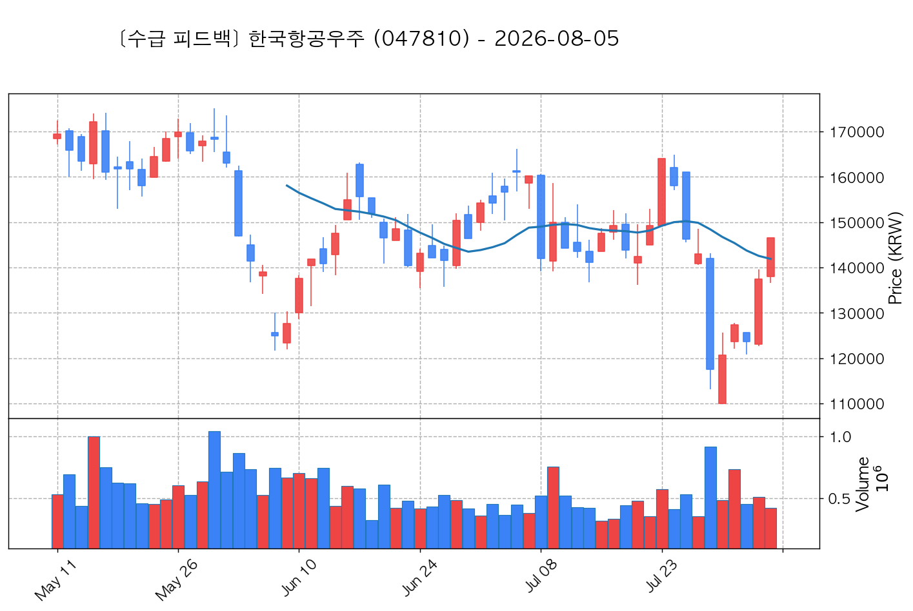

- **전일 종가(기준가)**: 137,500원 ➔ **매매일 시초가**: 138,000원 | **최고가**: 146,500원 (<b>+6.55%</b>) | **종가**: 146,500원 (+6.55%)
- **시세 움직임 복기**: 52주 고점 대비 (63.8%) ➔ 20일 메이저 수급 100억+ 유입 ➔ 240일선 지지 안착

#### 3) 한화엔진 (082740) — 후보군 (1위) | ✅ 1차 목표 달성 (+13.6%)

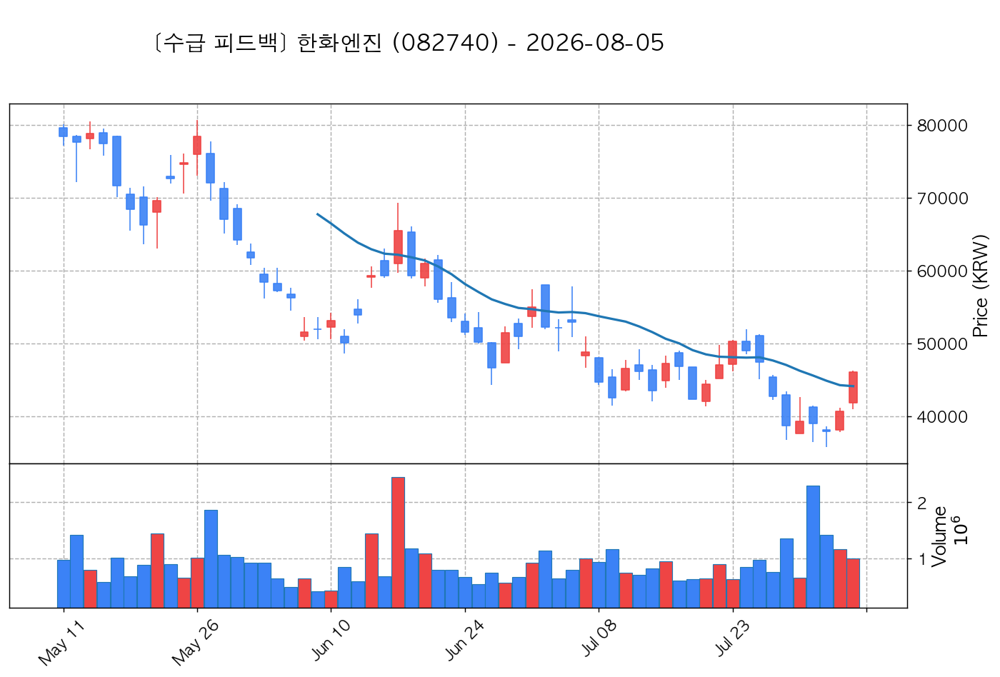

- **전일 종가(기준가)**: 40,750원 ➔ **매매일 시초가**: 41,900원 | **최고가**: 46,300원 (<b>+13.62%</b>) | **종가**: 46,050원 (+13.01%)
- **시세 움직임 복기**: 52주 고점 대비 (43.2%) ➔ 20일 메이저 수급 100억+ 유입 ➔ 없음 지지 안착

#### 4) 한국전력 (015760) — 후보군 (2위) | ✅ 1차 목표 달성 (+3.8%)

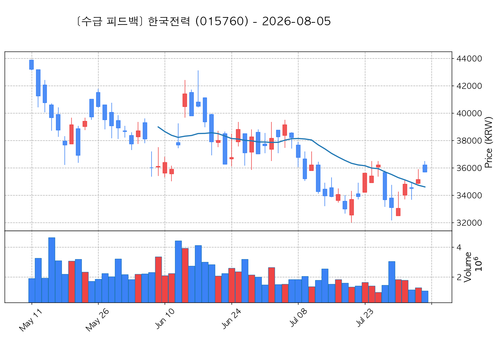

- **전일 종가(기준가)**: 35,150원 ➔ **매매일 시초가**: 36,200원 | **최고가**: 36,500원 (<b>+3.84%</b>) | **종가**: 35,700원 (+1.56%)
- **시세 움직임 복기**: 52주 고점 대비 (50.6%) ➔ 20일 메이저 수급 100억+ 유입 ➔ 없음 지지 안착

#### 5) BNK금융지주 (138930) — 후보군 (3위) | ⏱️ 지지선 유지 (+1.9%)

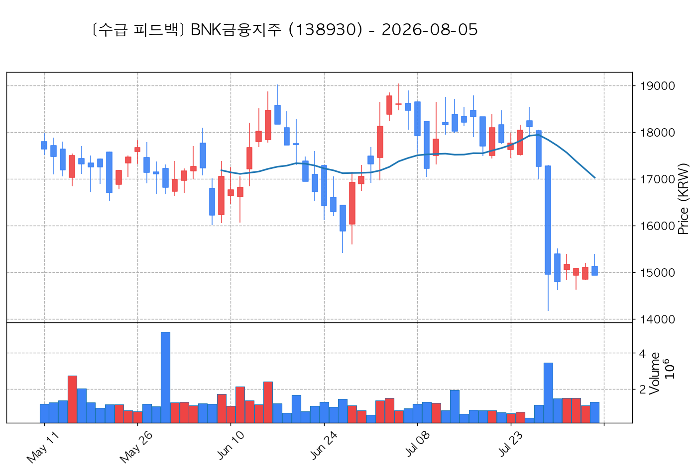

- **전일 종가(기준가)**: 15,110원 ➔ **매매일 시초가**: 15,130원 | **최고가**: 15,390원 (<b>+1.85%</b>) | **종가**: 14,940원 (-1.13%)
- **시세 움직임 복기**: 52주 고점 대비 (65.6%) ➔ 20일 메이저 수급 100억+ 유입 ➔ 없음 지지 안착

#### 6) 코오롱 (002020) — 후보군 (4위) | ✅ 1차 목표 달성 (+9.5%)

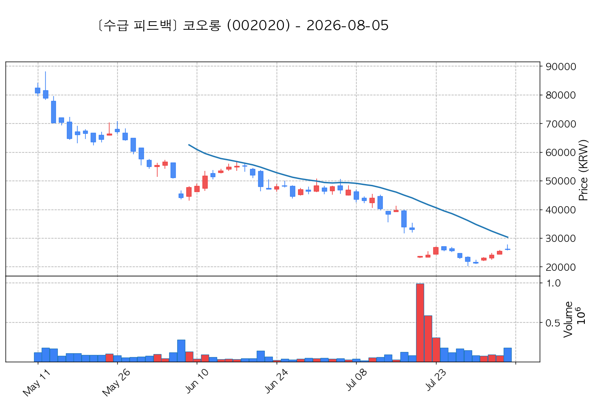

- **전일 종가(기준가)**: 25,350원 ➔ **매매일 시초가**: 26,100원 | **최고가**: 27,750원 (<b>+9.47%</b>) | **종가**: 25,950원 (+2.37%)
- **시세 움직임 복기**: 52주 고점 대비 (28.7%) ➔ 20일 메이저 수급 100억+ 유입 ➔ 없음 지지 안착

