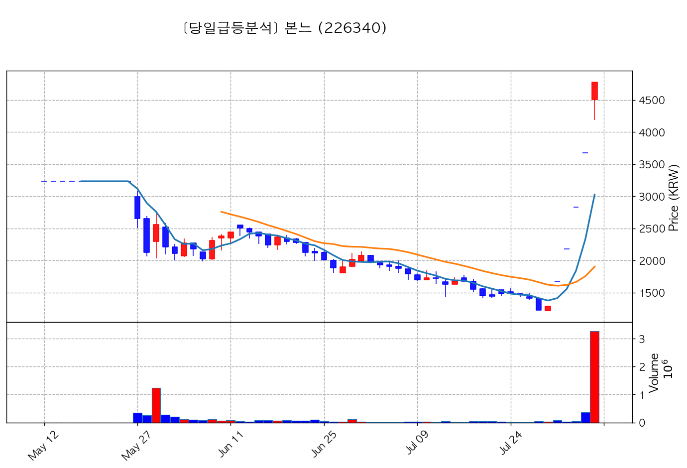
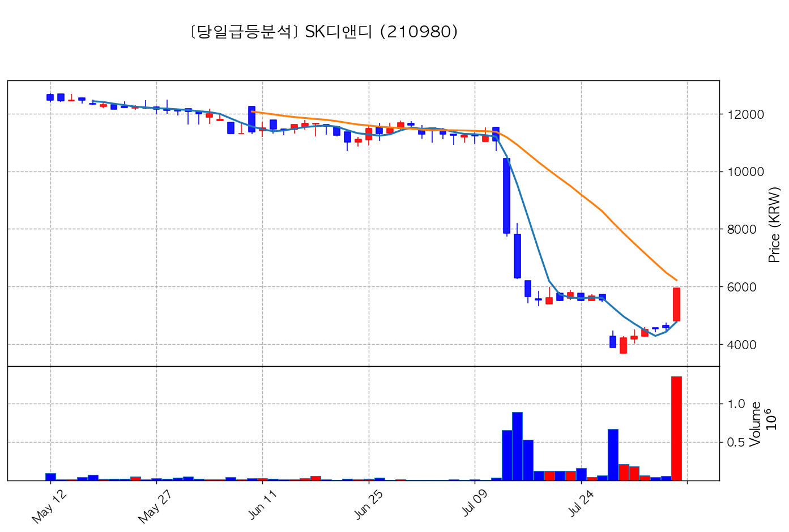
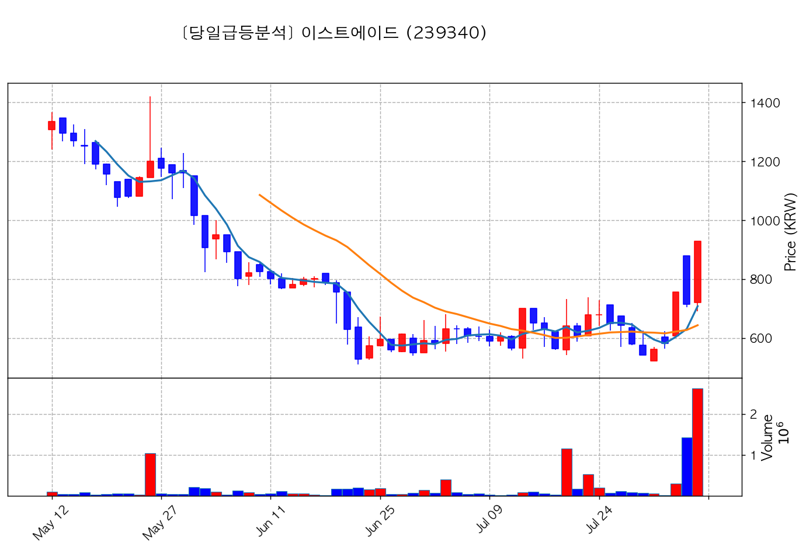
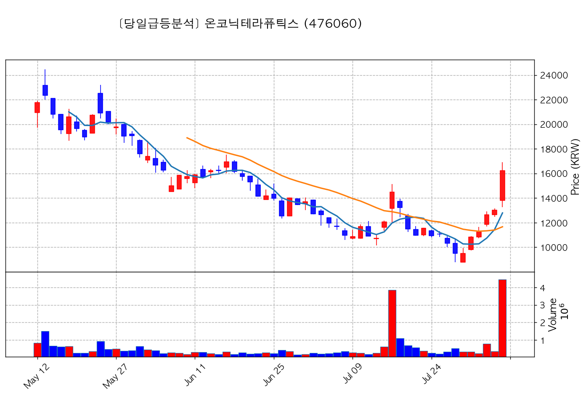
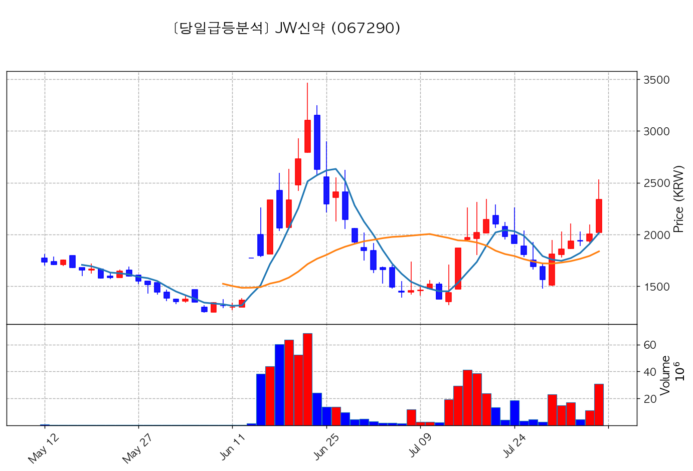
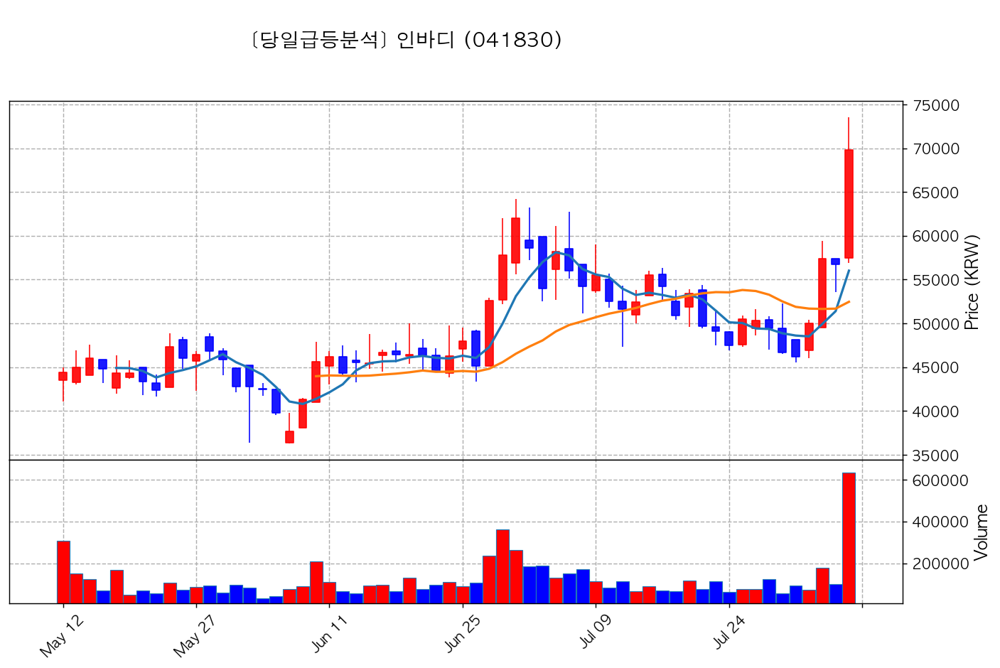
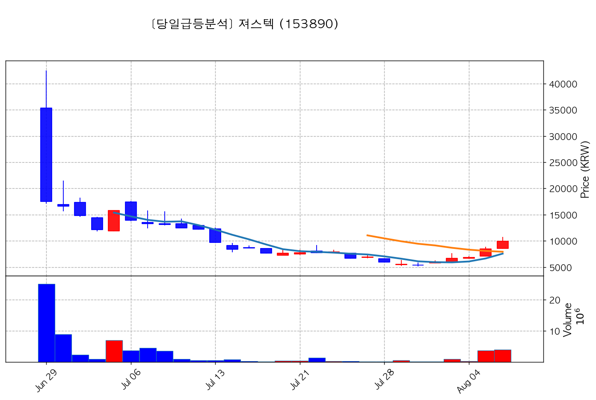

# 🔥 [당일 상한가/급등주 분석] 2026-08-06 시장 주도주 리포트

> 기준일: 2026-08-06 | [📈 매매전 스크리닝 보고서 보기](./2026-08-06_스크리닝.html)

---

## 🏆 1. 당일 상한가/하한가 달성 종목 (상위 3개)

#### 1) 본느 (226340) — <b>+29.93%</b>

- **종가**: 4,775원 | **거래대금**: 155.7억
- **🔥 당일 핵심 뉴스**: 🔗 [(특징주)본느, 경영권 인수 기대감에 4거래일 연속 상한가](https://news.google.com/rss/articles/CBMiYEFVX3lxTE94a1gwWFl2VnR4cHV2OV9tc3VJaTA5VWVFRnlua0tfYklQU3M2cG1zSzNlOHJBMkRTWEtBUW5uUkxpa3puaG1nbWpNeEx4MGt2aUlUR3BNeEpRVFoxeTJBZg?oc=5)

#### 2) SK디앤디 (210980) — <b>+29.84%</b>

- **종가**: 5,940원 | **거래대금**: 80.1억
- **🔥 당일 핵심 뉴스**: 🔗 [(특징주)SK디앤디, 금감원 유증 제동에 장 초반 상한가](https://news.google.com/rss/articles/CBMiYEFVX3lxTE5nMURpWUhYOEh1T0c3WnI3Q1lJcWhJLVBxYmF5QnVqTVhjM1E5UlNoNWgtRHVlXzU3X2ttY181SW55cmVuZ09UanMzbG1Gby1UUG0yTHAzRTN3RHlza0Fxbg?oc=5)

#### 3) 이스트에이드 (239340) — <b>+29.97%</b>

- **종가**: 928원 | **거래대금**: 24.3억
- **🔥 당일 핵심 뉴스**: 🔗 [[오늘의 특징주] AI·광통신 인프라 훈풍… 솔트룩스·삼기 등 12개 종목 상한가](https://news.google.com/rss/articles/CBMiZEFVX3lxTE13RXFDNDhKNHVvaWVuOVRiaXhubUZjeWI2ZVF1MDg3Y2JrQ2tuM1dkbEdlRTZldXlYakFEWS1sSWtnNzR1OFUyUEljeEtHR25xVHVydEYwaWJyZkhEa1lHWDVCWUU?oc=5)

---

## 🚀 2. 거래대금 150억+ & +15% 이상 폭등주 (상위 4개)

#### 1) 온코닉테라퓨틱스 (476060) — <b>+24.48%</b>

- **종가**: 16,220원 | **거래대금**: 722.6억
- **🔥 당일 핵심 뉴스**: 🔗 [[특징주] 온코닉테라퓨틱스, 美 FDA 희귀의약품 지정에 상한가](https://news.google.com/rss/articles/CBMibEFVX3lxTE9nQm82NVRsTXpRcWxab0JGMHJ2RGtyV05IY2xIS0QzRHVKNWdfcUlsWGFGUkc5aUx3cmtHd0NXdjRrMEtJNzFCTDh6d0xYTElQdDVwZ2dhSTlvVG5xU093bWNNV3pucGREWi1xTA?oc=5)

#### 2) JW신약 (067290) — <b>+16.71%</b>

- **종가**: 2,340원 | **거래대금**: 720.7억
- **🔥 당일 핵심 뉴스**: 🔗 [[특징주] 외국인 '삼성전자·JW신약', 기관 'GS건설·한화엔진' 러브콜...휴림로봇·삼성중공업은 매도](https://news.google.com/rss/articles/CBMiakFVX3lxTE5oXzlFbC0xeG1RaklVemJPbTdrRElaaWFmN0tEMmZsWlE5NEJGXzMzcUhZcUFuMVN2S1B5Y0lnVEVIZDZFZkIybDdpajVwRzBtcnFpUzFtVDdZajI2NUxSRENycDBBamJlM1E?oc=5)

#### 3) 인바디 (041830) — <b>+23.10%</b>

- **종가**: 69,800원 | **거래대금**: 441.8억
- **🔥 당일 핵심 뉴스**: 🔗 [[특징주] 인바디, 1분기 호실적에 비만 치료 신규 수요 기대감 '상한가'](https://news.google.com/rss/articles/CBMiiAFBVV95cUxNcE9HZ0VudGlkbUwxV01DZFdvT1diVnpfTEk0MmhObFFSLUw0LWdsU1F1TnRzN21SM1piWTF0Zl9wT1BQWjZSalJVSFBoWUZOZXRPQXNpMUJ1b3hQencwaVZrRkN2emVPTUlfMDBMeGN4ZDhHSWtYN0VJYVZ4X0ZIYmEwUGQ4bDhs?oc=5)

#### 4) 져스텍 (153890) — <b>+17.71%</b>

- **종가**: 9,970원 | **거래대금**: 399.1억
- **🔥 당일 핵심 뉴스**: 🔗 [정효근 전무, 져스텍 주식 1000주 ↑…지분율 0.01%](https://news.google.com/rss/articles/CBMic0FVX3lxTE14SXpfWkFIMlNoeVJLc0tSYUpTRmFSb1dBczhMY0UyWlBGdTVWQVRDR0hhREQtS2xDYnZtX0ZnMHZybjZrMTdLYkRKalQwWDNETEpKNmg4RGFjck9zTVF6bFNaNUhzM2hTNFYxb0FsOEptQkU?oc=5)

