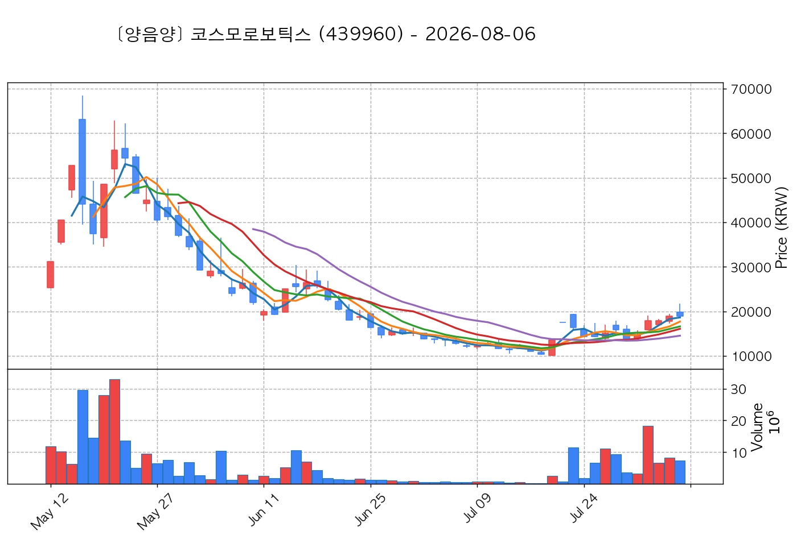
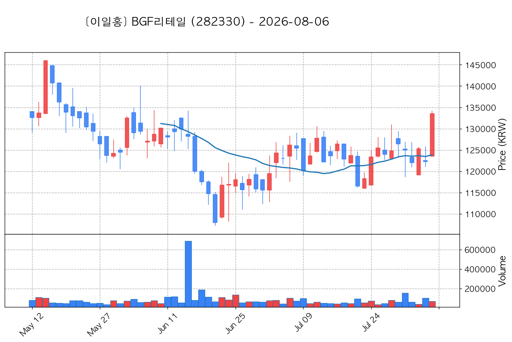
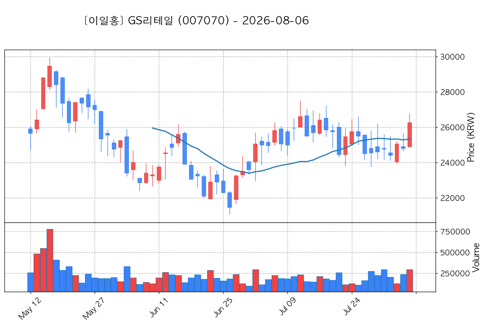
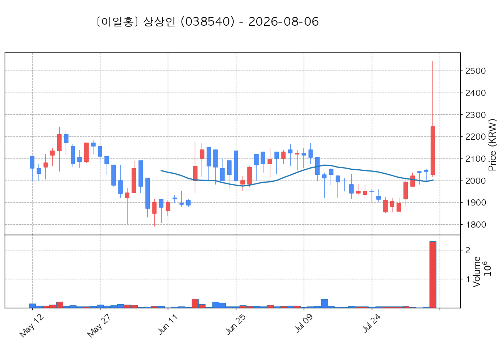
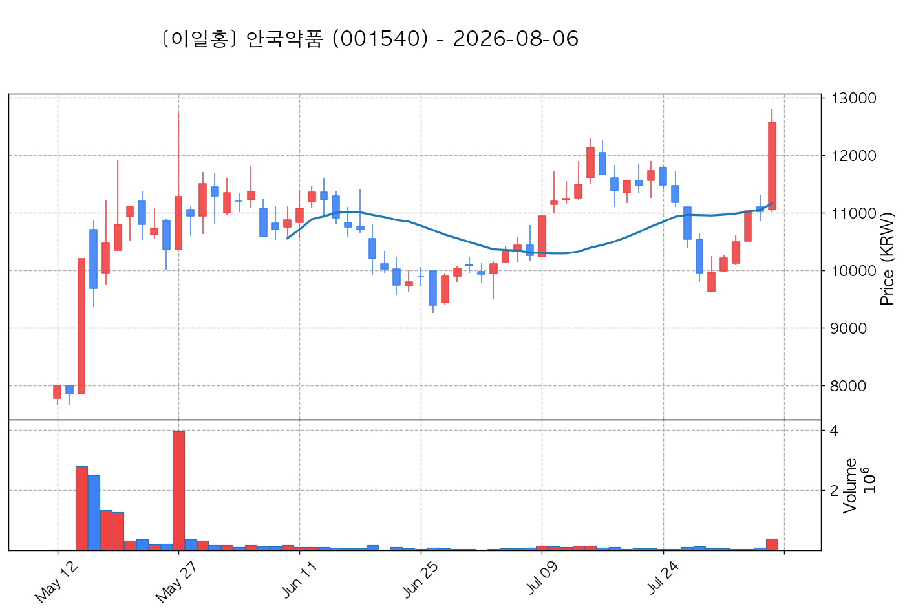

# 📈 [실전플랜 1] 2026-08-06 매매 후보 스크리닝 보고서

> 스크리닝 기준일: 2026-08-06 | [📊 익일 매매 성과 피드백 보고서 보기](./2026-08-06_피드백.html)

---

## 📊 1. 스크리닝 성과 요약

| 전략 | 주요 기법 | 종목수(TOP) |
| :--- | :--- | :---: |
| **전략 1** | 양음양 눌림목 & 사윗감 | 53개 (TOP 3개) |
| **전략 2** | 매집봉 & 이일홍 | 6개 (TOP 1개) |
| **전략 3** | 수급 & 핥 | 0개 (TOP 0개) |
| **합계** | **3대 핵심 전략 통합** | **59개 (TOP 4개)** |

---

## 🔵 3. 전략 1 — 양-음-양 눌림목 (3% × 3슬롯)

### 📋 전략 1 요약표 (상위 10개)

| 종목명 | 기준일종가 | 기준봉 | 지지선 | 비고 및 선정 상태 |
| :--- | ---: | :--- | :---: | :--- |
| **삼성전자** (005930) | 230,500원 | +26.8% 장대양봉 | 8일선 | **★ TOP 1 선택** |
| **SK스퀘어** (402340) | 971,000원 | 상한가 | 8일선 | **★ TOP 2 선택** (사윗감) |
| **SK이터닉스** (475150) | 55,100원 | +19.9% 장대양봉 | 3일선 | **★ TOP 3 선택** |
| **삼성전기** (009150) | 1,238,000원 | 상한가 | 3일선 | 후보군 (1위) |
| **한미반도체** (042700) | 202,000원 | +28.0% 장대양봉 | 3일선 | 후보군 (2위) |
| **삼성물산** (028260) | 333,500원 | +19.6% 장대양봉 | 3일선 | 후보군 (3위) |
| **코스모로보틱스** (439960) | 18,960원 | +21.3% 장대양봉 | 3일선 | 후보군 (4위) |
| **LS ELECTRIC** (010120) | 203,500원 | +23.0% 장대양봉 | 3일선 | 후보군 (5위) |
| **주성엔지니어링** (036930) | 135,100원 | +26.7% 장대양봉 | 3일선 | 후보군 (6위) |
| **LG이노텍** (011070) | 551,000원 | +21.2% 장대양봉 | 3일선 | 후보군 (7위) |

---

### 🔍 전략 1 상세 분석

#### 1) 삼성전자 (005930) — ★ TOP 1 선택

- **기준 종가**: 230,500원 | **거래대금**: 52781억
- **분석 사유**: 과거 2026-07-31 기준봉 후 현재 8일선 지지

#### 2) SK스퀘어 (402340) — ★ TOP 2 선택 (사윗감)

- **기준 종가**: 971,000원 | **거래대금**: 6896억
- **분석 사유**: 과거 2026-07-31 기준봉 후 현재 8일선 지지

#### 3) SK이터닉스 (475150) — ★ TOP 3 선택

- **기준 종가**: 55,100원 | **거래대금**: 1475억
- **분석 사유**: 과거 2026-08-04 기준봉 후 현재 3일선 지지

#### 4) 삼성전기 (009150) — 후보군 (1위)

- **기준 종가**: 1,238,000원 | **거래대금**: 11296억
- **분석 사유**: 과거 2026-07-31 기준봉 후 현재 3일선 지지

#### 5) 한미반도체 (042700) — 후보군 (2위)

- **기준 종가**: 202,000원 | **거래대금**: 768억
- **분석 사유**: 과거 2026-07-31 기준봉 후 현재 3일선 지지

#### 6) 삼성물산 (028260) — 후보군 (3위)

- **기준 종가**: 333,500원 | **거래대금**: 917억
- **분석 사유**: 과거 2026-07-31 기준봉 후 현재 3일선 지지

#### 7) 코스모로보틱스 (439960) — 후보군 (4위)

- **기준 종가**: 18,960원 | **거래대금**: 1403억
- **분석 사유**: 과거 2026-08-03 기준봉 후 현재 3일선 지지

#### 8) LS ELECTRIC (010120) — 후보군 (5위)

- **기준 종가**: 203,500원 | **거래대금**: 1155억
- **분석 사유**: 과거 2026-07-31 기준봉 후 현재 3일선 지지

#### 9) 주성엔지니어링 (036930) — 후보군 (6위)

- **기준 종가**: 135,100원 | **거래대금**: 1059억
- **분석 사유**: 과거 2026-07-31 기준봉 후 현재 3일선 지지

#### 10) LG이노텍 (011070) — 후보군 (7위)

- **기준 종가**: 551,000원 | **거래대금**: 1365억
- **분석 사유**: 과거 2026-07-31 기준봉 후 현재 3일선 지지

## 🟡 4. 전략 2 — 일일봉 매집봉 (10% × 1슬롯)

### 📋 전략 2 요약표 (상위 6개)

| 종목명 | 기준일종가 | 기준봉 | 지지선 | 비고 및 선정 상태 |
| :--- | ---: | :--- | :---: | :--- |
| **BGF리테일** (282330) | 133,500원 | ★ [1순위 키움정석] 40일 최고가 근접 + 60일선 상승 + 시가대비 +8.1% 속양봉 | 240일선 | **★ TOP 1 선택** |
| **GS리테일** (007070) | 26,250원 | ★ [1순위 키움정석] 40일 최고가 근접 + 60일선 상승 + 시가대비 +5.4% 속양봉 | 240일선 | 후보군 (1위) |
| **상상인** (038540) | 2,245원 | ★ [1순위 키움정석] 40일 최고가 근접 + 60일선 상승 + 시가대비 +10.9% 속양봉 | 240일선 | 후보군 (2위) |
| **안국약품** (001540) | 12,570원 | ★ [1순위 키움정석] 40일 최고가 근접 + 60일선 상승 + 시가대비 +13.8% 속양봉 | 240일선 | 후보군 (3위) |
| **퍼스텍** (010820) | 6,170원 | 과거 2026-06-16 매집봉 ➔ 240일선 근접 지지 (-2.79%) | 240일선 | 후보군 (4위) |
| **다스코** (058730) | 3,255원 | 과거 2026-06-22 매집봉 ➔ 240일선 근접 지지 (-1.15%) | 240일선 | 후보군 (5위) |

---

### 🔍 전략 2 상세 분석

#### 1) BGF리테일 (282330) — ★ TOP 1 선택

- **기준 종가**: 133,500원 | **거래대금**: 91억
- **분석 사유**: ★ [1순위 키움정석] 40일 최고가 근접 + 60일선 상승 + 시가대비 +8.1% 속양봉

#### 2) GS리테일 (007070) — 후보군 (1위)

- **기준 종가**: 26,250원 | **거래대금**: 77억
- **분석 사유**: ★ [1순위 키움정석] 40일 최고가 근접 + 60일선 상승 + 시가대비 +5.4% 속양봉

#### 3) 상상인 (038540) — 후보군 (2위)

- **기준 종가**: 2,245원 | **거래대금**: 51억
- **분석 사유**: ★ [1순위 키움정석] 40일 최고가 근접 + 60일선 상승 + 시가대비 +10.9% 속양봉

#### 4) 안국약품 (001540) — 후보군 (3위)

- **기준 종가**: 12,570원 | **거래대금**: 50억
- **분석 사유**: ★ [1순위 키움정석] 40일 최고가 근접 + 60일선 상승 + 시가대비 +13.8% 속양봉

#### 5) 퍼스텍 (010820) — 후보군 (4위)

- **기준 종가**: 6,170원 | **거래대금**: 38억
- **분석 사유**: 과거 2026-06-16 매집봉 ➔ 240일선 근접 지지 (-2.79%)

#### 6) 다스코 (058730) — 후보군 (5위)

- **기준 종가**: 3,255원 | **거래대금**: 32억
- **분석 사유**: 과거 2026-06-22 매집봉 ➔ 240일선 근접 지지 (-1.15%)

## 🟢 5. 전략 3 — 수급 낙폭과대 바닥형 (10% × 2슬롯)

해당 전략 포착 종목 없음

