# 📈 [실전플랜 1] 2026-08-06 (종가) 매매 후보 스크리닝 보고서

> 스크리닝 기준일: 2026-08-06 (종가) | 진입 예정일: 2026-08-07 (매매일) | [📊 익일 매매 성과 피드백 보고서 보기](./2026-08-07_피드백.html)

---

## 📊 1. 스크리닝 요약
- **전략 1 (양-음-양 눌림목)**: 55개 포착
- **전략 2 (일일봉 매집봉)**: 5개 포착
- **전략 3 (수급 낙폭과대 바닥형)**: 1개 포착
- **총 포착 수**: 61개 종목 (TOP 선택 5개)

---

## 🔵 1. 전략 1 — 양-음-양 눌림목 (3% × 3슬롯)

#### 1) 삼성전자 (005930) — ★ TOP 1 선택

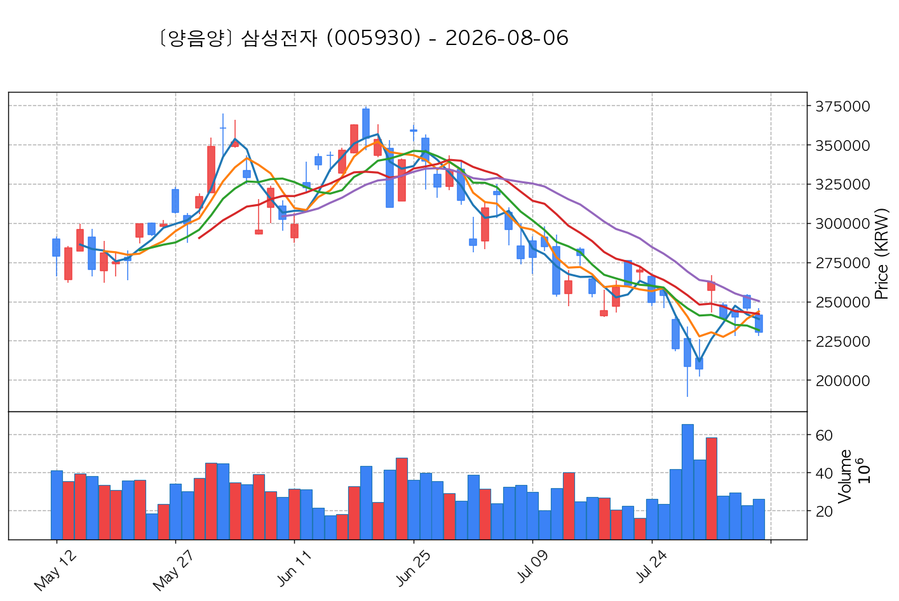

- **기준 종가**: 230,500원 | **거래대금**: 60164억
- **분석 사유**: 과거 2026-07-31 기준봉 후 현재 8일선 지지

#### 2) SK하이닉스 (000660) — ★ TOP 2 선택 (사윗감)

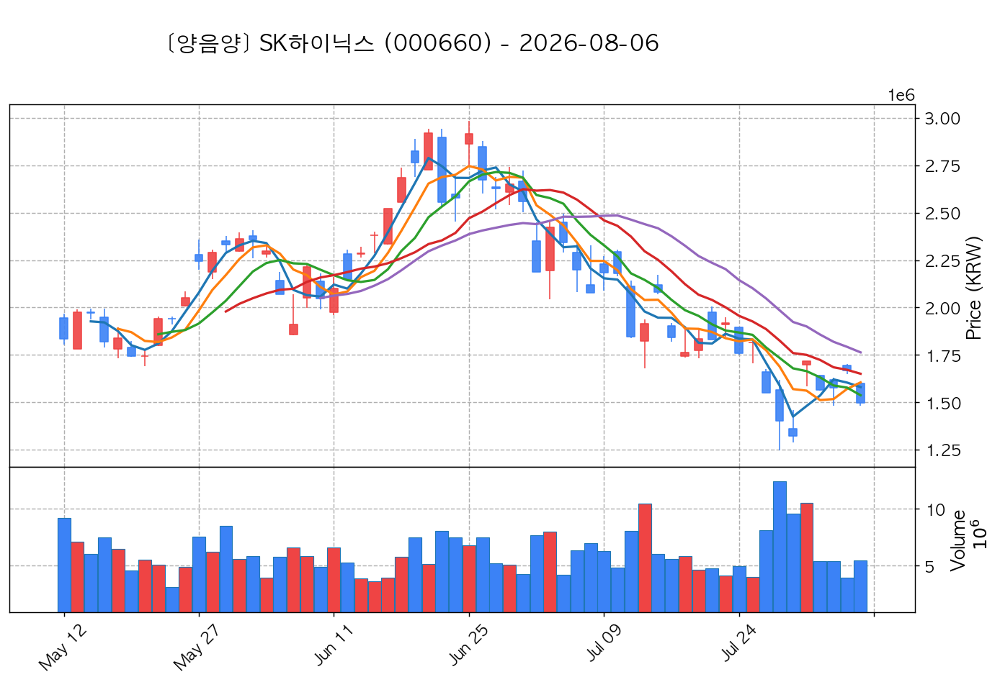

- **기준 종가**: 1,495,000원 | **거래대금**: 82199억
- **분석 사유**: 과거 2026-07-31 기준봉 후 현재 8일선 지지

#### 3) SK스퀘어 (402340) — ★ TOP 3 선택 (사윗감)

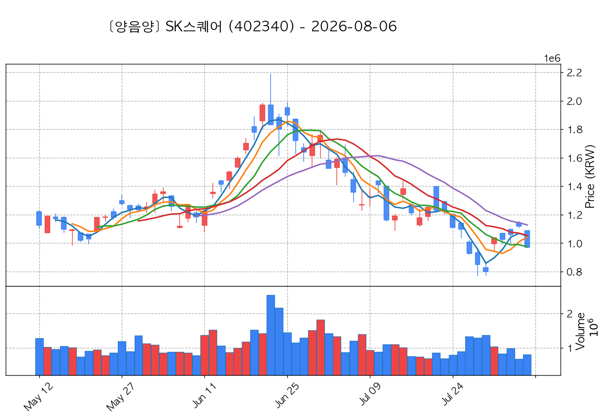

- **기준 종가**: 970,000원 | **거래대금**: 7838억
- **분석 사유**: 과거 2026-07-31 기준봉 후 현재 8일선 지지

#### 4) 두산 (000150) — 후보군 (1위) (사윗감)

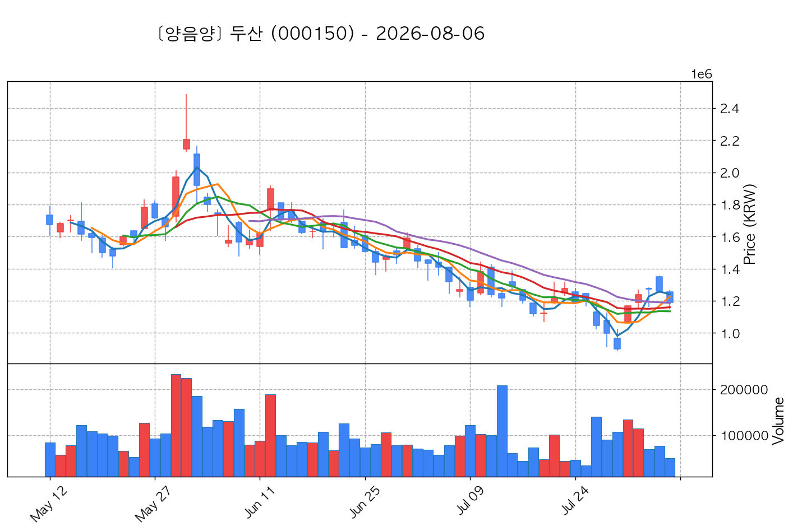

- **기준 종가**: 1,188,000원 | **거래대금**: 602억
- **분석 사유**: 과거 2026-07-31 기준봉 후 현재 20일선 지지

#### 5) 삼성물산 (028260) — 후보군 (2위)

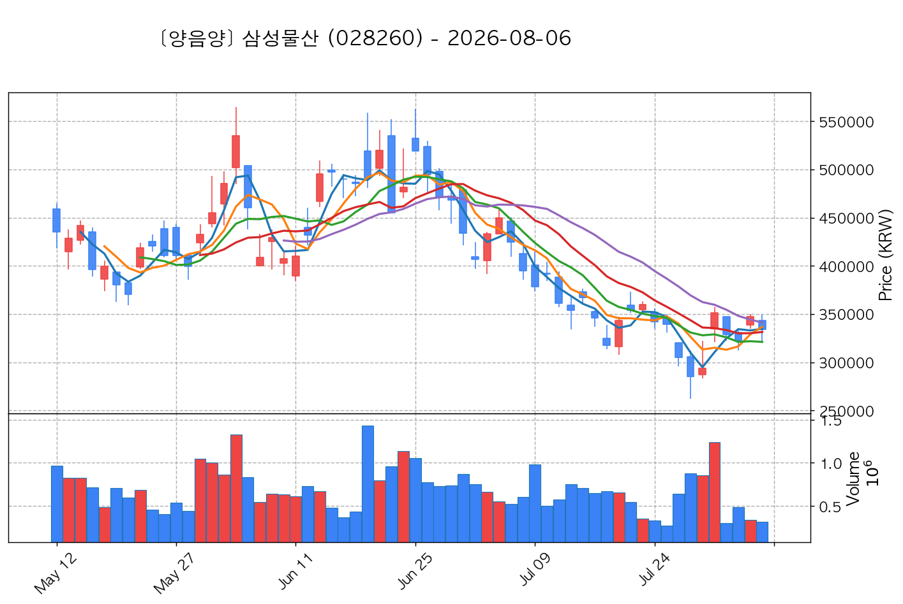

- **기준 종가**: 334,000원 | **거래대금**: 1067억
- **분석 사유**: 과거 2026-07-31 기준봉 후 현재 3일선 지지

#### 6) 코스모로보틱스 (439960) — 후보군 (3위)

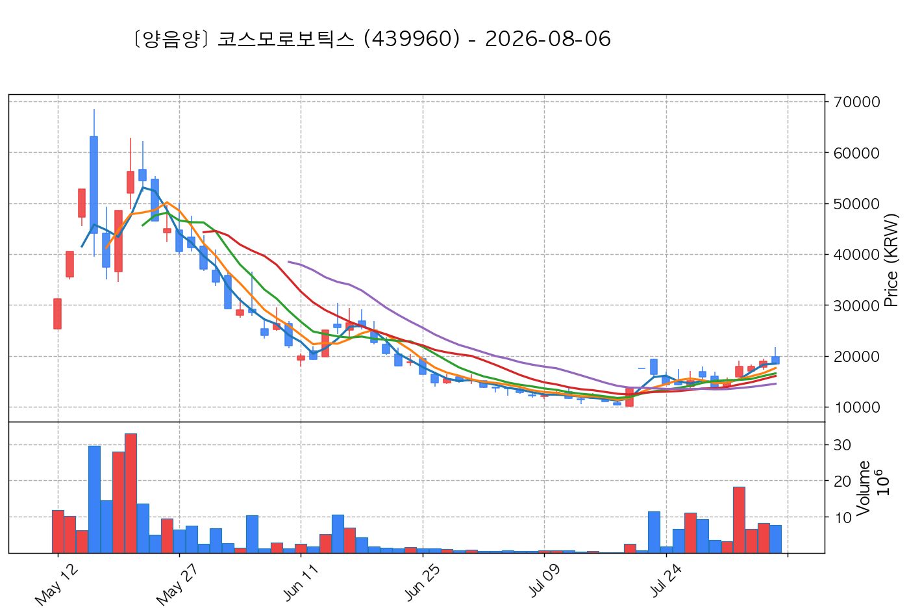

- **기준 종가**: 18,460원 | **거래대금**: 1415억
- **분석 사유**: 과거 2026-08-03 기준봉 후 현재 3일선 지지

#### 7) SK이터닉스 (475150) — 후보군 (4위)

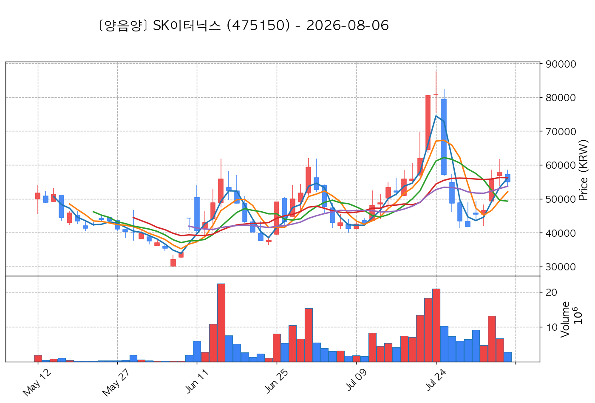

- **기준 종가**: 55,000원 | **거래대금**: 1562억
- **분석 사유**: 과거 2026-08-04 기준봉 후 현재 3일선 지지

#### 8) 피에스케이 (319660) — 후보군 (5위)

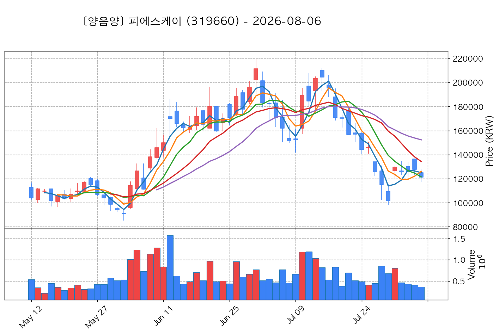

- **기준 종가**: 121,200원 | **거래대금**: 448억
- **분석 사유**: 과거 2026-07-31 기준봉 후 현재 8일선 지지

#### 9) 삼성전기 (009150) — 후보군 (6위)

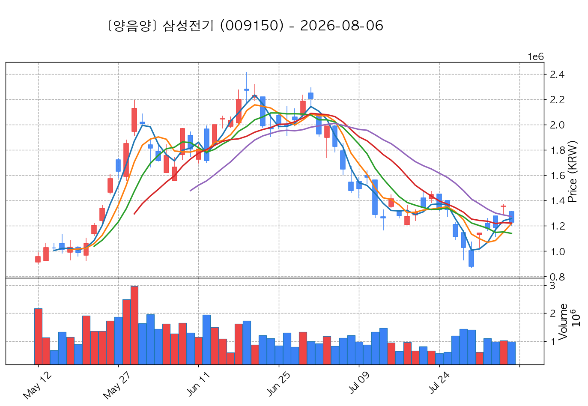

- **기준 종가**: 1,229,000원 | **거래대금**: 11944억
- **분석 사유**: 과거 2026-07-31 기준봉 후 현재 3일선 지지

#### 10) LS ELECTRIC (010120) — 후보군 (7위)

- **기준 종가**: 202,500원 | **거래대금**: 1274억
- **분석 사유**: 과거 2026-07-31 기준봉 후 현재 3일선 지지

## 🟡 2. 전략 2 — 일일봉 매집봉 (10% × 1슬롯)

#### 1) BGF리테일 (282330) — ★ TOP 1 선택

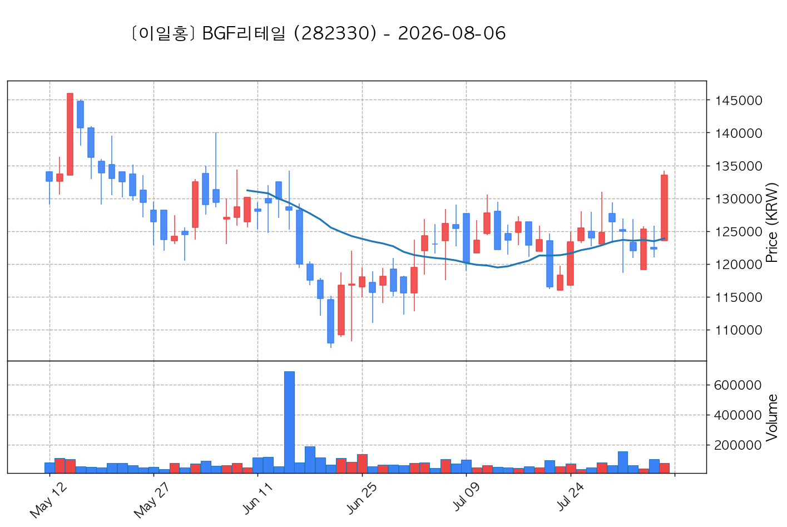

- **기준 종가**: 133,500원 | **거래대금**: 103억
- **분석 사유**: ★ [1순위 키움정석] 40일 최고가 근접 + 60일선 상승 + 시가대비 +8.1% 속양봉

#### 2) GS리테일 (007070) — 후보군 (1위)

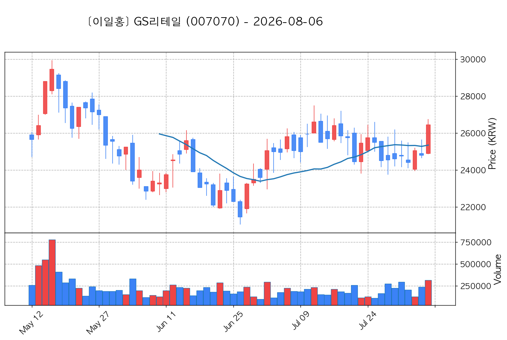

- **기준 종가**: 26,450원 | **거래대금**: 83억
- **분석 사유**: ★ [1순위 키움정석] 40일 최고가 근접 + 60일선 상승 + 시가대비 +6.2% 속양봉

#### 3) 다스코 (058730) — 후보군 (2위)

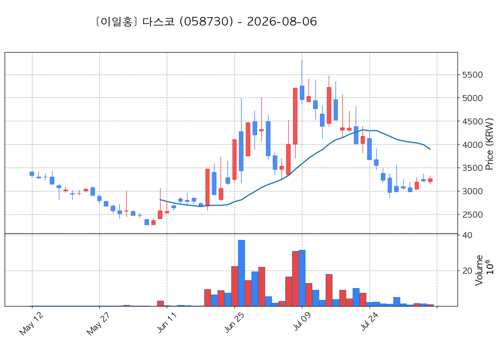

- **기준 종가**: 3,260원 | **거래대금**: 33억
- **분석 사유**: 과거 2026-06-22 매집봉 ➔ 240일선 근접 지지 (-1.00%)

#### 4) 강스템바이오텍 (217730) — 후보군 (3위)

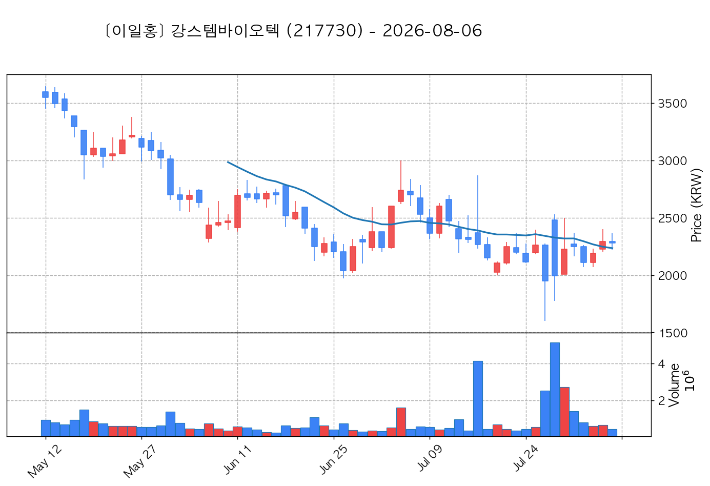

- **기준 종가**: 2,280원 | **거래대금**: 10억
- **분석 사유**: 과거 2026-07-16 매집봉 ➔ 240일선 근접 지지 (+2.37%)

#### 5) 포스코스틸리온 (058430) — 후보군 (4위)

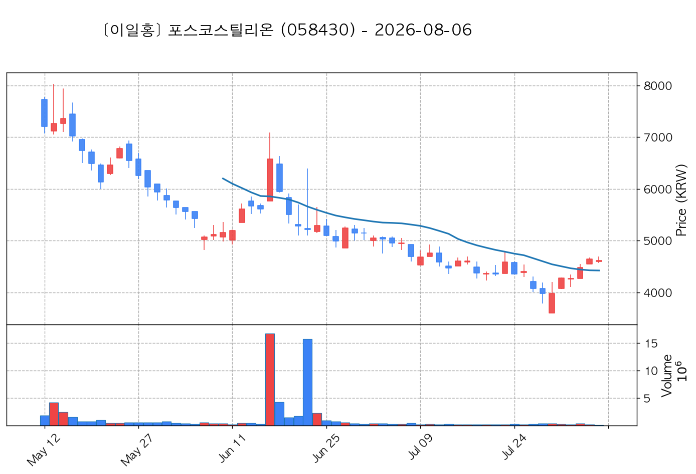

- **기준 종가**: 4,615원 | **거래대금**: 5억
- **분석 사유**: 과거 2026-06-17 매집봉 ➔ 240일선 근접 지지 (+1.56%)

## 🟢 3. 전략 3 — 수급 낙폭과대 바닥형 (10% × 2슬롯)

#### 1) 대우건설 (047040) — ★ TOP 1 선택

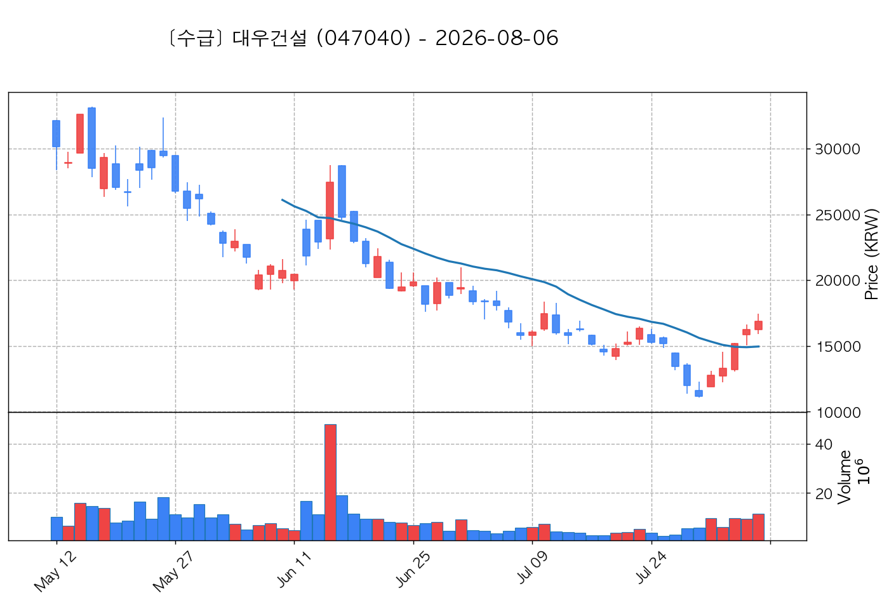

- **기준 종가**: 16,870원 | **거래대금**: 1933억
- **분석 사유**: 52주 고점 대비 (41.8%) ➔ 20일 메이저 수급 100억+ 유입 ➔ 없음 지지 안착

