# 📊 [실전플랜 1 피드백] 2026-08-06 매매 성과 추적 보고서

> 스크리닝 포착일: 2026-08-05 (종가) | 실제 매매(추적일): 2026-08-06 (매매일) | [📈 매매전 스크리닝 보고서 보기](./2026-08-05_스크리닝.html)

---

## 📊 1. 당일 매매 성과 요약
- **포착 및 검증 종목 수**: 총 38개 종목

---

## 🔵 전략 1 — 양-음-양 눌림목 성과

#### 1) SK하이닉스 (000660) — ★ TOP 1 선택 | ❌ 손절 이탈 (-3.7%)

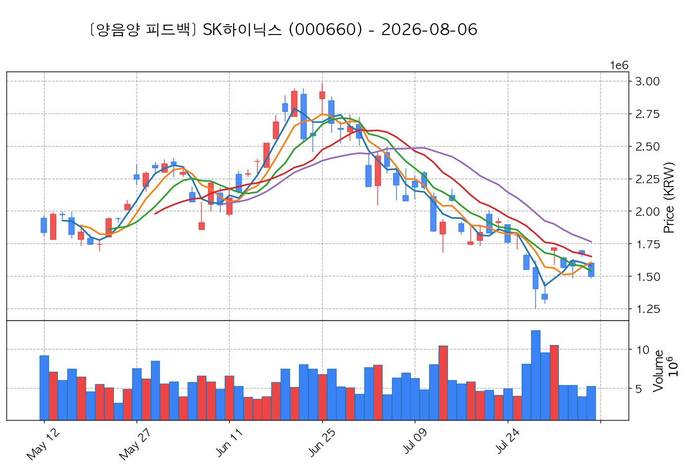

- **전일 종가(기준가)**: 1,668,000원 ➔ **매매일 시초가**: 1,600,000원 | **최고가**: 1,606,000원 (<b>-3.72%</b>) | **종가**: 1,495,000원 (-10.37%)
- **시세 움직임 복기**: 과거 2026-07-31 기준봉 후 현재 13일선 지지

#### 2) 삼성전자 (005930) — ★ TOP 2 선택 | ⏱️ 지지선 유지 (+0.0%)

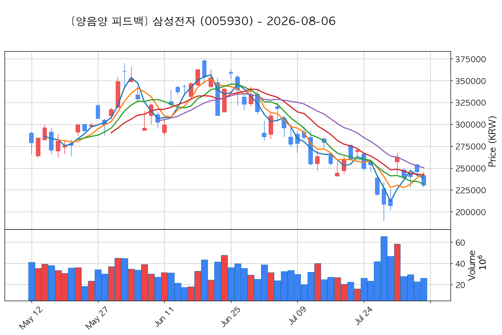

- **전일 종가(기준가)**: 246,000원 ➔ **매매일 시초가**: 241,500원 | **최고가**: 246,000원 (<b>+0.00%</b>) | **종가**: 230,500원 (-6.30%)
- **시세 움직임 복기**: 과거 2026-07-31 기준봉 후 현재 3일선 지지

#### 3) 한미반도체 (042700) — ★ TOP 3 선택 | ⏱️ 지지선 유지 (+0.0%)

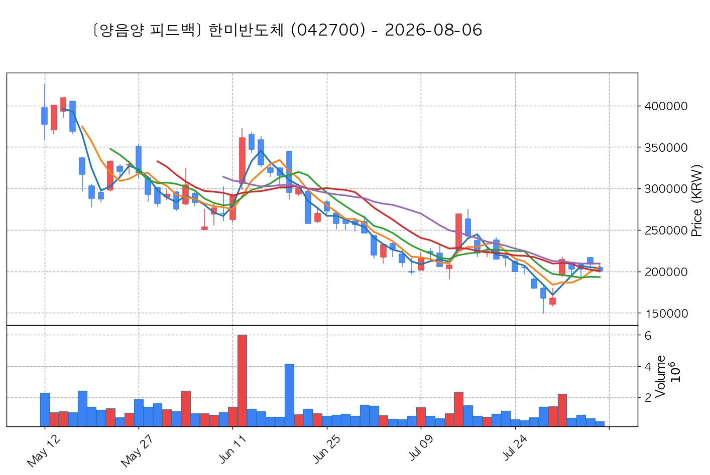

- **전일 종가(기준가)**: 209,000원 ➔ **매매일 시초가**: 204,500원 | **최고가**: 209,000원 (<b>+0.00%</b>) | **종가**: 200,500원 (-4.07%)
- **시세 움직임 복기**: 과거 2026-07-31 기준봉 후 현재 20일선 지지

#### 4) SK스퀘어 (402340) — 후보군 (1위) | ❌ 손절 이탈 (-2.8%)

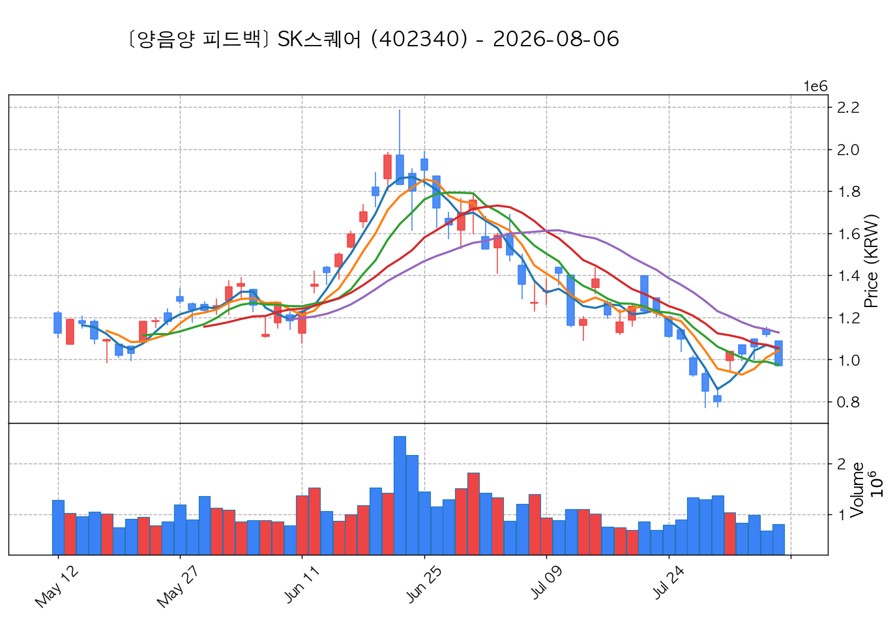

- **전일 종가(기준가)**: 1,119,000원 ➔ **매매일 시초가**: 1,088,000원 | **최고가**: 1,088,000원 (<b>-2.77%</b>) | **종가**: 970,000원 (-13.32%)
- **시세 움직임 복기**: 과거 2026-07-31 기준봉 후 현재 20일선 지지

#### 5) 삼성물산 (028260) — 후보군 (2위) | ⏱️ 지지선 유지 (+0.6%)

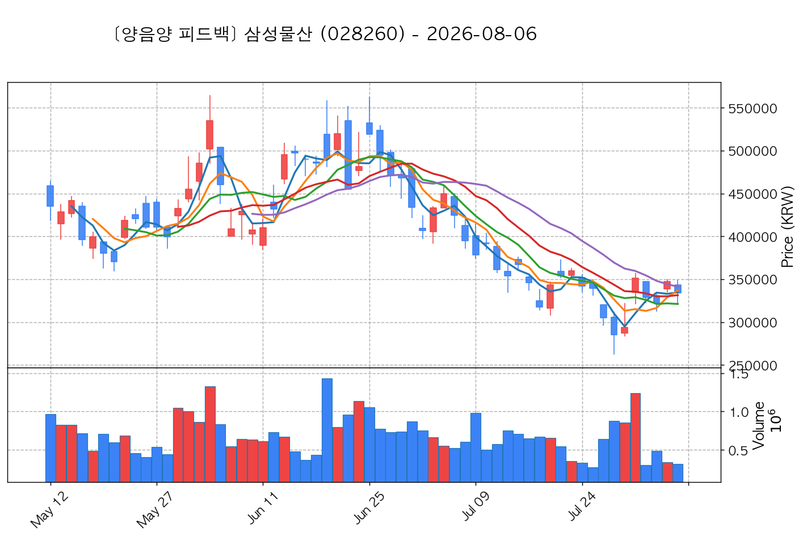

- **전일 종가(기준가)**: 347,500원 ➔ **매매일 시초가**: 343,000원 | **최고가**: 349,500원 (<b>+0.58%</b>) | **종가**: 334,000원 (-3.88%)
- **시세 움직임 복기**: 과거 2026-07-31 기준봉 후 현재 20일선 지지

#### 6) LG이노텍 (011070) — 후보군 (3위) | ⏱️ 지지선 유지 (+1.5%)

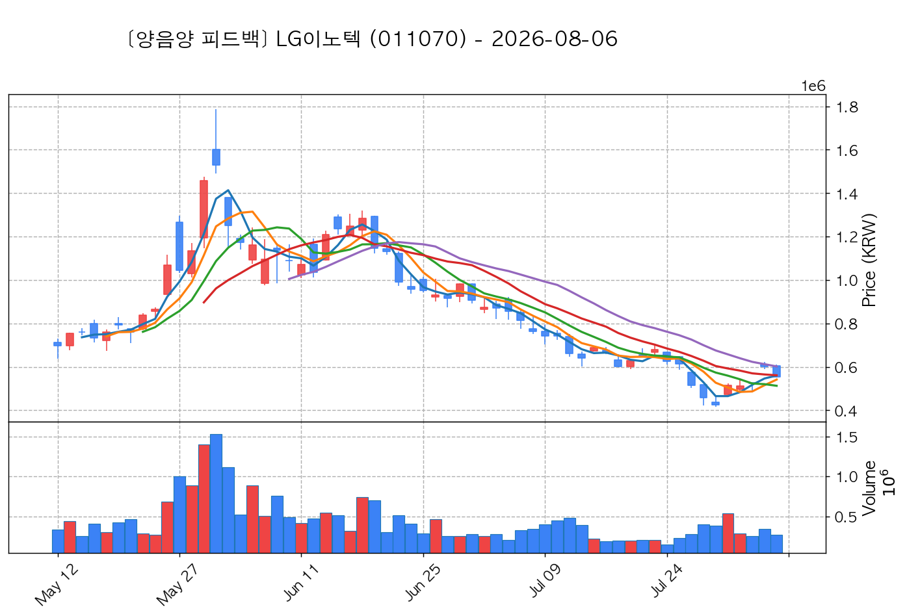

- **전일 종가(기준가)**: 601,000원 ➔ **매매일 시초가**: 605,000원 | **최고가**: 610,000원 (<b>+1.50%</b>) | **종가**: 554,000원 (-7.82%)
- **시세 움직임 복기**: 과거 2026-07-31 기준봉 후 현재 20일선 지지

#### 7) HD현대일렉트릭 (267260) — 후보군 (4위) | ⏱️ 지지선 유지 (+1.9%)

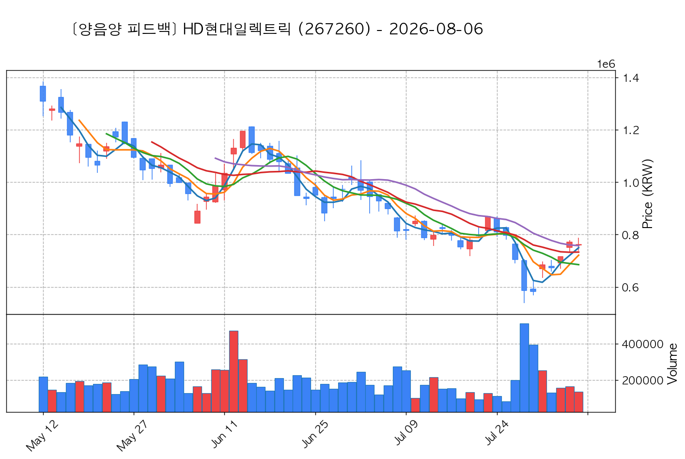

- **전일 종가(기준가)**: 772,000원 ➔ **매매일 시초가**: 760,000원 | **최고가**: 787,000원 (<b>+1.94%</b>) | **종가**: 761,000원 (-1.42%)
- **시세 움직임 복기**: 과거 2026-07-31 기준봉 후 현재 20일선 지지

#### 8) SK (034730) — 후보군 (5위) | ❌ 손절 이탈 (-2.9%)

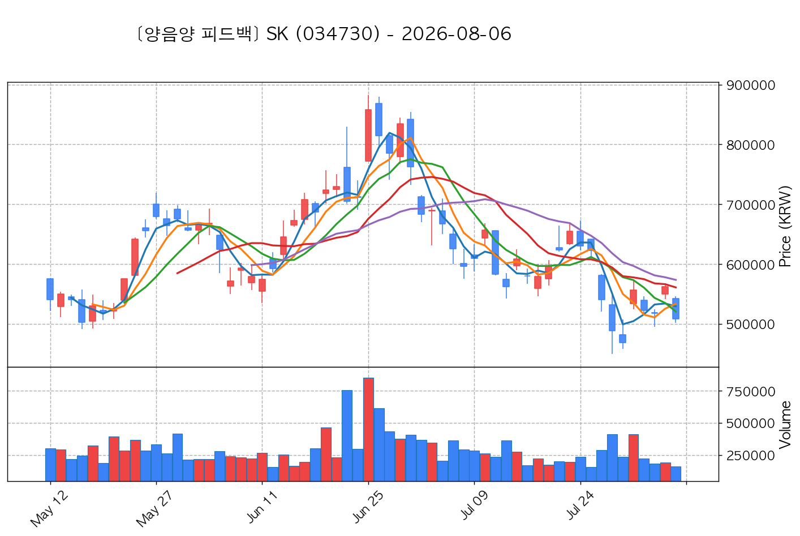

- **전일 종가(기준가)**: 562,000원 ➔ **매매일 시초가**: 543,000원 | **최고가**: 546,000원 (<b>-2.85%</b>) | **종가**: 509,000원 (-9.43%)
- **시세 움직임 복기**: 과거 2026-07-31 기준봉 후 현재 13일선 지지

#### 9) 이수페타시스 (007660) — 후보군 (6위) | ⏱️ 지지선 유지 (+1.5%)

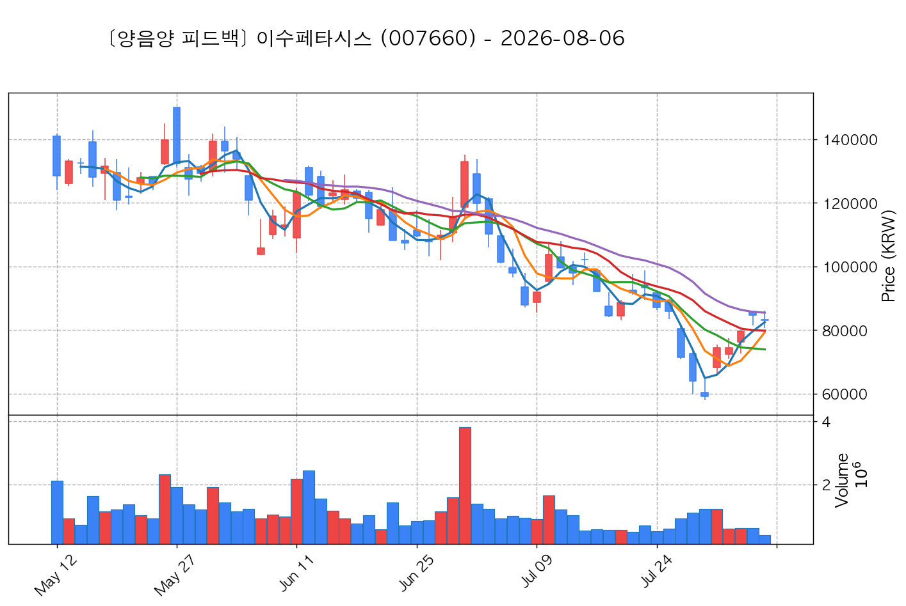

- **전일 종가(기준가)**: 84,700원 ➔ **매매일 시초가**: 83,200원 | **최고가**: 86,000원 (<b>+1.53%</b>) | **종가**: 83,100원 (-1.89%)
- **시세 움직임 복기**: 과거 2026-07-31 기준봉 후 현재 20일선 지지

#### 10) 주성엔지니어링 (036930) — 후보군 (7위) | ⏱️ 지지선 유지 (+0.4%)

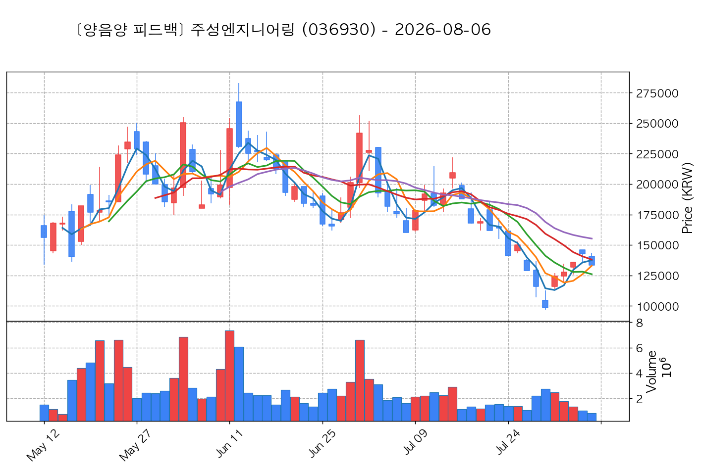

- **전일 종가(기준가)**: 142,900원 ➔ **매매일 시초가**: 140,600원 | **최고가**: 143,500원 (<b>+0.42%</b>) | **종가**: 133,400원 (-6.65%)
- **시세 움직임 복기**: 과거 2026-07-31 기준봉 후 현재 13일선 지지

## 🟡 전략 2 — 일일봉 매집봉 성과

#### 1) HL만도 (204320) — ★ TOP 1 선택 | ✅ 1차 목표 달성 (+4.2%)

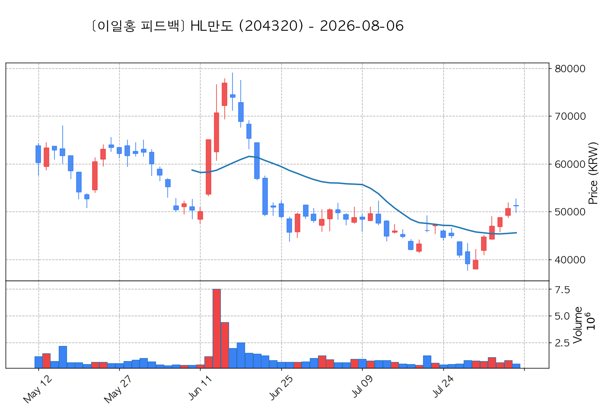

- **전일 종가(기준가)**: 50,600원 ➔ **매매일 시초가**: 51,300원 | **최고가**: 52,700원 (<b>+4.15%</b>) | **종가**: 51,200원 (+1.19%)
- **시세 움직임 복기**: 과거 2026-06-15 매집봉 ➔ 240일선 근접 지지 (+2.41%)

#### 2) 예스티 (122640) — 후보군 (1위) | ❌ 손절 이탈 (-0.5%)

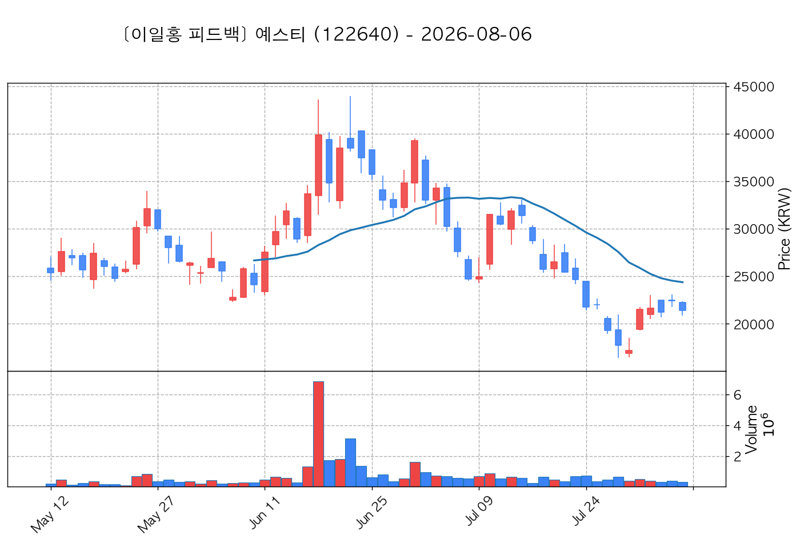

- **전일 종가(기준가)**: 22,450원 ➔ **매매일 시초가**: 22,250원 | **최고가**: 22,350원 (<b>-0.45%</b>) | **종가**: 21,400원 (-4.68%)
- **시세 움직임 복기**: 과거 2026-06-18 매집봉 ➔ 240일선 근접 지지 (+0.63%)

#### 3) 파세코 (037070) — 후보군 (2위) | ⏱️ 지지선 유지 (+2.6%)

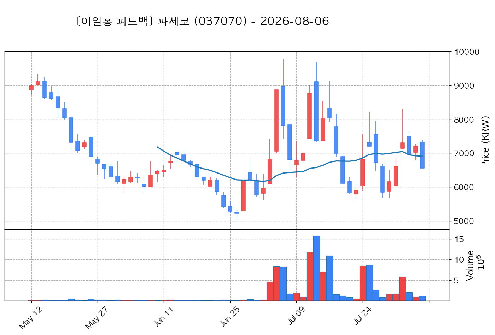

- **전일 종가(기준가)**: 7,200원 ➔ **매매일 시초가**: 7,330원 | **최고가**: 7,390원 (<b>+2.64%</b>) | **종가**: 6,550원 (-9.03%)
- **시세 움직임 복기**: 과거 2026-07-03 매집봉 ➔ 240일선 근접 지지 (-0.96%)

#### 4) 다스코 (058730) — 후보군 (3위) | ✅ 1차 목표 달성 (+3.4%)

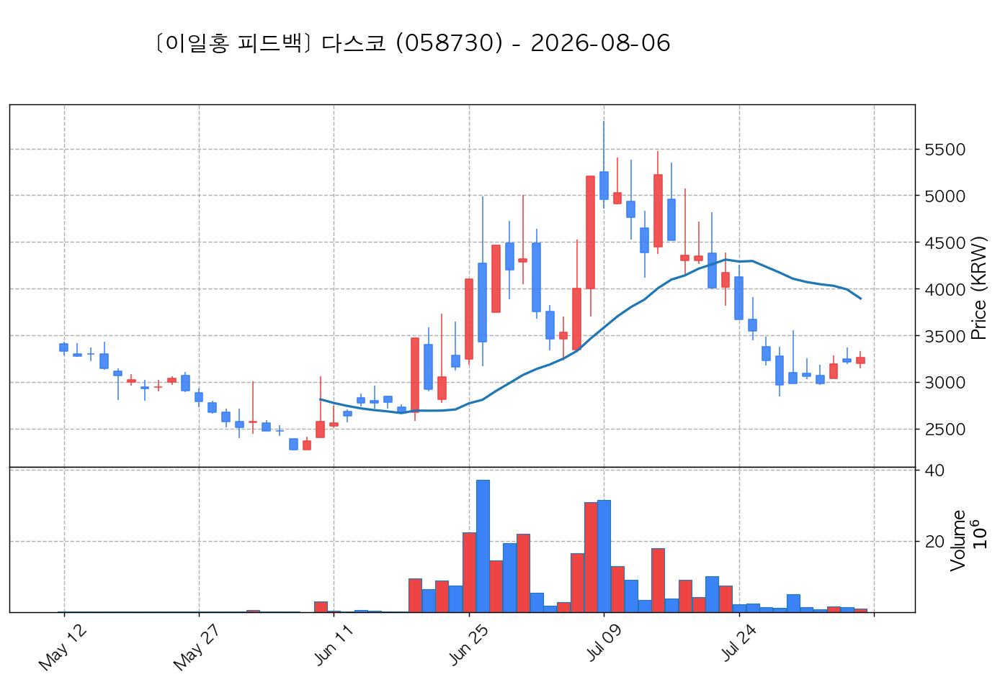

- **전일 종가(기준가)**: 3,220원 ➔ **매매일 시초가**: 3,200원 | **최고가**: 3,330원 (<b>+3.42%</b>) | **종가**: 3,260원 (+1.24%)
- **시세 움직임 복기**: 과거 2026-06-10 매집봉 ➔ 240일선 근접 지지 (-2.20%)

#### 5) 퍼스텍 (010820) — 후보군 (4위) | ✅ 1차 목표 달성 (+6.6%)

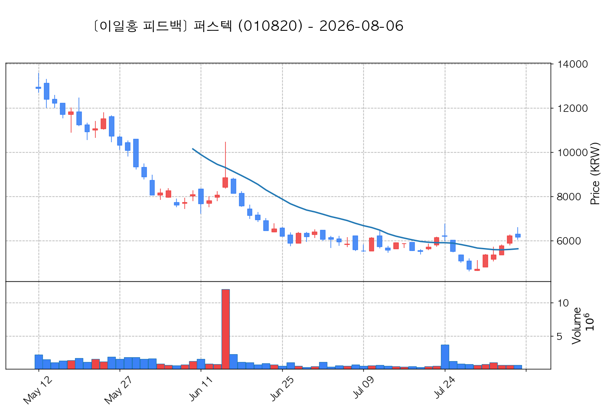

- **전일 종가(기준가)**: 6,200원 ➔ **매매일 시초가**: 6,280원 | **최고가**: 6,610원 (<b>+6.61%</b>) | **종가**: 6,160원 (-0.65%)
- **시세 움직임 복기**: 과거 2026-06-16 매집봉 ➔ 240일선 근접 지지 (-2.20%)

## 🟢 전략 3 — 수급 낙폭과대 바닥형 성과

#### 1) 한국전력 (015760) — ★ TOP 1 선택 | ⏱️ 지지선 유지 (+1.0%)

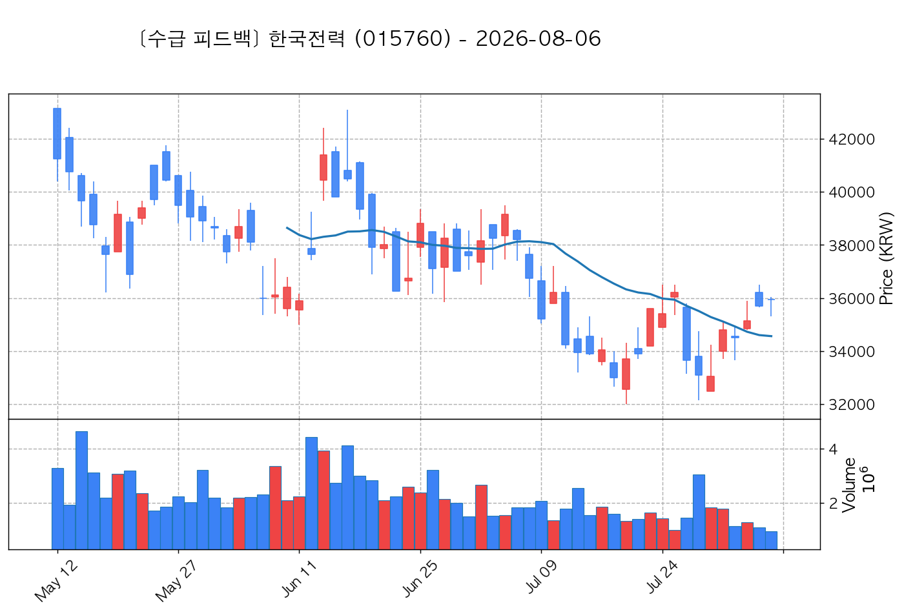

- **전일 종가(기준가)**: 35,700원 ➔ **매매일 시초가**: 35,950원 | **최고가**: 36,050원 (<b>+0.98%</b>) | **종가**: 35,950원 (+0.70%)
- **시세 움직임 복기**: 52주 고점 대비 (51.4%) ➔ 20일 메이저 수급 100억+ 유입 ➔ 없음 지지 안착

