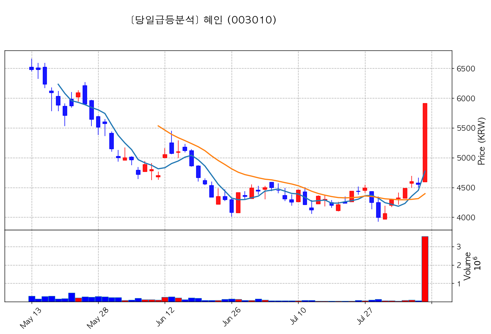
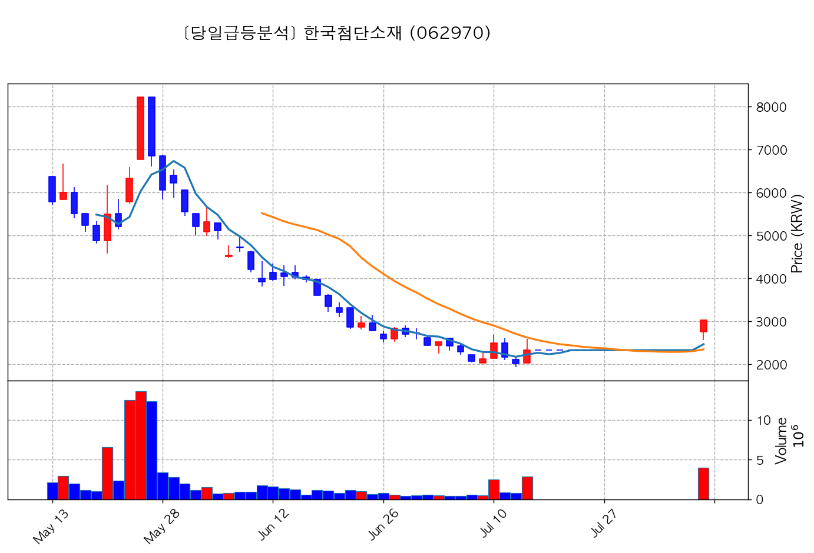
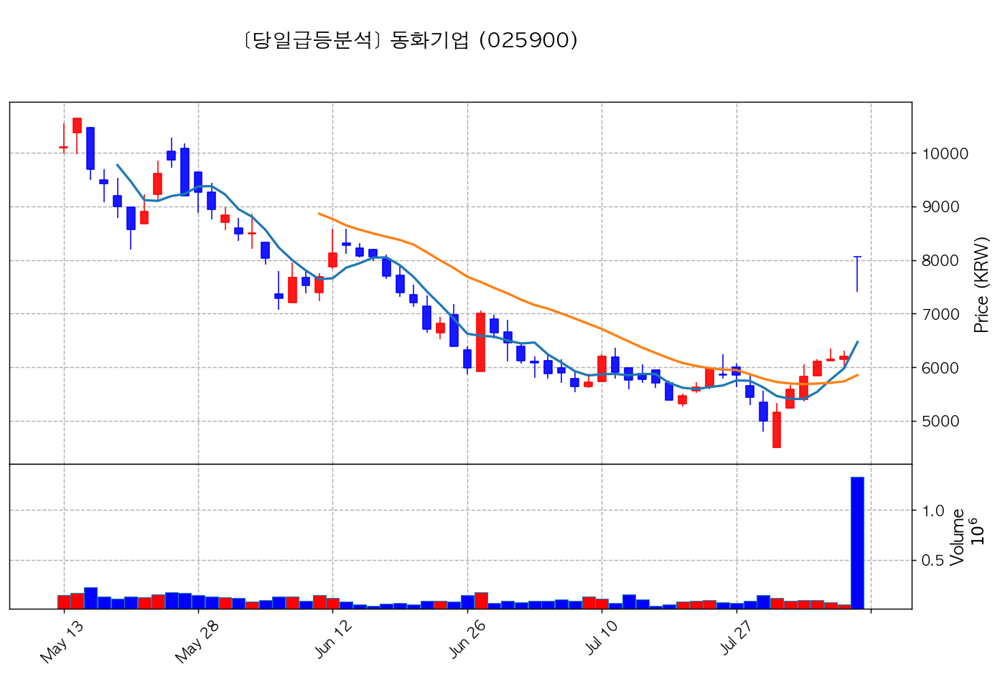
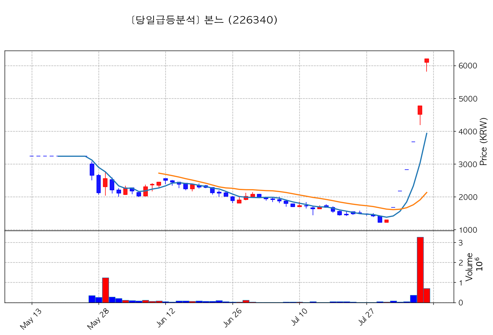
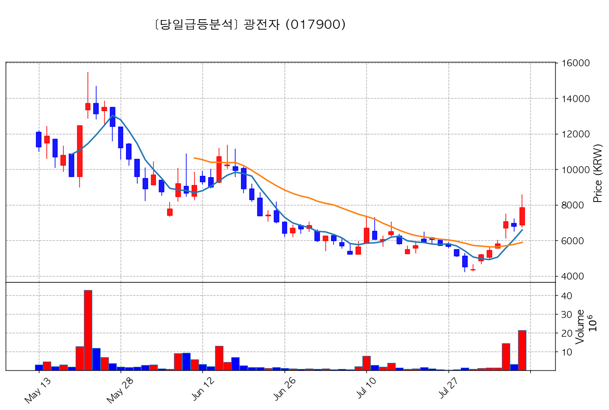
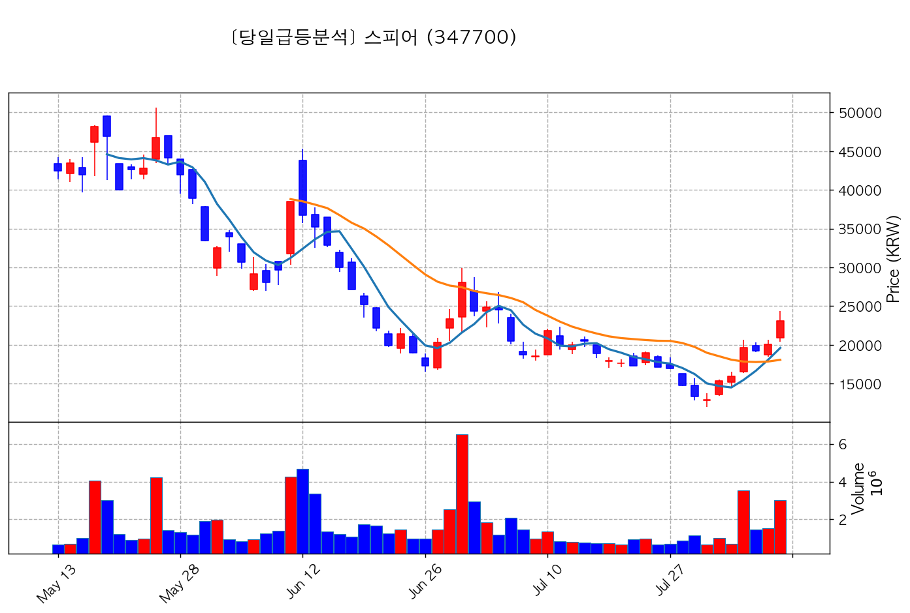
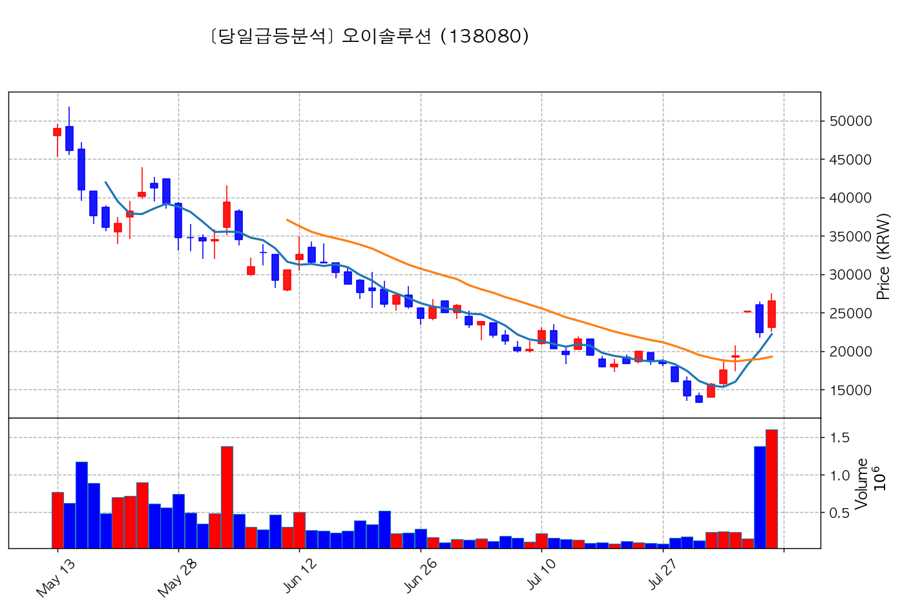
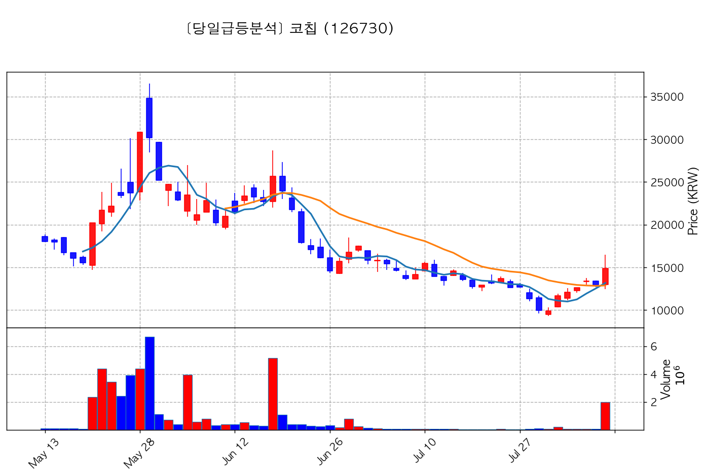

# 🔥 [당일 상한가/급등주 분석] 2026-08-07 시장 주도주 리포트

> 기준일: 2026-08-07 | [📈 매매전 스크리닝 보고서 보기](./2026-08-07_스크리닝.html)

---

## 🏆 1. 당일 상한가/하한가 달성 종목 (상위 4개)

#### 1) 혜인 (003010) — <b>+29.89%</b>

- **종가**: 5,910원 | **거래대금**: 209.8억
- **🔥 당일 핵심 뉴스**: 🔗 [[특징주] 혜인, AI 데이터센터 확대 기대감에 上](https://news.google.com/rss/articles/CBMiWEFVX3lxTE9PbUlMQ3dXT1FhRlRSOGxCX2NBeW1FMXhTQnBTUkNlY1lVRDRvdnA3Qi1FU2JmZ1BxeTFxQXBzeVRQTDI4dkhzU0Q4a0NtVnVoQmJxZ3ZKRHbSAVhBVV95cUxPT21JTEN3V09RYUZUUjhsQl9jQXltRTF4U0JwU1JDZWNZVUQ0b3ZwN0ItRVNiZmdQcXkxcUFwc3lUUEwyOHZIc1NEOGtDbVZ1aEJicWd2SkR2?oc=5)

#### 2) 한국첨단소재 (062970) — <b>+29.89%</b>

- **종가**: 3,020원 | **거래대금**: 120.3억
- **🔥 당일 핵심 뉴스**: 🔗 [[특징주] 한국첨단소재, 국제 벤치마크 등재 소식.. '상한가'](https://news.google.com/rss/articles/CBMiiAFBVV95cUxPM2MzenRNYndkald1VnFqX2poZE8ybjNSZDhzY2h3YmFzSGVyR3hUVnZKNmlWdUVRNW9BQUZhRkFnTmJHbTVaaEROeEJKX3RNSGY5OXJEMl9qZjVVMHI4LXhGalNGVnRqZEZPVGF6T3k0NGtVNU16WUF6MFV3TzhpZFFEU3RSeFZ1?oc=5)

#### 3) 동화기업 (025900) — <b>+30.00%</b>

- **종가**: 8,060원 | **거래대금**: 107.4억
- **🔥 당일 핵심 뉴스**: 🔗 [[특징주] 동화기업, 전고체 배터리용 핵심 소재 사업 확대 기대감에 급등세](https://news.google.com/rss/articles/CBMibEFVX3lxTFBDUHYyYlFuM1hfaHppaUZMUVljZFZSWlBxWEk3ZEtSNFhhOThnQ3BhRTBEeFhqZ2dpVFh3Mm1RbWFCbzh2aEZZWHctTG5qS29aYndSbktkYjVhWnB6Y1RuczZHSU1nckRSc1dvcA?oc=5)

#### 4) 본느 (226340) — <b>+29.84%</b>

- **종가**: 6,200원 | **거래대금**: 44.0억
- **🔥 당일 핵심 뉴스**: 🔗 [(특징주)본느, 경영권 인수 기대감에 4거래일 연속 상한가](https://news.google.com/rss/articles/CBMiYEFVX3lxTE94a1gwWFl2VnR4cHV2OV9tc3VJaTA5VWVFRnlua0tfYklQU3M2cG1zSzNlOHJBMkRTWEtBUW5uUkxpa3puaG1nbWpNeEx4MGt2aUlUR3BNeEpRVFoxeTJBZg?oc=5)

---

## 🚀 2. 거래대금 150억+ & +15% 이상 폭등주 (상위 4개)

#### 1) 광전자 (017900) — <b>+15.61%</b>

- **종가**: 7,850원 | **거래대금**: 1680.0억
- **🔥 당일 핵심 뉴스**: 🔗 [특징주, 광전자-마이크로 LED 테마 상승세에 5.71% ↑](https://news.google.com/rss/articles/CBMiUkFVX3lxTE1INWpJMzdUN0lqMWhnUTNyMGN5NHdVQXhIbjA2V3dOWWtpazhiNGFzNjhqVjlmSmI2ci14bk16Uk92b1ZSTzZlV1VDRjh4RDUzcFE?oc=5)

#### 2) 스피어 (347700) — <b>+15.09%</b>

- **종가**: 23,075원 | **거래대금**: 697.7억
- **🔥 당일 핵심 뉴스**: 🔗 [[특징주] 스페이스X 주가 반등에 관련주 ‘껑충’⋯스피어 18%ㆍ에이치브이엠 12%↑](https://news.google.com/rss/articles/CBMibkFVX3lxTE9OZnFsenNTUUJTYXdXaDlqMEN6M21RaW1QN29uekc1WE1vV0hMaUUxWmRQU0Q2UXM4M2ZTakc5UUJSSGROSHNBNjA0bFBMbkRQLXpQOWdiZGdScXc2cFhmejJCRFFlMFVVTXhWZG1n?oc=5)

#### 3) 오이솔루션 (138080) — <b>+18.53%</b>

- **종가**: 26,550원 | **거래대금**: 423.7억
- **🔥 당일 핵심 뉴스**: 🔗 [[ET특징주] 美 정부, 中 부품 수입 금지법 추진… 오이솔루션 등 광통신株 강세](https://news.google.com/rss/articles/CBMiTkFVX3lxTE5WNmZIcDFFd3NfdGh1bHM3X1VlMjVma0xya3FVck52SDJleG1pQ3ZWZ1V4RllTaXFIajFfcDFyWnBGc0pNNUlyTEhtbDVvZw?oc=5)

#### 4) 코칩 (126730) — <b>+15.50%</b>

- **종가**: 14,900원 | **거래대금**: 294.4억
- **🔥 당일 핵심 뉴스**: 🔗 [[특징주]코칩, AI 서버가 MLCC 싹쓸이 중... AI 서버 1대당 3만개 육박에 강세](https://news.google.com/rss/articles/CBMiTEFVX3lxTE5YOUNGdmxpLXYzcHR2U2x4MFptLVZUZTVQdXVac28wN1B0VWtyeUFaYm1zUjY4OWJ5M3hYTmJWWlVpZmxsaUpNTGJDRlA?oc=5)

