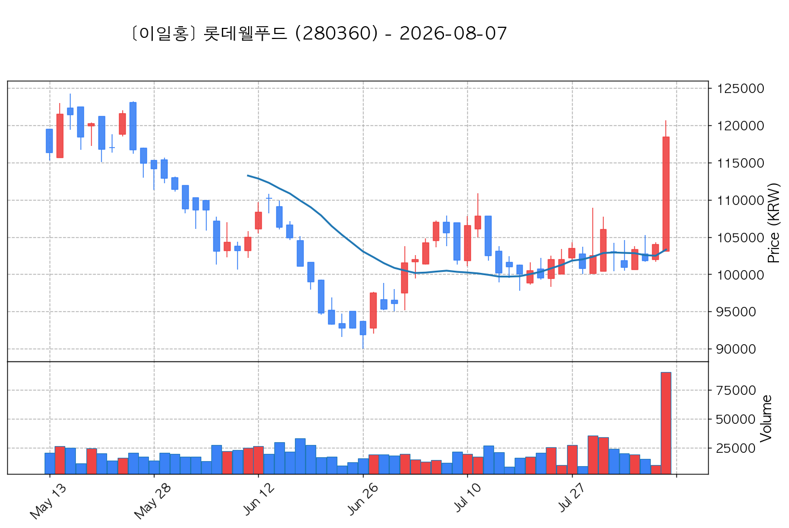
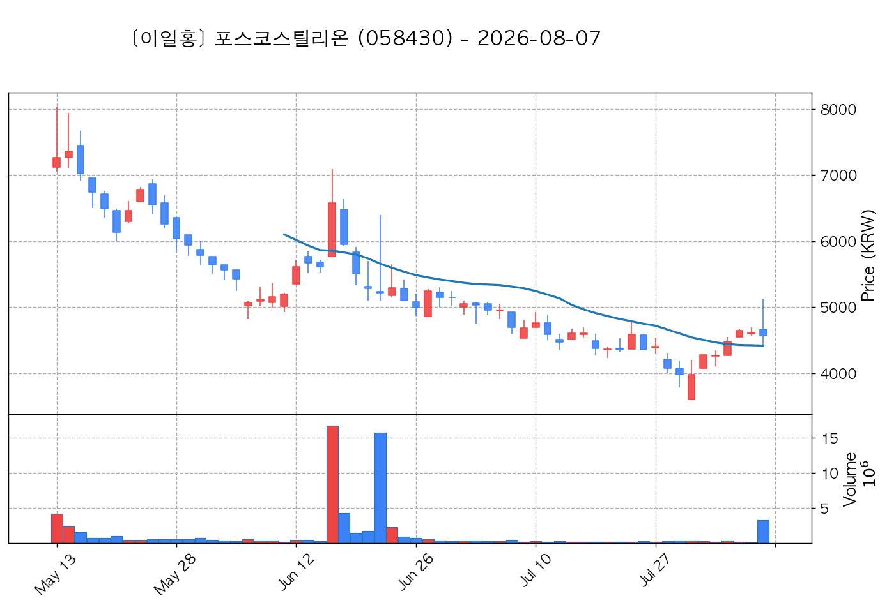

# 📈 [실전플랜 1] 2026-08-07 매매 후보 스크리닝 보고서

> 스크리닝 기준일: 2026-08-07 | [📊 익일 매매 성과 피드백 보고서 보기](./2026-08-07_피드백.html)

---

## 📊 1. 스크리닝 성과 요약

| 전략 | 주요 기법 | 종목수(TOP) |
| :--- | :--- | :---: |
| **전략 1** | 양음양 눌림목 & 사윗감 | 58개 (TOP 3개) |
| **전략 2** | 매집봉 & 이일홍 | 5개 (TOP 1개) |
| **전략 3** | 수급 & 핥 | 0개 (TOP 0개) |
| **합계** | **3대 핵심 전략 통합** | **63개 (TOP 4개)** |

---

## 🔵 3. 전략 1 — 양-음-양 눌림목 (3% × 3슬롯)

### 📋 전략 1 요약표 (상위 10개)

| 종목명 | 기준일종가 | 기준봉 | 지지선 | 비고 및 선정 상태 |
| :--- | ---: | :--- | :---: | :--- |
| **삼성전자** (005930) | 231,250원 | +26.8% 장대양봉 | 3일선 | **★ TOP 1 선택** |
| **SK이터닉스** (475150) | 50,100원 | +19.9% 장대양봉 | 8일선 | **★ TOP 2 선택** |
| **삼성전기** (009150) | 1,284,000원 | 상한가 | 3일선 | **★ TOP 3 선택** |
| **한미반도체** (042700) | 192,000원 | +28.0% 장대양봉 | 8일선 | 후보군 (1위) |
| **삼성물산** (028260) | 335,500원 | +19.6% 장대양봉 | 3일선 | 후보군 (2위) |
| **LS ELECTRIC** (010120) | 199,500원 | +23.0% 장대양봉 | 3일선 | 후보군 (3위) |
| **주성엔지니어링** (036930) | 127,200원 | +26.7% 장대양봉 | 8일선 | 후보군 (4위) |
| **LG이노텍** (011070) | 551,000원 | +21.2% 장대양봉 | 5일선 | 후보군 (5위) |
| **효성중공업** (298040) | 2,824,000원 | +27.6% 장대양봉 | 3일선 | 후보군 (6위) |
| **SK** (034730) | 505,000원 | +18.9% 장대양봉 | 8일선 | 후보군 (7위) |

---

### 🔍 전략 1 상세 분석

#### 1) 삼성전자 (005930) — ★ TOP 1 선택

- **기준 종가**: 231,250원 | **거래대금**: 42061억
- **분석 사유**: 과거 2026-07-31 기준봉 후 현재 3일선 지지

#### 2) SK이터닉스 (475150) — ★ TOP 2 선택

- **기준 종가**: 50,100원 | **거래대금**: 2451억
- **분석 사유**: 과거 2026-08-04 기준봉 후 현재 8일선 지지

#### 3) 삼성전기 (009150) — ★ TOP 3 선택

- **기준 종가**: 1,284,000원 | **거래대금**: 10701억
- **분석 사유**: 과거 2026-07-31 기준봉 후 현재 3일선 지지

#### 4) 한미반도체 (042700) — 후보군 (1위)

- **기준 종가**: 192,000원 | **거래대금**: 1331억
- **분석 사유**: 과거 2026-07-31 기준봉 후 현재 8일선 지지

#### 5) 삼성물산 (028260) — 후보군 (2위)

- **기준 종가**: 335,500원 | **거래대금**: 811억
- **분석 사유**: 과거 2026-07-31 기준봉 후 현재 3일선 지지

#### 6) LS ELECTRIC (010120) — 후보군 (3위)

- **기준 종가**: 199,500원 | **거래대금**: 1302억
- **분석 사유**: 과거 2026-07-31 기준봉 후 현재 3일선 지지

#### 7) 주성엔지니어링 (036930) — 후보군 (4위)

- **기준 종가**: 127,200원 | **거래대금**: 1007억
- **분석 사유**: 과거 2026-07-31 기준봉 후 현재 8일선 지지

#### 8) LG이노텍 (011070) — 후보군 (5위)

- **기준 종가**: 551,000원 | **거래대금**: 1154억
- **분석 사유**: 과거 2026-07-31 기준봉 후 현재 5일선 지지

#### 9) 효성중공업 (298040) — 후보군 (6위)

- **기준 종가**: 2,824,000원 | **거래대금**: 1450억
- **분석 사유**: 과거 2026-07-31 기준봉 후 현재 3일선 지지

#### 10) SK (034730) — 후보군 (7위)

- **기준 종가**: 505,000원 | **거래대금**: 596억
- **분석 사유**: 과거 2026-07-31 기준봉 후 현재 8일선 지지

## 🟡 4. 전략 2 — 일일봉 매집봉 (10% × 1슬롯)

### 📋 전략 2 요약표 (상위 5개)

| 종목명 | 기준일종가 | 기준봉 | 지지선 | 비고 및 선정 상태 |
| :--- | ---: | :--- | :---: | :--- |
| **롯데웰푸드** (280360) | 118,400원 | ★ [1순위 키움정석] 40일 최고가 근접 + 60일선 상승 + 시가대비 +14.8% 속양봉 | 240일선 | **★ TOP 1 선택** |
| **신스틸** (162300) | 1,829원 | ★ [1순위 키움정석] 40일 최고가 근접 + 60일선 상승 + 시가대비 +29.4% 속양봉 | 240일선 | 후보군 (1위) |
| **HL만도** (204320) | 50,500원 | 과거 2026-06-15 매집봉 ➔ 240일선 근접 지지 (+1.92%) | 240일선 | 후보군 (2위) |
| **포스코스틸리온** (058430) | 4,567원 | 과거 2026-06-17 매집봉 ➔ 240일선 근접 지지 (+0.45%) | 240일선 | 후보군 (3위) |
| **다스코** (058730) | 3,315원 | 과거 2026-06-22 매집봉 ➔ 240일선 근접 지지 (+0.65%) | 240일선 | 후보군 (4위) |

---

### 🔍 전략 2 상세 분석

#### 1) 롯데웰푸드 (280360) — ★ TOP 1 선택

- **기준 종가**: 118,400원 | **거래대금**: 107억
- **분석 사유**: ★ [1순위 키움정석] 40일 최고가 근접 + 60일선 상승 + 시가대비 +14.8% 속양봉

#### 2) 신스틸 (162300) — 후보군 (1위)

- **기준 종가**: 1,829원 | **거래대금**: 89억
- **분석 사유**: ★ [1순위 키움정석] 40일 최고가 근접 + 60일선 상승 + 시가대비 +29.4% 속양봉

#### 3) HL만도 (204320) — 후보군 (2위)

- **기준 종가**: 50,500원 | **거래대금**: 154억
- **분석 사유**: 과거 2026-06-15 매집봉 ➔ 240일선 근접 지지 (+1.92%)

#### 4) 포스코스틸리온 (058430) — 후보군 (3위)

- **기준 종가**: 4,567원 | **거래대금**: 149억
- **분석 사유**: 과거 2026-06-17 매집봉 ➔ 240일선 근접 지지 (+0.45%)

#### 5) 다스코 (058730) — 후보군 (4위)

- **기준 종가**: 3,315원 | **거래대금**: 62억
- **분석 사유**: 과거 2026-06-22 매집봉 ➔ 240일선 근접 지지 (+0.65%)

## 🟢 5. 전략 3 — 수급 낙폭과대 바닥형 (10% × 2슬롯)

해당 전략 포착 종목 없음

