# 📊 [실전플랜 1 피드백] 2026-08-07 매매 성과 추적 보고서

> 스크리닝 포착일: 2026-08-06 (종가) | 실제 매매(추적일): 2026-08-07 (매매일) | [📈 매매전 스크리닝 보고서 보기](./2026-08-06_스크리닝.html)

---

## 📊 1. 당일 매매 성과 요약
- **포착 및 검증 종목 수**: 총 61개 종목

---

## 🔵 전략 1 — 양-음-양 눌림목 성과

#### 1) 삼성전자 (005930) — ★ TOP 1 선택 | ⏱️ 지지선 유지 (+3.9%)

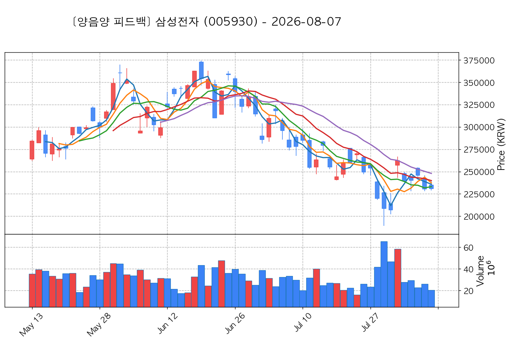

- **전일 종가(기준가)**: 230,500원 ➔ **매매일 시초가**: 235,000원 | **최고가**: 239,500원 (<b>+3.90%</b>) | **종가**: 231,000원 (+0.22%)
- **시세 움직임 복기**: 과거 2026-07-31 기준봉 후 현재 8일선 지지

#### 2) SK하이닉스 (000660) — ★ TOP 2 선택 | ⏱️ 지지선 유지 (+3.1%)

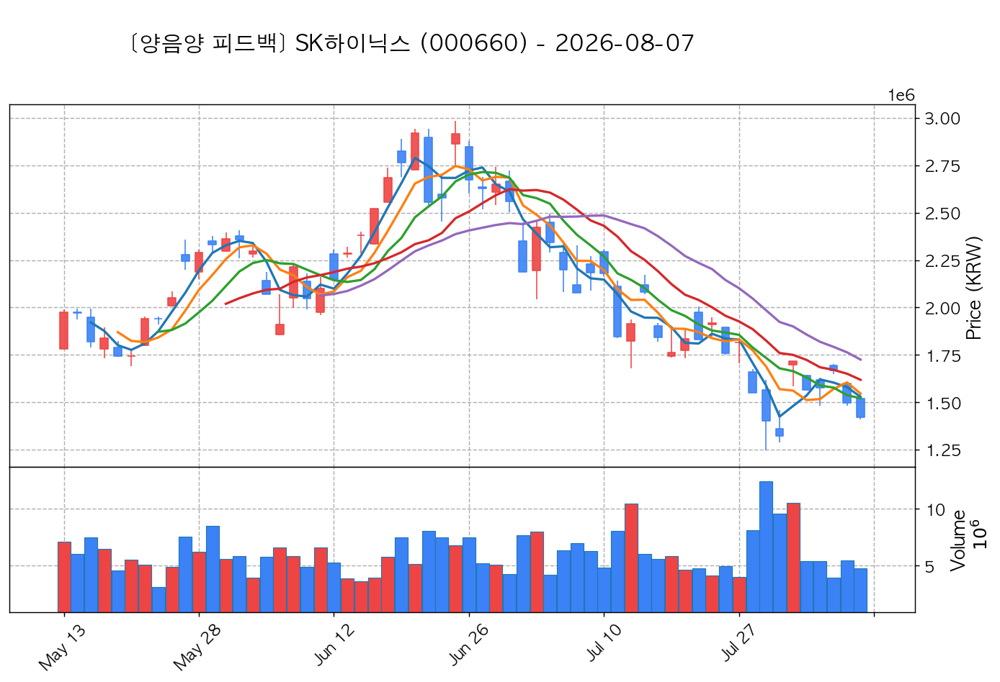

- **전일 종가(기준가)**: 1,495,000원 ➔ **매매일 시초가**: 1,521,000원 | **최고가**: 1,542,000원 (<b>+3.14%</b>) | **종가**: 1,422,000원 (-4.88%)
- **시세 움직임 복기**: 과거 2026-07-31 기준봉 후 현재 8일선 지지

#### 3) SK스퀘어 (402340) — ★ TOP 3 선택 | ⏱️ 지지선 유지 (+3.7%)

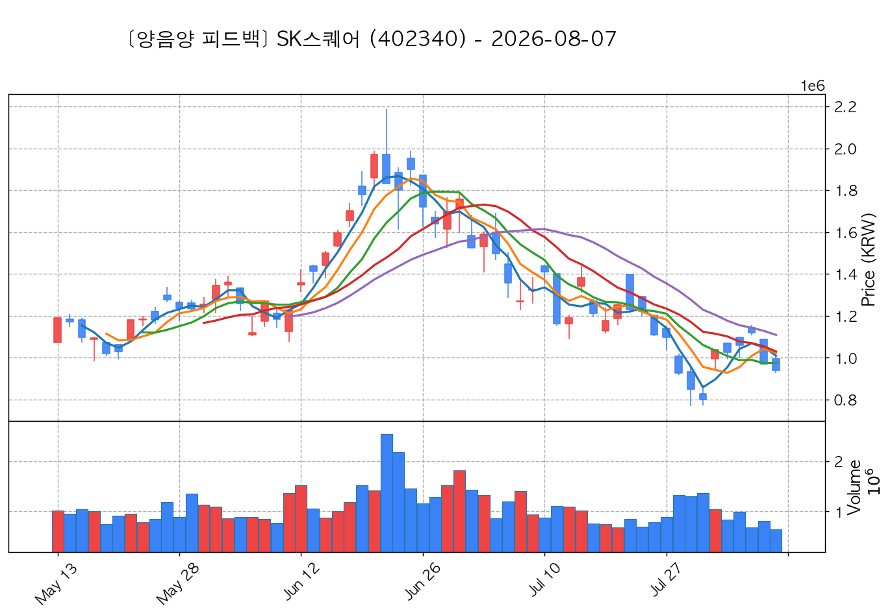

- **전일 종가(기준가)**: 970,000원 ➔ **매매일 시초가**: 996,000원 | **최고가**: 1,006,000원 (<b>+3.71%</b>) | **종가**: 939,000원 (-3.20%)
- **시세 움직임 복기**: 과거 2026-07-31 기준봉 후 현재 8일선 지지

#### 4) 두산 (000150) — 후보군 (1위) | ⏱️ 지지선 유지 (+3.1%)

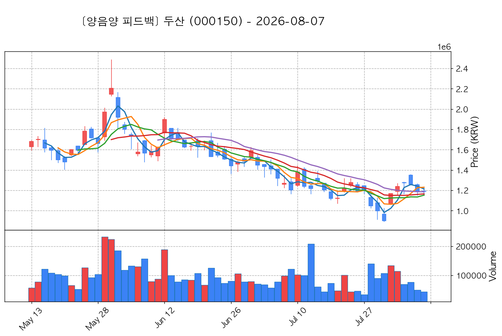

- **전일 종가(기준가)**: 1,188,000원 ➔ **매매일 시초가**: 1,192,000원 | **최고가**: 1,225,000원 (<b>+3.11%</b>) | **종가**: 1,191,000원 (+0.25%)
- **시세 움직임 복기**: 과거 2026-07-31 기준봉 후 현재 20일선 지지

#### 5) 삼성물산 (028260) — 후보군 (2위) | ⏱️ 지지선 유지 (+1.4%)

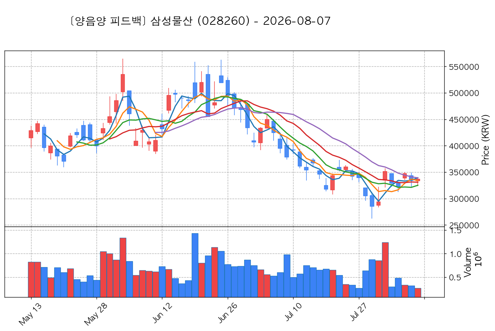

- **전일 종가(기준가)**: 334,000원 ➔ **매매일 시초가**: 333,500원 | **최고가**: 338,500원 (<b>+1.35%</b>) | **종가**: 336,500원 (+0.75%)
- **시세 움직임 복기**: 과거 2026-07-31 기준봉 후 현재 3일선 지지

#### 6) 코스모로보틱스 (439960) — 후보군 (3위) | ⏱️ 지지선 유지 (+2.5%)

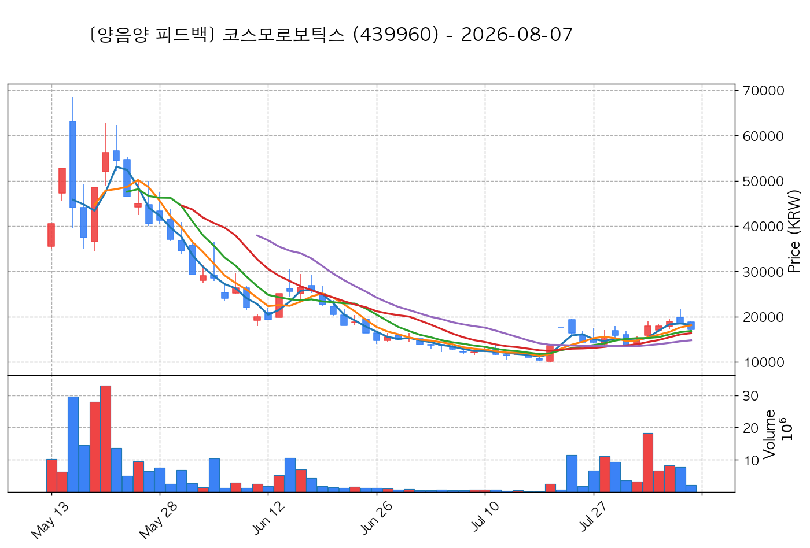

- **전일 종가(기준가)**: 18,460원 ➔ **매매일 시초가**: 18,850원 | **최고가**: 18,920원 (<b>+2.49%</b>) | **종가**: 17,130원 (-7.20%)
- **시세 움직임 복기**: 과거 2026-08-03 기준봉 후 현재 3일선 지지

#### 7) SK이터닉스 (475150) — 후보군 (4위) | ✅ 1차 목표 달성 (+7.5%)

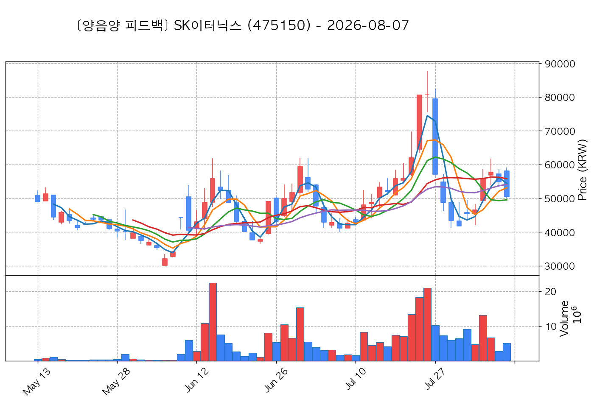

- **전일 종가(기준가)**: 55,000원 ➔ **매매일 시초가**: 58,100원 | **최고가**: 59,100원 (<b>+7.45%</b>) | **종가**: 50,500원 (-8.18%)
- **시세 움직임 복기**: 과거 2026-08-04 기준봉 후 현재 3일선 지지

#### 8) 피에스케이 (319660) — 후보군 (5위) | ✅ 1차 목표 달성 (+6.4%)

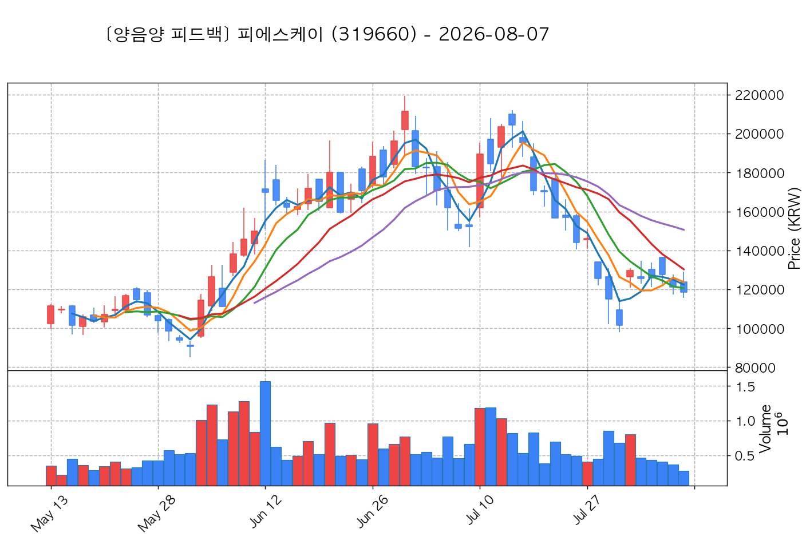

- **전일 종가(기준가)**: 121,200원 ➔ **매매일 시초가**: 123,800원 | **최고가**: 129,000원 (<b>+6.44%</b>) | **종가**: 118,400원 (-2.31%)
- **시세 움직임 복기**: 과거 2026-07-31 기준봉 후 현재 8일선 지지

#### 9) 삼성전기 (009150) — 후보군 (6위) | ✅ 1차 목표 달성 (+6.1%)

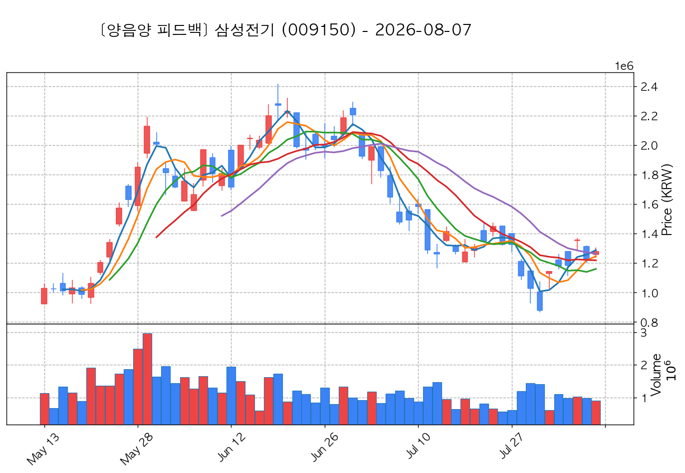

- **전일 종가(기준가)**: 1,229,000원 ➔ **매매일 시초가**: 1,259,000원 | **최고가**: 1,304,000원 (<b>+6.10%</b>) | **종가**: 1,278,000원 (+3.99%)
- **시세 움직임 복기**: 과거 2026-07-31 기준봉 후 현재 3일선 지지

#### 10) LS ELECTRIC (010120) — 후보군 (7위) | ⏱️ 지지선 유지 (+2.0%)

- **전일 종가(기준가)**: 202,500원 ➔ **매매일 시초가**: 206,000원 | **최고가**: 206,500원 (<b>+1.98%</b>) | **종가**: 201,000원 (-0.74%)
- **시세 움직임 복기**: 과거 2026-07-31 기준봉 후 현재 3일선 지지

## 🟡 전략 2 — 일일봉 매집봉 성과

#### 1) BGF리테일 (282330) — ★ TOP 1 선택 | ✅ 1차 목표 달성 (+16.9%)

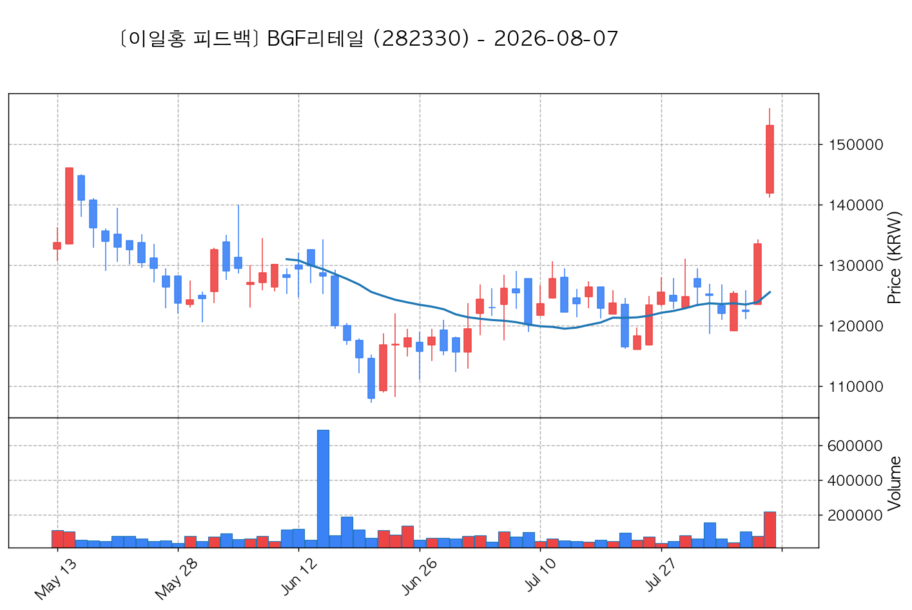

- **전일 종가(기준가)**: 133,500원 ➔ **매매일 시초가**: 141,900원 | **최고가**: 156,000원 (<b>+16.85%</b>) | **종가**: 153,100원 (+14.68%)
- **시세 움직임 복기**: ★ [1순위 키움정석] 40일 최고가 근접 + 60일선 상승 + 시가대비 +8.1% 속양봉

#### 2) GS리테일 (007070) — 후보군 (1위) | ✅ 1차 목표 달성 (+9.4%)

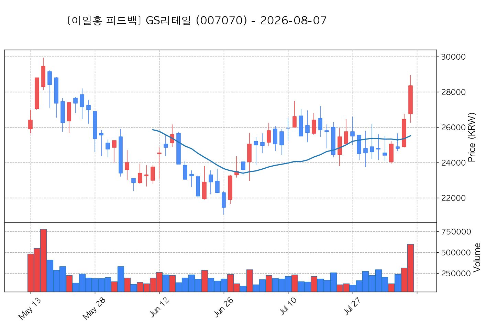

- **전일 종가(기준가)**: 26,450원 ➔ **매매일 시초가**: 26,750원 | **최고가**: 28,950원 (<b>+9.45%</b>) | **종가**: 28,350원 (+7.18%)
- **시세 움직임 복기**: ★ [1순위 키움정석] 40일 최고가 근접 + 60일선 상승 + 시가대비 +6.2% 속양봉

#### 3) 다스코 (058730) — 후보군 (2위) | ✅ 1차 목표 달성 (+7.4%)

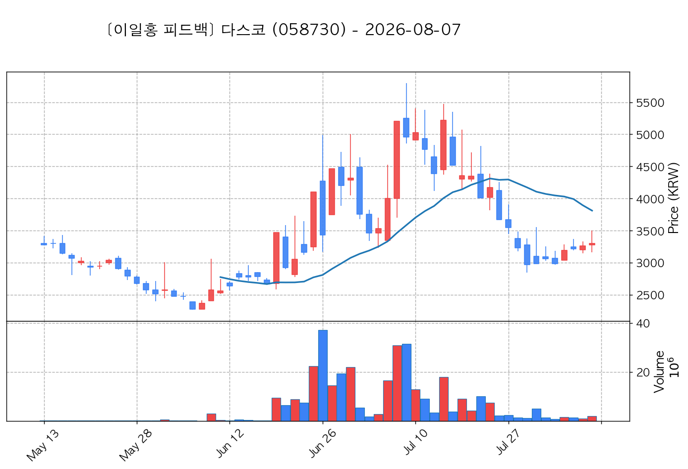

- **전일 종가(기준가)**: 3,260원 ➔ **매매일 시초가**: 3,280원 | **최고가**: 3,500원 (<b>+7.36%</b>) | **종가**: 3,300원 (+1.23%)
- **시세 움직임 복기**: 과거 2026-06-22 매집봉 ➔ 240일선 근접 지지 (-1.00%)

#### 4) 강스템바이오텍 (217730) — 후보군 (3위) | ✅ 1차 목표 달성 (+12.1%)

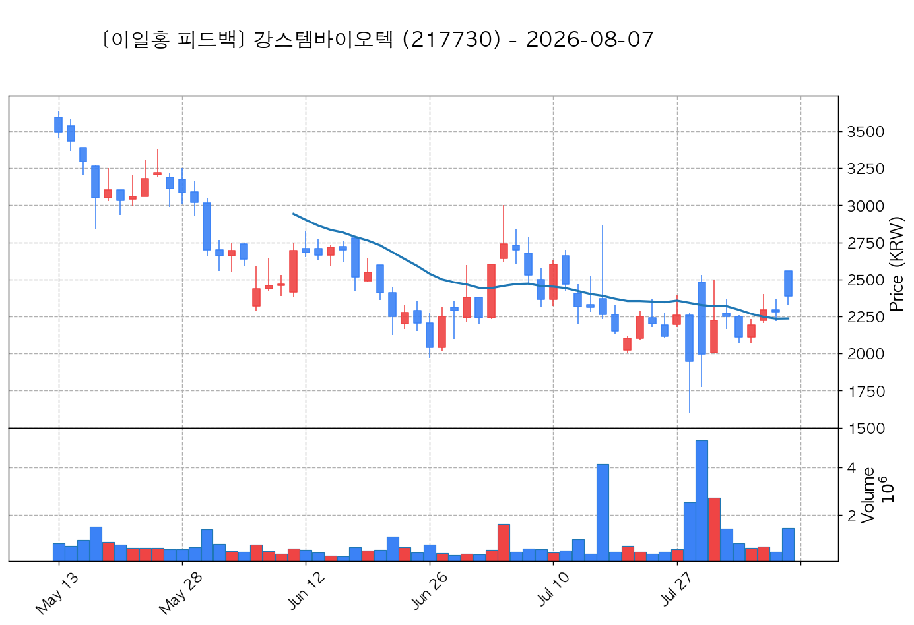

- **전일 종가(기준가)**: 2,280원 ➔ **매매일 시초가**: 2,555원 | **최고가**: 2,555원 (<b>+12.06%</b>) | **종가**: 2,390원 (+4.82%)
- **시세 움직임 복기**: 과거 2026-07-16 매집봉 ➔ 240일선 근접 지지 (+2.37%)

#### 5) 포스코스틸리온 (058430) — 후보군 (4위) | ✅ 1차 목표 달성 (+11.2%)

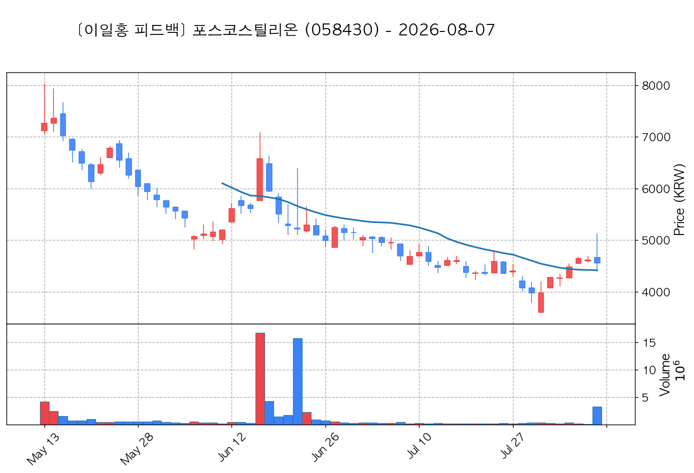

- **전일 종가(기준가)**: 4,615원 ➔ **매매일 시초가**: 4,665원 | **최고가**: 5,130원 (<b>+11.16%</b>) | **종가**: 4,555원 (-1.30%)
- **시세 움직임 복기**: 과거 2026-06-17 매집봉 ➔ 240일선 근접 지지 (+1.56%)

## 🟢 전략 3 — 수급 낙폭과대 바닥형 성과

#### 1) 대우건설 (047040) — ★ TOP 1 선택 | ✅ 1차 목표 달성 (+3.9%)

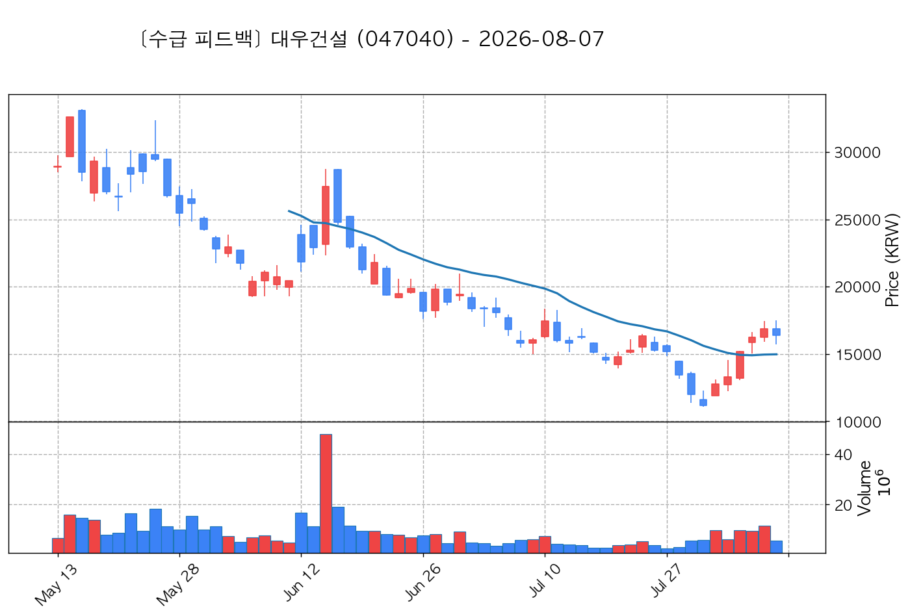

- **전일 종가(기준가)**: 16,870원 ➔ **매매일 시초가**: 16,870원 | **최고가**: 17,520원 (<b>+3.85%</b>) | **종가**: 16,410원 (-2.73%)
- **시세 움직임 복기**: 52주 고점 대비 (41.8%) ➔ 20일 메이저 수급 100억+ 유입 ➔ 없음 지지 안착

