# 🔥 [당일 상한가/급등주 분석] 2026-08-10 시장 주도주 리포트

> 기준일: 2026-08-10 | [📈 매매전 스크리닝 보고서 보기](./2026-08-10_스크리닝.html)

---

## 🏆 1. 당일 상한가/하한가 달성 종목 (상위 5개)

#### 1) 윙입푸드 (900340) — <b>+29.99%</b>

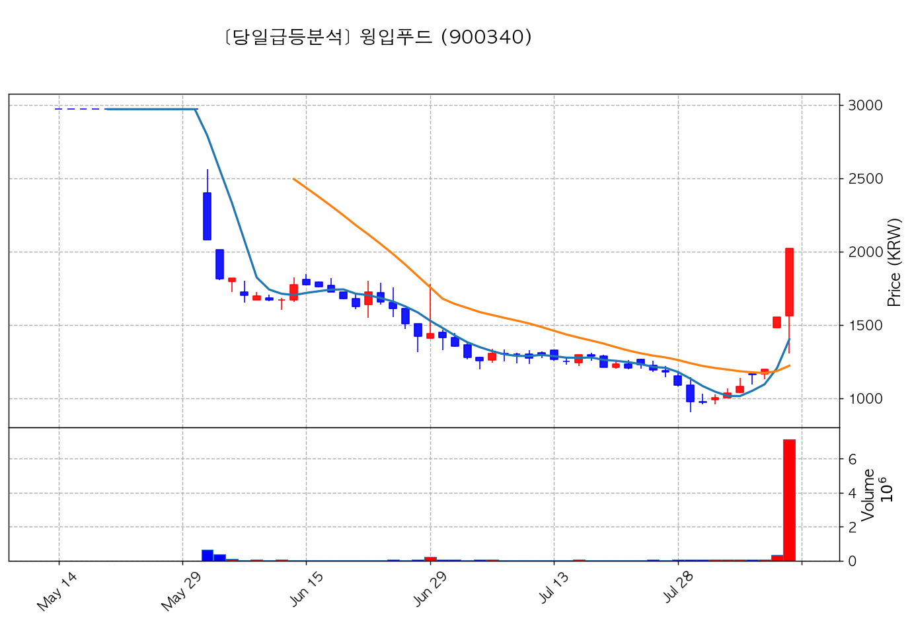

- **종가**: 2,020원 | **거래대금**: 144.2억
- **🔥 당일 핵심 뉴스**: 🔗 [[특징주] 윙입푸드, 대표이사 장내매수·최대주주 유상증자 소식에 ‘上’ - 조선비즈](https://news.google.com/rss/articles/CBMiiAFBVV95cUxPN1JzMnRUeDVZVmNaVzBRMWpVdWNEd2tkbTNiXzhFcjYtZ2VIbUIta1hFOExrRHg2NEI3YlNXSjctZmRnNVZLRl9oZTMwaXc3cjZJWVRINEF5WkszTzBjeU5GX3hkTF9UbWxZMmM1MWpQTTh2M2h1ZktoaW8wWWNEUGxnNy1mLWNl0gGcAUFVX3lxTE9iTWJBdmJ2OFI3SmJyY3ZkUEs0b2l4M2YyaWxxUVdVMENKN2tpYl90RTBRdTA5aEp2WkR4Tks3Z2RsZzRpOGo1RmdiZ0xxOThZZDNIaktnSDNkclZDSHFzZElPZXFkdGQwSFNPalhEOWxWdnJtMEUtQ2pjTnJLX2xhSnBreHF0dktQYmR4OEl3Y2lPTlhST0J6R1UyOQ?oc=5)
- **📜 과거 부각 이력**: `2026-08-09 위클리브리핑` 이력 있음

#### 2) 비츠로넥스텍 (488900) — <b>+29.93%</b>

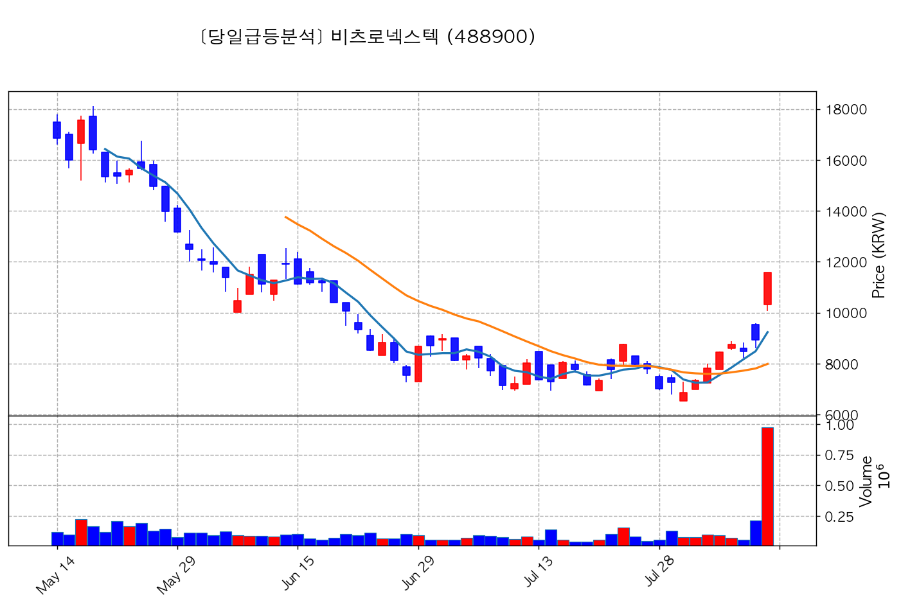

- **종가**: 11,590원 | **거래대금**: 112.7억
- **🔥 당일 핵심 뉴스**: 🔗 [[특징주] 비츠로넥스텍, 누리호 엔진 핵심부품 수주에 프리마켓서 30%↑](https://news.google.com/rss/articles/CBMiXEFVX3lxTE5pdURrTFRpV0V6NzJTRVZ3T2t0YUV0dkx5dUlzZnR5X1IzMTRkN2ZJQkxJbnJETmJoY1kwZFZHYzdZcl9NTnIwc2loTGxPQVZvV2FoY0xaazBUdmNG?oc=5)

#### 3) 해성옵틱스 (076610) — <b>+29.93%</b>

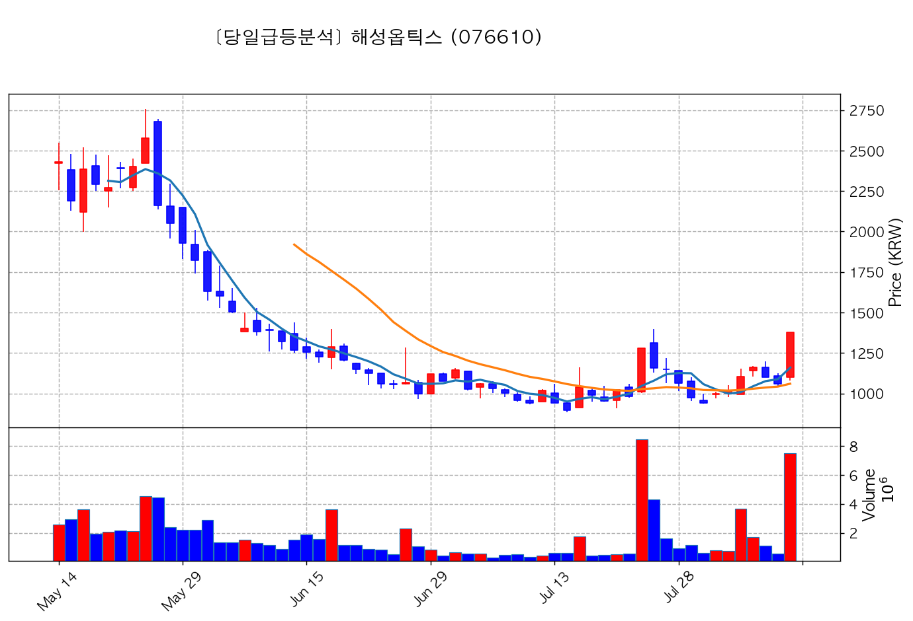

- **종가**: 1,376원 | **거래대금**: 103.4억
- **🔥 당일 핵심 뉴스**: 🔗 [[특징주] 해성옵틱스, “삼성전기 휴머노이드용 카메라 모듈 개발“에 밸류체인 부각되며 ‘급등‘](https://news.google.com/rss/articles/CBMibEFVX3lxTFBhU1hsbzBNWXMyeEdtaFRQQXJFVlNDQU1lSzVzbXl0MnZTZHl1ZEJTa3JnbjNuSXNmZUQ2SkM1U190V2N3OVZVdDBHQUpzTnJ0c3VDaDFRZ193c1N5blU4dHJreV81SE9Rb0VWUw?oc=5)

#### 4) LK삼양 (225190) — <b>+29.92%</b>

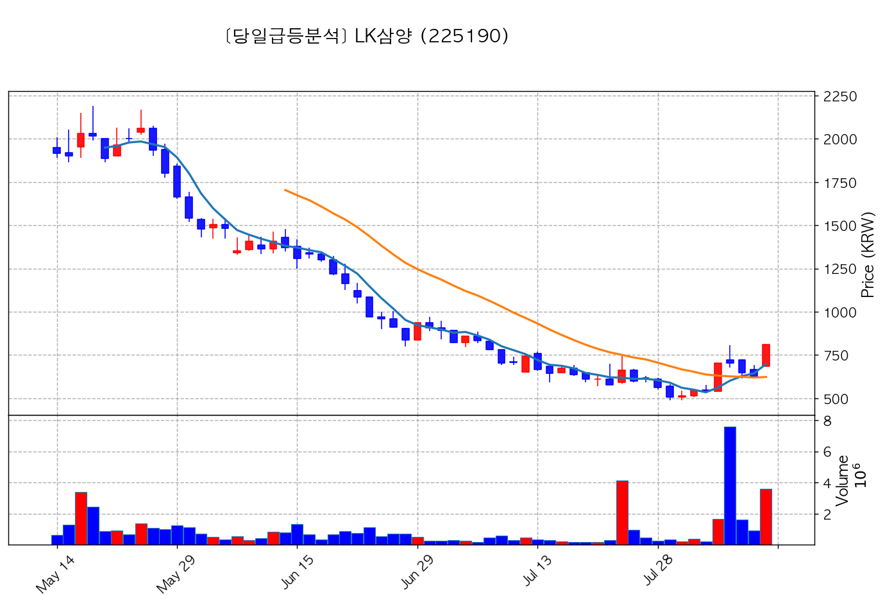

- **종가**: 812원 | **거래대금**: 29.4억
- **🔥 당일 핵심 뉴스**: 🔗 [특징주, LK삼양-우주항공산업(누리호/인공위성 등) 테마 상승세에 14.72% ↑](https://news.google.com/rss/articles/CBMiUkFVX3lxTE95bm42YU9CbjRDVzN4MnNBNW05VVdYRmRqSFV6NHNsdkpRVDR3a0hKNWw2dk5COS1mc25nWldfcUYyTld6ZHBLRGV1QXhxcWJFM3c?oc=5)

#### 5) 크리스탈신소재 (900250) — <b>+29.93%</b>

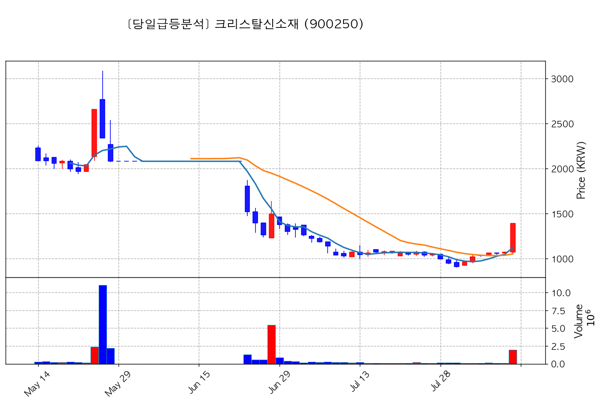

- **종가**: 1,389원 | **거래대금**: 26.8억
- **🔥 당일 핵심 뉴스**: 🔗 [[특징주] 크리스탈신소재, AI 교육 플랫폼 공동 테스트 착수에 30%↑](https://news.google.com/rss/articles/CBMiXEFVX3lxTE9FWjRyYi1zblRpUW9Xams3eEUzVWdVTzFnRG1HOUlJN3hoX00xenJFZUVpLWNTQzZmQUpaQVVGejJJU3lpNk9PZmpZRUgwbkdBM1AzelZUVWRBYzVj?oc=5)

---

## 🚀 2. 거래대금 150억+ & +15% 이상 폭등주 (상위 10개)

#### 1) 대한광통신 (010170) — <b>+18.76%</b>

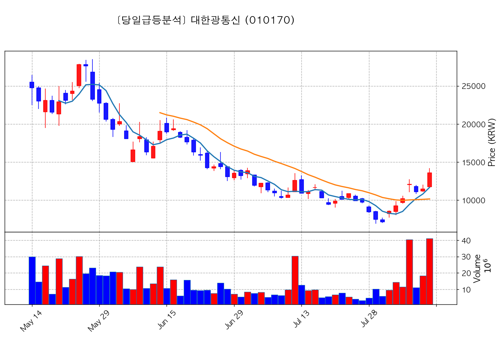

- **종가**: 13,610원 | **거래대금**: 5576.9억
- **🔥 당일 핵심 뉴스**: 🔗 [[특징주] 대한광통신, 美 광트랜시버 규제 기대감에 강세…18%↑](https://news.google.com/rss/articles/CBMiWkFVX3lxTE8xZU96cTI4ak9zeFN1MkdNMGhwVDVxaGRWamM1ODNtVXVibHJ6dENjTHY5OWJkNmY1d2hnVEVyQUh1aXRMbmpYMHZCQUkyNjVxSlpQMmxvNUx3QdIBWEFVX3lxTE93ak83Q3ZkeUNFa0lmQlpUa2xGNERwUVFibDJuTThDWi1iUUxDeUxXUjY0R2g4dXhLaW1nQmtXUHpabmV2Wm5CZDdRRWpyQmFtcXVTd1oxLUU?oc=5)

#### 2) 제주반도체 (080220) — <b>+15.78%</b>

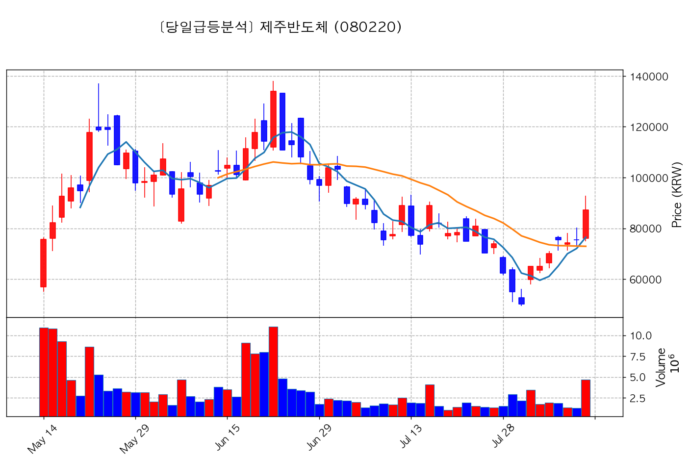

- **종가**: 87,300원 | **거래대금**: 4107.1억
- **🔥 당일 핵심 뉴스**: 🔗 [특징주, 제주반도체-온디바이스 AI 테마 상승세에 14.44% ↑](https://news.google.com/rss/articles/CBMiUkFVX3lxTE9SN0pGOWlSZFV5M2tJNGRtcS1oOXFXejd5VmFIWWxrSHNJeUpXYnJZTkdEZUluZWpubnhZUGVBemxXR3RWVnpnUTh3R0dOT1JlOFE?oc=5)
- **📜 과거 부각 이력**: `2026-08-05 피드백` 이력 있음, `2026-08-04 피드백` 이력 있음

#### 3) 산일전기 (062040) — <b>+15.83%</b>

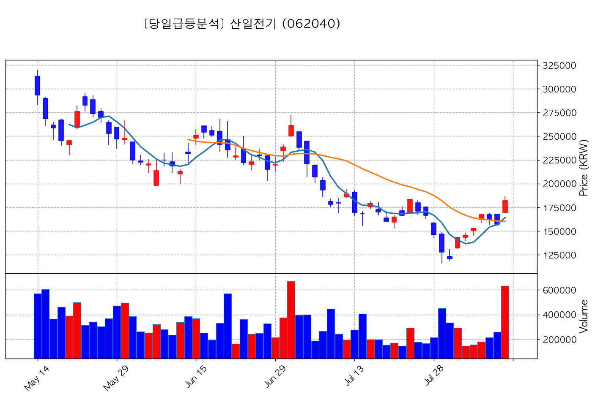

- **종가**: 182,200원 | **거래대금**: 1153.3억
- **🔥 당일 핵심 뉴스**: 🔗 [[특징주] 산일전기, 역대급 매출에 데이터센터 수주 기대감…10%대 강세](https://news.google.com/rss/articles/CBMiW0FVX3lxTE1rY1NrSm0xWm5CVFVhQk1DSWtoN2dWQ1l3dl9HR0VPbU9NZ0hjMElHNkFtb05nblQ0MzNiRXV2czR4ZmYwMWJZd0RPdlgwQk1ZaUlZc0ZpQnhFYlU?oc=5)

#### 4) 성호전자 (043260) — <b>+20.86%</b>

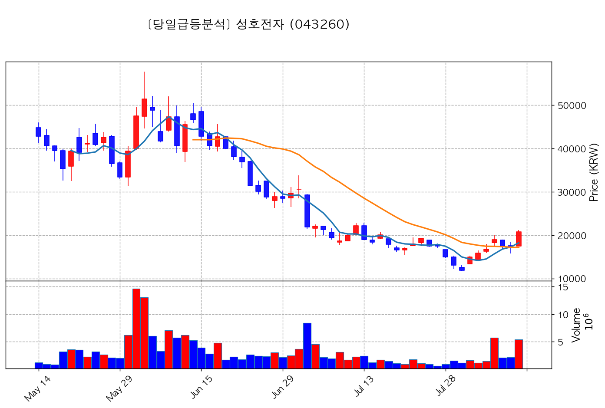

- **종가**: 20,800원 | **거래대금**: 1134.6억
- **🔥 당일 핵심 뉴스**: 🔗 [특징주, 성호전자-광통신(광케이블/광섬유 등) 테마 상승세에 10.53% ↑](https://news.google.com/rss/articles/CBMiUkFVX3lxTE1FV0NzTkF6NDdQRzVYMGF3QVJPV2Z4UnZQUTRnaHZVand4SkZxMXhwVFlaeXljb0NvT2Q4NTllLTd4LTVraDJ2YTdlbmtpR3g3M1E?oc=5)

#### 5) 미래에셋벤처투자 (100790) — <b>+15.29%</b>

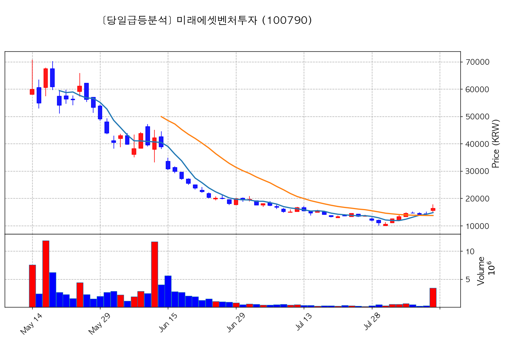

- **종가**: 16,360원 | **거래대금**: 564.8억
- **🔥 당일 핵심 뉴스**: 🔗 [특징주, 미래에셋벤처투자-스페이스X(SpaceX) 테마 상승세에 11.84% ↑](https://news.google.com/rss/articles/CBMiUkFVX3lxTE1ONV8xaXBXVjF3dFlEWmZwa0dzbmcwN19XVWtKQU5ManFfZHdmS1lZWGItZEx2M3BFYmI4c2dOXzJPbW1SR1o2MjlTZUs2TTFrN2c?oc=5)

#### 6) RF머트리얼즈 (327260) — <b>+16.50%</b>

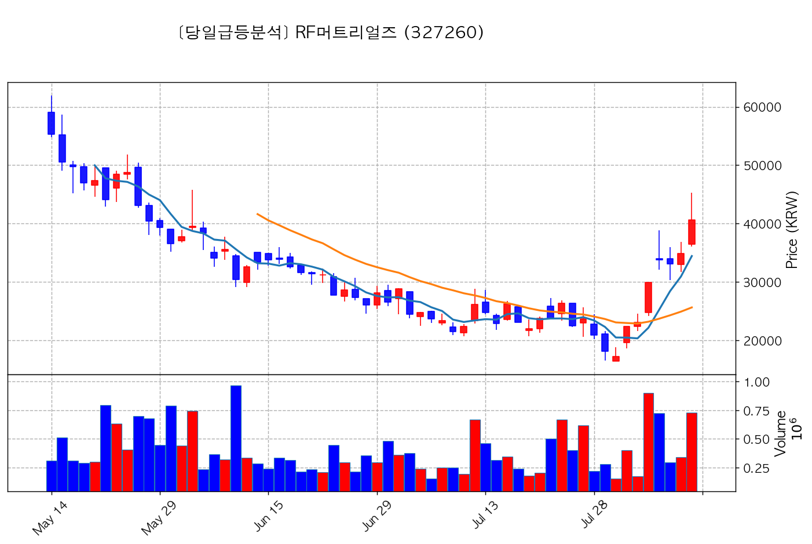

- **종가**: 40,600원 | **거래대금**: 295.8억
- **🔥 당일 핵심 뉴스**: 🔗 [특징주, RF머트리얼즈-광통신(광케이블/광섬유 등) 테마 상승세에 6.6% ↑](https://news.google.com/rss/articles/CBMiRkFVX3lxTFBKc0ZaeExld1J3TFpDLWpzWndadXZxNmQxaWoyNlFxSWhRRE9EajI5a1hIM00yNnVLUXNHa2I5MzZtVjEzSWc?oc=5)

#### 7) 코스맥스엔비티 (222040) — <b>+23.75%</b>

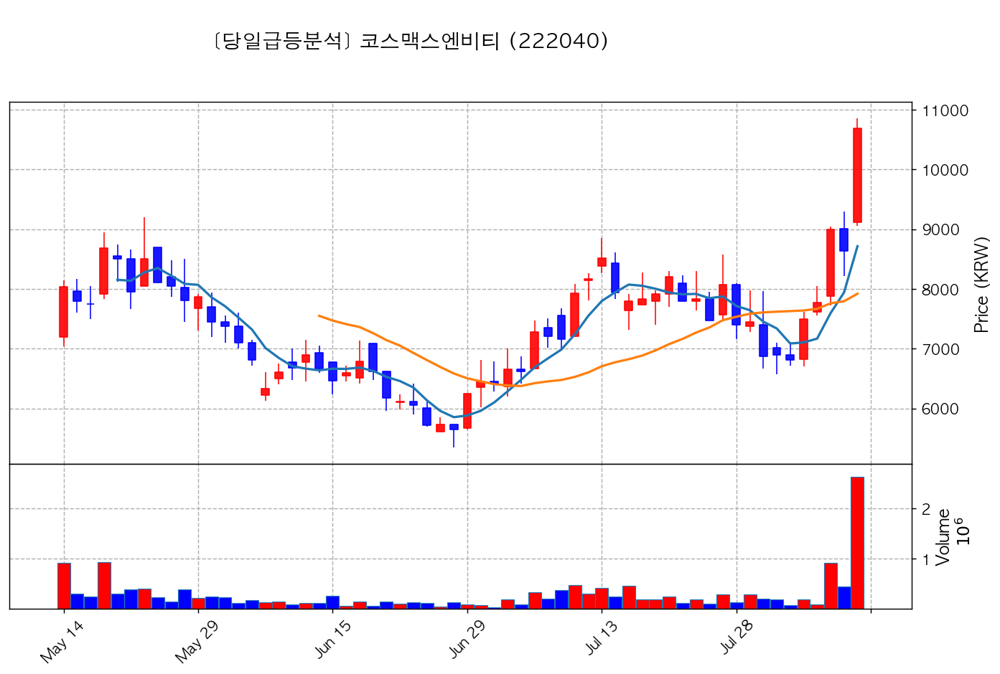

- **종가**: 10,680원 | **거래대금**: 280.6억
- **🔥 당일 핵심 뉴스**: 🔗 [2026년 1분기 실적 특징주(5월 7일 발표)](https://news.google.com/rss/articles/CBMigAFBVV95cUxQVTZ2X1hCUTJmWGVIUFk5bWxrVmZyVjhMRV96MnVaUHFQMFk3MWUxN3VRR2cxUFBUQkd0SE1TaE85MGw3ZmVzRmtLUjdab19aMHl0dXJHN0FyNGszWDVQX2hOanJDZHcwT2JjaVU0ODRFWjNEY1lobDZfR3lwbm8yOA?oc=5)

#### 8) 보로노이 (310210) — <b>+19.36%</b>

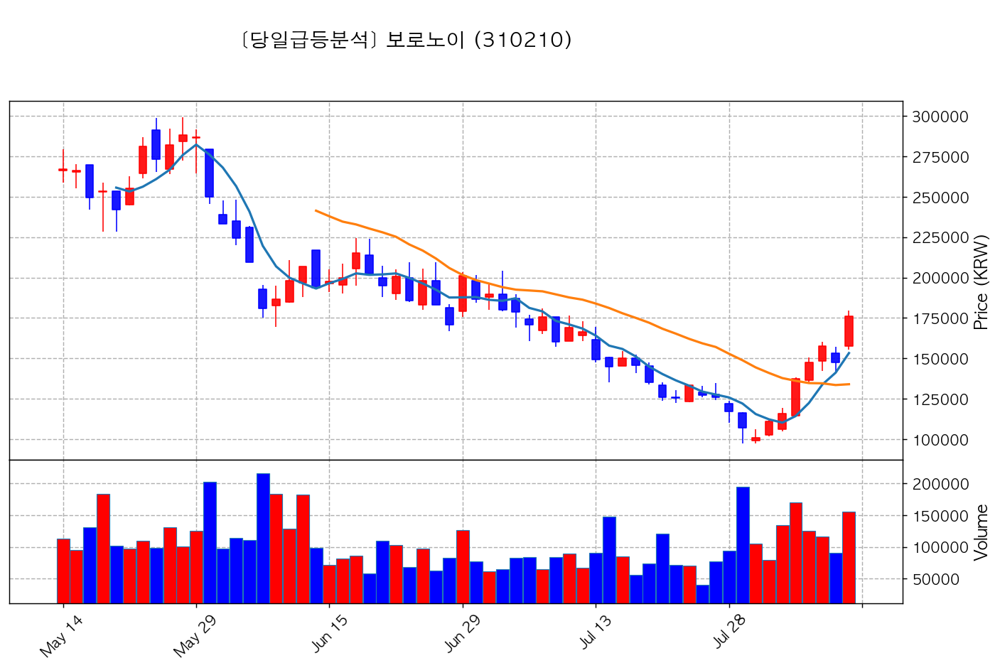

- **종가**: 176,300원 | **거래대금**: 274.3억
- **🔥 당일 핵심 뉴스**: 🔗 [보로노이 주가 장중 20%대 급등, 폐암신약 캐나다 임상 기대감 반영](https://news.google.com/rss/articles/CBMic0FVX3lxTFBXSzE5VURqZ1BGNlpaVU5oSXlwRjJRM1VReTB1OUNiYmU4VG4xdm9rT0tDTnliX01jYWRhMl84VnR6d0pKNlJXbWZtMV9vVEo4cEpTWjE2TnpwWmVUSmpBeXVKdzUtdWp5T2JYT3lpVHZVblU?oc=5)

#### 9) 헥토파이낸셜 (234340) — <b>+17.24%</b>

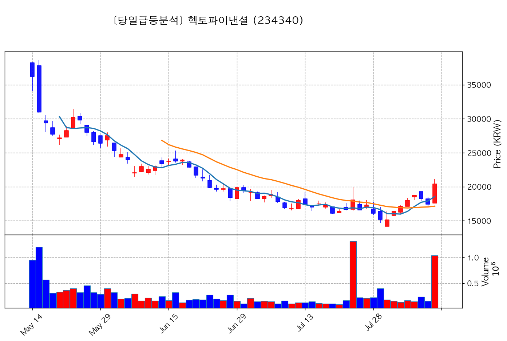

- **종가**: 20,400원 | **거래대금**: 210.3억
- **🔥 당일 핵심 뉴스**: 🔗 [[특징주] 헥토파이낸셜, 스테이블코인 사업 계획에 상한가 기록](https://news.google.com/rss/articles/CBMiWkFVX3lxTE9VcEJ5MzlubjdRYTJxbHZLV3F4Yl8xbWZReEM0MWxvS2JPWVJCT0FORFc0ZFpKNkxtbmpEbWY2d0l1THhKeGx3NEVGb2VJQl9IMVpMY1RQSXhFQdIBWEFVX3lxTFBFNXBaa1pncHlOS290b2JMWTlOV2ZFYTRRY3NqSDRhMVBJNl9KOEZ2UW92ZXIxUGl0a0hxTjNrUGZTTDhzd1FjMzItU2YydzNIYzJuOC1CbVg?oc=5)

#### 10) 씨이랩 (189330) — <b>+18.46%</b>

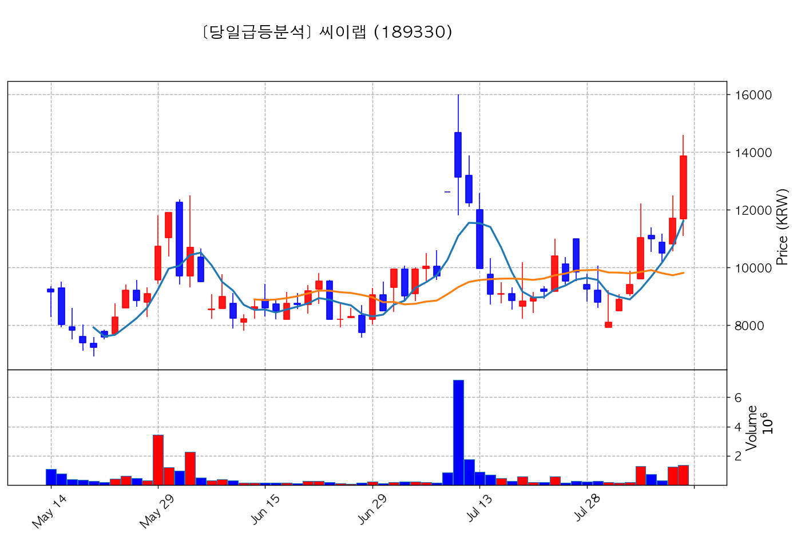

- **종가**: 13,860원 | **거래대금**: 187.7억
- **🔥 당일 핵심 뉴스**: 🔗 [특징주, 씨이랩-지능형로봇/인공지능(AI) 테마 상승세에 7.35% ↑](https://news.google.com/rss/articles/CBMiUkFVX3lxTE1FUTVxb0RXMDRCbDRUTEVoYTFHUjB0MFF1dEZRSjNJcVoxdkl6R3hvX1h1UG03NlY5WG5nLVlTeXd6cXZFdFNqUHdjcWZuME14c3c?oc=5)

