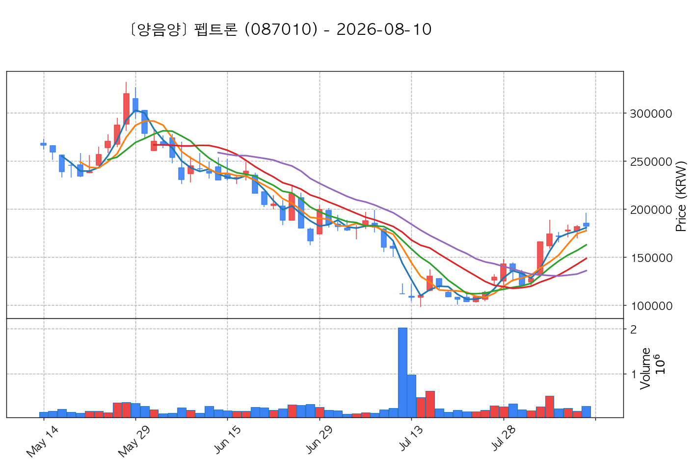
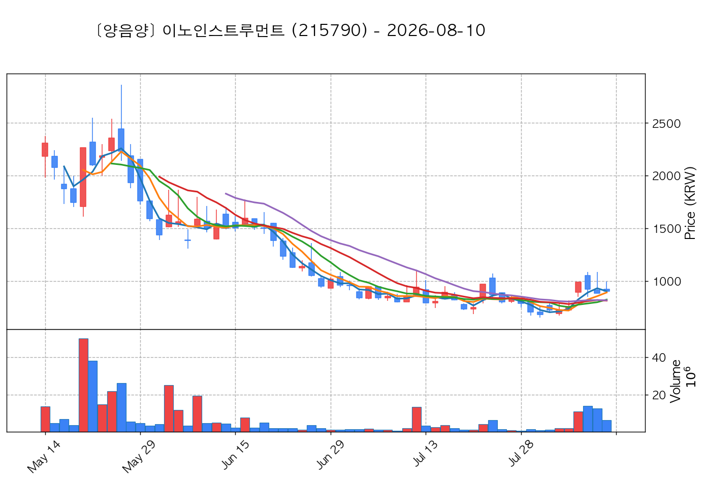
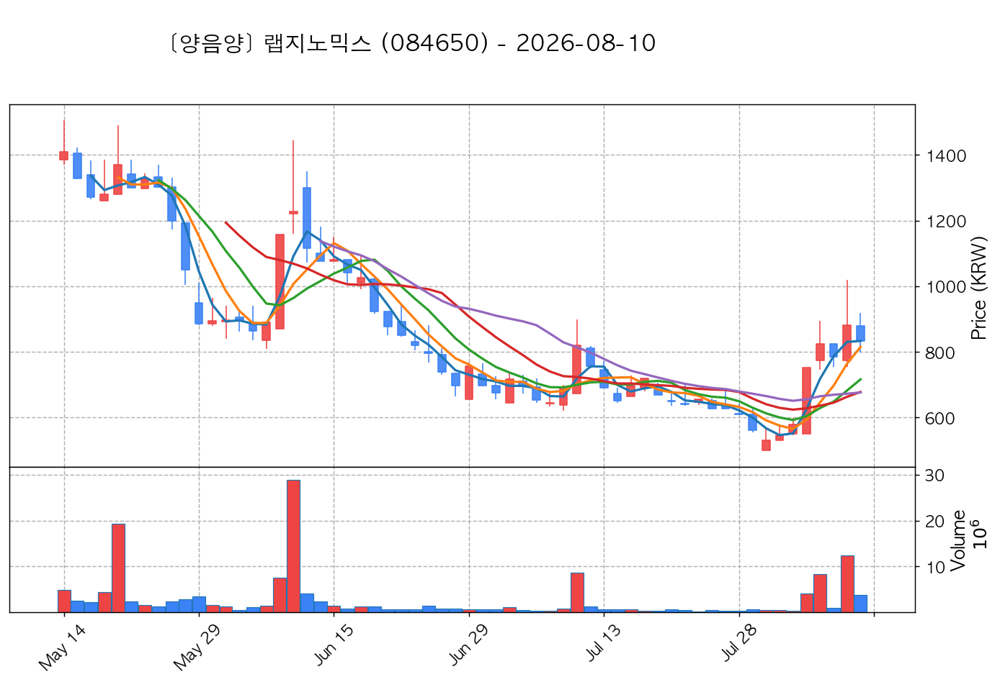
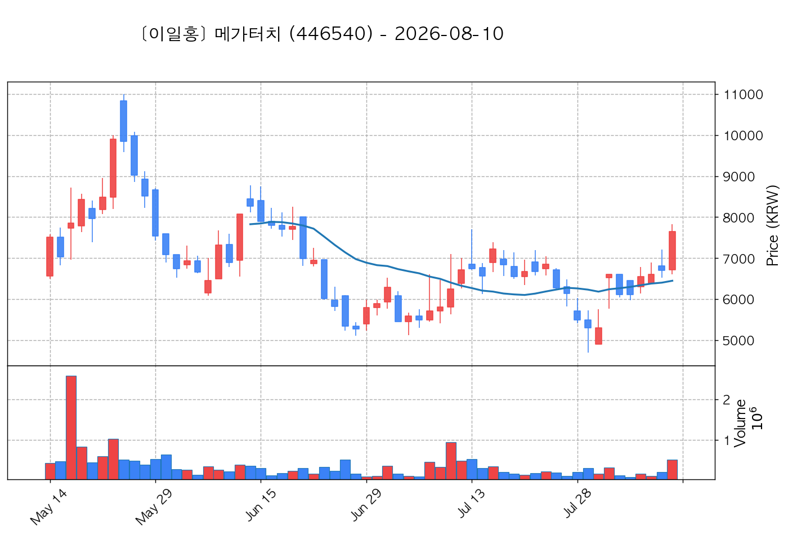

# 📈 [실전플랜 1] 2026-08-10 매매 후보 스크리닝 보고서

> 스크리닝 기준일: 2026-08-10 | [📊 익일 매매 성과 피드백 보고서 보기](./2026-08-10_피드백.html)

---

## 📊 1. 스크리닝 성과 요약

| 전략 | 주요 기법 | 종목수(TOP) |
| :--- | :--- | :---: |
| **전략 1** | 양음양 눌림목 & 사윗감 | 9개 (TOP 3개) |
| **전략 2** | 매집봉 & 이일홍 | 5개 (TOP 1개) |
| **전략 3** | 수급 & 핥 | 0개 (TOP 0개) |
| **합계** | **3대 핵심 전략 통합** | **14개 (TOP 4개)** |

---

## 🔵 3. 전략 1 — 양-음-양 눌림목 (3% × 3슬롯)

### 📋 전략 1 요약표 (상위 9개)

| 종목명 | 기준일종가 | 기준봉 | 지지선 | 비고 및 선정 상태 |
| :--- | ---: | :--- | :---: | :--- |
| **SK이터닉스** (475150) | 51,100원 | +19.9% 장대양봉 | 3일선 | **★ TOP 1 선택** |
| **코스모로보틱스** (439960) | 18,240원 | +21.3% 장대양봉 | 3일선 | **★ TOP 2 선택** |
| **지엔씨에너지** (119850) | 52,400원 | +21.9% 장대양봉 | 3일선 | **★ TOP 3 선택** |
| **JW신약** (067290) | 2,232원 | +16.2% 장대양봉 | 3일선 | 후보군 (1위) |
| **온코닉테라퓨틱스** (476060) | 14,390원 | +22.3% 장대양봉 | 3일선 | 후보군 (2위) |
| **펩트론** (087010) | 182,100원 | 상한가 | 3일선 | 후보군 (3위) (사윗감) |
| **티엑스알로보틱스** (484810) | 16,330원 | 상한가 | 3일선 | 후보군 (4위) (사윗감) |
| **이노인스트루먼트** (215790) | 902원 | 상한가 | 3일선 | 후보군 (5위) |
| **랩지노믹스** (084650) | 834원 | 상한가 | 3일선 | 후보군 (6위) |

---

### 🔍 전략 1 상세 분석

#### 1) SK이터닉스 (475150) — ★ TOP 1 선택

- **기준 종가**: 51,100원 | **거래대금**: 1129억
- **분석 사유**: 과거 2026-08-04 기준봉 후 현재 3일선 지지

#### 2) 코스모로보틱스 (439960) — ★ TOP 2 선택

- **기준 종가**: 18,240원 | **거래대금**: 555억
- **분석 사유**: 과거 2026-08-03 기준봉 후 현재 3일선 지지

#### 3) 지엔씨에너지 (119850) — ★ TOP 3 선택

- **기준 종가**: 52,400원 | **거래대금**: 522억
- **분석 사유**: 과거 2026-08-04 기준봉 후 현재 3일선 지지

#### 4) JW신약 (067290) — 후보군 (1위)

- **기준 종가**: 2,232원 | **거래대금**: 213억
- **분석 사유**: 과거 2026-08-06 기준봉 후 현재 3일선 지지

#### 5) 온코닉테라퓨틱스 (476060) — 후보군 (2위)

- **기준 종가**: 14,390원 | **거래대금**: 60억
- **분석 사유**: 과거 2026-08-06 기준봉 후 현재 3일선 지지

#### 6) 펩트론 (087010) — 후보군 (3위) (사윗감)

- **기준 종가**: 182,100원 | **거래대금**: 504억
- **분석 사유**: 과거 2026-08-03 기준봉 후 현재 3일선 지지

#### 7) 티엑스알로보틱스 (484810) — 후보군 (4위) (사윗감)

- **기준 종가**: 16,330원 | **거래대금**: 61억
- **분석 사유**: 과거 2026-08-03 기준봉 후 현재 3일선 지지

#### 8) 이노인스트루먼트 (215790) — 후보군 (5위)

- **기준 종가**: 902원 | **거래대금**: 56억
- **분석 사유**: 과거 2026-08-05 기준봉 후 현재 3일선 지지

#### 9) 랩지노믹스 (084650) — 후보군 (6위)

- **기준 종가**: 834원 | **거래대금**: 31억
- **분석 사유**: 과거 2026-08-04 기준봉 후 현재 3일선 지지

## 🟡 4. 전략 2 — 일일봉 매집봉 (10% × 1슬롯)

### 📋 전략 2 요약표 (상위 5개)

| 종목명 | 기준일종가 | 기준봉 | 지지선 | 비고 및 선정 상태 |
| :--- | ---: | :--- | :---: | :--- |
| **메가터치** (446540) | 7,650원 | ★ [1순위 키움정석] 40일 최고가 근접 + 60일선 상승 + 시가대비 +14.0% 속양봉 | 240일선 | **★ TOP 1 선택** |
| **퍼스텍** (010820) | 6,500원 | 과거 2026-06-16 매집봉 ➔ 240일선 근접 지지 (+2.13%) | 240일선 | 후보군 (1위) |
| **예스티** (122640) | 22,150원 | 과거 2026-06-18 매집봉 ➔ 240일선 근접 지지 (-0.89%) | 240일선 | 후보군 (2위) |
| **효성화학** (298000) | 73,000원 | 과거 2026-06-15 매집봉 ➔ 240일선 근접 지지 (-2.60%) | 240일선 | 후보군 (3위) |
| **HLB이노베이션** (024850) | 13,490원 | 과거 2026-07-10 매집봉 ➔ 240일선 근접 지지 (+1.42%) | 240일선 | 후보군 (4위) |

---

### 🔍 전략 2 상세 분석

#### 1) 메가터치 (446540) — ★ TOP 1 선택

- **기준 종가**: 7,650원 | **거래대금**: 38억
- **분석 사유**: ★ [1순위 키움정석] 40일 최고가 근접 + 60일선 상승 + 시가대비 +14.0% 속양봉

#### 2) 퍼스텍 (010820) — 후보군 (1위)

- **기준 종가**: 6,500원 | **거래대금**: 63억
- **분석 사유**: 과거 2026-06-16 매집봉 ➔ 240일선 근접 지지 (+2.13%)

#### 3) 예스티 (122640) — 후보군 (2위)

- **기준 종가**: 22,150원 | **거래대금**: 48억
- **분석 사유**: 과거 2026-06-18 매집봉 ➔ 240일선 근접 지지 (-0.89%)

#### 4) 효성화학 (298000) — 후보군 (3위)

- **기준 종가**: 73,000원 | **거래대금**: 47억
- **분석 사유**: 과거 2026-06-15 매집봉 ➔ 240일선 근접 지지 (-2.60%)

#### 5) HLB이노베이션 (024850) — 후보군 (4위)

- **기준 종가**: 13,490원 | **거래대금**: 33억
- **분석 사유**: 과거 2026-07-10 매집봉 ➔ 240일선 근접 지지 (+1.42%)

## 🟢 5. 전략 3 — 수급 낙폭과대 바닥형 (10% × 2슬롯)

해당 전략 포착 종목 없음

