# 📊 [실전플랜 1 피드백] 2026-08-10 매매 성과 추적 보고서

> 스크리닝 포착일: 2026-08-07 (종가) | 실제 매매(추적일): 2026-08-10 (매매일) | [📈 매매전 스크리닝 보고서 보기](./2026-08-07_스크리닝.html)

---

## 📊 1. 당일 매매 성과 요약
- **포착 및 검증 종목 수**: 총 61개 종목

---

## 🔵 전략 1 — 양-음-양 눌림목 성과

#### 1) 삼성전자 (005930) — ★ TOP 1 선택 | ⏱️ 지지선 유지 (+3.2%)

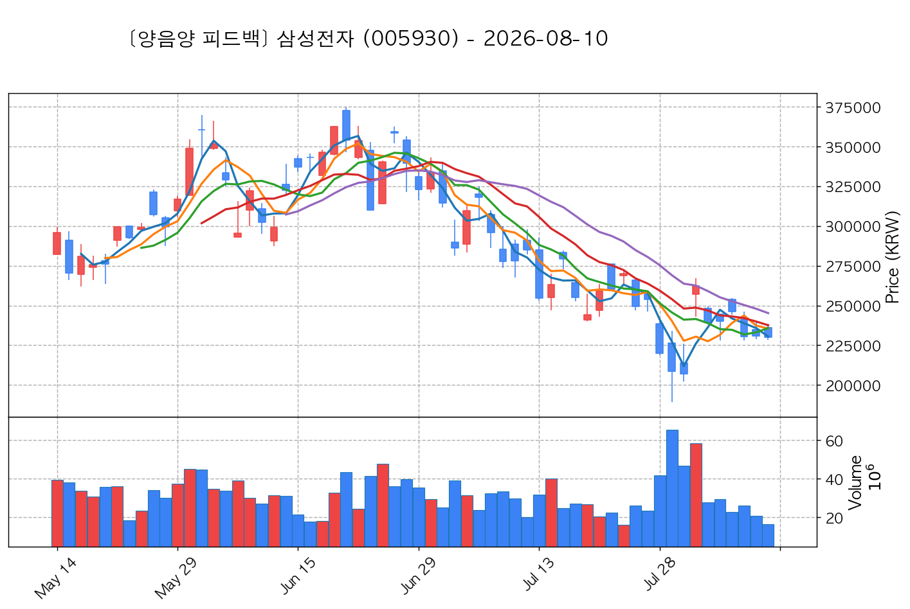

- **전일 종가(기준가)**: 231,000원 ➔ **매매일 시초가**: 236,000원 | **최고가**: 238,500원 (<b>+3.25%</b>) | **종가**: 230,000원 (-0.43%)
- **시세 움직임 복기**: 과거 2026-07-31 기준봉 후 현재 3일선 지지

#### 2) SK이터닉스 (475150) — ★ TOP 2 선택 | ⏱️ 지지선 유지 (+3.6%)

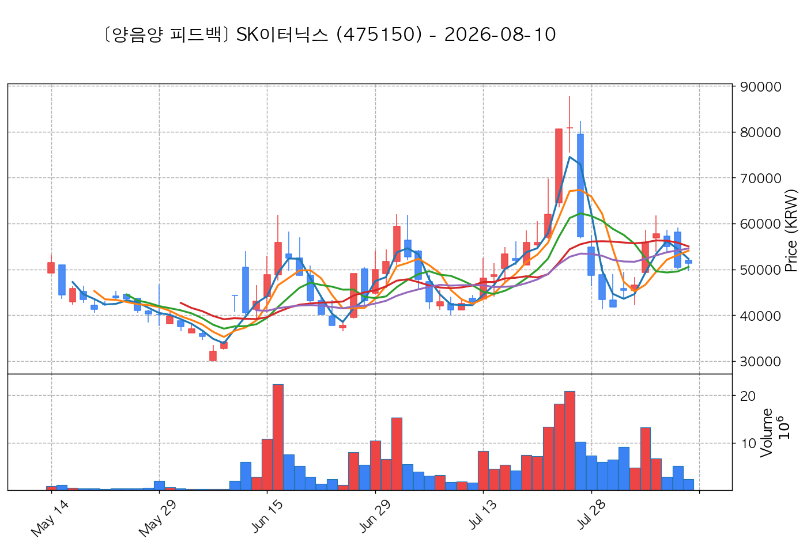

- **전일 종가(기준가)**: 50,500원 ➔ **매매일 시초가**: 52,000원 | **최고가**: 52,300원 (<b>+3.56%</b>) | **종가**: 51,300원 (+1.58%)
- **시세 움직임 복기**: 과거 2026-08-04 기준봉 후 현재 8일선 지지

#### 3) 한미반도체 (042700) — ★ TOP 3 선택 | ✅ 1차 목표 달성 (+7.9%)

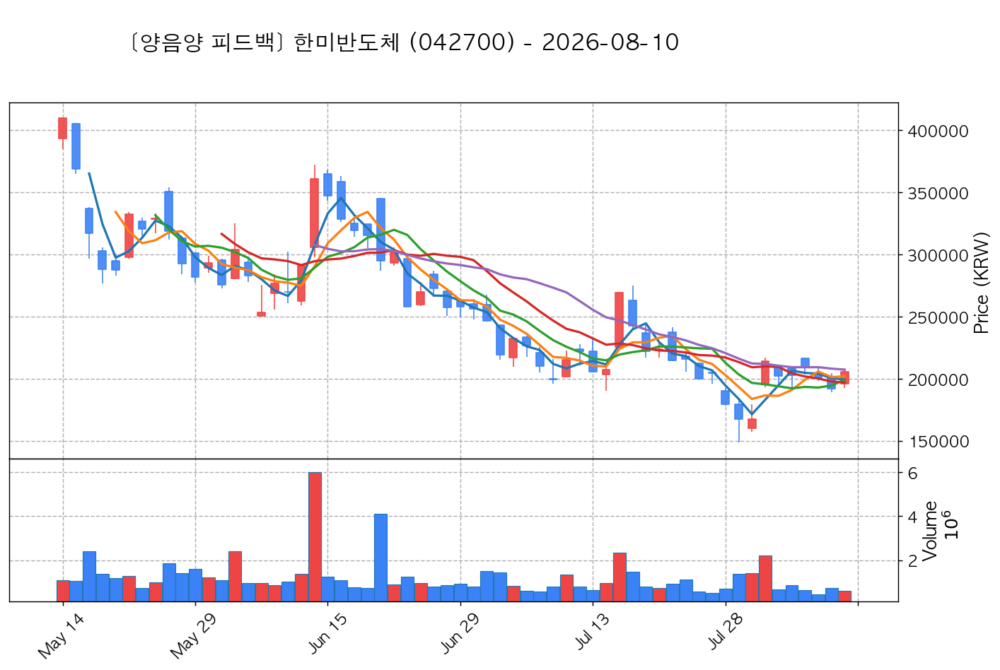

- **전일 종가(기준가)**: 192,300원 ➔ **매매일 시초가**: 195,900원 | **최고가**: 207,500원 (<b>+7.90%</b>) | **종가**: 205,500원 (+6.86%)
- **시세 움직임 복기**: 과거 2026-07-31 기준봉 후 현재 8일선 지지

#### 4) 삼성전기 (009150) — 후보군 (1위) | ✅ 1차 목표 달성 (+6.2%)

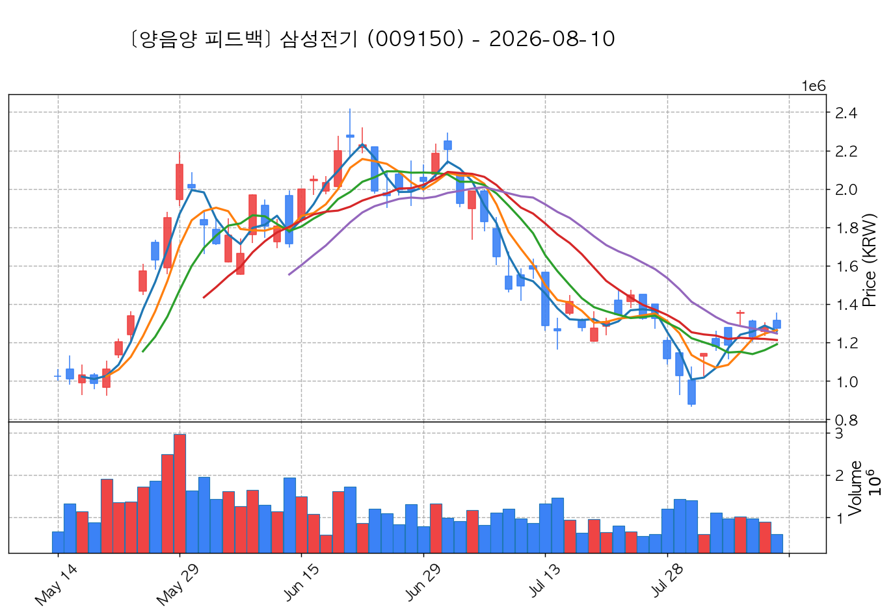

- **전일 종가(기준가)**: 1,278,000원 ➔ **매매일 시초가**: 1,315,000원 | **최고가**: 1,357,000원 (<b>+6.18%</b>) | **종가**: 1,274,000원 (-0.31%)
- **시세 움직임 복기**: 과거 2026-07-31 기준봉 후 현재 3일선 지지

#### 5) 주성엔지니어링 (036930) — 후보군 (2위) | ✅ 1차 목표 달성 (+13.8%)

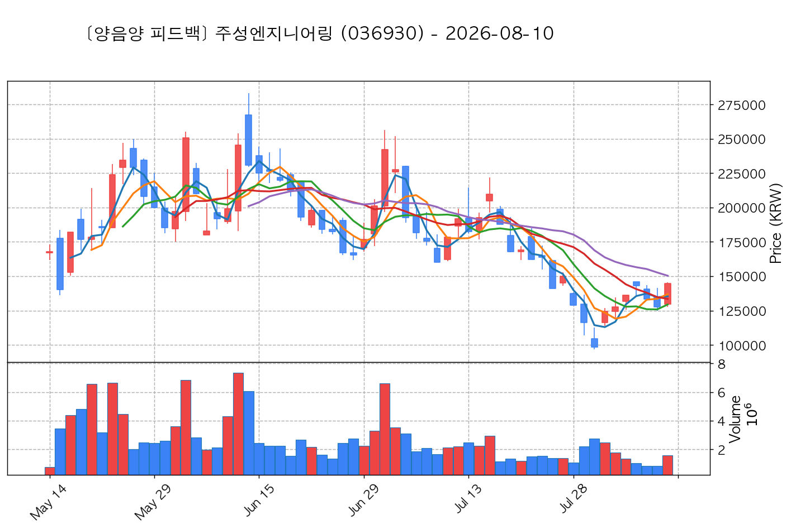

- **전일 종가(기준가)**: 127,800원 ➔ **매매일 시초가**: 129,500원 | **최고가**: 145,500원 (<b>+13.85%</b>) | **종가**: 144,800원 (+13.30%)
- **시세 움직임 복기**: 과거 2026-07-31 기준봉 후 현재 8일선 지지

#### 6) 코스모로보틱스 (439960) — 후보군 (3위) | ✅ 1차 목표 달성 (+8.4%)

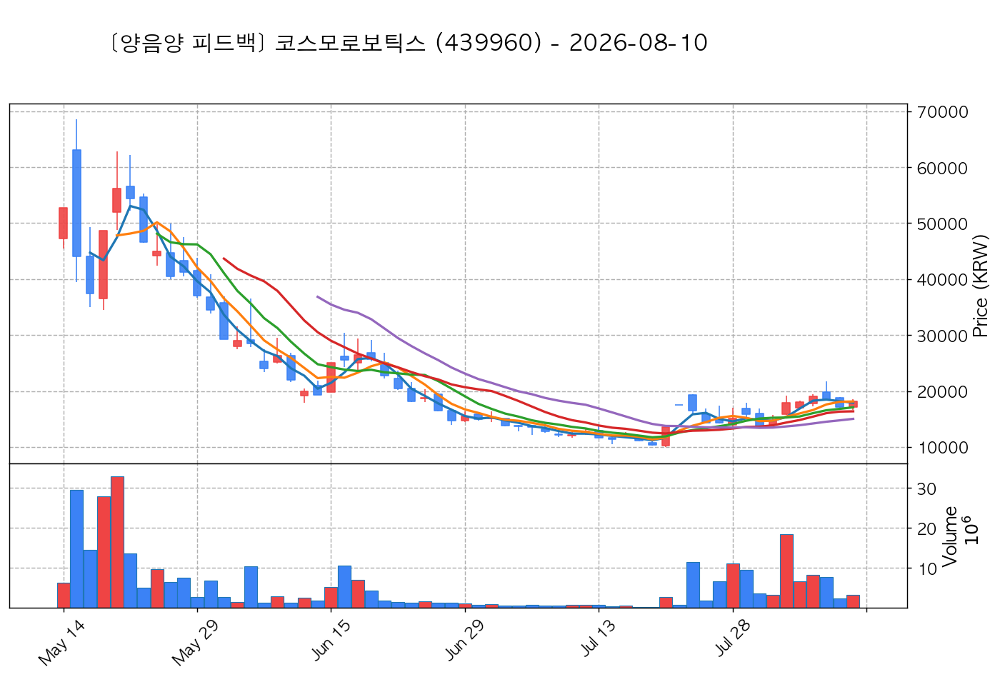

- **전일 종가(기준가)**: 17,130원 ➔ **매매일 시초가**: 17,130원 | **최고가**: 18,570원 (<b>+8.41%</b>) | **종가**: 18,160원 (+6.01%)
- **시세 움직임 복기**: 과거 2026-08-03 기준봉 후 현재 8일선 지지

#### 7) 위닉스 (044340) — 후보군 (4위) | ❌ 손절 이탈 (-5.9%)

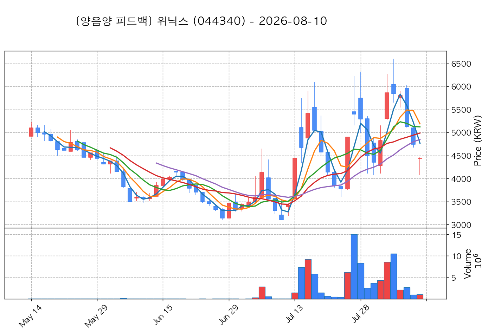

- **전일 종가(기준가)**: 4,740원 ➔ **매매일 시초가**: 4,435원 | **최고가**: 4,460원 (<b>-5.91%</b>) | **종가**: 4,440원 (-6.33%)
- **시세 움직임 복기**: 과거 2026-08-03 기준봉 후 현재 20일선 지지

#### 8) 삼성물산 (028260) — 후보군 (5위) | ✅ 1차 목표 달성 (+5.0%)

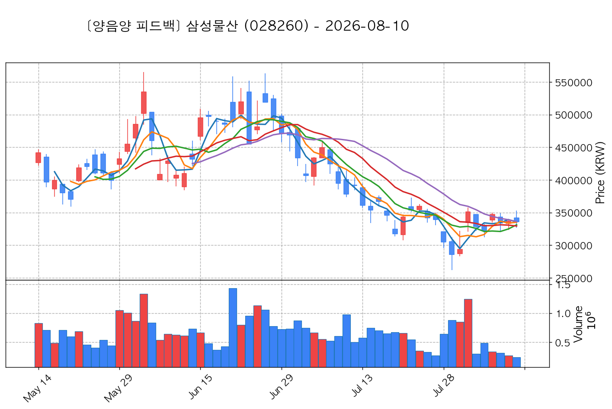

- **전일 종가(기준가)**: 336,500원 ➔ **매매일 시초가**: 342,000원 | **최고가**: 353,500원 (<b>+5.05%</b>) | **종가**: 336,000원 (-0.15%)
- **시세 움직임 복기**: 과거 2026-07-31 기준봉 후 현재 3일선 지지

#### 9) SK (034730) — 후보군 (6위) | ⏱️ 지지선 유지 (+4.3%)

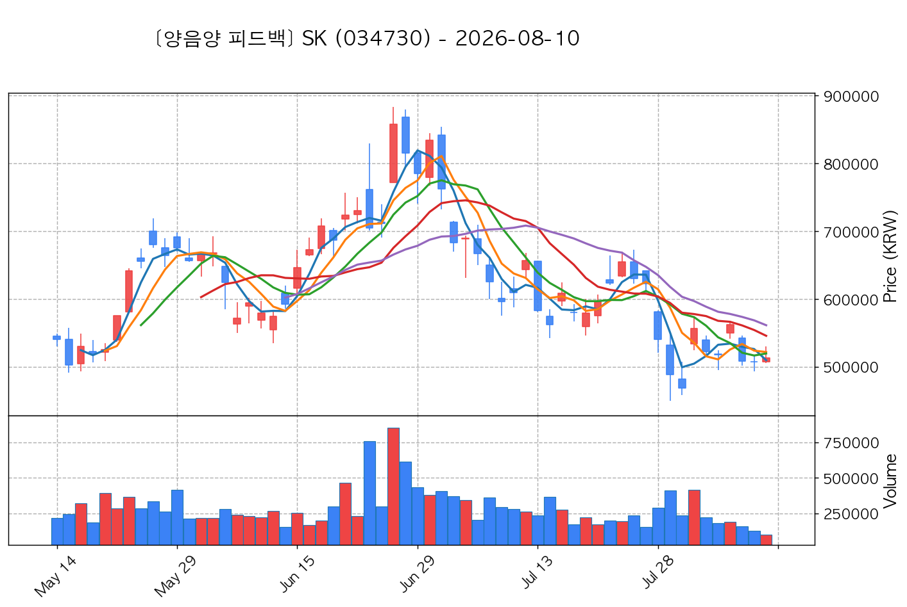

- **전일 종가(기준가)**: 508,000원 ➔ **매매일 시초가**: 508,000원 | **최고가**: 530,000원 (<b>+4.33%</b>) | **종가**: 513,000원 (+0.98%)
- **시세 움직임 복기**: 과거 2026-07-31 기준봉 후 현재 8일선 지지

#### 10) 테크윙 (089030) — 후보군 (7위) | ✅ 1차 목표 달성 (+7.6%)

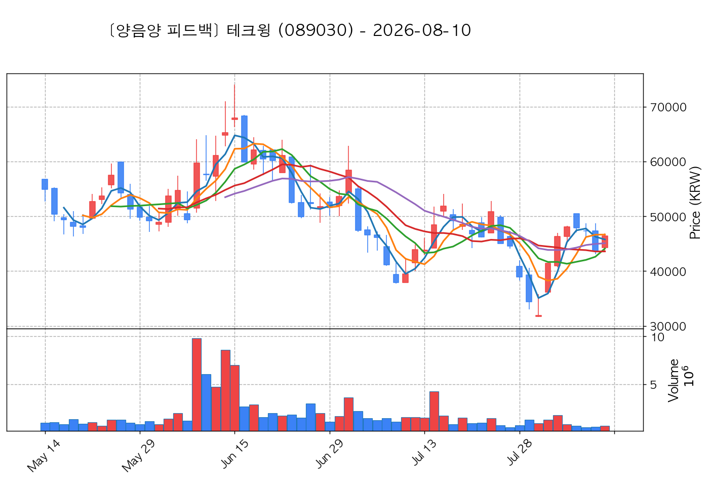

- **전일 종가(기준가)**: 43,600원 ➔ **매매일 시초가**: 44,250원 | **최고가**: 46,900원 (<b>+7.57%</b>) | **종가**: 46,400원 (+6.42%)
- **시세 움직임 복기**: 과거 2026-07-31 기준봉 후 현재 13일선 지지

## 🟡 전략 2 — 일일봉 매집봉 성과

#### 1) HL만도 (204320) — ★ TOP 1 선택 | ✅ 1차 목표 달성 (+5.9%)

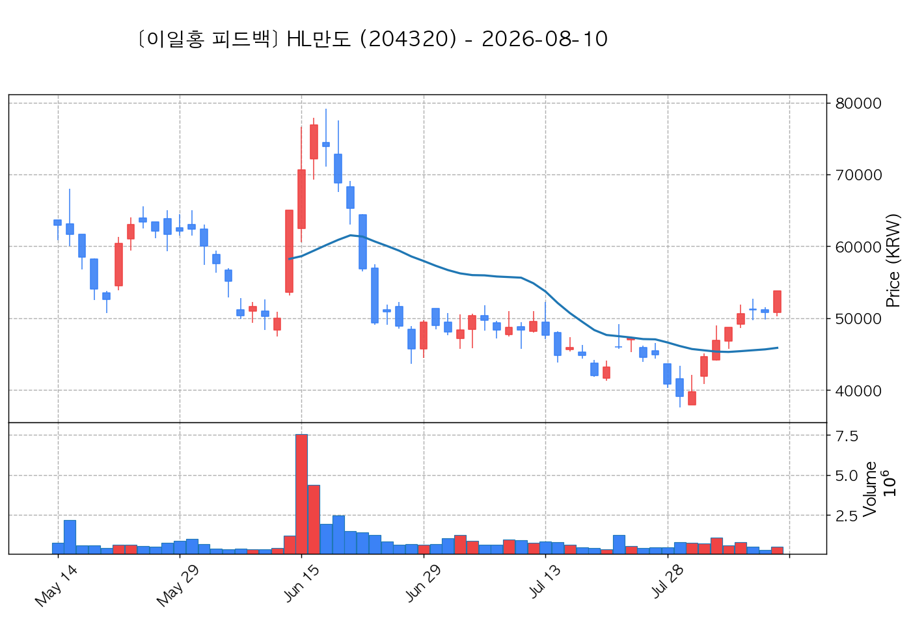

- **전일 종가(기준가)**: 50,800원 ➔ **매매일 시초가**: 50,800원 | **최고가**: 53,800원 (<b>+5.91%</b>) | **종가**: 53,800원 (+5.91%)
- **시세 움직임 복기**: 과거 2026-06-15 매집봉 ➔ 240일선 근접 지지 (+2.53%)

#### 2) 신스틸 (162300) — 후보군 (1위) | ✅ 1차 목표 달성 (+20.4%)

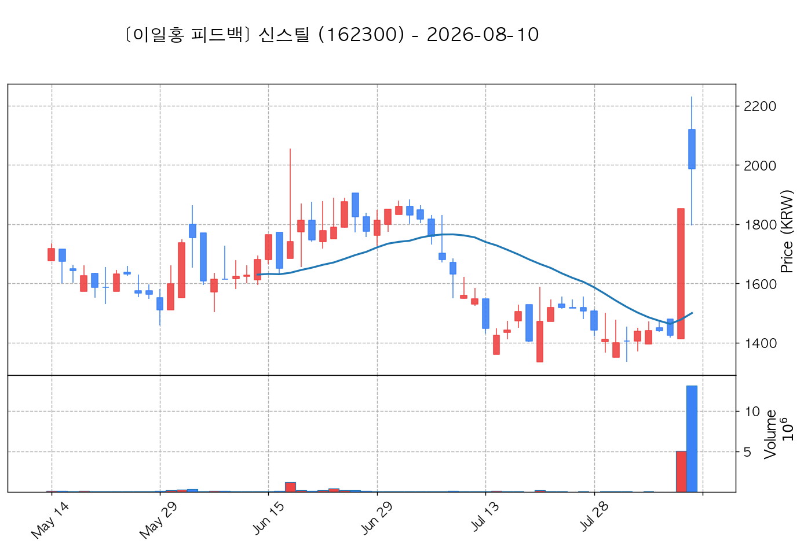

- **전일 종가(기준가)**: 1,852원 ➔ **매매일 시초가**: 2,120원 | **최고가**: 2,230원 (<b>+20.41%</b>) | **종가**: 1,986원 (+7.24%)
- **시세 움직임 복기**: ★ [1순위 키움정석] 40일 최고가 근접 + 60일선 상승 + 시가대비 +31.1% 속양봉

#### 3) OCI (456040) — 후보군 (2위) | ⏱️ 지지선 유지 (+0.3%)

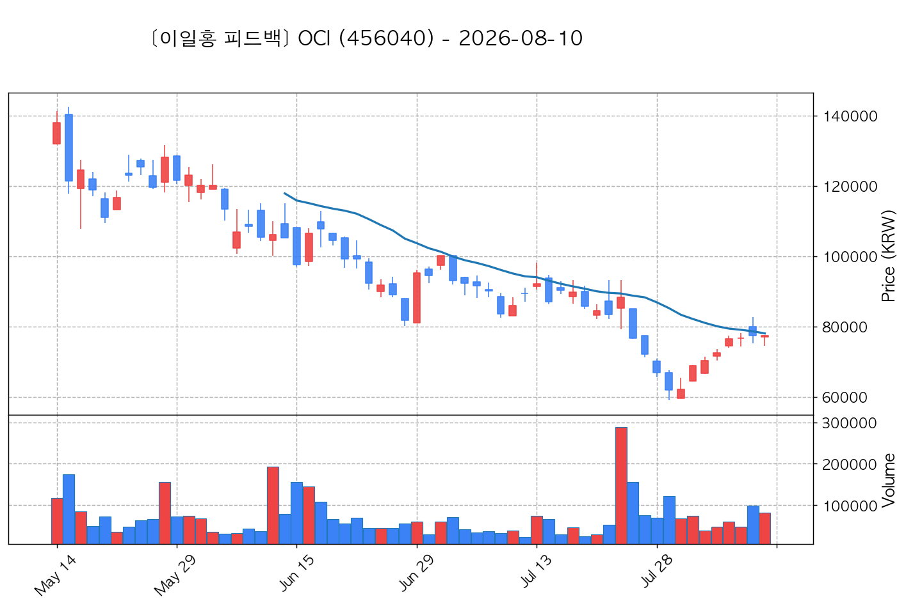

- **전일 종가(기준가)**: 77,400원 ➔ **매매일 시초가**: 77,000원 | **최고가**: 77,600원 (<b>+0.26%</b>) | **종가**: 77,400원 (+0.00%)
- **시세 움직임 복기**: 과거 2026-07-23 매집봉 ➔ 240일선 근접 지지 (-2.96%)

#### 4) 다스코 (058730) — 후보군 (3위) | ⏱️ 지지선 유지 (+2.7%)

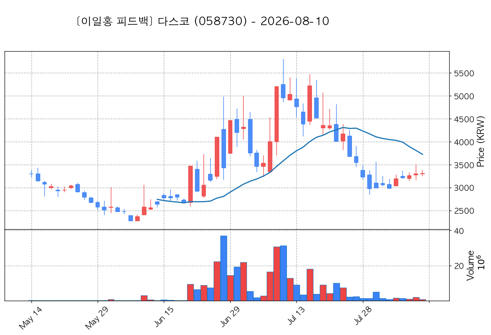

- **전일 종가(기준가)**: 3,300원 ➔ **매매일 시초가**: 3,300원 | **최고가**: 3,390원 (<b>+2.73%</b>) | **종가**: 3,310원 (+0.30%)
- **시세 움직임 복기**: 과거 2026-06-22 매집봉 ➔ 240일선 근접 지지 (+0.19%)

## 🟢 전략 3 — 수급 낙폭과대 바닥형 성과

#### 1) 두산에너빌리티 (034020) — ★ TOP 1 선택 | ✅ 1차 목표 달성 (+3.8%)

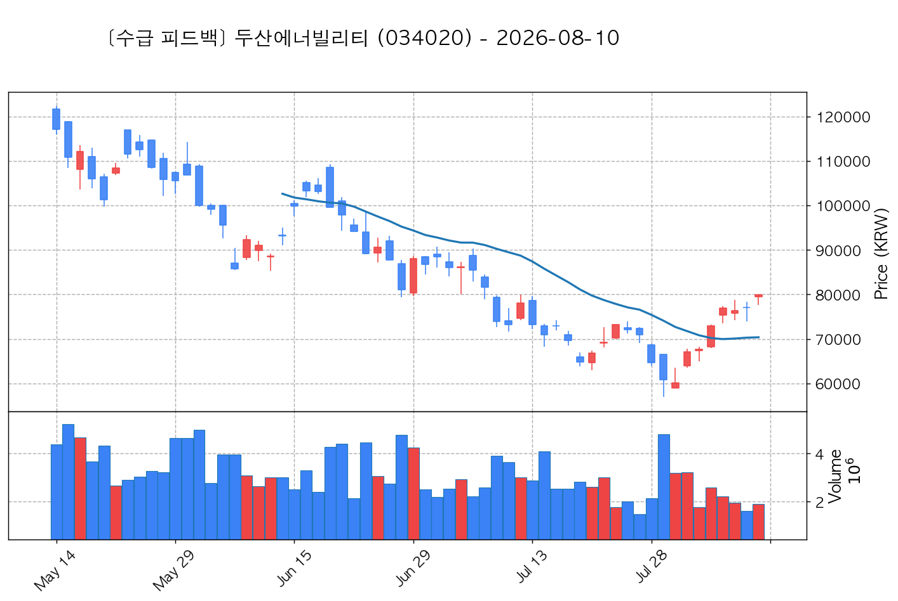

- **전일 종가(기준가)**: 77,100원 ➔ **매매일 시초가**: 79,500원 | **최고가**: 80,000원 (<b>+3.76%</b>) | **종가**: 79,900원 (+3.63%)
- **시세 움직임 복기**: 52주 고점 대비 (55.4%) ➔ 20일 메이저 수급 100억+ 유입 ➔ 없음 지지 안착

#### 2) 대우건설 (047040) — ★ TOP 2 선택 | ✅ 1차 목표 달성 (+5.4%)

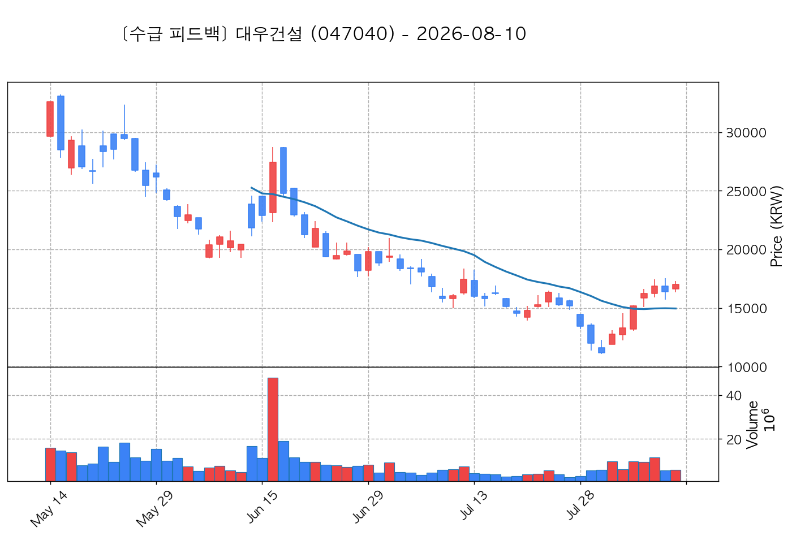

- **전일 종가(기준가)**: 16,410원 ➔ **매매일 시초가**: 16,650원 | **최고가**: 17,290원 (<b>+5.36%</b>) | **종가**: 17,030원 (+3.78%)
- **시세 움직임 복기**: 52주 고점 대비 (40.7%) ➔ 20일 메이저 수급 100억+ 유입 ➔ 없음 지지 안착

