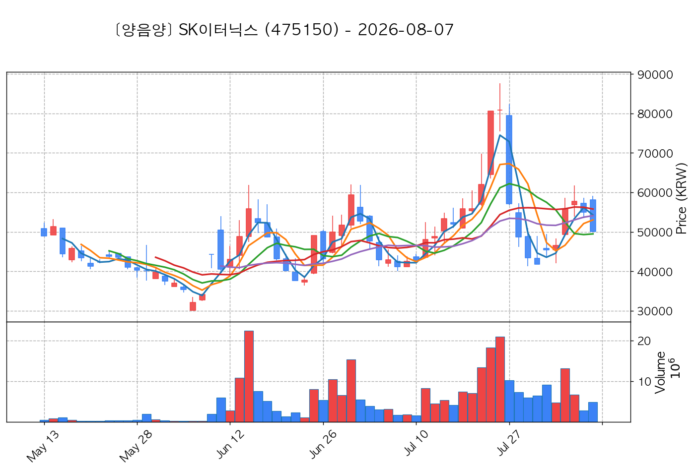
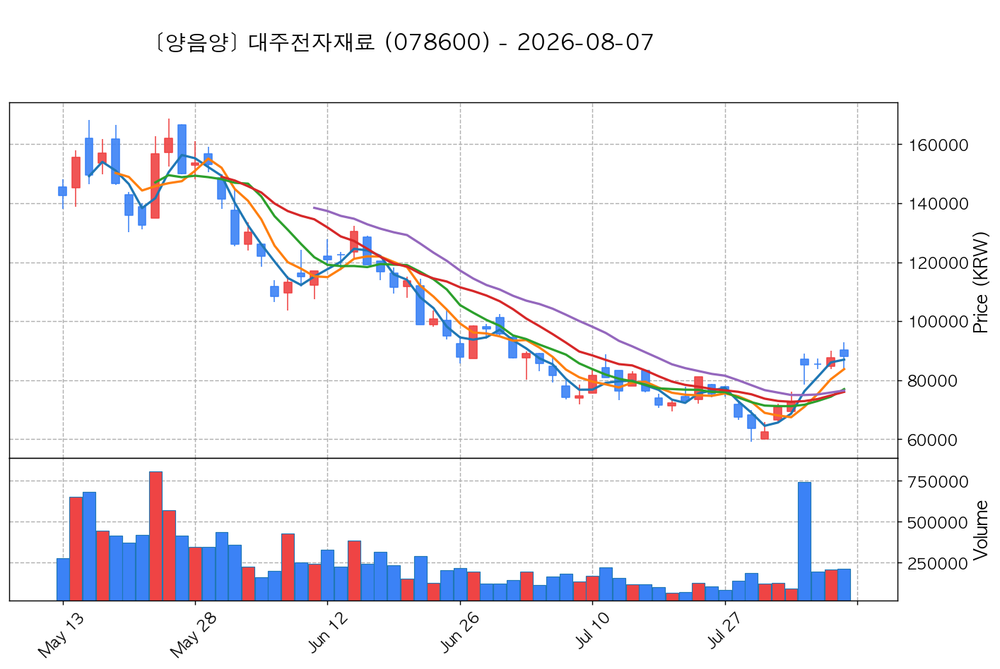
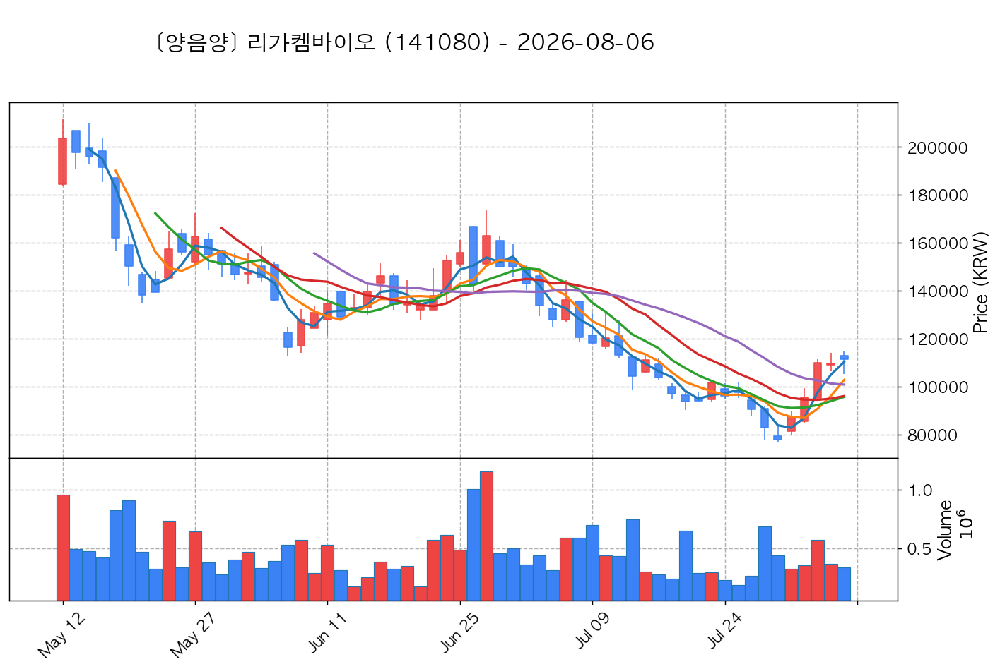
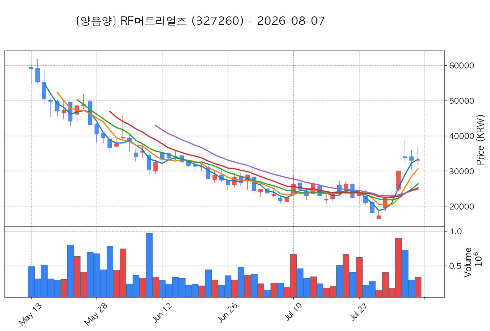
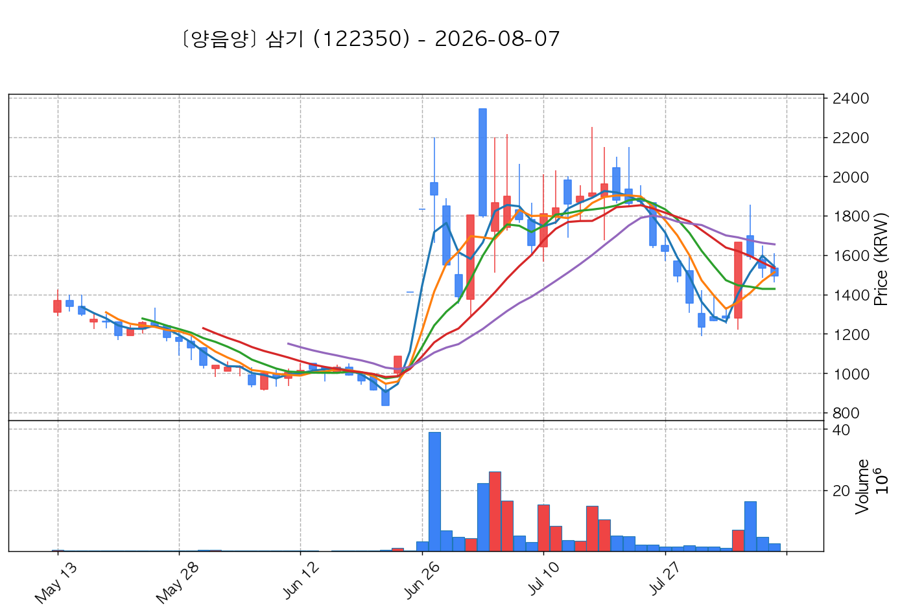
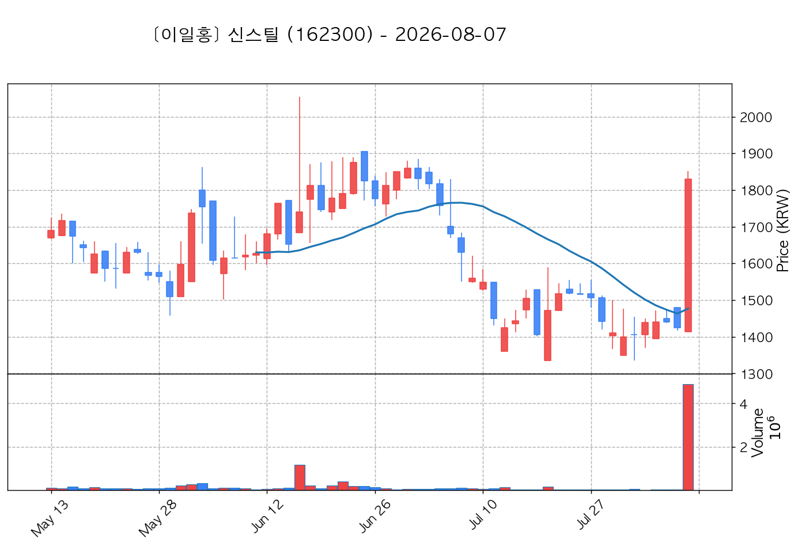
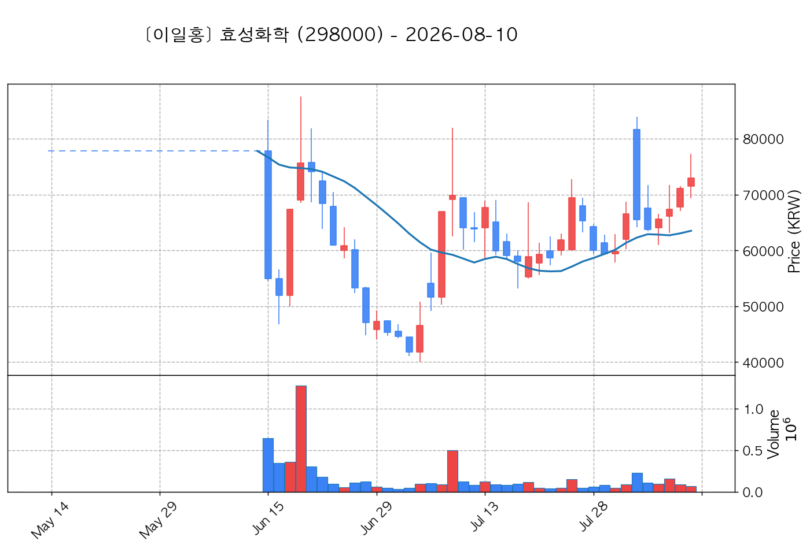
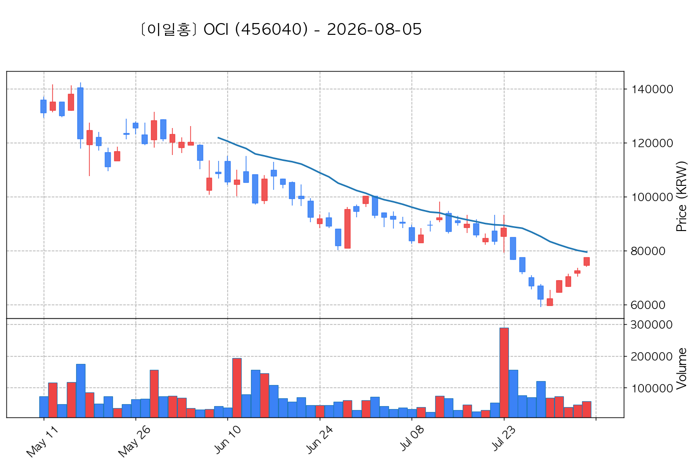
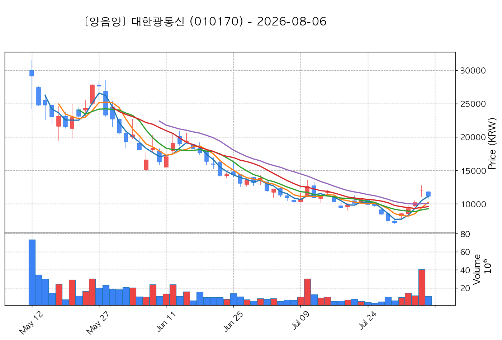

# 📈 [실전플랜 1] 2026-08-11 매매 후보 스크리닝 보고서

> 스크리닝 기준일: 2026-08-11 | [📊 익일 매매 성과 피드백 보고서 보기](./2026-08-11_피드백.html)

---

## 📊 1. 스크리닝 성과 요약

| 전략 | 주요 기법 | 종목수(TOP) |
| :--- | :--- | :---: |
| **전략 1** | 양음양 눌림목 & 사윗감 | 15개 (TOP 3개) |
| **전략 2** | 매집봉 & 이일홍 | 6개 (TOP 1개) |
| **전략 3** | 수급 & 핥 | 2개 (TOP 2개) |
| **합계** | **3대 핵심 전략 통합** | **23개 (TOP 6개)** |

---

## 🔵 3. 전략 1 — 양-음-양 눌림목 (3% × 3슬롯)

### 📋 전략 1 요약표 (상위 10개)

| 종목명 | 기준일종가 | 기준봉 | 지지선 | 비고 및 선정 상태 |
| :--- | ---: | :--- | :---: | :--- |
| **SK이터닉스** (475150) | 51,100원 | +19.9% 장대양봉 | 3일선 | **★ TOP 1 선택** |
| **지엔씨에너지** (119850) | 49,900원 | +21.9% 장대양봉 | 5일선 | **★ TOP 2 선택** |
| **마키나락스** (477850) | 31,150원 | 상한가 | 3일선 | **★ TOP 3 선택** |
| **빛과전자** (069540) | 2,940원 | 상한가 | 3일선 | 후보군 (1위) (사윗감) |
| **대주전자재료** (078600) | 94,400원 | +17.2% 장대양봉 | 3일선 | 후보군 (2위) |
| **리가켐바이오** (141080) | 116,900원 | +15.2% 장대양봉 | 3일선 | 후보군 (3위) |
| **RF머트리얼즈** (327260) | 38,400원 | 상한가 | 3일선 | 후보군 (4위) |
| **한국첨단소재** (062970) | 3,080원 | 상한가 | 3일선 | 후보군 (5위) |
| **삼기** (122350) | 1,541원 | 상한가 | 3일선 | 후보군 (6위) (사윗감) |
| **신스틸** (162300) | 1,915원 | 상한가 | 3일선 | 후보군 (7위) |

---

### 🔍 전략 1 상세 분석

#### 1) SK이터닉스 (475150) — ★ TOP 1 선택

- **기준 종가**: 51,100원 | **거래대금**: 1629억
- **분석 사유**: 과거 2026-08-04 기준봉 후 현재 3일선 지지

#### 2) 지엔씨에너지 (119850) — ★ TOP 2 선택

- **기준 종가**: 49,900원 | **거래대금**: 276억
- **분석 사유**: 과거 2026-08-04 기준봉 후 현재 5일선 지지

#### 3) 마키나락스 (477850) — ★ TOP 3 선택

- **기준 종가**: 31,150원 | **거래대금**: 430억
- **분석 사유**: 과거 2026-08-05 기준봉 후 현재 3일선 지지

#### 4) 빛과전자 (069540) — 후보군 (1위) (사윗감)

- **기준 종가**: 2,940원 | **거래대금**: 204억
- **분석 사유**: 과거 2026-08-05 기준봉 후 현재 3일선 지지

#### 5) 대주전자재료 (078600) — 후보군 (2위)

- **기준 종가**: 94,400원 | **거래대금**: 198억
- **분석 사유**: 과거 2026-08-04 기준봉 후 현재 3일선 지지

#### 6) 리가켐바이오 (141080) — 후보군 (3위)

- **기준 종가**: 116,900원 | **거래대금**: 412억
- **분석 사유**: 과거 2026-08-04 기준봉 후 현재 3일선 지지

#### 7) RF머트리얼즈 (327260) — 후보군 (4위)

- **기준 종가**: 38,400원 | **거래대금**: 173억
- **분석 사유**: 과거 2026-08-04 기준봉 후 현재 3일선 지지

#### 8) 한국첨단소재 (062970) — 후보군 (5위)

- **기준 종가**: 3,080원 | **거래대금**: 71억
- **분석 사유**: 과거 2026-08-07 기준봉 후 현재 3일선 지지

#### 9) 삼기 (122350) — 후보군 (6위) (사윗감)

- **기준 종가**: 1,541원 | **거래대금**: 32억
- **분석 사유**: 과거 2026-08-04 기준봉 후 현재 3일선 지지

#### 10) 신스틸 (162300) — 후보군 (7위)

- **기준 종가**: 1,915원 | **거래대금**: 149억
- **분석 사유**: 과거 2026-08-07 기준봉 후 현재 3일선 지지

## 🟡 4. 전략 2 — 일일봉 매집봉 (10% × 1슬롯)

### 📋 전략 2 요약표 (상위 6개)

| 종목명 | 기준일종가 | 기준봉 | 지지선 | 비고 및 선정 상태 |
| :--- | ---: | :--- | :---: | :--- |
| **다이나믹솔루션** (290660) | 1,892원 | ★ [1순위 키움정석] 40일 최고가 근접 + 60일선 상승 + 시가대비 +22.9% 속양봉 | 240일선 | **★ TOP 1 선택** |
| **금호전기** (001210) | 4,080원 | 과거 2026-06-30 매집봉 ➔ 240일선 근접 지지 (+0.56%) | 240일선 | 후보군 (1위) |
| **일성건설** (013360) | 1,611원 | 과거 2026-06-17 매집봉 ➔ 240일선 근접 지지 (-2.91%) | 240일선 | 후보군 (2위) |
| **효성화학** (298000) | 72,700원 | 과거 2026-06-18 매집봉 ➔ 240일선 근접 지지 (-2.97%) | 240일선 | 후보군 (3위) |
| **남광토건** (001260) | 8,210원 | 과거 2026-06-25 매집봉 ➔ 240일선 근접 지지 (-2.60%) | 240일선 | 후보군 (4위) |
| **OCI** (456040) | 78,600원 | 과거 2026-07-23 매집봉 ➔ 240일선 근접 지지 (-1.65%) | 240일선 | 후보군 (5위) |

---

### 🔍 전략 2 상세 분석

#### 1) 다이나믹솔루션 (290660) — ★ TOP 1 선택

- **기준 종가**: 1,892원 | **거래대금**: 84억
- **분석 사유**: ★ [1순위 키움정석] 40일 최고가 근접 + 60일선 상승 + 시가대비 +22.9% 속양봉

#### 2) 금호전기 (001210) — 후보군 (1위)

- **기준 종가**: 4,080원 | **거래대금**: 87억
- **분석 사유**: 과거 2026-06-30 매집봉 ➔ 240일선 근접 지지 (+0.56%)

#### 3) 일성건설 (013360) — 후보군 (2위)

- **기준 종가**: 1,611원 | **거래대금**: 64억
- **분석 사유**: 과거 2026-06-17 매집봉 ➔ 240일선 근접 지지 (-2.91%)

#### 4) 효성화학 (298000) — 후보군 (3위)

- **기준 종가**: 72,700원 | **거래대금**: 60억
- **분석 사유**: 과거 2026-06-18 매집봉 ➔ 240일선 근접 지지 (-2.97%)

#### 5) 남광토건 (001260) — 후보군 (4위)

- **기준 종가**: 8,210원 | **거래대금**: 56억
- **분석 사유**: 과거 2026-06-25 매집봉 ➔ 240일선 근접 지지 (-2.60%)

#### 6) OCI (456040) — 후보군 (5위)

- **기준 종가**: 78,600원 | **거래대금**: 43억
- **분석 사유**: 과거 2026-07-23 매집봉 ➔ 240일선 근접 지지 (-1.65%)

## 🟢 5. 전략 3 — 수급 낙폭과대 바닥형 (10% × 2슬롯)

### 📋 전략 3 요약표 (상위 2개)

| 종목명 | 기준일종가 | 기준봉 | 지지선 | 비고 및 선정 상태 |
| :--- | ---: | :--- | :---: | :--- |
| **대한광통신** (010170) | 13,450원 | 52주 고점 대비 (42.7%) ➔ 20일 메이저 수급 100억+ 유입 ➔ 120일선 지지 안착 | 수급선 | **★ TOP 1 선택** |
| **대우건설** (047040) | 17,320원 | 52주 고점 대비 (42.9%) ➔ 20일 메이저 수급 100억+ 유입 ➔ 없음 지지 안착 | 수급선 | **★ TOP 2 선택** |

---

### 🔍 전략 3 상세 분석

#### 1) 대한광통신 (010170) — ★ TOP 1 선택

- **기준 종가**: 13,450원 | **거래대금**: 2092억
- **분석 사유**: 52주 고점 대비 (42.7%) ➔ 20일 메이저 수급 100억+ 유입 ➔ 120일선 지지 안착

#### 2) 대우건설 (047040) — ★ TOP 2 선택

- **기준 종가**: 17,320원 | **거래대금**: 913억
- **분석 사유**: 52주 고점 대비 (42.9%) ➔ 20일 메이저 수급 100억+ 유입 ➔ 없음 지지 안착

