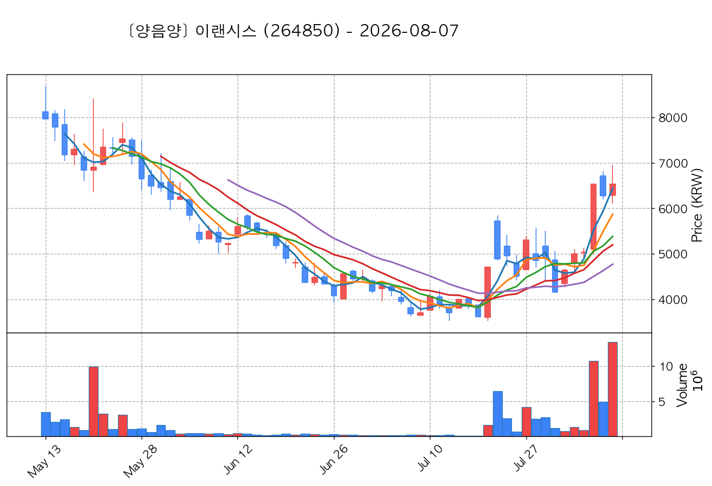

# 📈 [실전플랜 1] 2026-08-12 매매 후보 스크리닝 보고서

> 스크리닝 기준일: 2026-08-12 | [📊 익일 매매 성과 피드백 보고서 보기](./2026-08-12_피드백.html)

---

## 📊 1. 스크리닝 성과 요약

| 전략 | 주요 기법 | 종목수(TOP) |
| :--- | :--- | :---: |
| **전략 1** | 양음양 눌림목 & 사윗감 | 16개 (TOP 3개) |
| **전략 2** | 매집봉 & 이일홍 | 3개 (TOP 1개) |
| **전략 3** | 수급 & 핥 | 0개 (TOP 0개) |
| **합계** | **3대 핵심 전략 통합** | **19개 (TOP 4개)** |

---

## 🔵 3. 전략 1 — 양-음-양 눌림목 (3% × 3슬롯)

### 📋 전략 1 요약표 (상위 10개)

| 종목명 | 기준일종가 | 기준봉 | 지지선 | 비고 및 선정 상태 |
| :--- | ---: | :--- | :---: | :--- |
| **대한광통신** (010170) | 13,510원 | +18.6% 장대양봉 | 3일선 | **★ TOP 1 선택** |
| **제주반도체** (080220) | 86,700원 | +16.3% 장대양봉 | 3일선 | **★ TOP 2 선택** |
| **마키나락스** (477850) | 30,250원 | 상한가 | 5일선 | **★ TOP 3 선택** (사윗감) |
| **성호전자** (043260) | 19,920원 | +20.0% 장대양봉 | 3일선 | 후보군 (1위) |
| **광전자** (017900) | 9,010원 | +21.3% 장대양봉 | 3일선 | 후보군 (2위) |
| **빛과전자** (069540) | 2,950원 | 상한가 | 3일선 | 후보군 (3위) (사윗감) |
| **이랜시스** (264850) | 6,690원 | 상한가 | 3일선 | 후보군 (4위) (사윗감) |
| **미래에셋벤처투자** (100790) | 16,340원 | +15.2% 장대양봉 | 3일선 | 후보군 (5위) |
| **한국첨단소재** (062970) | 3,020원 | 상한가 | 3일선 | 후보군 (6위) (사윗감) |
| **동화기업** (025900) | 8,030원 | 상한가 | 3일선 | 후보군 (7위) (사윗감) |

---

### 🔍 전략 1 상세 분석

#### 1) 대한광통신 (010170) — ★ TOP 1 선택

- **기준 종가**: 13,510원 | **거래대금**: 1389억
- **분석 사유**: 과거 2026-08-05 기준봉 후 현재 3일선 지지

#### 2) 제주반도체 (080220) — ★ TOP 2 선택

- **기준 종가**: 86,700원 | **거래대금**: 1644억
- **분석 사유**: 과거 2026-08-10 기준봉 후 현재 3일선 지지

#### 3) 마키나락스 (477850) — ★ TOP 3 선택 (사윗감)

- **기준 종가**: 30,250원 | **거래대금**: 538억
- **분석 사유**: 과거 2026-08-05 기준봉 후 현재 5일선 지지

#### 4) 성호전자 (043260) — 후보군 (1위)

- **기준 종가**: 19,920원 | **거래대금**: 337억
- **분석 사유**: 과거 2026-08-10 기준봉 후 현재 3일선 지지

#### 5) 광전자 (017900) — 후보군 (2위)

- **기준 종가**: 9,010원 | **거래대금**: 734억
- **분석 사유**: 과거 2026-08-05 기준봉 후 현재 3일선 지지

#### 6) 빛과전자 (069540) — 후보군 (3위) (사윗감)

- **기준 종가**: 2,950원 | **거래대금**: 156억
- **분석 사유**: 과거 2026-08-05 기준봉 후 현재 3일선 지지

#### 7) 이랜시스 (264850) — 후보군 (4위) (사윗감)

- **기준 종가**: 6,690원 | **거래대금**: 60억
- **분석 사유**: 과거 2026-08-05 기준봉 후 현재 3일선 지지

#### 8) 미래에셋벤처투자 (100790) — 후보군 (5위)

- **기준 종가**: 16,340원 | **거래대금**: 137억
- **분석 사유**: 과거 2026-08-10 기준봉 후 현재 3일선 지지

#### 9) 한국첨단소재 (062970) — 후보군 (6위) (사윗감)

- **기준 종가**: 3,020원 | **거래대금**: 34억
- **분석 사유**: 과거 2026-08-07 기준봉 후 현재 3일선 지지

#### 10) 동화기업 (025900) — 후보군 (7위) (사윗감)

- **기준 종가**: 8,030원 | **거래대금**: 43억
- **분석 사유**: 과거 2026-08-07 기준봉 후 현재 3일선 지지

## 🟡 4. 전략 2 — 일일봉 매집봉 (10% × 1슬롯)

### 📋 전략 2 요약표 (상위 3개)

| 종목명 | 기준일종가 | 기준봉 | 지지선 | 비고 및 선정 상태 |
| :--- | ---: | :--- | :---: | :--- |
| **모나미** (005360) | 1,872원 | 과거 2026-07-13 매집봉 ➔ 240일선 근접 지지 (+1.84%) | 240일선 | **★ TOP 1 선택** |
| **남광토건** (001260) | 8,410원 | 과거 2026-06-25 매집봉 ➔ 240일선 근접 지지 (-0.18%) | 240일선 | 후보군 (1위) |
| **일성건설** (013360) | 1,626원 | 과거 2026-06-17 매집봉 ➔ 240일선 근접 지지 (-2.04%) | 240일선 | 후보군 (2위) |

---

### 🔍 전략 2 상세 분석

#### 1) 모나미 (005360) — ★ TOP 1 선택

- **기준 종가**: 1,872원 | **거래대금**: 157억
- **분석 사유**: 과거 2026-07-13 매집봉 ➔ 240일선 근접 지지 (+1.84%)

#### 2) 남광토건 (001260) — 후보군 (1위)

- **기준 종가**: 8,410원 | **거래대금**: 43억
- **분석 사유**: 과거 2026-06-25 매집봉 ➔ 240일선 근접 지지 (-0.18%)

#### 3) 일성건설 (013360) — 후보군 (2위)

- **기준 종가**: 1,626원 | **거래대금**: 43억
- **분석 사유**: 과거 2026-06-17 매집봉 ➔ 240일선 근접 지지 (-2.04%)

## 🟢 5. 전략 3 — 수급 낙폭과대 바닥형 (10% × 2슬롯)

해당 전략 포착 종목 없음

