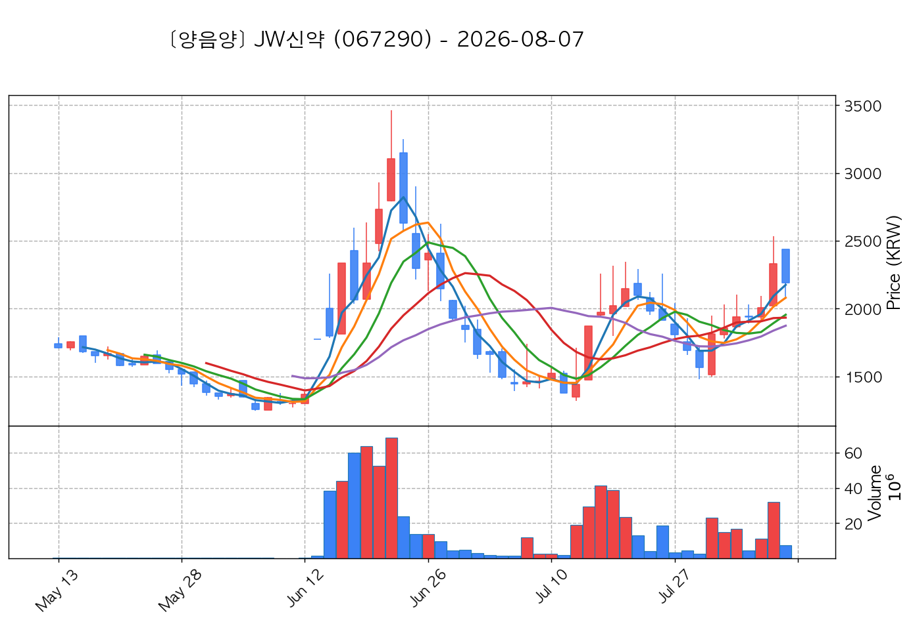
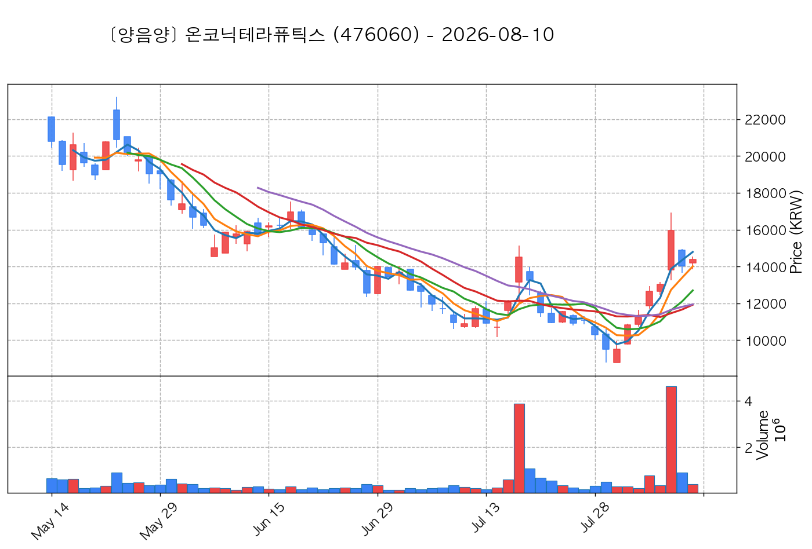

# 📈 [실전플랜 1] 2026-08-13 매매 후보 스크리닝 보고서

> 스크리닝 기준일: 2026-08-13 | [📊 익일 매매 성과 피드백 보고서 보기](./2026-08-13_피드백.html)

---

## 📊 1. 스크리닝 성과 요약

| 전략 | 주요 기법 | 종목수(TOP) |
| :--- | :--- | :---: |
| **전략 1** | 양음양 눌림목 & 사윗감 | 12개 (TOP 3개) |
| **전략 2** | 매집봉 & 이일홍 | 2개 (TOP 1개) |
| **전략 3** | 수급 & 핥 | 1개 (TOP 1개) |
| **합계** | **3대 핵심 전략 통합** | **15개 (TOP 5개)** |

---

## 🔵 3. 전략 1 — 양-음-양 눌림목 (3% × 3슬롯)

### 📋 전략 1 요약표 (상위 10개)

| 종목명 | 기준일종가 | 기준봉 | 지지선 | 비고 및 선정 상태 |
| :--- | ---: | :--- | :---: | :--- |
| **대한광통신** (010170) | 13,200원 | +22.5% 장대양봉 | 3일선 | **★ TOP 1 선택** |
| **제주반도체** (080220) | 88,000원 | +16.3% 장대양봉 | 3일선 | **★ TOP 2 선택** |
| **광전자** (017900) | 8,800원 | +15.0% 장대양봉 | 3일선 | **★ TOP 3 선택** |
| **산일전기** (062040) | 187,100원 | +16.8% 장대양봉 | 3일선 | 후보군 (1위) |
| **JW신약** (067290) | 2,165원 | +16.2% 장대양봉 | 8일선 | 후보군 (2위) |
| **온코닉테라퓨틱스** (476060) | 15,440원 | +22.3% 장대양봉 | 3일선 | 후보군 (3위) |
| **남화토건** (091590) | 6,400원 | 상한가 | 3일선 | 후보군 (4위) |
| **비츠로넥스텍** (488900) | 11,670원 | 상한가 | 3일선 | 후보군 (5위) (사윗감) |
| **신스틸** (162300) | 1,880원 | 상한가 | 3일선 | 후보군 (6위) (사윗감) |
| **샤페론** (378800) | 520원 | 상한가 | 3일선 | 후보군 (7위) |

---

### 🔍 전략 1 상세 분석

#### 1) 대한광통신 (010170) — ★ TOP 1 선택

- **기준 종가**: 13,200원 | **거래대금**: 1100억
- **분석 사유**: 과거 2026-08-10 기준봉 후 현재 3일선 지지

#### 2) 제주반도체 (080220) — ★ TOP 2 선택

- **기준 종가**: 88,000원 | **거래대금**: 1782억
- **분석 사유**: 과거 2026-08-10 기준봉 후 현재 3일선 지지

#### 3) 광전자 (017900) — ★ TOP 3 선택

- **기준 종가**: 8,800원 | **거래대금**: 420억
- **분석 사유**: 과거 2026-08-07 기준봉 후 현재 3일선 지지

#### 4) 산일전기 (062040) — 후보군 (1위)

- **기준 종가**: 187,100원 | **거래대금**: 433억
- **분석 사유**: 과거 2026-08-10 기준봉 후 현재 3일선 지지

#### 5) JW신약 (067290) — 후보군 (2위)

- **기준 종가**: 2,165원 | **거래대금**: 80억
- **분석 사유**: 과거 2026-08-06 기준봉 후 현재 8일선 지지

#### 6) 온코닉테라퓨틱스 (476060) — 후보군 (3위)

- **기준 종가**: 15,440원 | **거래대금**: 73억
- **분석 사유**: 과거 2026-08-06 기준봉 후 현재 3일선 지지

#### 7) 남화토건 (091590) — 후보군 (4위)

- **기준 종가**: 6,400원 | **거래대금**: 326억
- **분석 사유**: 과거 2026-08-11 기준봉 후 현재 3일선 지지

#### 8) 비츠로넥스텍 (488900) — 후보군 (5위) (사윗감)

- **기준 종가**: 11,670원 | **거래대금**: 32억
- **분석 사유**: 과거 2026-08-10 기준봉 후 현재 3일선 지지

#### 9) 신스틸 (162300) — 후보군 (6위) (사윗감)

- **기준 종가**: 1,880원 | **거래대금**: 89억
- **분석 사유**: 과거 2026-08-07 기준봉 후 현재 3일선 지지

#### 10) 샤페론 (378800) — 후보군 (7위)

- **기준 종가**: 520원 | **거래대금**: 48억
- **분석 사유**: 과거 2026-08-12 기준봉 후 현재 3일선 지지

## 🟡 4. 전략 2 — 일일봉 매집봉 (10% × 1슬롯)

### 📋 전략 2 요약표 (상위 2개)

| 종목명 | 기준일종가 | 기준봉 | 지지선 | 비고 및 선정 상태 |
| :--- | ---: | :--- | :---: | :--- |
| **DB손해보험** (005830) | 167,400원 | ★ [1순위 키움정석] 40일 최고가 근접 + 60일선 상승 + 시가대비 +5.5% 속양봉 | 240일선 | **★ TOP 1 선택** |
| **OCI** (456040) | 80,000원 | 과거 2026-07-23 매집봉 ➔ 240일선 근접 지지 (-0.12%) | 240일선 | 후보군 (1위) |

---

### 🔍 전략 2 상세 분석

#### 1) DB손해보험 (005830) — ★ TOP 1 선택

- **기준 종가**: 167,400원 | **거래대금**: 360억
- **분석 사유**: ★ [1순위 키움정석] 40일 최고가 근접 + 60일선 상승 + 시가대비 +5.5% 속양봉

#### 2) OCI (456040) — 후보군 (1위)

- **기준 종가**: 80,000원 | **거래대금**: 38억
- **분석 사유**: 과거 2026-07-23 매집봉 ➔ 240일선 근접 지지 (-0.12%)

## 🟢 5. 전략 3 — 수급 낙폭과대 바닥형 (10% × 2슬롯)

### 📋 전략 3 요약표 (상위 1개)

| 종목명 | 기준일종가 | 기준봉 | 지지선 | 비고 및 선정 상태 |
| :--- | ---: | :--- | :---: | :--- |
| **리가켐바이오** (141080) | 114,700원 | 52주 고점 대비 (51.0%) ➔ 20일 메이저 수급 100억+ 유입 ➔ 없음 지지 안착 | 수급선 | **★ TOP 1 선택** |

---

### 🔍 전략 3 상세 분석

#### 1) 리가켐바이오 (141080) — ★ TOP 1 선택

- **기준 종가**: 114,700원 | **거래대금**: 294억
- **분석 사유**: 52주 고점 대비 (51.0%) ➔ 20일 메이저 수급 100억+ 유입 ➔ 없음 지지 안착

