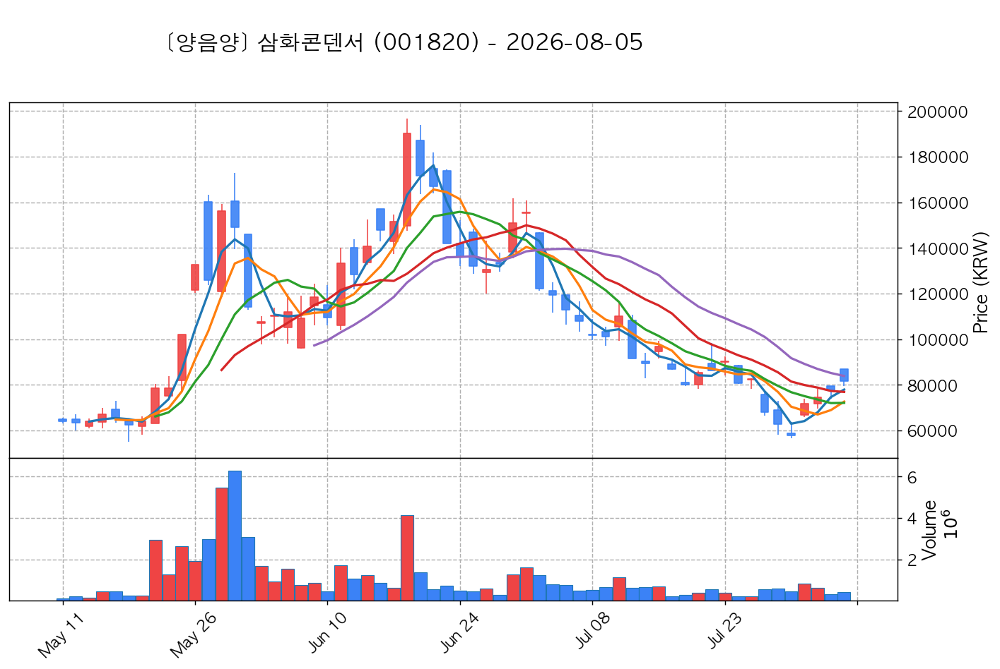
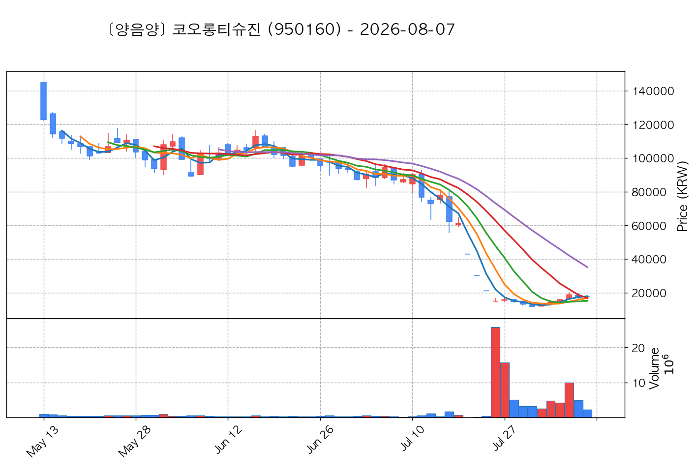

# 📈 [실전플랜 1] 2026-08-19 매매 후보 스크리닝 보고서

> 스크리닝 기준일: 2026-08-19 | [📊 익일 매매 성과 피드백 보고서 보기](./2026-08-19_피드백.html)

---

## 📊 1. 스크리닝 성과 요약

| 전략 | 주요 기법 | 종목수(TOP) |
| :--- | :--- | :---: |
| **전략 1** | 양음양 눌림목 & 사윗감 | 28개 (TOP 3개) |
| **전략 2** | 매집봉 & 이일홍 | 2개 (TOP 1개) |
| **전략 3** | 수급 & 핥 | 1개 (TOP 1개) |
| **합계** | **3대 핵심 전략 통합** | **31개 (TOP 5개)** |

---

## 🔵 3. 전략 1 — 양-음-양 눌림목 (3% × 3슬롯)

### 📋 전략 1 요약표 (상위 10개)

| 종목명 | 기준일종가 | 기준봉 | 지지선 | 비고 및 선정 상태 |
| :--- | ---: | :--- | :---: | :--- |
| **대한광통신** (010170) | 12,900원 | +22.5% 장대양봉 | 3일선 | **★ TOP 1 선택** |
| **제주반도체** (080220) | 74,200원 | +16.3% 장대양봉 | 20일선 | **★ TOP 2 선택** |
| **삼화콘덴서** (001820) | 94,300원 | +17.4% 장대양봉 | 5일선 | **★ TOP 3 선택** |
| **한국콜마** (161890) | 128,100원 | +22.8% 장대양봉 | 3일선 | 후보군 (1위) (사윗감) |
| **한라캐스트** (125490) | 12,150원 | +16.3% 장대양봉 | 3일선 | 후보군 (2위) |
| **PS일렉트로닉스** (332570) | 8,630원 | 상한가 | 13일선 | 후보군 (3위) |
| **코오롱티슈진** (950160) | 25,500원 | +19.9% 장대양봉 | 5일선 | 후보군 (4위) (사윗감) |
| **코스맥스** (192820) | 245,500원 | +18.8% 장대양봉 | 3일선 | 후보군 (5위) |
| **본느** (226340) | 6,480원 | 상한가 | 3일선 | 후보군 (6위) (사윗감) |
| **산일전기** (062040) | 176,100원 | +16.8% 장대양봉 | 3일선 | 후보군 (7위) |

---

### 🔍 전략 1 상세 분석

#### 1) 대한광통신 (010170) — ★ TOP 1 선택

- **기준 종가**: 12,900원 | **거래대금**: 492억
- **분석 사유**: 과거 2026-08-10 기준봉 후 현재 3일선 지지

#### 2) 제주반도체 (080220) — ★ TOP 2 선택

- **기준 종가**: 74,200원 | **거래대금**: 944억
- **분석 사유**: 과거 2026-08-10 기준봉 후 현재 20일선 지지

#### 3) 삼화콘덴서 (001820) — ★ TOP 3 선택

- **기준 종가**: 94,300원 | **거래대금**: 366억
- **분석 사유**: 과거 2026-08-13 기준봉 후 현재 5일선 지지

#### 4) 한국콜마 (161890) — 후보군 (1위) (사윗감)

- **기준 종가**: 128,100원 | **거래대금**: 353억
- **분석 사유**: 과거 2026-08-12 기준봉 후 현재 3일선 지지

#### 5) 한라캐스트 (125490) — 후보군 (2위)

- **기준 종가**: 12,150원 | **거래대금**: 953억
- **분석 사유**: 과거 2026-08-14 기준봉 후 현재 3일선 지지

#### 6) PS일렉트로닉스 (332570) — 후보군 (3위)

- **기준 종가**: 8,630원 | **거래대금**: 353억
- **분석 사유**: 과거 2026-08-13 기준봉 후 현재 13일선 지지

#### 7) 코오롱티슈진 (950160) — 후보군 (4위) (사윗감)

- **기준 종가**: 25,500원 | **거래대금**: 529억
- **분석 사유**: 과거 2026-08-13 기준봉 후 현재 5일선 지지

#### 8) 코스맥스 (192820) — 후보군 (5위)

- **기준 종가**: 245,500원 | **거래대금**: 283억
- **분석 사유**: 과거 2026-08-12 기준봉 후 현재 3일선 지지

#### 9) 본느 (226340) — 후보군 (6위) (사윗감)

- **기준 종가**: 6,480원 | **거래대금**: 156억
- **분석 사유**: 과거 2026-08-11 기준봉 후 현재 3일선 지지

#### 10) 산일전기 (062040) — 후보군 (7위)

- **기준 종가**: 176,100원 | **거래대금**: 267억
- **분석 사유**: 과거 2026-08-10 기준봉 후 현재 3일선 지지

## 🟡 4. 전략 2 — 일일봉 매집봉 (10% × 1슬롯)

### 📋 전략 2 요약표 (상위 2개)

| 종목명 | 기준일종가 | 기준봉 | 지지선 | 비고 및 선정 상태 |
| :--- | ---: | :--- | :---: | :--- |
| **조비** (001550) | 13,320원 | ★ [1순위 키움정석] 40일 최고가 근접 + 60일선 상승 + 시가대비 +21.9% 속양봉 | 240일선 | **★ TOP 1 선택** |
| **OCI** (456040) | 79,400원 | 과거 2026-07-23 매집봉 ➔ 240일선 근접 지지 (-1.24%) | 240일선 | 후보군 (1위) |

---

### 🔍 전략 2 상세 분석

#### 1) 조비 (001550) — ★ TOP 1 선택

- **기준 종가**: 13,320원 | **거래대금**: 475억
- **분석 사유**: ★ [1순위 키움정석] 40일 최고가 근접 + 60일선 상승 + 시가대비 +21.9% 속양봉

#### 2) OCI (456040) — 후보군 (1위)

- **기준 종가**: 79,400원 | **거래대금**: 31억
- **분석 사유**: 과거 2026-07-23 매집봉 ➔ 240일선 근접 지지 (-1.24%)

## 🟢 5. 전략 3 — 수급 낙폭과대 바닥형 (10% × 2슬롯)

### 📋 전략 3 요약표 (상위 1개)

| 종목명 | 기준일종가 | 기준봉 | 지지선 | 비고 및 선정 상태 |
| :--- | ---: | :--- | :---: | :--- |
| **한화엔진** (082740) | 46,500원 | 52주 고점 대비 (49.3%) ➔ 20일 메이저 수급 100억+ 유입 ➔ 없음 지지 안착 | 수급선 | **★ TOP 1 선택** |

---

### 🔍 전략 3 상세 분석

#### 1) 한화엔진 (082740) — ★ TOP 1 선택

- **기준 종가**: 46,500원 | **거래대금**: 255억
- **분석 사유**: 52주 고점 대비 (49.3%) ➔ 20일 메이저 수급 100억+ 유입 ➔ 없음 지지 안착

