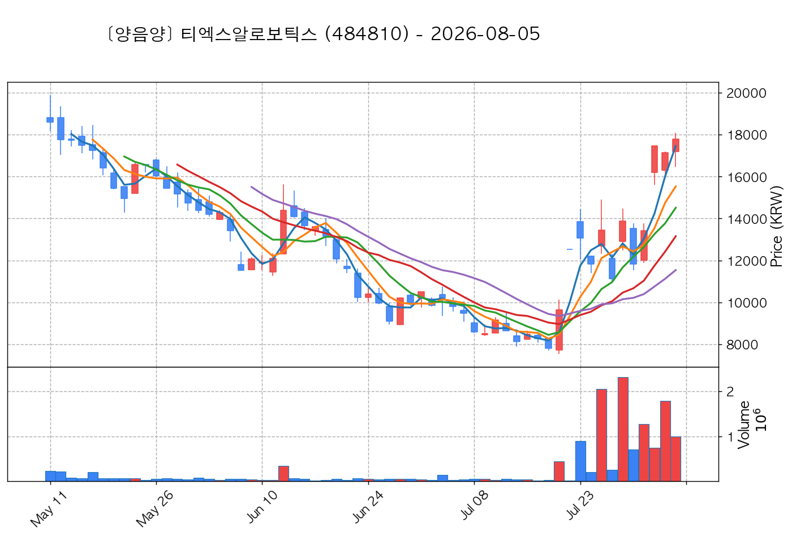

# 📈 [실전플랜 1] 2026-08-20 매매 후보 스크리닝 보고서

> 스크리닝 기준일: 2026-08-20 | [📊 익일 매매 성과 피드백 보고서 보기](./2026-08-20_피드백.html)

---

## 📊 1. 스크리닝 성과 요약

| 전략 | 주요 기법 | 종목수(TOP) |
| :--- | :--- | :---: |
| **전략 1** | 양음양 눌림목 & 사윗감 | 24개 (TOP 3개) |
| **전략 2** | 매집봉 & 이일홍 | 3개 (TOP 1개) |
| **전략 3** | 수급 & 핥 | 0개 (TOP 0개) |
| **합계** | **3대 핵심 전략 통합** | **27개 (TOP 4개)** |

---

## 🔵 3. 전략 1 — 양-음-양 눌림목 (3% × 3슬롯)

### 📋 전략 1 요약표 (상위 10개)

| 종목명 | 기준일종가 | 기준봉 | 지지선 | 비고 및 선정 상태 |
| :--- | ---: | :--- | :---: | :--- |
| **삼화콘덴서** (001820) | 97,200원 | +17.4% 장대양봉 | 3일선 | **★ TOP 1 선택** |
| **한라캐스트** (125490) | 12,010원 | +16.3% 장대양봉 | 3일선 | **★ TOP 2 선택** |
| **에이피알** (278470) | 384,500원 | ADK특 13~20선 반등 | 13일선 (1.15%) | **★ TOP 3 선택** |
| **PS일렉트로닉스** (332570) | 9,460원 | 상한가 | 8일선 | 후보군 (1위) |
| **본느** (226340) | 6,580원 | 상한가 | 8일선 | 후보군 (2위) (사윗감) |
| **일진전기** (103590) | 69,700원 | +17.3% 장대양봉 | 3일선 | 후보군 (3위) |
| **지투파워** (388050) | 9,340원 | 상한가 | 3일선 | 후보군 (4위) (사윗감) |
| **비에이치** (090460) | 16,960원 | +16.8% 장대양봉 | 3일선 | 후보군 (5위) |
| **코칩** (126730) | 19,410원 | 상한가 | 3일선 | 후보군 (6위) (사윗감) |
| **NHN** (181710) | 71,900원 | 상한가 | 3일선 | 후보군 (7위) (사윗감) |

---

### 🔍 전략 1 상세 분석

#### 1) 삼화콘덴서 (001820) — ★ TOP 1 선택

- **기준 종가**: 97,200원 | **거래대금**: 379억
- **분석 사유**: 과거 2026-08-13 기준봉 후 현재 3일선 지지

#### 2) 한라캐스트 (125490) — ★ TOP 2 선택

- **기준 종가**: 12,010원 | **거래대금**: 144억
- **분석 사유**: 과거 2026-08-14 기준봉 후 현재 3일선 지지

#### 3) 에이피알 (278470) — ★ TOP 3 선택

- **기준 종가**: 384,500원 | **거래대금**: 1162억
- **분석 사유**: ★ [ADK특 TOP1] 20봉내 400억+ Envelope상한 돌파 후 13일선 1.15% 이격 초근접 반등

#### 4) PS일렉트로닉스 (332570) — 후보군 (1위)

- **기준 종가**: 9,460원 | **거래대금**: 744억
- **분석 사유**: 과거 2026-08-13 기준봉 후 현재 8일선 지지

#### 5) 본느 (226340) — 후보군 (2위) (사윗감)

- **기준 종가**: 6,580원 | **거래대금**: 253억
- **분석 사유**: 과거 2026-08-11 기준봉 후 현재 8일선 지지

#### 6) 일진전기 (103590) — 후보군 (3위)

- **기준 종가**: 69,700원 | **거래대금**: 152억
- **분석 사유**: 과거 2026-08-12 기준봉 후 현재 3일선 지지

#### 7) 지투파워 (388050) — 후보군 (4위) (사윗감)

- **기준 종가**: 9,340원 | **거래대금**: 430억
- **분석 사유**: 과거 2026-08-13 기준봉 후 현재 3일선 지지

#### 8) 비에이치 (090460) — 후보군 (5위)

- **기준 종가**: 16,960원 | **거래대금**: 113억
- **분석 사유**: 과거 2026-08-11 기준봉 후 현재 3일선 지지

#### 9) 코칩 (126730) — 후보군 (6위) (사윗감)

- **기준 종가**: 19,410원 | **거래대금**: 77억
- **분석 사유**: 과거 2026-08-11 기준봉 후 현재 3일선 지지

#### 10) NHN (181710) — 후보군 (7위) (사윗감)

- **기준 종가**: 71,900원 | **거래대금**: 262억
- **분석 사유**: 과거 2026-08-11 기준봉 후 현재 3일선 지지

## 🟡 4. 전략 2 — 일일봉 매집봉 (10% × 1슬롯)

### 📋 전략 2 요약표 (상위 3개)

| 종목명 | 기준일종가 | 기준봉 | 지지선 | 비고 및 선정 상태 |
| :--- | ---: | :--- | :---: | :--- |
| **헥토파이낸셜** (234340) | 21,300원 | 과거 2026-07-23 매집봉 ➔ 240일선 근접 지지 (-1.76%) | 240일선 | **★ TOP 1 선택** |
| **티엑스알로보틱스** (484810) | 15,810원 | 과거 2026-07-27 매집봉 ➔ 240일선 근접 지지 (+0.49%) | 240일선 | 후보군 (1위) |
| **OCI** (456040) | 81,000원 | 과거 2026-07-23 매집봉 ➔ 240일선 근접 지지 (+0.62%) | 240일선 | 후보군 (2위) |

---

### 🔍 전략 2 상세 분석

#### 1) 헥토파이낸셜 (234340) — ★ TOP 1 선택

- **기준 종가**: 21,300원 | **거래대금**: 290억
- **분석 사유**: 과거 2026-07-23 매집봉 ➔ 240일선 근접 지지 (-1.76%)

#### 2) 티엑스알로보틱스 (484810) — 후보군 (1위)

- **기준 종가**: 15,810원 | **거래대금**: 69억
- **분석 사유**: 과거 2026-07-27 매집봉 ➔ 240일선 근접 지지 (+0.49%)

#### 3) OCI (456040) — 후보군 (2위)

- **기준 종가**: 81,000원 | **거래대금**: 33억
- **분석 사유**: 과거 2026-07-23 매집봉 ➔ 240일선 근접 지지 (+0.62%)

## 🟢 5. 전략 3 — 수급 낙폭과대 바닥형 (10% × 2슬롯)

해당 전략 포착 종목 없음

