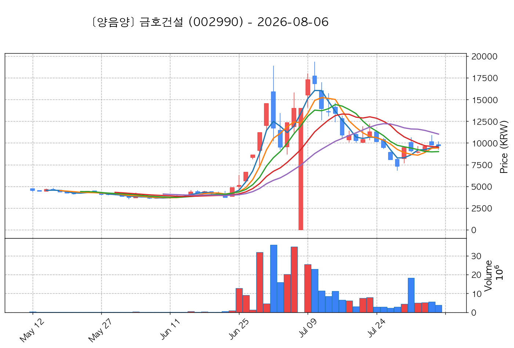

# 📈 [실전플랜 1] 2026-08-24 매매 후보 스크리닝 보고서

> 스크리닝 기준일: 2026-08-24 | [📊 익일 매매 성과 피드백 보고서 보기](./2026-08-24_피드백.html)

---

## 📊 1. 스크리닝 성과 요약

| 전략 | 주요 기법 | 종목수(TOP) |
| :--- | :--- | :---: |
| **전략 1** | 양음양 눌림목 & 사윗감 | 23개 (TOP 3개) |
| **전략 2** | 매집봉 & 이일홍 | 4개 (TOP 1개) |
| **전략 3** | 수급 & 핥 | 1개 (TOP 1개) |
| **합계** | **3대 핵심 전략 통합** | **28개 (TOP 5개)** |

---

## 🔵 3. 전략 1 — 양-음-양 눌림목 (3% × 3슬롯)

### 📋 전략 1 요약표 (상위 10개)

| 종목명 | 기준일종가 | 기준봉 | 지지선 | 비고 및 선정 상태 |
| :--- | ---: | :--- | :---: | :--- |
| **삼화콘덴서** (001820) | 92,400원 | +17.4% 장대양봉 | 3일선 | **★ TOP 1 선택** |
| **금호건설** (002990) | 14,700원 | +24.2% 장대양봉 | 3일선 | **★ TOP 2 선택** (사윗감) |
| **아난티** (025980) | 5,160원 | +18.9% 장대양봉 | 3일선 | **★ TOP 3 선택** |
| **코오롱티슈진** (950160) | 20,350원 | +19.9% 장대양봉 | 3일선 | 후보군 (1위) (사윗감) |
| **코칩** (126730) | 17,960원 | ADK특 13~20선 반등 | 13일선 (1.1%) | 후보군 (2위) |
| **레메디** (387690) | 12,150원 | +15.3% 장대양봉 | 8일선 | 후보군 (3위) |
| **지투파워** (388050) | 8,540원 | 상한가 | 13일선 | 후보군 (4위) (사윗감) |
| **빙그레** (005180) | 88,000원 | +19.9% 장대양봉 | 3일선 | 후보군 (5위) |
| **서산** (079650) | 4,750원 | +16.2% 장대양봉 | 13일선 | 후보군 (6위) (사윗감) |
| **화신정공** (126640) | 4,340원 | 상한가 | 8일선 | 후보군 (7위) |

---

### 🔍 전략 1 상세 분석

#### 1) 삼화콘덴서 (001820) — ★ TOP 1 선택

- **기준 종가**: 92,400원 | **거래대금**: 241억
- **분석 사유**: 과거 2026-08-13 기준봉 후 현재 3일선 지지

#### 2) 금호건설 (002990) — ★ TOP 2 선택 (사윗감)

- **기준 종가**: 14,700원 | **거래대금**: 873억
- **분석 사유**: 과거 2026-08-20 기준봉 후 현재 3일선 지지

#### 3) 아난티 (025980) — ★ TOP 3 선택

- **기준 종가**: 5,160원 | **거래대금**: 235억
- **분석 사유**: 과거 2026-08-19 기준봉 후 현재 3일선 지지

#### 4) 코오롱티슈진 (950160) — 후보군 (1위) (사윗감)

- **기준 종가**: 20,350원 | **거래대금**: 501억
- **분석 사유**: 과거 2026-08-13 기준봉 후 현재 3일선 지지

#### 5) 코칩 (126730) — 후보군 (2위)

- **기준 종가**: 17,960원 | **거래대금**: 23억
- **분석 사유**: ★ [ADK특 TOP1] 20봉내 400억+ Envelope상한 돌파 후 13일선 1.1% 이격 초근접 반등

#### 6) 레메디 (387690) — 후보군 (3위)

- **기준 종가**: 12,150원 | **거래대금**: 67억
- **분석 사유**: 과거 2026-08-20 기준봉 후 현재 8일선 지지

#### 7) 지투파워 (388050) — 후보군 (4위) (사윗감)

- **기준 종가**: 8,540원 | **거래대금**: 36억
- **분석 사유**: 과거 2026-08-13 기준봉 후 현재 13일선 지지

#### 8) 빙그레 (005180) — 후보군 (5위)

- **기준 종가**: 88,000원 | **거래대금**: 96억
- **분석 사유**: 과거 2026-08-14 기준봉 후 현재 3일선 지지

#### 9) 서산 (079650) — 후보군 (6위) (사윗감)

- **기준 종가**: 4,750원 | **거래대금**: 52억
- **분석 사유**: 과거 2026-08-20 기준봉 후 현재 13일선 지지

#### 10) 화신정공 (126640) — 후보군 (7위)

- **기준 종가**: 4,340원 | **거래대금**: 52억
- **분석 사유**: 과거 2026-08-19 기준봉 후 현재 8일선 지지

## 🟡 4. 전략 2 — 일일봉 매집봉 (10% × 1슬롯)

### 📋 전략 2 요약표 (상위 4개)

| 종목명 | 기준일종가 | 기준봉 | 지지선 | 비고 및 선정 상태 |
| :--- | ---: | :--- | :---: | :--- |
| **에이피알** (278470) | 407,500원 | ★ [1순위 키움정석] 40일 최고가 근접 + 60일선 상승 + 시가대비 +5.4% 속양봉 | 240일선 | **★ TOP 1 선택** |
| **헥토파이낸셜** (234340) | 21,125원 | 과거 2026-07-23 매집봉 ➔ 240일선 근접 지지 (-2.74%) | 240일선 | 후보군 (1위) |
| **한켐** (457370) | 8,720원 | 과거 2026-08-07 매집봉 ➔ 240일선 근접 지지 (-2.78%) | 240일선 | 후보군 (2위) |
| **비엘팜텍** (065170) | 1,996원 | 과거 2026-06-26 매집봉 ➔ 240일선 근접 지지 (+1.33%) | 240일선 | 후보군 (3위) |

---

### 🔍 전략 2 상세 분석

#### 1) 에이피알 (278470) — ★ TOP 1 선택

- **기준 종가**: 407,500원 | **거래대금**: 1340억
- **분석 사유**: ★ [1순위 키움정석] 40일 최고가 근접 + 60일선 상승 + 시가대비 +5.4% 속양봉

#### 2) 헥토파이낸셜 (234340) — 후보군 (1위)

- **기준 종가**: 21,125원 | **거래대금**: 240억
- **분석 사유**: 과거 2026-07-23 매집봉 ➔ 240일선 근접 지지 (-2.74%)

#### 3) 한켐 (457370) — 후보군 (2위)

- **기준 종가**: 8,720원 | **거래대금**: 135억
- **분석 사유**: 과거 2026-08-07 매집봉 ➔ 240일선 근접 지지 (-2.78%)

#### 4) 비엘팜텍 (065170) — 후보군 (3위)

- **기준 종가**: 1,996원 | **거래대금**: 18억
- **분석 사유**: 과거 2026-06-26 매집봉 ➔ 240일선 근접 지지 (+1.33%)

## 🟢 5. 전략 3 — 수급 낙폭과대 바닥형 (10% × 2슬롯)

### 📋 전략 3 요약표 (상위 1개)

| 종목명 | 기준일종가 | 기준봉 | 지지선 | 비고 및 선정 상태 |
| :--- | ---: | :--- | :---: | :--- |
| **대한광통신** (010170) | 13,020원 | 52주 고점 대비 (41.3%) ➔ 20일 메이저 수급 100억+ 유입 ➔ 없음 지지 안착 | 수급선 | **★ TOP 1 선택** |

---

### 🔍 전략 3 상세 분석

#### 1) 대한광통신 (010170) — ★ TOP 1 선택

- **기준 종가**: 13,020원 | **거래대금**: 733억
- **분석 사유**: 52주 고점 대비 (41.3%) ➔ 20일 메이저 수급 100억+ 유입 ➔ 없음 지지 안착

