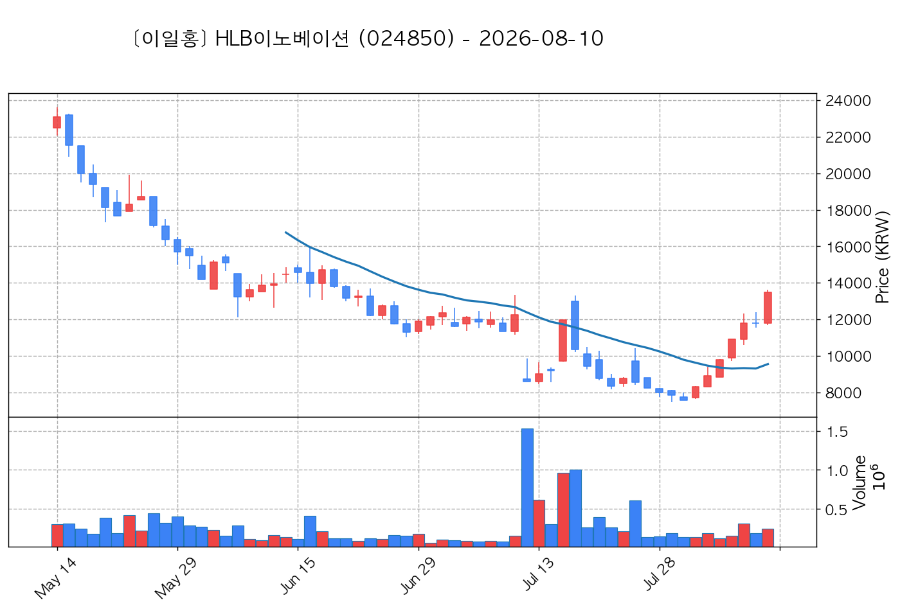

# 📈 [실전플랜 1] 2026-09-01 매매 후보 스크리닝 보고서

> 스크리닝 기준일: 2026-09-01 | [📊 익일 매매 성과 피드백 보고서 보기](./2026-09-01_피드백.html)

---

## 📊 1. 스크리닝 성과 요약

| 전략 | 주요 기법 | 종목수(TOP) |
| :--- | :--- | :---: |
| **전략 1** | 양음양 눌림목 & 사윗감 | 19개 (TOP 3개) |
| **전략 2** | 매집봉 & 이일홍 | 10개 (TOP 1개) |
| **전략 3** | 수급 & 핥 | 0개 (TOP 0개) |
| **합계** | **3대 핵심 전략 통합** | **29개 (TOP 4개)** |

---

## 🔵 3. 전략 1 — 양-음-양 눌림목 (3% × 3슬롯)

### 📋 전략 1 요약표 (상위 10개)

| 종목명 | 기준일종가 | 기준봉 | 지지선 | 비고 및 선정 상태 |
| :--- | ---: | :--- | :---: | :--- |
| **한미약품** (128940) | 491,500원 | 상한가 | 3일선 | **★ TOP 1 선택** |
| **우리기술투자** (041190) | 6,240원 | +15.8% 장대양봉 | 3일선 | **★ TOP 2 선택** |
| **한미사이언스** (008930) | 45,900원 | +25.7% 장대양봉 | 3일선 | **★ TOP 3 선택** |
| **한화** (000880) | 128,900원 | +17.4% 장대양봉 | 5일선 | 후보군 (1위) |
| **가온전선** (000500) | 210,750원 | +25.0% 장대양봉 | 3일선 | 후보군 (2위) |
| **한전기술** (052690) | 110,400원 | +20.3% 장대양봉 | 8일선 | 후보군 (3위) (사윗감) |
| **엘앤에프** (066970) | 135,000원 | +16.4% 장대양봉 | 3일선 | 후보군 (4위) |
| **한국화장품제조** (003350) | 13,930원 | +23.0% 장대양봉 | 5일선 | 후보군 (5위) |
| **아이티센글로벌** (124500) | 33,400원 | +16.4% 장대양봉 | 13일선 | 후보군 (6위) (사윗감) |
| **SK아이이테크놀로지** (361610) | 16,210원 | 상한가 | 3일선 | 후보군 (7위) |

---

### 🔍 전략 1 상세 분석

#### 1) 한미약품 (128940) — ★ TOP 1 선택

- **기준 종가**: 491,500원 | **거래대금**: 410억
- **분석 사유**: 과거 2026-08-24 기준봉 후 현재 3일선 지지

#### 2) 우리기술투자 (041190) — ★ TOP 2 선택

- **기준 종가**: 6,240원 | **거래대금**: 207억
- **분석 사유**: 🚨[매물대 저항] 과거 2026-08-25 기준봉 후 현재 3일선 지지

#### 3) 한미사이언스 (008930) — ★ TOP 3 선택

- **기준 종가**: 45,900원 | **거래대금**: 80억
- **분석 사유**: [쌍바닥참고] 과거 2026-08-24 기준봉 후 현재 3일선 지지

#### 4) 한화 (000880) — 후보군 (1위)

- **기준 종가**: 128,900원 | **거래대금**: 498억
- **분석 사유**: 과거 2026-08-25 기준봉 후 현재 5일선 지지

#### 5) 가온전선 (000500) — 후보군 (2위)

- **기준 종가**: 210,750원 | **거래대금**: 211억
- **분석 사유**: 과거 2026-08-27 기준봉 후 현재 3일선 지지

#### 6) 한전기술 (052690) — 후보군 (3위) (사윗감)

- **기준 종가**: 110,400원 | **거래대금**: 297억
- **분석 사유**: 🚨[매물대 저항] 과거 2026-08-25 기준봉 후 현재 8일선 지지

#### 7) 엘앤에프 (066970) — 후보군 (4위)

- **기준 종가**: 135,000원 | **거래대금**: 1289억
- **분석 사유**: 과거 2026-08-24 기준봉 후 현재 3일선 지지

#### 8) 한국화장품제조 (003350) — 후보군 (5위)

- **기준 종가**: 13,930원 | **거래대금**: 115억
- **분석 사유**: 과거 2026-08-25 기준봉 후 현재 5일선 지지

#### 9) 아이티센글로벌 (124500) — 후보군 (6위) (사윗감)

- **기준 종가**: 33,400원 | **거래대금**: 210억
- **분석 사유**: 과거 2026-08-24 기준봉 후 현재 13일선 지지

#### 10) SK아이이테크놀로지 (361610) — 후보군 (7위)

- **기준 종가**: 16,210원 | **거래대금**: 72억
- **분석 사유**: 🚨[매물대 저항] [쌍바닥참고] 과거 2026-08-26 기준봉 후 현재 3일선 지지

## 🟡 4. 전략 2 — 일일봉 매집봉 (10% × 1슬롯)

### 📋 전략 2 요약표 (상위 10개)

| 종목명 | 기준일종가 | 기준봉 | 지지선 | 비고 및 선정 상태 |
| :--- | ---: | :--- | :---: | :--- |
| **현대약품** (004310) | 8,290원 | ★ [1순위 키움정석] 40일 최고가 근접 + 60일선 상승 + 시가대비 +29.7% 속양봉 | 240일선 | **★ TOP 1 선택** |
| **삼익제약** (014950) | 6,780원 | ★ [1순위 키움정석] 40일 최고가 근접 + 60일선 상승 + 시가대비 +25.3% 속양봉 | 240일선 | 후보군 (1위) |
| **카카오게임즈** (293490) | 9,930원 | ★ [1순위 키움정석] 40일 최고가 근접 + 60일선 상승 + 시가대비 +14.4% 속양봉 | 240일선 | 후보군 (2위) |
| **제일약품** (271980) | 11,450원 | ★ [1순위 키움정석] 40일 최고가 근접 + 60일선 상승 + 시가대비 +8.2% 속양봉 | 240일선 | 후보군 (3위) |
| **제이티** (089790) | 4,990원 | ★ [1순위 키움정석] 40일 최고가 근접 + 60일선 상승 + 시가대비 +14.8% 속양봉 | 240일선 | 후보군 (4위) |
| **온코닉테라퓨틱스** (476060) | 17,870원 | 과거 2026-08-06 매집봉 ➔ 240일선 근접 지지 (+2.50%) | 240일선 | 후보군 (5위) |
| **한켐** (457370) | 8,680원 | 과거 2026-08-07 매집봉 ➔ 240일선 근접 지지 (-2.94%) | 240일선 | 후보군 (6위) |
| **지투파워** (388050) | 9,660원 | 과거 2026-08-14 매집봉 ➔ 240일선 근접 지지 (+1.48%) | 240일선 | 후보군 (7위) |
| **HLB이노베이션** (024850) | 13,980원 | 과거 2026-07-10 매집봉 ➔ 240일선 근접 지지 (+2.20%) | 240일선 | 후보군 (8위) |
| **넥스틸** (092790) | 12,820원 | 과거 2026-08-07 매집봉 ➔ 240일선 근접 지지 (+2.18%) | 240일선 | 후보군 (9위) |

---

### 🔍 전략 2 상세 분석

#### 1) 현대약품 (004310) — ★ TOP 1 선택

- **기준 종가**: 8,290원 | **거래대금**: 1620억
- **분석 사유**: ★ [1순위 키움정석] 40일 최고가 근접 + 60일선 상승 + 시가대비 +29.7% 속양봉

#### 2) 삼익제약 (014950) — 후보군 (1위)

- **기준 종가**: 6,780원 | **거래대금**: 363억
- **분석 사유**: ★ [1순위 키움정석] 40일 최고가 근접 + 60일선 상승 + 시가대비 +25.3% 속양봉

#### 3) 카카오게임즈 (293490) — 후보군 (2위)

- **기준 종가**: 9,930원 | **거래대금**: 301억
- **분석 사유**: ★ [1순위 키움정석] 40일 최고가 근접 + 60일선 상승 + 시가대비 +14.4% 속양봉

#### 4) 제일약품 (271980) — 후보군 (3위)

- **기준 종가**: 11,450원 | **거래대금**: 105억
- **분석 사유**: ★ [1순위 키움정석] 40일 최고가 근접 + 60일선 상승 + 시가대비 +8.2% 속양봉

#### 5) 제이티 (089790) — 후보군 (4위)

- **기준 종가**: 4,990원 | **거래대금**: 75억
- **분석 사유**: ★ [1순위 키움정석] 40일 최고가 근접 + 60일선 상승 + 시가대비 +14.8% 속양봉

#### 6) 온코닉테라퓨틱스 (476060) — 후보군 (5위)

- **기준 종가**: 17,870원 | **거래대금**: 498억
- **분석 사유**: 과거 2026-08-06 매집봉 ➔ 240일선 근접 지지 (+2.50%)

#### 7) 한켐 (457370) — 후보군 (6위)

- **기준 종가**: 8,680원 | **거래대금**: 70억
- **분석 사유**: 과거 2026-08-07 매집봉 ➔ 240일선 근접 지지 (-2.94%)

#### 8) 지투파워 (388050) — 후보군 (7위)

- **기준 종가**: 9,660원 | **거래대금**: 39억
- **분석 사유**: 과거 2026-08-14 매집봉 ➔ 240일선 근접 지지 (+1.48%)

#### 9) HLB이노베이션 (024850) — 후보군 (8위)

- **기준 종가**: 13,980원 | **거래대금**: 23억
- **분석 사유**: 과거 2026-07-10 매집봉 ➔ 240일선 근접 지지 (+2.20%)

#### 10) 넥스틸 (092790) — 후보군 (9위)

- **기준 종가**: 12,820원 | **거래대금**: 21억
- **분석 사유**: 과거 2026-08-07 매집봉 ➔ 240일선 근접 지지 (+2.18%)

## 🟢 5. 전략 3 — 수급 낙폭과대 바닥형 (10% × 2슬롯)

해당 전략 포착 종목 없음

