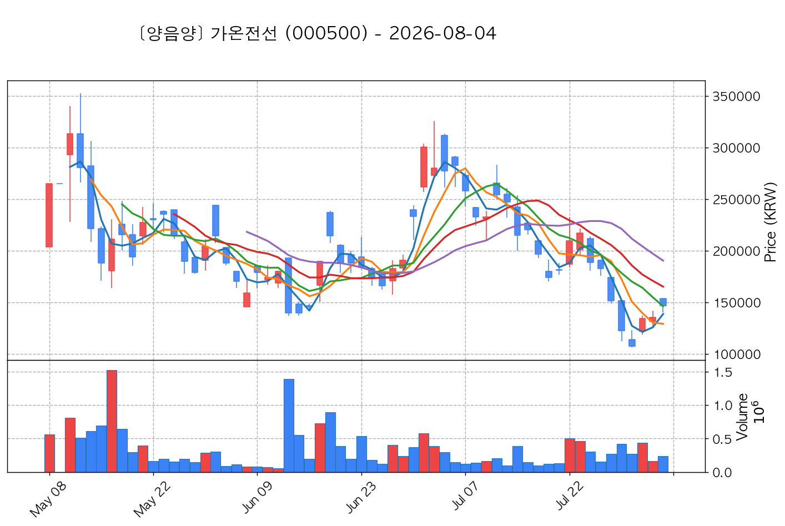

# 📈 [실전플랜 1] 2026-09-02 매매 후보 스크리닝 보고서

> 스크리닝 기준일: 2026-09-02 | [📊 익일 매매 성과 피드백 보고서 보기](./2026-09-02_피드백.html)

---

## 📊 1. 스크리닝 성과 요약

| 전략 | 주요 기법 | 종목수(TOP) |
| :--- | :--- | :---: |
| **전략 1** | 양음양 눌림목 & 사윗감 | 16개 (TOP 3개) |
| **전략 2** | 매집봉 & 이일홍 | 7개 (TOP 1개) |
| **전략 3** | 수급 & 핥 | 3개 (TOP 2개) |
| **합계** | **3대 핵심 전략 통합** | **26개 (TOP 6개)** |

---

## 🔵 3. 전략 1 — 양-음-양 눌림목 (3% × 3슬롯)

### 📋 전략 1 요약표 (상위 10개)

| 종목명 | 기준일종가 | 기준봉 | 지지선 | 비고 및 선정 상태 |
| :--- | ---: | :--- | :---: | :--- |
| **금호전기** (001210) | 13,110원 | +16.9% 장대양봉 | 3일선 | **★ TOP 1 선택** (사윗감) |
| **우리기술투자** (041190) | 5,830원 | +15.8% 장대양봉 | 13일선 | **★ TOP 2 선택** |
| **한화** (000880) | 127,000원 | +17.4% 장대양봉 | 3일선 | **★ TOP 3 선택** |
| **가온전선** (000500) | 201,000원 | +25.0% 장대양봉 | 3일선 | 후보군 (1위) |
| **현대약품** (004310) | 7,670원 | 상한가 | 3일선 | 후보군 (2위) |
| **한전기술** (052690) | 106,700원 | +20.3% 장대양봉 | 13일선 | 후보군 (3위) (사윗감) |
| **비에이치** (090460) | 20,250원 | +20.7% 장대양봉 | 3일선 | 후보군 (4위) |
| **한국화장품제조** (003350) | 13,430원 | +23.0% 장대양봉 | 8일선 | 후보군 (5위) |
| **SK아이이테크놀로지** (361610) | 15,970원 | 상한가 | 3일선 | 후보군 (6위) |
| **원익** (032940) | 7,180원 | +19.4% 장대양봉 | 5일선 | 후보군 (7위) (사윗감) |

---

### 🔍 전략 1 상세 분석

#### 1) 금호전기 (001210) — ★ TOP 1 선택 (사윗감)

- **기준 종가**: 13,110원 | **거래대금**: 958억
- **분석 사유**: 과거 2026-08-31 기준봉 후 현재 3일선 지지

#### 2) 우리기술투자 (041190) — ★ TOP 2 선택

- **기준 종가**: 5,830원 | **거래대금**: 114억
- **분석 사유**: 🚨[매물대 저항] 과거 2026-08-25 기준봉 후 현재 13일선 지지

#### 3) 한화 (000880) — ★ TOP 3 선택

- **기준 종가**: 127,000원 | **거래대금**: 264억
- **분석 사유**: 과거 2026-08-25 기준봉 후 현재 3일선 지지

#### 4) 가온전선 (000500) — 후보군 (1위)

- **기준 종가**: 201,000원 | **거래대금**: 312억
- **분석 사유**: 과거 2026-08-27 기준봉 후 현재 3일선 지지

#### 5) 현대약품 (004310) — 후보군 (2위)

- **기준 종가**: 7,670원 | **거래대금**: 908억
- **분석 사유**: 🚨[매물대 저항] 🌪️ [C타입 갭상승털기] 기준봉 익일 갭상승 후 음봉 손바꿈 (기준봉 50% 사수)

#### 6) 한전기술 (052690) — 후보군 (3위) (사윗감)

- **기준 종가**: 106,700원 | **거래대금**: 178억
- **분석 사유**: 🚨[매물대 저항] [쌍바닥참고] 과거 2026-08-25 기준봉 후 현재 13일선 지지

#### 7) 비에이치 (090460) — 후보군 (4위)

- **기준 종가**: 20,250원 | **거래대금**: 310억
- **분석 사유**: 과거 2026-09-01 기준봉 후 현재 3일선 지지

#### 8) 한국화장품제조 (003350) — 후보군 (5위)

- **기준 종가**: 13,430원 | **거래대금**: 92억
- **분석 사유**: 🚨[매물대 저항] 과거 2026-08-25 기준봉 후 현재 8일선 지지

#### 9) SK아이이테크놀로지 (361610) — 후보군 (6위)

- **기준 종가**: 15,970원 | **거래대금**: 84억
- **분석 사유**: 🚨[매물대 저항] [쌍바닥참고] 과거 2026-08-26 기준봉 후 현재 3일선 지지

#### 10) 원익 (032940) — 후보군 (7위) (사윗감)

- **기준 종가**: 7,180원 | **거래대금**: 50억
- **분석 사유**: 🚨[매물대 저항] 과거 2026-08-31 기준봉 후 현재 5일선 지지

## 🟡 4. 전략 2 — 일일봉 매집봉 (10% × 1슬롯)

### 📋 전략 2 요약표 (상위 7개)

| 종목명 | 기준일종가 | 기준봉 | 지지선 | 비고 및 선정 상태 |
| :--- | ---: | :--- | :---: | :--- |
| **동양파일** (228340) | 3,885원 | ★ [1순위 키움정석] 40일 최고가 근접 + 60일선 상승 + 시가대비 +29.9% 속양봉 | 240일선 | **★ TOP 1 선택** |
| **제이스로보틱스** (090470) | 4,855원 | ★ [1순위 키움정석] 40일 최고가 근접 + 60일선 상승 + 시가대비 +5.3% 속양봉 | 240일선 | 후보군 (1위) |
| **아이티센글로벌** (124500) | 33,900원 | 과거 2026-08-24 매집봉 ➔ 240일선 근접 지지 (-2.89%) | 240일선 | 후보군 (2위) |
| **온코닉테라퓨틱스** (476060) | 16,990원 | 과거 2026-08-06 매집봉 ➔ 240일선 근접 지지 (-2.75%) | 240일선 | 후보군 (3위) |
| **SK증권** (001510) | 2,460원 | 과거 2026-08-21 매집봉 ➔ 240일선 근접 지지 (+0.15%) | 240일선 | 후보군 (4위) |
| **한미글로벌** (053690) | 20,700원 | 과거 2026-08-26 매집봉 ➔ 240일선 근접 지지 (+0.36%) | 240일선 | 후보군 (5위) |
| **지투파워** (388050) | 9,260원 | 과거 2026-08-14 매집봉 ➔ 240일선 근접 지지 (-2.74%) | 240일선 | 후보군 (6위) |

---

### 🔍 전략 2 상세 분석

#### 1) 동양파일 (228340) — ★ TOP 1 선택

- **기준 종가**: 3,885원 | **거래대금**: 104억
- **분석 사유**: ★ [1순위 키움정석] 40일 최고가 근접 + 60일선 상승 + 시가대비 +29.9% 속양봉

#### 2) 제이스로보틱스 (090470) — 후보군 (1위)

- **기준 종가**: 4,855원 | **거래대금**: 77억
- **분석 사유**: ★ [1순위 키움정석] 40일 최고가 근접 + 60일선 상승 + 시가대비 +5.3% 속양봉

#### 3) 아이티센글로벌 (124500) — 후보군 (2위)

- **기준 종가**: 33,900원 | **거래대금**: 197억
- **분석 사유**: 과거 2026-08-24 매집봉 ➔ 240일선 근접 지지 (-2.89%)

#### 4) 온코닉테라퓨틱스 (476060) — 후보군 (3위)

- **기준 종가**: 16,990원 | **거래대금**: 103억
- **분석 사유**: 과거 2026-08-06 매집봉 ➔ 240일선 근접 지지 (-2.75%)

#### 5) SK증권 (001510) — 후보군 (4위)

- **기준 종가**: 2,460원 | **거래대금**: 54억
- **분석 사유**: 과거 2026-08-21 매집봉 ➔ 240일선 근접 지지 (+0.15%)

#### 6) 한미글로벌 (053690) — 후보군 (5위)

- **기준 종가**: 20,700원 | **거래대금**: 35억
- **분석 사유**: 과거 2026-08-26 매집봉 ➔ 240일선 근접 지지 (+0.36%)

#### 7) 지투파워 (388050) — 후보군 (6위)

- **기준 종가**: 9,260원 | **거래대금**: 34억
- **분석 사유**: 과거 2026-08-14 매집봉 ➔ 240일선 근접 지지 (-2.74%)

## 🟢 5. 전략 3 — 수급 낙폭과대 바닥형 (10% × 2슬롯)

### 📋 전략 3 요약표 (상위 3개)

| 종목명 | 기준일종가 | 기준봉 | 지지선 | 비고 및 선정 상태 |
| :--- | ---: | :--- | :---: | :--- |
| **LG전자** (066570) | 202,500원 | 52주 고점 대비 (46.2%) ➔ 20일 메이저 수급 100억+ 유입 ➔ 60일선 지지 안착 | 수급선 | **★ TOP 1 선택** |
| **대한광통신** (010170) | 13,650원 | 52주 고점 대비 (43.3%) ➔ 20일 메이저 수급 100억+ 유입 ➔ 120일선 지지 안착 | 수급선 | **★ TOP 2 선택** |
| **LG** (003550) | 117,900원 | 52주 고점 대비 (63.4%) ➔ 20일 메이저 수급 100억+ 유입 ➔ 없음 지지 안착 | 수급선 | 후보군 (1위) |

---

### 🔍 전략 3 상세 분석

#### 1) LG전자 (066570) — ★ TOP 1 선택

- **기준 종가**: 202,500원 | **거래대금**: 963억
- **분석 사유**: 52주 고점 대비 (46.2%) ➔ 20일 메이저 수급 100억+ 유입 ➔ 60일선 지지 안착

#### 2) 대한광통신 (010170) — ★ TOP 2 선택

- **기준 종가**: 13,650원 | **거래대금**: 852억
- **분석 사유**: 52주 고점 대비 (43.3%) ➔ 20일 메이저 수급 100억+ 유입 ➔ 120일선 지지 안착

#### 3) LG (003550) — 후보군 (1위)

- **기준 종가**: 117,900원 | **거래대금**: 388억
- **분석 사유**: 52주 고점 대비 (63.4%) ➔ 20일 메이저 수급 100억+ 유입 ➔ 없음 지지 안착

