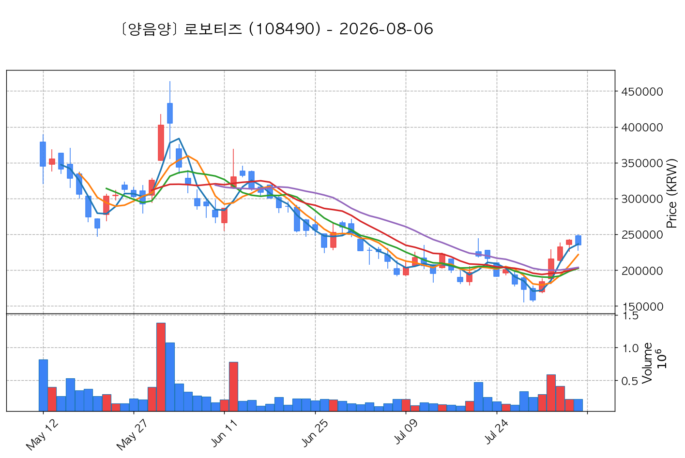
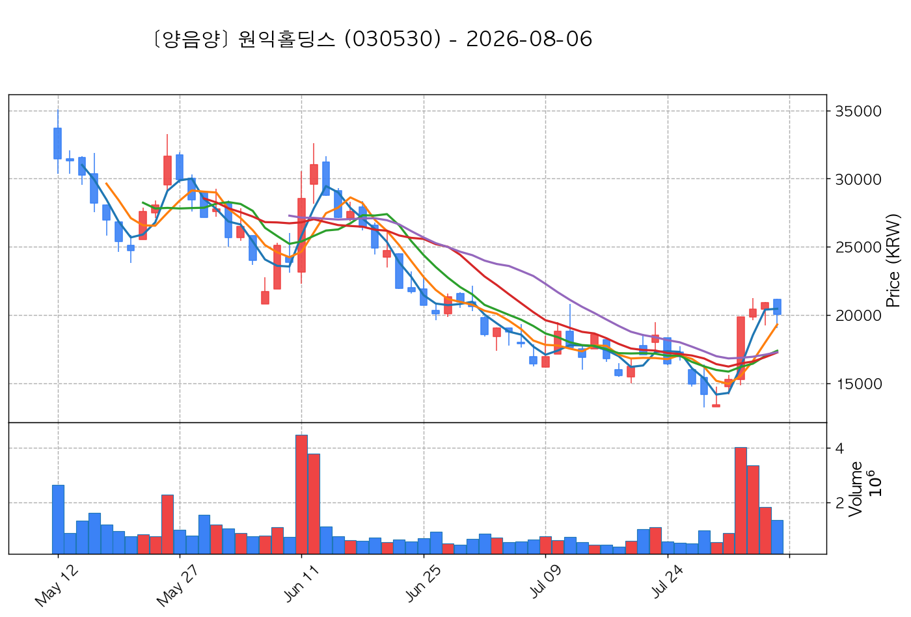

# 📈 [실전플랜 1] 2026-09-07 매매 후보 스크리닝 보고서

> 스크리닝 기준일: 2026-09-07 | [📊 익일 매매 성과 피드백 보고서 보기](./2026-09-07_피드백.html)

---

## 📊 1. 스크리닝 성과 요약

| 전략 | 주요 기법 | 종목수(TOP) |
| :--- | :--- | :---: |
| **전략 1** | 양음양 눌림목 & 사윗감 | 14개 (TOP 3개) |
| **전략 2** | 매집봉 & 이일홍 | 9개 (TOP 1개) |
| **전략 3** | 수급 & 핥 | 0개 (TOP 0개) |
| **합계** | **3대 핵심 전략 통합** | **23개 (TOP 4개)** |

---

## 🔵 3. 전략 1 — 양-음-양 눌림목 (3% × 3슬롯)

### 📋 전략 1 요약표 (상위 10개)

| 종목명 | 기준일종가 | 기준봉 | 지지선 | 비고 및 선정 상태 |
| :--- | ---: | :--- | :---: | :--- |
| **로보티즈** (108490) | 303,500원 | +22.5% 장대양봉 | 3일선 | **★ TOP 1 선택** |
| **금호전기** (001210) | 12,480원 | +16.9% 장대양봉 | 3일선 | **★ TOP 2 선택** (사윗감) |
| **원익홀딩스** (030530) | 22,350원 | 상한가 | 3일선 | **★ TOP 3 선택** |
| **비에이치** (090460) | 21,450원 | +20.7% 장대양봉 | 5일선 | 후보군 (1위) |
| **온코닉테라퓨틱스** (476060) | 16,220원 | +22.1% 장대양봉 | 3일선 | 후보군 (2위) |
| **녹십자웰빙** (234690) | 10,065원 | +16.5% 장대양봉 | 5일선 | 후보군 (3위) |
| **파인엠텍** (441270) | 9,280원 | +18.8% 장대양봉 | 3일선 | 후보군 (4위) |
| **바이오니아** (064550) | 10,410원 | +25.1% 장대양봉 | 3일선 | 후보군 (5위) |
| **피노** (033790) | 9,440원 | +15.5% 장대양봉 | 3일선 | 후보군 (6위) |
| **서산** (079650) | 6,710원 | 상한가 | 5일선 | 후보군 (7위) (사윗감) |

---

### 🔍 전략 1 상세 분석

#### 1) 로보티즈 (108490) — ★ TOP 1 선택

- **기준 종가**: 303,500원 | **거래대금**: 2231억
- **분석 사유**: 🌪️ [C타입 갭상승털기] 기준봉 익일 갭상승 후 음봉 손바꿈 (기준봉 50% 사수)

#### 2) 금호전기 (001210) — ★ TOP 2 선택 (사윗감)

- **기준 종가**: 12,480원 | **거래대금**: 546억
- **분석 사유**: 과거 2026-08-31 기준봉 후 현재 3일선 지지

#### 3) 원익홀딩스 (030530) — ★ TOP 3 선택

- **기준 종가**: 22,350원 | **거래대금**: 1325억
- **분석 사유**: 🌪️ [C타입 갭상승털기] 기준봉 익일 갭상승 후 음봉 손바꿈 (기준봉 50% 사수)

#### 4) 비에이치 (090460) — 후보군 (1위)

- **기준 종가**: 21,450원 | **거래대금**: 308억
- **분석 사유**: 과거 2026-09-01 기준봉 후 현재 5일선 지지

#### 5) 온코닉테라퓨틱스 (476060) — 후보군 (2위)

- **기준 종가**: 16,220원 | **거래대금**: 44억
- **분석 사유**: 🚨[매물대 저항] 과거 2026-08-31 기준봉 후 현재 3일선 지지

#### 6) 녹십자웰빙 (234690) — 후보군 (3위)

- **기준 종가**: 10,065원 | **거래대금**: 95억
- **분석 사유**: 🚨[매물대 저항] 과거 2026-09-03 기준봉 후 현재 5일선 지지

#### 7) 파인엠텍 (441270) — 후보군 (4위)

- **기준 종가**: 9,280원 | **거래대금**: 182억
- **분석 사유**: 과거 2026-09-03 기준봉 후 현재 3일선 지지

#### 8) 바이오니아 (064550) — 후보군 (5위)

- **기준 종가**: 10,410원 | **거래대금**: 208억
- **분석 사유**: 과거 2026-09-01 기준봉 후 현재 3일선 지지

#### 9) 피노 (033790) — 후보군 (6위)

- **기준 종가**: 9,440원 | **거래대금**: 311억
- **분석 사유**: 과거 2026-09-04 기준봉 후 현재 3일선 지지

#### 10) 서산 (079650) — 후보군 (7위) (사윗감)

- **기준 종가**: 6,710원 | **거래대금**: 334억
- **분석 사유**: 과거 2026-09-02 기준봉 후 현재 5일선 지지

## 🟡 4. 전략 2 — 일일봉 매집봉 (10% × 1슬롯)

### 📋 전략 2 요약표 (상위 9개)

| 종목명 | 기준일종가 | 기준봉 | 지지선 | 비고 및 선정 상태 |
| :--- | ---: | :--- | :---: | :--- |
| **한전기술** (052690) | 124,200원 | ★ [1순위 키움정석] 40일 최고가 근접 + 60일선 상승 + 시가대비 +15.1% 속양봉 | 240일선 | **★ TOP 1 선택** |
| **나무가** (190510) | 15,980원 | ★ [1순위 키움정석] 40일 최고가 근접 + 60일선 상승 + 시가대비 +15.0% 속양봉 | 240일선 | 후보군 (1위) |
| **한전산업** (130660) | 12,740원 | ★ [1순위 키움정석] 40일 최고가 근접 + 60일선 상승 + 시가대비 +5.7% 속양봉 | 240일선 | 후보군 (2위) |
| **네오오토** (212560) | 11,880원 | ★ [1순위 키움정석] 40일 최고가 근접 + 60일선 상승 + 시가대비 +20.4% 속양봉 | 240일선 | 후보군 (3위) |
| **삼미금속** (012210) | 10,360원 | 과거 2026-08-13 매집봉 ➔ 240일선 근접 지지 (-0.86%) | 240일선 | 후보군 (4위) |
| **아이티센글로벌** (124500) | 34,300원 | 과거 2026-08-24 매집봉 ➔ 240일선 근접 지지 (-2.28%) | 240일선 | 후보군 (5위) |
| **더즌** (462860) | 3,395원 | 과거 2026-07-23 매집봉 ➔ 240일선 근접 지지 (-2.25%) | 240일선 | 후보군 (6위) |
| **SK증권** (001510) | 2,465원 | 과거 2026-08-21 매집봉 ➔ 240일선 근접 지지 (-0.19%) | 240일선 | 후보군 (7위) |
| **드림텍** (192650) | 6,420원 | 과거 2026-08-27 매집봉 ➔ 240일선 근접 지지 (+1.97%) | 240일선 | 후보군 (8위) |

---

### 🔍 전략 2 상세 분석

#### 1) 한전기술 (052690) — ★ TOP 1 선택

- **기준 종가**: 124,200원 | **거래대금**: 1017억
- **분석 사유**: ★ [1순위 키움정석] 40일 최고가 근접 + 60일선 상승 + 시가대비 +15.1% 속양봉

#### 2) 나무가 (190510) — 후보군 (1위)

- **기준 종가**: 15,980원 | **거래대금**: 275억
- **분석 사유**: ★ [1순위 키움정석] 40일 최고가 근접 + 60일선 상승 + 시가대비 +15.0% 속양봉

#### 3) 한전산업 (130660) — 후보군 (2위)

- **기준 종가**: 12,740원 | **거래대금**: 213억
- **분석 사유**: ★ [1순위 키움정석] 40일 최고가 근접 + 60일선 상승 + 시가대비 +5.7% 속양봉

#### 4) 네오오토 (212560) — 후보군 (3위)

- **기준 종가**: 11,880원 | **거래대금**: 169억
- **분석 사유**: ★ [1순위 키움정석] 40일 최고가 근접 + 60일선 상승 + 시가대비 +20.4% 속양봉

#### 5) 삼미금속 (012210) — 후보군 (4위)

- **기준 종가**: 10,360원 | **거래대금**: 1614억
- **분석 사유**: 과거 2026-08-13 매집봉 ➔ 240일선 근접 지지 (-0.86%)

#### 6) 아이티센글로벌 (124500) — 후보군 (5위)

- **기준 종가**: 34,300원 | **거래대금**: 76억
- **분석 사유**: 과거 2026-08-24 매집봉 ➔ 240일선 근접 지지 (-2.28%)

#### 7) 더즌 (462860) — 후보군 (6위)

- **기준 종가**: 3,395원 | **거래대금**: 65억
- **분석 사유**: 과거 2026-07-23 매집봉 ➔ 240일선 근접 지지 (-2.25%)

#### 8) SK증권 (001510) — 후보군 (7위)

- **기준 종가**: 2,465원 | **거래대금**: 53억
- **분석 사유**: 과거 2026-08-21 매집봉 ➔ 240일선 근접 지지 (-0.19%)

#### 9) 드림텍 (192650) — 후보군 (8위)

- **기준 종가**: 6,420원 | **거래대금**: 31억
- **분석 사유**: 과거 2026-08-27 매집봉 ➔ 240일선 근접 지지 (+1.97%)

## 🟢 5. 전략 3 — 수급 낙폭과대 바닥형 (10% × 2슬롯)

해당 전략 포착 종목 없음

