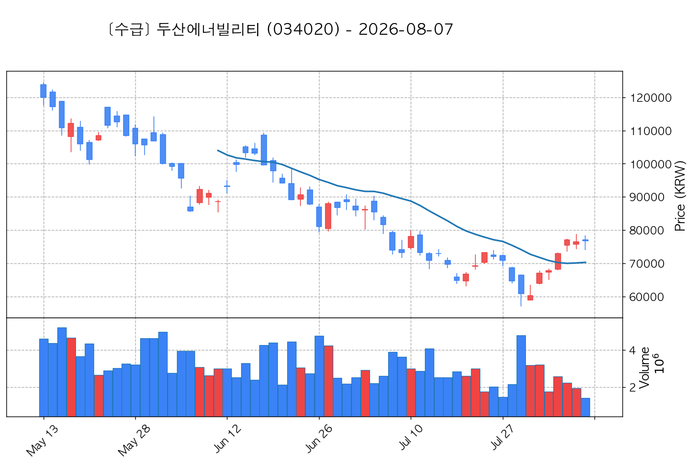

# 📈 [실전플랜 1] 2026-09-09 매매 후보 스크리닝 보고서

> 스크리닝 기준일: 2026-09-09 | [📊 익일 매매 성과 피드백 보고서 보기](./2026-09-09_피드백.html)

---

## 📊 1. 스크리닝 성과 요약

| 전략 | 주요 기법 | 종목수(TOP) |
| :--- | :--- | :---: |
| **전략 1** | 양음양 눌림목 & 사윗감 | 3개 (TOP 3개) |
| **전략 2** | 매집봉 & 이일홍 | 11개 (TOP 1개) |
| **전략 3** | 수급 & 핥 | 2개 (TOP 2개) |
| **합계** | **3대 핵심 전략 통합** | **16개 (TOP 6개)** |

---

## 🔵 3. 전략 1 — 양-음-양 눌림목 (3% × 3슬롯)

### 📋 전략 1 요약표 (상위 3개)

| 종목명 | 기준일종가 | 기준봉 | 지지선 | 비고 및 선정 상태 |
| :--- | ---: | :--- | :---: | :--- |
| **인디에프** (014990) | 4,120원 | 상한가 | 8일선 | **★ TOP 1 선택** (사윗감) |
| **에이엔피** (015260) | 306원 | 상한가 | 5일선 | **★ TOP 2 선택** (사윗감) |
| **온타이드** (005320) | 1,177원 | 상한가 | 3일선 | **★ TOP 3 선택** (사윗감) |

---

### 🔍 전략 1 상세 분석

#### 1) 인디에프 (014990) — ★ TOP 1 선택 (사윗감)

- **기준 종가**: 4,120원 | **거래대금**: 22억
- **분석 사유**: 과거 2026-09-01 기준봉 후 현재 8일선 지지

#### 2) 에이엔피 (015260) — ★ TOP 2 선택 (사윗감)

- **기준 종가**: 306원 | **거래대금**: 3억
- **분석 사유**: 🚨[매물대 저항] 과거 2026-09-07 기준봉 후 현재 5일선 지지

#### 3) 온타이드 (005320) — ★ TOP 3 선택 (사윗감)

- **기준 종가**: 1,177원 | **거래대금**: 1억
- **분석 사유**: 과거 2026-09-01 기준봉 후 현재 3일선 지지

## 🟡 4. 전략 2 — 일일봉 매집봉 (10% × 1슬롯)

### 📋 전략 2 요약표 (상위 10개)

| 종목명 | 기준일종가 | 기준봉 | 지지선 | 비고 및 선정 상태 |
| :--- | ---: | :--- | :---: | :--- |
| **금강공업** (014280) | 4,735원 | ★ [1순위 키움정석] 40일 최고가 근접 + 60일선 상승 + 시가대비 +9.9% 속양봉 | 240일선 | **★ TOP 1 선택** |
| **SK증권** (001510) | 2,510원 | 과거 2026-08-21 매집봉 ➔ 240일선 근접 지지 (+1.25%) | 240일선 | 후보군 (1위) |
| **삼성공조** (006660) | 13,110원 | 과거 2026-07-14 매집봉 ➔ 240일선 근접 지지 (+0.63%) | 240일선 | 후보군 (2위) |
| **부국철강** (026940) | 2,270원 | 과거 2026-08-12 매집봉 ➔ 240일선 근접 지지 (+2.80%) | 240일선 | 후보군 (3위) |
| **문배철강** (008420) | 2,260원 | 과거 2026-08-07 매집봉 ➔ 240일선 근접 지지 (+2.56%) | 240일선 | 후보군 (4위) |
| **아남전자** (008700) | 1,277원 | 과거 2026-07-27 매집봉 ➔ 240일선 근접 지지 (-2.25%) | 240일선 | 후보군 (5위) |
| **경농** (002100) | 9,150원 | 과거 2026-08-19 매집봉 ➔ 240일선 근접 지지 (-2.79%) | 240일선 | 후보군 (6위) |
| **마니커** (027740) | 1,497원 | 과거 2026-08-27 매집봉 ➔ 240일선 근접 지지 (+1.42%) | 240일선 | 후보군 (7위) |
| **사조산업** (007160) | 50,300원 | 과거 2026-08-04 매집봉 ➔ 240일선 근접 지지 (-2.71%) | 240일선 | 후보군 (8위) |
| **세우글로벌** (013000) | 1,196원 | 과거 2026-07-20 매집봉 ➔ 240일선 근접 지지 (-0.87%) | 240일선 | 후보군 (9위) |

---

### 🔍 전략 2 상세 분석

#### 1) 금강공업 (014280) — ★ TOP 1 선택

- **기준 종가**: 4,735원 | **거래대금**: 143억
- **분석 사유**: ★ [1순위 키움정석] 40일 최고가 근접 + 60일선 상승 + 시가대비 +9.9% 속양봉

#### 2) SK증권 (001510) — 후보군 (1위)

- **기준 종가**: 2,510원 | **거래대금**: 68억
- **분석 사유**: 과거 2026-08-21 매집봉 ➔ 240일선 근접 지지 (+1.25%)

#### 3) 삼성공조 (006660) — 후보군 (2위)

- **기준 종가**: 13,110원 | **거래대금**: 44억
- **분석 사유**: 과거 2026-07-14 매집봉 ➔ 240일선 근접 지지 (+0.63%)

#### 4) 부국철강 (026940) — 후보군 (3위)

- **기준 종가**: 2,270원 | **거래대금**: 20억
- **분석 사유**: 과거 2026-08-12 매집봉 ➔ 240일선 근접 지지 (+2.80%)

#### 5) 문배철강 (008420) — 후보군 (4위)

- **기준 종가**: 2,260원 | **거래대금**: 4억
- **분석 사유**: 과거 2026-08-07 매집봉 ➔ 240일선 근접 지지 (+2.56%)

#### 6) 아남전자 (008700) — 후보군 (5위)

- **기준 종가**: 1,277원 | **거래대금**: 2억
- **분석 사유**: 과거 2026-07-27 매집봉 ➔ 240일선 근접 지지 (-2.25%)

#### 7) 경농 (002100) — 후보군 (6위)

- **기준 종가**: 9,150원 | **거래대금**: 2억
- **분석 사유**: 과거 2026-08-19 매집봉 ➔ 240일선 근접 지지 (-2.79%)

#### 8) 마니커 (027740) — 후보군 (7위)

- **기준 종가**: 1,497원 | **거래대금**: 1억
- **분석 사유**: 과거 2026-08-27 매집봉 ➔ 240일선 근접 지지 (+1.42%)

#### 9) 사조산업 (007160) — 후보군 (8위)

- **기준 종가**: 50,300원 | **거래대금**: 8410만
- **분석 사유**: 과거 2026-08-04 매집봉 ➔ 240일선 근접 지지 (-2.71%)

#### 10) 세우글로벌 (013000) — 후보군 (9위)

- **기준 종가**: 1,196원 | **거래대금**: 827만
- **분석 사유**: 과거 2026-07-20 매집봉 ➔ 240일선 근접 지지 (-0.87%)

## 🟢 5. 전략 3 — 수급 낙폭과대 바닥형 (10% × 2슬롯)

### 📋 전략 3 요약표 (상위 2개)

| 종목명 | 기준일종가 | 기준봉 | 지지선 | 비고 및 선정 상태 |
| :--- | ---: | :--- | :---: | :--- |
| **두산에너빌리티** (034020) | 91,800원 | 52주 고점 대비 (65.9%) ➔ 20일 메이저 수급 100억+ 유입 ➔ 60일선 지지 안착 | 수급선 | **★ TOP 1 선택** |
| **LG** (003550) | 119,500원 | 52주 고점 대비 (64.3%) ➔ 20일 메이저 수급 100억+ 유입 ➔ 없음 지지 안착 | 수급선 | **★ TOP 2 선택** |

---

### 🔍 전략 3 상세 분석

#### 1) 두산에너빌리티 (034020) — ★ TOP 1 선택

- **기준 종가**: 91,800원 | **거래대금**: 3151억
- **분석 사유**: 52주 고점 대비 (65.9%) ➔ 20일 메이저 수급 100억+ 유입 ➔ 60일선 지지 안착

#### 2) LG (003550) — ★ TOP 2 선택

- **기준 종가**: 119,500원 | **거래대금**: 394억
- **분석 사유**: 52주 고점 대비 (64.3%) ➔ 20일 메이저 수급 100억+ 유입 ➔ 없음 지지 안착

