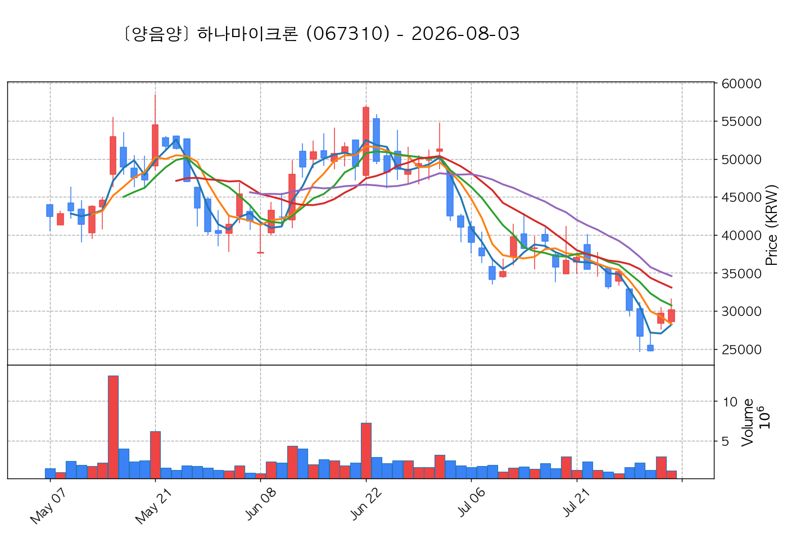
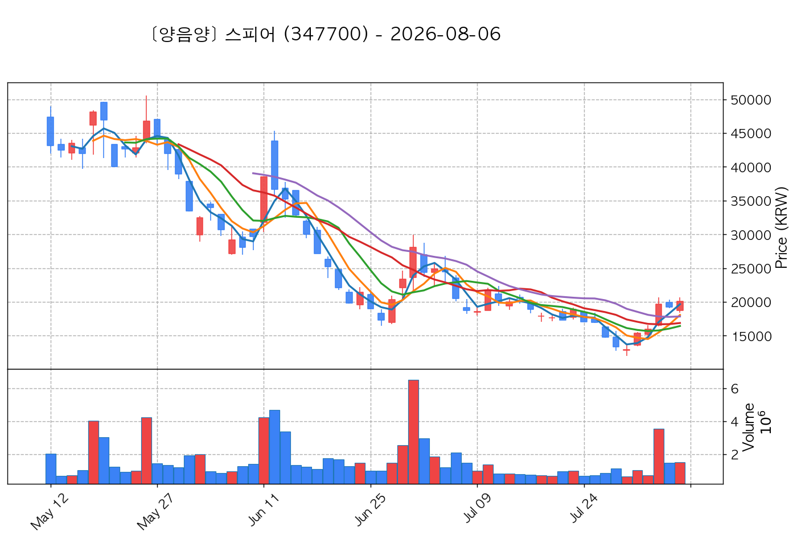
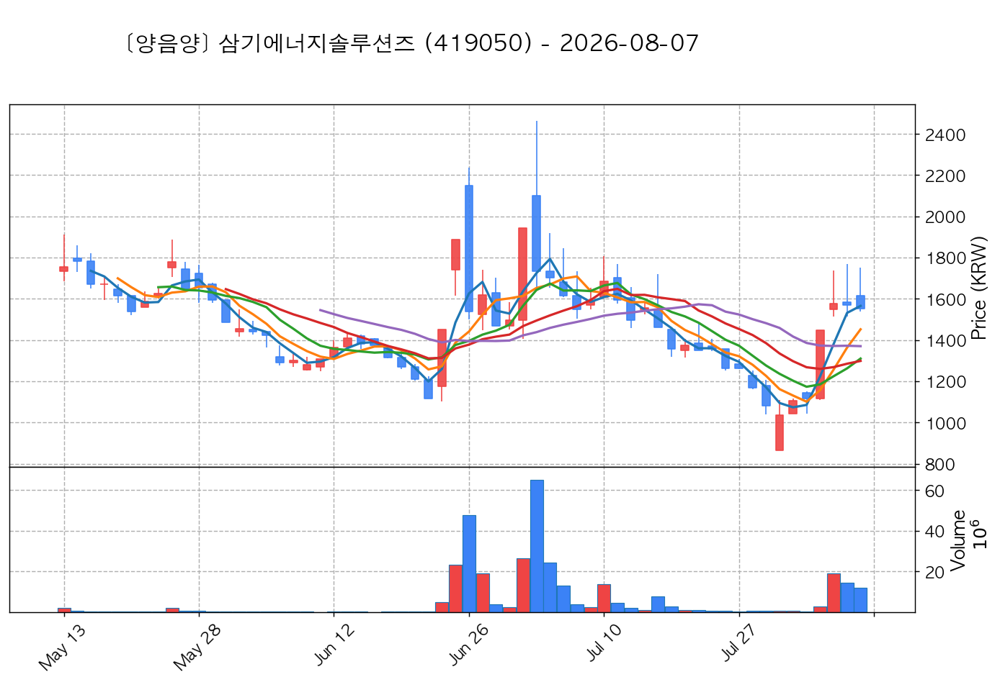

# 📈 [실전플랜 1] 2026-09-23 매매 후보 스크리닝 보고서

> 스크리닝 기준일: 2026-09-23 | [📊 익일 매매 성과 피드백 보고서 보기](./2026-09-23_피드백.html)

---

## 📊 1. 스크리닝 성과 요약

| 전략 | 주요 기법 | 종목수(TOP) |
| :--- | :--- | :---: |
| **전략 1** | 양음양 눌림목 & 사윗감 | 22개 (TOP 3개) |
| **전략 2** | 매집봉 & 이일홍 | 6개 (TOP 1개) |
| **전략 3** | 수급 & 핥 | 2개 (TOP 2개) |
| **합계** | **3대 핵심 전략 통합** | **30개 (TOP 6개)** |

---

## 🔵 3. 전략 1 — 양-음-양 눌림목 (3% × 3슬롯)

### 📋 전략 1 요약표 (상위 10개)

| 종목명 | 기준일종가 | 기준봉 | 지지선 | 비고 및 선정 상태 |
| :--- | ---: | :--- | :---: | :--- |
| **성호전자** (043260) | 26,100원 | +18.9% 장대양봉 | 3일선 | **★ TOP 1 선택** |
| **가온전선** (000500) | 317,500원 | +22.0% 장대양봉 | 3일선 | **★ TOP 2 선택** |
| **삼미금속** (012210) | 12,430원 | +20.4% 장대양봉 | 3일선 | **★ TOP 3 선택** |
| **SFA반도체** (036540) | 10,490원 | +18.0% 장대양봉 | 3일선 | 후보군 (1위) (사윗감) |
| **하나마이크론** (067310) | 46,200원 | +17.1% 장대양봉 | 3일선 | 후보군 (2위) (사윗감) |
| **한켐** (457370) | 11,270원 | +26.6% 장대양봉 | 3일선 | 후보군 (3위) |
| **에스피지** (058610) | 100,700원 | +19.7% 장대양봉 | 3일선 | 후보군 (4위) |
| **와이씨** (232140) | 14,150원 | +19.5% 장대양봉 | 3일선 | 후보군 (5위) (사윗감) |
| **한국첨단소재** (062970) | 3,060원 | 상한가 | 5일선 | 후보군 (6위) (사윗감) |
| **스피어** (347700) | 23,200원 | +18.4% 장대양봉 | 3일선 | 후보군 (7위) |

---

### 🔍 전략 1 상세 분석

#### 1) 성호전자 (043260) — ★ TOP 1 선택

- **기준 종가**: 26,100원 | **거래대금**: 576억
- **분석 사유**: 과거 2026-09-18 기준봉 후 현재 3일선 지지

#### 2) 가온전선 (000500) — ★ TOP 2 선택

- **기준 종가**: 317,500원 | **거래대금**: 420억
- **분석 사유**: 과거 2026-09-18 기준봉 후 현재 3일선 지지

#### 3) 삼미금속 (012210) — ★ TOP 3 선택

- **기준 종가**: 12,430원 | **거래대금**: 300억
- **분석 사유**: 과거 2026-09-22 기준봉 후 현재 3일선 지지

#### 4) SFA반도체 (036540) — 후보군 (1위) (사윗감)

- **기준 종가**: 10,490원 | **거래대금**: 575억
- **분석 사유**: 과거 2026-09-21 기준봉 후 현재 3일선 지지

#### 5) 하나마이크론 (067310) — 후보군 (2위) (사윗감)

- **기준 종가**: 46,200원 | **거래대금**: 680억
- **분석 사유**: 과거 2026-09-21 기준봉 후 현재 3일선 지지

#### 6) 한켐 (457370) — 후보군 (3위)

- **기준 종가**: 11,270원 | **거래대금**: 32억
- **분석 사유**: 과거 2026-09-17 기준봉 후 현재 3일선 지지

#### 7) 에스피지 (058610) — 후보군 (4위)

- **기준 종가**: 100,700원 | **거래대금**: 333억
- **분석 사유**: 🚨[매물대 저항] 과거 2026-09-15 기준봉 후 현재 3일선 지지

#### 8) 와이씨 (232140) — 후보군 (5위) (사윗감)

- **기준 종가**: 14,150원 | **거래대금**: 224억
- **분석 사유**: 과거 2026-09-21 기준봉 후 현재 3일선 지지

#### 9) 한국첨단소재 (062970) — 후보군 (6위) (사윗감)

- **기준 종가**: 3,060원 | **거래대금**: 93억
- **분석 사유**: 🚨[매물대 저항] 과거 2026-09-15 기준봉 후 현재 5일선 지지

#### 10) 스피어 (347700) — 후보군 (7위)

- **기준 종가**: 23,200원 | **거래대금**: 394억
- **분석 사유**: 과거 2026-09-17 기준봉 후 현재 3일선 지지

## 🟡 4. 전략 2 — 일일봉 매집봉 (10% × 1슬롯)

### 📋 전략 2 요약표 (상위 6개)

| 종목명 | 기준일종가 | 기준봉 | 지지선 | 비고 및 선정 상태 |
| :--- | ---: | :--- | :---: | :--- |
| **삼기에너지솔루션즈** (419050) | 1,953원 | ★ [1순위 키움정석] 40일 최고가 근접 + 60일선 상승 + 시가대비 +21.8% 속양봉 | 240일선 | **★ TOP 1 선택** |
| **한국알콜** (017890) | 15,420원 | ★ [1순위 키움정석] 40일 최고가 근접 + 60일선 상승 + 시가대비 +7.1% 속양봉 | 240일선 | 후보군 (1위) |
| **원익홀딩스** (030530) | 28,250원 | 과거 2026-08-28 매집봉 ➔ 240일선 근접 지지 (+0.32%) | 240일선 | 후보군 (2위) |
| **토마토시스템** (393210) | 4,185원 | 과거 2026-08-13 매집봉 ➔ 240일선 근접 지지 (+0.66%) | 240일선 | 후보군 (3위) |
| **한화** (000880) | 129,900원 | 과거 2026-08-25 매집봉 ➔ 240일선 근접 지지 (+1.52%) | 240일선 | 후보군 (4위) |
| **샌즈랩** (411080) | 6,370원 | 과거 2026-08-12 매집봉 ➔ 240일선 근접 지지 (+0.22%) | 240일선 | 후보군 (5위) |

---

### 🔍 전략 2 상세 분석

#### 1) 삼기에너지솔루션즈 (419050) — ★ TOP 1 선택

- **기준 종가**: 1,953원 | **거래대금**: 655억
- **분석 사유**: ★ [1순위 키움정석] 40일 최고가 근접 + 60일선 상승 + 시가대비 +21.8% 속양봉

#### 2) 한국알콜 (017890) — 후보군 (1위)

- **기준 종가**: 15,420원 | **거래대금**: 36억
- **분석 사유**: ★ [1순위 키움정석] 40일 최고가 근접 + 60일선 상승 + 시가대비 +7.1% 속양봉

#### 3) 원익홀딩스 (030530) — 후보군 (2위)

- **기준 종가**: 28,250원 | **거래대금**: 1801억
- **분석 사유**: 과거 2026-08-28 매집봉 ➔ 240일선 근접 지지 (+0.32%)

#### 4) 토마토시스템 (393210) — 후보군 (3위)

- **기준 종가**: 4,185원 | **거래대금**: 510억
- **분석 사유**: 과거 2026-08-13 매집봉 ➔ 240일선 근접 지지 (+0.66%)

#### 5) 한화 (000880) — 후보군 (4위)

- **기준 종가**: 129,900원 | **거래대금**: 60억
- **분석 사유**: 과거 2026-08-25 매집봉 ➔ 240일선 근접 지지 (+1.52%)

#### 6) 샌즈랩 (411080) — 후보군 (5위)

- **기준 종가**: 6,370원 | **거래대금**: 39억
- **분석 사유**: 과거 2026-08-12 매집봉 ➔ 240일선 근접 지지 (+0.22%)

## 🟢 5. 전략 3 — 수급 낙폭과대 바닥형 (10% × 2슬롯)

### 📋 전략 3 요약표 (상위 2개)

| 종목명 | 기준일종가 | 기준봉 | 지지선 | 비고 및 선정 상태 |
| :--- | ---: | :--- | :---: | :--- |
| **현대제철** (004020) | 31,750원 | 52주 고점 대비 (63.0%) ➔ 20일 메이저 수급 100억+ 유입 ➔ 없음 지지 안착 | 수급선 | **★ TOP 1 선택** |
| **롯데쇼핑** (023530) | 103,700원 | 52주 고점 대비 (49.1%) ➔ 20일 메이저 수급 100억+ 유입 ➔ 240일선 지지 안착 | 수급선 | **★ TOP 2 선택** |

---

### 🔍 전략 3 상세 분석

#### 1) 현대제철 (004020) — ★ TOP 1 선택

- **기준 종가**: 31,750원 | **거래대금**: 341억
- **분석 사유**: 52주 고점 대비 (63.0%) ➔ 20일 메이저 수급 100억+ 유입 ➔ 없음 지지 안착

#### 2) 롯데쇼핑 (023530) — ★ TOP 2 선택

- **기준 종가**: 103,700원 | **거래대금**: 95억
- **분석 사유**: 52주 고점 대비 (49.1%) ➔ 20일 메이저 수급 100억+ 유입 ➔ 240일선 지지 안착

