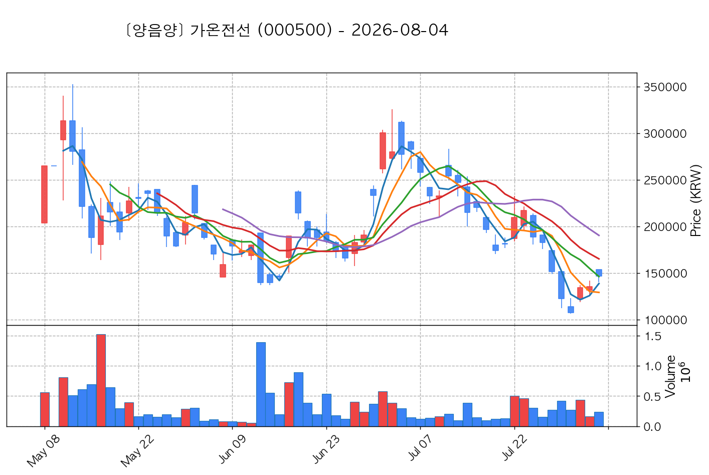
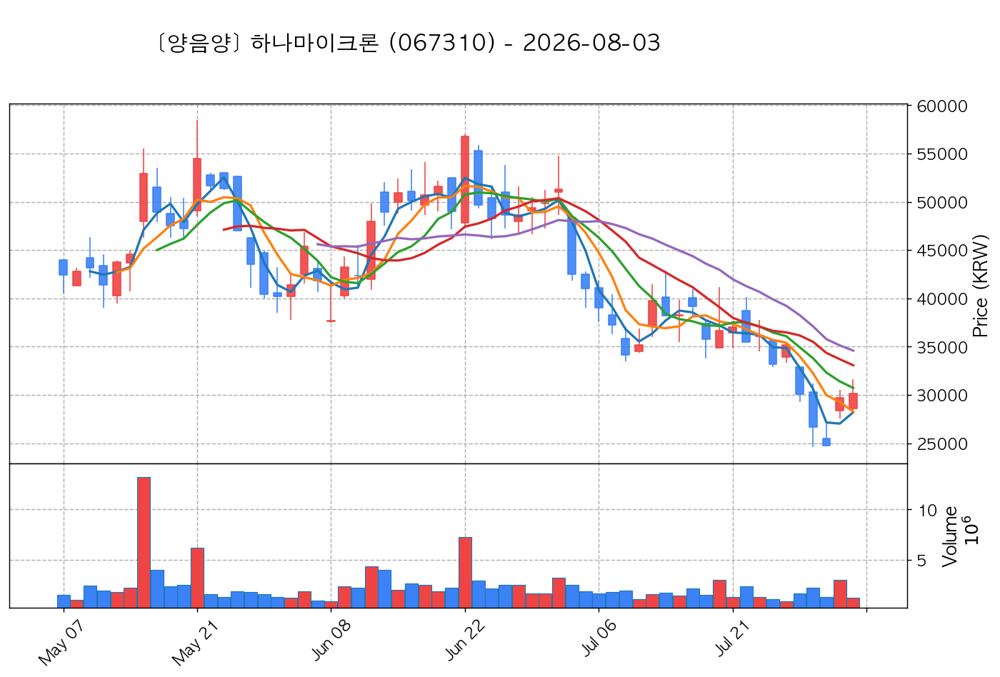
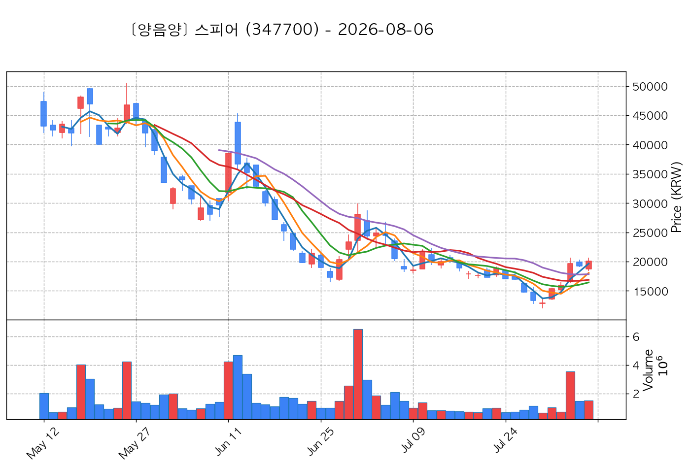

# 📈 [실전플랜 1] 2026-09-29 매매 후보 스크리닝 보고서

> 스크리닝 기준일: 2026-09-29 | [📊 익일 매매 성과 피드백 보고서 보기](./2026-09-29_피드백.html)

---

## 📊 1. 스크리닝 성과 요약

| 전략 | 주요 기법 | 종목수(TOP) |
| :--- | :--- | :---: |
| **전략 1** | 양음양 눌림목 & 사윗감 | 19개 (TOP 3개) |
| **전략 2** | 매집봉 & 이일홍 | 8개 (TOP 1개) |
| **전략 3** | 수급 & 핥 | 0개 (TOP 0개) |
| **합계** | **3대 핵심 전략 통합** | **27개 (TOP 4개)** |

---

## 🔵 3. 전략 1 — 양-음-양 눌림목 (3% × 3슬롯)

### 📋 전략 1 요약표 (상위 10개)

| 종목명 | 기준일종가 | 기준봉 | 지지선 | 비고 및 선정 상태 |
| :--- | ---: | :--- | :---: | :--- |
| **가온전선** (000500) | 315,000원 | +22.0% 장대양봉 | 3일선 | **★ TOP 1 선택** |
| **한화솔루션** (009830) | 32,250원 | +16.5% 장대양봉 | 3일선 | **★ TOP 2 선택** |
| **SFA반도체** (036540) | 10,380원 | +18.0% 장대양봉 | 3일선 | **★ TOP 3 선택** (사윗감) |
| **하나마이크론** (067310) | 46,100원 | +17.1% 장대양봉 | 3일선 | 후보군 (1위) (사윗감) |
| **와이씨** (232140) | 14,110원 | +19.5% 장대양봉 | 3일선 | 후보군 (2위) (사윗감) |
| **스피어** (347700) | 21,150원 | +18.4% 장대양봉 | 13일선 | 후보군 (3위) |
| **티이엠씨** (425040) | 13,320원 | +27.1% 장대양봉 | 3일선 | 후보군 (4위) |
| **티엘비** (356860) | 45,300원 | +16.0% 장대양봉 | 3일선 | 후보군 (5위) |
| **동국생명과학** (303810) | 3,000원 | +19.9% 장대양봉 | 3일선 | 후보군 (6위) |
| **한화시스템** (272210) | 71,300원 | +15.5% 장대양봉 | 3일선 | 후보군 (7위) |

---

### 🔍 전략 1 상세 분석

#### 1) 가온전선 (000500) — ★ TOP 1 선택

- **기준 종가**: 315,000원 | **거래대금**: 364억
- **분석 사유**: 과거 2026-09-18 기준봉 후 현재 3일선 지지

#### 2) 한화솔루션 (009830) — ★ TOP 2 선택

- **기준 종가**: 32,250원 | **거래대금**: 1448억
- **분석 사유**: 과거 2026-09-28 기준봉 후 현재 3일선 지지

#### 3) SFA반도체 (036540) — ★ TOP 3 선택 (사윗감)

- **기준 종가**: 10,380원 | **거래대금**: 320억
- **분석 사유**: 과거 2026-09-21 기준봉 후 현재 3일선 지지

#### 4) 하나마이크론 (067310) — 후보군 (1위) (사윗감)

- **기준 종가**: 46,100원 | **거래대금**: 493억
- **분석 사유**: 과거 2026-09-21 기준봉 후 현재 3일선 지지

#### 5) 와이씨 (232140) — 후보군 (2위) (사윗감)

- **기준 종가**: 14,110원 | **거래대금**: 192억
- **분석 사유**: 과거 2026-09-21 기준봉 후 현재 3일선 지지

#### 6) 스피어 (347700) — 후보군 (3위)

- **기준 종가**: 21,150원 | **거래대금**: 172억
- **분석 사유**: 🚨[매물대 저항] [쌍바닥참고] 과거 2026-09-17 기준봉 후 현재 13일선 지지

#### 7) 티이엠씨 (425040) — 후보군 (4위)

- **기준 종가**: 13,320원 | **거래대금**: 78억
- **분석 사유**: 과거 2026-09-21 기준봉 후 현재 3일선 지지

#### 8) 티엘비 (356860) — 후보군 (5위)

- **기준 종가**: 45,300원 | **거래대금**: 222억
- **분석 사유**: 과거 2026-09-22 기준봉 후 현재 3일선 지지

#### 9) 동국생명과학 (303810) — 후보군 (6위)

- **기준 종가**: 3,000원 | **거래대금**: 129억
- **분석 사유**: 🚨[매물대 저항] 과거 2026-09-28 기준봉 후 현재 3일선 지지

#### 10) 한화시스템 (272210) — 후보군 (7위)

- **기준 종가**: 71,300원 | **거래대금**: 199억
- **분석 사유**: 🔥[20선 이탈 반등] 과거 2026-09-17 기준봉 후 현재 3일선 지지

## 🟡 4. 전략 2 — 일일봉 매집봉 (10% × 1슬롯)

### 📋 전략 2 요약표 (상위 8개)

| 종목명 | 기준일종가 | 기준봉 | 지지선 | 비고 및 선정 상태 |
| :--- | ---: | :--- | :---: | :--- |
| **노브랜드** (145170) | 3,290원 | ★ [1순위 키움정석] 40일 최고가 근접 + 60일선 상승 + 시가대비 +14.6% 속양봉 | 240일선 | **★ TOP 1 선택** |
| **코렌텍** (104540) | 4,340원 | ★ [1순위 키움정석] 40일 최고가 근접 + 60일선 상승 + 시가대비 +6.9% 속양봉 | 240일선 | 후보군 (1위) |
| **성호전자** (043260) | 23,550원 | 과거 2026-09-18 매집봉 ➔ 240일선 근접 지지 (+2.63%) | 240일선 | 후보군 (2위) |
| **미투온** (201490) | 3,365원 | 과거 2026-08-24 매집봉 ➔ 240일선 근접 지지 (+2.18%) | 240일선 | 후보군 (3위) |
| **한화** (000880) | 126,100원 | 과거 2026-08-25 매집봉 ➔ 240일선 근접 지지 (-1.63%) | 240일선 | 후보군 (4위) |
| **케이씨에스** (115500) | 10,500원 | 과거 2026-09-11 매집봉 ➔ 240일선 근접 지지 (-1.11%) | 240일선 | 후보군 (5위) |
| **지투파워** (388050) | 9,680원 | 과거 2026-08-14 매집봉 ➔ 240일선 근접 지지 (+0.40%) | 240일선 | 후보군 (6위) |
| **한컴위드** (054920) | 4,645원 | 과거 2026-09-11 매집봉 ➔ 240일선 근접 지지 (+2.48%) | 240일선 | 후보군 (7위) |

---

### 🔍 전략 2 상세 분석

#### 1) 노브랜드 (145170) — ★ TOP 1 선택

- **기준 종가**: 3,290원 | **거래대금**: 124억
- **분석 사유**: ★ [1순위 키움정석] 40일 최고가 근접 + 60일선 상승 + 시가대비 +14.6% 속양봉

#### 2) 코렌텍 (104540) — 후보군 (1위)

- **기준 종가**: 4,340원 | **거래대금**: 98억
- **분석 사유**: ★ [1순위 키움정석] 40일 최고가 근접 + 60일선 상승 + 시가대비 +6.9% 속양봉

#### 3) 성호전자 (043260) — 후보군 (2위)

- **기준 종가**: 23,550원 | **거래대금**: 462억
- **분석 사유**: 과거 2026-09-18 매집봉 ➔ 240일선 근접 지지 (+2.63%)

#### 4) 미투온 (201490) — 후보군 (3위)

- **기준 종가**: 3,365원 | **거래대금**: 67억
- **분석 사유**: 과거 2026-08-24 매집봉 ➔ 240일선 근접 지지 (+2.18%)

#### 5) 한화 (000880) — 후보군 (4위)

- **기준 종가**: 126,100원 | **거래대금**: 65억
- **분석 사유**: 과거 2026-08-25 매집봉 ➔ 240일선 근접 지지 (-1.63%)

#### 6) 케이씨에스 (115500) — 후보군 (5위)

- **기준 종가**: 10,500원 | **거래대금**: 28억
- **분석 사유**: 과거 2026-09-11 매집봉 ➔ 240일선 근접 지지 (-1.11%)

#### 7) 지투파워 (388050) — 후보군 (6위)

- **기준 종가**: 9,680원 | **거래대금**: 26억
- **분석 사유**: 과거 2026-08-14 매집봉 ➔ 240일선 근접 지지 (+0.40%)

#### 8) 한컴위드 (054920) — 후보군 (7위)

- **기준 종가**: 4,645원 | **거래대금**: 22억
- **분석 사유**: 과거 2026-09-11 매집봉 ➔ 240일선 근접 지지 (+2.48%)

## 🟢 5. 전략 3 — 수급 낙폭과대 바닥형 (10% × 2슬롯)

해당 전략 포착 종목 없음

