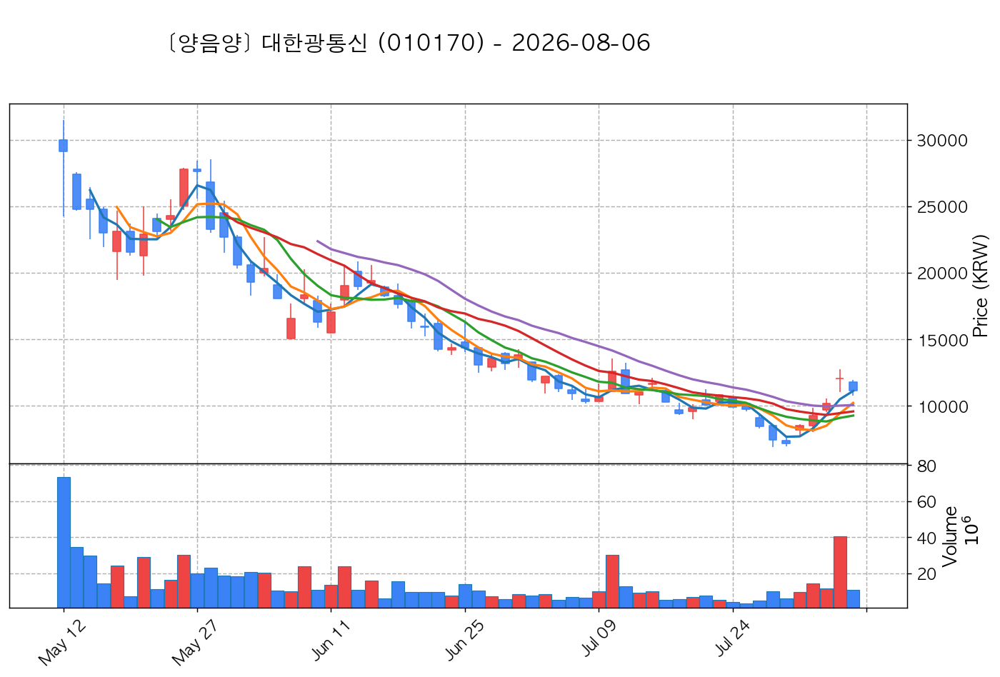

# 📈 [실전플랜 1] 2026-09-30 매매 후보 스크리닝 보고서

> 스크리닝 기준일: 2026-09-30 | [📊 익일 매매 성과 피드백 보고서 보기](./2026-09-30_피드백.html)

---

## 📊 1. 스크리닝 성과 요약

| 전략 | 주요 기법 | 종목수(TOP) |
| :--- | :--- | :---: |
| **전략 1** | 양음양 눌림목 & 사윗감 | 19개 (TOP 3개) |
| **전략 2** | 매집봉 & 이일홍 | 7개 (TOP 1개) |
| **전략 3** | 수급 & 핥 | 0개 (TOP 0개) |
| **합계** | **3대 핵심 전략 통합** | **26개 (TOP 4개)** |

---

## 🔵 3. 전략 1 — 양-음-양 눌림목 (3% × 3슬롯)

### 📋 전략 1 요약표 (상위 10개)

| 종목명 | 기준일종가 | 기준봉 | 지지선 | 비고 및 선정 상태 |
| :--- | ---: | :--- | :---: | :--- |
| **성호전자** (043260) | 26,250원 | +18.9% 장대양봉 | 5일선 | **★ TOP 1 선택** |
| **가온전선** (000500) | 315,500원 | +22.0% 장대양봉 | 3일선 | **★ TOP 2 선택** |
| **한화솔루션** (009830) | 34,100원 | +16.5% 장대양봉 | 3일선 | **★ TOP 3 선택** |
| **삼미금속** (012210) | 12,210원 | +20.4% 장대양봉 | 3일선 | 후보군 (1위) |
| **SFA반도체** (036540) | 10,750원 | +18.0% 장대양봉 | 3일선 | 후보군 (2위) (사윗감) |
| **코리아써키트** (007810) | 74,200원 | +25.5% 장대양봉 | 3일선 | 후보군 (3위) |
| **레메디** (387690) | 19,680원 | +26.2% 장대양봉 | 5일선 | 후보군 (4위) |
| **대한광통신** (010170) | 16,700원 | ADK특 13~20선 반등 | 13일선 (1.92%) | 후보군 (5위) |
| **티엘비** (356860) | 45,650원 | +16.0% 장대양봉 | 3일선 | 후보군 (6위) |
| **현대바이오랜드** (052260) | 5,320원 | +25.0% 장대양봉 | 3일선 | 후보군 (7위) |

---

### 🔍 전략 1 상세 분석

#### 1) 성호전자 (043260) — ★ TOP 1 선택

- **기준 종가**: 26,250원 | **거래대금**: 1323억
- **분석 사유**: 과거 2026-09-18 기준봉 후 현재 5일선 지지

#### 2) 가온전선 (000500) — ★ TOP 2 선택

- **기준 종가**: 315,500원 | **거래대금**: 292억
- **분석 사유**: 과거 2026-09-18 기준봉 후 현재 3일선 지지

#### 3) 한화솔루션 (009830) — ★ TOP 3 선택

- **기준 종가**: 34,100원 | **거래대금**: 1822억
- **분석 사유**: 과거 2026-09-28 기준봉 후 현재 3일선 지지

#### 4) 삼미금속 (012210) — 후보군 (1위)

- **기준 종가**: 12,210원 | **거래대금**: 541억
- **분석 사유**: 과거 2026-09-22 기준봉 후 현재 3일선 지지

#### 5) SFA반도체 (036540) — 후보군 (2위) (사윗감)

- **기준 종가**: 10,750원 | **거래대금**: 497억
- **분석 사유**: 과거 2026-09-21 기준봉 후 현재 3일선 지지

#### 6) 코리아써키트 (007810) — 후보군 (3위)

- **기준 종가**: 74,200원 | **거래대금**: 264억
- **분석 사유**: 과거 2026-09-22 기준봉 후 현재 3일선 지지

#### 7) 레메디 (387690) — 후보군 (4위)

- **기준 종가**: 19,680원 | **거래대금**: 123억
- **분석 사유**: 과거 2026-09-28 기준봉 후 현재 5일선 지지

#### 8) 대한광통신 (010170) — 후보군 (5위)

- **기준 종가**: 16,700원 | **거래대금**: 869억
- **분석 사유**: ★ [ADK특 TOP1] 20봉내 400억+ Envelope상한 돌파 후 13일선 1.92% 이격 초근접 반등

#### 9) 티엘비 (356860) — 후보군 (6위)

- **기준 종가**: 45,650원 | **거래대금**: 165억
- **분석 사유**: 과거 2026-09-22 기준봉 후 현재 3일선 지지

#### 10) 현대바이오랜드 (052260) — 후보군 (7위)

- **기준 종가**: 5,320원 | **거래대금**: 565억
- **분석 사유**: 🌪️ [C타입 갭상승털기] 기준봉 익일 갭상승 후 음봉 손바꿈 (기준봉 50% 사수)

## 🟡 4. 전략 2 — 일일봉 매집봉 (10% × 1슬롯)

### 📋 전략 2 요약표 (상위 7개)

| 종목명 | 기준일종가 | 기준봉 | 지지선 | 비고 및 선정 상태 |
| :--- | ---: | :--- | :---: | :--- |
| **글로벌에스엠** (900070) | 1,194원 | ★ [1순위 키움정석] 40일 최고가 근접 + 60일선 상승 + 시가대비 +20.9% 속양봉 | 240일선 | **★ TOP 1 선택** |
| **헬릭스미스** (084990) | 3,775원 | ★ [1순위 키움정석] 40일 최고가 근접 + 60일선 상승 + 시가대비 +17.6% 속양봉 | 240일선 | 후보군 (1위) |
| **동일스틸럭스** (023790) | 1,764원 | ★ [1순위 키움정석] 40일 최고가 근접 + 60일선 상승 + 시가대비 +21.7% 속양봉 | 240일선 | 후보군 (2위) |
| **한전기술** (052690) | 122,700원 | 과거 2026-08-26 매집봉 ➔ 240일선 근접 지지 (-1.87%) | 240일선 | 후보군 (3위) |
| **파인엠텍** (441270) | 9,290원 | 과거 2026-09-03 매집봉 ➔ 240일선 근접 지지 (+2.36%) | 240일선 | 후보군 (4위) |
| **한화** (000880) | 125,400원 | 과거 2026-08-25 매집봉 ➔ 240일선 근접 지지 (-2.26%) | 240일선 | 후보군 (5위) |
| **녹십자웰빙** (234690) | 9,870원 | 과거 2026-09-03 매집봉 ➔ 240일선 근접 지지 (+1.06%) | 240일선 | 후보군 (6위) |

---

### 🔍 전략 2 상세 분석

#### 1) 글로벌에스엠 (900070) — ★ TOP 1 선택

- **기준 종가**: 1,194원 | **거래대금**: 107억
- **분석 사유**: ★ [1순위 키움정석] 40일 최고가 근접 + 60일선 상승 + 시가대비 +20.9% 속양봉

#### 2) 헬릭스미스 (084990) — 후보군 (1위)

- **기준 종가**: 3,775원 | **거래대금**: 78억
- **분석 사유**: ★ [1순위 키움정석] 40일 최고가 근접 + 60일선 상승 + 시가대비 +17.6% 속양봉

#### 3) 동일스틸럭스 (023790) — 후보군 (2위)

- **기준 종가**: 1,764원 | **거래대금**: 56억
- **분석 사유**: ★ [1순위 키움정석] 40일 최고가 근접 + 60일선 상승 + 시가대비 +21.7% 속양봉

#### 4) 한전기술 (052690) — 후보군 (3위)

- **기준 종가**: 122,700원 | **거래대금**: 184억
- **분석 사유**: 과거 2026-08-26 매집봉 ➔ 240일선 근접 지지 (-1.87%)

#### 5) 파인엠텍 (441270) — 후보군 (4위)

- **기준 종가**: 9,290원 | **거래대금**: 169억
- **분석 사유**: 과거 2026-09-03 매집봉 ➔ 240일선 근접 지지 (+2.36%)

#### 6) 한화 (000880) — 후보군 (5위)

- **기준 종가**: 125,400원 | **거래대금**: 94억
- **분석 사유**: 과거 2026-08-25 매집봉 ➔ 240일선 근접 지지 (-2.26%)

#### 7) 녹십자웰빙 (234690) — 후보군 (6위)

- **기준 종가**: 9,870원 | **거래대금**: 32억
- **분석 사유**: 과거 2026-09-03 매집봉 ➔ 240일선 근접 지지 (+1.06%)

## 🟢 5. 전략 3 — 수급 낙폭과대 바닥형 (10% × 2슬롯)

해당 전략 포착 종목 없음

