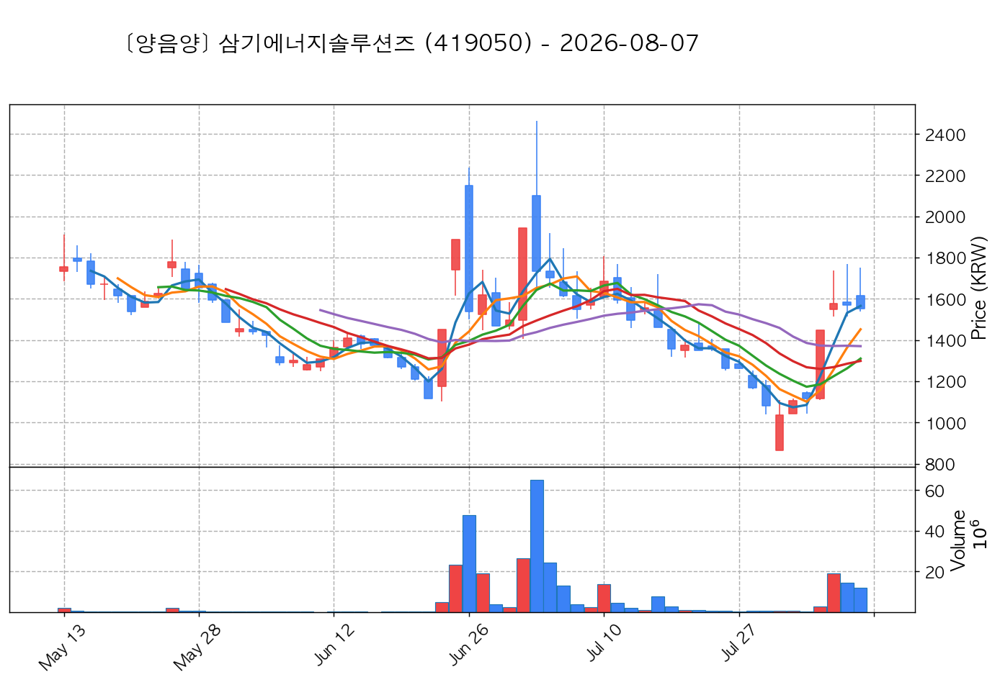
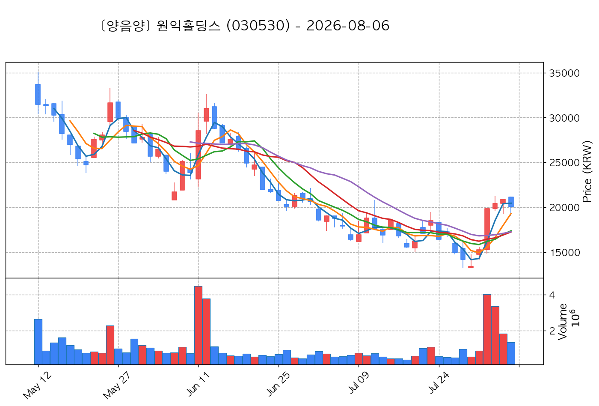

# 📈 [실전플랜 1] 2026-10-01 매매 후보 스크리닝 보고서

> 스크리닝 기준일: 2026-10-01 | [📊 익일 매매 성과 피드백 보고서 보기](./2026-10-01_피드백.html)

---

## 📊 1. 스크리닝 성과 요약

| 전략 | 주요 기법 | 종목수(TOP) |
| :--- | :--- | :---: |
| **전략 1** | 양음양 눌림목 & 사윗감 | 15개 (TOP 3개) |
| **전략 2** | 매집봉 & 이일홍 | 12개 (TOP 1개) |
| **전략 3** | 수급 & 핥 | 0개 (TOP 0개) |
| **합계** | **3대 핵심 전략 통합** | **27개 (TOP 4개)** |

---

## 🔵 3. 전략 1 — 양-음-양 눌림목 (3% × 3슬롯)

### 📋 전략 1 요약표 (상위 10개)

| 종목명 | 기준일종가 | 기준봉 | 지지선 | 비고 및 선정 상태 |
| :--- | ---: | :--- | :---: | :--- |
| **삼미금속** (012210) | 11,890원 | +20.4% 장대양봉 | 3일선 | **★ TOP 1 선택** |
| **SFA반도체** (036540) | 10,910원 | +18.0% 장대양봉 | 3일선 | **★ TOP 2 선택** (사윗감) |
| **레메디** (387690) | 19,380원 | +26.2% 장대양봉 | 3일선 | **★ TOP 3 선택** |
| **우리넷** (115440) | 11,730원 | +22.4% 장대양봉 | 3일선 | 후보군 (1위) (사윗감) |
| **금강철강** (053260) | 7,500원 | +23.8% 장대양봉 | 3일선 | 후보군 (2위) |
| **한국비엔씨** (256840) | 3,290원 | +29.2% 장대양봉 | 3일선 | 후보군 (3위) (사윗감) |
| **삼기에너지솔루션즈** (419050) | 1,803원 | +18.1% 장대양봉 | 3일선 | 후보군 (4위) |
| **아이씨티케이** (456010) | 23,300원 | +15.1% 장대양봉 | 3일선 | 후보군 (5위) |
| **노타** (486990) | 20,500원 | +28.9% 장대양봉 | 3일선 | 후보군 (6위) (사윗감) |
| **TCC스틸** (002710) | 13,990원 | 상한가 | 3일선 | 후보군 (7위) |

---

### 🔍 전략 1 상세 분석

#### 1) 삼미금속 (012210) — ★ TOP 1 선택

- **기준 종가**: 11,890원 | **거래대금**: 264억
- **분석 사유**: 🚨[매물대 저항] 과거 2026-09-22 기준봉 후 현재 3일선 지지

#### 2) SFA반도체 (036540) — ★ TOP 2 선택 (사윗감)

- **기준 종가**: 10,910원 | **거래대금**: 1452억
- **분석 사유**: 과거 2026-09-21 기준봉 후 현재 3일선 지지

#### 3) 레메디 (387690) — ★ TOP 3 선택

- **기준 종가**: 19,380원 | **거래대금**: 101억
- **분석 사유**: 과거 2026-09-28 기준봉 후 현재 3일선 지지

#### 4) 우리넷 (115440) — 후보군 (1위) (사윗감)

- **기준 종가**: 11,730원 | **거래대금**: 70억
- **분석 사유**: 과거 2026-09-23 기준봉 후 현재 3일선 지지

#### 5) 금강철강 (053260) — 후보군 (2위)

- **기준 종가**: 7,500원 | **거래대금**: 240억
- **분석 사유**: 🚨[매물대 저항] [쌍바닥참고] 과거 2026-09-30 기준봉 후 현재 3일선 지지

#### 6) 한국비엔씨 (256840) — 후보군 (3위) (사윗감)

- **기준 종가**: 3,290원 | **거래대금**: 132억
- **분석 사유**: 과거 2026-09-28 기준봉 후 현재 3일선 지지

#### 7) 삼기에너지솔루션즈 (419050) — 후보군 (4위)

- **기준 종가**: 1,803원 | **거래대금**: 72억
- **분석 사유**: 과거 2026-09-23 기준봉 후 현재 3일선 지지

#### 8) 아이씨티케이 (456010) — 후보군 (5위)

- **기준 종가**: 23,300원 | **거래대금**: 135억
- **분석 사유**: 과거 2026-09-28 기준봉 후 현재 3일선 지지

#### 9) 노타 (486990) — 후보군 (6위) (사윗감)

- **기준 종가**: 20,500원 | **거래대금**: 60억
- **분석 사유**: 과거 2026-09-22 기준봉 후 현재 3일선 지지

#### 10) TCC스틸 (002710) — 후보군 (7위)

- **기준 종가**: 13,990원 | **거래대금**: 268억
- **분석 사유**: 🌪️ [C타입 갭상승털기] 기준봉 익일 갭상승 후 음봉 손바꿈 (기준봉 50% 사수)

## 🟡 4. 전략 2 — 일일봉 매집봉 (10% × 1슬롯)

### 📋 전략 2 요약표 (상위 10개)

| 종목명 | 기준일종가 | 기준봉 | 지지선 | 비고 및 선정 상태 |
| :--- | ---: | :--- | :---: | :--- |
| **지투지바이오** (456160) | 44,950원 | ★ [1순위 키움정석] 40일 최고가 근접 + 60일선 상승 + 시가대비 +27.5% 속양봉 | 240일선 | **★ TOP 1 선택** |
| **파크시스템스** (140860) | 297,500원 | ★ [1순위 키움정석] 40일 최고가 근접 + 60일선 상승 + 시가대비 +9.4% 속양봉 | 240일선 | 후보군 (1위) |
| **조이시티** (067000) | 1,217원 | ★ [1순위 키움정석] 40일 최고가 근접 + 60일선 상승 + 시가대비 +5.8% 속양봉 | 240일선 | 후보군 (2위) |
| **세보엠이씨** (011560) | 25,950원 | ★ [1순위 키움정석] 40일 최고가 근접 + 60일선 상승 + 시가대비 +9.0% 속양봉 | 240일선 | 후보군 (3위) |
| **오스코텍** (039200) | 37,750원 | ★ [1순위 키움정석] 40일 최고가 근접 + 60일선 상승 + 시가대비 +6.6% 속양봉 | 240일선 | 후보군 (4위) |
| **지아이이노베이션** (358570) | 9,520원 | ★ [1순위 키움정석] 40일 최고가 근접 + 60일선 상승 + 시가대비 +17.4% 속양봉 | 240일선 | 후보군 (5위) |
| **한전기술** (052690) | 125,850원 | 과거 2026-08-26 매집봉 ➔ 240일선 근접 지지 (+0.51%) | 240일선 | 후보군 (6위) |
| **원익홀딩스** (030530) | 27,900원 | 과거 2026-08-28 매집봉 ➔ 240일선 근접 지지 (-1.64%) | 240일선 | 후보군 (7위) |
| **하이스틸** (071090) | 3,620원 | 과거 2026-08-07 매집봉 ➔ 240일선 근접 지지 (+1.07%) | 240일선 | 후보군 (8위) |
| **HB테크놀러지** (078150) | 2,305원 | 과거 2026-09-08 매집봉 ➔ 240일선 근접 지지 (+1.60%) | 240일선 | 후보군 (9위) |

---

### 🔍 전략 2 상세 분석

#### 1) 지투지바이오 (456160) — ★ TOP 1 선택

- **기준 종가**: 44,950원 | **거래대금**: 258억
- **분석 사유**: ★ [1순위 키움정석] 40일 최고가 근접 + 60일선 상승 + 시가대비 +27.5% 속양봉

#### 2) 파크시스템스 (140860) — 후보군 (1위)

- **기준 종가**: 297,500원 | **거래대금**: 176억
- **분석 사유**: ★ [1순위 키움정석] 40일 최고가 근접 + 60일선 상승 + 시가대비 +9.4% 속양봉

#### 3) 조이시티 (067000) — 후보군 (2위)

- **기준 종가**: 1,217원 | **거래대금**: 94억
- **분석 사유**: ★ [1순위 키움정석] 40일 최고가 근접 + 60일선 상승 + 시가대비 +5.8% 속양봉

#### 4) 세보엠이씨 (011560) — 후보군 (3위)

- **기준 종가**: 25,950원 | **거래대금**: 76억
- **분석 사유**: ★ [1순위 키움정석] 40일 최고가 근접 + 60일선 상승 + 시가대비 +9.0% 속양봉

#### 5) 오스코텍 (039200) — 후보군 (4위)

- **기준 종가**: 37,750원 | **거래대금**: 55억
- **분석 사유**: ★ [1순위 키움정석] 40일 최고가 근접 + 60일선 상승 + 시가대비 +6.6% 속양봉

#### 6) 지아이이노베이션 (358570) — 후보군 (5위)

- **기준 종가**: 9,520원 | **거래대금**: 54억
- **분석 사유**: ★ [1순위 키움정석] 40일 최고가 근접 + 60일선 상승 + 시가대비 +17.4% 속양봉

#### 7) 한전기술 (052690) — 후보군 (6위)

- **기준 종가**: 125,850원 | **거래대금**: 331억
- **분석 사유**: 과거 2026-08-26 매집봉 ➔ 240일선 근접 지지 (+0.51%)

#### 8) 원익홀딩스 (030530) — 후보군 (7위)

- **기준 종가**: 27,900원 | **거래대금**: 275억
- **분석 사유**: 과거 2026-08-28 매집봉 ➔ 240일선 근접 지지 (-1.64%)

#### 9) 하이스틸 (071090) — 후보군 (8위)

- **기준 종가**: 3,620원 | **거래대금**: 121억
- **분석 사유**: 과거 2026-08-07 매집봉 ➔ 240일선 근접 지지 (+1.07%)

#### 10) HB테크놀러지 (078150) — 후보군 (9위)

- **기준 종가**: 2,305원 | **거래대금**: 43억
- **분석 사유**: 과거 2026-09-08 매집봉 ➔ 240일선 근접 지지 (+1.60%)

## 🟢 5. 전략 3 — 수급 낙폭과대 바닥형 (10% × 2슬롯)

해당 전략 포착 종목 없음

